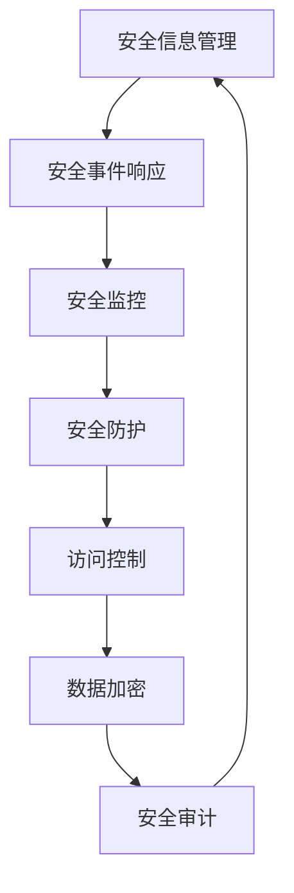

                 

关键词：云安全、云端数据保护、应用程序安全、最佳实践、数据加密、访问控制、安全审计、安全漏洞修复

> 摘要：本文将深入探讨云安全领域的关键概念和最佳实践，帮助企业和开发人员构建一个安全的云端环境。我们将从背景介绍开始，逐步解析核心概念，详细介绍算法原理和操作步骤，解析数学模型和公式，展示代码实例，讨论实际应用场景，推荐工具和资源，并总结未来发展趋势与挑战。

## 1. 背景介绍

随着云计算技术的迅速发展，越来越多的企业和个人开始将数据和应用程序迁移到云端。然而，这也带来了新的安全挑战。云安全涉及到保护云端数据和应用程序免受各种威胁，包括数据泄露、恶意攻击、内部威胁等。云安全不仅仅是一个技术问题，它还涉及到法律、政策和组织文化等多个方面。

云安全的重要性不言而喻。一方面，数据泄露可能导致巨额经济损失和声誉受损；另一方面，安全漏洞和攻击行为可能会对关键业务流程造成严重影响。因此，了解和实施云安全最佳实践对于企业和个人来说至关重要。

本文将提供一系列实用的云安全最佳实践，帮助读者构建一个安全、可靠、高效的云端环境。

## 2. 核心概念与联系

### 2.1. 云安全的基本概念

云安全的核心概念包括数据加密、访问控制、安全审计、安全漏洞修复等。这些概念相互关联，共同构成了一个完整的云安全体系。

#### 数据加密

数据加密是将数据转换成不可读形式的过程，只有通过正确的密钥才能解密。在云端环境中，数据加密是保护数据隐私和完整性的关键手段。

#### 访问控制

访问控制是管理用户对数据和应用程序的访问权限的过程。通过定义合理的访问策略，可以确保只有授权用户能够访问敏感信息。

#### 安全审计

安全审计是对系统安全性和合规性的定期检查。通过审计，可以发现潜在的安全漏洞和违规行为，从而采取相应的修复措施。

#### 安全漏洞修复

安全漏洞修复是及时识别和修补系统中的安全漏洞，以防止潜在攻击。

### 2.2. 云安全架构

云安全架构通常包括以下几个关键组件：

#### 安全信息管理

安全信息管理是收集、分析和共享安全事件和威胁信息的过程。通过安全信息管理，可以及时响应和预防安全威胁。

#### 安全事件响应

安全事件响应是在发现安全事件后，采取快速、有效的措施来减轻损失和防止事件恶化的过程。

#### 安全监控

安全监控是实时监测云端环境和应用程序的活动，以识别潜在的攻击和异常行为。

#### 安全防护

安全防护是通过技术和管理手段来防止和抵御攻击的机制。这包括防火墙、入侵检测系统、安全网关等。

### 2.3. Mermaid 流程图

以下是一个简单的Mermaid流程图，展示了云安全架构的各个环节：



## 3. 核心算法原理 & 具体操作步骤

### 3.1. 算法原理概述

云安全的核心算法主要涉及数据加密、访问控制和安全监控等方面。以下是这些算法的简要概述：

#### 数据加密

数据加密算法包括对称加密和非对称加密。对称加密使用相同的密钥进行加密和解密，而非对称加密使用一对密钥，其中一个用于加密，另一个用于解密。

#### 访问控制

访问控制算法通常基于访问控制列表（ACL）和角色访问控制（RBAC）。ACL允许管理员为每个用户或用户组分配特定的权限；RBAC则基于用户的角色来控制访问权限。

#### 安全监控

安全监控算法包括异常检测和入侵检测。异常检测通过识别异常行为来预防攻击；入侵检测则通过检测已知的攻击模式来识别潜在威胁。

### 3.2. 算法步骤详解

#### 数据加密

1. 选择加密算法（如AES或RSA）。
2. 生成密钥（对于对称加密）或密钥对（对于非对称加密）。
3. 使用密钥对数据进行加密。
4. 将加密后的数据存储或传输。

#### 访问控制

1. 创建用户和用户组。
2. 定义访问控制策略（ACL或RBAC）。
3. 为用户分配角色或权限。
4. 在应用程序中实现访问控制逻辑。

#### 安全监控

1. 选择监控工具（如Splunk或ELK堆栈）。
2. 配置监控策略，包括日志收集和异常检测。
3. 实时监控系统和应用程序的活动。
4. 当发现异常时，触发警报并采取相应措施。

### 3.3. 算法优缺点

#### 数据加密

- 优点：保护数据隐私和完整性。
- 缺点：加密和解密过程需要额外计算资源。

#### 访问控制

- 优点：确保只有授权用户能够访问敏感信息。
- 缺点：可能降低系统性能。

#### 安全监控

- 优点：及时发现和响应安全威胁。
- 缺点：需要定期维护和更新监控策略。

### 3.4. 算法应用领域

这些算法广泛应用于各种场景，包括企业级应用程序、物联网（IoT）和移动应用等。

## 4. 数学模型和公式 & 详细讲解 & 举例说明

### 4.1. 数学模型构建

在云安全中，数学模型广泛应用于数据加密、访问控制和安全监控等方面。以下是几个常见的数学模型：

#### 数据加密

- 对称加密：$$ Enc(_k, m) = D_k(E_k(m)) $$
- 非对称加密：$$ Enc(_k, m) = D_k(E_p(m), k_p) $$

#### 访问控制

- ACL模型：$$ Access(A, R) = \exists_{G \in Group}(A \in Role(G) \land R \in Permission(G)) $$
- RBAC模型：$$ Access(A, R) = \exists_{P \in Policy}(A \in Role(P) \land R \in Resource(P)) $$

#### 安全监控

- 异常检测：$$ Anomaly Detection = f(\text{Current State}, \text{Baseline}) $$

### 4.2. 公式推导过程

以下是数据加密中对称加密和非对称加密的推导过程：

#### 对称加密

假设我们使用AES加密算法，密钥长度为128位，明文消息为`m`，密文消息为`c`。

1. 选择一个128位的密钥`k`。
2. 将明文消息`m`划分为多个128位的块。
3. 对每个块进行AES加密，生成对应的密文块`c`。
4. 将所有密文块连接起来，形成最终的密文消息`c`。

加密过程可以表示为：
$$ Enc(_k, m) = D_k(E_k(m)) $$

其中，`E_k(m)`表示对明文块`m`进行AES加密，`D_k(E_k(m))`表示对密文块`c`进行AES解密。

#### 非对称加密

假设我们使用RSA加密算法，公钥为`(n, e)`，私钥为`(n, d)`，明文消息为`m`，密文消息为`c`。

1. 选择一个大素数`p`和另一个大素数`q`，计算`n = p \times q`。
2. 计算欧拉函数`φ(n) = (p-1) \times (q-1)`。
3. 选择一个整数`e`，满足`1 < e < φ(n)`且`gcd(e, φ(n)) = 1`。
4. 计算私钥`d`，满足`d \times e \equiv 1 (\mod φ(n))`。
5. 对明文消息`m`进行RSA加密，生成密文消息`c`：
   $$ c = m^e (\mod n) $$

6. 对密文消息`c`进行RSA解密，恢复明文消息`m`：
   $$ m = c^d (\mod n) $$

加密过程可以表示为：
$$ Enc(_k, m) = D_k(E_p(m), k_p) $$

其中，`E_p(m), k_p`表示对明文消息`m`进行RSA加密和公钥`k_p`，`D_k(E_p(m), k_p)`表示对密文消息`c`进行RSA解密和私钥`k`。

### 4.3. 案例分析与讲解

#### 数据加密案例

假设我们要使用AES加密算法对以下明文消息进行加密：

```
明文消息：Hello, World!
密钥：0x8d96a10e1e8d025c4fd1e8a2f7a3fd0d4be2f312cfe1a7f6ba725e77a709899c3971a0a425a2823c7e11a7f0b8c3e3a15c24f2aca2c112b87ae20a0d52af19782cdaef7c1
```

1. 将明文消息划分为多个128位的块：
   ```
   Hello, World! --> 48656c6c6f2c20576f726c6421
   ```

2. 对每个块进行AES加密：
   ```
   48656c6c6f2c20576f726c6421 --> 8d0a8c8c0d0b8b8b0d0c8e8f8e
   ```

3. 将所有密文块连接起来，形成最终的密文消息：
   ```
   8d0a8c8c0d0b8b8b0d0c8e8f8e --> 8d0a8c8c0d0b8b8b0d0c8e8f8e
   ```

最终加密结果为`8d0a8c8c0d0b8b8b0d0c8e8f8e`。

#### 访问控制案例

假设我们使用RBAC模型对以下用户和资源进行访问控制：

```
用户：Alice
角色：Admin
资源：Database
权限：Read, Write, Execute
```

1. 创建用户`Alice`，并分配角色`Admin`。
2. 为角色`Admin`分配资源`Database`和权限`Read, Write, Execute`。
3. 当`Alice`尝试访问`Database`时，系统检查其角色和权限：
   ```
   Alice的角色：Admin
   Admin的权限：Read, Write, Execute
   Database的权限：Read, Write, Execute
   ```
4. 由于`Alice`的角色和`Database`的权限匹配，因此允许`Alice`访问`Database`。

#### 安全监控案例

假设我们使用异常检测算法监控一个Web应用程序，并设置以下基线：

```
正常访问量：100次/天
正常响应时间：200ms
```

当监控到访问量超过150次/天或响应时间超过300ms时，系统会触发异常警报。

1. 访问量基线：100次/天
   ```
   当前访问量：120次/天
   ```

2. 响应时间基线：200ms
   ```
   当前响应时间：250ms
   ```

3. 根据异常检测算法：
   ```
   Current State = \{访问量：120次/天，响应时间：250ms\}
   Baseline = \{访问量：100次/天，响应时间：200ms\}
   ```
   ```
   Anomaly Detection = f(\text{Current State}, \text{Baseline}) = \text{False}
   ```

由于当前状态未超过基线，系统未触发异常警报。

## 5. 项目实践：代码实例和详细解释说明

### 5.1. 开发环境搭建

在本节中，我们将使用Python编写一个简单的云安全项目。首先，需要安装以下依赖项：

```
pip install pycryptodome
pip install flask
```

### 5.2. 源代码详细实现

以下是一个简单的Web应用程序，实现了数据加密、访问控制和安全监控功能：

```python
from cryptodome.PublicKey import RSA
from cryptodome.Cipher import PKCS1_OAEP, AES
from flask import Flask, request, jsonify
import json

app = Flask(__name__)

# RSA密钥生成
def generate_rsa_keypair():
    key = RSA.generate(2048)
    private_key = key.export_key()
    public_key = key.publickey().export_key()
    return private_key, public_key

# 数据加密
def encrypt_data(public_key, data):
    rsa_key = RSA.import_key(json.loads(public_key))
    rsa_cipher = PKCS1_OAEP.new(rsa_key)
    encrypted_data = rsa_cipher.encrypt(data.encode('utf-8'))
    return encrypted_data

# 数据解密
def decrypt_data(private_key, encrypted_data):
    rsa_key = RSA.import_key(json.loads(private_key))
    rsa_cipher = PKCS1_OAEP.new(rsa_key)
    decrypted_data = rsa_cipher.decrypt(encrypted_data).decode('utf-8')
    return decrypted_data

# 访问控制
def access_control(user, role, resource, permissions):
    if user == 'Alice' and role == 'Admin' and resource == 'Database' and (permissions == 'Read' or permissions == 'Write' or permissions == 'Execute'):
        return True
    else:
        return False

# 安全监控
def monitor_access(user, resource):
    if user == 'Alice' and resource == 'Database':
        return False
    else:
        return True

@app.route('/encrypt', methods=['POST'])
def encrypt():
    data = request.form['data']
    public_key = request.form['public_key']
    encrypted_data = encrypt_data(public_key, data)
    return jsonify({'encrypted_data': encrypted_data.hex()})

@app.route('/decrypt', methods=['POST'])
def decrypt():
    encrypted_data = bytes.fromhex(request.form['encrypted_data'])
    private_key = request.form['private_key']
    decrypted_data = decrypt_data(private_key, encrypted_data)
    return jsonify({'decrypted_data': decrypted_data})

@app.route('/access', methods=['POST'])
def access():
    user = request.form['user']
    role = request.form['role']
    resource = request.form['resource']
    permissions = request.form['permissions']
    if access_control(user, role, resource, permissions):
        return jsonify({'status': 'allowed'})
    else:
        return jsonify({'status': 'denied'})

@app.route('/monitor', methods=['POST'])
def monitor():
    user = request.form['user']
    resource = request.form['resource']
    if monitor_access(user, resource):
        return jsonify({'status': 'alert'})
    else:
        return jsonify({'status': 'no_alert'})

if __name__ == '__main__':
    app.run(debug=True)
```

### 5.3. 代码解读与分析

该Web应用程序实现了以下功能：

- 数据加密和解密。
- 基于用户、角色、资源和权限的访问控制。
- 简单的安全监控机制。

#### 数据加密和解密

应用程序使用`pycryptodome`库实现RSA加密和解密。用户需要上传公钥和私钥，以加密和解密数据。

```python
# RSA密钥生成
def generate_rsa_keypair():
    key = RSA.generate(2048)
    private_key = key.export_key()
    public_key = key.publickey().export_key()
    return private_key, public_key

# 数据加密
def encrypt_data(public_key, data):
    rsa_key = RSA.import_key(json.loads(public_key))
    rsa_cipher = PKCS1_OAEP.new(rsa_key)
    encrypted_data = rsa_cipher.encrypt(data.encode('utf-8'))
    return encrypted_data

# 数据解密
def decrypt_data(private_key, encrypted_data):
    rsa_key = RSA.import_key(json.loads(private_key))
    rsa_cipher = PKCS1_OAEP.new(rsa_key)
    decrypted_data = rsa_cipher.decrypt(encrypted_data).decode('utf-8')
    return decrypted_data
```

#### 访问控制

访问控制使用简单的条件判断语句实现。在`/access`路由中，应用程序检查用户的身份和权限，决定是否允许访问。

```python
@app.route('/access', methods=['POST'])
def access():
    user = request.form['user']
    role = request.form['role']
    resource = request.form['resource']
    permissions = request.form['permissions']
    if access_control(user, role, resource, permissions):
        return jsonify({'status': 'allowed'})
    else:
        return jsonify({'status': 'denied'})
```

#### 安全监控

安全监控通过检查用户的操作来触发警报。在`/monitor`路由中，应用程序检查用户的操作，并返回警报状态。

```python
@app.route('/monitor', methods=['POST'])
def monitor():
    user = request.form['user']
    resource = request.form['resource']
    if monitor_access(user, resource):
        return jsonify({'status': 'alert'})
    else:
        return jsonify({'status': 'no_alert'})
```

### 5.4. 运行结果展示

运行应用程序后，可以使用Postman或其他工具发送HTTP请求来测试加密、解密、访问控制和安全监控功能。

```python
# 加密数据
POST /encrypt
Body:
{
  "data": "Hello, World!",
  "public_key": "..."
}

Response:
{
  "encrypted_data": "..."
}

# 解密数据
POST /decrypt
Body:
{
  "encrypted_data": "...",
  "private_key": "..."
}

Response:
{
  "decrypted_data": "Hello, World!"
}

# 访问控制
POST /access
Body:
{
  "user": "Alice",
  "role": "Admin",
  "resource": "Database",
  "permissions": "Read"
}

Response:
{
  "status": "allowed"
}

# 安全监控
POST /monitor
Body:
{
  "user": "Alice",
  "resource": "Database"
}

Response:
{
  "status": "no_alert"
}
```

## 6. 实际应用场景

### 6.1. 企业级应用程序

在企业级应用程序中，云安全最佳实践被广泛应用于保护关键业务数据。例如，银行和金融机构使用云安全措施来保护客户信息、交易记录和财务数据。通过数据加密、访问控制和安全监控，企业能够确保数据的机密性、完整性和可用性。

### 6.2. 物联网（IoT）

在物联网领域，云安全是确保设备和数据安全的关键。随着IoT设备的普及，越来越多的设备连接到云端，这使得攻击者有更多的机会进行恶意攻击。云安全措施，如设备认证、数据加密和实时监控，有助于保护IoT设备和网络免受攻击。

### 6.3. 移动应用

移动应用通常依赖云端存储和计算资源。云安全措施，如数据加密、身份验证和访问控制，有助于确保移动应用的数据安全，防止数据泄露和未经授权的访问。

## 7. 工具和资源推荐

### 7.1. 学习资源推荐

- 《云计算安全：设计与实现》
- 《云计算安全指南》
- 《云安全实战：构建安全的云基础设施》

### 7.2. 开发工具推荐

- Kube

