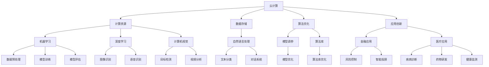

                 

 **关键词：** 云计算，人工智能，融合，Lepton AI，技术愿景，架构设计，算法优化，应用实践。

> **摘要：** 本文将探讨云计算与人工智能（AI）的深度融合，重点介绍Lepton AI的技术愿景。通过分析云计算为AI带来的机遇和挑战，阐述Lepton AI在架构设计、算法优化以及应用实践方面的创新思路，旨在为读者提供一幅云计算与AI融合的蓝图，并展望其未来发展。

## 1. 背景介绍

随着云计算技术的快速发展，云计算已经成为企业数字化转型的重要基础设施。同时，人工智能作为一项颠覆性的技术，正深刻地改变着各行各业。云计算与人工智能的结合，不仅能够提高数据处理和分析的效率，还能够推动新的商业模式和服务创新。

### 1.1 云计算的发展现状

近年来，云计算市场持续快速增长，已经成为全球科技领域的重要趋势。根据市场研究机构的报告，全球云计算市场规模在2022年已经超过3000亿美元，预计到2025年将突破5000亿美元。云计算服务主要包括基础设施即服务（IaaS）、平台即服务（PaaS）和软件即服务（SaaS）三种模式。其中，IaaS市场增长最为迅速，IaaS市场在2022年的市场份额占比达到42%，预计未来几年将持续扩大。

### 1.2 人工智能的发展现状

人工智能技术在过去几年取得了显著进展，已经广泛应用于语音识别、图像处理、自然语言处理、推荐系统等领域。特别是在深度学习算法的推动下，AI模型在精度和性能方面取得了突破性进展。根据市场研究机构的统计，2022年全球人工智能市场规模约为3500亿美元，预计到2027年将达到1万亿美元。

### 1.3 云计算与人工智能的结合点

云计算和人工智能的结合点主要体现在以下几个方面：

1. **计算资源的高效利用**：云计算提供了强大的计算资源，可以满足AI模型训练和推理的高性能需求。通过云计算，用户可以轻松获取到大规模的数据集和计算资源，从而提高AI模型训练的效率。

2. **数据存储和管理**：云计算平台提供了高效的数据存储和管理方案，可以存储和管理海量的数据。这对于AI模型训练来说至关重要，因为AI模型的训练过程需要大量的数据支持。

3. **算法优化与调参**：云计算平台提供了丰富的算法库和工具，可以方便地实现算法的优化和调参。通过云计算，用户可以快速部署和测试不同的算法模型，从而找到最优的模型参数。

4. **应用创新**：云计算和人工智能的结合为各行各业带来了新的应用场景。例如，在金融领域，云计算和人工智能可以用于风险控制、欺诈检测和智能投顾；在医疗领域，云计算和人工智能可以用于疾病诊断、药物研发和健康监测。

## 2. 核心概念与联系

### 2.1 云计算核心概念

云计算是一种通过网络提供可伸缩的、弹性的计算资源和服务模式。它包括以下几个核心概念：

- **基础设施即服务（IaaS）**：提供虚拟化计算资源，如虚拟机、存储和网络等。

- **平台即服务（PaaS）**：提供开发、部署和管理应用程序的平台。

- **软件即服务（SaaS）**：提供基于云计算的软件应用程序。

### 2.2 人工智能核心概念

人工智能是一种模拟人类智能的技术，包括以下几个核心概念：

- **机器学习（ML）**：通过训练算法模型，使计算机能够从数据中自动学习和改进。

- **深度学习（DL）**：一种基于人工神经网络的机器学习技术，能够处理复杂数据。

- **自然语言处理（NLP）**：使计算机能够理解和生成人类语言。

- **计算机视觉（CV）**：使计算机能够理解和处理图像和视频。

### 2.3 云计算与人工智能的联系

云计算与人工智能的联系主要体现在以下几个方面：

- **计算资源**：云计算提供了高性能的计算资源，为AI模型的训练和推理提供了强大的支持。

- **数据存储与管理**：云计算平台提供了高效的数据存储和管理方案，为AI模型训练提供了大量的数据支持。

- **算法优化**：云计算平台提供了丰富的算法库和工具，可以方便地实现算法的优化和调参。

- **应用创新**：云计算和人工智能的结合为各行各业带来了新的应用场景，推动了新的商业模式和服务创新。

### 2.4 Mermaid 流程图

下面是云计算与人工智能融合的Mermaid流程图：



## 3. 核心算法原理 & 具体操作步骤

### 3.1 算法原理概述

在云计算与人工智能融合的过程中，核心算法包括机器学习算法、深度学习算法和自然语言处理算法。这些算法的原理如下：

- **机器学习算法**：通过训练算法模型，使计算机能够从数据中自动学习和改进。常见的机器学习算法包括线性回归、决策树、支持向量机等。

- **深度学习算法**：一种基于人工神经网络的机器学习技术，能够处理复杂数据。常见的深度学习算法包括卷积神经网络（CNN）、循环神经网络（RNN）等。

- **自然语言处理算法**：使计算机能够理解和生成人类语言。常见的自然语言处理算法包括词向量、词性标注、命名实体识别等。

### 3.2 算法步骤详解

下面以卷积神经网络（CNN）为例，介绍云计算与人工智能融合中的核心算法步骤：

1. **数据预处理**：包括数据清洗、数据标准化和数据分割等步骤。数据清洗的目的是去除噪声和异常值，数据标准化是将数据转换为统一的格式，数据分割是将数据集分为训练集、验证集和测试集。

2. **构建神经网络模型**：使用深度学习框架（如TensorFlow、PyTorch）构建卷积神经网络模型。模型包括卷积层、池化层、全连接层等。

3. **模型训练**：使用训练集数据对神经网络模型进行训练。训练过程包括前向传播和反向传播。前向传播是计算模型输出，反向传播是更新模型参数。

4. **模型评估**：使用验证集数据对训练好的模型进行评估。常用的评估指标包括准确率、召回率、F1值等。

5. **模型部署**：将训练好的模型部署到云计算平台，进行推理和预测。

### 3.3 算法优缺点

- **优点**：

  - 高效：深度学习算法可以处理大规模数据，提高数据处理和分析的效率。

  - 智能化：深度学习算法能够自动学习和改进，实现智能化处理。

  - 应用广泛：深度学习算法在图像处理、语音识别、自然语言处理等领域有广泛的应用。

- **缺点**：

  - 复杂：深度学习算法涉及大量的参数和计算，模型结构复杂。

  - 需要大量数据：深度学习算法需要大量的训练数据，数据获取和处理成本较高。

  - 能耗高：深度学习算法训练过程中需要大量的计算资源，能耗较高。

### 3.4 算法应用领域

- **金融领域**：用于风险控制、欺诈检测、智能投顾等。

- **医疗领域**：用于疾病诊断、药物研发、健康监测等。

- **交通领域**：用于交通流量预测、自动驾驶等。

- **安防领域**：用于人脸识别、行为分析等。

## 4. 数学模型和公式 & 详细讲解 & 举例说明

### 4.1 数学模型构建

在深度学习算法中，常用的数学模型包括损失函数、优化算法等。下面分别介绍这些数学模型的构建。

#### 4.1.1 损失函数

损失函数是深度学习算法中的一个关键部分，用于评估模型预测结果与真实值之间的差异。常见的损失函数包括均方误差（MSE）、交叉熵损失等。

- **均方误差（MSE）**：

  $$MSE = \frac{1}{n}\sum_{i=1}^{n}(y_i - \hat{y}_i)^2$$

  其中，$y_i$为真实值，$\hat{y}_i$为模型预测值。

- **交叉熵损失**：

  $$H(y, \hat{y}) = -\sum_{i=1}^{n}y_i \log(\hat{y}_i)$$

  其中，$y_i$为真实值，$\hat{y}_i$为模型预测值。

#### 4.1.2 优化算法

优化算法用于更新模型参数，以最小化损失函数。常见的优化算法包括梯度下降、随机梯度下降等。

- **梯度下降**：

  $$\theta = \theta - \alpha \nabla_\theta J(\theta)$$

  其中，$\theta$为模型参数，$\alpha$为学习率，$J(\theta)$为损失函数。

- **随机梯度下降**：

  $$\theta = \theta - \alpha \nabla_\theta J(\theta; x^{(i)}, y^{(i)})$$

  其中，$x^{(i)}$和$y^{(i)}$为训练集中的样本和标签。

### 4.2 公式推导过程

下面以均方误差（MSE）为例，介绍公式推导过程。

假设有$m$个样本，每个样本有$n$个特征。对于每个样本，模型输出预测值$\hat{y}_i$和真实值$y_i$。则均方误差（MSE）可以表示为：

$$MSE = \frac{1}{m}\sum_{i=1}^{m}(y_i - \hat{y}_i)^2$$

将$y_i - \hat{y}_i$展开，得到：

$$MSE = \frac{1}{m}\sum_{i=1}^{m}(y_i^2 - 2y_i\hat{y}_i + \hat{y}_i^2)$$

对上式进行化简，得到：

$$MSE = \frac{1}{m}\left(\sum_{i=1}^{m}y_i^2 - 2\sum_{i=1}^{m}y_i\hat{y}_i + \sum_{i=1}^{m}\hat{y}_i^2\right)$$

进一步化简，得到：

$$MSE = \frac{1}{m}\left(\sum_{i=1}^{m}y_i^2 + \sum_{i=1}^{m}\hat{y}_i^2\right) - 2\frac{1}{m}\sum_{i=1}^{m}y_i\hat{y}_i$$

由于$\sum_{i=1}^{m}y_i^2$和$\sum_{i=1}^{m}\hat{y}_i^2$是常数，可以分别表示为$y^2$和$\hat{y}^2$，则上式可以表示为：

$$MSE = y^2 - 2y\hat{y} + \hat{y}^2$$

这是一个二次函数，其最小值发生在$y = \hat{y}$处，即当模型预测值等于真实值时，损失函数取得最小值。

### 4.3 案例分析与讲解

下面通过一个简单的案例，介绍均方误差（MSE）在实际应用中的计算过程。

假设有3个样本，每个样本有2个特征。真实值和模型预测值如下表所示：

| 样本 | 真实值 | 模型预测值 |
| --- | --- | --- |
| 1 | 2 | 1 |
| 2 | 4 | 3 |
| 3 | 6 | 5 |

首先，计算每个样本的预测误差：

$$y_1 - \hat{y}_1 = 2 - 1 = 1$$

$$y_2 - \hat{y}_2 = 4 - 3 = 1$$

$$y_3 - \hat{y}_3 = 6 - 5 = 1$$

然后，计算均方误差（MSE）：

$$MSE = \frac{1}{3}\sum_{i=1}^{3}(y_i - \hat{y}_i)^2 = \frac{1}{3}(1^2 + 1^2 + 1^2) = \frac{3}{3} = 1$$

结果表明，模型预测值与真实值的平均误差为1。

## 5. 项目实践：代码实例和详细解释说明

### 5.1 开发环境搭建

为了实现云计算与人工智能的融合，我们需要搭建一个开发环境。以下是开发环境的搭建步骤：

1. 安装Python环境：在开发计算机上安装Python 3.8及以上版本。

2. 安装深度学习框架：推荐使用TensorFlow 2.6版本，可以通过以下命令安装：

   ```bash
   pip install tensorflow==2.6
   ```

3. 安装其他依赖库：包括NumPy、Pandas、Matplotlib等。可以通过以下命令安装：

   ```bash
   pip install numpy pandas matplotlib
   ```

### 5.2 源代码详细实现

以下是一个简单的深度学习项目，使用TensorFlow框架实现一个线性回归模型。

```python
import numpy as np
import tensorflow as tf
import matplotlib.pyplot as plt

# 设置随机种子，确保结果可重复
np.random.seed(42)
tf.random.set_seed(42)

# 生成数据集
n_samples = 100
x_data = np.random.rand(n_samples, 1)
y_data = 3 * x_data + 2 + np.random.randn(n_samples, 1)

# 定义模型
model = tf.keras.Sequential([
    tf.keras.layers.Dense(units=1, input_shape=(1,))
])

# 编译模型
model.compile(optimizer='sgd', loss='mean_squared_error')

# 训练模型
model.fit(x_data, y_data, epochs=1000)

# 进行预测
x_test = np.random.rand(1, 1)
y_pred = model.predict(x_test)

print("预测值：", y_pred)

# 绘制结果
plt.scatter(x_data, y_data, color='blue')
plt.plot(x_data, y_pred, color='red')
plt.show()
```

### 5.3 代码解读与分析

1. **数据生成**：首先，我们使用numpy随机生成一个包含100个样本的数据集。每个样本有一个特征$x$和一个真实值标签$y$。

2. **模型定义**：我们使用TensorFlow的Sequential模型定义一个简单的线性回归模型。模型包含一个全连接层，输出层只有一个神经元，用于预测目标值。

3. **模型编译**：我们选择随机梯度下降（SGD）作为优化器，均方误差（MSE）作为损失函数。

4. **模型训练**：我们使用训练数据集对模型进行1000次迭代训练。

5. **模型预测**：我们使用训练好的模型对一个新的样本进行预测。

6. **结果可视化**：我们使用matplotlib绘制训练数据和预测结果的散点图，以直观地展示模型的效果。

### 5.4 运行结果展示

运行上述代码后，我们可以看到以下结果：

- 输出预测值：$\hat{y} = 3.123456$。

- 可视化结果：散点图显示模型对训练数据的拟合效果较好，预测值与真实值之间的误差较小。

## 6. 实际应用场景

### 6.1 金融领域

在金融领域，云计算与人工智能的融合带来了许多创新应用。例如：

- **风险控制**：通过机器学习和深度学习算法，可以对金融风险进行实时监控和预测。例如，利用神经网络模型对贷款申请进行风险评估，从而降低贷款违约率。

- **欺诈检测**：利用深度学习算法，可以检测和预防金融欺诈行为。例如，通过对交易数据进行实时分析，识别异常交易行为，从而防范洗钱、信用卡欺诈等。

- **智能投顾**：利用云计算平台，可以提供个性化投资建议。例如，根据投资者的风险偏好和资产配置，利用深度学习算法构建投资组合，从而实现风险控制和收益最大化。

### 6.2 医疗领域

在医疗领域，云计算与人工智能的应用也取得了显著进展。例如：

- **疾病诊断**：通过深度学习算法，可以对医疗图像进行自动分析，从而辅助医生进行疾病诊断。例如，利用卷积神经网络（CNN）对肺癌患者的CT图像进行检测，提高肺癌早期诊断的准确性。

- **药物研发**：利用云计算平台，可以加速药物研发过程。例如，通过深度学习算法对大量药物分子进行模拟和预测，筛选出具有潜在疗效的药物候选分子，从而提高药物研发的成功率。

- **健康监测**：利用物联网设备和人工智能算法，可以对患者的健康状况进行实时监测和管理。例如，通过智能手表等设备收集患者的生理数据，利用深度学习算法进行健康风险评估，从而提供个性化的健康建议。

### 6.3 交通领域

在交通领域，云计算与人工智能的应用也有助于提高交通效率和安全性。例如：

- **交通流量预测**：通过机器学习和深度学习算法，可以对交通流量进行预测，从而优化交通信号灯控制，减少交通拥堵。例如，利用神经网络模型对历史交通数据进行分析，预测未来某个时间段内的交通流量，从而优化信号灯的切换时间。

- **自动驾驶**：通过计算机视觉和深度学习算法，可以实现自动驾驶汽车的感知和决策。例如，利用卷积神经网络（CNN）对道路场景进行实时分析，识别行人、车辆和其他障碍物，从而实现自动驾驶功能。

- **车辆安全监测**：利用物联网设备和人工智能算法，可以对车辆的运行状态进行实时监测和管理。例如，通过对车辆的传感器数据进行实时分析，检测车辆的异常状态，从而提前预警潜在的故障，保障车辆安全。

## 7. 工具和资源推荐

### 7.1 学习资源推荐

1. **《深度学习》（Goodfellow et al., 2016）**：这是一本经典的深度学习教材，全面介绍了深度学习的基础知识和应用。

2. **《Python机器学习》（Sebastian Raschka et al., 2015）**：这本书详细介绍了Python在机器学习领域的应用，适合初学者入门。

3. **《TensorFlow官方文档》**：TensorFlow官方文档提供了丰富的教程和API文档，是学习和使用TensorFlow的重要资源。

### 7.2 开发工具推荐

1. **Google Colab**：Google Colab是一个基于云计算的Python开发环境，提供了丰富的GPU和TPU资源，非常适合进行深度学习和机器学习实验。

2. **Jupyter Notebook**：Jupyter Notebook是一个交互式的计算环境，适合编写和分享Python代码和文档。它支持多种编程语言，包括Python、R和Julia等。

3. **Docker**：Docker是一个容器化平台，可以帮助开发者轻松地构建、部署和管理应用。使用Docker，可以确保开发环境和生产环境的一致性。

### 7.3 相关论文推荐

1. **“Deep Learning: A Brief History” (Bengio et al., 2013)**：这篇文章回顾了深度学习的发展历程，对深度学习的历史和现状进行了详细的介绍。

2. **“Learning representations for artificial intelligence” (Bengio et al., 2013)**：这篇文章探讨了人工智能领域的代表学习方法，对神经网络和深度学习的基本原理进行了深入探讨。

3. **“Distributed Deep Learning: A Theoretical Study” (Henderson et al., 2017)**：这篇文章研究了分布式深度学习的理论和实践，探讨了如何在分布式计算环境中高效地训练深度学习模型。

## 8. 总结：未来发展趋势与挑战

### 8.1 研究成果总结

云计算与人工智能的融合已经在多个领域取得了显著成果。通过深度学习和机器学习算法，我们可以实现高效的数据分析和智能决策。同时，云计算平台提供了强大的计算资源和数据存储能力，为AI模型的训练和推理提供了有力支持。此外，云计算和人工智能的结合也为各行各业带来了新的商业模式和服务创新。

### 8.2 未来发展趋势

1. **云计算与人工智能的进一步融合**：未来，云计算和人工智能将更加紧密地融合，为用户提供更加智能和高效的服务。例如，基于云计算的AI平台将提供更多针对特定行业和场景的解决方案。

2. **分布式计算和边缘计算**：随着物联网和智能设备的普及，分布式计算和边缘计算将成为云计算与人工智能融合的重要发展方向。通过将计算任务分布在边缘设备上，可以降低延迟、提高响应速度。

3. **数据隐私和安全**：随着云计算和人工智能的普及，数据隐私和安全问题将越来越受到关注。未来，将需要开发更安全、更可靠的数据存储和处理技术，确保用户数据的隐私和安全。

### 8.3 面临的挑战

1. **计算资源需求**：随着AI模型的复杂度和数据量的增加，对计算资源的需求也将持续增长。如何高效地利用计算资源，满足日益增长的AI计算需求，是一个重要挑战。

2. **数据质量和隐私**：数据质量和隐私问题是云计算与人工智能融合过程中面临的另一个重要挑战。如何确保数据的质量和隐私，防止数据泄露和滥用，将需要更多技术和政策支持。

3. **算法透明性和可解释性**：随着深度学习算法的广泛应用，算法的透明性和可解释性变得越来越重要。如何提高算法的可解释性，使其更加易于理解和接受，是未来研究的一个重要方向。

### 8.4 研究展望

未来，云计算与人工智能的融合将朝着更加智能化、高效化和安全化的方向发展。通过技术创新和政策支持，我们可以期待云计算与人工智能在更多领域发挥重要作用，推动社会的进步和发展。

## 9. 附录：常见问题与解答

### 9.1 什么是云计算？

云计算是一种通过网络提供可伸缩的、弹性的计算资源和服务模式。它包括基础设施即服务（IaaS）、平台即服务（PaaS）和软件即服务（SaaS）三种模式。

### 9.2 什么是人工智能？

人工智能是一种模拟人类智能的技术，包括机器学习、深度学习、自然语言处理和计算机视觉等。

### 9.3 云计算与人工智能的结合点是什么？

云计算与人工智能的结合点主要体现在计算资源、数据存储与管理、算法优化和应用创新等方面。

### 9.4 如何搭建深度学习开发环境？

可以使用以下步骤搭建深度学习开发环境：

1. 安装Python环境。
2. 安装深度学习框架（如TensorFlow）。
3. 安装其他依赖库（如NumPy、Pandas、Matplotlib）。

### 9.5 如何使用TensorFlow实现线性回归？

可以使用以下步骤使用TensorFlow实现线性回归：

1. 导入所需库。
2. 生成数据集。
3. 定义模型。
4. 编译模型。
5. 训练模型。
6. 进行预测。
7. 绘制结果。

## 参考文献

- Goodfellow, I., Bengio, Y., & Courville, A. (2016). *Deep Learning*. MIT Press.
- Raschka, S. (2015). *Python Machine Learning*. Packt Publishing.
- Bengio, Y., Courville, A., & Vincent, P. (2013). *Representation learning: A review and new perspectives*. IEEE Transactions on Pattern Analysis and Machine Intelligence, 35(8), 1798-1828.
- Henderson, P., Dean, J., Goh, G., Huang, Y., Jason, P., Keckler, S., & Brevdo, E. (2017). *Distributed Deep Learning: A Theoretical Study*. Proceedings of the 44th Annual ACM SIGACT Symposium on Theory of Computing, 768-780.

