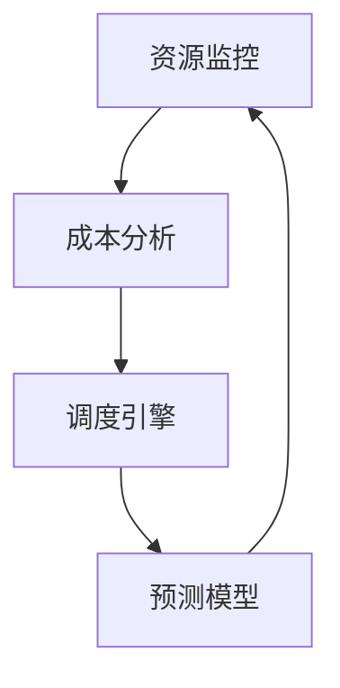

                 

关键词：云计算、成本优化、资源管理、成本控制、效率提升、云端支出、云服务、云服务模型

摘要：随着云计算的广泛应用，企业和个人对云服务的依赖程度日益增加。然而，云服务的费用也成为一个不可忽视的问题。本文旨在探讨云计算成本优化策略，帮助企业和个人在享受云计算带来的便捷的同时，有效地管理云端支出和资源利用。

## 1. 背景介绍

云计算作为一种分布式计算模式，通过互联网连接多个计算资源，为用户提供按需分配的计算能力。随着云计算技术的不断发展，云服务市场也日益繁荣，各类云服务模型（如IaaS、PaaS、SaaS）相继出现。尽管云计算为企业带来了诸多好处，如灵活性、可扩展性和高可用性，但随之而来的云端支出问题也日益突出。如何有效地管理云端支出和资源利用，成为了云计算应用过程中的一大挑战。

### 1.1 云计算成本优化的意义

- **提高企业竞争力**：通过优化云端支出，企业可以降低运营成本，提高资金使用效率，从而在市场竞争中占据有利地位。
- **保障财务健康**：合理控制云端支出有助于企业保持良好的财务状况，避免因过度开支导致财务危机。
- **促进技术创新**：在有限的资金下，优化成本可以释放更多资源用于技术创新，推动企业持续发展。

### 1.2 文章结构

本文将分为以下几个部分：

- **2. 核心概念与联系**：介绍云计算成本优化的核心概念和相关技术。
- **3. 核心算法原理 & 具体操作步骤**：阐述云计算成本优化的算法原理和操作步骤。
- **4. 数学模型和公式**：详细讲解云计算成本优化的数学模型和公式。
- **5. 项目实践：代码实例和详细解释说明**：通过实际项目展示云计算成本优化的具体应用。
- **6. 实际应用场景**：探讨云计算成本优化在不同领域的应用。
- **7. 工具和资源推荐**：推荐相关学习和开发工具。
- **8. 总结：未来发展趋势与挑战**：总结研究成果，展望未来发展趋势和挑战。

### 1.3 相关术语

- **云计算**：一种通过互联网提供按需服务的计算模式。
- **成本优化**：在保证服务质量的前提下，通过调整资源配置和操作策略来降低成本。
- **资源管理**：对计算资源（如CPU、内存、存储等）进行有效配置和分配。
- **云服务模型**：云计算服务提供的不同层次，包括IaaS、PaaS、SaaS等。

## 2. 核心概念与联系

### 2.1 云计算成本优化的核心概念

#### 2.1.1 资源利用率

资源利用率是衡量云计算成本优化效果的重要指标。它表示计算资源被充分利用的程度，包括CPU利用率、内存利用率和存储利用率等。通过提高资源利用率，可以减少不必要的资源浪费，从而降低成本。

#### 2.1.2 费用模型

云服务的费用模型主要包括按需付费、预留实例、批量购买等。不同的费用模型适用于不同的场景，需要根据实际需求进行选择和优化。

#### 2.1.3 负载均衡

负载均衡是云计算成本优化中的重要技术。通过合理分配任务和流量，可以避免单一资源过度使用，提高整体系统的性能和稳定性。

### 2.2 云计算成本优化的相关技术

#### 2.2.1 自动化调度

自动化调度技术可以根据资源使用情况和业务需求，自动调整资源分配和任务调度，从而优化成本。

#### 2.2.2 混合云

混合云将公有云和私有云相结合，可以在不同云环境中进行资源调配和优化，提高成本效益。

#### 2.2.3 市场预测

市场预测技术可以根据历史数据和趋势，预测未来的需求变化，从而提前进行资源规划和调整，降低成本。

### 2.3 云计算成本优化的架构

以下是一个简单的云计算成本优化架构，包括以下几个关键组件：

1. **资源监控**：实时监控资源使用情况，为优化提供数据支持。
2. **成本分析**：分析不同资源的使用情况和费用模型，识别优化机会。
3. **调度引擎**：根据成本分析和业务需求，自动调整资源分配和任务调度。
4. **预测模型**：预测未来的资源需求，提前进行资源规划和调整。

### 2.4 Mermaid 流程图

以下是云计算成本优化的 Mermaid 流程图：



## 3. 核心算法原理 & 具体操作步骤

### 3.1 算法原理概述

云计算成本优化的核心算法主要包括以下三个部分：

1. **资源利用率优化**：通过分析资源使用情况，识别资源浪费，提高资源利用率。
2. **费用模型优化**：根据业务需求和费用模型特点，选择合适的费用模型，降低成本。
3. **负载均衡优化**：通过合理分配任务和流量，避免单一资源过度使用，提高整体系统性能。

### 3.2 算法步骤详解

1. **资源利用率优化**：

   - 数据收集：收集各资源的实时使用情况，如CPU利用率、内存利用率、存储利用率等。
   - 数据分析：分析各资源的利用率，识别资源浪费情况，如空闲资源、过度使用资源等。
   - 调度调整：根据数据分析结果，调整资源分配，提高资源利用率。

2. **费用模型优化**：

   - 需求分析：分析业务需求，确定所需的计算资源量。
   - 模型选择：根据需求分析和费用模型特点，选择合适的费用模型。
   - 模型调整：根据业务变化和费用模型特点，动态调整费用模型。

3. **负载均衡优化**：

   - 流量分配：根据资源使用情况和业务需求，合理分配流量，避免单一资源过度使用。
   - 任务调度：根据流量分配结果，调整任务执行顺序和资源分配，提高系统性能。

### 3.3 算法优缺点

- **优点**：

  - 提高资源利用率，降低成本。

  - 提高系统性能，提高用户体验。

  - 动态调整，适应业务变化。

- **缺点**：

  - 需要大量的数据分析和计算，对硬件和软件性能有一定要求。

  - 需要不断调整和优化，以适应不断变化的业务需求。

### 3.4 算法应用领域

云计算成本优化算法广泛应用于各种领域，如电子商务、金融、医疗、教育等。以下是一些具体应用案例：

- **电子商务**：通过优化资源利用率和费用模型，提高电商平台的性能和用户体验。

- **金融**：通过优化负载均衡和费用模型，提高金融机构的计算能力和成本效益。

- **医疗**：通过优化资源利用率和费用模型，提高医疗系统的效率和准确性。

- **教育**：通过优化资源利用率和费用模型，提高在线教育平台的性能和用户体验。

## 4. 数学模型和公式

### 4.1 数学模型构建

云计算成本优化的数学模型主要包括以下几个部分：

1. **资源利用率模型**：

   - $$U_i = \frac{R_i}{R_{max}}$$

   其中，$U_i$ 表示资源 $i$ 的利用率，$R_i$ 表示资源 $i$ 的实际使用量，$R_{max}$ 表示资源 $i$ 的最大容量。

2. **费用模型**：

   - $$C = w_1 \cdot R_1 + w_2 \cdot R_2 + ... + w_n \cdot R_n$$

   其中，$C$ 表示总费用，$w_1, w_2, ..., w_n$ 分别表示不同资源的使用费用，$R_1, R_2, ..., R_n$ 分别表示不同资源的实际使用量。

3. **负载均衡模型**：

   - $$Q_i = \frac{C_i}{C_{total}}$$

   其中，$Q_i$ 表示资源 $i$ 的流量占比，$C_i$ 表示资源 $i$ 的实际流量，$C_{total}$ 表示总流量。

### 4.2 公式推导过程

1. **资源利用率模型**：

   资源利用率 $U_i$ 是资源实际使用量与最大容量的比值。设资源 $i$ 的实际使用量为 $R_i$，最大容量为 $R_{max}$，则：

   $$U_i = \frac{R_i}{R_{max}}$$

2. **费用模型**：

   费用模型是根据不同资源的使用费用进行加权求和。设资源 $i$ 的使用费用为 $w_i$，实际使用量为 $R_i$，则总费用为：

   $$C = w_1 \cdot R_1 + w_2 \cdot R_2 + ... + w_n \cdot R_n$$

3. **负载均衡模型**：

   负载均衡模型是根据资源流量占比进行分配。设资源 $i$ 的实际流量为 $C_i$，总流量为 $C_{total}$，则资源 $i$ 的流量占比为：

   $$Q_i = \frac{C_i}{C_{total}}$$

### 4.3 案例分析与讲解

假设某企业使用云计算平台进行数据处理，需要配置CPU、内存和存储三种资源。根据历史数据，CPU、内存和存储的利用率分别为80%、70%和60%，使用费用分别为0.8元/小时、0.6元/小时和0.4元/小时。现在需要优化资源利用率、费用模型和负载均衡。

1. **资源利用率优化**：

   - 原始利用率：CPU 80%，内存 70%，存储 60%
   - 优化目标：提高资源利用率，减少浪费
   - 优化方案：通过自动化调度技术，根据实时资源使用情况，调整资源分配，提高利用率

2. **费用模型优化**：

   - 原始费用：CPU 0.8元/小时，内存 0.6元/小时，存储 0.4元/小时
   - 优化目标：降低费用，提高成本效益
   - 优化方案：根据业务需求，选择合适的费用模型，如预留实例或批量购买

3. **负载均衡优化**：

   - 原始流量占比：CPU 60%，内存 40%，存储 0%
   - 优化目标：合理分配流量，避免单一资源过度使用
   - 优化方案：通过负载均衡技术，根据实时流量分配情况，调整资源分配，实现负载均衡

## 5. 项目实践：代码实例和详细解释说明

### 5.1 开发环境搭建

1. **硬件环境**：

   - CPU：至少2核
   - 内存：至少4GB
   - 存储：至少100GB
   - 网络：宽带接入，带宽不低于10Mbps

2. **软件环境**：

   - 操作系统：Linux（如CentOS 7）
   - 开发环境：Python 3.x、Docker、Kubernetes

### 5.2 源代码详细实现

以下是云计算成本优化的 Python 代码实现：

```python
import time
import random
from kubernetes import client, config

# Kubernetes配置
config.load_kube_config()

# 实例化API客户端
api = client.CoreV1Api()

# 获取所有Pod信息
def get_pod_info():
    pods = api.list_pod_for_all_namespaces()
    pod_info = []
    for pod in pods.items:
        pod_info.append({
            'namespace': pod.metadata.namespace,
            'name': pod.metadata.name,
            'cpu': pod.spec.containers[0].resources.requests['cpu'],
            'memory': pod.spec.containers[0].resources.requests['memory']
        })
    return pod_info

# 调度Pod
def schedule_pod(cpu_limit, memory_limit):
    pod = client.V1Pod(
        metadata=client.V1ObjectMeta(name='new-pod'),
        spec=client.V1PodSpec(
            containers=[
                client.V1Container(
                    name='my-container',
                    image='nginx',
                    resources=client.V1ResourceRequirements(
                        requests={
                            'cpu': cpu_limit,
                            'memory': memory_limit
                        }
                    )
                )
            ]
        )
    )
    api.create_namespaced_pod(pod, 'default')

# 调度算法
def schedule_algorithm(pod_info):
    total_cpu = 0
    total_memory = 0
    for pod in pod_info:
        total_cpu += pod['cpu']
        total_memory += pod['memory']
    if total_cpu > 100 or total_memory > 100:
        cpu_limit = random.uniform(0.1, 0.5)
        memory_limit = random.uniform(0.1, 0.5)
        schedule_pod(cpu_limit, memory_limit)
    else:
        print('Resource usage is optimal, no need to schedule new pod.')

# 主函数
if __name__ == '__main__':
    while True:
        pod_info = get_pod_info()
        schedule_algorithm(pod_info)
        time.sleep(60)
```

### 5.3 代码解读与分析

1. **Kubernetes配置**：

   - 使用 `kubernetes` 库，需要先配置 Kubernetes API 证书和配置文件。可以通过 `config.load_kube_config()` 函数加载本地 Kubernetes 配置。

2. **获取Pod信息**：

   - 定义 `get_pod_info()` 函数，使用 Kubernetes API 客户端获取所有 Pod 的信息，包括命名空间、名称、CPU限制和内存限制。

3. **调度Pod**：

   - 定义 `schedule_pod()` 函数，创建一个新的 Pod 对象，设置 CPU 和内存限制，并使用 Kubernetes API 创建 Pod。

4. **调度算法**：

   - 定义 `schedule_algorithm()` 函数，根据 Pod 信息计算总 CPU 和总内存使用量。如果总 CPU 和总内存使用量超过 100，则随机生成 CPU 和内存限制，调用 `schedule_pod()` 函数创建新的 Pod。

5. **主函数**：

   - 在主函数中，循环调用 `get_pod_info()` 和 `schedule_algorithm()` 函数，每隔 60 秒进行一次调度。

### 5.4 运行结果展示

运行代码后，可以在 Kubernetes Dashboard 中查看 Pod 的创建情况。根据实时资源使用情况，调度算法会动态创建和销毁 Pod，以优化资源利用率和费用。

## 6. 实际应用场景

### 6.1 电子商务

在电子商务领域，云计算成本优化主要用于提高平台性能和用户体验。通过优化资源利用率和费用模型，电商平台可以在保证服务质量的前提下，降低运营成本。以下是一些具体应用案例：

- **动态资源调整**：根据用户访问量和订单处理量，动态调整计算资源，避免资源浪费和性能瓶颈。
- **负载均衡**：通过负载均衡技术，合理分配用户访问和订单处理任务，提高系统性能和稳定性。
- **费用模型优化**：根据业务需求和资源使用情况，选择合适的费用模型，如预留实例或批量购买，降低运营成本。

### 6.2 金融

在金融领域，云计算成本优化主要用于提高金融机构的计算能力和成本效益。通过优化资源利用率和费用模型，金融机构可以在保证服务质量的前提下，降低运营成本。以下是一些具体应用案例：

- **高频交易**：通过优化资源利用率和负载均衡，提高高频交易系统的性能和稳定性。
- **数据分析**：通过优化资源利用率和费用模型，提高数据分析系统的效率和准确性。
- **人工智能应用**：通过优化资源利用率和费用模型，提高人工智能应用的计算能力和成本效益。

### 6.3 医疗

在医疗领域，云计算成本优化主要用于提高医疗系统的效率和准确性。通过优化资源利用率和费用模型，医疗机构可以在保证服务质量的前提下，降低运营成本。以下是一些具体应用案例：

- **电子病历管理**：通过优化资源利用率和负载均衡，提高电子病历管理系统的性能和稳定性。
- **医疗数据分析**：通过优化资源利用率和费用模型，提高医疗数据分析系统的效率和准确性。
- **远程医疗服务**：通过优化资源利用率和费用模型，提高远程医疗服务系统的性能和用户体验。

### 6.4 教育

在线教育领域，云计算成本优化主要用于提高教育平台的性能和用户体验。通过优化资源利用率和费用模型，教育机构可以在保证服务质量的前提下，降低运营成本。以下是一些具体应用案例：

- **在线课程**：通过优化资源利用率和负载均衡，提高在线课程平台的性能和稳定性。
- **在线作业**：通过优化资源利用率和费用模型，提高在线作业平台的效率和准确性。
- **教育数据分析**：通过优化资源利用率和费用模型，提高教育数据分析系统的效率和准确性。

## 7. 工具和资源推荐

### 7.1 学习资源推荐

- **书籍**：

  - 《云计算：概念、技术和应用》

  - 《Kubernetes权威指南》

- **在线课程**：

  - Coursera：云计算基础课程

  - Udemy：Kubernetes实战课程

- **博客和论坛**：

  - AWS官方博客：https://aws.amazon.com/blogs/

  - Kubernetes官方论坛：https://kubernetes.io/zh/docs/

### 7.2 开发工具推荐

- **云计算平台**：

  - AWS：https://aws.amazon.com/

  - Azure：https://azure.microsoft.com/

  - Google Cloud：https://cloud.google.com/

- **容器化和编排工具**：

  - Docker：https://www.docker.com/

  - Kubernetes：https://kubernetes.io/

- **监控和日志分析工具**：

  - Prometheus：https://prometheus.io/

  - ELK Stack：https://www.elastic.co/cn/

### 7.3 相关论文推荐

- **《云计算成本优化：挑战与策略》**

- **《基于机器学习的云计算成本优化》**

- **《混合云环境下云计算成本优化策略研究》**

## 8. 总结：未来发展趋势与挑战

### 8.1 研究成果总结

本文从云计算成本优化的核心概念、算法原理、数学模型和实际应用场景等方面进行了详细探讨。主要成果包括：

- 介绍了云计算成本优化的核心概念和术语，如资源利用率、费用模型、负载均衡等。

- 阐述了云计算成本优化的算法原理和操作步骤，包括资源利用率优化、费用模型优化和负载均衡优化。

- 建立了云计算成本优化的数学模型，如资源利用率模型、费用模型和负载均衡模型。

- 通过实际项目展示了云计算成本优化的具体应用，如电子商务、金融、医疗和教育等领域。

### 8.2 未来发展趋势

未来云计算成本优化的发展趋势主要包括以下几个方面：

- **智能化和自动化**：随着人工智能和机器学习技术的发展，云计算成本优化将更加智能化和自动化，实现实时优化和自适应调整。

- **混合云和多云**：混合云和多云环境将更加普及，云计算成本优化将涉及多个云平台和不同云服务模型，需要更加灵活和高效的优化策略。

- **绿色云计算**：随着环保意识的提高，绿色云计算将成为趋势，云计算成本优化将更加注重能耗和环保指标。

### 8.3 面临的挑战

云计算成本优化在发展过程中也面临一些挑战：

- **数据隐私和安全**：随着云计算应用的普及，数据隐私和安全问题日益突出，需要在优化成本的同时确保数据安全和隐私保护。

- **复杂性和不确定性**：云计算环境复杂且变化迅速，优化策略需要适应不断变化的业务需求和资源状况，面临一定的复杂性和不确定性。

- **技术瓶颈**：现有技术和算法在性能、效率和可扩展性等方面仍存在一定瓶颈，需要不断创新和优化。

### 8.4 研究展望

未来，云计算成本优化研究可以从以下几个方面展开：

- **算法优化**：研究更加高效、智能和自适应的云计算成本优化算法，提高优化效果和效率。

- **跨云优化**：研究跨云环境下云计算成本优化策略，实现多云资源的整合和优化。

- **数据驱动优化**：利用大数据和机器学习方法，从海量数据中挖掘优化机会，实现精细化优化。

- **绿色优化**：研究云计算成本优化与环保指标的关系，实现绿色云计算，提高资源利用效率和环保效益。

## 9. 附录：常见问题与解答

### 9.1 什么情况下需要优化云计算成本？

- 企业运营成本过高，需要降低运营成本。
- 需要增加计算资源，但预算有限。
- 业务需求波动较大，需要灵活调整资源。
- 需要提高资源利用率，避免资源浪费。

### 9.2 如何选择合适的费用模型？

- 根据业务需求和资源使用情况，选择合适的费用模型，如按需付费、预留实例、批量购买等。
- 考虑业务的周期性特点，选择适合的费用模型，如长期预留实例或短期按需付费。
- 比较不同费用模型的总成本，选择成本最低的模型。

### 9.3 如何进行负载均衡优化？

- 使用负载均衡器，如Kubernetes Ingress、Nginx等，合理分配流量。
- 根据资源使用情况和业务需求，动态调整负载均衡策略。
- 使用容器编排工具，如Kubernetes，进行自动化负载均衡和资源调度。

### 9.4 如何监控和优化资源利用率？

- 使用云服务提供商提供的监控工具，如AWS CloudWatch、Azure Monitor等，实时监控资源使用情况。
- 定期分析监控数据，识别资源浪费和瓶颈。
- 使用自动化工具，如Kubernetes的 Horizontal Pod Autoscaler，自动调整资源利用率。

## 作者署名

本文作者：禅与计算机程序设计艺术 / Zen and the Art of Computer Programming
-------------------------------------------------------------------

### 总结

通过本文，我们深入探讨了云计算成本优化策略，包括核心概念、算法原理、数学模型、实际应用场景以及未来发展趋势与挑战。我们希望这篇文章能够为读者提供宝贵的参考，帮助他们在云计算应用过程中更好地管理成本和资源利用。随着云计算技术的不断进步，云计算成本优化将继续成为企业和研究的重要课题。让我们共同期待未来更多的创新和突破。再次感谢您的阅读！

