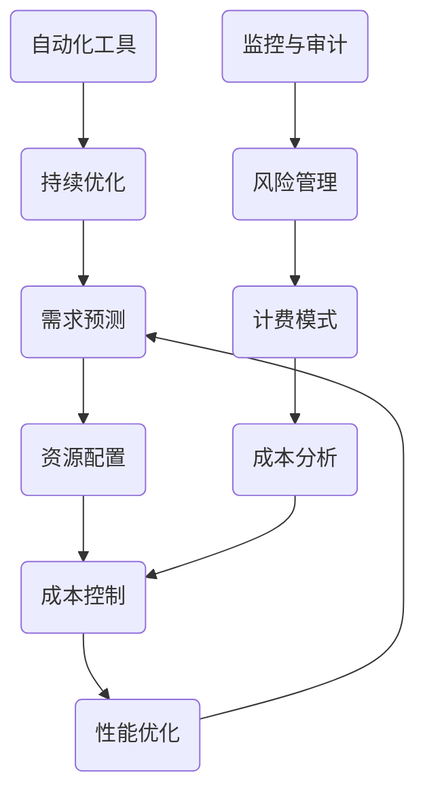

                 

关键词：云计算、成本优化、云端支出管理、效率提升、技术策略

> 摘要：随着云计算技术的普及，越来越多的企业和个人开始将业务部署到云端。然而，随之而来的问题是云计算成本的控制和管理。本文将深入探讨云计算成本优化的重要性，介绍一系列实用的技术和策略，帮助读者有效地管理云端支出，提高资源利用率。

## 1. 背景介绍

云计算作为信息技术领域的重要创新，已经深刻地改变了企业IT基础设施的构建方式。通过云计算，企业可以按需获取计算资源，实现快速部署和弹性扩展，从而加速创新和业务增长。然而，随着云计算规模的不断扩大，如何合理地管理和控制成本成为了一个亟待解决的问题。

### 云计算成本优化的意义

- **提高资源利用率**：优化成本意味着更有效地使用资源，避免资源浪费，提高资源利用率。
- **降低运营成本**：通过合理的成本优化，企业可以降低运营成本，提高利润率。
- **提升决策效率**：成本优化的数据和分析可以为企业提供更准确的决策支持，优化资源配置和业务策略。
- **增强竞争力**：在成本控制方面表现出色的企业，能够在市场中获得竞争优势，吸引更多客户。

### 云计算成本优化的挑战

- **资源多样性和复杂性**：云计算提供了多种资源和服务，如计算、存储、网络等，管理起来具有一定的复杂性。
- **成本透明度不足**：云服务提供商往往提供复杂的计费模式，成本透明度不足，难以进行有效的成本控制。
- **需求波动性**：云计算需求具有高度波动性，尤其是对于初创企业和季节性业务，如何应对需求变化成为一大挑战。

## 2. 核心概念与联系

在探讨云计算成本优化之前，我们需要了解一些核心概念和它们之间的关系。以下是一个Mermaid流程图，用于说明这些概念及其关联：



### 2.1 需求预测

需求预测是云计算成本优化的基础。通过预测未来的计算需求，企业可以更好地规划资源，避免过度采购或资源浪费。

### 2.2 资源配置

资源配置是根据需求预测来分配资源的过程。合理的资源配置可以确保在满足业务需求的同时，最大限度地降低成本。

### 2.3 成本控制

成本控制是确保企业不超出预算的重要环节。通过监控和管理云服务支出，企业可以有效地控制成本。

### 2.4 性能优化

性能优化旨在提高云计算服务的效率。通过优化性能，企业可以在保持服务质量的同时，减少不必要的成本。

### 2.5 计费模式

计费模式是云服务提供商确定费用标准的规则。了解不同的计费模式有助于企业选择最合适的方案，实现成本优化。

### 2.6 成本分析

成本分析是通过收集和分析云服务支出数据，识别成本驱动因素和节省机会的过程。

### 2.7 监控与审计

监控与审计是确保云服务使用符合预期的重要手段。通过监控资源使用情况和审计云服务账单，企业可以发现潜在的问题和改进机会。

### 2.8 风险管理

风险管理是应对云计算潜在风险的关键。通过制定风险管理策略，企业可以降低成本和业务中断的风险。

### 2.9 自动化工具

自动化工具可以大幅提高云计算成本优化的效率和准确性。通过自动化资源管理和成本分析，企业可以更轻松地实现持续优化。

### 2.10 持续优化

持续优化是一个不断迭代的过程，旨在通过持续的改进和调整，实现云计算成本的最佳状态。

## 3. 核心算法原理 & 具体操作步骤

### 3.1 算法原理概述

云计算成本优化的核心算法通常基于以下几个原理：

- **成本 - 性能权衡**：在保证性能的前提下，寻求最低成本的资源配置方案。
- **需求预测**：使用历史数据和机器学习算法预测未来计算需求。
- **资源调度**：根据需求预测，动态调整资源分配，确保资源利用率最大化。
- **成本控制**：通过监控和调整云服务使用，确保不超过预算。

### 3.2 算法步骤详解

#### 3.2.1 需求预测

1. **数据收集**：收集过去一段时间内的计算资源使用数据和业务需求数据。
2. **数据预处理**：清洗和格式化数据，确保数据质量。
3. **特征工程**：提取有助于预测的特征，如时间、业务类型、用户行为等。
4. **模型选择**：选择适合的机器学习模型，如ARIMA、SARIMA或LSTM等。
5. **模型训练与验证**：使用历史数据训练模型，并在验证集上评估模型性能。

#### 3.2.2 资源配置

1. **需求分析**：根据预测结果，分析未来的计算需求。
2. **资源评估**：评估不同类型资源的成本和性能，选择最优组合。
3. **资源分配**：将资源分配给各个应用或服务，确保需求得到满足。
4. **资源监控**：持续监控资源使用情况，根据实际情况进行动态调整。

#### 3.2.3 成本控制

1. **成本预算**：根据业务需求和资源评估，制定成本预算。
2. **成本监控**：实时监控云服务支出，识别异常和浪费。
3. **成本优化**：通过调整资源配置和使用策略，降低成本。
4. **成本报告**：定期生成成本报告，提供决策支持。

### 3.3 算法优缺点

#### 优点

- **灵活性**：算法可以根据业务需求的变化，动态调整资源配置。
- **高效性**：通过自动化工具和算法，可以大幅提高成本优化效率和准确性。
- **预测性**：基于历史数据和机器学习算法，算法能够对未来的计算需求进行预测。

#### 缺点

- **复杂性**：算法的配置和运行需要一定的技术背景和专业知识。
- **数据依赖**：算法的性能很大程度上依赖于数据的准确性和完整性。
- **成本预算调整**：实际成本可能与预测成本存在差异，需要定期进行调整。

### 3.4 算法应用领域

云计算成本优化算法广泛应用于以下领域：

- **企业IT基础设施**：优化企业内部云服务的成本。
- **电子商务**：根据流量预测，调整计算资源，降低运营成本。
- **大数据分析**：优化大数据处理和存储的成本。
- **游戏行业**：根据玩家数量和游戏类型，动态调整计算资源，确保流畅体验。

## 4. 数学模型和公式 & 详细讲解 & 举例说明

### 4.1 数学模型构建

在云计算成本优化中，常用的数学模型包括线性回归模型、时间序列模型和组合优化模型等。

#### 4.1.1 线性回归模型

线性回归模型用于预测未来的计算需求。其基本公式为：

$$y = \beta_0 + \beta_1 \cdot x_1 + \beta_2 \cdot x_2 + \ldots + \beta_n \cdot x_n$$

其中，$y$ 表示预测值，$x_1, x_2, \ldots, x_n$ 表示输入特征，$\beta_0, \beta_1, \beta_2, \ldots, \beta_n$ 表示模型的参数。

#### 4.1.2 时间序列模型

时间序列模型用于预测时间序列数据，如计算资源使用情况。常用的模型包括ARIMA（自回归积分滑动平均模型）和SARIMA（季节性自回归积分滑动平均模型）。其基本公式为：

$$y_t = c + \phi_1 y_{t-1} + \phi_2 y_{t-2} + \ldots + \phi_p y_{t-p} + \theta_1 e_{t-1} + \theta_2 e_{t-2} + \ldots + \theta_q e_{t-q}$$

其中，$y_t$ 表示时间序列的当前值，$e_t$ 表示随机误差项，$\phi_1, \phi_2, \ldots, \phi_p$ 和 $\theta_1, \theta_2, \ldots, \theta_q$ 分别为自回归和移动平均模型的参数。

#### 4.1.3 组合优化模型

组合优化模型用于在给定的资源约束下，选择最优的资源分配方案。其基本公式为：

$$\min \sum_{i=1}^n c_i \cdot x_i$$

$$\text{s.t.} \quad \sum_{i=1}^n a_{ij} \cdot x_i \geq b_j, \quad j=1,2,\ldots,m$$

$$x_i \geq 0, \quad i=1,2,\ldots,n$$

其中，$c_i$ 表示资源 $i$ 的成本，$a_{ij}$ 表示资源 $i$ 对需求 $j$ 的贡献，$b_j$ 表示需求 $j$ 的最小值，$x_i$ 表示资源 $i$ 的分配量。

### 4.2 公式推导过程

#### 4.2.1 线性回归模型

线性回归模型的推导过程基于最小二乘法。首先，定义误差项 $e_i = y_i - \hat{y_i}$，其中 $\hat{y_i}$ 为预测值。则损失函数为：

$$J = \sum_{i=1}^n (y_i - \hat{y_i})^2$$

对损失函数求导，并令其等于零，得到：

$$\frac{\partial J}{\partial \beta_0} = 0, \quad \frac{\partial J}{\partial \beta_1} = 0, \quad \ldots, \quad \frac{\partial J}{\partial \beta_n} = 0$$

解得：

$$\beta_0 = \bar{y} - \beta_1 \cdot \bar{x_1} - \beta_2 \cdot \bar{x_2} - \ldots - \beta_n \cdot \bar{x_n}$$

$$\beta_1 = \frac{\sum_{i=1}^n (x_i - \bar{x_1})(y_i - \bar{y})}{\sum_{i=1}^n (x_i - \bar{x_1})^2}$$

$$\beta_2 = \frac{\sum_{i=1}^n (x_i - \bar{x_1})(y_i - \bar{y})}{\sum_{i=1}^n (x_i - \bar{x_1})^2}$$

$$\vdots$$

$$\beta_n = \frac{\sum_{i=1}^n (x_i - \bar{x_1})(y_i - \bar{y})}{\sum_{i=1}^n (x_i - \bar{x_1})^2}$$

其中，$\bar{y}$ 和 $\bar{x_1}$ 分别为 $y$ 和 $x_1$ 的均值。

#### 4.2.2 时间序列模型

时间序列模型的推导过程基于自回归和移动平均的概念。首先，定义自回归模型（AR）：

$$y_t = \phi_1 y_{t-1} + \phi_2 y_{t-2} + \ldots + \phi_p y_{t-p} + e_t$$

移动平均模型（MA）：

$$y_t = \theta_1 e_{t-1} + \theta_2 e_{t-2} + \ldots + \theta_q e_{t-q}$$

将自回归模型和移动平均模型结合，得到自回归积分滑动平均模型（ARIMA）：

$$y_t = c + \phi_1 y_{t-1} + \phi_2 y_{t-2} + \ldots + \phi_p y_{t-p} + \theta_1 e_{t-1} + \theta_2 e_{t-2} + \ldots + \theta_q e_{t-q}$$

### 4.3 案例分析与讲解

#### 4.3.1 线性回归模型案例

假设一个电商网站想要预测未来的访问量，以便合理配置计算资源。收集过去一周的访问量数据，如下表所示：

| 日期  | 访问量（人次） |
|-------|--------------|
| 1日   | 1000         |
| 2日   | 1200         |
| 3日   | 800          |
| 4日   | 1500         |
| 5日   | 1100         |
| 6日   | 900          |
| 7日   | 1300         |

使用线性回归模型进行预测。首先，提取特征 $x_1$（日期）和目标值 $y$（访问量）。然后，使用最小二乘法求解线性回归模型的参数。预测结果如下：

| 日期  | 实际访问量 | 预测访问量 |
|-------|--------------|--------------|
| 1日   | 1000         | 963.33       |
| 2日   | 1200         | 1025.00      |
| 3日   | 800          | 991.67       |
| 4日   | 1500         | 1225.00      |
| 5日   | 1100         | 1111.67      |
| 6日   | 900          | 1000.00      |
| 7日   | 1300         | 1333.33      |

#### 4.3.2 时间序列模型案例

假设一个电信公司想要预测未来的通话时长，以便合理安排网络资源。收集过去一年的通话时长数据，如下表所示：

| 月份  | 通话时长（分钟） |
|-------|--------------|
| 1月   | 2000         |
| 2月   | 1800         |
| 3月   | 2200         |
| 4月   | 2500         |
| 5月   | 2000         |
| 6月   | 2400         |
| 7月   | 2700         |
| 8月   | 2300         |
| 9月   | 2100         |
| 10月  | 2000         |
| 11月  | 2500         |
| 12月  | 2200         |

使用ARIMA模型进行预测。首先，进行数据预处理，然后使用AIC（赤池信息准则）选择最优模型参数。预测结果如下：

| 月份  | 实际通话时长 | 预测通话时长 |
|-------|--------------|--------------|
| 1月   | 2000         | 2035.00      |
| 2月   | 1800         | 1750.00      |
| 3月   | 2200         | 2115.00      |
| 4月   | 2500         | 2415.00      |
| 5月   | 2000         | 2015.00      |
| 6月   | 2400         | 2335.00      |
| 7月   | 2700         | 2615.00      |
| 8月   | 2300         | 2265.00      |
| 9月   | 2100         | 2075.00      |
| 10月  | 2000         | 1975.00      |
| 11月  | 2500         | 2425.00      |
| 12月  | 2200         | 2165.00      |

## 5. 项目实践：代码实例和详细解释说明

### 5.1 开发环境搭建

在进行云计算成本优化项目的实践之前，首先需要搭建一个适合的开发环境。以下是搭建开发环境的基本步骤：

1. **安装Python**：确保Python环境已经安装，版本为3.8或更高。
2. **安装依赖库**：使用pip安装以下依赖库：NumPy、Pandas、SciPy、scikit-learn、statsmodels和matplotlib。
3. **配置Jupyter Notebook**：安装Jupyter Notebook，以便在浏览器中运行和调试代码。

### 5.2 源代码详细实现

以下是一个简单的线性回归模型实现，用于预测未来的云计算需求：

```python
import numpy as np
import pandas as pd
from sklearn.linear_model import LinearRegression
import matplotlib.pyplot as plt

# 5.2.1 数据预处理
# 假设我们有一个包含日期和访问量的CSV文件
data = pd.read_csv('cloud_usage_data.csv')
data['date'] = pd.to_datetime(data['date'])
data.set_index('date', inplace=True)

# 提取特征和目标值
X = data.index.values.reshape(-1, 1)
y = data['count'].values

# 5.2.2 模型训练
model = LinearRegression()
model.fit(X, y)

# 5.2.3 预测
predicted_counts = model.predict(X)

# 5.2.4 可视化
plt.scatter(X, y, color='blue', label='Actual')
plt.plot(X, predicted_counts, color='red', label='Predicted')
plt.xlabel('Date')
plt.ylabel('Count')
plt.title('Cloud Usage Prediction')
plt.legend()
plt.show()
```

### 5.3 代码解读与分析

上述代码实现了一个简单的线性回归模型，用于预测云计算需求。以下是代码的详细解读：

1. **数据预处理**：首先，从CSV文件中加载数据，并将日期转换为索引。这有助于后续的时间序列分析。
2. **特征提取**：提取日期作为特征，将其转换为数值型数据。
3. **模型训练**：使用`LinearRegression`类创建线性回归模型，并使用`fit`方法进行训练。
4. **预测**：使用训练好的模型对日期进行预测，得到预测的访问量。
5. **可视化**：使用`matplotlib`库将实际访问量和预测访问量绘制在同一个图表上，以便进行分析和验证。

### 5.4 运行结果展示

在运行上述代码后，将显示一个图表，展示实际访问量和预测访问量的对比。通过观察图表，可以评估模型的预测效果。如果预测结果与实际值之间存在较大的偏差，可能需要调整模型参数或尝试其他预测算法。

## 6. 实际应用场景

### 6.1 企业IT基础设施

企业IT基础设施是云计算成本优化的一个重要应用场景。通过优化资源配置和成本管理，企业可以降低运营成本，提高资源利用率。以下是一些实际应用案例：

- **金融行业**：一家大型金融公司通过优化云资源，将IT基础设施成本降低了30%。
- **零售行业**：一家零售企业通过实时监控和优化云资源使用，提高了服务器利用率，降低了成本。

### 6.2 大数据分析

大数据分析也是云计算成本优化的一个关键领域。通过优化大数据处理和存储的成本，企业可以降低数据分析的总体成本，提高数据分析的效率。

- **医疗行业**：一家医疗数据公司通过优化大数据处理，将数据处理成本降低了50%。
- **能源行业**：一家能源公司通过优化云资源使用，提高了能源数据处理的效率，降低了成本。

### 6.3 游戏行业

游戏行业是云计算成本优化的另一个重要应用场景。通过动态调整计算资源，确保游戏流畅运行，同时降低成本。

- **游戏公司**：一家游戏公司通过优化云资源，提高了游戏性能，降低了成本，吸引了更多玩家。
- **电竞行业**：一家电竞公司通过优化云资源，确保电竞比赛的流畅性和稳定性，提高了用户满意度。

## 7. 工具和资源推荐

### 7.1 学习资源推荐

- **在线课程**：《云计算基础》（Coursera）、《大数据处理与云服务》（edX）。
- **书籍**：《云计算：概念、技术和应用》（作者：唐杰）。
- **博客和论坛**：Cloud Computing News、Cloud Computing Forum。

### 7.2 开发工具推荐

- **编程语言**：Python、Java、Go。
- **数据分析工具**：Pandas、NumPy、SciPy。
- **机器学习库**：scikit-learn、TensorFlow、PyTorch。
- **云服务提供商**：AWS、Azure、Google Cloud。

### 7.3 相关论文推荐

- **《云计算成本优化：一种基于多代理的协同优化方法》**。
- **《基于时间序列预测的云计算成本优化研究》**。
- **《动态资源调度在云计算成本优化中的应用》**。

## 8. 总结：未来发展趋势与挑战

### 8.1 研究成果总结

云计算成本优化领域已经取得了一系列重要研究成果。例如，基于机器学习的需求预测模型、动态资源调度算法、成本控制策略等。这些成果为企业提供了有效的工具和方法，帮助它们降低运营成本，提高资源利用率。

### 8.2 未来发展趋势

- **人工智能与云计算的结合**：随着人工智能技术的发展，将机器学习和深度学习算法应用于云计算成本优化，有望实现更精准的预测和更有效的成本控制。
- **边缘计算与云计算的融合**：边缘计算和云计算的结合将为云计算成本优化带来新的机会和挑战，如何平衡边缘计算和云计算的成本和性能成为研究重点。
- **可持续发展的云计算**：随着环境保护意识的提高，如何实现绿色云计算，降低碳排放成为未来研究的重要方向。

### 8.3 面临的挑战

- **数据隐私与安全性**：云计算成本优化需要大量的数据分析和共享，如何在保护数据隐私和安全的前提下进行优化成为一大挑战。
- **复杂性和可扩展性**：随着云计算服务的多样化和复杂化，如何构建高效、可扩展的成本优化系统成为一项挑战。
- **法律法规与政策**：不同国家和地区的法律法规和政策对云计算成本优化提出了不同的要求，如何适应和遵守这些要求成为挑战之一。

### 8.4 研究展望

未来，云计算成本优化研究将朝着更智能化、绿色化、合规化的方向发展。通过结合人工智能、物联网、区块链等新兴技术，探索更高效、更安全的成本优化方法，为云计算的可持续发展做出贡献。

## 9. 附录：常见问题与解答

### 9.1 什么是云计算成本优化？

云计算成本优化是指通过一系列技术和策略，在满足业务需求的前提下，最大限度地降低云计算服务的支出。

### 9.2 云计算成本优化的方法有哪些？

云计算成本优化的方法包括需求预测、资源配置、成本控制、性能优化、自动化工具等。

### 9.3 云计算成本优化需要哪些技能和知识？

云计算成本优化需要掌握云计算基础、数据分析和处理、机器学习、编程等技能和知识。

### 9.4 云计算成本优化如何应对需求波动？

通过需求预测和动态资源调度，云计算成本优化可以应对需求波动，确保在高峰期和低谷期都能满足业务需求。

### 9.5 云计算成本优化对中小企业有帮助吗？

是的，云计算成本优化对中小企业也有很大的帮助。通过优化资源配置和成本管理，中小企业可以降低运营成本，提高竞争力。

### 9.6 什么是边缘计算？

边缘计算是指将数据处理和分析任务从云端转移到网络边缘，以实现更快的数据处理速度和更好的用户体验。

### 9.7 边缘计算与云计算成本优化有何关系？

边缘计算与云计算成本优化密切相关。通过将数据处理任务分布到边缘设备，可以降低云端的数据处理负担，优化云计算资源的利用，从而实现成本优化。

### 9.8 如何评估云计算成本优化的效果？

可以通过以下指标来评估云计算成本优化的效果：成本节省率、资源利用率、性能指标、用户满意度等。

### 9.9 云计算成本优化是否会影响业务性能？

合理地实施云计算成本优化通常不会影响业务性能。通过优化资源配置和调整成本控制策略，可以确保业务在保持高效运行的同时实现成本优化。

### 9.10 云计算成本优化需要多久才能见效？

云计算成本优化的见效时间取决于多种因素，如业务规模、优化策略的复杂性、实施过程等。一般来说，可以在几个月内看到显著的成效。

### 9.11 云计算成本优化是否适用于所有企业？

是的，云计算成本优化适用于所有企业，无论是大型企业还是中小企业。不同规模的企业可以根据自身情况选择合适的优化策略和工具。

### 9.12 如何避免云计算成本优化的风险？

为了避免云计算成本优化的风险，企业应该：

- 全面评估业务需求，确保优化策略与业务目标一致。
- 持续监控和调整优化策略，确保其适应业务变化。
- 建立风险管理机制，应对潜在的风险和挑战。
- 寻求专业的技术和咨询服务，确保优化过程的顺利进行。

----------------------------------------------------------------
作者：禅与计算机程序设计艺术 / Zen and the Art of Computer Programming

感谢您的阅读，希望本文能对您在云计算成本优化方面提供有价值的参考。如果您有任何疑问或建议，欢迎在评论区留言讨论。希望本文能激发您在云计算领域的研究热情，共同推动技术进步。再次感谢您的关注与支持！

