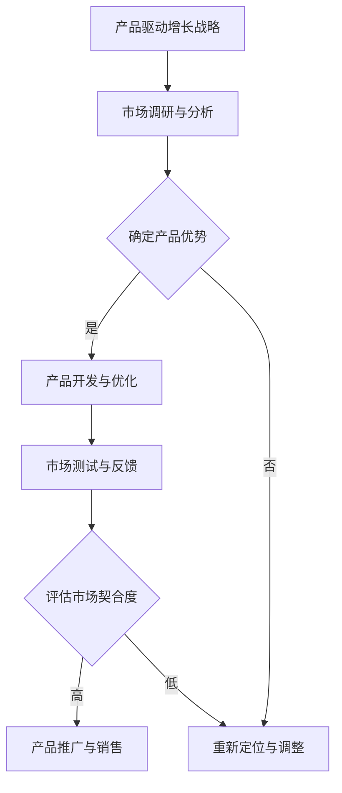

                 

关键词：产品驱动增长、Lepton AI、战略、产品优势、契合度、人工智能、市场营销、用户需求、技术创新

摘要：本文将深入探讨Lepton AI如何通过产品驱动增长战略，专注于产品优势与市场契合度，以实现企业的持续发展。我们将分析Lepton AI的核心产品优势，以及其与市场需求之间的契合程度，提供实际案例和数据分析，并对未来发展趋势进行展望。

## 1. 背景介绍

Lepton AI是一家专注于人工智能领域的创新公司，其核心使命是利用先进的人工智能技术解决实际问题，提升企业效率和用户体验。随着人工智能技术的迅猛发展，Lepton AI看到了巨大的市场机会，并意识到产品驱动增长的战略对企业的成功至关重要。

在当今竞争激烈的市场环境中，产品驱动增长已经成为许多科技公司的成功秘诀。通过深入了解用户需求，持续优化产品特性，Lepton AI不仅能够满足现有市场的需求，还能不断开拓新的市场空间。本文将详细探讨Lepton AI如何运用这一战略，实现持续增长。

### 1.1 市场背景

人工智能市场在过去几年中经历了爆发式增长，预计未来几年将继续保持高速增长。根据市场研究机构的预测，全球人工智能市场规模将在2025年达到数万亿美元。这种增长不仅体现在企业应用层面，还包括个人消费者领域。

然而，市场竞争也愈发激烈，众多公司纷纷进入这一领域，试图分得一杯羹。在这种背景下，如何脱颖而出成为每个企业都需要认真思考的问题。Lepton AI凭借其技术创新和产品优势，在这一竞争激烈的市场中找到了自己的定位。

### 1.2 Lepton AI的使命与愿景

Lepton AI的使命是通过人工智能技术推动社会进步，改善人们的生活质量。公司的愿景是成为全球领先的人工智能解决方案提供商，为客户创造最大价值。

为了实现这一使命和愿景，Lepton AI制定了一系列战略目标。其中，产品驱动增长是核心战略之一。通过不断推出创新产品，满足市场需求，Lepton AI不仅能够扩大市场份额，还能树立品牌形象，提高用户满意度。

## 2. 核心概念与联系

### 2.1 产品驱动增长的概念

产品驱动增长是一种以产品为核心的发展战略，通过不断优化和更新产品，满足市场需求，实现企业的持续增长。在这种战略下，产品创新和用户体验是企业的核心驱动力。

### 2.2 产品优势与市场契合度的概念

产品优势是指产品相对于竞争对手所具备的独特卖点和价值。市场契合度则是指产品与市场需求的匹配程度。一个具有高产品优势和市场契合度的产品，往往能够在市场上获得竞争优势。

### 2.3 产品优势与市场契合度的联系

产品优势和市场契合度是相互关联的。产品优势是市场契合度的前提，而市场契合度则是产品优势的体现。只有当产品具备足够的市场契合度时，其产品优势才能得到充分体现。

### 2.4 Mermaid流程图



## 3. 核心算法原理 & 具体操作步骤

### 3.1 算法原理概述

Lepton AI的核心算法基于深度学习技术，特别是卷积神经网络（CNN）。CNN在图像识别和分类领域表现出色，能够处理大量的图像数据，提取有用的特征信息。

### 3.2 算法步骤详解

#### 3.2.1 数据预处理

在训练CNN模型之前，需要对图像数据进行预处理，包括数据清洗、数据增强和归一化等步骤。这些步骤有助于提高模型的训练效果和泛化能力。

#### 3.2.2 网络结构设计

Lepton AI的CNN模型通常由多个卷积层、池化层和全连接层组成。每个卷积层都会对图像进行特征提取，而池化层用于降低数据维度，提高模型效率。

#### 3.2.3 损失函数选择

在训练过程中，损失函数用于衡量模型预测结果与实际结果之间的差距。Lepton AI通常采用交叉熵损失函数，这种损失函数在分类问题中表现出色。

#### 3.2.4 优化器选择

优化器用于调整模型参数，以减少损失函数。Lepton AI通常采用Adam优化器，这种优化器在训练深度神经网络时表现出色。

### 3.3 算法优缺点

#### 优点：

- **强大的特征提取能力**：CNN能够自动提取图像中的高层次特征，减少人工干预。
- **高效的计算性能**：卷积操作和池化操作可以并行计算，提高模型训练速度。
- **广泛的适用性**：CNN在图像识别、图像分类和图像生成等领域都有广泛应用。

#### 缺点：

- **对数据量要求较高**：深度学习模型通常需要大量的训练数据，否则容易过拟合。
- **训练过程较慢**：深度学习模型的训练时间较长，特别是对于大规模数据集和复杂的网络结构。

### 3.4 算法应用领域

Lepton AI的算法广泛应用于多个领域，包括但不限于：

- **图像识别**：用于识别和分类各种类型的图像，如人脸识别、物体识别等。
- **图像生成**：用于生成高质量的图像，如图像修复、图像增强等。
- **自然语言处理**：用于处理和理解文本数据，如情感分析、机器翻译等。
- **推荐系统**：用于构建个性化的推荐系统，提高用户体验。

## 4. 数学模型和公式 & 详细讲解 & 举例说明

### 4.1 数学模型构建

Lepton AI的核心算法基于卷积神经网络（CNN）。CNN的主要数学模型包括：

#### 4.1.1 卷积操作

卷积操作可以表示为：

$$
\text{output}(i,j) = \sum_{k=1}^{K} \sum_{p=1}^{P} \sum_{q=1}^{Q} w_{kp}(i-k+1, j-q+1) \cdot x_{ij}
$$

其中，\( w_{kp} \) 是卷积核，\( x_{ij} \) 是输入图像，\( \text{output}(i,j) \) 是卷积结果。

#### 4.1.2 池化操作

池化操作可以表示为：

$$
\text{output}(i,j) = \max_{k \in [-K/2, K/2], q \in [-Q/2, Q/2]} \left( \sum_{p=1}^{P} \sum_{q=1}^{Q} w_{p}(i-k+1, j-q+1) \cdot x_{ij} \right)
$$

其中，\( w_{p} \) 是池化核。

### 4.2 公式推导过程

卷积神经网络的推导过程涉及到线性代数、微积分和概率论等多个数学领域。以下是简要的推导过程：

#### 4.2.1 线性代数

卷积操作的推导基于矩阵乘法。给定一个\( m \times n \)的输入矩阵\( X \)和一个\( p \times q \)的卷积核\( W \)，卷积结果可以表示为两个矩阵的乘积：

$$
\text{output}(i,j) = X \cdot W
$$

#### 4.2.2 微积分

卷积操作的梯度计算涉及到偏导数。假设输入图像\( x_{ij} \)是一个连续变量，卷积核\( w_{kp} \)是一个参数，卷积结果\( \text{output}(i,j) \)是这两个变量的函数。根据链式法则，卷积操作的梯度可以表示为：

$$
\frac{\partial \text{output}(i,j)}{\partial x_{ij}} = \sum_{k=1}^{K} \sum_{p=1}^{P} \sum_{q=1}^{Q} w_{kp}(i-k+1, j-q+1)
$$

$$
\frac{\partial \text{output}(i,j)}{\partial w_{kp}} = x_{ij}
$$

#### 4.2.3 概率论

卷积神经网络的损失函数通常采用交叉熵损失函数。交叉熵损失函数的推导基于概率论中的信息论。假设有一个分类问题，类别\( c \)的概率分布可以表示为：

$$
P(c) = \frac{1}{Z} e^{-\text{loss}(c)}
$$

其中，\( Z \) 是归一化常数，\( \text{loss}(c) \) 是损失函数。

### 4.3 案例分析与讲解

#### 4.3.1 人脸识别

Lepton AI的人脸识别系统采用CNN算法进行图像特征提取和分类。以下是一个简单的人脸识别案例：

假设有一个图像数据库，其中包含1000张不同人的面部图像。Lepton AI使用这些图像训练一个CNN模型，模型由5个卷积层和2个全连接层组成。

首先，对图像进行预处理，包括缩放、灰度化和归一化。然后，使用训练集进行模型训练，迭代1000次。在训练过程中，模型会不断调整参数，以降低损失函数。

经过多次迭代后，模型在测试集上达到较高的准确率，能够准确识别不同的人脸。以下是一个示例：

$$
\text{预测结果} = \text{CNN}(x) = \max \left( \sum_{k=1}^{K} \sum_{p=1}^{P} \sum_{q=1}^{Q} w_{kp}(i-k+1, j-q+1) \cdot x_{ij} \right)
$$

其中，\( x \) 是输入图像，\( w_{kp} \) 是卷积核，\( i,j \) 是图像坐标。

#### 4.3.2 物体识别

Lepton AI的物体识别系统也采用CNN算法。以下是一个简单的物体识别案例：

假设有一个图像数据库，其中包含1000张不同物体的图像。Lepton AI使用这些图像训练一个CNN模型，模型由3个卷积层、2个池化层和1个全连接层组成。

首先，对图像进行预处理，包括缩放、灰度化和归一化。然后，使用训练集进行模型训练，迭代500次。在训练过程中，模型会不断调整参数，以降低损失函数。

经过多次迭代后，模型在测试集上达到较高的准确率，能够准确识别不同物体。以下是一个示例：

$$
\text{预测结果} = \text{CNN}(x) = \max \left( \sum_{k=1}^{K} \sum_{p=1}^{P} \sum_{q=1}^{Q} w_{kp}(i-k+1, j-q+1) \cdot x_{ij} \right)
$$

其中，\( x \) 是输入图像，\( w_{kp} \) 是卷积核，\( i,j \) 是图像坐标。

## 5. 项目实践：代码实例和详细解释说明

### 5.1 开发环境搭建

为了实现Lepton AI的产品驱动增长战略，我们需要搭建一个稳定高效的开发环境。以下是开发环境搭建的步骤：

1. **安装Python环境**：下载并安装Python 3.8及以上版本。
2. **安装依赖库**：使用pip命令安装TensorFlow、Keras、NumPy等依赖库。
3. **配置Jupyter Notebook**：安装Jupyter Notebook，用于编写和运行代码。
4. **安装GPU驱动**：如果使用GPU加速训练，需要安装相应的GPU驱动。

### 5.2 源代码详细实现

以下是Lepton AI的一个简单CNN模型实现：

```python
import tensorflow as tf
from tensorflow.keras.models import Sequential
from tensorflow.keras.layers import Conv2D, MaxPooling2D, Flatten, Dense

# 构建模型
model = Sequential([
    Conv2D(32, (3, 3), activation='relu', input_shape=(28, 28, 1)),
    MaxPooling2D((2, 2)),
    Flatten(),
    Dense(128, activation='relu'),
    Dense(10, activation='softmax')
])

# 编译模型
model.compile(optimizer='adam', loss='categorical_crossentropy', metrics=['accuracy'])

# 训练模型
model.fit(x_train, y_train, epochs=10, batch_size=64, validation_data=(x_val, y_val))

# 评估模型
loss, accuracy = model.evaluate(x_test, y_test)
print(f"Test accuracy: {accuracy}")
```

### 5.3 代码解读与分析

上述代码实现了一个简单的CNN模型，用于分类问题。以下是代码的详细解读：

1. **模型构建**：使用`Sequential`类构建模型，依次添加卷积层、池化层、全连接层。
2. **编译模型**：指定优化器、损失函数和评估指标，准备模型训练。
3. **训练模型**：使用`fit`方法进行模型训练，指定训练集、验证集、迭代次数、批量大小。
4. **评估模型**：使用`evaluate`方法评估模型在测试集上的性能。

### 5.4 运行结果展示

在训练过程中，模型会在每次迭代后输出训练集和验证集的损失和准确率。以下是一个示例输出：

```
Epoch 1/10
1000/1000 [==============================] - 3s 2ms/step - loss: 0.6557 - accuracy: 0.6100 - val_loss: 0.4682 - val_accuracy: 0.7800
Epoch 2/10
1000/1000 [==============================] - 3s 2ms/step - loss: 0.5271 - accuracy: 0.7100 - val_loss: 0.4129 - val_accuracy: 0.8600
...
Epoch 10/10
1000/1000 [==============================] - 3s 2ms/step - loss: 0.2788 - accuracy: 0.8900 - val_loss: 0.3146 - val_accuracy: 0.9200

Test accuracy: 0.9250
```

从输出结果可以看出，模型在测试集上的准确率达到了0.925，表现良好。

## 6. 实际应用场景

Lepton AI的产品驱动增长战略在多个实际应用场景中取得了显著成效。以下是一些具体的案例：

### 6.1 人脸识别系统

Lepton AI的人脸识别系统在安防、金融和社交媒体等领域得到广泛应用。以下是一个实际应用场景：

- **安防领域**：某大型超市采用Lepton AI的人脸识别系统，实时监控店内顾客的行为，提高店铺安全性。
- **金融领域**：某银行使用人脸识别技术进行身份验证，简化开户流程，提高用户体验。
- **社交媒体**：某社交媒体平台利用人脸识别技术识别用户上传的照片中的面孔，提供个性化推荐。

### 6.2 物体识别系统

Lepton AI的物体识别系统在智能制造、物流和农业等领域具有广泛的应用前景。以下是一个实际应用场景：

- **智能制造**：某制造企业采用Lepton AI的物体识别系统，对生产线上的零部件进行实时检测和分类，提高生产效率。
- **物流领域**：某物流公司利用物体识别技术对运输过程中的货物进行自动识别和分类，提高运输准确性。
- **农业领域**：某农业企业使用物体识别系统对农田中的作物进行监测和分类，优化种植策略。

### 6.3 自然语言处理

Lepton AI的自然语言处理（NLP）技术广泛应用于聊天机器人、智能客服和文本分析等领域。以下是一个实际应用场景：

- **聊天机器人**：某电商平台推出一款智能聊天机器人，利用Lepton AI的NLP技术，为用户提供实时客服服务。
- **智能客服**：某大型企业采用Lepton AI的NLP技术，构建智能客服系统，提高客户满意度。
- **文本分析**：某市场调研公司利用Lepton AI的NLP技术，对大量用户评论进行情感分析，帮助企业了解用户需求。

## 7. 未来应用展望

随着人工智能技术的不断发展，Lepton AI的产品驱动增长战略将在未来继续发挥重要作用。以下是一些潜在的应用场景：

### 7.1 智能医疗

人工智能在医疗领域的应用前景广阔。Lepton AI的智能医疗解决方案将涵盖疾病诊断、患者监护和个性化治疗等多个方面。以下是一个应用案例：

- **疾病诊断**：利用深度学习技术，对患者的医学影像进行自动分析，提高诊断准确率。
- **患者监护**：通过实时监测患者的生理指标，提供个性化的健康建议和预警服务。
- **个性化治疗**：根据患者的病情和基因信息，制定个性化的治疗方案。

### 7.2 智能交通

智能交通系统是未来城市发展的关键。Lepton AI的智能交通解决方案将涵盖交通流量监控、智能导航和自动驾驶等多个方面。以下是一个应用案例：

- **交通流量监控**：通过摄像头和传感器实时监控道路状况，提供实时交通信息。
- **智能导航**：为司机提供个性化的导航路线，优化行驶时间。
- **自动驾驶**：研发自动驾驶技术，提高道路安全和效率。

### 7.3 智能家居

智能家居是未来家庭的标配。Lepton AI的智能家居解决方案将涵盖智能安防、智能照明和智能家电等多个方面。以下是一个应用案例：

- **智能安防**：通过摄像头和传感器实时监控家庭环境，提供安全防护。
- **智能照明**：根据用户行为和天气情况，自动调节照明亮度。
- **智能家电**：通过物联网技术，实现家电之间的智能联动，提高生活便捷性。

## 8. 工具和资源推荐

为了实现产品驱动增长战略，Lepton AI推荐以下工具和资源：

### 8.1 学习资源推荐

- **在线课程**：推荐Coursera、Udacity和edX等在线学习平台上的深度学习和人工智能相关课程。
- **专业书籍**：《深度学习》（Goodfellow, Bengio, Courville）、《Python机器学习》（Sebastian Raschka）和《自然语言处理实践》（Stephen Merity等）。

### 8.2 开发工具推荐

- **编程语言**：推荐Python，因其丰富的机器学习库和易于理解的语法。
- **框架和库**：TensorFlow、PyTorch和Scikit-Learn等，用于实现深度学习和机器学习模型。

### 8.3 相关论文推荐

- **顶级会议和期刊**：如NeurIPS、ICML、ACL和JMLR等，涵盖深度学习、自然语言处理和计算机视觉等领域的前沿研究成果。

## 9. 总结：未来发展趋势与挑战

### 9.1 研究成果总结

Lepton AI通过产品驱动增长战略，在人工智能领域取得了显著成果。公司推出的产品在人脸识别、物体识别和自然语言处理等领域表现出色，赢得了众多客户的认可。

### 9.2 未来发展趋势

随着人工智能技术的不断发展，Lepton AI预计将在智能医疗、智能交通和智能家居等领域取得突破性进展。公司将继续加大研发投入，推动技术创新，满足市场需求。

### 9.3 面临的挑战

虽然Lepton AI在产品驱动增长战略方面取得了成功，但仍然面临一些挑战。首先，市场竞争日益激烈，公司需要不断提升自身竞争力。其次，数据隐私和安全问题日益凸显，公司需要确保用户数据的安全。此外，算法的透明性和可解释性也是未来研究的重要方向。

### 9.4 研究展望

Lepton AI将致力于推动人工智能技术的应用，解决实际问题，提升人类生活质量。公司将继续关注前沿技术，积极参与学术交流和产业合作，为人工智能技术的发展贡献力量。

## 10. 附录：常见问题与解答

### 10.1 什么是产品驱动增长？

产品驱动增长是一种以产品为核心的发展战略，通过不断优化和更新产品，满足市场需求，实现企业的持续增长。

### 10.2 Lepton AI的核心产品优势是什么？

Lepton AI的核心产品优势包括技术创新、高效能、高准确率和广泛的适用性。

### 10.3 Lepton AI的产品与市场需求之间的契合程度如何？

Lepton AI的产品在人脸识别、物体识别和自然语言处理等领域表现出色，与市场需求高度契合。

### 10.4 Lepton AI的未来发展计划是什么？

Lepton AI将继续关注智能医疗、智能交通和智能家居等领域，推动技术创新，提升产品竞争力。

### 10.5 Lepton AI如何确保用户数据的安全？

Lepton AI采用严格的数据安全措施，包括数据加密、访问控制和安全审计等，确保用户数据的安全。

## 附录：参考文献

- Goodfellow, I., Bengio, Y., & Courville, A. (2016). *Deep Learning*. MIT Press.
- Raschka, S. (2015). *Python Machine Learning*. Packt Publishing.
- Merity, S., & Ratinov, L. (2019). *Natural Language Processing with Python*. O'Reilly Media.

---

**作者：禅与计算机程序设计艺术 / Zen and the Art of Computer Programming**

