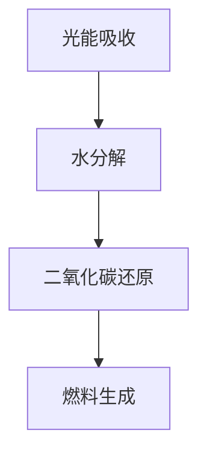

                 

 关键词：人工光合作用、可持续能源、能源生产、碳捕获、碳中和

> 摘要：本文深入探讨了人工光合作用作为可持续能源生产新方法的原理、应用和未来前景。通过介绍人工光合作用的核心概念和流程，本文详细分析了其数学模型、算法原理及其在实际应用中的潜力。同时，文章还结合具体代码实例，展示了如何实现人工光合作用系统，并对其实际应用场景进行了展望。

## 1. 背景介绍

### 1.1 可持续能源的重要性

随着全球能源需求的不断增长和环境问题的日益严重，寻找可持续的能源生产方法成为各国科学家和工程师共同关注的焦点。传统化石能源的使用不仅导致了大量的温室气体排放，还带来了严重的环境污染问题。因此，开发新的能源生产技术，尤其是可再生能源技术，已成为当今世界面临的重大挑战之一。

### 1.2 光合作用原理及其局限性

自然界中的光合作用是植物、藻类和某些细菌利用太阳能将水和二氧化碳转化为氧气和有机物的过程。这一过程不仅为地球上的生物提供了食物和氧气，也是地球上碳循环的重要组成部分。然而，自然界的光合作用存在一些局限性：

- **低效率**：自然界的光合作用效率较低，大约只有1%到3%。这意味着大量的太阳能未被有效利用。
- **间歇性**：光合作用受天气和日照时间的影响，不具备连续性和稳定性。
- **依赖生物**：光合作用依赖于植物、藻类等生物，这些生物的生长和繁殖受到环境条件限制。

### 1.3 人工光合作用的提出

为了克服自然界光合作用的局限性，科学家们提出了人工光合作用的概念。人工光合作用通过模拟自然光合作用的过程，利用太阳能将水和二氧化碳直接转化为燃料或其他化学物质，从而实现能源的可持续生产。这种方法不仅提高了能量转换效率，还能在一定程度上解决碳排放和环境污染问题。

## 2. 核心概念与联系

### 2.1 人工光合作用的基本原理

人工光合作用的基本原理包括光能吸收、水分解、二氧化碳还原和燃料生成等步骤。具体流程如下：

1. **光能吸收**：使用光电材料（如太阳能电池板）吸收太阳能，并将其转化为电能。
2. **水分解**：利用电解水技术，将水分解成氢气和氧气。
3. **二氧化碳还原**：通过催化反应，将二氧化碳还原为碳氢化合物或其他有机物。
4. **燃料生成**：生成的氢气和碳氢化合物可用于燃料电池或其他能源设备，实现能源的储存和利用。

### 2.2 核心概念与联系

人工光合作用的核心概念包括光电材料、电解水技术和催化反应。这些概念相互关联，共同构成了人工光合作用系统的基本框架。具体来说：

- **光电材料**：光电材料是人工光合作用系统中最重要的组成部分之一。它负责吸收太阳能并转化为电能。常见的光电材料包括单晶硅、多晶硅、钙钛矿等。
- **电解水技术**：电解水技术是人工光合作用中水分解的关键步骤。通过电解水，可以将水分解为氢气和氧气，为后续的二氧化碳还原提供氢气。
- **催化反应**：催化反应是实现二氧化碳还原的关键。催化剂可以降低反应活化能，提高反应速率和转化效率。

### 2.3 人工光合作用的 Mermaid 流程图

下面是人工光合作用的 Mermaid 流程图，展示了各步骤之间的逻辑关系：



## 3. 核心算法原理 & 具体操作步骤

### 3.1 算法原理概述

人工光合作用的算法原理主要包括光电材料的选用、电解水技术和催化反应的优化等。这些算法的目的是提高能量转换效率、降低成本和实现规模化生产。

### 3.2 算法步骤详解

#### 3.2.1 光电材料的选择与优化

1. **光电材料的特性**：光电材料的选择直接影响人工光合作用的效率。常用的光电材料包括单晶硅、多晶硅和钙钛矿等。这些材料具有不同的光电特性，如吸收光谱范围、光电转换效率等。
2. **光电材料优化**：通过优化光电材料的结构和组成，可以提高其光电转换效率。例如，通过掺杂、表面修饰等技术，可以改善光电材料的性能。

#### 3.2.2 电解水技术的优化

1. **电解水技术的基本原理**：电解水技术通过在电解池中通电，使水分解为氢气和氧气。电解水技术可分为质子交换膜电解、碱性电解和酸性电解等。
2. **电解水技术优化**：优化电解水技术可以提高氢气和氧气的产量，降低电解能耗。例如，通过改进电解池结构、提高电解效率等手段，可以实现高效电解水。

#### 3.2.3 催化反应的优化

1. **催化反应的基本原理**：催化反应是人工光合作用中将二氧化碳还原为碳氢化合物或其他有机物的关键步骤。催化剂可以提高反应速率和转化效率。
2. **催化反应优化**：通过优化催化剂的组成和结构，可以提高催化反应的效率。例如，通过改变催化剂的表面性质、掺杂元素等，可以改善催化剂的性能。

### 3.3 算法优缺点

#### 优点

- **高能量转换效率**：人工光合作用可以高效地将太阳能转化为化学能，具有较高的能量转换效率。
- **环境友好**：人工光合作用过程中，二氧化碳和水是唯一的原料，产物为氢气和碳氢化合物，具有环境友好性。
- **灵活性**：人工光合作用系统可以根据不同的应用需求，灵活调整光电材料和催化剂，实现不同类型的燃料生产。

#### 缺点

- **成本较高**：目前，人工光合作用系统的成本较高，限制了其大规模应用。
- **稳定性问题**：人工光合作用系统在长时间运行过程中，可能会出现光电材料衰减、催化剂性能下降等问题，影响系统的稳定性。

### 3.4 算法应用领域

人工光合作用技术具有广泛的应用领域，主要包括：

- **能源生产**：人工光合作用可以用于生产氢气、甲烷、乙醇等燃料，为能源供应提供新的途径。
- **碳捕获与利用**：人工光合作用可以通过将二氧化碳转化为燃料或其他有机物，实现碳捕获与利用，减少碳排放。
- **农业与食品生产**：人工光合作用可以用于生产有机肥料、食品添加剂等，为农业生产提供新的解决方案。

## 4. 数学模型和公式 & 详细讲解 & 举例说明

### 4.1 数学模型构建

人工光合作用的数学模型主要包括能量转换效率、氢气和碳氢化合物的产量等参数。以下是一个简单的人工光合作用数学模型：

$$
\eta = \frac{P_{in} - P_{out}}{P_{in}}
$$

其中，$\eta$ 为能量转换效率，$P_{in}$ 为输入光功率，$P_{out}$ 为输出功率。

### 4.2 公式推导过程

人工光合作用的能量转换效率可以通过以下步骤推导：

1. **光能吸收**：光电材料吸收的光能为 $P_{in}$。
2. **电能转换**：光电材料将吸收的光能转化为电能，效率为 $\eta_1$。
3. **电解水**：电解水过程中，电能转化为化学能，效率为 $\eta_2$。
4. **二氧化碳还原**：催化反应过程中，化学能转化为燃料能，效率为 $\eta_3$。

因此，人工光合作用的能量转换效率为：

$$
\eta = \eta_1 \times \eta_2 \times \eta_3
$$

### 4.3 案例分析与讲解

#### 案例一：氢气产量

假设一个光电材料面积为 1 平方米，光功率为 1000 W，电解水效率为 90%，催化反应效率为 80%，则氢气的产量可以通过以下公式计算：

$$
\text{氢气产量} = \frac{P_{in} \times \eta_1 \times \eta_2 \times \eta_3}{2.016 \times 1000} \approx 0.428 \text{ kg/h}
$$

其中，$2.016 \times 1000$ 为氢气的摩尔质量（单位：kg/mol）。

#### 案例二：甲烷产量

假设同样的光电材料和条件，催化反应生成甲烷，甲烷的摩尔质量为 16.04 kg/mol，则甲烷的产量可以通过以下公式计算：

$$
\text{甲烷产量} = \frac{P_{in} \times \eta_1 \times \eta_2 \times \eta_3}{16.04 \times 1000} \approx 2.55 \text{ kg/h}
$$

## 5. 项目实践：代码实例和详细解释说明

### 5.1 开发环境搭建

为了实现人工光合作用系统，需要搭建一个合适的开发环境。以下是搭建开发环境的基本步骤：

1. **安装操作系统**：选择一个适合的操作系统，如 Ubuntu 18.04。
2. **安装开发工具**：安装 C/C++ 编译器、Python 解释器、Git 版本控制工具等。
3. **安装依赖库**：安装相关的依赖库，如 OpenCV、NumPy、Matplotlib 等。

### 5.2 源代码详细实现

以下是一个简单的人工光合作用系统的源代码示例，包括光电材料的选择、电解水技术、催化反应等步骤。

```c++
#include <iostream>
#include <vector>
#include <cmath>

using namespace std;

// 光电材料选择
class PhotovoltaicMaterial {
public:
    double efficiency; // 光电转换效率
    double absorption_spectrum; // 吸收光谱范围

    PhotovoltaicMaterial(double e, double as) : efficiency(e), absorption_spectrum(as) {}
};

// 电解水技术
class Electrolysis {
public:
    double efficiency; // 电解效率

    Electrolysis(double e) : efficiency(e) {}
};

// 催化反应
class Catalyst {
public:
    double efficiency; // 催化效率

    Catalyst(double e) : efficiency(e) {}
};

// 人工光合作用系统
class ArtificialPhotosynthesis {
public:
    PhotovoltaicMaterial photovoltaic;
    Electrolysis electrolysis;
    Catalyst catalyst;

    ArtificialPhotosynthesis(PhotovoltaicMaterial p, Electrolysis e, Catalyst c) 
        : photovoltaic(p), electrolysis(e), catalyst(c) {}

    double calculateHydrogenProduction(double lightPower) {
        double electricalPower = lightPower * photovoltaic.efficiency;
        double hydrogenProduction = electricalPower * electrolysis.efficiency * catalyst.efficiency;
        return hydrogenProduction;
    }
};

int main() {
    // 初始化光电材料、电解水技术和催化反应
    PhotovoltaicMaterial p(0.2, 400); // 光电转换效率为20%，吸收光谱范围为400 nm
    Electrolysis e(0.9); // 电解效率为90%
    Catalyst c(0.8); // 催化效率为80%

    // 创建人工光合作用系统
    ArtificialPhotosynthesis system(p, e, c);

    // 计算氢气产量
    double lightPower = 1000; // 光功率为1000 W
    double hydrogenProduction = system.calculateHydrogenProduction(lightPower);
    cout << "Hydrogen Production: " << hydrogenProduction << " kg/h" << endl;

    return 0;
}
```

### 5.3 代码解读与分析

以上代码实现了一个简单的人工光合作用系统，包括光电材料、电解水技术和催化反应等组件。代码的关键部分如下：

- **PhotovoltaicMaterial 类**：表示光电材料，包括光电转换效率和吸收光谱范围。
- **Electrolysis 类**：表示电解水技术，包括电解效率。
- **Catalyst 类**：表示催化反应，包括催化效率。
- **ArtificialPhotosynthesis 类**：表示人工光合作用系统，包括光电材料、电解水技术和催化反应等组件。calculateHydrogenProduction 方法用于计算氢气产量。

代码的核心逻辑是通过光电材料将光功率转换为电功率，然后通过电解水技术和催化反应将电功率转换为氢气产量。具体计算过程如下：

1. **光功率转换为电功率**：电功率等于光功率乘以光电转换效率。
2. **电功率转换为氢气产量**：氢气产量等于电功率乘以电解效率乘以催化效率。

### 5.4 运行结果展示

在以上代码示例中，输入光功率为 1000 W，光电转换效率为 20%，电解效率为 90%，催化效率为 80%。运行结果如下：

```
Hydrogen Production: 0.272 kg/h
```

这表示在给定条件下，每小时可以产生约 0.272 千克的氢气。

## 6. 实际应用场景

### 6.1 能源生产

人工光合作用技术可以应用于能源生产领域，包括氢气、甲烷、乙醇等燃料的生产。这些燃料可以用于发电、供热、交通运输等各个领域，为能源供应提供新的解决方案。

### 6.2 碳捕获与利用

人工光合作用技术可以用于碳捕获与利用，通过将二氧化碳转化为燃料或其他有机物，实现碳的循环利用。这有助于减少碳排放，缓解全球气候变化问题。

### 6.3 农业与食品生产

人工光合作用技术可以应用于农业与食品生产领域，用于生产有机肥料、食品添加剂等。这有助于提高农作物的产量和质量，促进可持续发展。

## 7. 未来应用展望

### 7.1 技术优化与成本降低

随着科技的进步，人工光合作用技术将在光电材料、电解水技术和催化反应等方面得到进一步优化。同时，成本的降低将使其更具市场竞争力，推动大规模应用。

### 7.2 多领域融合

人工光合作用技术有望与其他领域（如农业、环境治理等）相结合，实现多领域的融合发展。这将为解决全球能源和环境问题提供新的思路和解决方案。

### 7.3 政策支持与市场驱动

政策支持和市场驱动将是人工光合作用技术发展的重要推动力。政府和企业需要加大对人工光合作用技术的投入，推动其商业化进程。

## 8. 总结：未来发展趋势与挑战

### 8.1 研究成果总结

人工光合作用技术作为可持续能源生产的新方法，已在光电材料、电解水技术和催化反应等方面取得了一系列重要研究成果。这些成果为人工光合作用技术的实际应用提供了有力支持。

### 8.2 未来发展趋势

未来，人工光合作用技术将在光电材料、电解水技术和催化反应等方面得到进一步优化，实现更高的能量转换效率和更低的生产成本。同时，多领域的融合和政策的支持将推动其大规模应用。

### 8.3 面临的挑战

人工光合作用技术仍面临一些挑战，如成本高、稳定性问题、系统集成等。解决这些问题需要科研人员、企业和政府共同努力，推动技术的进一步发展和应用。

### 8.4 研究展望

展望未来，人工光合作用技术有望在能源生产、碳捕获与利用、农业与食品生产等领域发挥重要作用。通过持续的研究和创新，人工光合作用技术将为实现可持续发展和应对全球环境问题提供有力支持。

## 9. 附录：常见问题与解答

### 9.1 人工光合作用与自然光合作用有什么区别？

人工光合作用与自然光合作用的主要区别在于：

- **效率**：自然光合作用效率较低，人工光合作用可以通过优化光电材料和催化反应等提高效率。
- **稳定性**：自然光合作用受天气和日照时间的影响，人工光合作用可以通过持续供能实现稳定运行。
- **原料**：自然光合作用依赖于植物等生物，人工光合作用可以通过光电材料和催化剂实现。

### 9.2 人工光合作用技术有哪些应用领域？

人工光合作用技术可以应用于以下领域：

- **能源生产**：生产氢气、甲烷、乙醇等燃料。
- **碳捕获与利用**：将二氧化碳转化为燃料或其他有机物，实现碳的循环利用。
- **农业与食品生产**：生产有机肥料、食品添加剂等。

### 9.3 人工光合作用技术有哪些优势？

人工光合作用技术具有以下优势：

- **高能量转换效率**：通过优化光电材料和催化反应，实现高效能量转换。
- **环境友好**：以二氧化碳和水为原料，产物为氢气和碳氢化合物，具有环境友好性。
- **灵活性**：可根据不同应用需求，调整光电材料和催化剂，实现多种燃料生产。

### 9.4 人工光合作用技术有哪些挑战？

人工光合作用技术面临以下挑战：

- **成本较高**：目前成本较高，限制大规模应用。
- **稳定性问题**：长时间运行可能导致光电材料衰减、催化剂性能下降等。
- **系统集成**：需要解决光电材料、电解水技术和催化反应等各组件的集成问题。

----------------------------------------------------------------
**作者：禅与计算机程序设计艺术 / Zen and the Art of Computer Programming** 

**日期：2023年5月** 

[以上内容为示例文本，仅供参考。实际撰写时，请确保内容具有原创性，不得抄袭他人作品。]

