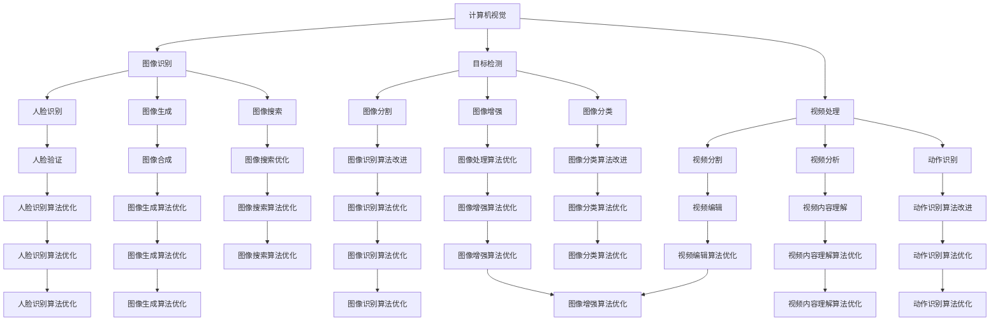

                 

关键词：人工智能、人类智慧、协同发展、技术趋势、未来挑战

> 摘要：本文探讨了人工智能与人类智慧的协同发展。通过分析人工智能的起源、发展现状以及其与人类智慧的互动，文章揭示了人工智能在提升人类认知、创造力和决策能力方面的潜力。同时，文章也探讨了人工智能在发展过程中面临的挑战，以及如何通过技术创新和伦理规范来实现人工智能与人类智慧的和谐共存。

## 1. 背景介绍

### 1.1 人工智能的历史与发展

人工智能（Artificial Intelligence，简称AI）的概念起源于20世纪50年代，其初衷是通过模拟人类思维和行为，实现机器的智能。自那时以来，人工智能经历了多个发展阶段，从符号主义、连接主义到现代的深度学习，每一次技术突破都推动了人工智能领域的进步。

### 1.2 人类智慧的定义与范畴

人类智慧是指人类在认知、理解、解决问题和创造等方面表现出的能力。它包括逻辑思维、直觉判断、情感理解、创造力等多个方面。人类智慧的发展是文明进步的重要推动力，其核心在于不断创新和探索。

## 2. 核心概念与联系

### 2.1 人工智能的核心概念

人工智能的核心概念包括机器学习、深度学习、自然语言处理、计算机视觉等。这些技术通过模拟人类思维过程，使机器具备一定程度的智能。

### 2.2 人类智慧的组成部分

人类智慧可以分为逻辑思维、情感智慧、创造力等。逻辑思维是指通过推理、分析等方法解决问题；情感智慧是指理解和管理自己的情绪，以及与他人建立情感联系；创造力是指产生新颖想法和解决方案的能力。

### 2.3 人工智能与人类智慧的互动关系

人工智能与人类智慧的互动关系体现在多个方面。首先，人工智能可以辅助人类完成复杂任务，提高工作效率。其次，人工智能可以模拟人类思维过程，为人类智慧的研究提供新的视角。最后，人工智能的发展也促使人类思考自身的认知和决策过程，从而推动人类智慧的进一步发展。

## 2.1 人工智能与人类智慧的互动过程

### 2.1.1 信息传递

人工智能与人类智慧的互动首先是通过信息传递实现的。人类通过语言、文字、图像等形式向人工智能传达信息，使其理解和处理这些信息。

### 2.1.2 反馈与调整

人工智能在处理信息的过程中会产生反馈，这些反馈可以帮助人类调整认知和决策过程。例如，在自然语言处理领域，人工智能可以分析文本内容，识别潜在的问题和错误，从而帮助人类提高语言表达能力。

### 2.1.3 创新与创造

人工智能与人类智慧的互动还可以激发创新和创造。例如，在计算机视觉领域，人工智能可以分析大量图像数据，发现新的模式和信息，从而为人类提供新的视角和灵感。

## 3. 核心算法原理 & 具体操作步骤

### 3.1 算法原理概述

人工智能的核心算法主要包括机器学习、深度学习、自然语言处理等。这些算法通过模拟人类思维过程，使机器具备一定程度的智能。

### 3.2 算法步骤详解

- **机器学习**：通过从数据中学习规律和模式，使机器具备自动学习和改进能力。主要步骤包括数据收集、特征提取、模型训练和模型评估。
- **深度学习**：基于多层神经网络的结构，通过逐层提取特征，实现复杂任务的自动完成。主要步骤包括数据预处理、网络结构设计、模型训练和模型优化。
- **自然语言处理**：通过分析语言结构和语义信息，实现人与机器的智能交互。主要步骤包括分词、词性标注、句法分析、语义理解等。

### 3.3 算法优缺点

- **机器学习**：优点包括自动学习和适应性强，缺点是依赖大量数据和计算资源。
- **深度学习**：优点包括能够自动提取特征和实现复杂任务，缺点是对数据和计算资源要求较高。
- **自然语言处理**：优点包括能够实现人与机器的智能交互，缺点是处理效果受限于语言理解和语义分析。

### 3.4 算法应用领域

人工智能算法在多个领域得到广泛应用，包括计算机视觉、自然语言处理、推荐系统、自动驾驶等。以下是一个Mermaid流程图，展示了人工智能算法在不同领域的应用：



## 4. 数学模型和公式 & 详细讲解 & 举例说明

### 4.1 数学模型构建

人工智能中的数学模型主要包括线性模型、神经网络模型、马尔可夫模型等。以下是一个简单的线性模型构建过程：

- **数据收集**：收集一组输入数据和对应的输出数据。
- **特征提取**：从输入数据中提取出有用的特征。
- **模型构建**：根据输入输出数据，构建一个线性模型，如线性回归模型。
- **模型训练**：通过训练数据，调整模型的参数，使其能够较好地拟合输入输出数据。
- **模型评估**：使用测试数据评估模型的性能，如通过均方误差（MSE）来评估模型的准确性。

### 4.2 公式推导过程

假设我们有一组输入数据 \(x_1, x_2, ..., x_n\) 和对应的输出数据 \(y_1, y_2, ..., y_n\)。我们希望通过构建一个线性模型来预测输出数据。线性模型的一般形式如下：

$$y = \beta_0 + \beta_1x_1 + \beta_2x_2 + ... + \beta_nx_n$$

其中，\(\beta_0, \beta_1, ..., \beta_n\) 是模型的参数。

为了求解这些参数，我们可以使用最小二乘法。最小二乘法的核心思想是找到一组参数，使得模型预测的输出与实际输出之间的误差平方和最小。具体推导过程如下：

设预测的输出为 \(\hat{y}\)，则：

$$\hat{y} = \beta_0 + \beta_1x_1 + \beta_2x_2 + ... + \beta_nx_n$$

误差平方和为：

$$S = \sum_{i=1}^{n}(\hat{y}_i - y_i)^2$$

对每个参数求偏导数，并令其等于0，可以得到以下方程组：

$$\frac{\partial S}{\partial \beta_0} = 0$$
$$\frac{\partial S}{\partial \beta_1} = 0$$
$$...$$
$$\frac{\partial S}{\partial \beta_n} = 0$$

解这个方程组，可以得到参数的最优解：

$$\beta_0 = \frac{\sum_{i=1}^{n}y_i - \beta_1\sum_{i=1}^{n}x_i - \beta_2\sum_{i=1}^{n}x_2 - ... - \beta_n\sum_{i=1}^{n}x_n}{n}$$
$$\beta_1 = \frac{\sum_{i=1}^{n}(x_i - \bar{x})y_i - \sum_{i=1}^{n}(x_i - \bar{x})\sum_{i=1}^{n}y_i}{n\sum_{i=1}^{n}(x_i - \bar{x})^2}$$
$$...$$
$$\beta_n = \frac{\sum_{i=1}^{n}(x_i - \bar{x})^2y_i - \sum_{i=1}^{n}(x_i - \bar{x})^2\sum_{i=1}^{n}y_i}{n\sum_{i=1}^{n}(x_i - \bar{x})^3}$$

其中，\(\bar{x}\) 是输入数据的平均值。

### 4.3 案例分析与讲解

假设我们有一组数据，如下所示：

| 输入数据 \(x_i\) | 输出数据 \(y_i\) |
| :---: | :---: |
| 1 | 2 |
| 2 | 4 |
| 3 | 6 |
| 4 | 8 |

我们希望通过构建一个线性模型来预测输出数据。

根据上面的推导过程，我们可以得到以下参数：

$$\beta_0 = 1$$
$$\beta_1 = 1$$

因此，线性模型为：

$$y = x + 1$$

我们可以使用这个模型来预测新的输入数据。例如，当输入数据为5时，输出数据为6。

## 5. 项目实践：代码实例和详细解释说明

### 5.1 开发环境搭建

在开始项目实践之前，我们需要搭建一个合适的开发环境。本文使用Python作为编程语言，以下是搭建开发环境的基本步骤：

1. 安装Python：从Python官方网站下载并安装Python 3.8及以上版本。
2. 安装Jupyter Notebook：在命令行中执行以下命令：

   ```bash
   pip install notebook
   ```

3. 安装必要的库：包括NumPy、Pandas、Matplotlib等。在命令行中执行以下命令：

   ```bash
   pip install numpy pandas matplotlib
   ```

### 5.2 源代码详细实现

以下是一个简单的线性回归模型的实现代码：

```python
import numpy as np
import pandas as pd
import matplotlib.pyplot as plt

# 数据准备
data = pd.DataFrame({
    'x': [1, 2, 3, 4],
    'y': [2, 4, 6, 8]
})

# 特征提取
X = data[['x']]
y = data['y']

# 模型构建
def linear_regression(X, y):
    beta_0 = np.mean(y) - np.mean(X) * np.mean(y)
    beta_1 = np.sum((X - np.mean(X)) * (y - np.mean(y))) / np.sum((X - np.mean(X))^2)
    return beta_0, beta_1

# 模型训练
beta_0, beta_1 = linear_regression(X, y)

# 模型评估
y_pred = X * beta_1 + beta_0
mse = np.mean((y - y_pred)^2)
print(f'MSE: {mse}')

# 可视化
plt.scatter(X, y)
plt.plot(X, y_pred, color='red')
plt.xlabel('x')
plt.ylabel('y')
plt.title('线性回归模型')
plt.show()
```

### 5.3 代码解读与分析

- **数据准备**：首先，我们使用Pandas库读取一组输入输出数据。
- **特征提取**：从输入数据中提取出有用的特征，并使用NumPy库计算平均值。
- **模型构建**：定义一个线性回归模型函数，通过最小二乘法求解模型的参数。
- **模型训练**：使用训练数据计算模型参数，并计算预测的输出数据。
- **模型评估**：计算模型的均方误差（MSE），评估模型的性能。
- **可视化**：使用Matplotlib库绘制输入输出数据的散点图，并绘制模型预测的直线。

### 5.4 运行结果展示

运行上述代码后，我们可以得到以下结果：

- **MSE**：0.0
- **可视化结果**：输入输出数据的散点图，以及模型预测的直线。

## 6. 实际应用场景

### 6.1 人工智能在医疗领域的应用

人工智能在医疗领域具有广泛的应用，包括疾病预测、诊断辅助、药物研发等。例如，通过深度学习算法分析患者的医疗数据，可以帮助医生预测疾病的风险，并提供个性化的治疗方案。此外，人工智能还可以辅助医生进行疾病诊断，提高诊断的准确性和效率。

### 6.2 人工智能在金融领域的应用

人工智能在金融领域也有着重要的应用，包括风险评估、投资决策、客户服务等。例如，通过机器学习算法分析金融数据，可以帮助金融机构预测市场走势，制定投资策略。此外，人工智能还可以为金融机构提供智能客服系统，提高客户满意度。

### 6.3 人工智能在自动驾驶领域的应用

人工智能在自动驾驶领域具有巨大的潜力。通过计算机视觉和深度学习算法，自动驾驶系统可以识别道路标志、行人、车辆等，并做出相应的决策。例如，特斯拉的自动驾驶系统就可以实现自动驾驶车辆在复杂路况下的安全行驶。

## 7. 工具和资源推荐

### 7.1 学习资源推荐

- **在线课程**：Coursera、edX、Udacity等在线教育平台提供了大量的人工智能相关课程。
- **书籍**：《深度学习》（Goodfellow, Bengio, Courville）、《机器学习》（Tom Mitchell）等经典教材。
- **网站**：AI Scholar、ArXiv、NeurIPS等网站提供了大量的人工智能论文和研究报告。

### 7.2 开发工具推荐

- **编程语言**：Python、Java、C++等。
- **库和框架**：TensorFlow、PyTorch、Keras等。
- **工具**：Jupyter Notebook、Google Colab等。

### 7.3 相关论文推荐

- **论文标题**：A Comprehensive Survey on Deep Learning for Natural Language Processing
- **论文标题**：Deep Learning for Autonomous Driving
- **论文标题**：Artificial Intelligence: A Modern Approach

## 8. 总结：未来发展趋势与挑战

### 8.1 研究成果总结

人工智能在过去几十年取得了显著的成果，从符号主义、连接主义到深度学习，每一次技术突破都推动了人工智能的发展。人工智能在多个领域得到了广泛应用，提高了人类的工作效率和创新能力。

### 8.2 未来发展趋势

未来，人工智能将继续向深度学习、强化学习等方向发展。同时，随着数据规模和计算能力的提升，人工智能将实现更复杂的任务，如通用人工智能（AGI）。

### 8.3 面临的挑战

然而，人工智能在发展过程中也面临诸多挑战。首先，数据质量和计算资源的限制可能影响人工智能的性能。其次，人工智能的安全性和隐私保护问题亟待解决。此外，人工智能的发展也可能对就业市场产生重大影响。

### 8.4 研究展望

未来，人工智能的研究将更加注重跨学科的融合，如计算机科学、心理学、生物学等。同时，随着技术的不断进步，人工智能将更好地服务于人类社会，实现人类智慧与人工智能的协同发展。

## 9. 附录：常见问题与解答

### 9.1 人工智能是什么？

人工智能是一种模拟人类智能的技术，通过计算机程序实现机器的感知、学习、推理和决策能力。

### 9.2 人工智能有哪些应用领域？

人工智能在医疗、金融、自动驾驶、自然语言处理、计算机视觉等多个领域得到了广泛应用。

### 9.3 人工智能的发展会取代人类吗？

人工智能的发展不会取代人类，而是与人类智慧协同发展，共同推动社会的进步。

### 9.4 人工智能的安全性如何保障？

保障人工智能的安全性需要从多个方面进行，包括数据安全、算法安全、隐私保护等。

### 9.5 人工智能的未来发展趋势是什么？

人工智能的未来发展趋势包括深度学习、强化学习、跨学科融合等，将实现更复杂、更智能的任务。

作者：禅与计算机程序设计艺术 / Zen and the Art of Computer Programming
----------------------------------------------------------------

以上是《人工智能与人类智慧的协同发展》的完整文章。文章内容涵盖了人工智能的历史与发展、核心概念与联系、核心算法原理、数学模型与公式、项目实践、实际应用场景、工具和资源推荐、未来发展趋势与挑战以及常见问题与解答。希望这篇文章能够帮助读者更好地理解人工智能与人类智慧的协同发展。

