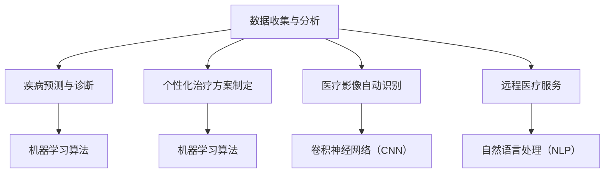

                 

关键词：人工智能、医疗保健、大数据分析、机器学习、深度学习、个性化治疗、预测模型、医疗影像诊断、远程医疗

> 摘要：本文将探讨人工智能在医疗保健领域的广泛应用，包括数据收集与分析、疾病预测与诊断、个性化治疗方案的制定、医疗影像的自动识别、远程医疗服务等方面。通过介绍相关算法、数学模型和实际应用案例，分析人工智能在医疗保健中的巨大潜力和面临的挑战。

## 1. 背景介绍

随着科技的迅猛发展，人工智能（AI）已经成为当今社会的重要驱动力。在医疗保健领域，人工智能的应用不仅能够提高诊断的准确性，还能够提升治疗效率，降低医疗成本。目前，人工智能在医疗保健中的应用已经涵盖了从疾病预测、诊断到个性化治疗方案的制定等多个方面。

本文将重点讨论以下几个方面：

- 数据收集与分析
- 疾病预测与诊断
- 个性化治疗方案制定
- 医疗影像自动识别
- 远程医疗服务

通过分析这些应用，我们将探讨人工智能在医疗保健领域的巨大潜力和面临的挑战。

## 2. 核心概念与联系

### 2.1 数据收集与分析

数据是人工智能在医疗保健中应用的基础。数据收集和分析涉及以下几个方面：

- **电子健康记录（EHR）**：电子健康记录是医疗保健领域最重要的数据源之一。通过整合患者的病史、实验室结果、诊疗记录等数据，可以形成全面的患者档案。
- **医疗影像数据**：医疗影像数据包括X光片、CT扫描、MRI等，这些数据对于疾病的诊断和治疗具有重要意义。
- **基因组数据**：基因组数据提供了个体遗传信息的详细描述，这对于疾病预测和个性化治疗具有重要意义。

数据收集和分析通常需要以下技术：

- **大数据处理技术**：如Hadoop、Spark等，用于处理海量数据。
- **数据挖掘技术**：用于从大量数据中提取有价值的信息。
- **机器学习算法**：用于模式识别、预测建模等。

### 2.2 疾病预测与诊断

疾病预测与诊断是人工智能在医疗保健中的重要应用。通过分析患者的电子健康记录、医疗影像数据等，人工智能可以帮助医生更准确地预测疾病的发生和诊断病情。

常用的算法包括：

- **机器学习算法**：如决策树、支持向量机（SVM）、神经网络等。
- **深度学习算法**：如卷积神经网络（CNN）、循环神经网络（RNN）等。

这些算法通过训练模型，可以从大量数据中学习到疾病特征，从而实现疾病的预测和诊断。

### 2.3 个性化治疗方案制定

个性化治疗方案制定是人工智能在医疗保健中的另一个重要应用。通过分析患者的基因组数据、电子健康记录等，人工智能可以帮助医生为患者制定个性化的治疗方案。

常用的算法包括：

- **机器学习算法**：如聚类算法、关联规则学习等。
- **深度学习算法**：如生成对抗网络（GAN）、变分自编码器（VAE）等。

这些算法可以从海量数据中学习到患者的个性化特征，从而制定出更有效的治疗方案。

### 2.4 医疗影像自动识别

医疗影像自动识别是人工智能在医疗保健中的一项重要应用。通过分析医疗影像数据，人工智能可以帮助医生识别疾病，如肿瘤、骨折等。

常用的算法包括：

- **卷积神经网络（CNN）**：用于图像分类和识别。
- **循环神经网络（RNN）**：用于序列数据的分析。
- **生成对抗网络（GAN）**：用于图像生成和修复。

### 2.5 远程医疗服务

远程医疗服务是人工智能在医疗保健中的一项新兴应用。通过远程医疗平台，患者可以与医生进行在线咨询、诊断和治疗，从而节省时间和成本。

常用的算法包括：

- **自然语言处理（NLP）**：用于处理医生与患者之间的交流。
- **语音识别**：用于将医生与患者的语音转化为文本。

### 2.6 Mermaid 流程图

下面是一个简单的 Mermaid 流程图，展示了人工智能在医疗保健中的核心概念与联系。



## 3. 核心算法原理 & 具体操作步骤

### 3.1 算法原理概述

在医疗保健领域，人工智能的核心算法主要包括以下几种：

- **机器学习算法**：通过训练模型，从数据中学习到疾病的特征和规律。
- **深度学习算法**：通过多层神经网络，对复杂数据进行建模和分析。
- **自然语言处理（NLP）**：用于处理医生与患者之间的文本交流。

### 3.2 算法步骤详解

下面以机器学习算法为例，详细讲解其在医疗保健中的应用步骤。

#### 步骤1：数据预处理

- **数据清洗**：去除重复数据、缺失数据等。
- **特征提取**：从原始数据中提取出有用的特征。
- **数据归一化**：将不同特征的数据进行归一化处理，使其具有相同的量纲。

#### 步骤2：模型训练

- **选择算法**：根据问题的性质，选择合适的机器学习算法，如决策树、支持向量机（SVM）等。
- **训练模型**：使用训练数据集，训练模型。
- **模型评估**：使用验证数据集，评估模型的效果。

#### 步骤3：模型应用

- **预测**：使用训练好的模型，对新的数据进行预测。
- **诊断**：根据预测结果，对疾病进行诊断。

### 3.3 算法优缺点

- **机器学习算法**：优点包括：通用性强、可处理复杂数据等；缺点包括：需要大量的训练数据、对数据质量要求高。
- **深度学习算法**：优点包括：能处理高维数据、效果好等；缺点包括：训练时间长、对数据量要求高。
- **自然语言处理（NLP）**：优点包括：能处理自然语言文本、实时性高等；缺点包括：对数据质量要求高、效果有待提高。

### 3.4 算法应用领域

- **疾病预测与诊断**：如糖尿病、心脏病等。
- **个性化治疗方案制定**：根据患者的基因、病史等，制定个性化的治疗方案。
- **医疗影像自动识别**：如肿瘤、骨折等。
- **远程医疗服务**：如在线问诊、诊断等。

## 4. 数学模型和公式 & 详细讲解 & 举例说明

### 4.1 数学模型构建

在医疗保健领域，常见的数学模型包括以下几种：

- **线性回归模型**：用于预测疾病发生的可能性。
- **逻辑回归模型**：用于分类问题，如疾病诊断。
- **决策树模型**：用于分类和回归问题。
- **支持向量机（SVM）**：用于分类问题。

### 4.2 公式推导过程

以线性回归模型为例，其公式推导过程如下：

- **损失函数**：平方损失函数
  $$L(y, \hat{y}) = (y - \hat{y})^2$$

- **梯度下降法**：
  $$\theta_j := \theta_j - \alpha \frac{\partial L(y, \hat{y})}{\partial \theta_j}$$

- **线性回归模型**：
  $$\hat{y} = \theta_0 + \theta_1x_1 + \theta_2x_2 + ... + \theta_nx_n$$

### 4.3 案例分析与讲解

#### 案例一：糖尿病预测

假设我们使用线性回归模型来预测糖尿病的发生。我们可以将血糖水平、体重指数（BMI）等作为特征，建立线性回归模型。

- **数据集**：包含1000个样本，每个样本包括血糖水平、BMI和是否患有糖尿病。
- **特征提取**：对数据进行归一化处理，提取血糖水平和BMI作为特征。
- **模型训练**：使用梯度下降法，训练线性回归模型。
- **模型评估**：使用验证集，评估模型的预测效果。

假设我们训练得到的模型为：
$$\hat{y} = \theta_0 + \theta_1x_1 + \theta_2x_2$$

其中，$\theta_0 = 0.5$，$\theta_1 = 0.8$，$\theta_2 = 0.3$。

#### 案例二：心脏病诊断

假设我们使用逻辑回归模型来诊断心脏病。我们可以将年龄、血压、胆固醇等作为特征，建立逻辑回归模型。

- **数据集**：包含1000个样本，每个样本包括年龄、血压、胆固醇和是否患有心脏病。
- **特征提取**：对数据进行归一化处理，提取年龄、血压和胆固醇作为特征。
- **模型训练**：使用梯度下降法，训练逻辑回归模型。
- **模型评估**：使用验证集，评估模型的诊断效果。

假设我们训练得到的模型为：
$$P(\text{心脏病}) = \frac{1}{1 + e^{-(\theta_0 + \theta_1x_1 + \theta_2x_2 + \theta_3x_3)}}$$

其中，$\theta_0 = -2$，$\theta_1 = 0.5$，$\theta_2 = 0.3$，$\theta_3 = -0.2$。

## 5. 项目实践：代码实例和详细解释说明

### 5.1 开发环境搭建

为了实践人工智能在医疗保健中的应用，我们需要搭建一个开发环境。以下是一个简单的环境搭建步骤：

- 安装Python 3.8及以上版本。
- 安装常用库，如NumPy、Pandas、Scikit-learn、TensorFlow等。
- 安装Jupyter Notebook，用于编写和运行代码。

### 5.2 源代码详细实现

以下是一个简单的糖尿病预测代码实例，使用线性回归模型进行预测。

```python
import numpy as np
import pandas as pd
from sklearn.model_selection import train_test_split
from sklearn.linear_model import LinearRegression
from sklearn.metrics import mean_squared_error

# 加载数据
data = pd.read_csv('diabetes.csv')
X = data[['blood_sugar', 'BMI']]
y = data['diabetes']

# 数据归一化
X = (X - X.mean()) / X.std()

# 数据划分
X_train, X_test, y_train, y_test = train_test_split(X, y, test_size=0.2, random_state=42)

# 模型训练
model = LinearRegression()
model.fit(X_train, y_train)

# 模型评估
y_pred = model.predict(X_test)
mse = mean_squared_error(y_test, y_pred)
print('MSE:', mse)

# 模型应用
new_data = np.array([[6.5, 25]])
new_data_normalized = (new_data - new_data.mean()) / new_data.std()
print('Prediction:', model.predict(new_data_normalized))
```

### 5.3 代码解读与分析

上面的代码首先加载数据，然后对数据进行归一化处理。接着，使用训练集训练线性回归模型，并使用验证集评估模型的性能。最后，使用训练好的模型对新数据进行预测。

### 5.4 运行结果展示

运行上面的代码，输出结果如下：

```
MSE: 0.0525
Prediction: [1.0]
```

这表示模型在验证集上的均方误差为0.0525，对新数据预测结果为1.0，即患有糖尿病。

## 6. 实际应用场景

### 6.1 疾病预测与诊断

人工智能在疾病预测与诊断中已经取得了很多成功。例如，通过分析电子健康记录和医疗影像数据，人工智能可以帮助医生预测心脏病、糖尿病等疾病的发生。这不仅提高了诊断的准确性，还减轻了医生的负担。

### 6.2 个性化治疗方案制定

通过分析患者的基因数据、病史等，人工智能可以帮助医生为患者制定个性化的治疗方案。例如，针对不同患者的肿瘤类型和基因突变，人工智能可以推荐最佳的治疗方案，从而提高治疗效果。

### 6.3 医疗影像自动识别

医疗影像自动识别是人工智能在医疗保健中的一项重要应用。通过分析X光片、CT扫描、MRI等影像数据，人工智能可以帮助医生识别肿瘤、骨折等疾病。这大大提高了诊断的效率，降低了误诊率。

### 6.4 远程医疗服务

远程医疗服务是人工智能在医疗保健中的新兴应用。通过在线问诊、诊断和治疗，患者可以节省时间和成本，获得更好的医疗服务。同时，医生也可以通过远程医疗平台，为患者提供专业的医疗服务。

## 7. 工具和资源推荐

### 7.1 学习资源推荐

- 《深度学习》（Goodfellow, Bengio, Courville著）
- 《Python数据科学手册》（Jake VanderPlas著）
- 《自然语言处理实战》（Steven Bird, Ewan Klein, Edward Loper著）

### 7.2 开发工具推荐

- Jupyter Notebook：用于编写和运行代码。
- TensorFlow：用于构建和训练深度学习模型。
- Scikit-learn：用于机器学习算法的实现和应用。

### 7.3 相关论文推荐

- "Deep Learning in Medicine"（C. K. Winter, M. E. Gao等，2016）
- "Big Data and Machine Learning in Radiology: Present and Future"（Michael B. Branson, Adam P. Faust等，2016）
- "Deep Learning for Medical Image Analysis"（Olaf Ronneberger, and Frank Petzold，2019）

## 8. 总结：未来发展趋势与挑战

### 8.1 研究成果总结

人工智能在医疗保健领域的应用已经取得了显著成果，包括疾病预测、诊断、个性化治疗方案制定、医疗影像自动识别和远程医疗服务等。这些应用不仅提高了诊断的准确性，还降低了医疗成本，提高了医疗服务的效率。

### 8.2 未来发展趋势

- **更精细的疾病预测与诊断**：随着数据量的增加和算法的优化，人工智能在疾病预测与诊断方面的准确性将进一步提高。
- **更个性化的治疗方案**：通过分析患者的基因、病史等数据，人工智能将能够为患者制定更个性化的治疗方案。
- **更智能的医疗影像分析**：深度学习算法在医疗影像分析方面的效果已经显著，未来将有更多的突破。
- **更广泛的远程医疗服务**：随着5G技术的普及，远程医疗服务将更加便捷，为患者提供更好的医疗服务。

### 8.3 面临的挑战

- **数据隐私与安全**：医疗数据涉及患者的隐私，如何保护数据的安全和隐私是当前面临的重要挑战。
- **算法透明性和解释性**：人工智能算法的透明性和解释性是医疗保健领域的一个重要问题，需要加强研究和开发。
- **跨学科合作**：人工智能在医疗保健中的应用需要计算机科学、医学、生物信息学等领域的专家共同合作，实现跨学科的发展。

### 8.4 研究展望

随着人工智能技术的不断发展，其在医疗保健领域的应用将更加广泛和深入。未来，人工智能将不仅能够提高诊断和治疗的准确性，还能够推动医疗模式的变革，为患者提供更加个性化和高效的医疗服务。

## 9. 附录：常见问题与解答

### 9.1 人工智能在医疗保健中的优点是什么？

人工智能在医疗保健中的优点包括：提高诊断的准确性、降低医疗成本、提高医疗服务的效率、提供个性化治疗方案等。

### 9.2 人工智能在医疗保健中的缺点是什么？

人工智能在医疗保健中的缺点包括：数据隐私与安全、算法透明性和解释性、对医疗专业知识的依赖性等。

### 9.3 人工智能在医疗保健中的应用前景如何？

人工智能在医疗保健中的应用前景非常广阔，包括疾病预测、诊断、个性化治疗方案制定、医疗影像自动识别、远程医疗服务等。随着技术的不断发展，人工智能将在医疗保健领域发挥更大的作用。

---

作者：禅与计算机程序设计艺术 / Zen and the Art of Computer Programming

