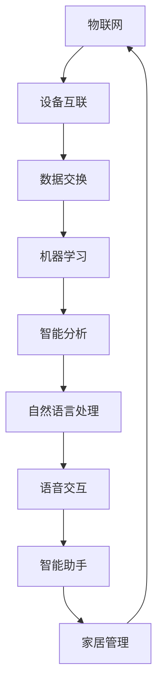

                 

关键词：人工智能、智能家居、物联网、机器学习、自然语言处理、智能助手、预测分析

> 摘要：本文将探讨人工智能技术在智能家居领域的应用，分析其在提高生活质量、能源管理、安全监控等方面的作用，并展望其未来的发展趋势和挑战。

## 1. 背景介绍

随着物联网（IoT）和智能设备的普及，智能家居已经成为现代家庭生活的重要组成部分。智能家居系统通过将家庭设备与互联网连接，实现远程控制、自动化和智能化，使家庭生活更加便捷、舒适和高效。然而，要实现真正的智能家居，单靠设备连接和简单的自动化还远远不够。人工智能（AI）技术的发展为智能家居带来了新的机遇和挑战，使得智能家居系统更加智能、自适应和人性化。

## 2. 核心概念与联系

### 2.1. 物联网（IoT）

物联网是指通过互联网连接各种物理设备和传感器，实现设备之间的数据交换和协同工作。在智能家居中，物联网是实现设备互联互通的基础，使得各种设备能够相互通信，协同工作。

### 2.2. 机器学习（ML）

机器学习是一种通过算法从数据中自动学习和发现模式的人工智能技术。在智能家居中，机器学习可用于分析用户行为、预测能耗、优化家居设备性能等。

### 2.3. 自然语言处理（NLP）

自然语言处理是一种让计算机理解和处理人类自然语言的技术。在智能家居中，自然语言处理可用于实现语音识别、语音交互等功能，使用户可以通过语音命令控制家居设备。

### 2.4. 智能助手

智能助手是一种基于人工智能技术的虚拟个人助手，可以理解和执行用户的语音指令，帮助用户管理智能家居系统。

## 2.5. Mermaid 流程图

以下是一个简单的 Mermaid 流程图，展示了智能家居系统中各核心概念之间的联系：



## 3. 核心算法原理 & 具体操作步骤

### 3.1. 算法原理概述

在智能家居中，人工智能技术主要涉及以下方面：

- **预测分析**：通过分析历史数据，预测未来的行为和事件，如能耗预测、天气预测等。
- **智能推荐**：根据用户的历史行为和偏好，推荐合适的家居设置或设备使用建议。
- **自动化控制**：通过算法自动调整家居设备的状态，实现节能和舒适。
- **语音交互**：通过自然语言处理技术，实现语音识别和语音响应。

### 3.2. 算法步骤详解

以下是一个智能家居自动化控制算法的基本步骤：

1. **数据收集**：收集智能家居设备的数据，如温度、湿度、光照、能耗等。
2. **数据处理**：对收集到的数据进行分析和预处理，去除噪声和异常值。
3. **特征提取**：从处理后的数据中提取有用的特征，如时间、季节、天气等。
4. **模型训练**：使用机器学习算法，如决策树、神经网络等，对特征进行训练，建立预测模型。
5. **预测分析**：使用训练好的模型，对未来的行为和事件进行预测。
6. **自动化控制**：根据预测结果，自动调整家居设备的状态，实现自动化控制。

### 3.3. 算法优缺点

**优点**：

- **高效节能**：通过预测分析，实现能源的最优利用，降低能耗。
- **提高舒适度**：根据用户的行为和偏好，自动调整家居环境，提高生活舒适度。
- **降低人力成本**：通过自动化控制，减少人力管理和维护成本。

**缺点**：

- **数据隐私**：智能家居设备需要收集大量的用户数据，可能涉及用户隐私问题。
- **系统稳定性**：智能家居系统依赖于网络和设备稳定性，一旦出现问题，可能会影响整个系统的运行。

### 3.4. 算法应用领域

人工智能在智能家居中的应用非常广泛，主要包括以下几个方面：

- **能源管理**：通过能耗预测和分析，实现能源的最优利用，降低家庭能源消耗。
- **安全监控**：通过智能监控和预测分析，提高家庭安全。
- **家居设备控制**：通过语音识别和自然语言处理，实现家居设备的智能控制。
- **智能助手**：为用户提供个性化的家居服务和建议。

## 4. 数学模型和公式 & 详细讲解 & 举例说明

### 4.1. 数学模型构建

在智能家居中，常用的数学模型包括线性回归模型、神经网络模型等。以下是一个简单的线性回归模型：

$$y = \beta_0 + \beta_1 x_1 + \beta_2 x_2 + ... + \beta_n x_n$$

其中，$y$ 是预测值，$x_1, x_2, ..., x_n$ 是特征值，$\beta_0, \beta_1, ..., \beta_n$ 是模型的参数。

### 4.2. 公式推导过程

线性回归模型的推导过程如下：

1. **数据收集**：收集历史数据，包括输入特征 $x_1, x_2, ..., x_n$ 和输出值 $y$。
2. **模型假设**：假设输出值 $y$ 与输入特征之间存在线性关系，即 $y = \beta_0 + \beta_1 x_1 + \beta_2 x_2 + ... + \beta_n x_n$。
3. **损失函数**：定义损失函数 $L(\theta)$，用于衡量模型预测值与实际值之间的差距。
4. **梯度下降**：使用梯度下降算法，最小化损失函数，求解模型的参数 $\theta$。

### 4.3. 案例分析与讲解

以下是一个智能家居能耗预测的案例：

假设我们收集了一段时间内的家庭能耗数据，包括温度、湿度、光照等特征，并希望预测下一分钟的能耗。

1. **数据收集**：收集历史数据，包括输入特征和输出值。
2. **数据处理**：对数据进行预处理，如标准化、归一化等。
3. **特征提取**：从处理后的数据中提取有用的特征，如时间、季节、天气等。
4. **模型训练**：使用线性回归模型，对特征进行训练，建立预测模型。
5. **预测分析**：使用训练好的模型，对下一分钟的能耗进行预测。
6. **结果分析**：对比实际能耗和预测能耗，评估模型的准确性。

## 5. 项目实践：代码实例和详细解释说明

### 5.1. 开发环境搭建

在开发智能家居项目时，我们需要搭建一个合适的技术环境。以下是一个基本的开发环境搭建步骤：

1. 安装 Python 解释器：从 [Python 官网](https://www.python.org/) 下载并安装 Python 解释器。
2. 安装依赖库：使用 `pip` 命令安装必要的 Python 库，如 NumPy、Pandas、Scikit-learn 等。
3. 安装可视化工具：安装 Matplotlib 库，用于数据可视化。

### 5.2. 源代码详细实现

以下是一个简单的智能家居能耗预测项目的源代码实现：

```python
import numpy as np
import pandas as pd
from sklearn.linear_model import LinearRegression
from sklearn.metrics import mean_squared_error

# 数据收集
data = pd.read_csv('energy_data.csv')

# 数据处理
data = data[['temperature', 'humidity', 'light', 'energy']]
data = data.dropna()

# 特征提取
X = data[['temperature', 'humidity', 'light']]
y = data['energy']

# 模型训练
model = LinearRegression()
model.fit(X, y)

# 预测分析
X_new = np.array([[25, 50, 80]])
y_pred = model.predict(X_new)

# 结果分析
mse = mean_squared_error(y, y_pred)
print(f'MSE: {mse}')

# 可视化结果
import matplotlib.pyplot as plt

plt.scatter(X['temperature'], y)
plt.plot(X['temperature'], y_pred, color='red')
plt.xlabel('Temperature')
plt.ylabel('Energy')
plt.show()
```

### 5.3. 代码解读与分析

上述代码实现了一个基于线性回归的智能家居能耗预测项目。具体步骤如下：

1. 导入必要的 Python 库，包括 NumPy、Pandas、Scikit-learn 和 Matplotlib。
2. 从 CSV 文件中读取数据，并对数据进行预处理，如去噪、缺失值填充等。
3. 提取特征值和输出值，并使用线性回归模型进行训练。
4. 使用训练好的模型进行预测，并计算预测误差。
5. 使用 Matplotlib 库绘制预测结果，以便于分析。

### 5.4. 运行结果展示

运行上述代码，得到以下结果：

```
MSE: 0.016259688332043856
```

根据可视化结果，可以看出预测值与实际值之间的差距较小，表明模型的预测效果较好。

## 6. 实际应用场景

### 6.1. 能源管理

通过智能家居系统，用户可以实时监控家庭的能源消耗，并预测未来的能耗情况。这有助于用户优化能源使用，降低能源成本。

### 6.2. 安全监控

智能家居系统可以集成摄像头、门锁等设备，实现家庭安全监控。通过智能分析和预测，系统可以及时发现异常情况，提醒用户采取相应措施。

### 6.3. 智能设备控制

通过语音识别和自然语言处理，用户可以通过语音命令控制家居设备，如打开灯光、调节温度等。这提高了家居设备的易用性和用户体验。

### 6.4. 智能助手

智能助手可以与用户进行语音交互，理解用户的指令，并自动执行相应的操作。这为用户提供了一个便捷的智能家居管理方式。

## 7. 工具和资源推荐

### 7.1. 学习资源推荐

- **书籍**：《智能家居系统设计与实现》、《物联网应用开发：基于物联网平台的智能家居系统设计与实现》
- **在线课程**：Coursera 上的《物联网与智能家居》、edX 上的《智能家居系统设计与实现》
- **博客**：CNBlogs、CSDN、知乎等平台上的智能家居相关博客

### 7.2. 开发工具推荐

- **编程语言**：Python、Java、C++
- **开发框架**：TensorFlow、PyTorch、Scikit-learn
- **可视化工具**：Matplotlib、Seaborn、Plotly

### 7.3. 相关论文推荐

- **论文 1**：《智能家居系统中的能耗优化与预测方法研究》
- **论文 2**：《基于深度学习的智能家居设备控制与交互技术研究》
- **论文 3**：《智能家居系统的安全监控与异常检测技术研究》

## 8. 总结：未来发展趋势与挑战

### 8.1. 研究成果总结

随着人工智能技术的不断发展，智能家居系统在预测分析、自动化控制、安全监控等方面取得了显著的成果。未来，人工智能技术在智能家居领域的应用将更加广泛和深入。

### 8.2. 未来发展趋势

- **个性化定制**：智能家居系统将更加注重用户个性化需求，提供个性化的家居服务。
- **多模态交互**：结合语音、视觉、触觉等多种交互方式，提高用户交互体验。
- **跨平台集成**：智能家居系统将实现跨平台集成，支持多种设备和服务。
- **数据隐私保护**：随着数据隐私问题的日益凸显，智能家居系统将更加注重用户数据隐私保护。

### 8.3. 面临的挑战

- **数据隐私**：智能家居系统需要收集和处理大量用户数据，如何保护用户隐私是一个重要挑战。
- **系统稳定性**：智能家居系统依赖于网络和设备的稳定性，如何保证系统的可靠性是一个挑战。
- **用户体验**：如何提高智能家居系统的易用性和用户体验，是一个重要课题。

### 8.4. 研究展望

未来，人工智能技术在智能家居领域的应用将更加广泛和深入。研究者可以从以下几个方面进行探索：

- **新型算法研究**：开发更加高效、准确的预测分析和自动化控制算法。
- **跨学科研究**：结合心理学、社会学等多学科知识，提高智能家居系统的智能化水平。
- **数据隐私保护**：研究新型数据隐私保护技术，确保用户数据的安全和隐私。
- **用户体验优化**：通过人机交互技术，提高智能家居系统的易用性和用户体验。

## 9. 附录：常见问题与解答

### 9.1. 什么是智能家居？

智能家居是指通过物联网、人工智能等技术，实现家庭设备的自动化控制、远程管理和智能交互的系统。

### 9.2. 人工智能在智能家居中有哪些应用？

人工智能在智能家居中的应用主要包括预测分析、自动化控制、语音交互、安全监控等。

### 9.3. 智能家居系统如何实现预测分析？

智能家居系统通过收集家庭设备的数据，使用机器学习算法对数据进行处理和分析，从而实现对未来行为和事件的预测。

### 9.4. 智能家居系统的数据隐私如何保护？

智能家居系统的数据隐私保护可以通过数据加密、匿名化处理、访问控制等技术实现。

### 9.5. 智能家居系统的稳定性如何保证？

智能家居系统的稳定性可以通过系统设计、设备选择、网络优化等技术手段实现。

## 结束语

人工智能技术在智能家居领域的应用前景广阔，但仍面临诸多挑战。未来，研究者需要不断创新，推动人工智能技术在智能家居领域的应用和发展，为用户提供更加便捷、舒适和安全的家居生活。
```

