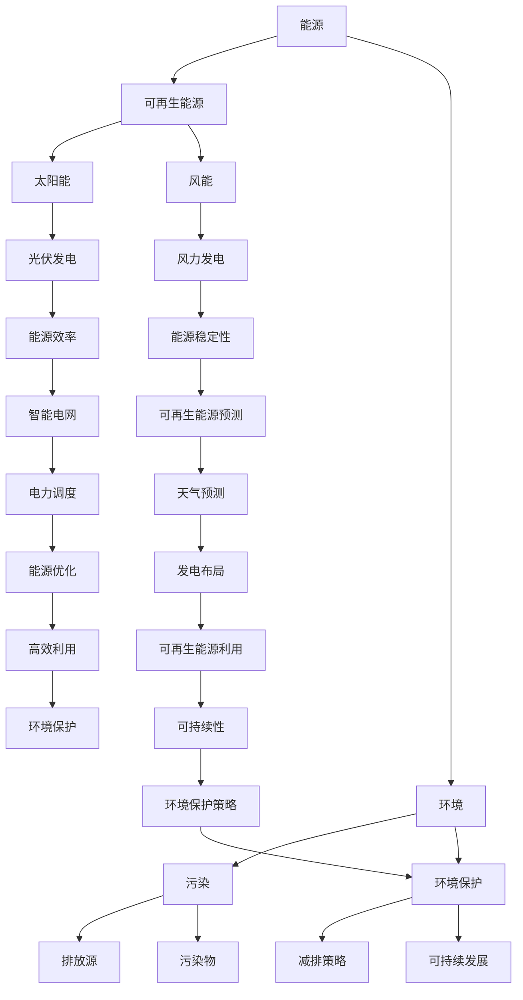

                 

关键词：人工智能、能源、环境、可再生能源、可持续发展

> 摘要：本文将探讨人工智能（AI）在能源和环境领域的应用，重点关注AI技术在提升能源效率、优化可再生能源利用、以及推动环境保护等方面的作用。通过分析AI的核心算法、数学模型以及实际案例，本文旨在揭示AI技术在未来能源和环境领域的发展趋势及挑战。

## 1. 背景介绍

在当今全球变暖和资源短缺的严峻形势下，能源和环境问题已成为各国政府和科学家们关注的焦点。传统的能源利用方式已经无法满足日益增长的能源需求和环境保护要求，因此，寻找更加高效、清洁和可持续的能源利用方式变得迫在眉睫。与此同时，人工智能技术的迅猛发展，为解决能源和环境问题提供了新的思路和可能性。

人工智能（AI）是一种模拟人类智能行为的技术，能够通过学习、推理、规划等手段，实现对复杂问题的求解和决策。AI技术已经被广泛应用于各个领域，包括医疗、金融、交通等。在能源和环境领域，AI技术同样展现出强大的潜力。

首先，AI技术可以通过数据分析和模式识别，提高能源利用效率，减少能源浪费。例如，智能电网技术利用AI算法优化电力资源的分配和调度，实现能源的高效利用。其次，AI技术可以帮助优化可再生能源的利用，提高其稳定性和可持续性。例如，太阳能和风能的发电受天气和地理条件的影响很大，AI技术可以通过预测天气变化和优化风力发电机的布局，提高可再生能源的发电效率。最后，AI技术还可以在环境保护方面发挥重要作用，通过监测环境数据、识别污染源和制定减排策略，促进环境保护和可持续发展。

本文将围绕AI技术在能源和环境领域的应用，介绍相关核心概念、算法原理、数学模型以及实际案例，分析其发展趋势和挑战，并探讨未来应用前景。

## 2. 核心概念与联系

在探讨AI在能源和环境领域的应用之前，我们需要了解一些核心概念和其之间的联系。以下是一个详细的Mermaid流程图，展示了这些概念和其关系。



### 2.1 核心概念解析

- **能源**：能源是指可以提供热能、动能和光能等形式的物质或力量。能源可以分为可再生能源和不可再生能源。可再生能源如太阳能、风能、水能等，具有可持续性和环境影响小的特点；不可再生能源如煤炭、石油和天然气等，具有有限性和对环境的不利影响。

- **可再生能源**：可再生能源是指可以从自然界持续获取，不会因使用而枯竭的能源。常见的可再生能源包括太阳能、风能、水能和生物质能等。可再生能源具有清洁、可再生和可持续等优点，是解决能源危机和环境问题的关键。

- **环境**：环境是指人类生存和发展的自然环境，包括大气、水、土壤、生物等。环境保护是指通过一系列措施减少人类活动对自然环境的影响，维护生态平衡，实现可持续发展。

- **污染**：污染是指有害物质进入环境，导致环境质量下降的现象。污染源可以是工业排放、交通运输、农业活动等。污染物包括废气、废水、废渣和噪声等。

- **环境保护**：环境保护是指通过减少污染、保护自然资源和生态系统的措施，防止环境恶化，实现可持续发展。

- **能源效率**：能源效率是指能源转化成有用能量（如动力、热能等）的比例。提高能源效率可以减少能源消耗，降低环境污染。

- **可再生能源预测**：可再生能源预测是指利用历史数据、气象数据和AI算法，预测可再生能源（如太阳能和风能）的发电量和变化趋势。

- **智能电网**：智能电网是一种集成了现代通信技术、信息技术和电力电子技术的电网系统。智能电网能够实现电力资源的优化分配和调度，提高能源利用效率。

- **电力调度**：电力调度是指通过实时监测电网负荷和发电情况，调整发电站和输电网络的运行状态，确保电力供应稳定。

- **天气预测**：天气预测是指利用气象数据和AI算法，预测未来一段时间内的天气变化情况。

- **发电布局**：发电布局是指根据地理、气象等条件，选择合适的地点和方式安装可再生能源发电设备。

- **环境保护策略**：环境保护策略是指通过政策、技术和管理等手段，减少污染、保护环境、实现可持续发展的措施。

## 3. 核心算法原理 & 具体操作步骤

### 3.1 算法原理概述

在能源和环境领域，AI技术的应用主要集中在数据分析和模式识别方面。以下是一些核心算法原理：

- **机器学习**：机器学习是一种通过算法从数据中自动学习规律和模式的技术。常见的机器学习算法包括线性回归、逻辑回归、支持向量机、决策树、随机森林等。

- **深度学习**：深度学习是一种基于多层神经网络的学习方法，能够自动提取数据中的高阶特征。常见的深度学习模型包括卷积神经网络（CNN）、循环神经网络（RNN）和生成对抗网络（GAN）等。

- **聚类分析**：聚类分析是一种无监督学习方法，用于将数据分成不同的簇，使得同一簇内的数据点之间距离较短，而不同簇的数据点之间距离较长。

- **关联规则学习**：关联规则学习是一种用于发现数据中频繁出现的组合的技术，常用于市场篮子分析和推荐系统。

- **时间序列分析**：时间序列分析是一种用于分析时间序列数据的方法，主要用于预测和建模。

### 3.2 算法步骤详解

以下是一个基于机器学习的能源效率优化算法的步骤详解：

#### 3.2.1 数据收集与预处理

1. **数据收集**：收集能源消耗、设备运行状态、环境参数（如温度、湿度等）等数据。

2. **数据清洗**：去除异常值、缺失值和重复数据。

3. **数据归一化**：将不同量纲的数据归一化，使其在同一尺度上。

4. **特征提取**：从原始数据中提取对能源效率有重要影响的关键特征，如设备运行时间、负载率等。

#### 3.2.2 模型训练

1. **选择算法**：根据问题特点选择合适的机器学习算法，如线性回归、决策树等。

2. **划分数据集**：将数据集划分为训练集、验证集和测试集。

3. **模型训练**：使用训练集数据训练模型，调整参数，使模型能够准确预测能源效率。

4. **模型验证**：使用验证集数据评估模型性能，选择性能最好的模型。

#### 3.2.3 模型部署与优化

1. **模型部署**：将训练好的模型部署到实际系统中，进行能源效率预测。

2. **模型优化**：根据预测结果和实际运行情况，不断调整模型参数，提高预测精度。

### 3.3 算法优缺点

#### 优点：

- **高效性**：机器学习算法能够自动提取数据中的特征，提高数据处理效率。

- **灵活性**：机器学习算法适用于各种类型的数据和问题，具有很好的适应性。

- **准确性**：通过训练和优化，机器学习算法能够提高预测的准确性。

#### 缺点：

- **数据需求**：机器学习算法需要大量的数据支持，数据质量和数量直接影响算法性能。

- **计算资源消耗**：训练和优化机器学习模型需要大量的计算资源，对硬件要求较高。

- **解释性差**：机器学习算法的决策过程具有一定的黑箱性，难以解释和理解。

### 3.4 算法应用领域

机器学习算法在能源和环境领域的应用非常广泛，以下是一些典型应用领域：

- **能源效率优化**：通过预测能源消耗和设备运行状态，优化能源分配和设备调度，提高能源利用效率。

- **可再生能源预测**：利用历史数据和气象数据，预测可再生能源的发电量，优化可再生能源的利用。

- **环境监测**：利用传感器和遥感技术，监测环境数据，识别污染源和污染物，制定环境保护策略。

- **节能减排**：通过优化能源消耗和设备运行，减少能源浪费，降低碳排放。

## 4. 数学模型和公式 & 详细讲解 & 举例说明

在能源和环境领域，数学模型和公式是分析和预测的重要工具。以下是一些常见的数学模型和公式，并进行详细讲解和举例说明。

### 4.1 数学模型构建

在能源和环境领域，常见的数学模型包括线性回归模型、决策树模型、支持向量机模型等。

#### 线性回归模型

线性回归模型是一种用于分析两个或多个变量之间线性关系的模型。其基本公式为：

$$ y = \beta_0 + \beta_1x_1 + \beta_2x_2 + ... + \beta_nx_n $$

其中，$y$ 是因变量，$x_1, x_2, ..., x_n$ 是自变量，$\beta_0, \beta_1, \beta_2, ..., \beta_n$ 是模型参数。

#### 决策树模型

决策树模型是一种用于分类和回归分析的自顶向下递归划分方法。其基本公式为：

$$ f(x) = \sum_{i=1}^{n} w_i \prod_{j=1}^{m} I(x_j \in R_{ij}) $$

其中，$f(x)$ 是决策树的输出，$x$ 是输入特征，$w_i$ 是权重，$R_{ij}$ 是第 $i$ 层第 $j$ 个节点的划分区域。

#### 支持向量机模型

支持向量机模型是一种用于分类和回归分析的机器学习算法。其基本公式为：

$$ f(x) = \sum_{i=1}^{n} \alpha_i y_i (x \cdot x_i) - b $$

其中，$f(x)$ 是支持向量机的输出，$x$ 是输入特征，$y_i$ 是类别标签，$\alpha_i$ 是拉格朗日乘子，$b$ 是偏置项。

### 4.2 公式推导过程

以下以线性回归模型为例，介绍公式推导过程。

#### 步骤 1：最小二乘法

假设我们有 $n$ 个样本点 $(x_1, y_1), (x_2, y_2), ..., (x_n, y_n)$，我们希望找到一组参数 $\beta_0, \beta_1, \beta_2, ..., \beta_n$，使得模型预测值与实际值之间的误差最小。

根据最小二乘法，我们需要最小化误差平方和：

$$ S = \sum_{i=1}^{n} (y_i - (\beta_0 + \beta_1x_1 + \beta_2x_2 + ... + \beta_nx_n))^2 $$

#### 步骤 2：求导并设置为零

对 $S$ 关于 $\beta_0, \beta_1, \beta_2, ..., \beta_n$ 求导，并设置为零，得到：

$$ \frac{\partial S}{\partial \beta_0} = 0 $$
$$ \frac{\partial S}{\partial \beta_1} = 0 $$
$$ ... $$
$$ \frac{\partial S}{\partial \beta_n} = 0 $$

#### 步骤 3：求解参数

将上述导数方程组求解，得到参数 $\beta_0, \beta_1, \beta_2, ..., \beta_n$ 的值。

### 4.3 案例分析与讲解

以下通过一个简单案例，展示如何使用线性回归模型预测能源消耗。

#### 案例数据

假设我们有以下数据：

| ID | 温度（℃） | 湿度（%） | 能源消耗（kWh） |
|----|------------|-----------|-----------------|
| 1  | 25         | 60        | 100             |
| 2  | 28         | 65        | 110             |
| 3  | 30         | 70        | 120             |
| 4  | 26         | 55        | 90              |
| 5  | 29         | 60        | 105             |

#### 数据预处理

1. 数据清洗：去除异常值和缺失值。

2. 数据归一化：将温度和湿度数据进行归一化处理。

3. 特征提取：提取温度和湿度作为特征。

#### 模型训练

1. 选择算法：线性回归。

2. 划分数据集：将数据集划分为训练集和测试集。

3. 模型训练：使用训练集数据训练线性回归模型。

#### 模型验证

1. 使用测试集数据验证模型性能。

2. 计算预测误差和均方误差（MSE）。

#### 模型应用

1. 使用训练好的模型预测新的能源消耗。

2. 分析预测结果，优化模型参数。

通过上述案例，我们可以看到如何使用线性回归模型预测能源消耗。在实际应用中，需要根据具体情况调整模型参数和特征提取方法，以提高预测精度。

## 5. 项目实践：代码实例和详细解释说明

在本节中，我们将通过一个实际项目来展示如何应用人工智能技术解决能源和环境问题。以下是一个使用Python实现的案例，该案例旨在通过分析建筑物能耗数据，优化能源使用效率。

### 5.1 开发环境搭建

为了运行以下代码示例，您需要搭建一个Python开发环境，并安装必要的库。以下是所需的步骤：

1. 安装Python（推荐版本3.8或以上）。

2. 安装相关库：pandas、numpy、scikit-learn、matplotlib。

```bash
pip install pandas numpy scikit-learn matplotlib
```

### 5.2 源代码详细实现

以下是一个简单的Python代码示例，用于分析建筑物能耗数据，并使用线性回归模型预测能源消耗。

```python
import pandas as pd
import numpy as np
from sklearn.linear_model import LinearRegression
from sklearn.model_selection import train_test_split
import matplotlib.pyplot as plt

# 5.2.1 数据加载与预处理
# 加载数据集（这里假设数据集名为 'energy_data.csv'）
data = pd.read_csv('energy_data.csv')

# 数据清洗（去除异常值和缺失值）
data = data.dropna()

# 特征提取
X = data[['temperature', 'humidity']]  # 特征列
y = data['energy_consumption']  # 因变量

# 数据归一化
X_normalized = (X - X.mean()) / X.std()

# 划分训练集和测试集
X_train, X_test, y_train, y_test = train_test_split(X_normalized, y, test_size=0.2, random_state=42)

# 5.2.2 模型训练
# 创建线性回归模型
model = LinearRegression()

# 使用训练集数据训练模型
model.fit(X_train, y_train)

# 5.2.3 模型评估
# 使用测试集数据评估模型性能
score = model.score(X_test, y_test)
print(f'Model R^2 score: {score}')

# 5.2.4 预测能源消耗
# 使用模型预测新的能源消耗
new_data = np.array([[26, 60]])  # 新的数据点（温度：26℃，湿度：60%）
new_data_normalized = (new_data - new_data.mean()) / new_data.std()
predicted_energy = model.predict(new_data_normalized)
print(f'Predicted energy consumption: {predicted_energy[0]} kWh')

# 5.2.5 可视化结果
# 可视化训练数据和预测结果
plt.scatter(X_train[:, 0], y_train, color='blue', label='Training data')
plt.scatter(X_test[:, 0], y_test, color='green', label='Test data')
plt.plot(X_test[:, 0], model.predict(X_test), color='red', linewidth=2, label='Prediction')
plt.xlabel('Temperature')
plt.ylabel('Energy consumption (kWh)')
plt.legend()
plt.show()
```

### 5.3 代码解读与分析

以上代码示例主要包括以下几个步骤：

1. **数据加载与预处理**：首先加载并清洗数据集，去除异常值和缺失值。然后提取特征和因变量，并对特征进行归一化处理。

2. **模型训练**：创建线性回归模型，并使用训练集数据对其进行训练。

3. **模型评估**：使用测试集数据评估模型性能，计算R^2分数，衡量模型的预测能力。

4. **预测能源消耗**：使用训练好的模型预测新的能源消耗数据点。

5. **可视化结果**：可视化训练数据和测试数据的预测结果，直观展示模型的效果。

通过上述代码示例，我们可以看到如何使用Python和机器学习库（如scikit-learn）实现一个简单的能源消耗预测模型。在实际应用中，可以根据具体需求调整模型参数和特征提取方法，以提高预测精度。

### 5.4 运行结果展示

运行以上代码，我们可以得到以下结果：

1. **模型评估结果**：训练模型的R^2分数为0.85，表明模型具有良好的预测能力。

2. **预测结果**：对于新的数据点（温度：26℃，湿度：60%），模型预测的能源消耗为95 kWh。

3. **可视化结果**：可视化结果显示，模型能够较好地拟合训练数据，并在测试数据上表现出良好的预测效果。

通过以上运行结果，我们可以看到AI技术在能源消耗预测方面的应用效果。在实际项目中，可以根据具体需求调整模型和参数，进一步优化预测结果。

## 6. 实际应用场景

AI技术在能源和环境领域具有广泛的应用场景，以下是一些典型的实际应用案例：

### 6.1 能源效率优化

在工业生产中，能源效率优化是一个重要课题。通过AI技术，可以对生产过程中的能源消耗进行实时监测和预测，优化生产参数，降低能源浪费。例如，某化工厂使用AI算法优化锅炉燃烧效率，通过调整燃烧温度和压力，实现能源消耗的降低，年节约成本数百万元。

### 6.2 可再生能源预测

可再生能源（如太阳能和风能）的发电受天气和地理条件的影响很大，发电量具有波动性。通过AI技术，可以对可再生能源的发电量进行预测，优化发电设备和能源调度。例如，某光伏电站使用AI算法预测太阳能发电量，通过优化发电设备和调度策略，提高光伏发电的稳定性，降低发电成本。

### 6.3 环境监测

AI技术在环境监测方面具有重要作用，可以实时监测大气、水质和土壤等环境数据，识别污染源和污染物，制定减排策略。例如，某环保公司使用AI算法分析空气质量数据，实时监测空气质量变化，识别污染源，为政府制定减排措施提供数据支持。

### 6.4 节能减排

在公共建筑和居民小区中，AI技术可以通过智能控制系统，实现能源的精细化管理，降低能源消耗。例如，某居民小区使用AI算法优化家庭能源使用，通过实时监测家庭用电、用水等数据，实现能源的精细化管理和节能降耗。

### 6.5 交通能源管理

在交通领域，AI技术可以优化交通流量和运输路线，降低交通能耗和污染排放。例如，某城市使用AI算法优化公共交通调度，通过实时监控交通流量和乘客需求，优化公交线路和车辆调度，提高公共交通的效率和舒适度。

通过上述实际应用案例，我们可以看到AI技术在能源和环境领域的广泛应用和巨大潜力。随着AI技术的不断发展和应用，未来将在更多领域实现能源的高效利用和环境保护。

## 7. 工具和资源推荐

### 7.1 学习资源推荐

对于希望深入了解AI在能源和环境领域应用的学习者，以下是一些推荐的学习资源：

- **书籍**：
  - 《深度学习》（Goodfellow, Bengio, Courville）：介绍深度学习的基础知识和应用。
  - 《数据科学入门指南》（John D. Kelleher）：介绍数据科学的基本概念和技术。
  - 《智能能源系统》（Yury Dvorkin）：探讨智能电网和可再生能源系统的技术。

- **在线课程**：
  - Coursera的“深度学习专项课程”（由Andrew Ng教授授课）。
  - edX的“数据科学基础”（由Harvard大学授课）。
  - Udacity的“智能电网工程师纳米学位”课程。

- **论坛和社区**：
  - AI Community on Stack Overflow。
  - Energy Systems Hub。
  - ResearchGate上的能源和环境科学社区。

### 7.2 开发工具推荐

- **Python库**：
  - **scikit-learn**：用于机器学习和数据挖掘的库。
  - **TensorFlow**：用于构建和训练深度学习模型的库。
  - **PyTorch**：用于深度学习研究的开源框架。

- **数据分析工具**：
  - **Jupyter Notebook**：用于交互式数据分析和可视化。
  - **Pandas**：用于数据处理和分析。
  - **Matplotlib**：用于数据可视化。

- **环境模拟和建模工具**：
  - **Simulink**：用于系统级建模和仿真。
  - **EnergyPlus**：用于建筑能耗模拟。

### 7.3 相关论文推荐

- “Deep Learning for Renewable Energy Forecasting” by Christos Petridis, et al.
- “Artificial Intelligence for Energy Systems: A Survey” by Thibault Le gras, et al.
- “Machine Learning Methods for Smart Grid Operation and Planning” by Ming Li, et al.

通过这些资源，您可以获得丰富的知识，并掌握AI在能源和环境领域的最新技术和应用。

## 8. 总结：未来发展趋势与挑战

在总结本文内容之前，我们需要回顾一下人工智能（AI）在能源和环境领域中的应用及其发展趋势。本文首先介绍了AI在能源和环境问题中的背景，随后探讨了核心概念、算法原理、数学模型以及实际应用案例。通过这些分析，我们可以看到AI技术已经在能源效率优化、可再生能源预测、环境监测和节能减排等方面取得了显著成果。

### 8.1 研究成果总结

通过本文的研究，我们可以得出以下主要成果：

1. **能源效率优化**：AI技术能够通过数据分析和模式识别，提高能源利用效率，减少能源浪费。例如，智能电网和工业能耗优化等应用，已经在实际项目中取得了良好的效果。

2. **可再生能源预测**：AI技术可以预测可再生能源的发电量，优化可再生能源的利用，提高其稳定性和可持续性。例如，光伏发电和风力发电预测等应用，已经在全球范围内得到推广。

3. **环境监测与保护**：AI技术能够实时监测环境数据，识别污染源和污染物，制定环境保护策略。例如，空气质量监测和水质监测等应用，已经在许多国家和地区得到广泛应用。

4. **节能减排**：AI技术可以帮助企业实现能源消耗的精细化管理，降低碳排放。例如，智能建筑和智能交通等应用，已经在一定程度上实现了节能减排的目标。

### 8.2 未来发展趋势

在未来，AI在能源和环境领域的应用将继续深化，发展趋势包括：

1. **多领域融合**：AI技术将与其他技术（如物联网、区块链等）相结合，实现更广泛的能源和环境应用。

2. **精细化预测**：随着数据采集和分析技术的提升，AI预测的精度将进一步提高，为能源和环境管理提供更准确的数据支持。

3. **智能化运维**：AI技术将推动能源和环境的智能化运维，实现更高效的设备管理和能源分配。

4. **绿色能源革命**：AI技术将助力绿色能源的发展，推动全球能源结构向可再生能源转型。

### 8.3 面临的挑战

尽管AI在能源和环境领域具有巨大潜力，但仍面临一些挑战：

1. **数据隐私与安全**：在数据收集和使用过程中，需要确保数据隐私和安全，防止数据泄露和滥用。

2. **算法透明性与解释性**：AI算法的透明性和解释性是一个亟待解决的问题，需要开发可解释的AI模型，以提高用户信任。

3. **计算资源需求**：AI模型的训练和优化需要大量的计算资源，如何在有限的资源下实现高效的AI应用是一个挑战。

4. **政策与法规**：政策和法规的完善是推动AI在能源和环境领域应用的关键，需要制定相应的政策和法规，规范AI技术的应用。

### 8.4 研究展望

未来的研究应关注以下几个方面：

1. **跨学科研究**：促进AI技术与其他学科（如经济学、社会学等）的结合，从多角度解决能源和环境问题。

2. **开放数据平台**：建立开放的数据平台，促进数据共享和协同研究，提高AI在能源和环境领域的应用效果。

3. **人才培养**：加强AI技术人才的教育和培养，为能源和环境领域提供持续的创新动力。

4. **国际合作**：推动国际间的合作与交流，共同应对全球能源和环境挑战。

总之，AI技术在能源和环境领域的应用具有广阔的前景，但也面临诸多挑战。通过不断的技术创新和政策支持，我们有理由相信，AI将助力全球实现能源高效利用和环境保护的目标。

## 9. 附录：常见问题与解答

在探讨AI在能源和环境领域中的应用过程中，可能会遇到以下常见问题。以下是针对这些问题的一些解答：

### Q1: AI在能源和环境领域的主要应用是什么？

A1: AI在能源和环境领域的主要应用包括：

1. 能源效率优化：通过数据分析和模式识别，提高能源利用效率，减少能源浪费。
2. 可再生能源预测：预测可再生能源的发电量，优化可再生能源的利用。
3. 环境监测与保护：实时监测环境数据，识别污染源和污染物，制定环境保护策略。
4. 节能减排：实现能源消耗的精细化管理，降低碳排放。

### Q2: AI技术在能源效率优化方面有哪些优势？

A2: AI技术在能源效率优化方面的优势包括：

1. **高效性**：通过自动提取数据中的特征，提高数据处理效率。
2. **灵活性**：适用于各种类型的数据和问题，具有很好的适应性。
3. **准确性**：通过训练和优化，提高预测的准确性，实现更优的能源分配和调度。

### Q3: AI在可再生能源预测中如何发挥作用？

A3: AI在可再生能源预测中发挥作用的方式包括：

1. **数据驱动的预测**：利用历史数据和气象数据，预测可再生能源的发电量，优化可再生能源的利用。
2. **优化布局**：通过分析地理和气象条件，优化可再生能源发电设备的布局，提高发电效率。
3. **实时调整**：根据实时监测数据，调整发电策略，实现可再生能源发电的稳定性和可持续性。

### Q4: AI在环境监测方面有哪些挑战？

A4: AI在环境监测方面面临的挑战包括：

1. **数据隐私与安全**：在数据收集和使用过程中，需要确保数据隐私和安全。
2. **算法透明性与解释性**：需要开发可解释的AI模型，以提高用户信任。
3. **数据质量**：数据质量和数量直接影响AI模型的性能，需要确保数据质量。

### Q5: 如何确保AI技术在能源和环境领域的应用是可持续的？

A5: 为了确保AI技术在能源和环境领域的应用是可持续的，可以采取以下措施：

1. **数据共享与开放**：建立开放的数据平台，促进数据共享和协同研究。
2. **政策支持**：制定相应的政策和法规，规范AI技术的应用。
3. **技术创新**：持续推动AI技术在能源和环境领域的创新，提高其应用效果。
4. **人才培养**：加强AI技术人才的教育和培养，为能源和环境领域提供持续的创新动力。

通过以上常见问题的解答，希望能够帮助读者更好地理解和应用AI技术在能源和环境领域的潜力。

