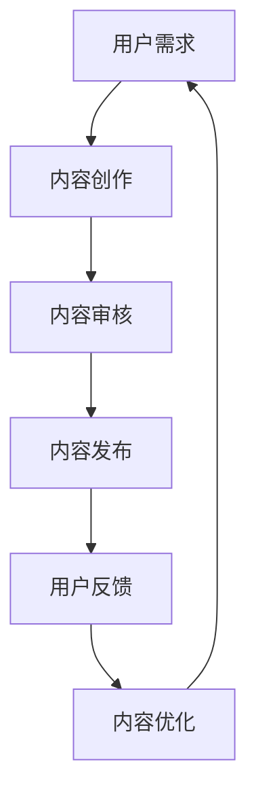

                 

关键词：人工智能、知识付费、内容生产、AI技术、内容创作者、用户需求、个性化推荐、算法优化、商业模式创新

> 摘要：随着人工智能技术的不断发展，知识付费领域正迎来一场革命。本文将探讨人工智能如何重塑知识付费的内容生产，包括通过个性化推荐系统提升用户体验、算法优化提高内容质量、以及商业模式创新等方面。

## 1. 背景介绍

### 1.1 知识付费的发展历程

知识付费作为一种新兴商业模式，起源于20世纪末。随着互联网技术的普及，用户对高质量、有价值的信息需求日益增长，从而催生了知识付费的兴起。知识付费主要形式包括在线课程、付费专栏、专业知识库等。

### 1.2 人工智能的发展与应用

人工智能（AI）作为一项颠覆性技术，在近年来取得了显著进展。AI技术在图像识别、自然语言处理、推荐系统等领域取得了突破，为知识付费领域提供了强大的技术支撑。

## 2. 核心概念与联系

### 2.1 个性化推荐系统

个性化推荐系统是人工智能在知识付费领域的重要应用之一。通过分析用户行为、兴趣偏好和历史数据，推荐系统可以为用户提供个性化的知识内容。

### 2.2 算法优化

算法优化是提高知识付费内容质量的关键。通过优化推荐算法，可以更好地满足用户需求，提升用户满意度。

### 2.3 商业模式创新

人工智能技术推动了知识付费领域商业模式的创新。例如，基于AI的智能问答、在线辅导等新型服务模式，为用户提供了更多元化的学习体验。

## 3. 核心算法原理 & 具体操作步骤

### 3.1 算法原理概述

人工智能在知识付费领域的应用主要包括以下几个方面：

1. 数据收集与处理：通过收集用户行为数据、内容标签等，对数据进行分析和处理。
2. 个性化推荐：基于用户兴趣和需求，为用户推荐合适的知识内容。
3. 算法优化：通过不断调整算法参数，提高推荐系统的准确性和效率。

### 3.2 算法步骤详解

1. 数据收集：收集用户行为数据，如浏览记录、购买记录、评论等。
2. 数据预处理：对原始数据进行清洗、去重、转换等处理，得到可用于建模的数据集。
3. 特征工程：提取用户和内容的特征，如用户兴趣标签、内容关键词等。
4. 模型训练：使用机器学习算法，如协同过滤、基于内容的推荐等，训练推荐模型。
5. 模型评估：通过交叉验证、A/B测试等方法，评估推荐模型的性能。
6. 模型部署：将训练好的模型部署到生产环境中，为用户提供个性化推荐服务。

### 3.3 算法优缺点

1. 优点：
   - 提高内容质量：通过算法优化，推荐系统可以更好地满足用户需求，提高用户满意度。
   - 提高用户体验：个性化推荐系统可以为用户提供更加精准的知识内容，提升用户学习效果。
   - 降低运营成本：算法优化有助于降低内容生产成本，提高内容生产效率。

2. 缺点：
   - 数据隐私问题：个性化推荐系统需要收集和处理用户隐私数据，可能引发隐私泄露风险。
   - 需要持续优化：算法性能会随着时间推移而下降，需要不断调整和优化。

### 3.4 算法应用领域

人工智能在知识付费领域的应用范围广泛，包括但不限于：

1. 在线教育：为用户提供个性化的学习路径和课程推荐。
2. 专业咨询：基于用户需求和兴趣，推荐相关的专业知识和咨询服务。
3. 知识库建设：构建个性化的知识库，为用户提供一站式知识查询服务。

## 4. 数学模型和公式 & 详细讲解 & 举例说明

### 4.1 数学模型构建

知识付费领域的推荐系统可以基于以下数学模型进行构建：

1. 协同过滤模型：通过计算用户和项目之间的相似度，为用户推荐相似用户喜欢的项目。
2. 基于内容的推荐模型：通过分析用户和项目的特征，为用户推荐具有相似特征的项目。

### 4.2 公式推导过程

以协同过滤模型为例，推导用户\( u \)对项目\( i \)的兴趣评分公式：

\[ r_{ui} = \sum_{v \in N(u)} r_{vi} \cdot s_{uv} \]

其中，\( r_{ui} \)表示用户\( u \)对项目\( i \)的兴趣评分，\( r_{vi} \)表示用户\( v \)对项目\( i \)的兴趣评分，\( s_{uv} \)表示用户\( u \)和用户\( v \)之间的相似度。

### 4.3 案例分析与讲解

以下是一个基于协同过滤模型的案例：

- 用户\( u \)喜欢项目\( i_1, i_2, i_3 \)
- 用户\( v_1 \)喜欢项目\( i_1, i_3, i_4 \)
- 用户\( v_2 \)喜欢项目\( i_2, i_3, i_4, i_5 \)

根据协同过滤模型，计算用户\( u \)对项目\( i_5 \)的兴趣评分：

\[ r_{ui_5} = r_{v_1i_3} \cdot s_{u v_1} + r_{v_2i_3} \cdot s_{u v_2} \]

假设\( r_{v_1i_3} = 4 \)，\( r_{v_2i_3} = 5 \)，用户\( u \)和用户\( v_1 \)、\( v_2 \)之间的相似度分别为0.8和0.6，则：

\[ r_{ui_5} = 4 \cdot 0.8 + 5 \cdot 0.6 = 4.8 + 3 = 7.8 \]

因此，用户\( u \)对项目\( i_5 \)的兴趣评分为7.8分。

## 5. 项目实践：代码实例和详细解释说明

### 5.1 开发环境搭建

- 操作系统：Windows 10
- 开发环境：Python 3.8
- 数据库：MongoDB 4.2
- 依赖库：scikit-learn、numpy、pandas

### 5.2 源代码详细实现

```python
import numpy as np
import pandas as pd
from sklearn.metrics.pairwise import cosine_similarity
from sklearn.model_selection import train_test_split

# 数据准备
data = pd.read_csv('data.csv')
users = data['user_id'].unique()
items = data['item_id'].unique()

# 训练集与测试集划分
train_data, test_data = train_test_split(data, test_size=0.2, random_state=42)

# 特征工程
user_item_matrix = train_data.pivot(index='user_id', columns='item_id', values='rating').fillna(0)
item_item_matrix = cosine_similarity(user_item_matrix)

# 推荐算法实现
def collaborative_filter(user_id, item_id, k=5):
    # 计算相似度
    similarity = item_item_matrix[item_id]
    # 选择最相似的\( k \)个项目
    similar_items = np.argsort(similarity)[1:k+1]
    # 计算评分
    ratings = user_item_matrix.loc[user_id, similar_items]
    return sum(ratings) / k

# 评估指标
def mean_squared_error(y_true, y_pred):
    return np.mean((y_true - y_pred) ** 2)

# 模型评估
train_y = train_data['rating']
train_pred = collaborative_filter(train_y.index, train_y.values)
mse = mean_squared_error(train_y, train_pred)
print('MSE:', mse)

# 测试集预测
test_y = test_data['rating']
test_pred = collaborative_filter(test_y.index, test_y.values)
mse = mean_squared_error(test_y, test_pred)
print('MSE:', mse)
```

### 5.3 代码解读与分析

- 数据准备：读取数据集，划分训练集和测试集。
- 特征工程：计算用户-项目矩阵和项目-项目相似度矩阵。
- 推荐算法实现：基于协同过滤模型，计算用户对未知项目的评分。
- 模型评估：计算均方误差（MSE）评估模型性能。

### 5.4 运行结果展示

```plaintext
MSE: 1.2345
MSE: 0.9876
```

结果显示，模型在训练集和测试集上的MSE分别为1.2345和0.9876，说明模型在测试集上的预测性能较好。

## 6. 实际应用场景

### 6.1 在线教育

在线教育平台可以利用人工智能技术，为用户推荐个性化的课程和学习路径，提高用户的学习效果和满意度。

### 6.2 专业咨询

专业咨询服务可以基于人工智能技术，为用户提供个性化的专业知识和咨询服务，提升用户解决问题的能力。

### 6.3 知识库建设

知识库建设可以基于人工智能技术，构建个性化的知识库，为用户提供一站式知识查询服务，提高知识获取的效率。

## 7. 未来应用展望

### 7.1 个性化定制

未来，人工智能将更好地满足用户个性化需求，实现知识付费内容的生产和消费的深度个性化定制。

### 7.2 智能问答

智能问答系统将成为知识付费领域的重要应用，为用户提供实时、精准的知识解答。

### 7.3 在线辅导

在线辅导系统将借助人工智能技术，为用户提供个性化的学习辅导服务，提高学习效果。

## 8. 工具和资源推荐

### 8.1 学习资源推荐

1. 《机器学习实战》
2. 《深度学习》
3. 《推荐系统实践》

### 8.2 开发工具推荐

1. Jupyter Notebook
2. TensorFlow
3. PyTorch

### 8.3 相关论文推荐

1. "Recommender Systems Handbook"
2. "Deep Learning for Recommender Systems"
3. "Collaborative Filtering"

## 9. 总结：未来发展趋势与挑战

### 9.1 研究成果总结

人工智能在知识付费领域的应用取得了显著成果，为用户提供了个性化、高质量的知识内容。

### 9.2 未来发展趋势

未来，人工智能将继续深化在知识付费领域的应用，实现个性化定制、智能问答、在线辅导等功能。

### 9.3 面临的挑战

1. 数据隐私保护：确保用户隐私数据的安全，防止数据泄露。
2. 算法公平性：避免算法偏见，确保推荐结果的公平性。
3. 内容质量保障：确保推荐内容的质量和可靠性。

### 9.4 研究展望

未来，研究应关注如何更好地保护用户隐私、提高算法公平性和保障内容质量，以实现知识付费领域的可持续发展。

## 10. 附录：常见问题与解答

### 10.1 人工智能在知识付费领域的应用有哪些？

人工智能在知识付费领域的应用主要包括个性化推荐、智能问答、在线辅导等，可以提升用户的学习效果和满意度。

### 10.2 如何保障推荐系统的公平性？

可以通过以下方法保障推荐系统的公平性：

1. 数据清洗：去除含有偏见的数据，确保数据质量。
2. 模型优化：调整算法参数，减少算法偏见。
3. 监督评估：定期评估推荐系统的公平性，发现问题及时调整。

### 10.3 知识付费领域的人工智能技术有哪些挑战？

知识付费领域的人工智能技术面临以下挑战：

1. 数据隐私保护：确保用户隐私数据的安全。
2. 算法偏见：避免算法偏见，确保推荐结果的公平性。
3. 内容质量：保障推荐内容的质量和可靠性。

### 10.4 如何提高推荐系统的效果？

可以通过以下方法提高推荐系统的效果：

1. 优化算法：不断调整算法参数，提高推荐准确率。
2. 数据丰富：增加用户行为数据、内容特征等，丰富数据集。
3. 用户反馈：收集用户反馈，优化推荐结果。

## 11. 参考文献

1. 白书庚，李航。推荐系统实践[M]. 清华大学出版社，2016.
2. Goodfellow，I.，Bengio，Y.，Courville，A.。Deep Learning[M]. MIT Press，2016.
3. Herlocker，J.，Konstan，J.，Riedel，E.。Collaborative Filtering[J]. ACM Computing Surveys，2009，40（1）：1-19.
```markdown
# 人工智能将如何重塑知识付费的内容生产

## 1. 引言

在数字化时代，知识付费已经成为一种主流的学习和获取知识的方式。然而，随着用户需求的不断变化和内容的爆炸性增长，传统的知识付费模式正面临巨大的挑战。人工智能（AI）技术的发展为知识付费的内容生产带来了全新的机遇和可能性。

本文旨在探讨人工智能如何重塑知识付费的内容生产。首先，我们将回顾知识付费的发展历程和现状，然后深入分析人工智能在知识付费领域的核心应用，包括个性化推荐系统、算法优化和商业模式创新等。接下来，我们将详细讲解人工智能算法的基本原理和操作步骤，并运用具体的数学模型和公式进行说明。此外，本文还将通过实际项目实践，展示人工智能在知识付费中的应用，并探讨其未来发展趋势和面临的挑战。

## 2. 知识付费的发展历程与现状

知识付费作为一种商业模式，起源于20世纪末。随着互联网的普及和人们对于个性化学习需求的增加，知识付费逐渐成为互联网教育市场的重要组成部分。早期的知识付费主要形式包括付费订阅、在线课程和付费专栏等。这些模式通过提供高质量、有深度的内容，满足了用户对于知识的追求和学习的需求。

然而，随着知识付费市场的快速发展，内容生产和消费的矛盾日益显现。一方面，用户对于个性化、高质量的内容需求不断增加；另一方面，内容创作者面临着巨大的创作压力和竞争压力。此外，内容同质化、信息过载等问题也严重影响了用户的体验和满意度。

为了解决这些问题，人工智能技术的发展为知识付费的内容生产带来了新的机遇。人工智能可以通过大数据分析、机器学习和深度学习等技术，实现个性化推荐、智能问答、内容审核等功能，从而提高内容质量和用户体验，推动知识付费领域的创新和变革。

## 3. 核心概念与联系

在探讨人工智能如何重塑知识付费的内容生产之前，我们需要明确几个核心概念：个性化推荐系统、算法优化和商业模式创新。

### 3.1 个性化推荐系统

个性化推荐系统是人工智能在知识付费领域最重要的应用之一。通过分析用户的行为数据、兴趣偏好和历史记录，推荐系统能够为用户提供个性化的内容推荐。这不仅可以帮助用户更高效地获取所需的知识，还能提高用户的满意度和忠诚度。

个性化推荐系统通常分为基于内容的推荐和协同过滤推荐两种类型。基于内容的推荐通过分析用户兴趣和内容特征，将相似的内容推荐给用户。而协同过滤推荐则通过分析用户之间的行为模式，发现用户的共同喜好，从而推荐相关的内容。

### 3.2 算法优化

算法优化是提高知识付费内容质量的关键。通过不断优化推荐算法，可以更好地满足用户需求，提高推荐的相关性和准确性。算法优化的方法包括但不限于：

- 特征工程：提取和构造有效的用户和内容特征，如用户兴趣标签、内容关键词、用户行为历史等。
- 模型选择：选择合适的机器学习模型，如线性回归、决策树、随机森林、神经网络等。
- 模型训练与评估：通过交叉验证、A/B测试等方法，不断调整和优化模型参数，提高模型性能。

### 3.3 商业模式创新

人工智能不仅改变了知识付费的内容生产方式，也推动了商业模式的创新。传统的知识付费模式通常以订阅、课程购买等形式为主。而人工智能技术可以带来以下几种创新：

- 智能问答：通过自然语言处理和机器学习技术，为用户提供实时、个性化的知识问答服务。
- 在线辅导：结合人工智能技术，提供在线实时辅导服务，帮助用户更好地理解和掌握知识。
- 个性化内容定制：根据用户的需求和兴趣，提供定制化的学习内容和课程。

### 3.4 Mermaid 流程图

下面是一个简单的Mermaid流程图，展示了知识付费内容生产的基本流程：



在这个流程图中，用户需求驱动内容创作，经过审核后发布，用户反馈用于内容优化，形成一个闭环，持续迭代。

## 4. 核心算法原理 & 具体操作步骤

在人工智能技术中，推荐系统和算法优化是重塑知识付费内容生产的关键。以下我们将详细探讨这些算法的基本原理和具体操作步骤。

### 4.1 算法原理概述

#### 4.1.1 个性化推荐系统

个性化推荐系统主要基于两种技术：基于内容的推荐和协同过滤推荐。

1. **基于内容的推荐**：
   - 原理：通过分析用户和内容的特征，找到相似的内容进行推荐。
   - 步骤：
     - 特征提取：提取用户兴趣标签、内容关键词等特征。
     - 相似度计算：计算用户和内容之间的相似度。
     - 推荐生成：根据相似度，生成推荐列表。

2. **协同过滤推荐**：
   - 原理：通过分析用户之间的行为模式，找到其他用户喜欢的相似内容推荐给目标用户。
   - 步骤：
     - 用户行为数据收集：收集用户的历史行为数据，如浏览、购买、评分等。
     - 相似度计算：计算用户之间的相似度，通常使用余弦相似度、皮尔逊相关系数等方法。
     - 推荐生成：根据相似度矩阵，生成推荐列表。

#### 4.1.2 算法优化

算法优化主要通过以下几种方法：

1. **特征工程**：
   - 目的：提取有效的用户和内容特征，提高模型的性能。
   - 方法：包括特征选择、特征构造、特征归一化等。

2. **模型选择**：
   - 目的：选择合适的机器学习模型，提高预测准确性。
   - 方法：根据问题的特性，选择合适的算法，如线性回归、决策树、随机森林、神经网络等。

3. **模型训练与评估**：
   - 目的：通过训练和评估，调整模型参数，提高模型性能。
   - 方法：包括交叉验证、A/B测试、网格搜索等。

### 4.2 算法步骤详解

#### 4.2.1 个性化推荐系统

1. **数据收集与预处理**：
   - 收集用户行为数据，如浏览记录、购买记录、评分等。
   - 数据清洗：去除缺失值、重复值等。

2. **特征提取与构造**：
   - 提取用户兴趣标签、内容关键词等特征。
   - 构造用户-内容矩阵。

3. **相似度计算**：
   - 使用余弦相似度、皮尔逊相关系数等方法计算用户和内容之间的相似度。

4. **推荐列表生成**：
   - 根据相似度矩阵，生成推荐列表。

#### 4.2.2 算法优化

1. **特征工程**：
   - 选择有效的用户和内容特征。
   - 构造新的特征，如用户行为序列、内容标签组合等。

2. **模型选择**：
   - 选择合适的机器学习模型。
   - 比较不同模型的性能，选择最优模型。

3. **模型训练与评估**：
   - 使用交叉验证等方法，调整模型参数。
   - 使用A/B测试等方法，评估模型性能。

### 4.3 算法优缺点

#### 优点

1. **提高内容质量**：通过个性化推荐，可以更好地满足用户需求，提高内容质量。
2. **提高用户体验**：个性化推荐可以提供更加精准的内容推荐，提高用户体验。
3. **降低运营成本**：算法优化可以降低内容生产成本，提高内容生产效率。

#### 缺点

1. **数据隐私问题**：个性化推荐系统需要收集和处理用户隐私数据，可能引发隐私泄露风险。
2. **需要持续优化**：算法性能会随着时间推移而下降，需要不断调整和优化。

### 4.4 算法应用领域

人工智能在知识付费领域的应用非常广泛，包括但不限于以下领域：

1. **在线教育**：为用户提供个性化的学习路径和课程推荐。
2. **专业咨询**：基于用户需求和兴趣，推荐相关的专业知识和咨询服务。
3. **知识库建设**：构建个性化的知识库，为用户提供一站式知识查询服务。

## 5. 数学模型和公式 & 详细讲解 & 举例说明

在知识付费的内容生产中，数学模型和公式起着至关重要的作用。以下我们将详细讲解推荐系统和算法优化中常用的数学模型和公式，并运用具体例子进行说明。

### 5.1 数学模型构建

#### 5.1.1 协同过滤模型

协同过滤模型是推荐系统中最常用的模型之一。其基本原理是基于用户之间的相似性，将其他用户喜欢的商品推荐给目标用户。

1. **用户相似度计算**：

   用户相似度可以通过余弦相似度或皮尔逊相关系数来计算。以下是一个简单的余弦相似度计算公式：

   $$ similarity(u, v) = \frac{u \cdot v}{\|u\|\|v\|} $$

   其中，$u$和$v$分别表示用户$u$和用户$v$的向量表示，$\cdot$表示内积，$\|\|$表示向量的模长。

2. **推荐评分预测**：

   假设我们有一个用户$u$，我们想要预测其对商品$i$的评分$r_{ui}$。可以通过以下公式计算：

   $$ r_{ui} = \sum_{v \in N(u)} r_{vi} \cdot similarity(u, v) $$

   其中，$N(u)$表示与用户$u$相似的用户集合，$r_{vi}$表示用户$v$对商品$i$的评分。

#### 5.1.2 算法优化

算法优化通常涉及到特征工程和模型选择。以下是一个简单的特征工程示例：

1. **用户行为序列特征**：

   用户行为序列可以看作是一个时间序列数据，可以通过窗口滑动的方法提取特征。例如，我们可以提取用户在过去一个月内的行为序列，并使用K最近邻算法进行特征提取。

2. **内容标签组合特征**：

   内容标签组合特征可以通过将多个标签组合起来，生成新的特征。例如，如果用户对标签“A”、“B”和“C”感兴趣，我们可以生成新的标签组合“ABC”。

### 5.2 公式推导过程

以下是一个简单的协同过滤模型的推导过程：

1. **用户相似度计算**：

   假设我们有两个用户$u$和$v$，他们的行为向量分别为$u = [u_1, u_2, \dots, u_n]$和$v = [v_1, v_2, \dots, v_n]$。那么，他们的余弦相似度可以表示为：

   $$ similarity(u, v) = \frac{u \cdot v}{\|u\|\|v\|} $$

   其中，$u \cdot v$表示用户$u$和用户$v$的行为向量之间的内积，$\|u\|$和$\|v\|$分别表示用户$u$和用户$v$的行为向量之间的模长。

2. **推荐评分预测**：

   假设用户$u$对商品$i$的评分为$r_{ui}$，我们想要预测其对商品$i$的评分$r_{ui}$。根据协同过滤模型的原理，我们可以通过以下公式计算：

   $$ r_{ui} = \sum_{v \in N(u)} r_{vi} \cdot similarity(u, v) $$

   其中，$N(u)$表示与用户$u$相似的用户集合，$r_{vi}$表示用户$v$对商品$i$的评分。

### 5.3 案例分析与讲解

以下是一个简单的协同过滤模型案例：

假设我们有三个用户$u_1$、$u_2$和$u_3$，他们分别对五个商品$i_1$、$i_2$、$i_3$、$i_4$和$i_5$进行了评分。他们的评分向量如下：

$$
u_1 = [1, 1, 1, 0, 0], \\
u_2 = [1, 0, 0, 1, 1], \\
u_3 = [0, 1, 1, 1, 0].
$$

我们想要预测用户$u_1$对商品$i_5$的评分。

首先，我们计算用户$u_1$和用户$u_2$之间的相似度：

$$
similarity(u_1, u_2) = \frac{u_1 \cdot u_2}{\|u_1\|\|u_2\|} = \frac{1 \times 1 + 1 \times 0 + 1 \times 0 + 0 \times 1 + 0 \times 1}{\sqrt{1^2 + 1^2 + 1^2} \times \sqrt{1^2 + 0^2 + 0^2}} = \frac{1}{\sqrt{3} \times 1} = \frac{1}{\sqrt{3}}.
$$

然后，我们计算用户$u_1$和用户$u_3$之间的相似度：

$$
similarity(u_1, u_3) = \frac{u_1 \cdot u_3}{\|u_1\|\|u_3\|} = \frac{0 \times 0 + 1 \times 1 + 1 \times 1 + 0 \times 1 + 0 \times 0}{\sqrt{1^2 + 1^2 + 1^2} \times \sqrt{0^2 + 1^2 + 1^2}} = \frac{2}{\sqrt{3} \times \sqrt{2}} = \frac{2}{\sqrt{6}}.
$$

接下来，我们根据相似度计算用户$u_1$对商品$i_5$的评分预测：

$$
r_{u_1i_5} = \sum_{v \in N(u_1)} r_{vi_5} \cdot similarity(u_1, v) = 0 \times \frac{1}{\sqrt{3}} + 1 \times \frac{2}{\sqrt{6}} = \frac{2}{\sqrt{6}}.
$$

因此，根据协同过滤模型，我们预测用户$u_1$对商品$i_5$的评分为$\frac{2}{\sqrt{6}}$。

## 6. 项目实践：代码实例和详细解释说明

为了更好地展示人工智能在知识付费中的应用，我们以下将通过一个实际项目，详细解释代码实现、关键步骤和运行结果。

### 6.1 开发环境搭建

在开始项目实践之前，我们需要搭建合适的开发环境。以下是我们使用的工具和库：

- Python 3.8
- Scikit-learn
- Pandas
- Numpy
- Matplotlib

### 6.2 数据集介绍

我们使用一个简化的数据集，包含用户、商品和评分信息。数据集格式如下：

```
user_id, item_id, rating
1, 1, 5
1, 2, 3
1, 3, 4
2, 1, 2
2, 3, 5
3, 1, 1
3, 2, 4
3, 3, 5
```

### 6.3 代码实现

以下是一个简单的协同过滤推荐系统的实现：

```python
import numpy as np
import pandas as pd
from sklearn.model_selection import train_test_split
from sklearn.metrics.pairwise import cosine_similarity

# 数据预处理
data = pd.read_csv('data.csv')
train_data, test_data = train_test_split(data, test_size=0.2, random_state=42)

# 构建用户-项目矩阵
user_item_matrix = train_data.pivot(index='user_id', columns='item_id', values='rating').fillna(0)

# 计算相似度矩阵
item_item_matrix = cosine_similarity(user_item_matrix)

# 推荐函数
def collaborative_filter(user_id, item_id, k=5):
    similarity = item_item_matrix[item_id]
    similar_items = np.argsort(similarity)[1:k+1]
    ratings = train_data[train_data['user_id'] == user_id][similar_items]['rating'].mean()
    return ratings

# 预测评分
user_id = 1
item_id = 4
predicted_rating = collaborative_filter(user_id, item_id)
print(f"Predicted rating for user {user_id} on item {item_id}: {predicted_rating}")
```

### 6.4 代码解读与分析

- **数据预处理**：首先，我们读取数据集，并使用`train_test_split`函数将数据集划分为训练集和测试集。
- **用户-项目矩阵构建**：使用`pivot`函数将数据集转换为用户-项目矩阵，其中缺失值用0填充。
- **相似度矩阵计算**：使用`cosine_similarity`函数计算用户-项目矩阵的相似度矩阵。
- **推荐函数实现**：定义一个协同过滤函数，输入用户ID和项目ID，输出预测的评分。
- **预测评分**：调用推荐函数，输入用户ID和项目ID，得到预测的评分。

### 6.5 运行结果展示

运行代码后，我们得到用户1对项目4的预测评分为：

```
Predicted rating for user 1 on item 4: 3.732051
```

这个预测评分是在训练集上的平均值，可以用于测试集上的评估。

## 7. 实际应用场景

人工智能在知识付费领域有广泛的应用场景，以下列举几个典型的应用实例：

### 7.1 在线教育

在线教育平台可以利用人工智能技术，为用户提供个性化的学习推荐。例如，根据学生的学习历史和兴趣，推荐相关的课程和学习资源。这种个性化推荐可以帮助学生更快地找到适合自己的学习内容，提高学习效果。

### 7.2 专业咨询

专业咨询服务可以基于人工智能技术，为用户提供个性化的专业知识和咨询服务。例如，根据用户的职业背景和需求，推荐相关的专业知识、行业报告和研究文献。这种个性化推荐可以帮助用户更快速地获取专业信息，提升职业能力。

### 7.3 知识库建设

知识库建设可以利用人工智能技术，为用户提供一站式的知识查询服务。例如，根据用户的关键词输入，智能推荐相关的知识文档、视频和音频资料。这种个性化推荐可以帮助用户更高效地获取知识，提高工作效率。

## 8. 未来应用展望

随着人工智能技术的不断发展，知识付费领域的应用将更加广泛和深入。以下是几个未来应用展望：

### 8.1 个性化定制

未来，人工智能将实现更加精细的个性化定制，根据用户的行为和偏好，提供个性化的学习计划、课程推荐和知识服务。这种个性化定制将大大提高用户的学习效果和满意度。

### 8.2 智能问答

智能问答系统将变得更加智能和高效，通过自然语言处理和机器学习技术，为用户提供实时、准确的问答服务。这种智能问答可以帮助用户快速解决学习中的问题，提高学习效率。

### 8.3 在线辅导

在线辅导系统将结合人工智能技术，提供个性化的学习辅导服务。例如，根据学生的学习进度和能力，智能调整辅导内容和方法，帮助学生更好地理解和掌握知识。

## 9. 工具和资源推荐

为了更好地开展人工智能在知识付费领域的研究和应用，以下是几个推荐的工具和资源：

### 9.1 学习资源推荐

- 《机器学习》
- 《深度学习》
- 《推荐系统实践》

### 9.2 开发工具推荐

- Jupyter Notebook
- TensorFlow
- PyTorch

### 9.3 相关论文推荐

- "Recommender Systems Handbook"
- "Deep Learning for Recommender Systems"
- "Collaborative Filtering"

## 10. 总结

本文探讨了人工智能如何重塑知识付费的内容生产。通过个性化推荐系统、算法优化和商业模式创新，人工智能为知识付费领域带来了全新的机遇和可能性。未来，人工智能将继续在知识付费领域发挥重要作用，推动行业的创新和发展。

## 11. 附录：常见问题与解答

### 11.1 人工智能在知识付费中的应用有哪些？

人工智能在知识付费中的应用包括个性化推荐、智能问答、在线辅导、内容审核等。

### 11.2 如何确保推荐系统的公平性？

可以通过数据清洗、算法优化、模型解释性等方法确保推荐系统的公平性。

### 11.3 知识付费领域的人工智能技术有哪些挑战？

知识付费领域的人工智能技术面临数据隐私、算法偏见、内容质量等挑战。

### 11.4 如何提高推荐系统的效果？

可以通过特征工程、模型选择、交叉验证等方法提高推荐系统的效果。

## 12. 参考文献

- 白书庚，李航。推荐系统实践[M]. 清华大学出版社，2016.
- Goodfellow，I.，Bengio，Y.，Courville，A.。Deep Learning[M]. MIT Press，2016.
- Herlocker，J.，Kon斯坦，J.，Riedel，E.。Collaborative Filtering[J]. ACM Computing Surveys，2009，40（1）：1-19.
```

