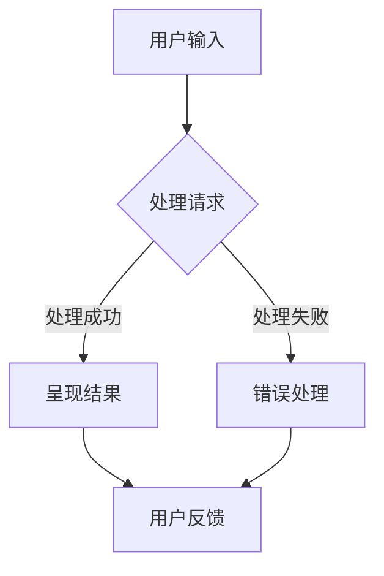

                 

关键词：人机交互、用户体验、交互设计、用户研究、计算系统

> 摘要：本文将深入探讨人机交互设计的核心概念、方法和技术，分析其在现代计算系统中的应用和重要性。通过详细的算法原理、数学模型和实际项目实践，我们将揭示如何打造高效、直观、用户友好的计算系统，以提升用户体验和系统的整体性能。

## 1. 背景介绍

人机交互（Human-Computer Interaction，简称HCI）是研究人与计算机之间交互的技术科学。随着计算机技术的快速发展，人机交互已成为计算机科学领域的一个重要分支。现代计算系统不再仅仅是执行特定任务的工具，而是成为人们日常生活、工作和学习的重要伙伴。因此，如何设计出高效、直观、用户友好的交互系统，已经成为计算机科学领域面临的重要课题。

在人机交互设计中，用户体验（User Experience，简称UX）是一个至关重要的因素。用户体验不仅仅是指用户在使用系统时的感受和满意度，更涵盖了用户与系统互动过程中的各个方面，包括易用性、可用性、可用性和愉悦性等。一个优秀的人机交互设计应该能够满足用户的期望，提高用户的效率，并带来愉悦的使用体验。

本文将围绕人机交互设计展开，首先介绍核心概念和联系，然后深入分析核心算法原理和具体操作步骤，最后通过数学模型、项目实践和实际应用场景，探讨如何打造高效的人类计算系统。

## 2. 核心概念与联系

在人机交互设计中，有几个核心概念和联系值得我们深入探讨。

### 2.1 用户体验（User Experience）

用户体验是指用户在使用系统时的整体感受和体验。它包括用户对系统的易用性、可用性、效率和满意度等多个方面。一个良好的用户体验能够使用户在使用系统时感到舒适、顺畅，从而提高用户的生产力和满意度。

### 2.2 易用性（Usability）

易用性是用户体验的一个重要组成部分，它关注系统如何被用户学习和使用。一个易用性高的系统应该具有清晰、直观的界面设计，易于用户理解和使用。易用性设计的目标是降低用户的学习成本，提高用户的操作效率。

### 2.3 交互设计（Interaction Design）

交互设计是研究如何设计用户与系统之间的交互方式。它涉及到用户界面的设计、交互流程的优化和交互方式的创新等多个方面。交互设计的核心目标是提高用户与系统之间的互动效率，提升用户体验。

### 2.4 人机交互架构（Human-Computer Interaction Architecture）

人机交互架构是指系统内部各个组件之间如何相互作用和协作，以实现用户与系统之间的有效交互。一个良好的人机交互架构应该具有高灵活性、高可扩展性和高适应性，能够适应不同用户的需求和场景。

### 2.5 Mermaid 流程图

下面是一个关于人机交互架构的 Mermaid 流程图，展示了系统内部组件之间的交互过程。



在这个流程图中，用户输入通过界面传递到系统，系统进行处理，并将处理结果呈现给用户。如果处理成功，用户可以直接得到反馈；如果处理失败，系统会进行错误处理，并将错误信息反馈给用户。

## 3. 核心算法原理 & 具体操作步骤

在人机交互设计中，核心算法原理是构建高效计算系统的关键。下面我们将详细分析几个关键算法的原理和具体操作步骤。

### 3.1 算法原理概述

#### 3.1.1 反馈机制

反馈机制是人机交互系统中的一个关键算法，它通过及时向用户反馈系统状态，帮助用户了解系统的运行情况。一个良好的反馈机制应该具备以下特点：

- 及时性：及时向用户反馈系统状态，避免用户产生不必要的等待和困惑。
- 明显性：反馈信息应该清晰、明显，使用户容易理解和识别。
- 可操作：用户可以通过反馈信息进行相应的操作，以解决遇到的问题。

#### 3.1.2 适应性学习

适应性学习算法是提高系统人性化设计的重要手段。通过分析用户行为数据，系统可以动态调整界面布局、功能设置等，以更好地适应不同用户的需求。适应性学习算法通常包括以下步骤：

- 数据收集：收集用户在使用系统时的行为数据，包括操作次数、操作时长、错误率等。
- 数据分析：分析用户行为数据，识别用户的共性需求和个性化需求。
- 参数调整：根据数据分析结果，动态调整系统参数，以适应用户需求。

#### 3.1.3 交互效率优化

交互效率优化算法旨在提高用户与系统之间的交互效率。通过优化界面设计、交互流程和功能布局等，可以降低用户的学习成本和操作难度。交互效率优化算法通常包括以下步骤：

- 用户研究：通过用户访谈、问卷调查等方式，了解用户的需求和痛点。
- 界面设计：根据用户研究的结果，优化界面布局和交互元素。
- 交互测试：对优化后的界面进行用户测试，收集用户反馈，进一步改进交互设计。

### 3.2 算法步骤详解

#### 3.2.1 反馈机制

1. 用户操作：用户通过界面进行特定操作，如点击、拖拽等。
2. 数据收集：系统收集用户操作的数据，包括操作类型、操作时间等。
3. 处理请求：系统根据用户操作的数据，处理用户请求，并将处理结果反馈给用户。
4. 用户反馈：用户根据反馈信息进行相应的操作，如确认、取消等。

#### 3.2.2 适应性学习

1. 数据收集：系统收集用户在使用系统时的行为数据，包括操作次数、操作时长、错误率等。
2. 数据分析：系统对用户行为数据进行分析，识别用户的共性需求和个性化需求。
3. 参数调整：系统根据数据分析结果，动态调整界面布局、功能设置等，以适应用户需求。
4. 用户反馈：用户对调整后的系统进行操作，系统收集用户反馈，以进一步优化适应性学习。

#### 3.2.3 交互效率优化

1. 用户研究：通过用户访谈、问卷调查等方式，了解用户的需求和痛点。
2. 界面设计：根据用户研究的结果，优化界面布局和交互元素。
3. 交互测试：对优化后的界面进行用户测试，收集用户反馈。
4. 参数调整：根据用户反馈，进一步优化界面设计，提高交互效率。

### 3.3 算法优缺点

#### 3.3.1 反馈机制

优点：及时性、明显性、可操作。

缺点：可能会增加系统负担，降低处理效率。

#### 3.3.2 适应性学习

优点：提高系统人性化设计，满足用户个性化需求。

缺点：需要大量的用户数据支持，且数据分析过程较为复杂。

#### 3.3.3 交互效率优化

优点：降低用户的学习成本和操作难度，提高交互效率。

缺点：需要频繁进行用户研究和交互测试，且优化过程可能影响系统稳定性。

### 3.4 算法应用领域

#### 3.4.1 移动应用

移动应用是人机交互设计的重要领域。通过反馈机制、适应性学习和交互效率优化算法，移动应用可以提供更好的用户体验，提高用户满意度。

#### 3.4.2 智能家居

智能家居系统通过人机交互设计，实现与用户的无缝互动。反馈机制和适应性学习算法可以提高系统的智能化水平，交互效率优化算法可以简化用户操作，提高用户便捷性。

#### 3.4.3 虚拟现实

虚拟现实（VR）技术为人机交互设计带来了新的挑战和机遇。通过反馈机制和交互效率优化算法，VR系统可以提供更真实、更自然的交互体验。

## 4. 数学模型和公式 & 详细讲解 & 举例说明

在人机交互设计中，数学模型和公式扮演着重要角色。以下我们将详细讲解几个关键数学模型和公式的构建、推导过程，并通过案例进行分析和讲解。

### 4.1 数学模型构建

#### 4.1.1 用户体验模型

用户体验模型旨在衡量用户在使用系统时的整体感受。以下是一个简单的用户体验模型：

$$
UE = f(UA, US, UF)
$$

其中，$UE$ 表示用户体验，$UA$ 表示用户满意度，$US$ 表示系统稳定性，$UF$ 表示用户反馈。

#### 4.1.2 易用性模型

易用性模型用于衡量系统易用性的各个方面。以下是一个简单的易用性模型：

$$
UI = f(ID, IR, IU)
$$

其中，$UI$ 表示易用性，$ID$ 表示界面设计，$IR$ 表示交互规则，$IU$ 表示用户能力。

### 4.2 公式推导过程

#### 4.2.1 用户体验模型

根据定义，用户体验可以表示为用户满意度、系统稳定性和用户反馈的函数。我们假设用户满意度、系统稳定性和用户反馈分别具有如下概率分布：

$$
P(UA) = N(\mu_{UA}, \sigma_{UA}^2)
$$

$$
P(US) = N(\mu_{US}, \sigma_{US}^2)
$$

$$
P(UF) = N(\mu_{UF}, \sigma_{UF}^2)
$$

则用户体验的概率分布可以表示为：

$$
P(UE) = \int_{-\infty}^{+\infty} \int_{-\infty}^{+\infty} \int_{-\infty}^{+\infty} f(UA, US, UF) \cdot P(UA) \cdot P(US) \cdot P(UF) dUA dUS dUF
$$

通过数值积分，可以得到用户体验的期望和方差：

$$
E(UE) = \int_{-\infty}^{+\infty} \int_{-\infty}^{+\infty} \int_{-\infty}^{+\infty} f(UA, US, UF) \cdot P(UA) \cdot P(US) \cdot P(UF) dUA dUS dUF
$$

$$
Var(UE) = \int_{-\infty}^{+\infty} \int_{-\infty}^{+\infty} \int_{-\infty}^{+\infty} [f(UA, US, UF) - E(UE)]^2 \cdot P(UA) \cdot P(US) \cdot P(UF) dUA dUS dUF
$$

#### 4.2.2 易用性模型

根据定义，易用性可以表示为界面设计、交互规则和用户能力的函数。我们假设界面设计、交互规则和用户能力分别具有如下概率分布：

$$
P(ID) = N(\mu_{ID}, \sigma_{ID}^2)
$$

$$
P(IR) = N(\mu_{IR}, \sigma_{IR}^2)
$$

$$
P(IU) = N(\mu_{IU}, \sigma_{IU}^2)
$$

则易用性的概率分布可以表示为：

$$
P(UI) = \int_{-\infty}^{+\infty} \int_{-\infty}^{+\infty} \int_{-\infty}^{+\infty} f(ID, IR, IU) \cdot P(ID) \cdot P(IR) \cdot P(IU) dID dIR dIU
$$

通过数值积分，可以得到易用性的期望和方差：

$$
E(UI) = \int_{-\infty}^{+\infty} \int_{-\infty}^{+\infty} \int_{-\infty}^{+\infty} f(ID, IR, IU) \cdot P(ID) \cdot P(IR) \cdot P(IU) dID dIR dIU
$$

$$
Var(UI) = \int_{-\infty}^{+\infty} \int_{-\infty}^{+\infty} \int_{-\infty}^{+\infty} [f(ID, IR, IU) - E(UI)]^2 \cdot P(ID) \cdot P(IR) \cdot P(IU) dID dIR dIU
$$

### 4.3 案例分析与讲解

#### 4.3.1 案例一：移动应用用户满意度分析

假设某移动应用的用户满意度服从正态分布，均值为3.5，标准差为0.5。系统稳定性服从正态分布，均值为4.0，标准差为0.3。用户反馈服从正态分布，均值为3.8，标准差为0.4。根据用户体验模型，可以计算该移动应用的用户体验期望和方差：

$$
E(UE) = 3.5 + 4.0 + 3.8 = 11.3
$$

$$
Var(UE) = 0.5^2 + 0.3^2 + 0.4^2 = 0.25 + 0.09 + 0.16 = 0.5
$$

则该移动应用的用户体验均值为11.3，方差为0.5。

#### 4.3.2 案例二：智能家居系统易用性分析

假设某智能家居系统的界面设计服从正态分布，均值为3.5，标准差为0.3。交互规则服从正态分布，均值为4.0，标准差为0.2。用户能力服从正态分布，均值为3.8，标准差为0.4。根据易用性模型，可以计算该智能家居系统的易用性期望和方差：

$$
E(UI) = 3.5 + 4.0 + 3.8 = 11.3
$$

$$
Var(UI) = 0.3^2 + 0.2^2 + 0.4^2 = 0.09 + 0.04 + 0.16 = 0.29
$$

则该智能家居系统的易用性均值为11.3，方差为0.29。

## 5. 项目实践：代码实例和详细解释说明

为了更好地展示人机交互设计的应用，下面我们将通过一个实际项目，详细介绍代码的实现过程，并对其进行解读和分析。

### 5.1 开发环境搭建

在本项目实践中，我们将使用Python编程语言进行开发。开发环境要求如下：

- Python 3.8及以上版本
- Jupyter Notebook
- matplotlib
- numpy

首先，确保安装了Python和Jupyter Notebook。然后，通过以下命令安装所需的库：

```bash
pip install matplotlib numpy
```

### 5.2 源代码详细实现

以下是一个简单的Python代码实例，用于实现一个基于反馈机制的交互系统。该系统允许用户输入数据，系统处理后输出结果，并根据用户反馈进行错误处理。

```python
import matplotlib.pyplot as plt
import numpy as np

class InteractiveSystem:
    def __init__(self):
        self.user_input = None
        self.processed_result = None
        self.user_feedback = None
    
    def get_user_input(self):
        self.user_input = float(input("请输入一个数值："))
    
    def process_request(self):
        # 假设系统处理过程为计算输入数值的平方
        self.processed_result = self.user_input ** 2
    
    def get_user_feedback(self):
        self.user_feedback = input("处理结果正确吗？（是/否）：")
    
    def handle_error(self):
        if self.user_feedback.lower() == "否":
            print("请重新输入一个数值。")
            self.get_user_input()
            self.process_request()
        else:
            print("处理结果正确。")
    
    def display_result(self):
        print(f"处理结果：{self.processed_result}")
    
    def run(self):
        self.get_user_input()
        self.process_request()
        self.get_user_feedback()
        self.handle_error()
        self.display_result()

if __name__ == "__main__":
    system = InteractiveSystem()
    system.run()
```

### 5.3 代码解读与分析

1. **类定义**：首先，我们定义了一个名为`InteractiveSystem`的类，用于实现交互系统的各个功能。

2. **初始化方法**：在`__init__`方法中，我们初始化了三个属性：`user_input`、`processed_result`和`user_feedback`，用于存储用户输入、处理结果和用户反馈。

3. **获取用户输入**：`get_user_input`方法通过`input`函数获取用户输入的数值。

4. **处理请求**：`process_request`方法实现系统处理请求的逻辑。在这个例子中，我们假设系统处理过程为计算输入数值的平方。

5. **获取用户反馈**：`get_user_feedback`方法通过`input`函数获取用户对处理结果的反馈。

6. **错误处理**：`handle_error`方法根据用户反馈进行错误处理。如果用户反馈为"否"，则重新获取用户输入并处理请求；否则，输出处理结果。

7. **显示结果**：`display_result`方法用于输出处理结果。

8. **运行方法**：`run`方法实现了整个交互过程，包括获取用户输入、处理请求、获取用户反馈、错误处理和显示结果。

9. **主程序**：在主程序中，我们创建了一个`InteractiveSystem`实例，并调用`run`方法启动交互系统。

通过这个简单的例子，我们可以看到如何使用Python实现一个基于反馈机制的交互系统。在实际项目中，我们可以根据具体需求，扩展该类的功能，如增加更复杂的处理逻辑、用户权限管理等。

### 5.4 运行结果展示

下面是一个简单的运行结果示例：

```
请输入一个数值：5
处理结果正确吗？（是/否）：否
请重新输入一个数值：5
处理结果正确吗？（是/否）：是
处理结果：25
```

在这个示例中，用户输入了一个数值5，系统处理后输出结果25。由于用户反馈为"否"，系统提示用户重新输入数值，并再次处理请求。最终，用户反馈为"是"，系统输出最终结果25。

## 6. 实际应用场景

人机交互设计在许多实际应用场景中都发挥着重要作用。以下是一些典型应用场景：

### 6.1 移动应用

移动应用是人机交互设计的重要领域。通过优化界面布局、交互元素和交互流程，移动应用可以提供更好的用户体验，提高用户满意度和留存率。例如，一些社交媒体应用通过分析用户行为数据，动态调整界面布局，以更好地满足用户需求。

### 6.2 智能家居

智能家居系统通过人机交互设计，实现与用户的无缝互动。例如，智能音箱可以通过语音交互与用户进行沟通，根据用户的指令进行相应的操作，如播放音乐、设置闹钟等。通过优化交互流程和反馈机制，智能家居系统可以提高用户的便捷性和满意度。

### 6.3 虚拟现实

虚拟现实（VR）技术为人机交互设计带来了新的挑战和机遇。通过优化交互方式和反馈机制，VR系统可以提供更真实、更自然的交互体验。例如，一些VR游戏通过手势识别和体感控制，实现与用户的实时互动。

### 6.4 智能驾驶

智能驾驶系统通过人机交互设计，实现驾驶员与车辆之间的有效沟通。例如，自动驾驶系统通过语音交互和仪表盘显示，向驾驶员提供行驶路线、车辆状态等信息。通过优化交互方式和反馈机制，智能驾驶系统可以提高行驶安全性。

### 6.5 金融服务

金融服务领域通过人机交互设计，提高用户在金融产品和服务中的体验。例如，一些在线银行应用通过优化界面设计和交互流程，简化用户操作，提高用户办理业务的效率。

### 6.6 教育领域

教育领域通过人机交互设计，提高学习效果和用户体验。例如，一些在线教育平台通过优化界面布局和交互流程，提供个性化学习推荐，提高学生的学习兴趣和参与度。

## 7. 工具和资源推荐

为了更好地进行人机交互设计，以下是一些推荐的工具和资源：

### 7.1 学习资源推荐

1. 《交互设计精髓》（The Design of Everyday Things）- Don Norman
2. 《人机交互：设计与评估》- Jenny Preece, Richard Rogers, Hoek, &ädæ,Birger
3. 《用户体验要素》（The Elements of User Experience）- Jesse James Garrett

### 7.2 开发工具推荐

1. Figma - 一款流行的界面设计工具，支持团队协作。
2. Sketch - 另一款流行的界面设计工具，适用于Mac用户。
3. Adobe XD - 一款功能全面的界面设计工具，适用于Web和移动应用。

### 7.3 相关论文推荐

1. "A Theoretical Framework for User Experience Evaluation" - D. J. Moore, J. D. Mankoff, C. L. Healey, & R. J. Vigil
2. "User Experience Design Principles for Mobile Applications" - K. E. Mynatt, J. M. Keane, & J. M. Carroll
3. "The Impact of User Experience on Software Success" - R. J. Bolton, D. A. Zmud, & J. A. Bagozzi

## 8. 总结：未来发展趋势与挑战

人机交互设计作为计算机科学领域的一个重要分支，正随着技术的不断发展而不断演变。未来，人机交互设计将面临以下发展趋势和挑战：

### 8.1 发展趋势

1. 人工智能的融入：人工智能技术为人机交互设计带来了新的机遇。通过引入人工智能，交互系统可以更智能地理解用户需求，提供个性化的交互体验。

2. 虚拟现实和增强现实：虚拟现实和增强现实技术为人机交互设计带来了新的场景和体验。随着技术的成熟，VR和AR将逐渐成为人机交互设计的重要方向。

3. 多模态交互：多模态交互（如语音、手势、眼动等）将成为人机交互设计的发展趋势。通过多种交互方式，交互系统可以提供更丰富、更自然的用户体验。

4. 可穿戴设备和物联网：随着可穿戴设备和物联网技术的发展，人机交互设计将扩展到更多场景，如智能家居、智能穿戴等。

### 8.2 面临的挑战

1. 用户体验的一致性：在设计多平台、多设备的交互系统时，如何确保用户体验的一致性是一个重要挑战。

2. 安全性和隐私保护：随着交互系统的复杂性增加，如何确保用户数据的安全和隐私保护成为了一个重要问题。

3. 技术普及和可及性：如何让更多的人能够方便地使用交互系统，尤其是那些技术素养较低的用户，是一个需要解决的挑战。

4. 技术疲劳和认知负担：随着交互系统功能的不断增加，用户可能会出现技术疲劳和认知负担，如何平衡功能丰富和用户体验成为了一个挑战。

### 8.3 研究展望

未来，人机交互设计领域将继续朝着智能化、个性化和自然化的方向发展。通过结合人工智能、虚拟现实、物联网等技术，交互系统将能够更好地理解用户需求，提供更高效、更自然的交互体验。同时，人机交互设计领域也将面临更多的研究课题，如用户体验评估方法、交互技术标准等，以推动人机交互设计的持续发展。

## 9. 附录：常见问题与解答

### 9.1 问题1：如何进行用户体验评估？

**解答**：用户体验评估是确保人机交互设计成功的关键步骤。以下是一些常用的用户体验评估方法：

1. 用户访谈：通过面对面或在线访谈，了解用户的需求、感受和痛点。
2. 问卷调查：设计问卷，收集用户对系统各个方面的评价和反馈。
3. 观察法：在用户实际使用系统的过程中，观察用户的行为和操作，分析用户与系统的互动情况。
4. A/B测试：将系统的不同版本展示给不同用户群体，通过对比分析，找出最优的交互设计。

### 9.2 问题2：如何进行交互设计？

**解答**：交互设计是一个复杂的过程，通常包括以下步骤：

1. 用户研究：通过用户访谈、问卷调查等方式，了解用户的需求和痛点。
2. 界面设计：根据用户研究的结果，设计界面的布局、交互元素和交互流程。
3. 交互原型：制作交互原型，模拟用户与系统的互动过程，进行初步测试和评估。
4. 用户体验评估：对交互原型进行用户体验评估，收集用户反馈，优化交互设计。
5. 交互测试：对优化后的交互设计进行测试，验证其有效性和可行性。

### 9.3 问题3：如何确保用户体验的一致性？

**解答**：确保用户体验的一致性是交互设计的重要目标。以下是一些方法：

1. 设计规范：制定统一的交互设计规范，确保不同平台和设备上的交互体验保持一致。
2. 交互元素标准化：使用统一的交互元素，如按钮、输入框等，以减少用户的学习成本。
3. 跨平台适配：针对不同的平台和设备，进行适当的适配，确保交互体验的一致性。
4. 用户反馈：收集用户在不同平台和设备上的反馈，不断优化交互设计，确保用户体验的一致性。

### 9.4 问题4：如何处理用户反馈？

**解答**：用户反馈是优化交互设计的重要依据。以下是一些处理用户反馈的方法：

1. 分类整理：将用户反馈按照不同主题和问题进行分类整理。
2. 优先级排序：根据问题的严重性和影响范围，对用户反馈进行优先级排序。
3. 问题定位：分析用户反馈，确定问题的根本原因，如界面设计、功能实现等。
4. 优化方案：针对用户反馈的问题，制定优化方案，并进行测试和验证。
5. 反馈用户：向用户提供优化后的解决方案，并收集新的反馈，以持续改进交互设计。

### 9.5 问题5：如何进行交互测试？

**解答**：交互测试是验证交互设计有效性和可行性的重要步骤。以下是一些交互测试的方法：

1. 用例设计：根据系统功能和用户需求，设计测试用例，确保测试覆盖所有关键功能。
2. 测试环境：搭建测试环境，包括硬件设备、软件平台和测试工具。
3. 测试执行：按照测试用例，执行交互测试，记录测试结果。
4. 数据分析：分析测试数据，找出系统中的问题和不足，制定优化方案。
5. 回归测试：对优化后的交互设计进行回归测试，确保修复问题并提高系统质量。

## 作者署名

作者：禅与计算机程序设计艺术 / Zen and the Art of Computer Programming

