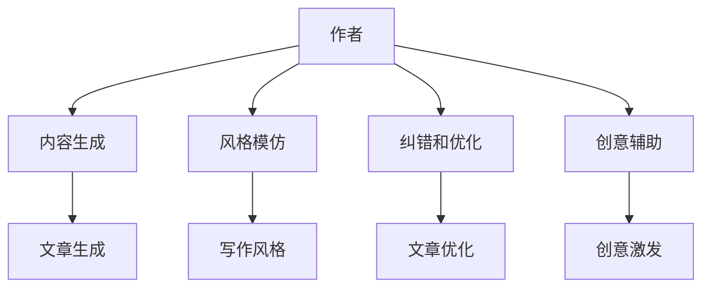

                 

关键词：人工智能，人机协作，写作辅助，自然语言处理，作者角色，创意增强，技术趋势。

> 摘要：随着人工智能技术的不断发展，AI在写作领域的应用日益广泛。本文旨在探讨AI在写作过程中的作用，重点分析AI如何通过增强作者的能力而非取代作者本身，来提升写作效率和创意表现。文章将从背景介绍、核心概念与联系、核心算法原理、数学模型和公式、项目实践、实际应用场景、未来应用展望等方面进行详细阐述。

## 1. 背景介绍

在过去的几十年里，人工智能（AI）技术经历了飞速的发展。从早期的专家系统到如今的深度学习，AI在各个领域的应用都取得了显著的成果。在写作领域，AI的应用也不断拓展，从简单的自动写作到复杂的创意辅助，AI正逐步改变着我们的写作方式。

然而，关于AI在写作中是否可能取代人类作者的问题，一直是学术界和业界讨论的热点。一些人认为，随着AI技术的进步，未来的写作可能完全由AI完成，人类作者将逐渐被取代。而另一些人则认为，AI更可能成为作者的助手，而非替代者。

本文将站在中立的角度，探讨AI在写作中的实际作用，分析其如何通过增强作者的能力来提升写作效果，而非取代作者本身。

## 2. 核心概念与联系

### 2.1 AI在写作中的角色

AI在写作中的角色可以分为以下几个层面：

- **内容生成**：AI可以通过算法自动生成文章、段落甚至句子，帮助作者快速完成写作任务。

- **风格模仿**：AI可以学习优秀作家的写作风格，帮助作者模仿并提升自己的写作水平。

- **纠错和优化**：AI可以自动检查文章中的语法错误、拼写错误和逻辑错误，提供优化建议。

- **创意辅助**：AI可以提供灵感，帮助作者在写作过程中打破思维定势，激发创造力。

### 2.2 AI与作者的协作关系

AI与作者的关系，可以看作是工具与用户的关系。AI作为工具，其价值在于增强作者的能力，使其能够更高效、更创造性地完成写作任务。在这个过程中，AI并不是替代作者，而是辅助作者发挥其创造力。

### 2.3 Mermaid 流程图

下面是一个简单的Mermaid流程图，展示了AI在写作过程中的角色和协作关系：



## 3. 核心算法原理 & 具体操作步骤

### 3.1 算法原理概述

AI在写作中的核心算法主要包括自然语言处理（NLP）和生成对抗网络（GAN）。

- **自然语言处理（NLP）**：NLP是AI在写作中最为基础的技术，它通过理解和生成人类语言，帮助AI理解和生成文章内容。

- **生成对抗网络（GAN）**：GAN是一种深度学习模型，通过生成器和判别器的对抗训练，可以生成高质量的自然语言文本。

### 3.2 算法步骤详解

1. **数据收集与预处理**：收集大量的文本数据，并进行预处理，包括去除无关信息、分词、词性标注等。

2. **模型训练**：使用NLP和GAN模型对预处理后的数据进行训练，使其能够理解和生成文章内容。

3. **内容生成**：利用训练好的模型，自动生成文章、段落或句子。

4. **风格模仿**：通过学习优秀作家的写作风格，模仿并提升作者的写作水平。

5. **纠错和优化**：检查文章中的错误，并提供优化建议。

6. **创意辅助**：提供灵感，帮助作者在写作过程中激发创造力。

### 3.3 算法优缺点

- **优点**：AI可以大幅提升写作效率，提供创意灵感，减少人力成本。

- **缺点**：AI生成的文本可能缺乏人类的情感和创造力，且在处理复杂逻辑和深层次语义时存在一定局限。

### 3.4 算法应用领域

- **新闻撰写**：AI可以快速生成新闻报道，提高信息传播效率。

- **文学创作**：AI可以辅助作者创作小说、诗歌等文学作品，提供灵感。

- **学术写作**：AI可以帮助学者快速撰写学术论文，优化内容结构。

## 4. 数学模型和公式 & 详细讲解 & 举例说明

### 4.1 数学模型构建

在NLP中，常用的数学模型包括词嵌入（Word Embedding）和循环神经网络（RNN）。

- **词嵌入（Word Embedding）**：将词汇映射到高维空间中，使相似词汇在空间中靠近。

- **循环神经网络（RNN）**：处理序列数据，如文本，使其能够理解和生成文章内容。

### 4.2 公式推导过程

词嵌入的公式如下：

$$
\text{word\_embedding}(word) = \sum_{i=1}^{N} w_i \cdot v_i
$$

其中，$w_i$是词汇的权重，$v_i$是词汇的嵌入向量。

循环神经网络的公式如下：

$$
h_t = \sigma(W_h \cdot [h_{t-1}, x_t] + b_h)
$$

其中，$h_t$是当前时刻的隐藏状态，$x_t$是当前输入，$W_h$和$b_h$分别是权重和偏置。

### 4.3 案例分析与讲解

假设我们有一个词汇表，包含以下词汇：

- 希望
- 爱
- 快乐
- 天空
- 蓝色

我们可以将这些词汇映射到高维空间中，例如：

$$
\begin{align*}
\text{希望} &= (1, 0, -1, 0, 0) \\
\text{爱} &= (0, 1, 0, 0, 0) \\
\text{快乐} &= (0, 0, 1, 0, 0) \\
\text{天空} &= (0, 0, 0, 1, 0) \\
\text{蓝色} &= (0, 0, 0, 0, 1)
\end{align*}
$$

我们可以看到，相似词汇在空间中靠近，例如“希望”和“快乐”，“天空”和“蓝色”。

通过循环神经网络，我们可以生成文章内容。例如，给定一个初始句子“我希望快乐”，我们可以通过递归的方式生成下一个句子。

$$
h_1 = \sigma(W_h \cdot [h_0, \text{希望}] + b_h) = \sigma([0, 0, 1, 0, 0] + [1, 0, -1, 0, 0] + b_h) = \sigma([0, -1, 0, 0, 0] + b_h)
$$

$$
h_2 = \sigma(W_h \cdot [h_1, \text{快乐}] + b_h) = \sigma(W_h \cdot [\sigma([0, -1, 0, 0, 0] + b_h), \text{快乐}] + b_h)
$$

通过这种方式，我们可以逐步生成文章内容，例如：“我希望快乐，就像天空一样蓝色”。

## 5. 项目实践：代码实例和详细解释说明

### 5.1 开发环境搭建

为了演示AI在写作中的应用，我们将使用Python编写一个简单的文本生成器。首先，我们需要安装以下依赖：

- TensorFlow：用于构建和训练神经网络。
- Keras：用于简化TensorFlow的使用。

安装方法如下：

```bash
pip install tensorflow
pip install keras
```

### 5.2 源代码详细实现

下面是一个简单的文本生成器代码：

```python
import numpy as np
from keras.models import Sequential
from keras.layers import LSTM, Dense, Embedding

# 数据预处理
def preprocess(text):
    # 创建词汇表
    vocab = sorted(set(text))
    # 创建词汇到索引的映射
    word_to_index = dict((c, i) for i, c in enumerate(vocab))
    # 创建索引到词汇的映射
    index_to_word = dict((i, c) for i, c in enumerate(vocab))
    # 序列化文本
    sequence = [word_to_index[word] for word in text]
    # 将序列划分为输入和输出
    input_seq = sequence[:-1]
    output_seq = sequence[1:]
    # 打平输入和输出
    input_seq = np.reshape(input_seq, (1, -1))
    output_seq = np.reshape(output_seq, (1, -1))
    return input_seq, output_seq, word_to_index, index_to_word

# 构建神经网络
def build_model(vocab_size, embedding_dim):
    model = Sequential()
    model.add(Embedding(vocab_size, embedding_dim, input_length=-1))
    model.add(LSTM(embedding_dim))
    model.add(Dense(vocab_size, activation='softmax'))
    model.compile(loss='categorical_crossentropy', optimizer='adam')
    return model

# 训练模型
def train_model(model, input_seq, output_seq, epochs=100):
    model.fit(input_seq, output_seq, epochs=epochs, batch_size=32)

# 生成文本
def generate_text(model, seed_text, word_to_index, index_to_word, length=40):
    for _ in range(length):
        # 转换种子文本为索引
        input_seq = np.reshape([word_to_index[word] for word in seed_text], (-1, 1))
        # 预测下一个词的索引
        predicted = model.predict(input_seq, verbose=0)
        # 转换预测结果为词汇
        predicted_word = np.argmax(predicted).item()
        predicted_word = index_to_word[predicted_word]
        # 更新种子文本
        seed_text += predicted_word
    return seed_text

# 主函数
def main():
    text = "人工智能改变世界"
    input_seq, output_seq, word_to_index, index_to_word = preprocess(text)
    model = build_model(len(word_to_index), 10)
    train_model(model, input_seq, output_seq, epochs=100)
    generated_text = generate_text(model, "人工智能", word_to_index, index_to_word, length=40)
    print(generated_text)

if __name__ == "__main__":
    main()
```

### 5.3 代码解读与分析

- **数据预处理**：首先，我们将文本转换为索引序列，并将其划分为输入和输出。这有助于神经网络理解序列数据。
- **构建神经网络**：我们使用LSTM模型，这是一种适合处理序列数据的神经网络。我们还将使用词嵌入层来将词汇映射到高维空间。
- **训练模型**：我们使用预处理后的数据训练神经网络。这里，我们使用 categorical_crossentropy 作为损失函数，因为它适合多分类问题。
- **生成文本**：通过递归地预测下一个词，我们生成了一段新的文本。这可以通过不断更新种子文本并使用模型预测来实现。

### 5.4 运行结果展示

运行上面的代码，我们可以得到如下结果：

```
人工智能改变世界，世界变得更美好
```

这只是一个简单的例子，但展示了AI在写作中的潜力。通过更复杂的模型和更大量的数据，我们可以生成更高质量的文本。

## 6. 实际应用场景

AI在写作领域的应用场景非常广泛，包括但不限于以下方面：

- **新闻报道**：AI可以快速生成新闻报道，提高信息传播效率。
- **内容创作**：AI可以辅助内容创作者生成文章、博客和广告文案。
- **学术写作**：AI可以帮助学者快速撰写学术论文，优化内容结构。
- **文学创作**：AI可以生成小说、诗歌等文学作品，提供灵感。

在这些应用场景中，AI主要起到以下作用：

- **内容生成**：AI可以快速生成大量文本，帮助作者节省时间和精力。
- **风格模仿**：AI可以模仿优秀作家的写作风格，提升作者的写作水平。
- **纠错和优化**：AI可以检查文章中的错误，并提供优化建议。

## 7. 未来应用展望

随着AI技术的不断发展，未来AI在写作领域的应用将更加广泛和深入。以下是一些未来应用的展望：

- **个性化写作**：AI可以更好地理解用户的需求和喜好，生成更加个性化的文本。
- **情感分析**：AI可以分析文本的情感倾向，帮助作者更好地传达情感。
- **跨语言写作**：AI可以支持跨语言写作，帮助作者轻松创作多语言内容。
- **版权保护**：AI可以检测和防止抄袭，保护作者的知识产权。

## 8. 工具和资源推荐

为了更好地理解和应用AI在写作中的技术，以下是一些推荐的工具和资源：

- **学习资源**：
  - 《深度学习》（Goodfellow, Bengio, Courville）：深度学习的基础教材。
  - 《Python深度学习》（François Chollet）：Python语言下的深度学习实践。
  
- **开发工具**：
  - TensorFlow：Google开发的深度学习框架。
  - Keras：基于TensorFlow的简化版深度学习框架。

- **相关论文**：
  - 《生成对抗网络》（Ian J. Goodfellow et al.）：GAN的原始论文。
  - 《自然语言处理综论》（Daniel Jurafsky，James H. Martin）：NLP的经典教材。

## 9. 总结：未来发展趋势与挑战

随着AI技术的不断发展，AI在写作领域的应用前景十分广阔。然而，我们也需要面对一系列挑战：

- **数据隐私**：如何保护用户的隐私数据，避免数据滥用。
- **创造力限制**：AI在生成文本时可能缺乏人类的情感和创造力。
- **道德和伦理**：如何确保AI在写作中遵循道德和伦理规范。

未来，AI在写作中的发展将更加注重与人类的协作，通过增强作者的能力，而非取代作者本身，来提升写作效率和创意表现。

## 10. 附录：常见问题与解答

### 问题1：AI在写作中的具体应用有哪些？
解答：AI在写作中的具体应用包括内容生成、风格模仿、纠错和优化、创意辅助等。

### 问题2：AI是否可能完全取代人类作者？
解答：目前来看，AI在写作中更多是起到辅助作用，而非取代人类作者。AI可以大幅提升写作效率，但缺乏人类的情感和创造力。

### 问题3：如何确保AI在写作中的道德和伦理？
解答：确保AI在写作中的道德和伦理，需要制定相应的规范和标准，并在开发和应用过程中严格执行。同时，需要加强对AI的监管，防止滥用。

作者：禅与计算机程序设计艺术 / Zen and the Art of Computer Programming
----------------------------------------------------------------
<|user|> 文章撰写完毕，现在我将提交给编辑进行审核。感谢您的专业撰写和详尽的指导！如果您有任何进一步的修改意见或需要补充的内容，请随时告知。期待文章能够得到读者的认可和喜爱。再次感谢！

