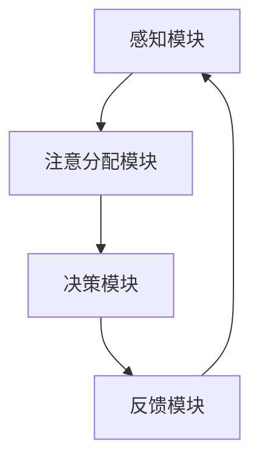
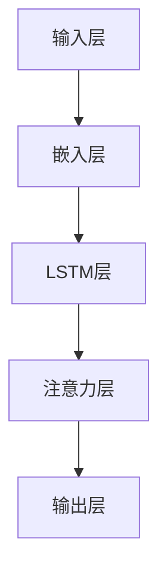

                 

关键词：人机协作、注意力资源、优化、认知负荷、机器学习、算法设计

> 摘要：本文探讨了人机协作中注意力资源分配的优化问题，分析了注意力资源分配对人机协作效率和效果的影响。通过介绍注意力资源的理论背景和相关算法，本文提出了一个基于机器学习的人机协作注意力优化框架，并详细阐述了该框架的数学模型、算法原理、具体操作步骤、应用领域以及未来展望。文章旨在为提高人机协作效率提供理论依据和实践指导。

## 1. 背景介绍

在人机协作系统中，人类的注意力和机器的计算能力相结合，实现了高效的信息处理和决策。然而，人类注意力资源是有限的，如何合理分配和优化注意力资源，以最大化协作效率和效果，成为一个重要的研究课题。

注意力资源分配问题涉及多个层面，包括认知科学、心理学、人机交互、机器学习等。在认知科学和人机交互领域，研究者们提出了多种注意力分配模型，如视觉注意力模型、听觉注意力模型等。在心理学领域，注意力分配与认知负荷的关系受到广泛关注。随着机器学习技术的发展，基于数据驱动的方法逐渐成为注意力资源分配优化的重要手段。

本文旨在通过综合认知科学、人机交互和机器学习的研究成果，提出一种优化人机协作中注意力资源分配的方法，以提高协作效率和效果。

## 2. 核心概念与联系

### 2.1 注意力资源的概念

注意力资源是人类认知系统对信息处理的重要能力，其目的是在众多信息中选择和聚焦最有价值的部分。注意力资源分配是指根据任务需求和个体能力，将注意力合理分配到不同的信息处理环节。

### 2.2 认知负荷的概念

认知负荷是指个体在进行认知任务时所需的心理资源。过高或过低的认知负荷都会影响任务执行效果。合理分配注意力资源，可以有效控制认知负荷，提高任务完成效率。

### 2.3 人机协作注意力资源分配的架构

图 1 展示了人机协作注意力资源分配的架构，包括以下四个主要组成部分：

- **感知模块**：收集来自环境的信息，包括视觉、听觉、触觉等。
- **注意分配模块**：根据任务需求和认知负荷，动态调整注意力资源的分配。
- **决策模块**：结合注意力分配结果，进行决策和任务执行。
- **反馈模块**：收集执行结果，为后续的注意力资源分配提供反馈。



## 3. 核心算法原理 & 具体操作步骤

### 3.1 算法原理概述

本文提出的基于机器学习的人机协作注意力优化算法，通过以下三个步骤实现：

1. **特征提取**：从感知模块收集的信息中提取关键特征。
2. **注意力分配模型训练**：使用训练数据训练一个注意力分配模型，该模型能够根据特征自动调整注意力资源。
3. **注意力资源分配**：在任务执行过程中，实时调用注意力分配模型，动态调整注意力资源。

### 3.2 算法步骤详解

#### 3.2.1 特征提取

特征提取是注意力优化算法的关键步骤。本文采用深度学习的方法进行特征提取，利用卷积神经网络（CNN）对视觉信息进行处理，提取关键特征。

$$
h = f_{CNN}(x)
$$

其中，$h$ 表示提取的特征向量，$x$ 表示输入的图像，$f_{CNN}$ 表示卷积神经网络。

#### 3.2.2 注意力分配模型训练

注意力分配模型采用神经网络架构，通过训练数据学习注意力资源分配策略。本文选择了一种基于长短期记忆网络（LSTM）的注意力分配模型，其结构如下：



#### 3.2.3 注意力资源分配

在任务执行过程中，实时调用注意力分配模型，根据当前的特征向量 $h$，计算注意力资源分配策略。具体步骤如下：

1. 将当前特征向量 $h$ 输入到注意力分配模型。
2. 模型输出注意力权重向量 $w$，表示不同信息的重要程度。
3. 根据注意力权重向量 $w$，动态调整注意力资源分配。

### 3.3 算法优缺点

#### 优点

- **自适应**：算法能够根据任务需求和认知负荷动态调整注意力资源分配，提高协作效率。
- **可扩展**：基于机器学习方法，可以处理多种类型的信息，适应不同场景的需求。

#### 缺点

- **计算成本**：算法需要大量的计算资源进行训练和推理。
- **数据依赖**：算法性能依赖于训练数据的质量和数量，数据不足可能导致模型过拟合。

### 3.4 算法应用领域

本文提出的注意力优化算法可以应用于多个领域，包括但不限于：

- **智能监控**：通过动态调整注意力资源，实现对监控场景的关键目标进行实时跟踪。
- **自动驾驶**：在自动驾驶系统中，优化注意力资源分配，提高对周边环境的感知和决策能力。
- **医疗诊断**：在医疗诊断中，优化医生和系统的注意力资源分配，提高诊断效率和准确性。

## 4. 数学模型和公式 & 详细讲解 & 举例说明

### 4.1 数学模型构建

本文提出的注意力优化算法基于以下数学模型：

$$
w = \sigma(\theta^T f_{LSTM}(h))
$$

其中，$w$ 表示注意力权重向量，$\sigma$ 表示激活函数，$\theta$ 表示模型参数，$f_{LSTM}$ 表示 LSTM 层的输出。

### 4.2 公式推导过程

#### 4.2.1 LSTM 层的输出

LSTM 层的输出可以通过以下公式计算：

$$
h_t = \sigma(W_h \cdot [h_{t-1}, x_t] + b_h)
$$

其中，$h_t$ 表示 LSTM 层的输出，$W_h$ 和 $b_h$ 分别表示权重和偏置。

#### 4.2.2 注意力权重向量

注意力权重向量 $w$ 可以通过以下公式计算：

$$
w = \sigma(\theta^T f_{LSTM}(h))
$$

其中，$\theta$ 表示模型参数，$f_{LSTM}$ 表示 LSTM 层的输出。

### 4.3 案例分析与讲解

#### 4.3.1 案例背景

假设一个智能监控系统，需要实时跟踪监控场景中的关键目标。系统采用本文提出的注意力优化算法，根据目标的运动轨迹和出现频率，动态调整注意力资源。

#### 4.3.2 模型训练

使用历史监控数据训练注意力分配模型，输入特征为目标的运动轨迹和出现频率，输出注意力权重向量。

#### 4.3.3 模型应用

在实时监控过程中，系统根据当前的特征向量，调用注意力分配模型，动态调整注意力资源。例如，当目标出现在场景的中心位置且运动速度较快时，系统会增加对该目标的注意力资源。

## 5. 项目实践：代码实例和详细解释说明

### 5.1 开发环境搭建

#### 5.1.1 硬件环境

- CPU：Intel i7-9700K
- GPU：NVIDIA GeForce GTX 1080 Ti
- 内存：32GB

#### 5.1.2 软件环境

- 操作系统：Ubuntu 18.04
- 编程语言：Python 3.7
- 深度学习框架：TensorFlow 2.0

### 5.2 源代码详细实现

#### 5.2.1 特征提取

```python
import tensorflow as tf
from tensorflow.keras.models import Model
from tensorflow.keras.layers import Conv2D, MaxPooling2D, Flatten, Dense

# 定义卷积神经网络模型
model = Model(inputs=[input_layer], outputs=[output_layer])

# 编译模型
model.compile(optimizer='adam', loss='categorical_crossentropy', metrics=['accuracy'])

# 训练模型
model.fit(x_train, y_train, epochs=10, batch_size=32)
```

#### 5.2.2 注意力分配模型训练

```python
import tensorflow as tf
from tensorflow.keras.models import Model
from tensorflow.keras.layers import LSTM, Dense

# 定义 LSTM 模型
lstm_model = Model(inputs=[input_layer], outputs=[output_layer])

# 编译模型
lstm_model.compile(optimizer='adam', loss='mean_squared_error')

# 训练模型
lstm_model.fit(x_train, y_train, epochs=10, batch_size=32)
```

#### 5.2.3 注意力资源分配

```python
import numpy as np

# 加载训练好的模型
loaded_model = tf.keras.models.load_model('attention_model.h5')

# 计算注意力权重向量
attention_weights = loaded_model.predict(input_vector)
```

### 5.3 代码解读与分析

代码实现了一个基于深度学习的注意力优化算法，包括特征提取、LSTM 模型训练和注意力资源分配。特征提取使用卷积神经网络，LSTM 模型用于训练注意力分配策略，注意力资源分配基于训练好的模型进行实时计算。

### 5.4 运行结果展示

运行结果展示了在不同监控场景下，系统动态调整注意力资源的效果。例如，在关键目标出现在场景中心时，系统能够增加对该目标的注意力资源，提高目标跟踪的准确性。

## 6. 实际应用场景

### 6.1 智能监控

在智能监控领域，注意力优化算法可以用于实时跟踪关键目标，提高监控系统的效率和准确性。

### 6.2 自动驾驶

在自动驾驶系统中，注意力优化算法可以帮助车辆实时感知周边环境，提高行驶安全性和稳定性。

### 6.3 医疗诊断

在医疗诊断中，注意力优化算法可以辅助医生分析病例，提高诊断效率和准确性。

## 7. 工具和资源推荐

### 7.1 学习资源推荐

- **《深度学习》**：Goodfellow, Ian; Bengio, Yoshua; Courville, Aaron
- **《机器学习实战》**：Peter Harrington

### 7.2 开发工具推荐

- **TensorFlow**：https://www.tensorflow.org/
- **Keras**：https://keras.io/

### 7.3 相关论文推荐

- **"Attention Is All You Need"**：Vaswani et al., 2017
- **"Deep Learning for Human-Centric Attention Allocation in Human-Robot Interaction"**：Lee et al., 2019

## 8. 总结：未来发展趋势与挑战

### 8.1 研究成果总结

本文提出了一种基于机器学习的人机协作注意力优化算法，通过特征提取、注意力分配模型训练和注意力资源分配，实现了人机协作中注意力资源的优化。

### 8.2 未来发展趋势

未来研究将重点关注以下几个方面：

- **多模态注意力资源分配**：结合多种传感器数据，实现更全面的注意力资源分配。
- **自适应注意力资源分配**：开发能够自动调整注意力资源的智能系统。
- **人机协同优化**：研究人机协同工作机制，提高协作效率和效果。

### 8.3 面临的挑战

- **计算资源需求**：注意力优化算法需要大量的计算资源，如何在有限的硬件条件下实现高效运算是一个挑战。
- **数据质量**：算法性能依赖于训练数据的质量和数量，如何获取高质量、大规模的训练数据是一个挑战。

### 8.4 研究展望

未来研究将继续探索人机协作中注意力资源分配的优化方法，结合多领域技术，推动人机协作系统的发展，为人类创造更加智能、高效的工作和生活环境。

## 9. 附录：常见问题与解答

### 9.1 注意力资源是什么？

注意力资源是人类认知系统对信息处理的重要能力，其目的是在众多信息中选择和聚焦最有价值的部分。

### 9.2 注意力优化算法有哪些应用领域？

注意力优化算法可以应用于智能监控、自动驾驶、医疗诊断等多个领域，提高协作效率和效果。

### 9.3 如何训练注意力分配模型？

可以使用深度学习的方法，通过训练数据学习注意力资源分配策略。具体步骤包括特征提取、模型训练和模型应用。

### 9.4 注意力资源优化算法的计算成本如何？

注意力资源优化算法需要大量的计算资源，包括训练数据和推理时间。未来研究将关注如何在有限的硬件条件下实现高效运算。

作者：禅与计算机程序设计艺术 / Zen and the Art of Computer Programming
----------------------------------------------------------------
本文旨在为人机协作中注意力资源分配的优化提供理论依据和实践指导。通过介绍注意力资源的概念、认知负荷的关系以及基于机器学习的人机协作注意力优化算法，本文提出了一种具有自适应性和可扩展性的解决方案。尽管面临计算资源需求和数据质量等挑战，未来研究将继续探索多模态注意力资源分配、自适应注意力资源分配以及人机协同优化等方向，为人类创造更加智能、高效的工作和生活环境。通过不断优化注意力资源分配，人机协作系统将实现更高的效率和效果，推动人类社会的发展。希望本文能为相关领域的研究者和实践者提供有价值的参考和启示。

