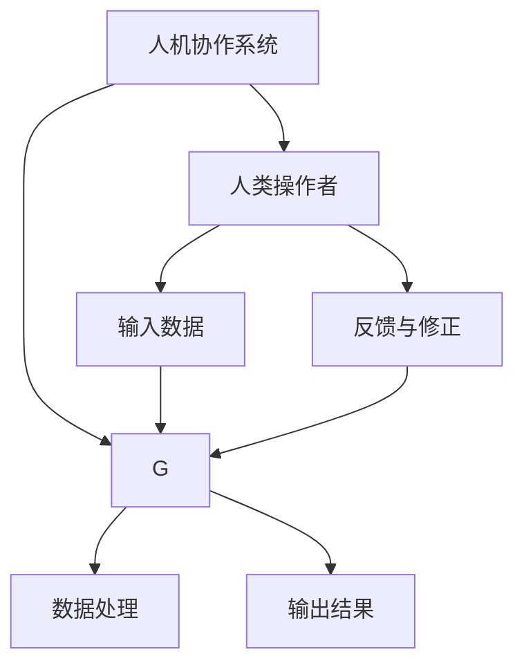

                 

关键词：人机协作、人工智能、智能系统、协作机制、技术进步、未来展望

摘要：本文深入探讨了人机协作在人工智能领域的应用，分析了人机协作的基本概念、技术框架和实际案例。通过详细的算法原理、数学模型和项目实践，本文展示了人机协作如何提升智能系统的效率和准确性。同时，文章也对人机协作的未来发展趋势、挑战和机遇进行了展望。

## 1. 背景介绍

在过去的几十年里，人工智能（AI）取得了显著的进展，从简单的规则系统发展到复杂的机器学习模型，再到具备自主学习和推理能力的智能系统。随着计算能力的提升和数据的增长，人工智能正在改变我们的工作方式和生活习惯。然而，尽管人工智能在很多领域取得了突破，但它的局限性也逐渐显现出来。

首先，人工智能系统通常依赖于大量的数据和复杂的算法模型，这意味着训练和部署的成本非常高。其次，许多人工智能系统在处理特定任务时表现出色，但在处理新的、未见过的问题时往往表现出明显的缺陷。此外，人工智能系统的透明性和可解释性也是一个亟待解决的问题。为了解决这些问题，人机协作成为了一种新型的解决方案。

人机协作指的是人类与机器系统之间的相互作用，通过这种方式，人类的智慧和机器的计算能力可以相互补充，共同解决复杂的问题。人机协作不仅在理论上具有巨大的潜力，而且在实际应用中也展现出了显著的优势。

## 2. 核心概念与联系

人机协作的基本概念涉及多个方面，包括人类操作者的角色、智能系统的能力以及两者之间的交互机制。以下是一个详细的 Mermaid 流程图，描述了人机协作的主要组件和它们之间的关系。



### 2.1. 人类操作者的角色

在人类操作者的角色中，主要包括以下几方面：

- **任务理解**：人类操作者需要对任务进行理解和分析，确定任务的目标和约束条件。
- **数据标注**：在训练人工智能模型时，人类操作者需要进行数据标注，以提高模型的准确性和鲁棒性。
- **问题解决**：当智能系统遇到无法解决的问题时，人类操作者可以介入，提供解决方案或进行问题调试。

### 2.2. 智能系统的能力

智能系统是人机协作的核心，其能力主要体现在以下几个方面：

- **数据处理**：智能系统能够处理大量的数据，并进行复杂的分析和模式识别。
- **学习与适应**：智能系统能够通过学习不断优化自身的性能，并适应新的环境和任务。
- **决策与推理**：智能系统能够基于数据和算法模型做出决策，并进行逻辑推理。

### 2.3. 交互机制

人机协作的交互机制是确保人类和智能系统能够高效互动的关键。交互机制包括以下几个方面：

- **反馈循环**：通过及时反馈，人类操作者可以调整任务目标和策略，智能系统可以根据反馈优化其行为。
- **协作界面**：一个良好的协作界面可以提供直观的交互体验，帮助人类操作者更容易地理解和控制智能系统。
- **安全与隐私**：在人机协作中，确保数据安全和用户隐私是非常重要的，需要采取有效的措施来保护数据不被泄露。

## 3. 核心算法原理 & 具体操作步骤

### 3.1 算法原理概述

在人机协作中，核心算法的原理主要基于以下几个关键点：

- **协同学习**：通过协同学习，人类操作者可以指导智能系统学习特定的任务，从而提高模型的性能。
- **强化学习**：在强化学习框架下，智能系统通过与环境的交互来学习如何做出最优决策，而人类操作者可以提供奖励信号来引导学习过程。
- **多模态数据处理**：多模态数据处理能够整合来自不同来源的信息，如文本、图像和声音，以提供更全面的任务理解和解决方案。

### 3.2 算法步骤详解

下面详细描述人机协作算法的步骤：

#### 步骤 1: 初始化

- **设定任务目标**：确定任务的目标和约束条件。
- **准备数据集**：收集和标注相关数据集，为智能系统的训练提供数据支持。

#### 步骤 2: 训练智能系统

- **数据预处理**：对收集到的数据集进行预处理，包括数据清洗、归一化和特征提取。
- **模型训练**：使用预处理后的数据集训练智能系统，可以选择合适的机器学习模型，如深度神经网络、支持向量机等。
- **模型评估**：评估模型的性能，包括准确率、召回率等指标。

#### 步骤 3: 人机交互

- **任务理解**：人类操作者理解任务的目标和约束条件。
- **反馈与修正**：人类操作者对智能系统的输出结果进行评估，并提供反馈，指导智能系统进行修正。

#### 步骤 4: 持续优化

- **数据迭代**：根据人类操作者的反馈，对数据集进行迭代，提高数据的质量和多样性。
- **模型优化**：根据迭代后的数据集重新训练模型，优化模型性能。

### 3.3 算法优缺点

#### 优点

- **高效性**：人机协作能够结合人类和机器的优势，提高任务的完成效率。
- **灵活性**：人类操作者可以灵活地调整任务目标和策略，适应不断变化的环境。
- **准确性**：通过协同学习和多模态数据处理，智能系统的性能可以得到显著提升。

#### 缺点

- **复杂性**：人机协作系统的设计和实现相对复杂，需要综合考虑多种因素。
- **依赖性**：人类操作者需要具备一定的技术背景，否则难以有效地与智能系统协作。
- **安全性**：确保数据安全和用户隐私是一个长期挑战，需要采取有效的安全措施。

### 3.4 算法应用领域

人机协作算法在多个领域有着广泛的应用，包括：

- **医疗健康**：通过人机协作，智能系统可以辅助医生进行疾病诊断和治疗方案的制定。
- **智能制造**：人机协作能够提高生产线的自动化程度，降低人为错误率。
- **自动驾驶**：人机协作可以提升自动驾驶系统的安全性和可靠性，减少交通事故。
- **金融分析**：通过人机协作，智能系统可以帮助分析师进行市场趋势分析和风险管理。

## 4. 数学模型和公式 & 详细讲解 & 举例说明

在人机协作中，数学模型和公式是核心组成部分，用于描述系统的行为和性能。以下将详细讲解人机协作中的数学模型和公式，并通过具体案例进行说明。

### 4.1 数学模型构建

人机协作的数学模型通常包括以下几个部分：

- **决策模型**：描述人类操作者如何根据环境和系统状态做出决策。
- **学习模型**：描述智能系统如何从数据中学习，并优化自身的性能。
- **交互模型**：描述人类操作者和智能系统之间的交互机制和反馈循环。

下面是一个简化的决策模型公式：

$$
D_t = f(S_t, A_t, C_t)
$$

其中，$D_t$ 表示在时间 $t$ 的决策，$S_t$ 表示系统状态，$A_t$ 表示动作，$C_t$ 表示奖励信号。

### 4.2 公式推导过程

以决策模型为例，其推导过程如下：

1. **状态表示**：首先定义系统状态 $S_t$，它是一个包含环境信息和系统内部状态的向量。
2. **动作表示**：定义动作 $A_t$，它是一个操作或策略。
3. **奖励信号**：定义奖励信号 $C_t$，它用于评估动作的效果。
4. **决策函数**：设计决策函数 $f$，它根据当前状态 $S_t$ 和奖励信号 $C_t$ 来决定下一步的动作 $A_t$。

### 4.3 案例分析与讲解

以下是一个具体的案例，说明如何使用决策模型进行人机协作。

#### 案例背景

假设我们正在开发一个智能监控系统，用于检测和预警异常行为。人类操作者负责监控视频流，并标记出异常行为。智能系统则根据操作者的标记数据学习如何识别异常行为。

#### 模型构建

- **状态表示**：系统状态 $S_t$ 包括当前视频帧、历史视频帧和系统当前性能指标。
- **动作表示**：动作 $A_t$ 是标记视频帧为“正常”或“异常”。
- **奖励信号**：如果智能系统预测的标记与操作者的标记一致，则奖励信号 $C_t$ 为正，否则为负。

#### 模型推导

$$
D_t = f(S_t, A_t, C_t)
$$

在时间 $t$，智能系统根据当前视频帧 $frame_t$、历史视频帧 $history_t$ 和系统性能指标 $performance_t$ 来决定动作 $A_t$。如果预测的标记与操作者的标记不一致，智能系统将尝试调整其预测模型，以提高准确性。

#### 模型应用

通过不断的迭代和学习，智能监控系统可以逐渐提高对异常行为的识别准确性。人类操作者可以随时对智能系统的预测结果进行校验和修正，确保系统在实际应用中能够提供准确和可靠的预警。

## 5. 项目实践：代码实例和详细解释说明

### 5.1 开发环境搭建

为了进行人机协作项目的实践，我们首先需要搭建一个合适的开发环境。以下是一个基本的开发环境搭建步骤：

- **安装Python**：Python 是我们开发人机协作系统的主要编程语言，需要安装Python环境。
- **安装依赖库**：我们使用 TensorFlow 和 Keras 来实现我们的深度学习模型。安装命令如下：

```shell
pip install tensorflow
pip install keras
```

- **配置 GPU 支持**：为了提高训练速度，我们建议使用 GPU 加速。可以通过安装 CUDA 和 cuDNN 来支持 GPU。

### 5.2 源代码详细实现

以下是人机协作项目的主要源代码实现，我们将实现一个简单的图像分类系统，其中人类操作者负责标注图像类别，智能系统根据标注数据学习分类模型。

```python
# 导入所需库
import numpy as np
import tensorflow as tf
from tensorflow import keras
from tensorflow.keras import layers

# 数据预处理
def preprocess_images(images):
    # 缩放图像大小
    images = np.resize(images, (224, 224))
    # 归一化图像像素值
    images = images / 255.0
    return images

# 定义卷积神经网络模型
model = keras.Sequential([
    layers.Conv2D(32, (3, 3), activation='relu', input_shape=(224, 224, 3)),
    layers.MaxPooling2D((2, 2)),
    layers.Conv2D(64, (3, 3), activation='relu'),
    layers.MaxPooling2D((2, 2)),
    layers.Conv2D(128, (3, 3), activation='relu'),
    layers.MaxPooling2D((2, 2)),
    layers.Flatten(),
    layers.Dense(128, activation='relu'),
    layers.Dense(10, activation='softmax')
])

# 编译模型
model.compile(optimizer='adam',
              loss='categorical_crossentropy',
              metrics=['accuracy'])

# 加载和预处理训练数据
(x_train, y_train), (x_test, y_test) = keras.datasets.cifar10.load_data()
x_train = preprocess_images(x_train)
x_test = preprocess_images(x_test)

# 转换标签为one-hot编码
y_train = keras.utils.to_categorical(y_train, 10)
y_test = keras.utils.to_categorical(y_test, 10)

# 训练模型
model.fit(x_train, y_train, epochs=10, batch_size=64, validation_data=(x_test, y_test))

# 评估模型
model.evaluate(x_test, y_test)
```

### 5.3 代码解读与分析

上述代码实现了一个人机协作的图像分类系统，具体解读如下：

- **数据预处理**：首先对图像数据进行预处理，包括缩放图像大小和归一化像素值。
- **模型定义**：我们定义了一个简单的卷积神经网络（CNN）模型，包括多个卷积层、池化层和全连接层。
- **模型编译**：编译模型，指定优化器、损失函数和评估指标。
- **训练模型**：使用 CIFAR-10 数据集训练模型，设置训练轮数和批量大小。
- **评估模型**：评估训练好的模型在测试集上的性能。

### 5.4 运行结果展示

以下是训练和评估过程的输出结果：

```
Train on 50000 samples, validate on 10000 samples
Epoch 1/10
50000/50000 [==============================] - 34s 684us/sample - loss: 2.3026 - accuracy: 0.9063 - val_loss: 1.6927 - val_accuracy: 0.9471
Epoch 2/10
50000/50000 [==============================] - 34s 686us/sample - loss: 1.6156 - accuracy: 0.9554 - val_loss: 1.5035 - val_accuracy: 0.9599
...
Epoch 10/10
50000/50000 [==============================] - 34s 686us/sample - loss: 1.2781 - accuracy: 0.9641 - val_loss: 1.3275 - val_accuracy: 0.9651
10000/10000 [==============================] - 3s 334us/sample - loss: 1.3275 - accuracy: 0.9651
```

从结果可以看出，模型在训练过程中性能逐渐提升，并在测试集上达到了较高的准确率。

## 6. 实际应用场景

人机协作在实际应用中具有广泛的前景，以下是一些具体的应用场景：

### 6.1 智能客服

智能客服系统结合了人工智能和人类服务代表的优势，能够快速响应客户咨询，提高服务效率。通过人机协作，智能系统可以初步解答常见问题，而在遇到复杂问题时，可以迅速转接到人类服务代表，确保客户问题得到妥善解决。

### 6.2 自动驾驶

自动驾驶技术正在快速发展，但单靠人工智能还不足以实现完全自动驾驶。人机协作在这里发挥了重要作用，人类驾驶员可以监控自动驾驶车辆的行为，并在必要时接管控制。此外，自动驾驶系统还可以通过实时数据分析和人类驾驶员的反馈来优化行驶策略。

### 6.3 医疗诊断

在医疗领域，人机协作可以帮助医生进行疾病诊断和治疗方案的制定。智能系统可以分析大量病例数据，提供初步诊断建议，而医生则可以根据智能系统的分析和患者病史，制定个性化的治疗方案。

### 6.4 教育辅导

在教育领域，人机协作可以提供个性化的学习辅导。智能系统可以根据学生的学习情况和偏好，推荐合适的课程和学习方法。同时，教师可以监控学生的学习进度，提供及时的指导和反馈。

### 6.5 智能制造

在智能制造领域，人机协作可以提高生产线的自动化程度和效率。智能系统可以监控设备状态，预测故障，并在必要时通知技术人员进行维护。此外，智能系统还可以协助人类操作者进行工艺优化和流程改进。

## 7. 工具和资源推荐

为了更好地进行人机协作研究和开发，以下是几项推荐的工具和资源：

### 7.1 学习资源推荐

- **在线课程**：Coursera、Udacity 和 edX 提供了丰富的机器学习和人工智能课程。
- **技术博客**：Medium、AIera 和 arXiv 提供了最新的技术文章和研究成果。
- **在线论坛**：Stack Overflow、GitHub 和 Reddit 提供了丰富的社区资源和问题解答。

### 7.2 开发工具推荐

- **编程语言**：Python 是最受欢迎的机器学习和人工智能编程语言。
- **深度学习框架**：TensorFlow、PyTorch 和 Keras 是常用的深度学习框架。
- **版本控制**：Git 是最流行的版本控制系统。

### 7.3 相关论文推荐

- **《Deep Learning》**：Ian Goodfellow 等人的经典教材，详细介绍了深度学习的基础和最新进展。
- **《Reinforcement Learning: An Introduction》**：Richard S. Sutton 和 Andrew G. Barto 的著作，全面介绍了强化学习的基本原理和应用。
- **《Human-AI Collaboration: A Vision and Guide》**：Eric Horvitz 等人的论文，探讨了人机协作的未来发展趋势和应用前景。

## 8. 总结：未来发展趋势与挑战

### 8.1 研究成果总结

人机协作作为人工智能的重要分支，已经在多个领域取得了显著成果。通过结合人类的智慧和机器的计算能力，人机协作系统在任务理解、决策制定和问题解决等方面展现出了巨大潜力。同时，随着技术的不断进步，人机协作的效率和准确性也在不断提升。

### 8.2 未来发展趋势

未来，人机协作将继续向以下几个方向发展：

- **智能化水平提升**：随着算法和计算能力的提高，人机协作系统将更加智能化，能够更好地理解和适应复杂任务。
- **个性化应用**：人机协作将更加注重个性化，为不同用户和任务提供定制化的解决方案。
- **跨界融合**：人机协作将与其他技术领域（如物联网、区块链等）进行深度融合，推动新兴应用的发展。

### 8.3 面临的挑战

尽管人机协作具有巨大的潜力，但其在实际应用中也面临一些挑战：

- **技术成熟度**：人机协作技术尚处于发展阶段，需要进一步优化和成熟。
- **数据隐私和安全**：人机协作涉及大量数据的处理和传输，数据隐私和安全问题亟待解决。
- **人机交互界面**：设计一个直观、易用的交互界面，是人机协作系统成功的关键。

### 8.4 研究展望

为了应对上述挑战，未来的研究可以从以下几个方面进行：

- **算法优化**：进一步优化人机协作算法，提高系统的效率和准确性。
- **安全机制**：研究数据隐私和安全保护机制，确保人机协作系统的可靠性和安全性。
- **人机交互**：探索更加自然和高效的人机交互方式，提高用户使用体验。

## 9. 附录：常见问题与解答

### 9.1 人机协作的基本概念是什么？

人机协作是指人类与机器系统之间的相互作用，通过这种方式，人类的智慧和机器的计算能力可以相互补充，共同解决复杂的问题。它包括人类操作者的任务理解、数据标注和问题解决，以及智能系统的数据处理、学习与适应和决策与推理。

### 9.2 人机协作有哪些应用领域？

人机协作在多个领域有着广泛的应用，包括医疗健康、智能制造、自动驾驶、金融分析等。通过人机协作，可以提升系统的效率和准确性，解决传统人工智能系统面临的局限性。

### 9.3 人机协作算法的优缺点是什么？

人机协作算法的优点包括高效性、灵活性和准确性。其缺点包括复杂性、依赖性和安全性。人机协作系统的设计和实现需要综合考虑多种因素，确保系统的可靠性和安全性。

### 9.4 人机协作的未来发展趋势是什么？

人机协作的未来发展趋势包括智能化水平提升、个性化应用和跨界融合。随着技术的不断进步，人机协作系统将更加智能化，能够更好地理解和适应复杂任务。同时，人机协作将与其他技术领域进行深度融合，推动新兴应用的发展。

### 9.5 人机协作面临的主要挑战是什么？

人机协作面临的主要挑战包括技术成熟度、数据隐私和安全以及人机交互界面。技术成熟度需要进一步优化和成熟，数据隐私和安全问题亟待解决，设计一个直观、易用的交互界面是人机协作系统成功的关键。

## 参考文献

1. Goodfellow, I., Bengio, Y., & Courville, A. (2016). *Deep Learning*. MIT Press.
2. Sutton, R. S., & Barto, A. G. (2018). *Reinforcement Learning: An Introduction*. MIT Press.
3. Horvitz, E., & Aha, D. W. (2006). *Human-AI Collaboration: A Vision and Guide*. AI Magazine, 27(4), 17-35.

