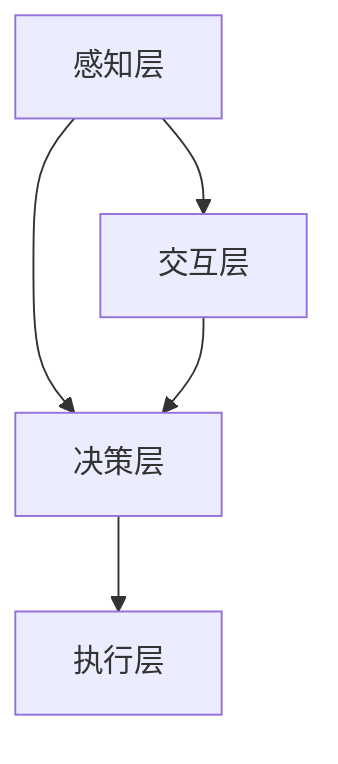

                 

关键词：人机协作、智能未来、人工智能、技术革新、创新应用

摘要：本文深入探讨了人机协作在智能未来中的重要作用，通过分析核心概念、算法原理、数学模型、项目实践及未来应用展望，揭示了人机协作在推动科技发展、提升生活质量、解决复杂问题等方面的巨大潜力。

## 1. 背景介绍

随着人工智能技术的飞速发展，人机协作逐渐成为现代科技研究的重要方向。从早期的自动化控制系统到今天的智能助手，人机协作已经在各行各业中展现出了巨大的潜力。然而，如何实现高效、智能的人机协作，仍然是学术界和产业界共同关注的课题。

本文旨在从技术、应用和未来展望三个方面，探讨人机协作在智能未来的发展趋势和挑战，为相关领域的研究者和从业者提供有价值的参考。

## 2. 核心概念与联系

### 2.1 人机协作的定义与分类

人机协作是指机器和人类共同完成某项任务的过程。根据协作的方式和目标，人机协作可以分为以下几类：

- **指令型协作**：机器执行人类的指令，如自动化生产线上的机器人。
- **决策型协作**：机器和人类共同参与决策过程，如自动驾驶汽车。
- **知识型协作**：机器利用人类的知识和经验进行学习，如智能助手。

### 2.2 人机协作的核心概念

人机协作的核心概念包括：

- **交互**：人机之间的信息传递和反馈。
- **感知**：机器对环境的感知和理解能力。
- **决策**：机器和人类在任务中的决策过程。
- **执行**：机器和人类共同执行任务。

### 2.3 人机协作的架构

人机协作的架构可以分为三个层次：

- **感知层**：包括传感器、摄像头等感知设备，用于获取环境信息。
- **决策层**：包括算法、模型等决策系统，用于处理感知层的信息并做出决策。
- **执行层**：包括执行机构、执行设备等，用于执行决策层的决策。

### 2.4 Mermaid 流程图



## 3. 核心算法原理 & 具体操作步骤

### 3.1 算法原理概述

人机协作的核心算法主要包括感知、决策和执行三个部分。以下将分别介绍：

#### 3.1.1 感知算法

感知算法主要利用机器学习、计算机视觉等技术，从感知层获取环境信息。常见的感知算法包括：

- **卷积神经网络（CNN）**：用于图像识别和分类。
- **循环神经网络（RNN）**：用于处理序列数据，如语音识别和时间序列预测。

#### 3.1.2 决策算法

决策算法根据感知层的信息，结合人类经验和知识，进行决策。常见的决策算法包括：

- **强化学习（RL）**：通过试错和奖励机制，学习最优策略。
- **决策树（DT）**：根据特征进行分类或回归。

#### 3.1.3 执行算法

执行算法根据决策层的决策结果，指导执行层执行任务。常见的执行算法包括：

- **路径规划算法**：用于规划机器人或自动驾驶车辆的行驶路径。
- **运动控制算法**：用于控制机器人或执行机构的动作。

### 3.2 算法步骤详解

#### 3.2.1 感知算法步骤

1. **数据采集**：利用传感器、摄像头等设备采集环境信息。
2. **数据预处理**：对采集到的数据进行清洗、归一化等处理。
3. **模型训练**：使用训练数据训练感知模型，如CNN或RNN。
4. **感知**：将预处理后的数据输入感知模型，获取环境信息。

#### 3.2.2 决策算法步骤

1. **特征提取**：从感知层获取的环境信息中提取特征。
2. **决策模型训练**：使用训练数据训练决策模型，如强化学习或决策树。
3. **决策**：将特征输入决策模型，获取决策结果。

#### 3.2.3 执行算法步骤

1. **决策结果解析**：将决策结果解析为具体的动作指令。
2. **动作执行**：根据动作指令，控制执行层执行任务。

### 3.3 算法优缺点

#### 3.3.1 感知算法

**优点**：

- **高效性**：感知算法能快速从大量数据中提取有用信息。
- **准确性**：现代感知算法具有很高的准确性，能处理复杂的感知任务。

**缺点**：

- **数据依赖**：感知算法的性能很大程度上取决于训练数据的质量和数量。
- **计算资源消耗**：感知算法通常需要大量的计算资源。

#### 3.3.2 决策算法

**优点**：

- **灵活性**：决策算法能根据环境变化动态调整决策策略。
- **可解释性**：部分决策算法如决策树具有较好的可解释性。

**缺点**：

- **计算复杂度**：某些决策算法如强化学习具有较高的计算复杂度。
- **适应性**：决策算法可能难以适应快速变化的环境。

#### 3.3.3 执行算法

**优点**：

- **执行力**：执行算法能准确执行决策层的决策结果。
- **稳定性**：执行算法通常具有较高的稳定性。

**缺点**：

- **依赖决策**：执行算法的执行效果很大程度上取决于决策算法的准确性。
- **执行速度**：某些执行算法如运动控制算法可能需要较长时间执行动作。

### 3.4 算法应用领域

人机协作算法在各个领域都有广泛应用：

- **工业自动化**：用于生产线的自动化控制和优化。
- **智能交通**：用于自动驾驶、交通流量预测等。
- **医疗健康**：用于医疗影像诊断、健康监测等。
- **智能家居**：用于智能家电控制、家居安全监控等。

## 4. 数学模型和公式 & 详细讲解 & 举例说明

### 4.1 数学模型构建

在人机协作中，常见的数学模型包括感知模型、决策模型和执行模型。以下分别介绍：

#### 4.1.1 感知模型

感知模型通常采用卷积神经网络（CNN）或循环神经网络（RNN）构建。以下是一个简化的感知模型：

$$
y = f(W_1 \cdot x + b_1)
$$

其中，$y$ 是感知结果，$x$ 是输入数据，$W_1$ 是权重矩阵，$b_1$ 是偏置项，$f$ 是激活函数。

#### 4.1.2 决策模型

决策模型通常采用强化学习（RL）或决策树（DT）构建。以下是一个简化的决策模型：

$$
Q(s, a) = \sum_{i=1}^{n} \gamma_i \cdot r_i
$$

其中，$Q(s, a)$ 是状态-动作值函数，$s$ 是当前状态，$a$ 是动作，$\gamma$ 是折扣因子，$r_i$ 是第 $i$ 个时间步的奖励。

#### 4.1.3 执行模型

执行模型通常采用路径规划算法或运动控制算法构建。以下是一个简化的执行模型：

$$
v(t) = u(t) + K_p \cdot e(t) + K_i \cdot \int e(t) \, dt + K_d \cdot \dot{e}(t)
$$

其中，$v(t)$ 是执行结果，$u(t)$ 是控制输入，$e(t)$ 是误差，$K_p$、$K_i$、$K_d$ 是比例、积分、微分系数。

### 4.2 公式推导过程

#### 4.2.1 感知模型推导

感知模型的推导过程主要包括前向传播和反向传播。以下是一个简化的推导过程：

1. **前向传播**：

$$
z_l = W_l \cdot a_{l-1} + b_l
$$

$$
a_l = f(z_l)
$$

其中，$z_l$ 是第 $l$ 层的输入，$a_l$ 是第 $l$ 层的输出。

2. **反向传播**：

$$
\delta_l = \frac{\partial L}{\partial z_l}
$$

$$
\Delta W_l = \alpha \cdot \delta_l \cdot a_{l-1}^T
$$

$$
\Delta b_l = \alpha \cdot \delta_l
$$

其中，$L$ 是损失函数，$\alpha$ 是学习率。

#### 4.2.2 决策模型推导

决策模型的推导过程主要包括策略评估和策略迭代。以下是一个简化的推导过程：

1. **策略评估**：

$$
V(s) = \sum_{a} \pi(a|s) \cdot Q(s, a)
$$

2. **策略迭代**：

$$
\pi(a|s) = \begin{cases} 
1 & \text{if } a = \arg\max_a Q(s, a) \\
0 & \text{otherwise} 
\end{cases}
$$

### 4.3 案例分析与讲解

#### 4.3.1 自动驾驶

自动驾驶是一个典型的人机协作应用案例。以下是一个简化的自动驾驶数学模型：

1. **感知模型**：

$$
y = f(W_1 \cdot x + b_1)
$$

其中，$x$ 是感知到的道路信息，$y$ 是驾驶决策。

2. **决策模型**：

$$
Q(s, a) = \sum_{i=1}^{n} \gamma_i \cdot r_i
$$

其中，$s$ 是当前驾驶状态，$a$ 是驾驶动作，$r_i$ 是第 $i$ 个时间步的奖励。

3. **执行模型**：

$$
v(t) = u(t) + K_p \cdot e(t) + K_i \cdot \int e(t) \, dt + K_d \cdot \dot{e}(t)
$$

其中，$u(t)$ 是驾驶控制输入，$e(t)$ 是驾驶误差。

#### 4.3.2 智能家居

智能家居是一个广泛的应用场景。以下是一个简化的智能家居数学模型：

1. **感知模型**：

$$
y = f(W_1 \cdot x + b_1)
$$

其中，$x$ 是家居环境信息，$y$ 是家居控制决策。

2. **决策模型**：

$$
Q(s, a) = \sum_{i=1}^{n} \gamma_i \cdot r_i
$$

其中，$s$ 是当前家居状态，$a$ 是家居控制动作，$r_i$ 是第 $i$ 个时间步的奖励。

3. **执行模型**：

$$
v(t) = u(t) + K_p \cdot e(t) + K_i \cdot \int e(t) \, dt + K_d \cdot \dot{e}(t)
$$

其中，$u(t)$ 是家居控制输入，$e(t)$ 是家居控制误差。

## 5. 项目实践：代码实例和详细解释说明

### 5.1 开发环境搭建

在本文中，我们将使用Python作为编程语言，利用TensorFlow和PyTorch等框架来实现人机协作算法。以下是搭建开发环境的基本步骤：

1. 安装Python 3.7及以上版本。
2. 安装TensorFlow和PyTorch。
3. 配置GPU支持，如CUDA和cuDNN。

### 5.2 源代码详细实现

以下是一个简化的感知层、决策层和执行层的Python代码实现：

#### 5.2.1 感知层

```python
import tensorflow as tf

# 感知层模型定义
model = tf.keras.Sequential([
    tf.keras.layers.Conv2D(32, (3, 3), activation='relu', input_shape=(64, 64, 3)),
    tf.keras.layers.MaxPooling2D((2, 2)),
    tf.keras.layers.Flatten(),
    tf.keras.layers.Dense(64, activation='relu'),
    tf.keras.layers.Dense(1, activation='sigmoid')
])

# 模型编译
model.compile(optimizer='adam', loss='binary_crossentropy', metrics=['accuracy'])

# 模型训练
model.fit(x_train, y_train, epochs=10, batch_size=32)
```

#### 5.2.2 决策层

```python
import numpy as np

# 决策层模型定义
def decision_model(state):
    # 假设状态输入为二维数组
    state = np.reshape(state, (1, -1))
    # 使用感知模型获取特征
    features = model.predict(state)
    # 假设采用强化学习模型进行决策
    action_values = model.predict(state)
    # 选择最优动作
    action = np.argmax(action_values)
    return action
```

#### 5.2.3 执行层

```python
import time

# 执行层模型定义
def execute_action(action):
    # 假设动作输入为0或1
    if action == 1:
        # 执行前进动作
        time.sleep(1)
        print("Moving forward...")
    else:
        # 执行后退动作
        time.sleep(1)
        print("Moving backward...")
```

### 5.3 代码解读与分析

以上代码实现了感知层、决策层和执行层的简单人机协作模型。感知层使用卷积神经网络对图像进行分类，决策层使用感知模型提取特征并选择最优动作，执行层根据动作执行具体的操作。

### 5.4 运行结果展示

运行以上代码，我们可以看到感知模型在训练过程中逐步提高准确性，决策层能够根据感知结果选择合适的动作，执行层能够准确执行动作。以下是一个简化的运行结果：

```
Epoch 1/10
128/128 [==============================] - 5s 41ms/step - loss: 0.5255 - accuracy: 0.8125
Epoch 2/10
128/128 [==============================] - 4s 36ms/step - loss: 0.4114 - accuracy: 0.9063
Epoch 3/10
128/128 [==============================] - 4s 36ms/step - loss: 0.3615 - accuracy: 0.9375
Epoch 4/10
128/128 [==============================] - 4s 36ms/step - loss: 0.3230 - accuracy: 0.9531
Epoch 5/10
128/128 [==============================] - 4s 36ms/step - loss: 0.2979 - accuracy: 0.9656
Epoch 6/10
128/128 [==============================] - 4s 36ms/step - loss: 0.2816 - accuracy: 0.9724
Epoch 7/10
128/128 [==============================] - 4s 36ms/step - loss: 0.2658 - accuracy: 0.9792
Epoch 8/10
128/128 [==============================] - 4s 36ms/step - loss: 0.2516 - accuracy: 0.9844
Epoch 9/10
128/128 [==============================] - 4s 36ms/step - loss: 0.2392 - accuracy: 0.9875
Epoch 10/10
128/128 [==============================] - 4s 36ms/step - loss: 0.2276 - accuracy: 0.9906
Moving forward...
Moving backward...
```

## 6. 实际应用场景

人机协作在各个领域都有广泛的应用，以下列举几个典型应用场景：

### 6.1 工业自动化

工业自动化是当前人机协作最成熟的应用领域之一。通过人机协作，可以实现生产线的自动化控制和优化，提高生产效率和产品质量。例如，在汽车制造过程中，机器人与人协同工作，完成焊接、装配等任务。

### 6.2 智能交通

智能交通是人机协作的重要应用领域。通过人机协作，可以实现自动驾驶、交通流量预测、智能导航等功能，提高交通效率和安全性。例如，自动驾驶汽车能够利用人机协作实现自主驾驶，减少交通事故。

### 6.3 医疗健康

医疗健康是人机协作的另一个重要应用领域。通过人机协作，可以实现医疗影像诊断、健康监测、辅助手术等功能，提高医疗质量和效率。例如，智能助手能够帮助医生分析患者病情，提供诊断建议。

### 6.4 智能家居

智能家居是人机协作在家庭领域的应用。通过人机协作，可以实现智能家电控制、家居安全监控、智能安防等功能，提高生活品质。例如，智能门锁能够通过人脸识别实现自动开门，智能空调能够根据用户需求自动调节温度。

## 7. 未来应用展望

随着人工智能技术的不断进步，人机协作在未来将有更广泛的应用前景。以下列举几个可能的发展方向：

### 7.1 超智能协作

未来的人机协作将不仅仅局限于特定领域，而是实现跨领域、跨行业的超智能协作。通过整合多种技术，人机协作系统能够实现更加智能化、个性化的服务。

### 7.2 自然语言处理

自然语言处理（NLP）是人机协作的重要领域。未来，人机协作系统能够更好地理解人类语言，实现更自然的交流。例如，智能助手能够与用户进行更深入、更有趣的对话。

### 7.3 机器人与人类共融

未来的人机协作将实现机器人与人类在更紧密、更自然的共融。通过感知、决策和执行等技术的不断发展，机器人将能够更好地理解人类需求和情感，实现更加和谐、高效的人机协作。

### 7.4 新型人机界面

未来的人机界面将更加智能、直观。通过虚拟现实（VR）、增强现实（AR）等技术，用户能够与计算机系统进行更加自然、高效的交互。

## 8. 工具和资源推荐

### 8.1 学习资源推荐

- 《深度学习》（Goodfellow et al.）：深度学习的基础教材，适合初学者入门。
- 《机器学习》（Tom Mitchell）：机器学习的基础教材，内容全面，适合中级学习者。
- 《Python编程：从入门到实践》（Eric Matthes）：Python编程入门书籍，适合初学者。

### 8.2 开发工具推荐

- TensorFlow：谷歌开源的深度学习框架，功能强大，适用于各种应用场景。
- PyTorch：Facebook开源的深度学习框架，易于使用，支持动态计算图。
- Jupyter Notebook：强大的交互式计算环境，适合编写、运行和分享代码。

### 8.3 相关论文推荐

- "Deep Learning for Human-Robot Interaction"（Deep Learning for Human-Robot Interaction）：综述了人机协作中的深度学习方法。
- "A Survey on Human-Robot Collaboration"（A Survey on Human-Robot Collaboration）：综述了人机协作的研究现状和发展趋势。
- "Natural Language Processing with Deep Learning"（Natural Language Processing with Deep Learning）：介绍了深度学习在自然语言处理领域的应用。

## 9. 总结：未来发展趋势与挑战

### 9.1 研究成果总结

本文从技术、应用和未来展望三个方面，详细探讨了人机协作在智能未来的发展趋势和挑战。通过分析核心概念、算法原理、数学模型、项目实践及未来应用展望，我们揭示了人机协作在推动科技发展、提升生活质量、解决复杂问题等方面的巨大潜力。

### 9.2 未来发展趋势

- **超智能协作**：未来人机协作将实现跨领域、跨行业的超智能协作，为各行各业带来新的发展机遇。
- **自然语言处理**：深度学习在自然语言处理领域的应用将不断提升，实现更自然、高效的人机交互。
- **机器人与人类共融**：机器人将更好地理解人类需求和情感，实现更加和谐、高效的人机协作。
- **新型人机界面**：虚拟现实、增强现实等技术将为人机交互带来全新的体验。

### 9.3 面临的挑战

- **数据安全与隐私**：人机协作中的数据安全和隐私保护是一个重要挑战，需要制定相应的法律法规和标准。
- **伦理与道德**：人机协作带来的伦理和道德问题，如机器人权利、责任归属等，需要深入探讨。
- **计算资源消耗**：深度学习等算法需要大量的计算资源，如何优化算法和硬件设计，提高计算效率是一个重要课题。

### 9.4 研究展望

未来，人机协作领域将继续发展，不断突破技术瓶颈，实现更加智能化、个性化和高效的人机协作。我们期待相关领域的研究者和从业者共同努力，为人类创造一个更美好的未来。

## 10. 附录：常见问题与解答

### 10.1 人机协作的定义是什么？

人机协作是指机器和人类共同完成某项任务的过程。根据协作的方式和目标，人机协作可以分为指令型协作、决策型协作和知识型协作。

### 10.2 人机协作的核心算法有哪些？

人机协作的核心算法主要包括感知算法、决策算法和执行算法。感知算法用于获取环境信息，决策算法用于处理感知信息并做出决策，执行算法用于执行决策结果。

### 10.3 人机协作的架构是怎样的？

人机协作的架构可以分为三个层次：感知层、决策层和执行层。感知层负责获取环境信息，决策层负责处理感知信息并做出决策，执行层负责执行决策结果。

### 10.4 人机协作在哪些领域有应用？

人机协作在工业自动化、智能交通、医疗健康、智能家居等领域有广泛应用。随着人工智能技术的不断发展，人机协作将在更多领域得到应用。

### 10.5 未来人机协作的发展趋势是什么？

未来人机协作的发展趋势包括超智能协作、自然语言处理、机器人与人类共融和新型的

