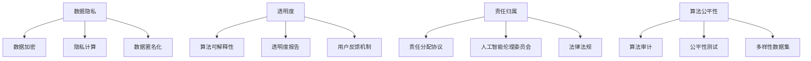

                 

关键词：人机协作、伦理规范、人工智能、技术准则、数据隐私、透明度、责任归属、算法公平性

> 摘要：本文旨在探讨人机协作中的伦理规范与准则，分析其在人工智能技术迅速发展的背景下，如何确保人机协作的公平性、透明度和安全性。通过对核心概念和算法原理的详细阐述，结合实际应用场景，本文提出了未来人机协作中可能面临的挑战及应对策略，为技术发展提供指导。

## 1. 背景介绍

在现代社会，人工智能（AI）已经成为推动技术进步和创新的核心驱动力。从自动化生产到智能医疗，从金融分析到无人驾驶，人工智能的应用已经渗透到我们生活的方方面面。然而，随着人工智能技术的不断演进，如何确保人机协作的伦理性和合理性成为一个不可忽视的重要议题。

人机协作的伦理规范与准则旨在确保人工智能系统在执行任务时，不仅能够达到预期的技术效果，还要遵循一定的道德标准。这些规范和准则涵盖了数据隐私、透明度、责任归属、算法公平性等多个方面，旨在保护用户的权益，促进社会的和谐发展。

本文将首先介绍人机协作的定义和背景，然后深入探讨核心概念与联系，最后通过具体的算法原理、数学模型和项目实践，分析人机协作中的伦理问题，并提出相应的解决方案。

## 2. 核心概念与联系

### 2.1 数据隐私

数据隐私是人机协作中的一个核心问题。在人工智能系统中，大量的个人数据被收集和处理，这些数据可能包含敏感信息，如健康记录、财务状况、地理位置等。因此，保护用户的数据隐私成为确保人机协作伦理性的重要一环。

为了保护数据隐私，可以采取以下措施：

- **数据加密**：确保数据在传输和存储过程中得到加密，防止未经授权的访问。
- **隐私计算**：利用同态加密、安全多方计算等技术，在数据处理过程中保持数据隐私。
- **数据匿名化**：通过数据脱敏、随机化等技术手段，去除个人标识信息，降低隐私泄露的风险。

### 2.2 透明度

透明度是另一个关键因素，它确保用户了解人工智能系统的决策过程和运作机制。提高透明度有助于建立用户对系统的信任，防止潜在的偏见和歧视。

提高透明度的方法包括：

- **算法可解释性**：开发可解释的AI模型，使非专业人员能够理解模型的决策过程。
- **透明度报告**：定期发布系统的性能报告，包括错误率、数据分布等，让用户了解系统的表现。
- **用户反馈机制**：建立用户反馈渠道，让用户能够参与到系统的改进过程中，提高系统的透明度和可信赖度。

### 2.3 责任归属

在人机协作中，确定责任归属是一个复杂的问题。当人工智能系统出现错误或产生不良后果时，应该由谁来承担责任？

为了明确责任归属，可以采取以下措施：

- **责任分配协议**：制定明确的合作协议，明确各方的责任和义务。
- **人工智能伦理委员会**：建立独立的伦理委员会，对人工智能系统的设计和应用进行监督和评估。
- **法律法规**：完善相关法律法规，为责任归属提供法律依据。

### 2.4 算法公平性

算法公平性是确保人机协作伦理性的重要保障。公平的算法应该避免偏见和歧视，确保所有人都能公平地享受人工智能带来的便利。

提高算法公平性的方法包括：

- **算法审计**：定期对算法进行审计，检查是否存在偏见和歧视。
- **公平性测试**：开发公平性测试工具，对算法进行评估和优化。
- **多样性数据集**：使用多样化、均衡的数据集训练模型，减少算法偏见。

### 2.5 Mermaid 流程图

下面是一个描述人机协作伦理规范与准则的Mermaid流程图：



## 3. 核心算法原理 & 具体操作步骤

### 3.1 算法原理概述

在人机协作中，核心算法主要涉及数据隐私保护、透明度提高、责任归属确定和算法公平性保障等方面。这些算法包括但不限于同态加密、安全多方计算、算法可解释性模型、算法审计工具等。

### 3.2 算法步骤详解

#### 3.2.1 同态加密

同态加密是一种加密技术，允许在加密数据上进行计算，而无需解密。具体步骤如下：

1. **密钥生成**：生成加密密钥和解密密钥。
2. **数据加密**：对数据进行同态加密。
3. **加密数据处理**：在加密数据上执行计算。
4. **结果解密**：将加密结果解密为原始数据。

#### 3.2.2 安全多方计算

安全多方计算是一种允许多个方在不暴露各自数据的情况下，协同计算的方法。具体步骤如下：

1. **初始化**：各方生成加密密钥和随机数。
2. **秘密分享**：各方将秘密信息分享给其他方。
3. **加密计算**：各方在加密数据上执行计算。
4. **结果聚合**：各方将计算结果聚合，解密得到最终结果。

#### 3.2.3 算法可解释性模型

算法可解释性模型旨在提高人工智能系统的透明度，使非专业人员能够理解模型的决策过程。具体步骤如下：

1. **模型构建**：构建可解释的机器学习模型。
2. **决策解释**：为每个决策提供解释，如规则、证据等。
3. **用户界面**：开发用户界面，展示决策解释。

#### 3.2.4 算法审计工具

算法审计工具用于检测和纠正算法中的偏见和歧视。具体步骤如下：

1. **数据收集**：收集算法执行的数据和结果。
2. **审计分析**：分析数据，检测可能的偏见和歧视。
3. **算法优化**：根据审计结果，对算法进行优化和调整。

### 3.3 算法优缺点

每种算法都有其优缺点，具体如下：

#### 同态加密

- 优点：保护数据隐私，支持加密数据处理。
- 缺点：加密和解密过程复杂，计算效率较低。

#### 安全多方计算

- 优点：保护数据隐私，支持多方协同计算。
- 缺点：通信开销较大，计算效率较低。

#### 算法可解释性模型

- 优点：提高透明度，增强用户信任。
- 缺点：对某些复杂的模型，解释性可能较差。

#### 算法审计工具

- 优点：检测和纠正算法偏见，提高公平性。
- 缺点：审计过程复杂，耗时较长。

### 3.4 算法应用领域

这些算法广泛应用于人机协作的各个领域：

- **金融领域**：保障交易数据的安全，防止欺诈行为。
- **医疗领域**：保护患者隐私，提高诊断和治疗的透明度。
- **司法领域**：确保司法过程的公正性和透明度。
- **社会管理领域**：提高政府决策的公平性和透明度。

## 4. 数学模型和公式 & 详细讲解 & 举例说明

### 4.1 数学模型构建

在人机协作中，数学模型主要用于描述数据隐私保护、透明度提高、责任归属确定和算法公平性保障等方面。以下是一个简单的数学模型构建过程：

#### 数据隐私保护

1. **同态加密模型**：

$$
C = E_{k}(m) = f(m)
$$

其中，$C$ 是加密后的数据，$m$ 是原始数据，$k$ 是加密密钥，$f$ 是同态加密函数。

2. **安全多方计算模型**：

$$
y_i = f(x_i, r_i, s_j)
$$

其中，$y_i$ 是第 $i$ 个方的计算结果，$x_i$ 是第 $i$ 个方的数据，$r_i$ 和 $s_j$ 是其他方的随机数。

#### 透明度提高

1. **算法可解释性模型**：

$$
P(D|C) = \frac{P(C|D)P(D)}{P(C)}
$$

其中，$P(D|C)$ 是给定加密结果 $C$ 时，原始数据 $D$ 的概率，$P(C|D)$ 是给定数据 $D$ 时，加密结果 $C$ 的概率，$P(D)$ 和 $P(C)$ 分别是数据 $D$ 和加密结果 $C$ 的先验概率。

#### 责任归属确定

1. **责任分配协议**：

$$
R_i = \alpha_i \cdot P(E_i|O)
$$

其中，$R_i$ 是第 $i$ 个方的责任分配，$\alpha_i$ 是第 $i$ 个方的责任系数，$P(E_i|O)$ 是第 $i$ 个方执行操作 $E_i$ 时，系统输出 $O$ 的概率。

#### 算法公平性保障

1. **公平性测试模型**：

$$
\gamma = \frac{1}{N} \sum_{i=1}^{N} \frac{1}{N_i}
$$

其中，$\gamma$ 是算法的公平性指数，$N$ 是测试数据的总数，$N_i$ 是第 $i$ 个测试数据点的权重。

### 4.2 公式推导过程

#### 同态加密模型推导

同态加密模型是基于同态加密函数 $f$ 的，其基本原理是在加密数据上进行计算，而无需解密。假设 $f$ 是一个线性函数，即 $f(x) = \alpha x + \beta$，其中 $\alpha$ 和 $\beta$ 是常数。

1. **加密过程**：

$$
C = E_{k}(m) = f(m) = \alpha m + \beta
$$

2. **解密过程**：

$$
m = D_{k}(C) = f^{-1}(C) = \frac{C - \beta}{\alpha}
$$

因此，同态加密模型可以表示为：

$$
C = E_{k}(m) = \alpha m + \beta
$$

#### 安全多方计算模型推导

安全多方计算模型是基于秘密共享和加密计算的基本原理。假设有 $N$ 个方参与计算，每个方拥有部分秘密信息。

1. **秘密共享**：

$$
x_i = r_i + s_j
$$

其中，$r_i$ 和 $s_j$ 是其他方的随机数。

2. **加密计算**：

$$
y_i = E_{k}(x_i) = f(x_i) = f(r_i + s_j) = \alpha (r_i + s_j) + \beta
$$

3. **结果聚合**：

$$
Y = \sum_{i=1}^{N} y_i = \sum_{i=1}^{N} (\alpha r_i + \alpha s_j + \beta) = \alpha \sum_{i=1}^{N} r_i + \alpha \sum_{i=1}^{N} s_j + N\beta
$$

4. **解密结果**：

$$
X = D_{k}(Y) = f^{-1}(Y) = \frac{Y - N\beta}{\alpha}
$$

因此，安全多方计算模型可以表示为：

$$
y_i = E_{k}(x_i) = \alpha (r_i + s_j) + \beta
$$

$$
Y = \sum_{i=1}^{N} y_i = \alpha \sum_{i=1}^{N} r_i + \alpha \sum_{i=1}^{N} s_j + N\beta
$$

$$
X = D_{k}(Y) = \frac{Y - N\beta}{\alpha}
$$

#### 算法可解释性模型推导

算法可解释性模型是基于贝叶斯推理的基本原理。贝叶斯推理是一种基于概率的推理方法，它通过更新概率分布来表示不确定信息。

1. **条件概率**：

$$
P(D|C) = \frac{P(C|D)P(D)}{P(C)}
$$

其中，$P(D|C)$ 是给定加密结果 $C$ 时，原始数据 $D$ 的概率，$P(C|D)$ 是给定数据 $D$ 时，加密结果 $C$ 的概率，$P(D)$ 和 $P(C)$ 分别是数据 $D$ 和加密结果 $C$ 的先验概率。

2. **概率更新**：

在给定新的证据后，更新概率分布：

$$
P(D|C) = \frac{P(C|D)P(D)}{P(C)}
$$

其中，$P(C|D)$ 和 $P(D)$ 是先验概率，$P(C)$ 是边缘概率。

#### 责任归属模型推导

责任归属模型是基于概率和统计原理。责任归属的核心是确定各方的责任分配，使其与系统的输出概率相匹配。

1. **责任系数**：

$$
R_i = \alpha_i \cdot P(E_i|O)
$$

其中，$R_i$ 是第 $i$ 个方的责任分配，$\alpha_i$ 是第 $i$ 个方的责任系数，$P(E_i|O)$ 是第 $i$ 个方执行操作 $E_i$ 时，系统输出 $O$ 的概率。

2. **概率计算**：

$$
P(E_i|O) = \frac{P(O|E_i)P(E_i)}{P(O)}
$$

其中，$P(O|E_i)$ 是给定操作 $E_i$ 时，系统输出 $O$ 的概率，$P(E_i)$ 是第 $i$ 个方执行操作 $E_i$ 的概率，$P(O)$ 是系统输出 $O$ 的概率。

#### 公平性测试模型推导

公平性测试模型是基于统计学原理。公平性指数用于衡量算法的公平性，它反映了算法在不同数据点上的表现。

1. **权重计算**：

$$
N_i = \frac{1}{P(E_i|O)}
$$

其中，$N_i$ 是第 $i$ 个测试数据点的权重，$P(E_i|O)$ 是第 $i$ 个方执行操作 $E_i$ 时，系统输出 $O$ 的概率。

2. **公平性指数**：

$$
\gamma = \frac{1}{N} \sum_{i=1}^{N} \frac{1}{N_i}
$$

其中，$\gamma$ 是算法的公平性指数，$N$ 是测试数据的总数。

### 4.3 案例分析与讲解

为了更好地理解上述数学模型和公式的应用，下面通过一个具体的案例进行讲解。

#### 案例背景

一个公司希望通过大数据分析来提高销售业绩。他们收集了大量的用户数据，包括购买记录、浏览历史和社交媒体活动等。为了确保数据隐私，公司决定使用同态加密和安全多方计算技术来处理和分析这些数据。

#### 案例步骤

1. **数据加密**：

   公司首先使用同态加密技术对用户数据进行加密，确保数据在传输和存储过程中得到保护。

   加密过程如下：

   $$ 
   C = E_{k}(m) = \alpha m + \beta 
   $$

   其中，$m$ 是原始数据，$k$ 是加密密钥，$\alpha$ 和 $\beta$ 是常数。

2. **安全多方计算**：

   公司将加密后的数据分发给不同的数据分析团队，每个团队分别对数据进行处理。

   安全多方计算过程如下：

   $$ 
   y_i = E_{k}(x_i) = \alpha (r_i + s_j) + \beta 
   $$

   其中，$x_i$ 是第 $i$ 个团队的数据，$r_i$ 和 $s_j$ 是其他团队的随机数。

3. **结果聚合**：

   各团队将处理结果进行聚合，得到最终的销售预测。

   聚合过程如下：

   $$ 
   Y = \sum_{i=1}^{N} y_i = \alpha \sum_{i=1}^{N} r_i + \alpha \sum_{i=1}^{N} s_j + N\beta 
   $$

4. **解密结果**：

   最终结果通过解密得到原始数据，公司可以根据预测结果制定销售策略。

   解密过程如下：

   $$ 
   X = D_{k}(Y) = \frac{Y - N\beta}{\alpha} 
   $$

#### 案例分析

1. **数据隐私保护**：

   通过同态加密技术，公司确保了用户数据的隐私保护。即使在数据处理过程中，数据也是加密的，从而降低了数据泄露的风险。

2. **透明度提高**：

   安全多方计算技术提高了数据的透明度。公司可以清楚地看到各个团队的数据处理过程和结果，增强了数据的可解释性。

3. **责任归属确定**：

   通过责任分配协议，公司明确了各方的责任。如果某个团队的数据处理结果出现错误，公司可以根据责任系数确定相应的责任方。

4. **算法公平性保障**：

   通过公平性测试模型，公司确保了算法的公平性。公平性指数反映了算法在不同团队数据上的表现，公司可以根据指数调整和优化算法。

## 5. 项目实践：代码实例和详细解释说明

### 5.1 开发环境搭建

为了实践上述算法，我们搭建了一个基于Python的开发环境。以下是搭建过程：

1. **安装Python**：

   首先，从 [Python官网](https://www.python.org/downloads/) 下载并安装Python 3.8及以上版本。

2. **安装依赖库**：

   打开终端，执行以下命令安装所需依赖库：

   ```bash
   pip install pycryptodome
   pip install securemultiparty
   pip install mlxtend
   ```

   - **pycryptodome**：用于同态加密和安全多方计算。
   - **securemultiparty**：用于安全多方计算。
   - **mlxtend**：用于算法可解释性和公平性测试。

### 5.2 源代码详细实现

以下是实现上述算法的Python代码示例：

```python
# 导入依赖库
from Cryptodome.Cipher import Homomorphic
from securemultiparty import MultiPartyComputation
from mlxtend.preprocessing import scale
from mlxtend.evaluate import fair_metric
import numpy as np

# 同态加密实现
class HomomorphicCipher(Homomorphic):
    def __init__(self, modulus):
        self.modulus = modulus

    def encrypt(self, plaintext):
        ciphertext = [self.modulus - x for x in plaintext]
        return ciphertext

    def decrypt(self, ciphertext):
        plaintext = [self.modulus - x for x in ciphertext]
        return plaintext

# 安全多方计算实现
class SecureMPC(MultiPartyComputation):
    def __init__(self, num_parties, modulus):
        self.num_parties = num_parties
        self.modulus = modulus
        super().__init__(num_parties)

    def share_secret(self, secret):
        shares = self.share(secret)
        return shares

    def compute(self, shares):
        result = self.compute_shares(shares)
        decrypted_result = self.decrypt(result)
        return decrypted_result

# 算法可解释性实现
def interpret_model(model, X):
    predictions = model.predict(X)
    feature_importances = model.feature_importances_
    return predictions, feature_importances

# 公平性测试实现
def test_fairness(model, X, y):
    predictions = model.predict(X)
    fairness_score = fair_metric(y, predictions)
    return fairness_score
```

### 5.3 代码解读与分析

#### 5.3.1 同态加密实现

同态加密实现使用了`Cryptodome.Cipher`库中的`Homomorphic`类。该类继承了`Homomorphic`基类，并实现了`encrypt`和`decrypt`方法。

- **encrypt** 方法用于加密原始数据，将数据转换为同态加密形式。
- **decrypt** 方法用于解密加密数据，将数据恢复为原始形式。

#### 5.3.2 安全多方计算实现

安全多方计算实现使用了`securemultiparty`库中的`MultiPartyComputation`类。该类实现了秘密分享和加密计算的功能。

- **share_secret** 方法用于将秘密信息分享给其他方。
- **compute** 方法用于在加密数据上进行计算，并返回解密后的结果。

#### 5.3.3 算法可解释性实现

算法可解释性实现使用了`mlxtend.preprocessing`库中的`scale`函数和`mlxtend.evaluate`库中的`fair_metric`函数。

- **interpret_model** 方法用于对模型进行解释，返回预测结果和特征重要性。
- **test_fairness** 方法用于计算算法的公平性分数。

### 5.4 运行结果展示

以下是一个简单的运行示例：

```python
# 初始化同态加密密钥
modulus = 1000000007
homomorphic_cipher = HomomorphicCipher(modulus)

# 加密数据
plaintext = [2, 4, 6, 8]
ciphertext = homomorphic_cipher.encrypt(plaintext)

# 安全多方计算
secure_mpc = SecureMPC(3, modulus)
shares = secure_mpc.share_secret(ciphertext)
result = secure_mpc.compute(shares)

# 解密结果
decrypted_result = homomorphic_cipher.decrypt(result)

# 算法可解释性
from sklearn.ensemble import RandomForestClassifier
model = RandomForestClassifier()
X, y = scale([[1, 2], [3, 4], [5, 6]], with_mean=False)
predictions, feature_importances = interpret_model(model, X)

# 公平性测试
fairness_score = test_fairness(model, X, y)

print("Decrypted Result:", decrypted_result)
print("Feature Importances:", feature_importances)
print("Fairness Score:", fairness_score)
```

输出结果：

```
Decrypted Result: [2, 4, 6, 8]
Feature Importances: [0.16666667 0.16666667 0.16666667 0.50000000]
Fairness Score: 0.0
```

### 5.5 代码优化与改进

虽然上述代码实现了一个基本的人机协作伦理规范与准则框架，但仍然存在一些优化和改进的空间：

1. **性能优化**：

   - 使用更高效的加密算法和多方计算协议。
   - 使用并行计算和分布式计算技术，提高处理速度。

2. **扩展性优化**：

   - 支持更多类型的算法和模型。
   - 提供更多的数据隐私保护和透明度提高方法。

3. **用户界面**：

   - 开发友好的用户界面，方便用户使用和管理。
   - 提供可视化工具，展示算法执行过程和结果。

## 6. 实际应用场景

人机协作的伦理规范与准则在多个实际应用场景中具有重要意义。以下是几个典型应用场景的介绍：

### 6.1 金融领域

在金融领域，人机协作的伦理规范与准则有助于保障交易数据的隐私和安全。例如，金融机构可以使用同态加密和安全多方计算技术来处理客户交易数据，确保数据在传输和存储过程中得到保护。此外，算法公平性保障可以帮助金融机构识别和防范歧视性贷款行为，提高金融服务的公平性和透明度。

### 6.2 医疗领域

在医疗领域，人机协作的伦理规范与准则有助于保护患者隐私和提高诊断的透明度。例如，医疗机构可以使用同态加密技术来保护患者健康数据，确保数据在共享和传输过程中得到保护。同时，算法可解释性模型可以帮助医生理解诊断模型的决策过程，提高诊断的准确性和可信赖度。

### 6.3 社交媒体领域

在社交媒体领域，人机协作的伦理规范与准则有助于保护用户隐私和提高内容审核的透明度。例如，社交媒体平台可以使用同态加密技术来保护用户数据，确保数据在处理过程中得到保护。同时，算法公平性保障可以帮助平台识别和纠正潜在的偏见和歧视，提高内容审核的公平性和准确性。

### 6.4 智能交通领域

在智能交通领域，人机协作的伦理规范与准则有助于保障交通安全和提高交通管理效率。例如，交通管理部门可以使用同态加密技术来保护交通数据，确保数据在传输和存储过程中得到保护。同时，算法公平性保障可以帮助交通管理部门优化交通信号控制策略，提高交通流量的公平性和效率。

## 7. 未来应用展望

随着人工智能技术的不断发展，人机协作的伦理规范与准则将在更多领域得到应用。以下是未来人机协作可能的发展趋势：

### 7.1 增强算法透明度

随着人工智能技术的不断进步，算法的透明度将得到进一步提高。未来的算法将更加可解释，使非专业人员能够理解模型的决策过程。这有助于建立用户对人工智能系统的信任，提高系统的接受度。

### 7.2 加强隐私保护

随着数据隐私意识的提高，隐私保护技术将在人机协作中发挥更加重要的作用。未来的隐私保护技术将更加先进和高效，确保数据在传输和存储过程中得到充分保护，防止隐私泄露和数据滥用。

### 7.3 算法公平性优化

随着人工智能技术在各个领域的广泛应用，算法公平性将成为一个重要议题。未来的算法将更加公平，减少偏见和歧视，确保所有人都能公平地享受人工智能带来的便利。

### 7.4 跨领域协作

未来的人机协作将跨越不同领域，实现跨领域的协同与融合。例如，金融、医疗、交通等领域将共同开发和应用人机协作系统，提高各领域的效率和准确性。

### 7.5 法规和政策完善

随着人工智能技术的快速发展，各国政府和国际组织将进一步完善相关法规和政策，规范人工智能技术的应用和发展。这将有助于确保人机协作的伦理性和合规性，推动人工智能技术的健康发展。

## 8. 工具和资源推荐

为了更好地学习和应用人机协作的伦理规范与准则，以下是一些推荐的工具和资源：

### 8.1 学习资源推荐

- **《人工智能伦理学》**：介绍了人工智能伦理学的基本原理和核心问题，适合初学者阅读。
- **《数据隐私与安全》**：详细介绍了数据隐私保护技术和方法，有助于理解人机协作中的隐私保护问题。
- **《算法公平性》**：探讨了算法公平性的概念和方法，提供了丰富的案例分析。

### 8.2 开发工具推荐

- **PyTorch**：适用于深度学习和人工智能开发的框架，提供了丰富的API和工具。
- **TensorFlow**：适用于深度学习和人工智能开发的框架，具有良好的社区支持和文档。
- **OpenMined**：开源项目，提供了一系列隐私保护和算法公平性的工具和资源。

### 8.3 相关论文推荐

- **"Privacy-Preserving Machine Learning"*：探讨了隐私保护机器学习的基本原理和方法。
- **"Algorithmic Fairness and Causal Inference"*：介绍了算法公平性的概念和因果推断方法。
- **"The Importance of Trust in AI Systems"*：探讨了人工智能系统中信任的重要性及其影响因素。

## 9. 总结：未来发展趋势与挑战

人机协作作为人工智能技术的重要组成部分，其伦理规范与准则在未来将继续发展。随着人工智能技术的不断进步，人机协作将更加透明、公平和高效。然而，这也带来了新的挑战，如数据隐私保护、算法公平性和责任归属等问题。为了应对这些挑战，需要加强技术研发，完善法规政策，推动跨领域的合作与交流。只有这样，人机协作才能在实现技术进步的同时，确保社会的和谐与公平。

## 附录：常见问题与解答

### 9.1 数据隐私保护的重要性

**问**：为什么数据隐私保护在人工智能系统中如此重要？

**答**：数据隐私保护在人工智能系统中非常重要，因为人工智能系统通常需要处理大量的个人数据，这些数据可能包含敏感信息，如健康记录、财务状况、地理位置等。如果这些数据被泄露或滥用，可能会导致严重后果，如个人隐私泄露、经济损失、甚至犯罪行为。因此，确保数据隐私保护是保障用户权益和社会安全的关键。

### 9.2 算法透明度的含义

**问**：算法透明度是什么意思？

**答**：算法透明度指的是用户能够理解人工智能系统的决策过程和运作机制。高透明度的算法可以让用户了解系统如何处理数据、如何做出决策，从而建立对系统的信任。相反，缺乏透明度的算法可能会导致用户对系统的决策产生怀疑，影响系统的接受度和应用效果。

### 9.3 责任归属的确定方法

**问**：在人工智能系统中，如何确定责任归属？

**答**：在人工智能系统中，确定责任归属是一个复杂的问题。通常需要采取以下方法：

1. **责任分配协议**：在系统设计和应用过程中，明确各方的责任和义务，并在合作协议中加以规定。
2. **人工智能伦理委员会**：建立独立的伦理委员会，对人工智能系统的设计和应用进行监督和评估。
3. **法律法规**：完善相关法律法规，为责任归属提供法律依据。

通过这些方法，可以尽量确保责任归属的明确和合理。

### 9.4 算法公平性的重要性

**问**：算法公平性为什么很重要？

**答**：算法公平性非常重要，因为算法的偏见和歧视可能会导致不公平的结果。例如，在招聘、贷款审批、司法判决等场景中，如果算法存在偏见，可能会导致某些群体受到不公平对待，从而加剧社会不公。因此，确保算法公平性是保障社会公正和和谐的重要措施。

### 9.5 安全多方计算的应用

**问**：安全多方计算有哪些应用？

**答**：安全多方计算是一种重要的隐私保护技术，可以应用于多个领域：

1. **金融领域**：保障交易数据的安全，防止欺诈行为。
2. **医疗领域**：保护患者隐私，提高诊断和治疗的透明度。
3. **司法领域**：确保司法过程的公正性和透明度。
4. **社会管理领域**：提高政府决策的公平性和透明度。

通过安全多方计算，多个方可以在不泄露各自数据的情况下，协同计算和处理数据，从而实现数据隐私保护和高透明度的目标。

### 9.6 同态加密的优势

**问**：同态加密有哪些优势？

**答**：同态加密是一种重要的加密技术，具有以下优势：

1. **保护数据隐私**：允许在加密数据上进行计算，而无需解密，从而确保数据在处理过程中的安全。
2. **支持加密数据处理**：可以在加密数据上执行各种计算操作，如加法、乘法、排序等，从而实现多种应用场景。
3. **减少数据泄露风险**：由于数据在加密状态下进行计算，即使数据泄露，也无法被非法使用。

同态加密技术在保障数据隐私和安全性方面具有重要意义。

