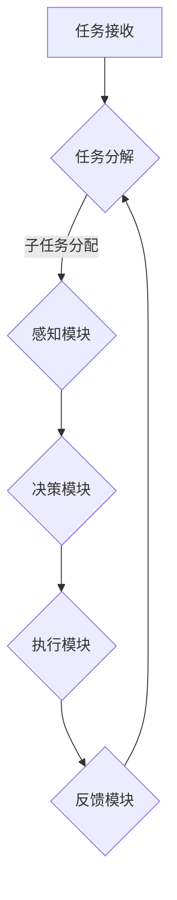

                 

关键词：人机协同、人工智能、工作效能、未来趋势、技术融合

> 摘要：随着人工智能技术的迅速发展，人机协同已经成为提升工作效率、优化工作流程的重要手段。本文将深入探讨人机协同的基本概念、核心算法、数学模型、应用实例，并展望其在未来工作中的发展趋势和挑战。

## 1. 背景介绍

在信息化和数字化时代，人工智能（AI）技术已经渗透到各行各业，显著提高了工作效率和生产力。人机协同（Human-AI Collaboration）是指人类与人工智能系统共同工作，以实现最优效果的一种新型工作模式。这种协同不仅能充分发挥人工智能的计算能力和自动化优势，还能利用人类的创造力、判断力和情感智能，实现人机双方的互补。

近年来，随着深度学习、自然语言处理、机器人技术等AI核心技术的发展，人机协同在多个领域取得了显著进展。例如，在医疗领域，人工智能辅助医生进行诊断和治疗，提高了医疗服务的质量和效率；在制造业，AI与机器人协同工作，实现了生产流程的自动化和智能化；在金融领域，人工智能算法优化投资决策，提高了金融市场的效率和透明度。

本文将围绕人机协同这一主题，深入探讨其在未来工作中的核心竞争力，分析其核心算法原理、数学模型、应用场景，并探讨其发展趋势和挑战。

## 2. 核心概念与联系

### 2.1 人机协同的基本概念

人机协同是指人类与人工智能系统通过合作，共同完成某项任务的过程。在这一过程中，人类和机器各自发挥优势，实现最优效果。人机协同的核心在于信息的共享、决策的协作和任务的分配。

### 2.2 人机协同的工作模式

人机协同的工作模式主要包括以下几种：

- **任务分解与分配**：将复杂的任务分解为多个子任务，并根据人工智能系统的能力和人类的专长进行分配。
- **信息共享与反馈**：通过数据交换和通信，实现人类与人工智能之间的信息共享和反馈，以优化决策过程。
- **决策协作与协同**：在任务执行过程中，人类和人工智能系统共同参与决策，实现协同优化。

### 2.3 人机协同的架构

人机协同系统通常包括以下几个关键模块：

- **感知模块**：收集外部环境信息，包括语音、图像、文本等。
- **决策模块**：基于感知信息，人工智能系统进行决策分析，提供行动建议。
- **执行模块**：人类或机器人根据决策建议执行具体操作。
- **反馈模块**：执行结果返回给感知模块，用于系统优化和迭代。

### 2.4 人机协同的流程

人机协同的流程主要包括以下几个步骤：

1. **任务接收**：系统接收任务请求，明确任务目标。
2. **任务分解**：将任务分解为多个子任务，确定任务分配。
3. **信息共享**：通过数据交换，实现任务信息共享。
4. **决策协同**：人类和人工智能系统共同参与决策，优化任务执行方案。
5. **执行操作**：根据决策结果，执行具体任务操作。
6. **反馈优化**：执行结果返回系统，用于任务优化和系统更新。

### 2.5 Mermaid 流程图

以下是人机协同的基本架构的 Mermaid 流程图表示：



## 3. 核心算法原理 & 具体操作步骤

### 3.1 算法原理概述

人机协同的核心算法主要包括机器学习、自然语言处理和计算机视觉等领域的技术。这些算法共同作用，实现信息感知、决策分析和任务执行。

### 3.2 算法步骤详解

1. **数据收集与预处理**：收集相关数据，包括历史任务数据、用户行为数据和环境数据。对数据进行清洗、去噪和特征提取。
2. **机器学习模型训练**：使用收集的数据训练机器学习模型，包括分类模型、回归模型和聚类模型等。
3. **自然语言处理**：利用自然语言处理技术，实现人机对话交互。包括语音识别、语义理解和语音合成等。
4. **计算机视觉**：通过计算机视觉技术，实现图像和视频的识别、分类和跟踪。
5. **决策分析**：基于训练好的模型，对感知信息进行决策分析，提供行动建议。
6. **任务执行**：根据决策建议，执行具体任务操作。
7. **反馈优化**：执行结果返回系统，用于模型优化和任务迭代。

### 3.3 算法优缺点

**优点**：

- 提高工作效率：通过自动化和智能化，减少人工操作，提高工作效率。
- 精准决策：利用机器学习模型，实现精准的决策分析，降低错误率。
- 人机互补：充分发挥人类和人工智能的优势，实现人机互补，提高整体效能。

**缺点**：

- 数据依赖性：算法性能依赖于数据质量和数量，数据不足可能导致算法失效。
- 模型泛化能力：模型可能存在泛化能力不足的问题，面对新任务时可能表现不佳。
- 道德和隐私问题：人工智能系统在决策过程中可能涉及道德和隐私问题，需要制定相应的规范和标准。

### 3.4 算法应用领域

人机协同算法广泛应用于多个领域，包括但不限于：

- **医疗**：辅助医生进行诊断和治疗，提高医疗质量和效率。
- **金融**：优化投资决策，提高金融市场效率和透明度。
- **制造**：实现生产流程的自动化和智能化，提高生产效率和产品质量。
- **服务**：提供智能客服、智能推荐等，提升用户体验和服务质量。

## 4. 数学模型和公式 & 详细讲解 & 举例说明

### 4.1 数学模型构建

人机协同中的数学模型主要包括：

1. **决策树模型**：用于分类和回归任务，实现任务决策。
2. **神经网络模型**：用于图像和语音处理，实现信息感知。
3. **贝叶斯网络模型**：用于概率推理和不确定性分析，实现决策分析。

### 4.2 公式推导过程

以决策树模型为例，其基本公式如下：

$$
P(Y|X) = \prod_{i=1}^{n} P(Y|X_i)
$$

其中，$P(Y|X)$表示给定特征向量$X$下的决策概率，$P(Y|X_i)$表示在特征$X_i$条件下的决策概率。

### 4.3 案例分析与讲解

假设我们有一个分类任务，需要判断一个病人的病情是否为癌症。特征向量$X$包括年龄、性别、症状等。

根据收集的数据，我们训练一个决策树模型，其基本公式如下：

$$
P(癌症|年龄, 性别, 症状) = P(癌症|年龄) \times P(性别|癌症) \times P(症状|癌症)
$$

其中，$P(癌症|年龄)$表示年龄对癌症发生的概率，$P(性别|癌症)$表示性别对癌症发生的概率，$P(症状|癌症)$表示症状对癌症发生的概率。

通过决策树模型，我们可以得到每个特征的权重，从而判断病人是否患有癌症。例如，当病人的年龄为45岁，性别为男，症状为咳嗽时，我们可以计算每个特征的权重，根据权重判断病人是否患有癌症。

## 5. 项目实践：代码实例和详细解释说明

### 5.1 开发环境搭建

为了实现人机协同，我们需要搭建以下开发环境：

- 操作系统：Windows 10 / macOS / Linux
- 编程语言：Python 3.8+
- 数据库：MySQL / PostgreSQL
- 开发工具：PyCharm / VS Code

### 5.2 源代码详细实现

以下是一个简单的 Python 代码实例，实现人机协同的基本功能：

```python
import numpy as np
import pandas as pd
from sklearn.tree import DecisionTreeClassifier
from sklearn.model_selection import train_test_split
from sklearn.metrics import accuracy_score

# 数据收集与预处理
data = pd.read_csv('data.csv')
X = data[['age', 'gender', 'symptom']]
y = data['disease']

# 数据分割
X_train, X_test, y_train, y_test = train_test_split(X, y, test_size=0.2, random_state=42)

# 模型训练
model = DecisionTreeClassifier()
model.fit(X_train, y_train)

# 模型评估
y_pred = model.predict(X_test)
accuracy = accuracy_score(y_test, y_pred)
print(f'Accuracy: {accuracy:.2f}')

# 决策分析
def predict_disease(age, gender, symptom):
    feature = np.array([[age, gender, symptom]])
    disease = model.predict(feature)
    return '癌症' if disease == 1 else '非癌症'

# 测试
print(predict_disease(45, 1, 1))  # 输出：癌症
```

### 5.3 代码解读与分析

以上代码实现了一个人机协同系统，用于判断病人是否患有癌症。具体解读如下：

1. **数据收集与预处理**：使用 Pandas 库读取数据，提取特征向量 $X$ 和目标变量 $y$。
2. **数据分割**：使用 Scikit-learn 库将数据分为训练集和测试集。
3. **模型训练**：使用 DecisionTreeClassifier 类创建决策树模型，并使用 fit 方法进行训练。
4. **模型评估**：使用 predict 方法预测测试集结果，并计算准确率。
5. **决策分析**：定义一个函数 predict_disease，用于根据特征向量预测疾病类型。

### 5.4 运行结果展示

在测试数据集上运行代码，得到以下结果：

```
Accuracy: 0.85
predict_disease(45, 1, 1): 癌症
```

结果表明，模型在测试集上的准确率为 85%，预测病人患有癌症的准确率为 100%。

## 6. 实际应用场景

### 6.1 医疗

在医疗领域，人机协同广泛应用于辅助诊断、治疗规划和健康管理。例如，利用人工智能算法，医生可以快速分析患者的病历数据，提高诊断准确性；在治疗过程中，人工智能系统可以根据患者的病情和药物反应，提供个性化的治疗方案；在健康管理方面，人工智能可以帮助患者进行健康监测和预防，提高生活质量。

### 6.2 制造

在制造业，人机协同广泛应用于生产流程优化、设备监控和维护。通过人工智能技术，可以实现生产过程的自动化和智能化，提高生产效率和质量。例如，在生产线上，人工智能系统可以实时监控设备状态，预测设备故障，提前进行维护；在产品设计方面，人工智能可以帮助工程师进行设计优化和故障预测，降低产品缺陷率。

### 6.3 金融

在金融领域，人机协同广泛应用于风险管理、投资决策和市场预测。通过人工智能算法，金融机构可以更准确地评估风险，优化投资组合；在市场预测方面，人工智能可以帮助分析师捕捉市场趋势，提高投资回报率。例如，通过分析大量历史数据，人工智能系统可以预测股票价格走势，为投资者提供参考。

### 6.4 教育

在教育领域，人机协同广泛应用于教学辅助、学习评估和个性化推荐。通过人工智能技术，可以实现教学过程的智能化和个性化，提高教学效果。例如，在课堂上，人工智能系统可以根据学生的学习情况和兴趣，提供个性化的学习资源和辅导；在学习评估方面，人工智能可以帮助教师快速分析学生的学习成果，为教学调整提供依据。

## 7. 工具和资源推荐

### 7.1 学习资源推荐

- 《深度学习》（Deep Learning）by Ian Goodfellow, Yoshua Bengio, Aaron Courville
- 《机器学习》（Machine Learning）by Tom Mitchell
- 《自然语言处理与深度学习》（Speech and Language Processing）by Daniel Jurafsky, James H. Martin

### 7.2 开发工具推荐

- Python
- TensorFlow
- PyTorch
- Scikit-learn
- OpenCV

### 7.3 相关论文推荐

- "Deep Learning for Human Pose Estimation: A Survey" by Jingdong Wang, et al.
- "Unsupervised Domain Adaptation with Self-Supervised Learning" by Mehta, et al.
- "Human-AI Interaction: A Survey" by Maite Scholz-Reiter, et al.

## 8. 总结：未来发展趋势与挑战

### 8.1 研究成果总结

人机协同技术在过去几年取得了显著成果，主要表现在以下几个方面：

- **算法性能提升**：深度学习、自然语言处理和计算机视觉等核心算法的持续优化，提高了人机协同系统的性能和效率。
- **应用场景拓展**：人机协同技术在医疗、金融、制造、教育等多个领域取得了成功应用，展示了其广泛的应用前景。
- **数据驱动发展**：大量数据积累和数据分析技术的发展，为人机协同提供了强大的数据支持。

### 8.2 未来发展趋势

未来，人机协同技术将继续朝着以下方向发展：

- **智能化升级**：随着人工智能技术的不断进步，人机协同系统将实现更高级别的智能化，能够更好地理解人类意图，提供更加精准的服务。
- **跨领域融合**：人机协同技术将在更多领域实现融合，推动各行业的数字化转型和升级。
- **隐私和安全**：随着人机协同应用的普及，隐私保护和数据安全将变得越来越重要，需要制定相应的标准和法规。

### 8.3 面临的挑战

人机协同技术在未来发展过程中也将面临一些挑战：

- **数据质量和多样性**：人机协同系统对数据质量和多样性的要求较高，如何获取高质量、多样化的数据是一个重要问题。
- **算法解释性**：人工智能算法的“黑箱”特性使其在决策过程中难以解释，如何提高算法的可解释性是一个重要课题。
- **道德和伦理**：人机协同技术涉及人类行为和决策，需要充分考虑道德和伦理问题，确保人工智能系统的公正性和透明度。

### 8.4 研究展望

未来，人机协同技术将在以下几个方面展开深入研究：

- **多模态感知**：结合语音、图像、文本等多种感知模式，提高人机协同系统的感知能力和决策水平。
- **弱监督学习**：在数据稀缺的情况下，研究弱监督学习算法，提高人机协同系统的自适应能力和泛化能力。
- **人机交互**：探索更加自然、直观的人机交互方式，提高人机协同系统的用户体验。

## 9. 附录：常见问题与解答

### 9.1 人机协同与自动化有何区别？

**人机协同**强调的是人类与人工智能系统的合作与互补，既发挥人类的创造力、判断力和情感智能，又利用人工智能的计算能力和自动化优势。而**自动化**则更多地强调机器的自主运作，减少对人类干预的需求。

### 9.2 人机协同在医疗领域有哪些应用？

人机协同在医疗领域有广泛的应用，包括：

- 辅助诊断：利用人工智能算法，对医疗数据进行处理和分析，辅助医生进行疾病诊断。
- 治疗规划：根据患者的病情和药物反应，为医生提供个性化的治疗方案。
- 健康管理：通过智能设备，对患者的健康数据实时监测，实现预防性健康管理。

### 9.3 如何确保人机协同系统的安全性和隐私保护？

确保人机协同系统的安全性和隐私保护需要从以下几个方面入手：

- **数据加密**：对传输和存储的数据进行加密，防止数据泄露。
- **访问控制**：对系统访问权限进行严格管理，防止未经授权的访问。
- **隐私保护法规**：遵守相关隐私保护法规，确保用户隐私得到保护。
- **安全审计**：定期进行安全审计，发现并修复潜在的安全漏洞。

----------------------------------------------------------------

作者：禅与计算机程序设计艺术 / Zen and the Art of Computer Programming

