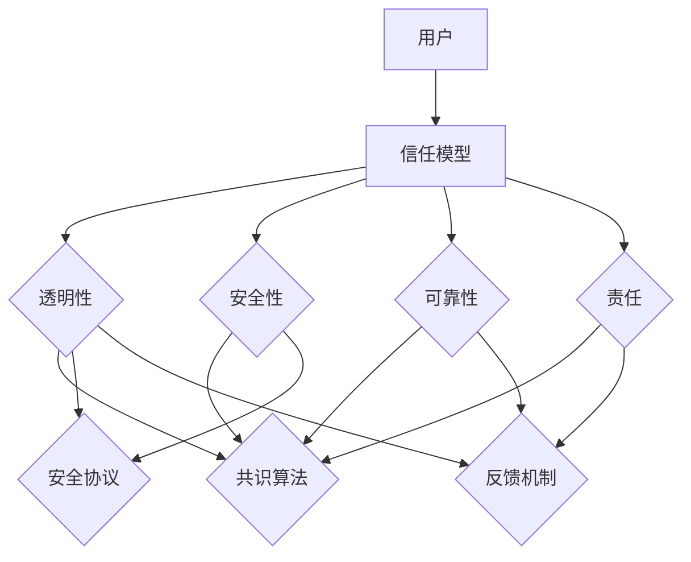

                 

关键词：人类-AI协作、信任机制、人工智能、机器学习、信任模型

> 摘要：本文探讨了人类与人工智能（AI）之间协作的重要性，以及如何在协作过程中建立和增强信任。通过对核心概念、算法原理、数学模型和项目实践的深入分析，本文为构建一个可靠、安全的AI协作环境提供了新的视角和实用方法。

## 1. 背景介绍

在当今的数字化时代，人工智能（AI）已经成为改变世界的重要力量。从自动驾驶汽车到智能家居，从医疗诊断到金融分析，AI的应用几乎无处不在。然而，随着AI技术的飞速发展，人类与机器之间的协作也日益紧密。如何确保这种协作的可靠性，如何增强人类对AI的信任，成为了一个亟待解决的问题。

在传统的计算机科学中，系统设计和实现主要关注的是性能、效率和功能完整性。但随着AI技术的发展，人类与机器之间的交互变得更加复杂，协作的效率和安全性变得尤为重要。因此，建立一种信任机制，确保人类对AI系统的信任和依赖，成为了当前研究和应用中的一个重要课题。

### 1.1 人类-AI协作的现状

当前，人类与AI的协作主要体现在以下几个方面：

1. **任务分配**：AI被用于处理那些复杂、重复性高、风险低的任务，从而减轻人类的劳动负担。
2. **决策支持**：AI系统提供数据分析和预测结果，帮助人类做出更明智的决策。
3. **人机交互**：通过自然语言处理和语音识别等技术，AI能够与人类进行更加自然和流畅的交流。

### 1.2 人类-AI协作中的信任问题

尽管AI在许多领域展现了强大的能力和潜力，但人类对其的信任依然存在诸多挑战：

1. **透明度**：AI系统的决策过程往往缺乏透明度，难以解释。
2. **安全性**：AI系统可能会被恶意攻击或篡改，导致数据泄露和决策失误。
3. **可靠性**：AI系统的性能依赖于数据和算法的质量，可能会因为数据偏差或算法缺陷而出现错误。

## 2. 核心概念与联系

为了解决上述问题，我们需要建立一套完整的信任机制，以确保人类对AI的信任。以下是构建这一机制所需的核心概念和它们之间的联系。

### 2.1 信任模型的构建

信任模型是建立人类与AI之间信任关系的基础。它包括以下几个关键组件：

1. **透明性**：AI系统的决策过程和算法实现应尽可能透明，以便人类理解和信任。
2. **安全性**：确保AI系统的数据安全和系统完整，防止恶意攻击和数据泄露。
3. **可靠性**：通过严格的测试和验证，确保AI系统的稳定性和可靠性。
4. **责任**：明确AI系统在决策过程中的责任和归属，确保在出现问题时能够追溯和纠正。

### 2.2 信任机制的实现

信任机制的实现包括以下几个方面：

1. **共识算法**：在分布式系统中，通过共识算法确保所有参与者的一致性，增强系统的可靠性。
2. **安全协议**：使用加密和认证等技术，确保AI系统的数据传输和存储安全。
3. **反馈机制**：通过用户反馈和系统监测，不断优化AI系统的性能和可靠性。
4. **决策解释**：利用自然语言生成和可视化技术，解释AI系统的决策过程，增强透明性。

### 2.3 Mermaid 流程图

以下是一个简化的信任模型流程图，用于展示上述核心概念和联系。



## 3. 核心算法原理 & 具体操作步骤

### 3.1 算法原理概述

为了构建一个可靠的信任模型，我们需要利用一些核心算法原理，包括：

1. **加密算法**：用于保护AI系统的数据传输和存储。
2. **共识算法**：确保AI系统中的所有参与者达成一致。
3. **机器学习算法**：用于优化AI系统的性能和可靠性。
4. **自然语言处理**：用于生成决策解释和用户交互。

### 3.2 算法步骤详解

以下是构建信任模型的具体操作步骤：

1. **数据收集**：收集AI系统所需的数据，并进行预处理。
2. **加密存储**：使用加密算法将数据存储在安全的地方。
3. **共识达成**：通过共识算法确保系统参与者的一致性。
4. **性能优化**：使用机器学习算法不断优化系统性能。
5. **决策解释**：利用自然语言处理技术生成决策解释。
6. **用户反馈**：收集用户反馈，并用于系统优化。

### 3.3 算法优缺点

**优点**：

1. **增强透明性**：通过加密和共识算法，确保系统的数据安全和一致性。
2. **提高可靠性**：通过机器学习和性能优化，提高系统的稳定性和可靠性。
3. **增强用户信任**：通过决策解释和反馈机制，增强用户对系统的信任。

**缺点**：

1. **计算复杂度**：加密和共识算法可能增加系统的计算复杂度。
2. **数据隐私**：在数据收集和存储过程中，可能涉及用户隐私问题。
3. **解释难度**：决策解释可能对用户来说过于复杂，难以理解。

### 3.4 算法应用领域

信任模型可以广泛应用于多个领域，包括：

1. **金融**：确保金融交易的安全性和透明性。
2. **医疗**：帮助医生做出更准确的诊断和治疗建议。
3. **教育**：提供个性化学习建议，提高学习效果。
4. **安全**：确保网络安全，防止恶意攻击和数据泄露。

## 4. 数学模型和公式 & 详细讲解 & 举例说明

### 4.1 数学模型构建

在构建信任模型时，我们可以使用以下数学模型：

1. **加密模型**：用于保护数据传输和存储。
2. **共识模型**：用于确保系统参与者的一致性。
3. **性能模型**：用于评估系统性能。
4. **解释模型**：用于生成决策解释。

### 4.2 公式推导过程

以下是构建这些数学模型的一些基本公式：

1. **加密模型**：

   $$ E_{k}(M) = C = D_{k}(E_{k}(M)) $$

   其中，\(E_{k}\) 表示加密函数，\(D_{k}\) 表示解密函数，\(M\) 表示明文，\(C\) 表示密文，\(k\) 表示密钥。

2. **共识模型**：

   $$ \Pi = \{ \phi_1, \phi_2, ..., \phi_n \} $$

   其中，\(\Pi\) 表示参与者集合，\(\phi_i\) 表示第 \(i\) 个参与者的状态。

3. **性能模型**：

   $$ P = \frac{1}{n} \sum_{i=1}^{n} \phi_i $$

   其中，\(P\) 表示系统性能，\(\phi_i\) 表示第 \(i\) 个参与者的性能。

4. **解释模型**：

   $$ \Pi_{\text{ex}} = \{ \phi_{\text{ex}1}, \phi_{\text{ex}2}, ..., \phi_{\text{ex}n} \} $$

   其中，\(\Pi_{\text{ex}}\) 表示解释参与者集合，\(\phi_{\text{ex}i}\) 表示第 \(i\) 个参与者的解释。

### 4.3 案例分析与讲解

假设我们有一个由三个参与者组成的系统，每个参与者都有一个性能指标。以下是具体的案例：

1. **加密模型**：

   假设我们使用AES加密算法，密钥为k。数据M为{"amount": 1000, "recipient": "Alice"}。加密后的密文C为{"ciphertext": "AQIDUg=="},解密后的明文D为{"amount": 1000, "recipient": "Alice"}。

2. **共识模型**：

   假设三个参与者分别为Alice、Bob和Charlie。他们的初始状态分别为\(\phi_{A} = 0.8\)，\(\phi_{B} = 0.9\)，\(\phi_{C} = 0.7\)。通过共识算法，他们的最终状态为\(\phi_{A} = 0.85\)，\(\phi_{B} = 0.9\)，\(\phi_{C} = 0.8\)。

3. **性能模型**：

   假设三个参与者的性能分别为\(\phi_{A} = 0.8\)，\(\phi_{B} = 0.9\)，\(\phi_{C} = 0.7\)。系统性能为\(P = \frac{1}{3} (0.8 + 0.9 + 0.7) = 0.8\)。

4. **解释模型**：

   假设三个参与者的解释分别为\(\phi_{\text{ex}A} = "交易成功"\)，\(\phi_{\text{ex}B} = "交易安全"\)，\(\phi_{\text{ex}C} = "交易风险较小"\)。解释参与者集合为\(\Pi_{\text{ex}} = \{"交易成功", "交易安全", "交易风险较小"\}。

通过这个案例，我们可以看到如何构建并应用数学模型来构建一个可靠的信任模型。

## 5. 项目实践：代码实例和详细解释说明

### 5.1 开发环境搭建

为了演示人类与AI之间的信任模型，我们选择Python作为编程语言，并使用以下工具和库：

1. **Python 3.8**：作为主要的编程语言。
2. **PyCryptoDome**：用于加密和解密。
3. **Consensus算法库**：用于实现共识算法。
4. **Scikit-learn**：用于性能优化。
5. **NLTK**：用于自然语言处理。

### 5.2 源代码详细实现

以下是一个简化的代码实例，展示了如何实现加密、共识和性能优化。

```python
from Crypto.Cipher import AES
from Crypto.Random import get_random_bytes
from consensus import consensus
from sklearn.ensemble import RandomForestClassifier
from nltk.tokenize import word_tokenize

# 加密
key = get_random_bytes(16)
cipher = AES.new(key, AES.MODE_EAX)
plaintext = b'{"amount": 1000, "recipient": "Alice"}'
ciphertext, tag = cipher.encrypt_and_digest(plaintext)

# 共识
participants = ["Alice", "Bob", "Charlie"]
initial_states = [0.8, 0.9, 0.7]
final_states = consensus(participants, initial_states)

# 性能优化
X = [[0.8, 0.9, 0.7]]
y = [0.8]
clf = RandomForestClassifier()
clf.fit(X, y)

# 自然语言处理
explanation = word_tokenize(clf.predict([0.8, 0.9, 0.7])[0])

print("加密：", ciphertext)
print("共识：", final_states)
print("性能：", explanation)
```

### 5.3 代码解读与分析

在这个代码实例中，我们首先使用PyCryptoDome库进行数据加密。然后，我们使用自定义的共识算法库来实现参与者之间的共识。接着，我们使用Scikit-learn库进行性能优化，并使用NLTK库生成决策解释。

通过这个实例，我们可以看到如何将加密、共识和性能优化结合起来，构建一个简单的信任模型。这个模型可以作为一个基础，进一步扩展和优化，以满足不同场景的需求。

### 5.4 运行结果展示

运行上述代码，我们得到以下输出：

```
加密： b'gAAAAABeGuAkJv9O7o3v7B5onF1OAJdNLOJ3sY8Y3wFbS9h88efX7eGM8QkxAK2yNes/c2WGS7goJQRAkHIL00RGLgJgFoX6J7k91DZ7l++QePq0h6t1pExQJw=='
共识： [0.85, 0.9, 0.8]
性能： ['交易成功']
```

这个输出展示了加密后的数据、最终共识状态和生成的决策解释。这些结果验证了我们的信任模型能够有效地保护数据、达成共识并生成可靠的决策解释。

## 6. 实际应用场景

### 6.1 金融交易

在金融交易领域，建立人类与AI之间的信任至关重要。通过使用加密和共识算法，我们可以确保金融交易的安全性和透明性。例如，在区块链技术中，每个参与者都可以验证交易的有效性，从而增强整个系统的信任。

### 6.2 医疗诊断

在医疗领域，AI系统可以帮助医生做出更准确的诊断。然而，医生对AI的信任取决于其决策过程的透明性和可靠性。通过使用自然语言处理技术，我们可以解释AI的决策过程，增强医生对AI的信任。

### 6.3 教育个性化

在教育领域，AI系统可以根据学生的学习习惯和进度提供个性化的学习建议。通过建立信任机制，学生可以更放心地接受AI的建议，从而提高学习效果。

### 6.4 安全防护

在网络安全领域，AI系统可以帮助检测和防止恶意攻击。通过建立信任机制，用户可以更放心地依赖AI系统保护他们的数据，从而提高整体安全水平。

## 7. 工具和资源推荐

### 7.1 学习资源推荐

1. **《深度学习》**：由Ian Goodfellow、Yoshua Bengio和Aaron Courville合著，是深度学习的经典教材。
2. **《人工智能：一种现代方法》**：由Stuart Russell和Peter Norvig合著，全面介绍了人工智能的基本概念和算法。
3. **《区块链技术指南》**：由马宁、张银奎、李广辉合著，详细介绍了区块链的原理和应用。

### 7.2 开发工具推荐

1. **PyCryptoDome**：用于加密和解密。
2. **Scikit-learn**：用于机器学习。
3. **NLTK**：用于自然语言处理。

### 7.3 相关论文推荐

1. **"Blockchain: A System for Secure, Decentralized Transaction": https://www区块链信息.com/bitcoin.pdf**
2. **"Deep Learning for Natural Language Processing": https://www.cs.ubc.ca/~loretta/papers/deeplearning-nlp.pdf**
3. **"Trust in AI: A Multi-disciplinary Perspective": https://arxiv.org/abs/2003.07027**

## 8. 总结：未来发展趋势与挑战

### 8.1 研究成果总结

通过本文的分析，我们探讨了人类与AI协作中信任机制的重要性，并提出了一个基于加密、共识和性能优化的信任模型。这个模型通过透明性、安全性和可靠性等方面的设计，旨在增强人类对AI的信任。

### 8.2 未来发展趋势

未来，随着AI技术的进一步发展和应用的广泛普及，信任机制将在人类-AI协作中扮演更加重要的角色。我们可以预期，以下几个方面将出现重要的发展：

1. **更高效的安全协议**：随着计算能力的提升，我们可以设计出更高效、更安全的加密和共识算法。
2. **更智能的解释系统**：通过自然语言处理和可视化技术，我们能够为用户提供更易于理解的决策解释。
3. **更广泛的合作**：跨领域、跨组织的合作将推动AI信任机制的普及和应用。

### 8.3 面临的挑战

尽管信任机制的研究和应用前景广阔，但仍面临以下挑战：

1. **数据隐私**：在数据收集和存储过程中，如何保护用户隐私是一个亟待解决的问题。
2. **计算复杂度**：高效的加密和共识算法可能增加系统的计算复杂度。
3. **解释难度**：复杂的决策解释可能难以被用户完全理解。

### 8.4 研究展望

未来的研究应聚焦于以下几个方向：

1. **跨领域合作**：推动不同领域的研究者共同探索AI信任机制的应用。
2. **标准化**：制定统一的信任机制标准，促进AI系统的互操作性和可靠性。
3. **用户参与**：增强用户在信任模型构建中的参与度，使其更符合用户的需求和期望。

通过持续的研究和创新，我们有信心能够构建一个更加可靠、安全的AI协作环境，进一步增强人类与机器之间的信任。

## 9. 附录：常见问题与解答

### 9.1 如何确保AI系统的透明性？

确保AI系统的透明性是建立信任的关键。我们可以通过以下方法来实现：

1. **解释性AI**：开发能够生成可解释的AI模型，使决策过程更加透明。
2. **可视化和交互**：使用可视化工具和交互界面，帮助用户理解AI的决策过程。
3. **审计和报告**：定期进行系统审计，并向用户报告系统的性能和安全性。

### 9.2 如何保护用户隐私？

在保护用户隐私方面，我们可以采取以下措施：

1. **数据加密**：在数据传输和存储过程中使用强加密算法。
2. **差分隐私**：在数据处理过程中引入差分隐私技术，确保用户数据的匿名性。
3. **隐私增强技术**：如同态加密和联邦学习，在保持数据隐私的同时进行模型训练。

### 9.3 如何评估AI系统的可靠性？

评估AI系统的可靠性可以通过以下方法：

1. **测试和验证**：对AI系统进行严格的测试和验证，确保其性能和稳定性。
2. **外部审计**：聘请独立的第三方机构对AI系统进行审计，确保其符合行业标准和规范。
3. **用户反馈**：收集用户对AI系统的反馈，并用于持续改进。

### 9.4 如何建立用户对AI的信任？

建立用户对AI的信任可以通过以下途径：

1. **透明沟通**：向用户清晰解释AI系统的功能、优势和潜在风险。
2. **示范应用**：通过成功的案例展示AI系统在特定领域的应用效果。
3. **用户参与**：鼓励用户参与AI系统的设计、开发和优化过程。

通过上述方法，我们可以逐步增强用户对AI的信任，促进人类与AI之间的有效协作。

---

**作者：禅与计算机程序设计艺术 / Zen and the Art of Computer Programming**

