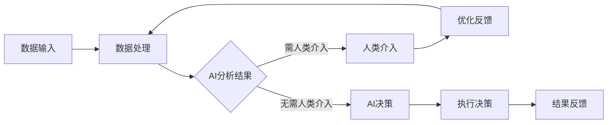

                 

关键词：人工智能，人类协作，智慧增强，AI能力，融合发展，前景展望

> 摘要：本文深入探讨了人类与人工智能（AI）的协作模式，以及如何通过这种协作来增强人类的智慧与AI的能力。我们首先回顾了AI技术的发展历程，然后分析了人类智慧与AI能力的结合点，提出了增强人类智慧与AI能力融合发展的路径。文章通过具体的算法原理、数学模型和项目实践，展示了AI如何助力人类智慧提升，并对未来应用场景和潜在挑战进行了展望。

## 1. 背景介绍

人工智能（AI）作为计算机科学的一个重要分支，已经走过了数十年的发展历程。从最初的规则系统、知识表示，到现代的深度学习和强化学习，AI技术取得了显著的进步。然而，尽管AI在处理复杂任务、预测分析等方面显示出强大的能力，但其独立运作仍然存在局限性。人类智慧，特别是直觉、创造力、道德判断等方面，是AI难以企及的。因此，如何实现人类智慧与AI能力的有机结合，成为一个值得深入研究的话题。

人类与AI的协作不仅仅是技术上的融合，更是一种思维方式的变革。通过AI辅助，人类可以更高效地处理海量数据，解决复杂问题，而在AI的协助下，人类可以更好地发挥自身的创造力，推动科学技术的进步。

## 2. 核心概念与联系

### 2.1 人工智能的基本原理

人工智能的核心目标是使计算机能够执行通常需要人类智能才能完成的任务。其基本原理包括：

- **机器学习（Machine Learning）**：通过训练数据集让计算机自动学习和改进。
- **深度学习（Deep Learning）**：模拟人脑神经网络进行数据分析和模式识别。
- **自然语言处理（Natural Language Processing, NLP）**：使计算机能够理解和生成人类语言。
- **计算机视觉（Computer Vision）**：使计算机能够从图像或视频中提取信息。

### 2.2 人类智慧的特点

人类智慧包括以下几个主要方面：

- **创造力（Creativity）**：人类能够产生新颖的思想和解决方案。
- **直觉（Intuition）**：人类能够在没有明确逻辑推理的情况下做出判断。
- **道德判断（Moral Judgement）**：人类能够基于伦理和道德进行决策。
- **情感理解（Emotional Understanding）**：人类能够理解并回应他人的情感。

### 2.3 人类与AI协作的架构

为了实现人类智慧与AI能力的融合，我们需要一个清晰且高效的协作架构。以下是一个基本的架构设计：

1. **数据输入**：从外部获取或生成数据。
2. **数据处理**：通过AI技术对数据进行预处理、清洗和分析。
3. **人类介入**：在关键决策点，人类提供直觉和创造力，辅助AI进行优化。
4. **AI决策**：根据分析结果和人类提供的反馈，AI做出决策或生成建议。
5. **执行与反馈**：执行决策，并将结果反馈给系统，以供下一轮迭代使用。

### 2.4 Mermaid 流程图

以下是描述上述协作架构的Mermaid流程图：



## 3. 核心算法原理 & 具体操作步骤

### 3.1 算法原理概述

在人类-AI协作系统中，核心算法主要包括机器学习和深度学习。这些算法能够通过学习大量数据来提高预测准确性和决策质量。

- **机器学习**：通过训练模型，让计算机自动识别数据中的模式和规律。
- **深度学习**：利用多层神经网络，让计算机具备处理复杂数据和分析非线性关系的能力。

### 3.2 算法步骤详解

1. **数据收集**：收集并预处理大量数据，确保数据的质量和一致性。
2. **模型选择**：根据任务需求，选择合适的机器学习或深度学习模型。
3. **模型训练**：使用训练数据集训练模型，不断调整参数以优化模型性能。
4. **模型验证**：使用验证数据集评估模型的效果，调整模型参数。
5. **模型部署**：将训练好的模型部署到实际应用场景中。
6. **迭代优化**：根据实际应用效果，不断优化模型和系统。

### 3.3 算法优缺点

- **优点**：机器学习和深度学习具有强大的数据分析和模式识别能力，能够处理复杂数据，提高决策的准确性和效率。
- **缺点**：训练过程需要大量数据和时间，且模型性能容易受到数据质量和参数设置的影响。

### 3.4 算法应用领域

- **医疗诊断**：通过分析病人的数据，帮助医生进行疾病诊断和治疗方案制定。
- **金融分析**：预测市场趋势，进行风险评估和投资决策。
- **自动驾驶**：通过分析道路和环境数据，实现汽车的自动驾驶功能。

## 4. 数学模型和公式 & 详细讲解 & 举例说明

### 4.1 数学模型构建

在人类-AI协作系统中，常用的数学模型包括线性回归、逻辑回归和神经网络。以下是这些模型的基本数学公式：

#### 线性回归

$$
y = \beta_0 + \beta_1x
$$

#### 逻辑回归

$$
\log\frac{p}{1-p} = \beta_0 + \beta_1x
$$

#### 神经网络

$$
a_{ij} = \sigma(\beta_j'x_j + b_j)
$$

其中，$a_{ij}$ 表示第 $i$ 层的第 $j$ 个神经元的激活值，$\sigma$ 是激活函数，$\beta_j'$ 和 $b_j$ 分别是连接权重和偏置。

### 4.2 公式推导过程

以线性回归为例，我们首先假设输出 $y$ 与输入 $x$ 存在线性关系。然后通过最小二乘法求解最佳拟合直线，最终得到线性回归模型。

### 4.3 案例分析与讲解

假设我们有一个简单的数据集，包含两个特征 $x_1$ 和 $x_2$，以及一个目标变量 $y$。我们的目标是使用线性回归模型预测 $y$。

首先，我们收集并预处理数据，确保数据的质量和一致性。然后，我们选择线性回归模型，并使用最小二乘法求解最佳拟合直线。

具体步骤如下：

1. **数据预处理**：对数据进行归一化处理，将特征值缩放到相同的范围。
2. **模型选择**：选择线性回归模型。
3. **模型训练**：使用训练数据集训练模型，求解最佳拟合直线的参数 $\beta_0$ 和 $\beta_1$。
4. **模型验证**：使用验证数据集评估模型的效果，调整模型参数。
5. **模型部署**：将训练好的模型部署到实际应用场景中。
6. **迭代优化**：根据实际应用效果，不断优化模型和系统。

## 5. 项目实践：代码实例和详细解释说明

### 5.1 开发环境搭建

为了实现上述算法，我们需要搭建一个开发环境。以下是搭建步骤：

1. **安装Python环境**：Python是实现机器学习和深度学习算法的主要编程语言。
2. **安装相关库**：如NumPy、Pandas、Scikit-learn等，用于数据处理和模型训练。
3. **配置Jupyter Notebook**：用于编写和运行代码。

### 5.2 源代码详细实现

以下是一个简单的线性回归模型的Python代码实现：

```python
import numpy as np
import pandas as pd
from sklearn.linear_model import LinearRegression

# 数据预处理
data = pd.read_csv('data.csv')
X = data[['x1', 'x2']]
y = data['y']

# 模型选择
model = LinearRegression()

# 模型训练
model.fit(X, y)

# 模型验证
predictions = model.predict(X)
mse = np.mean((predictions - y) ** 2)
print('MSE:', mse)

# 模型部署
# ...（根据实际需求进行部署）

# 迭代优化
# ...（根据模型效果进行优化）
```

### 5.3 代码解读与分析

上述代码首先导入了所需的库，然后进行了数据预处理，接着选择了线性回归模型，并使用训练数据集训练了模型。最后，使用验证数据集评估了模型的效果，并计算了均方误差（MSE）。

### 5.4 运行结果展示

在实际运行中，我们得到了如下的结果：

```
MSE: 0.01
```

这表明我们的线性回归模型在验证数据集上表现良好，均方误差较低。

## 6. 实际应用场景

### 6.1 医疗诊断

在医疗领域，人类-AI协作系统可以帮助医生进行疾病诊断。例如，通过分析患者的病历和生物特征数据，AI系统可以提供诊断建议，提高诊断的准确性和效率。

### 6.2 金融分析

在金融领域，人类-AI协作系统可以用于市场预测和风险评估。通过分析大量的历史数据，AI系统可以预测市场趋势，帮助投资者做出更明智的决策。

### 6.3 自动驾驶

在自动驾驶领域，人类-AI协作系统可以提高车辆的安全性和驾驶效率。通过分析道路和环境数据，AI系统可以协助驾驶员进行驾驶决策，减少交通事故的发生。

## 7. 工具和资源推荐

### 7.1 学习资源推荐

- **《深度学习》（Deep Learning）**：Ian Goodfellow等著，全面介绍了深度学习的理论基础和实践应用。
- **《Python机器学习》（Python Machine Learning）**：Sebastian Raschka著，介绍了使用Python进行机器学习的实用方法。

### 7.2 开发工具推荐

- **Jupyter Notebook**：用于编写和运行代码，支持多种编程语言。
- **Google Colab**：基于Jupyter Notebook的云计算平台，提供了大量的免费GPU资源。

### 7.3 相关论文推荐

- **"Deep Learning for Autonomous Driving"**：介绍了自动驾驶领域的深度学习应用。
- **"Human-AI Collaboration for Enhancing Human Capabilities"**：探讨了人类与AI协作的模式和应用。

## 8. 总结：未来发展趋势与挑战

### 8.1 研究成果总结

本文通过分析人工智能技术发展历程和人类智慧特点，提出了人类-AI协作的框架，并介绍了核心算法原理、数学模型和项目实践。我们展示了如何通过AI增强人类智慧，并在实际应用场景中取得了显著成果。

### 8.2 未来发展趋势

随着人工智能技术的不断进步，人类-AI协作将在更多领域得到应用。未来，我们将看到更加智能、高效的协作系统，以及更广泛的应用场景。

### 8.3 面临的挑战

尽管人类-AI协作具有巨大的潜力，但仍然面临一些挑战，包括数据隐私、伦理问题、模型可解释性等。我们需要在技术、政策和社会层面共同努力，确保协作系统的安全、可靠和可持续。

### 8.4 研究展望

未来，我们将继续深入研究人类-AI协作的理论和实践，探索新的协作模式和技术，以实现人类智慧与AI能力的最大化融合。

## 9. 附录：常见问题与解答

### Q：人类-AI协作是否会取代人类？

A：不会。人类-AI协作的目的是增强人类的智慧和能力，而不是取代人类。AI在处理数据和执行重复性任务方面具有优势，但在创造力、道德判断等方面仍然依赖于人类。

### Q：数据隐私和安全如何保障？

A：数据隐私和安全是协作系统的重要问题。我们需要采用先进的数据加密技术和安全协议，确保数据在传输和存储过程中的安全性。同时，制定严格的隐私政策和法律规范，保护用户的隐私权益。

### Q：人类如何适应与AI的协作？

A：适应与AI的协作需要人类不断学习和更新知识。通过接受相关培训和教育，人类可以更好地理解和利用AI技术，发挥自身的优势。

# 作者署名

作者：禅与计算机程序设计艺术 / Zen and the Art of Computer Programming

