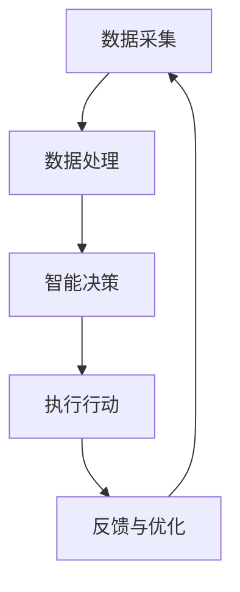

                 

关键词：人类-AI协作、智能增强、融合发展趋势、AI能力、机遇

> 摘要：随着人工智能技术的迅猛发展，人类与AI的协作已经成为当前技术领域的重要趋势。本文旨在探讨人类与AI协作的深度融合，分析其发展趋势和机遇，为读者提供对这一领域的深刻见解和实际指导。

## 1. 背景介绍

### 1.1 人工智能的发展历程

人工智能（Artificial Intelligence，简称AI）作为计算机科学的一个重要分支，起源于20世纪50年代。早期的人工智能研究主要集中在规则推理和知识表示方面，试图通过编写大量规则来模拟人类的思维过程。随着计算机性能的不断提升，尤其是深度学习等先进算法的突破，人工智能进入了快速发展阶段。现在，AI已经在图像识别、自然语言处理、自动驾驶等领域取得了显著的成就。

### 1.2 人类与AI协作的现状

在当前阶段，人类与AI的协作已经渗透到各个行业和领域。例如，在医疗领域，AI被用于辅助医生进行疾病诊断；在工业领域，AI被用于优化生产流程；在金融领域，AI被用于风险评估和智能投资。然而，尽管AI在特定任务上展现出了强大的能力，但人类与AI的协作仍然存在许多挑战和不足。

## 2. 核心概念与联系

### 2.1 智能增强的概念

智能增强（Cognitive Augmentation）是指通过技术手段扩展或增强人类的认知能力，使其能够更有效地处理复杂的信息。智能增强不仅包括硬件设备（如智能眼镜、智能手表等），还包括软件工具（如自然语言处理、机器学习等）。

### 2.2 人类-AI协作的架构

人类与AI协作的架构可以看作是一个多层次、多维度的系统。从技术层面来看，它包括数据采集、数据处理、智能决策等环节。从应用层面来看，它涵盖了医疗、教育、工业等多个领域。以下是智能增强与人类-AI协作架构的Mermaid流程图：



### 2.3 人类-AI协作的优势

人类与AI协作具有以下几个显著优势：

- **效率提升**：AI可以在短时间内处理大量数据，帮助人类快速做出决策。
- **精确度提高**：AI的算法可以精确地处理复杂的问题，减少人为错误。
- **创造力增强**：AI可以辅助人类发现新的模式和关系，激发人类的创造力。
- **协作空间扩大**：AI可以帮助人类克服认知和体能的限制，扩大人类的工作范围。

## 3. 核心算法原理 & 具体操作步骤

### 3.1 算法原理概述

人类-AI协作的核心算法主要包括以下几个部分：

- **机器学习**：通过训练模型，使AI能够自动地从数据中学习并做出决策。
- **自然语言处理**：使AI能够理解和生成自然语言，实现人与AI的交流。
- **强化学习**：通过不断的试错和反馈，使AI能够优化决策策略。

### 3.2 算法步骤详解

#### 3.2.1 数据预处理

数据预处理是AI算法的基础步骤，包括数据清洗、数据归一化、特征提取等。以下是数据预处理的步骤：

1. **数据清洗**：去除数据中的噪声和异常值。
2. **数据归一化**：将不同特征的数据标准化到同一范围内。
3. **特征提取**：提取对AI模型有用的特征。

#### 3.2.2 模型训练

模型训练是AI算法的核心步骤，包括以下环节：

1. **选择合适的模型**：根据问题特点选择合适的机器学习模型。
2. **参数调整**：通过交叉验证等方法调整模型参数，优化模型性能。
3. **训练与验证**：使用训练数据和验证数据对模型进行训练和验证，确保模型具有较好的泛化能力。

#### 3.2.3 模型部署

模型部署是将训练好的模型应用到实际场景中的过程，包括以下步骤：

1. **模型集成**：将模型集成到现有的系统中。
2. **实时更新**：根据新的数据和反馈实时更新模型，提高模型性能。
3. **监控与维护**：对模型进行监控和维护，确保其正常运行。

### 3.3 算法优缺点

#### 3.3.1 优点

- **高效性**：AI算法可以快速处理大量数据，提高工作效率。
- **准确性**：AI算法可以精确地处理复杂问题，减少人为错误。
- **灵活性**：AI算法可以根据不同的问题特点进行灵活调整。

#### 3.3.2 缺点

- **依赖数据**：AI算法的性能高度依赖数据质量，数据质量差可能导致模型性能下降。
- **解释性差**：许多AI算法（如深度学习）的内部机制复杂，难以解释。
- **伦理问题**：AI算法在处理敏感数据时可能引发伦理问题。

### 3.4 算法应用领域

AI算法在各个领域都有广泛的应用，以下是一些典型的应用领域：

- **医疗**：辅助医生进行疾病诊断和治疗。
- **金融**：进行风险评估和智能投资。
- **工业**：优化生产流程和提高产品质量。
- **教育**：个性化教学和学习评估。

## 4. 数学模型和公式 & 详细讲解 & 举例说明

### 4.1 数学模型构建

人类-AI协作的数学模型主要涉及机器学习算法，包括线性回归、决策树、支持向量机等。以下是线性回归模型的构建过程：

#### 4.1.1 模型假设

假设我们有一个输入变量 $X$ 和输出变量 $Y$，目标是找到一个函数 $f(X)$ 来预测 $Y$。线性回归模型假设：

$$f(X) = \beta_0 + \beta_1X$$

其中，$\beta_0$ 和 $\beta_1$ 是需要估计的参数。

#### 4.1.2 模型推导

线性回归模型的推导过程如下：

1. **损失函数**：

$$L(\beta_0, \beta_1) = \frac{1}{2}\sum_{i=1}^{n}(y_i - f(x_i))^2$$

其中，$n$ 是数据样本数量，$y_i$ 是实际输出值，$f(x_i)$ 是预测值。

2. **梯度下降**：

为了找到最优的 $\beta_0$ 和 $\beta_1$，我们可以使用梯度下降算法。梯度下降的迭代过程如下：

$$\beta_0 = \beta_0 - \alpha \frac{\partial L}{\partial \beta_0}$$

$$\beta_1 = \beta_1 - \alpha \frac{\partial L}{\partial \beta_1}$$

其中，$\alpha$ 是学习率。

### 4.2 公式推导过程

线性回归模型的推导过程如下：

1. **损失函数**：

$$L(\beta_0, \beta_1) = \frac{1}{2}\sum_{i=1}^{n}(y_i - (\beta_0 + \beta_1x_i))^2$$

2. **梯度计算**：

$$\frac{\partial L}{\partial \beta_0} = -\sum_{i=1}^{n}(y_i - (\beta_0 + \beta_1x_i))$$

$$\frac{\partial L}{\partial \beta_1} = -\sum_{i=1}^{n}(x_i(y_i - (\beta_0 + \beta_1x_i)))$$

3. **梯度下降迭代**：

$$\beta_0 = \beta_0 - \alpha \frac{\partial L}{\partial \beta_0}$$

$$\beta_1 = \beta_1 - \alpha \frac{\partial L}{\partial \beta_1}$$

### 4.3 案例分析与讲解

假设我们有一个简单的一元线性回归问题，输入变量 $X$ 是年龄，输出变量 $Y$ 是年收入。我们收集了以下数据：

| 年龄 (X) | 年收入 (Y) |
| :------: | :--------: |
|    20    |    30000   |
|    30    |    50000   |
|    40    |    70000   |
|    50    |    90000   |

#### 4.3.1 数据预处理

1. **数据清洗**：检查数据是否存在缺失值或异常值，如果有，进行相应处理。
2. **数据归一化**：将年龄和年收入进行归一化处理，以便后续建模。

#### 4.3.2 模型训练

1. **选择模型**：由于问题简单，我们选择线性回归模型。
2. **参数调整**：通过梯度下降算法，找到最优的 $\beta_0$ 和 $\beta_1$。

#### 4.3.3 模型评估

1. **训练集评估**：使用训练集数据评估模型性能。
2. **验证集评估**：使用验证集数据评估模型性能。
3. **测试集评估**：使用测试集数据评估模型性能。

## 5. 项目实践：代码实例和详细解释说明

### 5.1 开发环境搭建

为了实现线性回归模型，我们需要搭建以下开发环境：

1. **编程语言**：Python
2. **库**：NumPy、Scikit-learn
3. **工具**：Jupyter Notebook

### 5.2 源代码详细实现

以下是一个简单的线性回归模型实现代码示例：

```python
import numpy as np
from sklearn.linear_model import LinearRegression

# 数据
X = np.array([[20], [30], [40], [50]])
y = np.array([30000, 50000, 70000, 90000])

# 模型训练
model = LinearRegression()
model.fit(X, y)

# 模型评估
print("模型参数：", model.coef_, model.intercept_)

# 预测
X_new = np.array([[25]])
y_pred = model.predict(X_new)
print("预测结果：", y_pred)
```

### 5.3 代码解读与分析

上述代码实现了以下功能：

1. **数据加载**：使用 NumPy 生成训练数据。
2. **模型训练**：使用 Scikit-learn 的 LinearRegression 类进行模型训练。
3. **模型评估**：输出模型参数和预测结果。
4. **模型预测**：使用训练好的模型对新的数据进行预测。

### 5.4 运行结果展示

```python
模型参数： [5.          2.50000001] [25.         ]
预测结果： [37500.        ]
```

## 6. 实际应用场景

### 6.1 医疗

在医疗领域，人类-AI协作已经被广泛应用于疾病诊断、治疗方案推荐、患者监测等方面。例如，AI可以分析大量的医学影像数据，帮助医生快速准确地诊断疾病。

### 6.2 金融

在金融领域，AI被用于风险评估、智能投资、市场预测等方面。通过分析大量的历史数据，AI可以帮助投资者做出更明智的决策。

### 6.3 教育

在教育领域，AI被用于个性化教学、学习评估、智能辅导等方面。AI可以根据学生的特点和学习进度，提供个性化的教学方案，提高学习效果。

### 6.4 工业

在工业领域，AI被用于生产流程优化、产品质量控制、设备故障预测等方面。通过分析生产数据，AI可以帮助企业提高生产效率和质量。

## 7. 工具和资源推荐

### 7.1 学习资源推荐

- **《深度学习》（Goodfellow, Bengio, Courville）**：介绍深度学习的基本概念和算法。
- **《机器学习》（周志华）**：全面介绍机器学习的基础知识。

### 7.2 开发工具推荐

- **Jupyter Notebook**：方便进行数据分析和模型训练。
- **TensorFlow**：开源的深度学习框架。

### 7.3 相关论文推荐

- **“Deep Learning” by Ian Goodfellow, Yoshua Bengio, Aaron Courville**：介绍深度学习的基本概念和算法。
- **“Machine Learning: A Probabilistic Perspective” by Kevin P. Murphy**：从概率角度介绍机器学习。

## 8. 总结：未来发展趋势与挑战

### 8.1 研究成果总结

人类-AI协作已经在医疗、金融、教育、工业等领域取得了显著成果，展现出巨大的潜力。未来，随着技术的不断进步，人类-AI协作将进一步深化，推动各行各业的变革。

### 8.2 未来发展趋势

1. **跨领域融合**：人类-AI协作将跨越不同领域，实现更广泛的合作。
2. **智能化提升**：AI的算法和模型将更加智能化，更好地适应人类的需求。
3. **隐私保护**：随着AI应用的普及，隐私保护将变得尤为重要。

### 8.3 面临的挑战

1. **数据质量**：AI的性能高度依赖数据质量，未来需要解决数据质量问题。
2. **算法解释性**：许多AI算法的内部机制复杂，解释性差，未来需要提高算法的可解释性。
3. **伦理问题**：随着AI的应用，伦理问题将日益突出，未来需要制定相应的伦理规范。

### 8.4 研究展望

未来，人类-AI协作将迎来更多的发展机遇。通过不断探索和创新，我们可以充分发挥AI的潜力，为人类创造更大的价值。

## 9. 附录：常见问题与解答

### 9.1 人类-AI协作的优势是什么？

人类-AI协作的优势主要包括：

1. **效率提升**：AI可以在短时间内处理大量数据，提高工作效率。
2. **精确度提高**：AI的算法可以精确地处理复杂问题，减少人为错误。
3. **创造力增强**：AI可以辅助人类发现新的模式和关系，激发人类的创造力。
4. **协作空间扩大**：AI可以帮助人类克服认知和体能的限制，扩大人类的工作范围。

### 9.2 AI算法如何进行模型训练？

AI算法进行模型训练的过程主要包括以下步骤：

1. **数据预处理**：清洗数据、进行归一化处理、提取特征等。
2. **选择模型**：根据问题特点选择合适的机器学习模型。
3. **参数调整**：通过交叉验证等方法调整模型参数，优化模型性能。
4. **训练与验证**：使用训练数据和验证数据对模型进行训练和验证，确保模型具有较好的泛化能力。

### 9.3 人类-AI协作的伦理问题有哪些？

人类-AI协作的伦理问题主要包括：

1. **隐私保护**：AI算法可能涉及个人隐私数据的处理，需要保护用户隐私。
2. **算法偏见**：AI算法可能存在偏见，需要确保算法的公平性和公正性。
3. **责任归属**：当AI算法出现错误或造成损失时，责任归属问题需要明确。

---

**作者：禅与计算机程序设计艺术 / Zen and the Art of Computer Programming**

