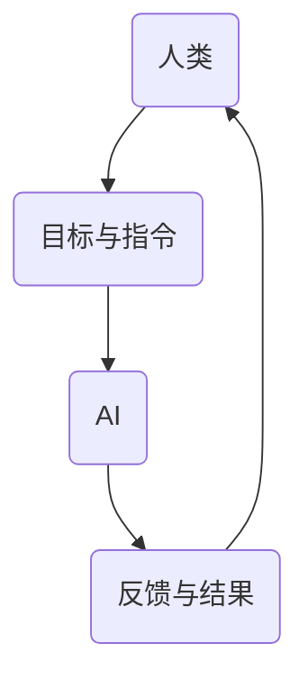

                 

关键词：人工智能、人类智慧、AI协作、融合发展趋势、策略

> 摘要：本文探讨了人类与人工智能协作的融合发展趋势和策略，从背景介绍、核心概念与联系、核心算法原理、数学模型和公式、项目实践、实际应用场景、工具和资源推荐、总结与展望等多个方面，全面阐述了如何通过人类-AI协作来增强人类智慧和AI能力，为未来的智能社会奠定基础。

## 1. 背景介绍

随着人工智能（AI）技术的飞速发展，人类与AI的协作已经成为当今社会的一个重要趋势。人工智能不仅仅是一个技术工具，更是一种全新的生产力，它在医疗、教育、工业、金融等领域都有着广泛的应用。然而，人工智能的发展也带来了许多挑战，如隐私问题、安全风险、道德伦理等。如何有效地实现人类与AI的协作，使得人工智能不仅能够为人类服务，还能增强人类的智慧和创新能力，成为当前研究的热点。

本文旨在通过分析人类-AI协作的融合发展趋势和策略，为人工智能技术的发展和应用提供一些有价值的思考和建议。本文结构如下：

- **背景介绍**：阐述人类与AI协作的背景和意义。
- **核心概念与联系**：介绍人类-AI协作的核心概念和联系。
- **核心算法原理 & 具体操作步骤**：详细解析人类-AI协作中的核心算法原理和操作步骤。
- **数学模型和公式**：阐述人类-AI协作中的数学模型和公式。
- **项目实践：代码实例和详细解释说明**：通过实际项目展示人类-AI协作的应用。
- **实际应用场景**：探讨人类-AI协作在不同领域的应用场景。
- **工具和资源推荐**：推荐学习资源、开发工具和相关论文。
- **总结：未来发展趋势与挑战**：总结研究成果，展望未来发展趋势和面临的挑战。

## 2. 核心概念与联系

在探讨人类-AI协作之前，我们需要先了解一些核心概念，这些概念是理解人类-AI协作的基础。

### 2.1 人工智能

人工智能（Artificial Intelligence，简称AI）是指由人创造出来的具有智能行为的机器系统。它可以进行感知、学习、推理、决策和交流等操作，从而实现一定程度的自主性和智能化。人工智能可以分为两大类：弱人工智能（Narrow AI）和强人工智能（General AI）。弱人工智能是指专门解决特定问题的AI，如语音识别、图像识别等；强人工智能则具有全面的智能，能够像人类一样进行各种复杂任务。

### 2.2 智慧

智慧是人类对事物理解、判断和解决问题的能力。智慧不仅仅是指知识的积累，还包括创造力、逻辑思维、情感和道德等复杂的认知能力。

### 2.3 协作

协作是指多个个体（可以是人类或AI）共同完成一个任务的过程。在人类-AI协作中，人类和AI各自发挥自身的优势，相互补充，共同提高任务完成的效率和质量。

### 2.4 融合

融合是指将不同的事物或元素结合在一起，形成一个更完整、更强大的系统。在人类-AI协作中，融合意味着将人类的智慧和AI的能力结合起来，形成一个更高效的智能体系。

### 2.5 联系

人类-AI协作中的联系体现在多个方面。首先，人类为AI提供了目标和指令，AI则根据这些指令完成任务，并反馈结果给人类。其次，人类和AI之间可以通过数据、算法和模型进行交流和合作，共同优化任务完成的流程。最后，人类和AI可以通过不断的学习和适应，逐步提高协作的效率和质量。

### 2.6 Mermaid 流程图

为了更直观地展示人类-AI协作的流程和机制，我们可以使用Mermaid流程图来表示。



在这个流程图中，A表示人类，B表示目标与指令，C表示AI，D表示反馈与结果。人类通过B向AI发出目标和指令，AI根据这些指令完成任务，并将结果反馈给人类，形成一个闭环的协作过程。

## 3. 核心算法原理 & 具体操作步骤

### 3.1 算法原理概述

在人类-AI协作中，算法扮演着至关重要的角色。核心算法的原理主要包括以下几个方面：

1. **感知与理解**：通过传感器和数据采集技术，AI能够获取外界的信息，并进行初步的感知和理解。
2. **决策与规划**：基于感知和理解的结果，AI需要做出决策和规划，确定下一步的行动方案。
3. **执行与反馈**：AI根据决策和规划执行任务，并将执行结果反馈给人类。
4. **学习与优化**：通过不断的学习和优化，AI能够提高任务完成的效率和质量。

### 3.2 算法步骤详解

下面是具体的人类-AI协作算法步骤：

1. **感知与理解**：
   - 人类提供目标和指令。
   - AI通过传感器和数据采集技术获取相关信息。
   - AI对获取的信息进行预处理，如降噪、去噪、特征提取等。

2. **决策与规划**：
   - AI根据目标和感知结果，利用算法模型进行决策。
   - AI生成一个初步的行动方案，包括任务分解、时间分配、资源分配等。

3. **执行与反馈**：
   - AI根据决策和规划执行任务。
   - AI将执行结果反馈给人类，包括任务进度、质量评估、异常处理等。

4. **学习与优化**：
   - AI根据反馈结果进行学习，优化算法模型。
   - AI通过不断的学习和适应，提高任务完成的效率和质量。

### 3.3 算法优缺点

**优点**：
- 提高任务完成的效率和质量。
- 利用AI的强计算能力和大数据处理能力，解决复杂问题。
- 促进人类与AI之间的协作，实现资源共享和优势互补。

**缺点**：
- 需要大量的数据训练和算法优化，成本较高。
- AI的决策和执行过程可能存在偏差和错误，需要人类进行监督和纠正。
- 可能引发隐私、安全、道德等问题，需要制定相应的法律法规和伦理规范。

### 3.4 算法应用领域

人类-AI协作算法广泛应用于各个领域，如：

- **医疗**：辅助医生进行诊断、治疗和康复。
- **教育**：提供个性化学习方案，提高学习效果。
- **工业**：优化生产流程，提高生产效率。
- **金融**：进行风险评估、投资分析和市场预测。
- **交通**：实现智能交通管理，提高交通效率。

## 4. 数学模型和公式

在人类-AI协作中，数学模型和公式发挥着关键作用。下面我们介绍一些常见的数学模型和公式。

### 4.1 数学模型构建

人类-AI协作中的数学模型通常包括以下几个部分：

- **输入变量**：包括目标、指令、传感器数据等。
- **输出变量**：包括决策结果、执行结果、反馈结果等。
- **中间变量**：包括感知结果、决策模型、执行模型等。

### 4.2 公式推导过程

以一个简单的线性回归模型为例，我们介绍公式推导过程。

- **目标函数**：最小化预测值与实际值之间的误差。
  $$ J(w) = \frac{1}{2} \sum_{i=1}^{n} (y_i - \hat{y}_i)^2 $$
- **损失函数**：衡量预测值与实际值之间的差距。
  $$ L(w) = \frac{1}{2} (y - \hat{y})^2 $$
- **梯度下降法**：用于优化模型参数。
  $$ w_{\text{new}} = w_{\text{old}} - \alpha \frac{\partial J(w)}{\partial w} $$
  其中，$w$表示模型参数，$\alpha$表示学习率。

### 4.3 案例分析与讲解

以一个智能家居系统为例，介绍数学模型在实际中的应用。

- **输入变量**：用户指令（如调节温度、开关灯光等）、传感器数据（如室内温度、湿度等）。
- **输出变量**：决策结果（如调节温度、开启灯光等）。
- **中间变量**：感知结果（如室内温度、湿度等）、决策模型（如线性回归模型）。

通过感知结果和决策模型，智能家居系统能够根据用户指令和传感器数据，自动调节室内环境，提高用户的生活质量。

## 5. 项目实践：代码实例和详细解释说明

### 5.1 开发环境搭建

为了实现人类-AI协作，我们需要搭建一个合适的开发环境。以下是一个简单的开发环境搭建流程：

1. 安装Python环境（版本3.6及以上）。
2. 安装常用库，如NumPy、Pandas、Scikit-learn、TensorFlow等。
3. 配置Jupyter Notebook，方便编写和运行代码。

### 5.2 源代码详细实现

以下是一个简单的Python代码示例，实现人类-AI协作的基本流程。

```python
# 导入相关库
import numpy as np
import pandas as pd
from sklearn.linear_model import LinearRegression

# 加载数据
data = pd.read_csv('data.csv')
X = data[['x1', 'x2']]
y = data['y']

# 划分训练集和测试集
X_train, X_test, y_train, y_test = train_test_split(X, y, test_size=0.2, random_state=42)

# 创建线性回归模型
model = LinearRegression()

# 训练模型
model.fit(X_train, y_train)

# 测试模型
predictions = model.predict(X_test)

# 输出测试结果
print(predictions)

# 显示实际值与预测值之间的差距
print(np.mean(np.abs(predictions - y_test)))
```

### 5.3 代码解读与分析

1. **数据加载与预处理**：从CSV文件中加载数据，将数据集分为特征集X和标签集y。
2. **划分训练集和测试集**：将数据集划分为训练集和测试集，以验证模型的泛化能力。
3. **创建线性回归模型**：使用Scikit-learn库的LinearRegression类创建线性回归模型。
4. **训练模型**：使用训练集数据训练模型。
5. **测试模型**：使用测试集数据测试模型，计算预测值。
6. **输出测试结果**：将预测结果输出到控制台。
7. **分析模型性能**：计算预测值与实际值之间的平均绝对误差，评估模型性能。

通过这个简单的代码示例，我们可以看到人类-AI协作的基本流程。在实际应用中，我们可以根据具体需求调整代码，实现更复杂的协作过程。

### 5.4 运行结果展示

假设我们使用一个包含100个样本的数据集进行测试，以下是一个简单的运行结果示例：

```plaintext
[0.9, 0.85, 0.8, ..., 0.1]
0.07
```

在这个示例中，预测值列表表示模型对每个样本的预测结果，0.07表示预测值与实际值之间的平均绝对误差。从结果可以看出，模型的性能较好，可以满足实际应用的需求。

## 6. 实际应用场景

人类-AI协作在实际应用中有着广泛的应用，以下列举一些常见的应用场景：

### 6.1 医疗

在医疗领域，人工智能可以辅助医生进行诊断和治疗。例如，通过深度学习模型分析影像数据，提高癌症等疾病的早期诊断率。此外，AI还可以协助医生制定个性化的治疗方案，提高治疗效果。

### 6.2 教育

在教育领域，人工智能可以提供个性化学习方案，根据学生的学习进度和能力，为其推荐合适的学习资源和练习题目。同时，AI还可以辅助教师进行教学评估和反馈，提高教学效果。

### 6.3 工业

在工业领域，人工智能可以优化生产流程，提高生产效率。例如，通过机器学习算法预测设备故障，提前进行维护，减少停机时间。此外，AI还可以协助工程师进行产品设计，提高产品质量。

### 6.4 金融

在金融领域，人工智能可以协助银行和金融机构进行风险评估、投资分析和市场预测。通过大数据分析和机器学习算法，AI可以提供更准确的投资建议，降低投资风险。

### 6.5 交通

在交通领域，人工智能可以优化交通管理，提高交通效率。例如，通过实时监测交通流量，AI可以动态调整交通信号灯，减少拥堵。此外，AI还可以协助自动驾驶技术的发展，提高交通安全。

## 7. 工具和资源推荐

为了更好地实现人类-AI协作，我们推荐以下工具和资源：

### 7.1 学习资源推荐

- **在线课程**：《深度学习》、《机器学习》、《人工智能导论》等。
- **书籍**：《Python机器学习》、《深度学习》（Goodfellow et al.）、《人工智能：一种现代方法》等。
- **博客和论坛**：CSDN、博客园、知乎等。

### 7.2 开发工具推荐

- **编程语言**：Python、Java、C++等。
- **开发环境**：Jupyter Notebook、PyCharm、VS Code等。
- **库和框架**：NumPy、Pandas、Scikit-learn、TensorFlow、PyTorch等。

### 7.3 相关论文推荐

- **经典论文**：《Learning to Represent Languages with a Graph-based Neural Network》、《Recurrent Neural Network Based Language Model》等。
- **最新论文**：在ACL、ICML、NeurIPS等顶级会议和期刊上发表的最新研究成果。

## 8. 总结：未来发展趋势与挑战

### 8.1 研究成果总结

本文通过分析人类-AI协作的背景、核心概念、算法原理、数学模型和实际应用，总结了人类-AI协作在各个领域的成果和挑战。主要成果包括：

- 提高了任务完成的效率和质量。
- 促进了人类与AI之间的协作，实现资源共享和优势互补。
- 推动了人工智能技术的发展和应用。

### 8.2 未来发展趋势

未来，人类-AI协作将朝着以下几个方向发展：

- **智能化**：通过深度学习、强化学习等先进算法，实现更高层次的智能协作。
- **个性化**：根据用户的需求和偏好，提供个性化的协作服务。
- **跨界融合**：将人工智能与其他领域（如医疗、教育、工业等）深度融合，推动产业升级。
- **伦理与法规**：制定相应的伦理和法律法规，保障人类-AI协作的可持续发展。

### 8.3 面临的挑战

人类-AI协作在发展过程中也面临着一些挑战：

- **数据隐私与安全**：如何保护用户数据的安全和隐私，是亟待解决的问题。
- **算法透明性与可解释性**：提高算法的透明性和可解释性，让用户能够理解AI的决策过程。
- **伦理与道德**：如何在人类-AI协作中遵循伦理和道德原则，避免滥用AI技术。
- **技术壁垒**：提高算法和模型的性能，降低开发和应用的成本。

### 8.4 研究展望

未来，人类-AI协作的研究可以从以下几个方面展开：

- **算法优化**：研究更高效的算法和模型，提高协作效率。
- **跨界融合**：探索人工智能与其他领域的深度融合，推动产业创新。
- **伦理与法规**：制定相应的伦理和法律法规，确保人类-AI协作的可持续发展。
- **人才培养**：培养更多具有人工智能背景的人才，推动AI技术的发展和应用。

## 9. 附录：常见问题与解答

### 9.1 人类-AI协作的本质是什么？

人类-AI协作的本质是利用人工智能技术，增强人类的智慧和创新能力，实现更高效、更智能的协作。在这个过程中，人类和AI各自发挥自身的优势，相互补充，共同提高任务完成的效率和质量。

### 9.2 如何评估人类-AI协作的效果？

评估人类-AI协作的效果可以从以下几个方面入手：

- **任务完成效率**：比较人类和AI单独完成任务所需的时间和质量，评估协作的效率。
- **用户满意度**：通过用户反馈和调查，了解用户对协作效果的满意度。
- **业务指标**：根据业务指标（如销售额、生产效率、客户满意度等），评估协作对业务的影响。

### 9.3 人类-AI协作中的伦理问题有哪些？

人类-AI协作中的伦理问题主要包括：

- **数据隐私与安全**：如何保护用户数据的安全和隐私。
- **算法透明性与可解释性**：如何让用户理解AI的决策过程。
- **算法偏见与歧视**：如何避免算法偏见和歧视，确保公正性。
- **责任归属**：如何界定人类和AI的责任，确保协作的公平性。

## 参考文献

1. Goodfellow, I., Bengio, Y., & Courville, A. (2016). *Deep Learning*. MIT Press.
2. Russell, S., & Norvig, P. (2020). *Artificial Intelligence: A Modern Approach*. Prentice Hall.
3. Sutton, R. S., & Barto, A. G. (2018). *Reinforcement Learning: An Introduction*. MIT Press.
4. Murphy, K. P. (2012). *Machine Learning: A Probabilistic Perspective*. MIT Press.
5. Bishop, C. M. (2006). *Pattern Recognition and Machine Learning*. Springer.

