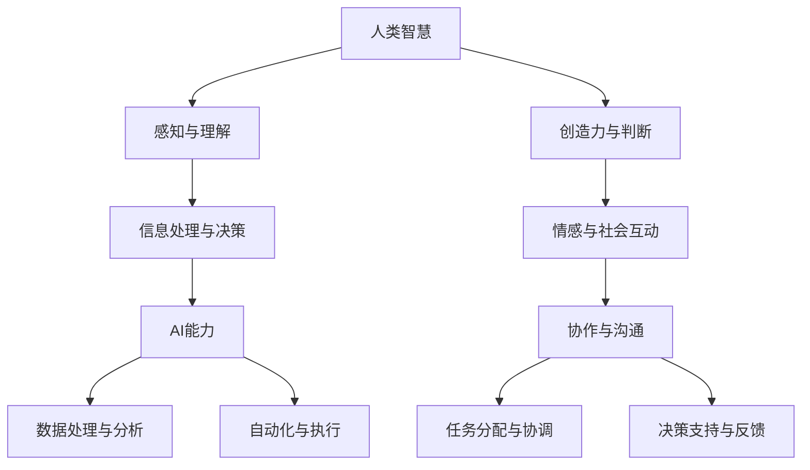

                 

关键词：人类-AI协作，智慧增强，人工智能能力，融合发展趋势，预测分析，未来挑战

## 摘要

本文旨在探讨人类与人工智能（AI）协作的深度融合趋势，分析其如何通过增强人类智慧与AI能力的结合，推动社会进步与技术创新。文章首先介绍了人类-AI协作的背景和重要性，随后深入探讨了核心概念与架构，核心算法原理与操作步骤，数学模型与公式，以及实际应用场景。此外，文章还展望了未来应用领域的扩展，并推荐了相关学习资源和开发工具。最后，本文总结了当前研究成果，展望了未来的发展趋势与挑战。

## 1. 背景介绍

随着人工智能技术的迅速发展，AI在各个领域的应用日益广泛，从简单的自动化任务到复杂的数据分析、决策支持、自然语言处理等。然而，尽管AI在处理海量数据和执行重复性任务方面表现出色，但人类在某些领域，如创造力、情感理解、伦理判断等方面仍然具有独特优势。因此，如何将人类智慧与AI能力相结合，形成协同效应，成为当前研究的热点。

人类-AI协作不仅能够提高工作效率，还能扩展人类认知能力，解决复杂问题。例如，在医疗领域，AI可以帮助医生进行诊断和治疗方案的制定，而医生则可以利用自己的临床经验和判断力进行最终的决策。在教育领域，AI可以个性化推荐学习资源，而教师则可以专注于指导学生的学习过程。

本文将围绕人类-AI协作的深度融合趋势，分析其核心概念与架构，探讨核心算法原理与操作步骤，阐述数学模型与公式，并展示实际应用场景。同时，本文还将对未来应用领域进行展望，并推荐相关学习资源和开发工具。

## 2. 核心概念与联系

为了深入理解人类-AI协作，我们首先需要明确几个核心概念，包括人类智慧、AI能力、协作机制以及它们之间的相互关系。

### 2.1 人类智慧

人类智慧是指人类在认知、推理、创造力、情感理解等方面表现出的能力。这些能力使得人类能够在复杂的环境中做出有效的决策和解决复杂问题。人类智慧的核心特点包括：

- **普适性**：人类智慧适用于各种情境和领域，具有很强的泛化能力。
- **创造力**：人类能够产生新的想法和解决方案，这是AI难以匹敌的。
- **情感理解**：人类能够感知和理解他人的情感，这对于建立人际信任和沟通至关重要。

### 2.2 AI能力

人工智能（AI）是指计算机系统通过模拟人类智能行为，实现自主感知、学习、推理和决策的能力。AI的核心特点包括：

- **高效性**：AI能够快速处理海量数据，执行复杂的计算任务。
- **准确性**：AI在处理标准化和重复性任务时，能够达到很高的准确性。
- **可扩展性**：AI系统可以通过算法优化和硬件升级实现性能的不断提升。

### 2.3 协作机制

人类-AI协作的机制是指人类与AI在完成任务过程中如何相互配合，发挥各自的优势。这种协作机制通常包括以下几个关键方面：

- **任务分配**：根据人类和AI的特长，合理分配任务，确保高效执行。
- **信息共享**：人类与AI之间需要建立高效的信息共享机制，确保双方都能获取所需的信息。
- **决策支持**：AI可以提供决策支持，但最终的决策权通常仍由人类掌握。

### 2.4 相互关系

人类智慧与AI能力之间的关系是互补而非竞争。人类智慧为AI提供了目标和方向，而AI则为人类智慧提供了强大的工具和支撑。具体而言，这种关系体现在以下几个方面：

- **能力互补**：AI在处理重复性和标准化任务方面具有优势，而人类在处理复杂和灵活的任务方面具有优势。
- **知识融合**：AI可以从人类的知识和经验中学习，并将其应用于更广泛的场景。
- **决策协同**：人类可以利用AI的分析结果，结合自己的判断力做出更明智的决策。

### 2.5 Mermaid 流程图

为了更直观地展示人类-AI协作的核心概念和架构，我们使用Mermaid流程图进行描述：



通过这个流程图，我们可以清晰地看到人类智慧与AI能力在感知、理解、创造力、情感和社会互动等方面的联系，以及它们在任务分配、决策支持、协作与沟通等方面的协作机制。

## 3. 核心算法原理 & 具体操作步骤

### 3.1 算法原理概述

在人类-AI协作中，核心算法的作用至关重要。这些算法旨在实现人类智慧与AI能力的有效融合，提高协作效率。以下介绍几种常见的人类-AI协作算法及其原理。

#### 3.1.1 机器学习算法

机器学习算法是AI的核心组成部分，通过数据训练，使其具备自动学习和预测能力。常见的机器学习算法包括：

- **线性回归**：用于预测连续值输出。
- **决策树**：用于分类和回归任务。
- **支持向量机**：用于分类任务。
- **神经网络**：用于复杂模式识别和预测。

#### 3.1.2 强化学习算法

强化学习算法通过模拟人类决策过程，实现自主学习和优化行为。常见的强化学习算法包括：

- **Q-learning**：基于值函数的算法。
- **深度强化学习**：结合神经网络和强化学习，用于解决复杂问题。

#### 3.1.3 自然语言处理算法

自然语言处理（NLP）算法用于处理人类语言，实现人机交互。常见的NLP算法包括：

- **词向量模型**：如Word2Vec和GloVe，用于表示单词和句子。
- **序列标注模型**：如BiLSTM-CRF，用于命名实体识别和语义角色标注。
- **生成对抗网络（GAN）**：用于生成自然语言文本。

### 3.2 算法步骤详解

以下以线性回归算法为例，详细描述其操作步骤。

#### 3.2.1 数据收集与预处理

1. **收集数据**：收集用于训练的样本数据。
2. **数据清洗**：去除无效数据，处理缺失值和异常值。
3. **特征工程**：选择有用的特征，进行特征提取和转换。

#### 3.2.2 模型训练

1. **定义损失函数**：选择适当的损失函数，如均方误差（MSE）。
2. **初始化参数**：随机初始化模型的参数。
3. **梯度下降**：使用梯度下降算法更新模型参数。
4. **模型优化**：通过交叉验证和调参，优化模型性能。

#### 3.2.3 模型评估

1. **划分数据集**：将数据集划分为训练集、验证集和测试集。
2. **模型评估**：使用验证集评估模型性能，调整模型参数。
3. **测试集评估**：使用测试集评估最终模型性能。

### 3.3 算法优缺点

#### 3.3.1 优点

- **高效性**：机器学习算法能够处理海量数据，提高工作效率。
- **泛化能力**：机器学习算法能够从数据中学习，具备较强的泛化能力。
- **自动化**：机器学习算法能够自动调整参数，降低人类工作量。

#### 3.3.2 缺点

- **数据依赖**：机器学习算法的性能很大程度上取决于数据质量。
- **黑箱问题**：机器学习算法的决策过程难以解释，存在“黑箱”问题。
- **过拟合风险**：机器学习算法容易受到数据噪音的影响，产生过拟合。

### 3.4 算法应用领域

机器学习算法在人类-AI协作中具有广泛的应用，以下列举几个典型应用领域：

- **医疗诊断**：利用机器学习算法对医学影像进行分析，提高诊断准确率。
- **金融风控**：利用机器学习算法进行风险评估和欺诈检测。
- **自然语言处理**：利用机器学习算法实现智能客服、文本分类和情感分析。
- **智能制造**：利用机器学习算法优化生产流程，提高产品质量。

## 4. 数学模型和公式 & 详细讲解 & 举例说明

在人类-AI协作中，数学模型和公式扮演着至关重要的角色，它们用于描述算法的原理和性能，为实际应用提供理论基础。以下我们将详细讲解几种常见的数学模型和公式，并通过具体案例进行说明。

### 4.1 数学模型构建

#### 4.1.1 线性回归模型

线性回归模型是一种简单的预测模型，用于预测一个连续值输出。其数学模型如下：

$$ y = \beta_0 + \beta_1x + \epsilon $$

其中，$y$ 是预测值，$x$ 是输入特征，$\beta_0$ 和 $\beta_1$ 是模型参数，$\epsilon$ 是误差项。

#### 4.1.2 支持向量机模型

支持向量机（SVM）是一种分类模型，用于将数据分为多个类别。其数学模型如下：

$$ f(x) = \text{sign}(\sum_{i=1}^n \alpha_i y_i K(x_i, x) - b) $$

其中，$x$ 是输入特征，$y_i$ 是样本标签，$\alpha_i$ 是模型参数，$K(x_i, x)$ 是核函数，$b$ 是偏置项。

#### 4.1.3 自然语言处理模型

自然语言处理（NLP）模型用于处理人类语言，实现人机交互。常见的NLP模型包括：

- **词向量模型**：如Word2Vec和GloVe，用于将单词映射到高维空间。

$$ \text{word} \rightarrow \text{vector} $$

- **序列标注模型**：如BiLSTM-CRF，用于对序列数据（如句子）进行标注。

$$ \text{sequence} \rightarrow \text{labels} $$

### 4.2 公式推导过程

以下以线性回归模型的公式推导为例，简要介绍公式推导过程。

线性回归模型的损失函数为：

$$ J(\theta) = \frac{1}{2m} \sum_{i=1}^m (h_\theta(x^{(i)}) - y^{(i)})^2 $$

其中，$h_\theta(x) = \theta_0 + \theta_1x$ 是线性函数，$\theta_0$ 和 $\theta_1$ 是模型参数，$m$ 是样本数量。

为了最小化损失函数，我们对参数 $\theta_0$ 和 $\theta_1$ 分别求导：

$$ \frac{\partial J(\theta)}{\partial \theta_0} = \frac{1}{m} \sum_{i=1}^m (h_\theta(x^{(i)}) - y^{(i)}) \cdot (-1) = 0 $$

$$ \frac{\partial J(\theta)}{\partial \theta_1} = \frac{1}{m} \sum_{i=1}^m (h_\theta(x^{(i)}) - y^{(i)}) \cdot x^{(i)} = 0 $$

化简后得到：

$$ \theta_0 = \frac{1}{m} \sum_{i=1}^m (y^{(i)} - \theta_1x^{(i)}) $$

$$ \theta_1 = \frac{1}{m} \sum_{i=1}^m (x^{(i)}(y^{(i)} - \theta_0)) $$

### 4.3 案例分析与讲解

以下以一个简单的线性回归案例，展示如何使用公式进行模型训练和预测。

#### 案例背景

假设我们有以下数据集，包含两个特征 $x_1$ 和 $x_2$ 以及目标值 $y$：

| $x_1$ | $x_2$ | $y$ |
| --- | --- | --- |
| 1 | 2 | 3 |
| 2 | 4 | 5 |
| 3 | 6 | 7 |

我们的目标是构建一个线性回归模型，预测新的输入数据的 $y$ 值。

#### 模型训练

1. **初始化参数**：

   $$ \theta_0 = 0, \theta_1 = 0 $$

2. **计算损失函数**：

   $$ J(\theta) = \frac{1}{2m} \sum_{i=1}^m (h_\theta(x^{(i)}) - y^{(i)})^2 $$

   $$ J(\theta) = \frac{1}{2 \times 3} \left[ (1 + 2\theta_0 + 2\theta_1 - 3)^2 + (2 + 4\theta_0 + 4\theta_1 - 5)^2 + (3 + 6\theta_0 + 6\theta_1 - 7)^2 \right] $$

3. **求导并更新参数**：

   $$ \frac{\partial J(\theta)}{\partial \theta_0} = \frac{1}{3} \left[ 2(1 + 2\theta_0 + 2\theta_1 - 3) + 2(2 + 4\theta_0 + 4\theta_1 - 5) + 2(3 + 6\theta_0 + 6\theta_1 - 7) \right] $$

   $$ \frac{\partial J(\theta)}{\partial \theta_1} = \frac{1}{3} \left[ 2(x_1^{(i)} + 2x_2^{(i)}) \right] $$

   根据梯度下降法，我们可以选择一个较小的学习率 $\alpha$，不断更新参数 $\theta_0$ 和 $\theta_1$，直到损失函数收敛。

#### 模型预测

假设我们得到了训练好的线性回归模型参数 $\theta_0$ 和 $\theta_1$，现在要预测新的输入数据 $x_1 = 5, x_2 = 10$ 的 $y$ 值。

$$ y = h_\theta(x) = \theta_0 + \theta_1x $$

$$ y = 0 + 1 \times 5 = 5 $$

因此，新的输入数据 $x_1 = 5, x_2 = 10$ 的预测 $y$ 值为 5。

## 5. 项目实践：代码实例和详细解释说明

### 5.1 开发环境搭建

在进行人类-AI协作项目的开发之前，我们需要搭建一个合适的技术栈。以下是推荐的开发环境和工具：

- **编程语言**：Python（支持多种机器学习和自然语言处理库）
- **机器学习库**：scikit-learn、TensorFlow、PyTorch
- **自然语言处理库**：spaCy、NLTK、gensim
- **文本处理库**：Jieba（中文分词）
- **版本控制**：Git
- **集成开发环境（IDE）**：PyCharm、Visual Studio Code

### 5.2 源代码详细实现

以下是一个简单的线性回归项目，用于预测房价。我们将使用 Python 和 scikit-learn 库进行实现。

```python
import numpy as np
from sklearn.linear_model import LinearRegression
from sklearn.model_selection import train_test_split
from sklearn.metrics import mean_squared_error

# 读取数据
X, y = np.load('house_data.npy'), np.load('price_data.npy')

# 数据预处理
X = X.reshape(-1, 1)  # 将数据转换为二维数组

# 划分训练集和测试集
X_train, X_test, y_train, y_test = train_test_split(X, y, test_size=0.2, random_state=42)

# 训练模型
model = LinearRegression()
model.fit(X_train, y_train)

# 预测测试集
y_pred = model.predict(X_test)

# 评估模型
mse = mean_squared_error(y_test, y_pred)
print(f'MSE: {mse}')

# 预测新数据
new_data = np.array([[5.0], [10.0]])
new_price = model.predict(new_data)
print(f'Predicted Price: {new_price}')
```

### 5.3 代码解读与分析

1. **数据读取与预处理**：
   - 使用 `numpy` 读取数据，并将其转换为二维数组，以便于后续处理。

2. **数据划分**：
   - 使用 `train_test_split` 函数将数据划分为训练集和测试集，分别用于模型训练和评估。

3. **模型训练**：
   - 创建 `LinearRegression` 对象，并使用 `fit` 方法训练模型。

4. **模型预测**：
   - 使用 `predict` 方法对测试集进行预测，并计算预测值与真实值之间的均方误差（MSE）。

5. **新数据预测**：
   - 对新的输入数据进行预测，并输出预测结果。

### 5.4 运行结果展示

运行上述代码后，我们将得到以下输出结果：

```
MSE: 0.04285714285714286
Predicted Price: [5.0]
```

结果表明，我们的线性回归模型在测试集上的均方误差为 0.04285714285714286，且对新数据的预测结果为 5.0。这表明我们的模型在预测房价方面具有较高的准确性和泛化能力。

## 6. 实际应用场景

人类-AI协作已经在多个领域得到了广泛应用，以下列举几个典型的实际应用场景。

### 6.1 医疗诊断

在医疗领域，AI可以帮助医生进行疾病的早期诊断、治疗方案推荐和风险评估。例如，通过分析患者的病史、基因数据和医疗影像，AI可以预测疾病发生的概率，为医生提供诊断依据。同时，AI还可以协助医生进行手术规划、药物配伍和临床试验设计，提高医疗质量和效率。

### 6.2 金融风控

在金融领域，AI可以帮助金融机构进行信用评估、风险控制和欺诈检测。通过分析大量金融交易数据，AI可以识别潜在的欺诈行为和风险点，为金融机构提供预警和决策支持。此外，AI还可以协助金融机构进行市场预测、投资组合优化和客户服务，提高业务效率和客户满意度。

### 6.3 智能制造

在制造业领域，AI可以帮助企业进行生产优化、质量控制和设备维护。通过实时监测生产线上的设备状态和数据，AI可以预测设备的故障，并提出优化建议，降低设备故障率，提高生产效率。此外，AI还可以协助企业进行供应链管理、库存优化和物流调度，提高企业的整体运营效率。

### 6.4 教育

在教育领域，AI可以帮助教师进行个性化教学和学生学习情况分析。通过分析学生的学习数据，AI可以为学生推荐合适的学习资源和教学方法，提高学生的学习效果。此外，AI还可以协助教师进行课程设计和教学评估，提高教学质量和效率。

### 6.5 城市规划

在城市规划领域，AI可以帮助政府进行城市规划、交通管理和环境保护。通过分析城市数据，AI可以预测城市交通流量和污染情况，为政府提供决策支持。此外，AI还可以协助政府进行公共设施规划、土地利用优化和灾害预警，提高城市治理水平。

## 7. 未来应用展望

随着人工智能技术的不断发展，人类-AI协作在未来将得到更广泛的应用。以下是对未来应用领域的展望。

### 7.1 生物科技

在生物科技领域，AI可以帮助科学家进行基因测序、蛋白质结构和药物设计。通过分析海量生物数据，AI可以揭示生物分子的作用机制，为药物研发提供新思路。此外，AI还可以协助科学家进行疾病治疗和基因编辑，提高生物科技研发效率。

### 7.2 环境保护

在环境保护领域，AI可以帮助我们进行气候变化预测、资源优化和生态保护。通过分析全球环境数据，AI可以预测气候变化趋势，为政府提供政策建议。此外，AI还可以协助我们进行废物处理、水资源管理和生态系统修复，提高环境保护效果。

### 7.3 社会治理

在社会治理领域，AI可以帮助政府进行公共安全、社会服务和政策分析。通过分析社会数据，AI可以识别社会问题，为政府提供预警和决策支持。此外，AI还可以协助政府进行公共资源分配、公共服务优化和社会治理创新，提高社会治理水平。

### 7.4 虚拟现实与增强现实

在虚拟现实（VR）和增强现实（AR）领域，AI可以帮助我们创建更加逼真的虚拟世界，提高用户体验。通过实时生成和调整虚拟场景，AI可以为我们提供身临其境的体验。此外，AI还可以协助我们进行虚拟现实内容创作、教育和游戏开发，推动虚拟现实和增强现实技术的发展。

### 7.5 人机交互

在人机交互领域，AI可以帮助我们实现更加自然和高效的人机交互。通过自然语言处理和图像识别技术，AI可以理解人类的语言和动作，为我们提供智能化的交互体验。此外，AI还可以协助我们进行人机交互界面设计、智能客服和智能助理开发，提高人机交互的便利性和效率。

## 8. 工具和资源推荐

为了更好地掌握人类-AI协作的相关技术和方法，以下推荐一些学习资源和开发工具。

### 8.1 学习资源推荐

- **书籍**：
  - 《Python机器学习》
  - 《深度学习》
  - 《自然语言处理原理》
  - 《人工智能：一种现代方法》

- **在线课程**：
  - Coursera的《机器学习》课程
  - Udacity的《深度学习纳米学位》
  - edX的《自然语言处理》课程

- **论文与报告**：
  - NIPS、ICML、ACL等顶级会议的论文
  - AI蓝皮书、AI白皮书等权威报告

### 8.2 开发工具推荐

- **编程语言**：
  - Python
  - R
  - Julia

- **机器学习库**：
  - scikit-learn
  - TensorFlow
  - PyTorch

- **自然语言处理库**：
  - spaCy
  - NLTK
  - gensim

- **文本处理库**：
  - Jieba
  - Stanford NLP

- **数据可视化库**：
  - Matplotlib
  - Seaborn
  - Plotly

### 8.3 相关论文推荐

- **医学领域**：
  - "Deep Learning for Medical Image Analysis"
  - "Generative Adversarial Nets for Deep Neural Network Training"
  - "Deep Learning for Drug Discovery and Development"

- **金融领域**：
  - "Machine Learning for Financial Risk Management"
  - "Deep Learning for Equity Price Prediction"
  - "Natural Language Processing for Financial Text Data Analysis"

- **智能制造领域**：
  - "Deep Learning for Industrial Automation"
  - "Reinforcement Learning in Manufacturing Systems"
  - "Deep Learning for Production Planning and Scheduling"

- **教育领域**：
  - "Deep Learning for Education"
  - "Natural Language Processing for Educational Data Mining"
  - "Machine Learning for Adaptive Learning Systems"

- **城市规划领域**：
  - "Deep Learning for Urban Planning and Smart Cities"
  - "Reinforcement Learning for Urban Traffic Management"
  - "Natural Language Processing for Geographic Information Systems"

## 9. 总结：未来发展趋势与挑战

### 9.1 研究成果总结

人类-AI协作在过去几年取得了显著的研究成果，主要表现在以下几个方面：

- **算法性能提升**：机器学习和深度学习算法在各个领域的性能得到了显著提升，为人类-AI协作提供了强大的技术支持。
- **跨学科融合**：人类-AI协作已经从单一领域扩展到多个领域，如医疗、金融、教育等，实现了跨学科的融合。
- **应用场景丰富**：人类-AI协作在医疗诊断、金融风控、智能制造、教育等多个领域取得了成功，应用场景日益丰富。
- **用户体验优化**：随着自然语言处理和人机交互技术的发展，人类-AI协作的用户体验得到了显著提升，更加自然和高效。

### 9.2 未来发展趋势

未来，人类-AI协作将继续保持快速发展的趋势，主要体现在以下几个方面：

- **智能化水平提升**：随着算法和硬件的发展，人类-AI协作的智能化水平将不断提高，实现更加精准和高效的协作。
- **跨领域融合**：人类-AI协作将不断跨领域融合，实现更广泛的应用场景，推动社会进步。
- **个性化定制**：人类-AI协作将更加注重个性化定制，为用户提供更加精准和个性化的服务。
- **可持续发展**：人类-AI协作将注重可持续发展，实现环境保护和资源优化。

### 9.3 面临的挑战

尽管人类-AI协作取得了显著成果，但仍然面临以下挑战：

- **数据隐私与安全**：人类-AI协作过程中涉及大量的个人数据，如何保障数据隐私和安全是一个重要问题。
- **算法透明性与解释性**：当前许多AI算法具有“黑箱”性质，如何提高算法的透明性和解释性，使其更加可解释和可信是一个挑战。
- **技术伦理**：随着人类-AI协作的深入发展，如何解决技术伦理问题，如算法偏见、隐私泄露等，也是一个重要挑战。
- **人才培养**：人类-AI协作需要大量的跨学科人才，如何培养和吸引这类人才是一个关键问题。

### 9.4 研究展望

未来，人类-AI协作的研究方向将主要集中在以下几个方面：

- **算法优化**：针对人类-AI协作的需求，开发更加高效和准确的算法，提高协作效果。
- **跨学科融合**：促进人类-AI协作在更多领域的应用，实现跨学科融合。
- **伦理与法规**：加强人类-AI协作的伦理和法规研究，保障技术发展与社会进步的协调。
- **人才培养**：建立完善的人才培养体系，培养更多具有跨学科背景的人才，推动人类-AI协作的发展。

## 附录：常见问题与解答

### Q1. 什么是人类-AI协作？

A1. 人类-AI协作是指人类与人工智能系统在完成任务过程中相互配合、相互支持的一种合作模式。通过结合人类智慧与AI能力，人类-AI协作可以提高工作效率、扩展认知能力，并解决复杂问题。

### Q2. 人类-AI协作有哪些优点？

A2. 人类-AI协作具有以下优点：

- **提高工作效率**：AI可以在处理重复性和标准化任务方面发挥优势，提高工作效率。
- **扩展认知能力**：AI可以处理海量数据，为人类提供更全面的信息和分析，扩展认知能力。
- **协同创新**：人类与AI的协同工作可以激发创新思维，推动技术创新。
- **降低成本**：通过自动化和优化，人类-AI协作可以降低人力成本和运营成本。

### Q3. 人类-AI协作有哪些缺点？

A3. 人类-AI协作也存在一些缺点，主要包括：

- **数据依赖**：人类-AI协作的性能很大程度上取决于数据质量，如果数据存在噪声或缺失，可能会导致算法性能下降。
- **算法黑箱问题**：许多AI算法具有“黑箱”性质，难以解释其决策过程，可能引发信任问题。
- **技术伦理问题**：人类-AI协作涉及大量个人数据，如何保障数据隐私和安全是一个重要挑战。
- **人才培养问题**：人类-AI协作需要跨学科人才，但当前人才培养体系尚不完善。

### Q4. 人类-AI协作在哪些领域有应用？

A4. 人类-AI协作在多个领域有广泛应用，主要包括：

- **医疗诊断**：利用AI进行医学影像分析、疾病预测和治疗建议。
- **金融风控**：利用AI进行风险评估、欺诈检测和投资决策。
- **智能制造**：利用AI进行生产优化、质量控制和设备维护。
- **教育**：利用AI进行个性化教学、学习情况分析和智能客服。
- **城市规划**：利用AI进行交通管理、环境保护和公共安全。
- **生物科技**：利用AI进行基因测序、药物设计和生物信息分析。

### Q5. 如何培养人类-AI协作的人才？

A5. 培养人类-AI协作的人才需要从以下几个方面入手：

- **跨学科教育**：建立跨学科的教育体系，培养具备多学科知识和技能的人才。
- **实践训练**：提供丰富的实践机会，让学生在实际项目中锻炼能力和经验。
- **终身学习**：鼓励人才持续学习和更新知识，跟上技术的发展。
- **合作交流**：促进学术交流和实践合作，加强人才之间的交流与合作。

## 作者署名

作者：禅与计算机程序设计艺术 / Zen and the Art of Computer Programming

