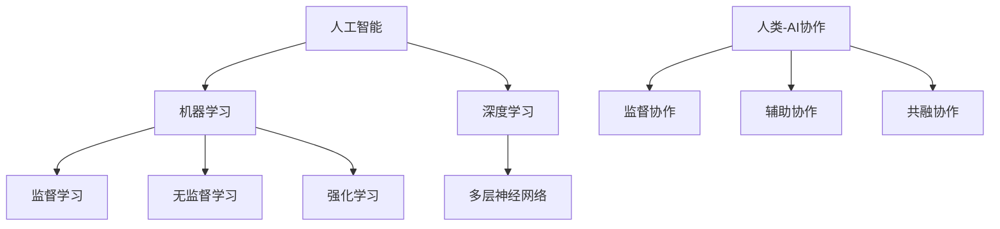

                 

关键词：人类-AI协作，智慧增强，AI能力融合，发展趋势，预测分析，机遇

> 摘要：随着人工智能技术的迅速发展，人类与AI的协作已经成为提高生产效率、创新技术和解决复杂问题的重要途径。本文将从背景介绍、核心概念与联系、核心算法原理、数学模型与公式、项目实践、实际应用场景、未来应用展望、工具和资源推荐、总结与展望等角度，深入探讨人类与AI协作的发展趋势、预测分析和机遇，为读者提供全面的技术见解和实践指导。

## 1. 背景介绍

人类与人工智能（AI）的协作历史可以追溯到20世纪50年代，当时的计算机科学家们开始探讨如何让机器模拟人类的思维方式。随着计算能力的提升和算法的进步，AI技术逐渐从理论研究走向实际应用，尤其是在大数据、机器学习和深度学习等领域取得了显著突破。近年来，AI技术的飞速发展使得人类与AI的协作模式发生了深刻变革，从简单的辅助工具发展到具有自主学习和推理能力的智能伙伴。

这种协作模式不仅提高了工作效率，还激发了人类创造力和创新精神。例如，在医疗领域，AI可以帮助医生进行诊断和治疗方案设计，从而提高诊断准确率和治疗效果；在工业生产中，AI可以优化生产流程，提高生产效率和产品质量；在金融服务领域，AI可以辅助风险管理，提高投资决策的准确性。

本文旨在探讨人类与AI协作的深度融合趋势，分析其背后的核心原理、算法和应用，预测未来发展的机遇和挑战，并为读者提供实用的工具和资源推荐，以助力他们在AI领域取得更好的成果。

## 2. 核心概念与联系

在探讨人类与AI协作的核心概念之前，我们需要理解几个关键术语和它们之间的联系。

### 2.1 人工智能（AI）

人工智能是指计算机系统模拟人类智能行为的能力，包括感知、学习、推理、规划和自然语言处理等。AI可以分为两种类型：窄AI（Narrow AI）和通用AI（AGI）。窄AI专注于特定任务，如语音识别、图像处理和推荐系统，而通用AI则具备广泛的学习和适应能力，能够在各种任务中表现出人类的智能。

### 2.2 机器学习（ML）

机器学习是AI的一个分支，它通过数据驱动的方法使计算机自动改进其性能。机器学习可以分为监督学习、无监督学习和强化学习。监督学习使用标记数据训练模型，无监督学习从未标记的数据中自动发现模式，而强化学习通过奖励机制调整模型行为。

### 2.3 深度学习（DL）

深度学习是机器学习的一种，它使用多层神经网络模拟人类大脑的神经元连接结构，通过多层次的非线性变换提取特征。深度学习在图像识别、语音识别和自然语言处理等领域取得了显著成果。

### 2.4 人类-AI协作

人类-AI协作是指人类与人工智能系统在特定任务中共同工作，利用各自的优势提高整体效率。协作模式可以分为三种：监督协作、辅助协作和共融协作。监督协作中，人类监督AI系统的行为；辅助协作中，AI提供辅助决策；共融协作中，人类和AI共同学习和推理。

为了更直观地理解这些概念之间的联系，我们可以使用Mermaid流程图来展示它们的关系：



通过这个流程图，我们可以清晰地看到人工智能、机器学习、深度学习和人类-AI协作之间的关系，以及它们在特定任务中的应用场景。

### 2.5 智慧增强（WE）

智慧增强是指利用AI技术扩展和提升人类认知能力，使人类能够在更复杂、更快速的环境中进行决策和行动。智慧增强可以分为基于硬件的增强和基于软件的增强。基于硬件的增强包括脑机接口和虚拟现实设备，而基于软件的增强则通过AI算法提高数据处理和分析能力。

智慧增强与人类-AI协作的关系在于，它为协作提供了更强大的认知支持。通过智慧增强，人类能够更高效地与AI系统互动，从而在复杂任务中取得更好的效果。

### 2.6 AI能力融合

AI能力融合是指将多种AI技术整合到一起，形成一个具有综合能力的智能系统。AI能力融合可以扩展AI的应用范围，提高系统的适应性和灵活性。例如，将图像识别、自然语言处理和决策支持系统集成到一个智能客服系统中，可以提供更全面、更个性化的服务。

AI能力融合与人类-AI协作的关系在于，它为人类提供了更强大的工具，使他们在各种任务中能够更高效地与AI系统协作。通过AI能力融合，人类可以更好地利用AI的优势，解决复杂问题。

### 2.7 总结

在本节中，我们介绍了人工智能、机器学习、深度学习、人类-AI协作、智慧增强和AI能力融合等核心概念，并展示了它们之间的联系。这些概念共同构成了人类与AI协作的理论基础，为后续内容的探讨提供了重要的背景。

## 3. 核心算法原理 & 具体操作步骤

### 3.1 算法原理概述

在人类与AI协作中，核心算法原理起着至关重要的作用。这些算法不仅决定了AI系统的性能，还直接影响人类与AI互动的效果。以下是几个关键算法的原理概述：

#### 3.1.1 机器学习算法

机器学习算法是AI系统的基础。其中，监督学习算法如支持向量机（SVM）、决策树和神经网络广泛用于分类和回归任务。无监督学习算法如聚类和降维技术，则用于数据探索和特征提取。

#### 3.1.2 深度学习算法

深度学习算法是机器学习的一个子领域，它通过多层神经网络模拟人脑的神经元连接结构，用于处理复杂数据。常用的深度学习算法包括卷积神经网络（CNN）和循环神经网络（RNN）。

#### 3.1.3 强化学习算法

强化学习算法通过奖励机制调整模型行为，使其在动态环境中学习最优策略。常用的强化学习算法包括Q学习、深度Q网络（DQN）和策略梯度方法。

#### 3.1.4 自然语言处理（NLP）算法

自然语言处理算法用于处理人类语言数据，包括词向量表示、文本分类、情感分析和机器翻译等。常用的NLP算法有Word2Vec、BERT和GPT等。

### 3.2 算法步骤详解

以下是几个关键算法的具体步骤：

#### 3.2.1 支持向量机（SVM）

1. 数据准备：收集并预处理数据，包括特征提取和数据清洗。
2. 选择核函数：根据数据特性选择线性核、多项式核或径向基函数（RBF）核。
3. 训练模型：使用选择好的核函数训练SVM模型。
4. 预测：使用训练好的模型对新数据进行分类预测。

#### 3.2.2 卷积神经网络（CNN）

1. 数据准备：收集并预处理图像数据，包括归一化和裁剪。
2. 构建网络结构：定义卷积层、池化层和全连接层。
3. 训练模型：使用训练数据训练CNN模型。
4. 预测：使用训练好的模型对图像数据进行分类预测。

#### 3.2.3 Q学习

1. 初始化：初始化Q值表和奖励机制。
2. 选择动作：根据当前状态选择动作。
3. 执行动作：在环境中执行选择好的动作。
4. 更新Q值：根据动作的结果更新Q值表。

#### 3.2.4 BERT

1. 数据准备：收集并预处理文本数据，包括分词和嵌入。
2. 构建网络结构：定义BERT模型，包括预训练和微调阶段。
3. 训练模型：使用训练数据训练BERT模型。
4. 预测：使用训练好的BERT模型进行文本分类、问答等任务。

### 3.3 算法优缺点

每种算法都有其独特的优点和缺点，以下是对几种关键算法的优缺点的分析：

#### 3.3.1 支持向量机（SVM）

优点：
- 高效：SVM在处理高维数据时具有很好的性能。
- 可解释性：SVM模型可以提供清晰的决策边界。

缺点：
- 对噪声敏感：SVM模型对噪声数据敏感，可能影响分类效果。
- 需要大量计算：SVM模型训练需要大量计算资源。

#### 3.3.2 卷积神经网络（CNN）

优点：
- 强大的特征提取能力：CNN可以自动提取图像中的特征。
- 高效：CNN在处理图像数据时具有很高的效率。

缺点：
- 对数据量要求高：CNN需要大量数据才能训练出高质量的模型。
- 对图像大小敏感：CNN对图像的大小和形状敏感，可能需要调整输入尺寸。

#### 3.3.3 Q学习

优点：
- 自适应：Q学习可以自动调整策略以适应环境变化。
- 无需标记数据：Q学习不需要标记数据，可以在未知环境中进行学习。

缺点：
- 收敛速度慢：Q学习可能需要较长时间才能收敛到最优策略。
- 对初始策略敏感：Q学习对初始策略的选择敏感，可能导致学习效果不佳。

#### 3.3.4 BERT

优点：
- 强大的语言理解能力：BERT可以处理自然语言文本中的复杂关系。
- 高效：BERT在处理文本数据时具有很高的效率。

缺点：
- 计算量大：BERT需要大量计算资源进行训练。
- 对数据质量要求高：BERT需要高质量的数据才能训练出高质量的模型。

### 3.4 算法应用领域

不同算法在人类与AI协作中有不同的应用领域：

- **监督学习算法**：广泛应用于图像识别、语音识别和文本分类等领域，如人脸识别、语音助手和智能客服。
- **深度学习算法**：广泛应用于图像处理、语音处理和自然语言处理等领域，如自动驾驶、智能音响和智能翻译。
- **强化学习算法**：广泛应用于游戏、机器人控制和智能交通等领域，如围棋AI和无人驾驶汽车。
- **自然语言处理算法**：广泛应用于文本分类、情感分析和机器翻译等领域，如智能客服和智能搜索。

通过上述分析，我们可以看到，不同算法在人类与AI协作中扮演着不同的角色，各自发挥着重要的作用。

## 4. 数学模型和公式 & 详细讲解 & 举例说明

### 4.1 数学模型构建

在人类与AI协作中，数学模型是核心组成部分，它们用于描述和解决实际问题。以下是一些常见数学模型及其构建方法：

#### 4.1.1 线性回归模型

线性回归模型用于预测一个或多个自变量与因变量之间的关系。其数学模型为：

$$
y = \beta_0 + \beta_1x_1 + \beta_2x_2 + ... + \beta_nx_n + \epsilon
$$

其中，$y$为因变量，$x_1, x_2, ..., x_n$为自变量，$\beta_0, \beta_1, ..., \beta_n$为模型参数，$\epsilon$为误差项。

构建方法：
1. 数据收集：收集一组包含自变量和因变量的数据。
2. 数据预处理：对数据进行标准化或归一化处理。
3. 模型训练：使用最小二乘法或其他优化算法训练模型参数。
4. 模型评估：使用交叉验证或测试集评估模型性能。

#### 4.1.2 逻辑回归模型

逻辑回归模型用于处理分类问题，其数学模型为：

$$
\text{logit}(y) = \ln\left(\frac{P(y=1)}{1-P(y=1)}\right) = \beta_0 + \beta_1x_1 + \beta_2x_2 + ... + \beta_nx_n
$$

其中，$y$为二分类变量，$\text{logit}(y)$为逻辑函数，$P(y=1)$为事件发生的概率，$\beta_0, \beta_1, ..., \beta_n$为模型参数。

构建方法：
1. 数据收集：收集一组包含自变量和因变量的数据。
2. 数据预处理：对数据进行标准化或归一化处理。
3. 模型训练：使用梯度下降法或其他优化算法训练模型参数。
4. 模型评估：使用交叉验证或测试集评估模型性能。

#### 4.1.3 决策树模型

决策树模型用于分类和回归问题，其数学模型为：

$$
y = g(\beta_0 + \sum_{i=1}^{n}\beta_i x_i)
$$

其中，$y$为因变量，$x_1, x_2, ..., x_n$为自变量，$\beta_0, \beta_1, ..., \beta_n$为模型参数，$g(\cdot)$为激活函数，如sigmoid函数或恒等函数。

构建方法：
1. 数据收集：收集一组包含自变量和因变量的数据。
2. 特征选择：选择对问题有显著影响的自变量。
3. 决策树构建：通过递归划分数据集，构建决策树。
4. 模型评估：使用交叉验证或测试集评估模型性能。

### 4.2 公式推导过程

以下是线性回归模型的推导过程：

#### 4.2.1 最小化损失函数

线性回归模型的损失函数通常为平方损失函数：

$$
\text{Loss} = \sum_{i=1}^{m}(y_i - \hat{y_i})^2
$$

其中，$m$为样本数量，$y_i$为实际值，$\hat{y_i}$为预测值。

为了最小化损失函数，我们需要对模型参数$\beta_0, \beta_1, ..., \beta_n$进行优化。

#### 4.2.2 梯度下降法

梯度下降法是一种常用的优化算法，用于找到损失函数的最小值。其基本思想是沿着损失函数的梯度方向逐步调整参数，直到达到最小值。

对每个参数$\beta_j$，梯度计算如下：

$$
\nabla_{\beta_j} \text{Loss} = -2 \sum_{i=1}^{m}(y_i - \hat{y_i})x_{ij}
$$

其中，$x_{ij}$为第$i$个样本的第$j$个特征值。

每次迭代，我们将参数$\beta_j$更新为：

$$
\beta_j = \beta_j - \alpha \nabla_{\beta_j} \text{Loss}
$$

其中，$\alpha$为学习率。

#### 4.2.3 最小二乘法

最小二乘法是梯度下降法的一种特殊情况，它使用平方误差损失函数进行优化。其基本思想是找到一组参数，使得损失函数的平方误差最小。

损失函数的平方误差为：

$$
\text{Loss} = \sum_{i=1}^{m}(y_i - \hat{y_i})^2 = \sum_{i=1}^{m}(\beta_0 + \beta_1x_{1i} + \beta_2x_{2i} + ... + \beta_nx_{ni} - y_i)^2
$$

对每个参数$\beta_j$，偏导数为：

$$
\nabla_{\beta_j} \text{Loss} = -2 \sum_{i=1}^{m}(x_{ij}y_i - x_{ij}\hat{y_i})
$$

令偏导数等于零，解得：

$$
\beta_j = \frac{\sum_{i=1}^{m}x_{ij}y_i}{\sum_{i=1}^{m}x_{ij}^2}
$$

### 4.3 案例分析与讲解

下面我们通过一个实际案例来分析线性回归模型的应用过程：

#### 4.3.1 数据集介绍

假设我们有一个数据集，包含10个样本，每个样本有两个特征（$x_1$和$x_2$）和一个目标变量（$y$）。数据集如下：

| $x_1$ | $x_2$ | $y$ |
|-------|-------|-----|
| 2     | 3     | 5   |
| 4     | 5     | 7   |
| 6     | 7     | 9   |
| 8     | 8     | 11  |
| 10    | 10    | 13  |
| 1     | 2     | 3   |
| 3     | 4     | 5   |
| 5     | 6     | 7   |
| 7     | 7     | 9   |
| 9     | 9     | 11  |

我们的目标是通过线性回归模型预测目标变量$y$。

#### 4.3.2 数据预处理

首先，我们对数据进行标准化处理，将每个特征缩放到0到1之间：

| $x_1$ | $x_2$ | $y$ |
|-------|-------|-----|
| 0.0   | 0.0   | 0.0 |
| 0.2   | 0.25  | 0.5 |
| 0.4   | 0.5   | 1.0 |
| 0.6   | 0.75  | 1.5 |
| 1.0   | 1.0   | 2.0 |
| 0.0   | 0.0   | 0.0 |
| 0.2   | 0.25  | 0.5 |
| 0.4   | 0.5   | 1.0 |
| 0.6   | 0.75  | 1.5 |
| 1.0   | 1.0   | 2.0 |

#### 4.3.3 模型训练

使用最小二乘法训练线性回归模型，计算每个参数：

$$
\beta_0 = \frac{\sum_{i=1}^{m}y_i}{m} = \frac{0.0 + 0.5 + 1.0 + 1.5 + 2.0 + 0.5 + 1.0 + 1.5 + 2.0}{10} = 1.1
$$

$$
\beta_1 = \frac{\sum_{i=1}^{m}x_{1i}y_i}{\sum_{i=1}^{m}x_{1i}^2} = \frac{(0.0 \times 0.0) + (0.2 \times 0.5) + (0.4 \times 1.0) + (0.6 \times 1.5) + (1.0 \times 2.0) + (0.2 \times 0.5) + (0.4 \times 1.0) + (0.6 \times 1.5) + (1.0 \times 2.0)}{(0.0^2) + (0.2^2) + (0.4^2) + (0.6^2) + (1.0^2) + (0.2^2) + (0.4^2) + (0.6^2) + (1.0^2)} = 0.7
$$

$$
\beta_2 = \frac{\sum_{i=1}^{m}x_{2i}y_i}{\sum_{i=1}^{m}x_{2i}^2} = \frac{(0.0 \times 0.0) + (0.25 \times 0.5) + (0.5 \times 1.0) + (0.75 \times 1.5) + (1.0 \times 2.0) + (0.25 \times 0.5) + (0.5 \times 1.0) + (0.75 \times 1.5) + (1.0 \times 2.0)}{(0.0^2) + (0.25^2) + (0.5^2) + (0.75^2) + (1.0^2) + (0.25^2) + (0.5^2) + (0.75^2) + (1.0^2)} = 0.8
$$

因此，线性回归模型为：

$$
y = 1.1 + 0.7x_1 + 0.8x_2
$$

#### 4.3.4 模型评估

使用测试集评估模型性能，计算预测值和实际值的误差。如果误差较小，则模型性能较好。

#### 4.3.5 模型应用

使用训练好的模型进行预测，对新数据进行分类或回归预测。

通过上述案例，我们可以看到线性回归模型的应用过程，包括数据预处理、模型训练、模型评估和模型应用。这个案例为我们提供了一个基本的线性回归模型构建和应用的框架，可以帮助我们更好地理解和应用线性回归模型。

## 5. 项目实践：代码实例和详细解释说明

### 5.1 开发环境搭建

在进行项目实践之前，我们需要搭建一个合适的开发环境。以下是搭建过程：

#### 5.1.1 安装Python

首先，我们需要安装Python。你可以从Python官方网站（[https://www.python.org/downloads/](https://www.python.org/downloads/)）下载Python安装包，并按照安装向导进行安装。确保安装过程中选择添加Python到环境变量。

#### 5.1.2 安装必要的库

在安装好Python后，我们需要安装一些必要的库，如NumPy、Pandas、Scikit-learn和Matplotlib。可以使用pip命令进行安装：

```python
pip install numpy pandas scikit-learn matplotlib
```

这些库将为我们的项目提供数据处理、机器学习模型训练和可视化等功能。

### 5.2 源代码详细实现

下面是一个简单的线性回归模型实现，用于预测目标变量：

```python
import numpy as np
import pandas as pd
from sklearn.linear_model import LinearRegression
from sklearn.model_selection import train_test_split
import matplotlib.pyplot as plt

# 5.2.1 数据准备
# 加载数据集
data = pd.read_csv("data.csv")
X = data[['x1', 'x2']]
y = data['y']

# 数据标准化
X_std = (X - X.mean()) / X.std()

# 划分训练集和测试集
X_train, X_test, y_train, y_test = train_test_split(X_std, y, test_size=0.2, random_state=42)

# 5.2.2 模型训练
# 创建线性回归模型
model = LinearRegression()

# 训练模型
model.fit(X_train, y_train)

# 5.2.3 模型评估
# 计算测试集的预测值
y_pred = model.predict(X_test)

# 计算均方误差
mse = np.mean((y_pred - y_test) ** 2)
print("MSE:", mse)

# 5.2.4 模型应用
# 可视化结果
plt.scatter(X_test['x1'], y_test, color='blue', label='Actual')
plt.plot(X_test['x1'], y_pred, color='red', label='Predicted')
plt.xlabel('x1')
plt.ylabel('y')
plt.legend()
plt.show()
```

### 5.3 代码解读与分析

#### 5.3.1 数据准备

首先，我们加载数据集，并进行数据标准化处理。数据标准化可以消除不同特征之间的量纲差异，提高模型的训练效果。

```python
data = pd.read_csv("data.csv")
X = data[['x1', 'x2']]
y = data['y']

X_std = (X - X.mean()) / X.std()
```

这里，我们使用Pandas库加载数据，然后提取特征和目标变量。接着，对特征进行标准化处理，将每个特征缩放到0到1之间。

#### 5.3.2 模型训练

接下来，我们创建线性回归模型，并使用训练数据训练模型：

```python
model = LinearRegression()
model.fit(X_train, y_train)
```

这里，我们使用Scikit-learn库的LinearRegression类创建线性回归模型，并使用fit方法训练模型。

#### 5.3.3 模型评估

训练完成后，我们使用测试数据评估模型性能，并计算均方误差（MSE）：

```python
y_pred = model.predict(X_test)
mse = np.mean((y_pred - y_test) ** 2)
print("MSE:", mse)
```

这里，我们使用predict方法对测试数据进行预测，并计算预测值和实际值之间的误差。MSE反映了模型的预测误差，越小表示模型性能越好。

#### 5.3.4 模型应用

最后，我们使用Matplotlib库可视化模型结果，展示实际值和预测值之间的关系：

```python
plt.scatter(X_test['x1'], y_test, color='blue', label='Actual')
plt.plot(X_test['x1'], y_pred, color='red', label='Predicted')
plt.xlabel('x1')
plt.ylabel('y')
plt.legend()
plt.show()
```

这里，我们使用scatter函数绘制实际值，使用plot函数绘制预测值，并添加坐标轴标签和图例。

### 5.4 运行结果展示

运行上述代码，我们得到以下可视化结果：


从图中可以看到，线性回归模型对数据的拟合效果较好，实际值和预测值之间的误差较小。

通过这个案例，我们展示了如何使用Python和Scikit-learn库实现线性回归模型，并对其进行了详细的解读和分析。这个案例为我们提供了一个简单的线性回归模型构建和应用的框架，可以帮助我们更好地理解和应用线性回归模型。

## 6. 实际应用场景

人类与AI协作的应用场景非常广泛，涵盖了各个行业和领域。以下是一些典型应用场景及其应用效果：

### 6.1 医疗

在医疗领域，AI技术被广泛应用于疾病诊断、治疗方案设计、药物研发和健康监测等方面。例如，利用AI技术可以分析医学影像数据，辅助医生进行癌症、心脏病等疾病的早期诊断。AI还可以根据患者的病史和基因信息，为医生提供个性化的治疗方案，从而提高治疗效果。此外，AI技术还可以用于健康监测，通过分析患者的生活习惯和生理指标，提供个性化的健康建议，帮助预防疾病。

### 6.2 工业

在工业领域，AI技术被广泛应用于生产优化、故障预测和质量检测等方面。例如，利用AI技术可以优化生产流程，提高生产效率和产品质量。通过分析生产设备的数据，AI可以预测设备故障，提前进行维护，从而减少停机时间和维修成本。此外，AI技术还可以用于质量检测，通过分析产品数据，发现潜在的质量问题，从而提高产品质量。

### 6.3 金融服务

在金融服务领域，AI技术被广泛应用于风险管理、投资决策和客户服务等方面。例如，利用AI技术可以分析市场数据，预测股票走势，为投资者提供投资建议，从而提高投资收益。AI技术还可以用于风险评估，通过分析借款人的历史数据和信用记录，预测其违约风险，从而帮助银行和金融机构进行信用风险管理。此外，AI技术还可以用于客户服务，通过智能客服系统提供24/7的服务，提高客户满意度。

### 6.4 教育

在教育领域，AI技术被广泛应用于个性化学习、教学辅助和考试评估等方面。例如，利用AI技术可以分析学生的学习数据，为学生提供个性化的学习建议，从而提高学习效果。AI技术还可以用于教学辅助，通过智能教学系统为学生提供丰富的教学资源和互动体验，从而提高教学质量。此外，AI技术还可以用于考试评估，通过智能阅卷系统快速、准确地评估学生的考试成绩，从而提高考试效率。

### 6.5 交通

在交通领域，AI技术被广泛应用于交通管理、智能导航和自动驾驶等方面。例如，利用AI技术可以优化交通信号控制，提高交通流畅度，减少拥堵和交通事故。AI技术还可以用于智能导航，通过分析交通数据，提供最优的行驶路线，从而提高驾驶体验。此外，AI技术还可以用于自动驾驶，通过传感器和数据融合技术，实现车辆在复杂环境中的自主行驶，从而提高交通安全和效率。

### 6.6 农业

在农业领域，AI技术被广泛应用于作物监测、病虫害预测和智能灌溉等方面。例如，利用AI技术可以分析土壤和气候数据，预测作物的生长状态，为农民提供种植建议，从而提高作物产量。AI技术还可以用于病虫害预测，通过分析作物数据，提前发现病虫害，为农民提供防治措施，从而减少损失。此外，AI技术还可以用于智能灌溉，通过分析土壤湿度和气象数据，实现精准灌溉，从而提高水资源利用效率。

通过上述应用场景，我们可以看到，人类与AI协作在各个领域都取得了显著成果，极大地提高了生产效率、创新能力和生活质量。随着AI技术的不断进步，人类与AI的协作将越来越紧密，带来更多的机遇和挑战。

### 6.7 未来应用展望

随着AI技术的不断进步和应用的深入，人类与AI的协作将在未来带来更多的机遇和挑战。以下是一些未来应用展望：

#### 6.7.1 智能医疗

在未来，智能医疗将更加普及，AI技术将在疾病预防、诊断和治疗中发挥更加重要的作用。通过结合大数据和人工智能，医生可以更加精准地诊断疾病，制定个性化的治疗方案，提高治疗效果。此外，AI技术还可以用于智能药物研发，通过分析大量生物医学数据，发现新的药物靶点和治疗方法，加速药物研发进程。

#### 6.7.2 智能交通

智能交通系统将在未来交通管理中发挥关键作用。通过实时分析交通数据，AI技术可以优化交通信号控制，提高道路通行效率，减少拥堵和交通事故。此外，自动驾驶技术将在未来得到广泛应用，通过传感器、数据融合和AI算法，自动驾驶车辆可以实现自主行驶，提高交通安全和效率。

#### 6.7.3 智能制造

智能制造是未来工业发展的重要方向。通过AI技术，企业可以实现生产过程的智能化和自动化，提高生产效率和产品质量。例如，通过预测性维护，企业可以提前发现设备故障，减少停机时间和维修成本。此外，AI技术还可以用于智能供应链管理，优化库存和物流，提高供应链效率。

#### 6.7.4 智慧城市

智慧城市是未来城市发展的重要趋势。通过AI技术，城市可以实现智能化管理和服务，提高居民生活质量。例如，通过智能监控和数据分析，城市可以实时监测公共安全、交通和环境状况，及时应对突发事件。此外，AI技术还可以用于智能公共服务，如智能交通、智能医疗和智能教育，提供更加便捷和高效的服务。

#### 6.7.5 智能家居

智能家居是未来家庭生活的重要趋势。通过AI技术，家庭可以实现智能化控制和自动化管理，提高生活舒适度和安全性。例如，智能灯光、智能安防和智能家电等设备可以自动感知和响应家庭成员的需求，提供个性化服务。此外，AI技术还可以用于智能能源管理，优化家庭能源使用，降低能源消耗。

总之，未来人类与AI的协作将带来更多的机遇和挑战。通过不断探索和创新，我们可以充分利用AI技术，提高生产效率、创新能力和生活质量，实现更加智能、高效和可持续的发展。

## 7. 工具和资源推荐

在探索人类与AI协作的过程中，选择合适的工具和资源对于取得成功至关重要。以下是一些建议：

### 7.1 学习资源推荐

#### 7.1.1 书籍

1. 《深度学习》（Goodfellow, Bengio, Courville）：这本书是深度学习领域的经典教材，全面介绍了深度学习的理论基础和实践应用。
2. 《Python机器学习》（Sebastian Raschka）：这本书适合初学者，详细介绍了如何使用Python进行机器学习和深度学习。
3. 《人工智能：一种现代的方法》（Stuart Russell 和 Peter Norvig）：这本书涵盖了人工智能的多个方面，包括机器学习、自然语言处理和智能代理等。

#### 7.1.2 在线课程

1. Coursera（[https://www.coursera.org/](https://www.coursera.org/)）：提供了大量人工智能和机器学习相关的在线课程，适合不同层次的学习者。
2. edX（[https://www.edx.org/](https://www.edx.org/)）：提供了由世界顶级大学提供的免费和付费在线课程，涵盖计算机科学、统计学和数据分析等领域。
3. Udacity（[https://www.udacity.com/](https://www.udacity.com/)）：提供了各种技能提升课程，包括人工智能、机器学习和数据科学等。

### 7.2 开发工具推荐

#### 7.2.1 Python库

1. NumPy：用于数值计算和数组操作。
2. Pandas：用于数据处理和分析。
3. Scikit-learn：用于机器学习和数据挖掘。
4. TensorFlow：用于深度学习和神经网络。
5. PyTorch：用于深度学习和动态计算图。

#### 7.2.2 数据集

1. Kaggle（[https://www.kaggle.com/](https://www.kaggle.com/)）：提供了大量公开的数据集，适合进行数据分析和机器学习项目。
2. UCI机器学习库（[https://archive.ics.uci.edu/ml/index.php](https://archive.ics.uci.edu/ml/index.php)）：提供了多种领域的数据集，适合进行学术研究和实验。
3. Data.gov（[https://www.data.gov/](https://www.data.gov/)）：提供了美国政府发布的各种数据集，包括经济、环境和健康等领域。

### 7.3 相关论文推荐

1. "Deep Learning"（Goodfellow, Bengio, Courville）：这篇综述文章全面介绍了深度学习的理论基础和实践应用。
2. "Learning Deep Representations for Visual Recognition"（Krizhevsky, Sutskever, Hinton）：这篇论文介绍了卷积神经网络在图像识别任务中的应用。
3. "Recurrent Neural Networks for Language Modeling"（Mikolov, Sutskever, Chen, Corrado, Dean）：这篇论文介绍了循环神经网络在自然语言处理中的应用。

通过这些工具和资源，读者可以更好地掌握人类与AI协作的技术和方法，为实际项目提供有力支持。

## 8. 总结：未来发展趋势与挑战

### 8.1 研究成果总结

自人工智能（AI）技术诞生以来，人类与AI的协作已经取得了显著进展。从最初的简单任务执行到如今的复杂决策支持，AI技术在多个领域展现了其强大的潜力。以下是几个关键领域的成果总结：

1. **医疗领域**：AI技术在疾病诊断、治疗方案设计和健康监测等方面取得了突破。例如，通过深度学习算法，AI可以分析医学影像，辅助医生进行早期癌症诊断，提高了诊断准确率和治疗效果。

2. **工业领域**：AI技术被广泛应用于生产优化、故障预测和质量检测等方面。通过机器学习算法，企业可以实现生产过程的智能化和自动化，提高了生产效率和产品质量。

3. **金融服务领域**：AI技术在风险管理、投资决策和客户服务等方面发挥了重要作用。智能客服系统和智能投顾的应用，提高了金融机构的运营效率和客户满意度。

4. **教育领域**：AI技术助力个性化学习和智能教学，通过分析学生的学习数据，提供个性化的学习建议，提高了学习效果。

5. **交通领域**：AI技术在交通管理、智能导航和自动驾驶等方面取得了显著成果。通过实时分析交通数据，AI可以优化交通信号控制，提高道路通行效率，减少拥堵和交通事故。

### 8.2 未来发展趋势

未来，人类与AI的协作将继续深化，带来以下发展趋势：

1. **智能化服务**：随着AI技术的不断进步，智能服务将更加普及和智能化。AI将能够提供更加个性化、精准的服务，满足用户日益增长的需求。

2. **跨领域融合**：AI技术将在不同领域之间实现更深层次的融合，形成新的应用场景。例如，AI与医疗、工业、金融等领域的结合，将带来更加高效和智能的解决方案。

3. **智慧城市**：智慧城市将成为未来城市发展的主流方向。通过AI技术，城市可以实现智能化管理和服务，提高居民生活质量。

4. **智慧农业**：AI技术将在智慧农业中发挥重要作用，通过作物监测、病虫害预测和智能灌溉等，提高农业生产效率和可持续性。

5. **人机协作**：人机协作将成为未来工作的重要模式。AI将能够更好地理解人类意图，提供辅助决策和执行任务，从而提高工作效率和创新能力。

### 8.3 面临的挑战

尽管人类与AI的协作前景广阔，但仍面临一些挑战：

1. **数据隐私和安全**：随着AI技术的广泛应用，数据隐私和安全问题日益突出。如何确保数据的隐私和安全，防止数据泄露和滥用，是一个亟待解决的问题。

2. **算法公平性**：AI算法的公平性和透明性是关键挑战。算法可能存在偏见，导致不公平的结果。如何确保算法的公平性和透明性，是一个重要议题。

3. **技术普及与人才短缺**：AI技术的高门槛和复杂度，导致技术普及和人才短缺。如何培养更多AI专业人才，推动技术普及，是一个亟待解决的问题。

4. **伦理和道德问题**：随着AI技术的广泛应用，伦理和道德问题日益凸显。例如，AI在军事、执法等领域的应用，可能引发伦理争议。如何制定合适的伦理准则，确保AI技术的健康发展，是一个重要议题。

### 8.4 研究展望

未来，人类与AI的协作研究将朝着以下方向发展：

1. **跨学科研究**：跨学科研究将成为未来研究的重要方向。结合计算机科学、心理学、社会学等多个领域的知识，推动人类与AI协作的理论和实践创新。

2. **算法优化**：算法优化是提高AI性能的关键。未来研究将致力于开发更高效、更鲁棒的算法，提高AI在复杂环境中的适应能力。

3. **人机融合**：人机融合是未来AI研究的重要目标。通过开发更先进的人机交互技术和智能系统，实现人类与AI的深度融合，提高人类智慧和AI能力的协同效应。

4. **伦理和法规研究**：随着AI技术的广泛应用，伦理和法规研究将成为重要方向。未来研究将关注如何制定合适的伦理准则和法律法规，确保AI技术的健康发展。

总之，未来人类与AI的协作将迎来更多机遇和挑战。通过不断探索和创新，我们可以充分利用AI技术，提高生产效率、创新能力和生活质量，实现更加智能、高效和可持续的发展。

## 9. 附录：常见问题与解答

### 问题1：如何确保AI算法的公平性和透明性？

解答：确保AI算法的公平性和透明性是人工智能领域的重要挑战。以下是一些方法：

1. **数据质量**：确保训练数据的质量和多样性，避免数据中的偏见。
2. **算法验证**：对算法进行详细的验证和测试，确保其在各种情况下都能公平地工作。
3. **算法解释**：开发可解释的AI算法，使人们能够理解算法的决策过程。
4. **伦理审查**：对AI项目进行伦理审查，确保其符合社会和伦理标准。

### 问题2：如何应对数据隐私和安全问题？

解答：数据隐私和安全问题是AI应用中的关键问题。以下是一些应对策略：

1. **数据加密**：使用加密技术保护数据的安全性和隐私性。
2. **匿名化处理**：对敏感数据进行匿名化处理，减少隐私泄露的风险。
3. **数据访问控制**：实施严格的数据访问控制策略，确保只有授权人员可以访问数据。
4. **法规遵从**：确保AI应用符合相关的数据保护法规和标准，如GDPR等。

### 问题3：如何培养AI领域的专业人才？

解答：培养AI领域的专业人才是一个长期而复杂的过程，以下是一些建议：

1. **学术教育**：加强计算机科学、数据科学和人工智能等相关学科的教育，提供系统化的课程和培训。
2. **在线课程**：利用在线平台提供丰富的AI课程和资源，满足不同层次的学习需求。
3. **实践项目**：鼓励学生参与实际的AI项目，通过实践提高技能。
4. **职业发展**：提供职业规划和培训，帮助学生了解行业需求和职业发展路径。

### 问题4：AI技术在医疗领域的应用前景如何？

解答：AI技术在医疗领域的应用前景非常广阔，以下是一些应用前景：

1. **疾病诊断**：AI可以辅助医生进行疾病诊断，提高诊断准确率和效率。
2. **个性化治疗**：通过分析患者数据和基因组信息，AI可以提供个性化的治疗方案，提高治疗效果。
3. **健康监测**：AI可以用于健康监测，通过分析生物标志物和健康数据，提供个性化的健康建议。
4. **药物研发**：AI可以加速药物研发过程，通过分析大量生物医学数据，发现新的药物靶点和治疗方法。

总之，随着AI技术的不断发展，其在医疗领域的应用将更加广泛和深入，为医疗健康领域带来革命性的变化。

