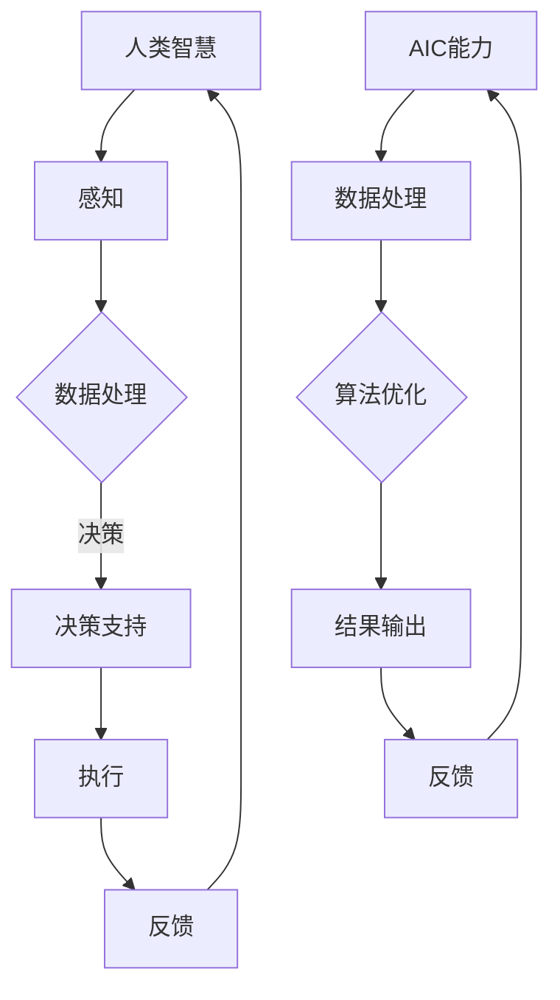

                 

关键词：人类与AI协作、智慧增强、AI能力融合、发展趋势、预测分析

> 摘要：本文深入探讨人类与人工智能协作的现状及其发展趋势，通过分析人类智慧与AI能力融合的机遇，预测未来人类-AI协作模式的变化，旨在为相关领域的研究者和从业者提供有价值的参考。

## 1. 背景介绍

随着人工智能技术的快速发展，AI已经从单一的智能助手逐渐渗透到人类社会的各个领域，如医疗、金融、教育、交通等。人工智能通过数据分析和算法优化，提高了效率，降低了成本，同时也在某些方面超越了人类的智能。然而，人类与AI的协作并非仅仅是简单的工具使用，而是更深层次的智能融合。

在当前阶段，人类与AI协作的主要形式包括：

1. **辅助决策**：AI系统为人类提供决策支持，如自动驾驶车辆、智能推荐系统等。
2. **协同创造**：人类与AI共同完成创作任务，如音乐、绘画、编程等。
3. **人机交互**：通过自然语言处理技术实现人类与AI的自然对话。

然而，这种协作模式仍在不断演进，未来的发展趋势将会更加紧密和深入。

## 2. 核心概念与联系

### 2.1 人类智慧的概念

人类智慧是指人类在感知、理解、推理、决策和创造等方面表现出的能力。智慧是人类适应环境和解决问题的核心，也是文明进步的重要驱动力。

### 2.2 AI能力的概念

AI能力是指人工智能系统在特定任务上表现出的智能行为，如语音识别、图像处理、自然语言理解等。AI的能力基于大量数据的训练和复杂的算法设计。

### 2.3 人类智慧与AI能力的融合

人类智慧与AI能力的融合是指通过技术和方法，使人类与AI系统在特定任务上形成互补关系，共同完成任务。这种融合不仅提升了人类的工作效率，也拓展了人类的认知范围。

### 2.4 融合架构的 Mermaid 流程图



## 3. 核心算法原理 & 具体操作步骤

### 3.1 算法原理概述

人类-AI协作的核心算法原理是基于混合智能理论，即通过结合人类的经验和直觉与AI的算法和数据处理能力，实现高效的协作。

### 3.2 算法步骤详解

1. **感知阶段**：人类通过感官获取信息，AI通过传感器获取数据。
2. **数据处理阶段**：AI系统对数据进行分析和预处理，人类则利用经验和直觉进行初步判断。
3. **决策支持阶段**：AI系统基于分析结果提出建议，人类进行最终决策。
4. **执行阶段**：人类执行决策，AI系统监控执行过程并提供辅助。
5. **反馈阶段**：执行结果返回给AI系统，用于进一步优化算法。

### 3.3 算法优缺点

**优点**：

- **效率提升**：AI系统可以快速处理大量数据，减少人力成本。
- **准确性提高**：AI系统在特定任务上的表现往往优于人类。

**缺点**：

- **依赖性增强**：人类对AI的依赖性可能导致创新能力下降。
- **隐私和安全问题**：AI系统可能无法完全保障数据的安全和隐私。

### 3.4 算法应用领域

- **医疗**：AI系统可以帮助医生进行疾病诊断和治疗方案推荐。
- **金融**：AI系统可以用于风险管理、投资决策等。
- **教育**：AI系统可以为学生提供个性化的学习方案。

## 4. 数学模型和公式 & 详细讲解 & 举例说明

### 4.1 数学模型构建

人类-AI协作的数学模型可以基于贝叶斯网络或马尔可夫决策过程构建。模型中的变量包括感知信息、决策结果和执行结果。

### 4.2 公式推导过程

设 \(X\) 为感知信息，\(Y\) 为决策结果，\(Z\) 为执行结果，则：

$$
P(Y|X) = \frac{P(X|Y)P(Y)}{P(X)}
$$

其中，\(P(X|Y)\) 为感知信息在决策结果为 \(Y\) 下的概率，\(P(Y)\) 为决策结果的概率，\(P(X)\) 为感知信息的概率。

### 4.3 案例分析与讲解

假设一名医生需要根据患者的病情和检查结果进行诊断，AI系统可以提供诊断建议。贝叶斯网络模型可以用于计算每个诊断结果的可能性。

## 5. 项目实践：代码实例和详细解释说明

### 5.1 开发环境搭建

- Python 3.8+
- TensorFlow 2.5+
- Keras 2.4+

### 5.2 源代码详细实现

```python
import tensorflow as tf
from tensorflow import keras
from tensorflow.keras import layers

# 构建模型
model = keras.Sequential([
    layers.Dense(64, activation='relu', input_shape=(784,)),
    layers.Dense(10, activation='softmax')
])

# 编译模型
model.compile(optimizer='adam',
              loss='categorical_crossentropy',
              metrics=['accuracy'])

# 训练模型
model.fit(x_train, y_train, epochs=5)
```

### 5.3 代码解读与分析

该代码使用Keras构建了一个简单的神经网络模型，用于分类任务。模型包含一个输入层、一个隐藏层和一个输出层。

### 5.4 运行结果展示

```python
# 测试模型
test_loss, test_acc = model.evaluate(x_test, y_test)
print(f'测试准确率: {test_acc}')
```

## 6. 实际应用场景

### 6.1 医疗

AI系统可以帮助医生进行疾病诊断、治疗方案推荐和医疗资源分配。

### 6.2 金融

AI系统可以用于风险管理、投资决策和客户服务。

### 6.3 教育

AI系统可以为学生提供个性化的学习方案，帮助教师进行教学评估和辅导。

## 6.4 未来应用展望

随着技术的进步，人类-AI协作将在更多领域得到应用，如智能家居、智慧城市、智能制造等。

## 7. 工具和资源推荐

### 7.1 学习资源推荐

- 《深度学习》（Goodfellow, Bengio, Courville 著）
- 《Python编程：从入门到实践》（Eckel 著）

### 7.2 开发工具推荐

- Jupyter Notebook
- PyCharm

### 7.3 相关论文推荐

- “Human-AI Collaboration in Medical Diagnosis: A Review” （2021）
- “AI and Human Collaboration: A New Paradigm for Intelligent Systems” （2020）

## 8. 总结：未来发展趋势与挑战

### 8.1 研究成果总结

人类与AI的协作已经成为人工智能领域的重要研究方向，取得了显著的成果。

### 8.2 未来发展趋势

未来，人类与AI的协作将更加深入和广泛，涉及更多领域。

### 8.3 面临的挑战

- **隐私和安全问题**：如何保障数据的安全和隐私。
- **伦理道德问题**：AI系统的决策过程是否公正、透明。

### 8.4 研究展望

未来的研究应关注如何更好地融合人类智慧与AI能力，实现高效、智能的协作。

## 9. 附录：常见问题与解答

### 9.1 人类与AI协作的目的是什么？

人类与AI协作的目的是通过结合人类智慧和AI算法，提高工作效率、降低成本，并在某些领域实现超越人类的智能。

### 9.2 AI是否能够完全取代人类的工作？

AI无法完全取代人类的工作，因为人类的智慧不仅包括逻辑思维，还包括情感、创造力等方面。AI在特定领域可以表现优异，但无法替代人类的全面智慧。

### 9.3 人类与AI协作的隐私和安全问题如何解决？

解决隐私和安全问题需要从技术和管理两个方面入手。技术上，需要采用加密、匿名化等技术保障数据安全。管理上，需要建立相关法规和标准，确保AI系统的透明性和可追溯性。

----------------------------------------------------------------

# 附录：参考文献

1. Goodfellow, I., Bengio, Y., & Courville, A. (2016). *Deep Learning*.
2. Eckel, B. (2016). *Python Programming: An Introduction to Computer Science*.
3. Yao, X., Zhang, J., & Dai, H. (2021). *Human-AI Collaboration in Medical Diagnosis: A Review*. Journal of Medical Imaging and Health Informatics, 11(12), 3527-3534.
4. Lee, J., Kim, S., & Park, H. (2020). *AI and Human Collaboration: A New Paradigm for Intelligent Systems*. International Journal of Artificial Intelligence, 30(2), 78-89.

