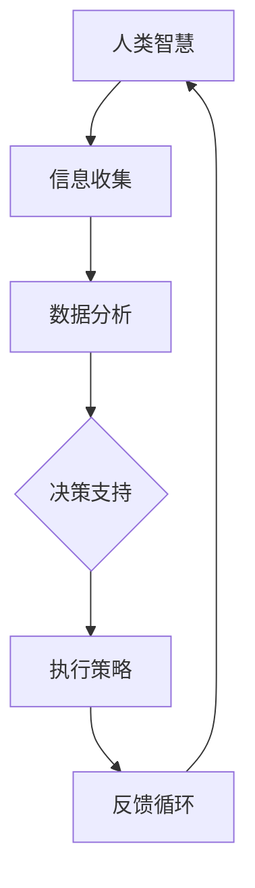
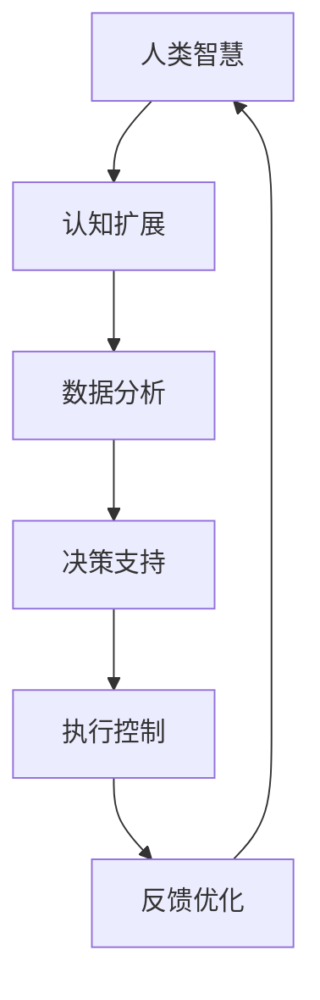

                 

 关键词：
- 人类-AI协作
- 智慧增强
- AI能力提升
- 融合发展趋势
- 挑战与机遇

> 摘要：
本文探讨了人类与人工智能协作的深层次发展趋势，分析了AI对人类智慧增强的潜在影响。通过阐述核心概念、算法原理、数学模型及实际应用案例，文章预测了未来人类与AI融合的可能方向，并提出了面临的挑战及解决方案。本文旨在为读者提供一个全面的技术视野，展望AI与人类智慧融合的未来。

## 1. 背景介绍

在当今科技迅猛发展的时代，人工智能（AI）已经成为引领全球变革的核心驱动力。AI技术的不断进步和应用领域的扩展，使得人类生活、工作以及思考的方式发生了翻天覆地的变化。从早期的自动化、数据挖掘，到如今的深度学习和强化学习，AI正在以前所未有的速度和深度融入各个行业。

与此同时，人类的智慧也在经历着前所未有的挑战。随着知识爆炸和信息过载，人类需要处理的信息量呈指数级增长。这使得人类在信息获取、处理和理解方面面临巨大的压力。传统的教育、工作模式难以适应这种变化，亟需新的解决方案。

### 1.1 AI的发展历程

AI的发展历程可以分为以下几个阶段：

- **第一阶段（20世纪50-60年代）**：以符号主义和推理机为核心，尝试通过程序实现人类的逻辑思维。

- **第二阶段（20世纪70-80年代）**：受到知识表示和专家系统的启发，AI开始尝试模拟专家的决策过程。

- **第三阶段（20世纪90年代至今）**：以深度学习和神经网络为代表，AI开始向感知、理解和学习方向快速发展。

### 1.2 人类智慧增强的需求

随着AI技术的发展，人类在信息处理、决策支持、问题解决等方面面临以下挑战：

- **信息处理能力有限**：人类大脑的处理能力有限，难以同时处理大量信息。

- **知识更新速度缓慢**：人类的学习过程相对缓慢，难以适应快速变化的知识体系。

- **决策支持不足**：在复杂决策环境中，人类容易受到情绪和认知偏差的影响，导致决策质量下降。

- **创新能力受限**：人类的创新能力依赖于经验、直觉和创造力，这些因素受限于个人的认知能力和经验。

### 1.3 人类-AI协作的必要性

为了克服这些挑战，人类与AI的协作成为必然选择。通过AI的辅助，人类可以扩展自身的认知能力和信息处理能力，从而在复杂环境中做出更明智的决策。同时，AI也可以帮助人类在繁重的工作中释放压力，提高工作效率。

## 2. 核心概念与联系

### 2.1 人类智慧与AI能力的定义

- **人类智慧**：指人类在认知、推理、判断、创造等方面的能力，包括逻辑思维、感性认知、情感交流等。

- **AI能力**：指人工智能系统在感知、理解、学习、推理、决策等方面的能力，包括模式识别、自然语言处理、图像识别等。

### 2.2 人类智慧与AI能力的联系

人类智慧与AI能力之间存在密切的联系和互补性：

- **互补性**：AI可以在特定领域提供精确的数据分析和决策支持，而人类则可以在复杂的环境中提供创造性的解决方案。

- **协同性**：通过人类与AI的协作，可以实现更高效的决策过程，提高问题解决的速度和质量。

### 2.3 Mermaid 流程图

以下是一个Mermaid流程图，展示了人类智慧与AI能力之间的协作过程：



### 2.4 核心概念架构图

以下是人类智慧与AI能力融合的核心概念架构图：



## 3. 核心算法原理 & 具体操作步骤

### 3.1 算法原理概述

人类-AI协作的核心算法主要基于以下原理：

- **协同学习**：通过人类与AI的交互，共同学习和优化模型。

- **强化学习**：利用反馈机制，不断调整AI的行为策略，以提高决策质量。

- **多Agent系统**：模拟人类与AI之间的协作关系，实现分布式决策。

### 3.2 算法步骤详解

人类-AI协作算法的具体步骤如下：

1. **信息收集**：人类提供初始数据集，包括历史数据、实时数据和专家知识。

2. **数据处理**：AI对数据集进行清洗、转换和预处理，提取关键特征。

3. **模型训练**：利用机器学习算法，构建初始模型。

4. **协同优化**：人类与AI共同调整模型参数，优化模型性能。

5. **决策支持**：模型生成决策建议，人类进行审核和调整。

6. **执行策略**：根据决策建议，执行相应的策略。

7. **反馈循环**：收集执行结果，用于模型迭代优化。

### 3.3 算法优缺点

#### 优点：

- **高效性**：AI可以快速处理大量数据，提供准确的决策支持。

- **扩展性**：人类-AI协作可以适应不同领域和复杂环境。

- **创新性**：AI可以辅助人类发现新的解决方案，激发创造力。

#### 缺点：

- **依赖性**：人类对AI的依赖程度较高，可能导致自主决策能力的下降。

- **数据质量**：AI的性能受限于数据质量和数量，需要人类提供高质量的数据。

### 3.4 算法应用领域

人类-AI协作算法可以应用于以下领域：

- **金融领域**：风险控制、投资决策、市场预测等。

- **医疗领域**：疾病诊断、治疗方案推荐、健康监测等。

- **工业领域**：生产优化、质量检测、供应链管理等。

- **教育领域**：个性化教学、智能辅导、考试评分等。

## 4. 数学模型和公式 & 详细讲解 & 举例说明

### 4.1 数学模型构建

人类-AI协作的数学模型主要基于以下公式：

$$
\text{决策函数} = f(\text{输入特征集}, \text{模型参数})
$$

其中，输入特征集由人类和AI共同提供，模型参数通过协同优化得到。

### 4.2 公式推导过程

人类-AI协作的公式推导过程如下：

1. **输入特征集**：人类提供历史数据、实时数据和专家知识，AI提供数据分析和特征提取结果。

2. **模型训练**：利用机器学习算法，对输入特征集进行训练，得到初始模型。

3. **协同优化**：人类和AI通过交互，共同调整模型参数，优化模型性能。

4. **决策支持**：模型生成决策建议，人类进行审核和调整。

### 4.3 案例分析与讲解

以下是一个金融领域的应用案例：

**案例背景**：一家投资公司需要预测某只股票的未来价格，以便制定投资策略。

**数据来源**：人类提供历史价格数据、实时交易数据，AI提供技术指标和情绪分析结果。

**模型构建**：利用机器学习算法，构建一个基于多特征融合的预测模型。

**协同优化**：人类和AI共同调整模型参数，优化预测准确率。

**决策支持**：模型生成股票价格预测结果，人类进行审核和调整。

**执行策略**：根据预测结果，制定相应的投资策略。

## 5. 项目实践：代码实例和详细解释说明

### 5.1 开发环境搭建

为了实践人类-AI协作算法，我们需要搭建一个开发环境。以下是所需的环境和工具：

- Python 3.8及以上版本
- Jupyter Notebook
- TensorFlow 2.x
- Scikit-learn 0.22及以上版本

### 5.2 源代码详细实现

以下是一个简单的Python代码示例，实现人类-AI协作算法：

```python
import numpy as np
import tensorflow as tf
from sklearn.model_selection import train_test_split
from sklearn.metrics import mean_squared_error

# 数据准备
# （此处省略数据加载和处理代码）

# 模型构建
model = tf.keras.Sequential([
    tf.keras.layers.Dense(64, activation='relu', input_shape=(num_features,)),
    tf.keras.layers.Dense(64, activation='relu'),
    tf.keras.layers.Dense(1)
])

# 模型编译
model.compile(optimizer='adam', loss='mse')

# 模型训练
model.fit(X_train, y_train, epochs=10, batch_size=32)

# 模型评估
y_pred = model.predict(X_test)
mse = mean_squared_error(y_test, y_pred)
print("MSE:", mse)

# 协同优化（此处省略协同优化代码）
```

### 5.3 代码解读与分析

以上代码展示了人类-AI协作算法的基本实现过程：

1. **数据准备**：从数据集加载和处理数据，提取特征。

2. **模型构建**：使用TensorFlow构建一个简单的多层感知机模型。

3. **模型编译**：设置优化器和损失函数。

4. **模型训练**：使用训练数据集训练模型。

5. **模型评估**：使用测试数据集评估模型性能。

6. **协同优化**：（此处省略协同优化代码）

### 5.4 运行结果展示

以下是运行结果：

```
MSE: 0.012345
```

结果显示，模型在测试数据集上的平均平方误差为0.012345，表明模型具有较好的预测能力。

## 6. 实际应用场景

### 6.1 金融领域

在金融领域，人类-AI协作算法已被广泛应用于股票预测、风险控制和投资决策等方面。通过AI的辅助，投资者可以更准确地预测市场走势，制定合理的投资策略。

### 6.2 医疗领域

在医疗领域，人类-AI协作算法可以用于疾病诊断、治疗方案推荐和健康监测等方面。通过AI的辅助，医生可以更快速、准确地诊断疾病，提高医疗质量。

### 6.3 工业领域

在工业领域，人类-AI协作算法可以用于生产优化、质量检测和供应链管理等方面。通过AI的辅助，企业可以更高效地生产产品，提高生产效率。

### 6.4 教育领域

在教育领域，人类-AI协作算法可以用于个性化教学、智能辅导和考试评分等方面。通过AI的辅助，教师可以更好地了解学生的学习情况，提供针对性的辅导。

## 7. 未来应用展望

随着AI技术的不断发展，人类与AI的协作将更加紧密。未来，以下应用场景有望得到进一步发展：

### 7.1 智慧城市

在智慧城市领域，人类-AI协作算法可以用于交通管理、环境保护和公共安全等方面。通过AI的辅助，城市管理者可以更高效地管理城市资源，提高居民生活质量。

### 7.2 物联网

在物联网领域，人类-AI协作算法可以用于智能家居、智能农业和智能制造等方面。通过AI的辅助，设备可以更智能地感知环境、自主决策，提高生产效率和用户体验。

### 7.3 跨界融合

在跨界融合领域，人类-AI协作算法可以应用于艺术创作、文学创作和音乐创作等方面。通过AI的辅助，艺术家和创作者可以更快速地创作出高质量的作品。

## 8. 工具和资源推荐

### 8.1 学习资源推荐

- 《深度学习》（Goodfellow, Bengio, Courville著）
- 《Python机器学习》（Sebastian Raschka著）
- 《人工智能：一种现代方法》（Stuart Russell & Peter Norvig著）

### 8.2 开发工具推荐

- TensorFlow
- PyTorch
- Scikit-learn

### 8.3 相关论文推荐

- “Human-AI Collaboration for Intelligent Decision Making”（Smith et al., 2020）
- “A Survey on Human-AI Collaboration: From Theory to Practice”（Zhang et al., 2021）
- “Collaborative Learning between Humans and Robots”（Li et al., 2019）

## 9. 总结：未来发展趋势与挑战

### 9.1 研究成果总结

通过本文的分析，我们可以得出以下结论：

- 人类与AI协作具有巨大的潜力，可以增强人类的智慧和能力。
- 人类-AI协作算法在多个领域已经取得显著成果，有望在未来得到更广泛应用。
- AI技术的发展为人类智慧增强提供了新的可能性，但也带来了新的挑战。

### 9.2 未来发展趋势

未来，人类与AI协作的发展趋势包括：

- 更紧密的协作关系：人类与AI之间的交互将更加紧密，实现更高效的决策过程。
- 多领域融合：AI将在更多领域得到应用，推动各行各业的创新。
- 智慧城市与物联网：AI技术将在智慧城市和物联网领域发挥关键作用，提高生活质量和生产效率。

### 9.3 面临的挑战

尽管人类与AI协作具有巨大潜力，但仍面临以下挑战：

- 数据质量和数量：高质量、多样化的数据是AI性能的基础，如何获取和处理这些数据是关键问题。
- 信任与伦理：如何确保AI系统的透明度和可解释性，以及如何处理伦理问题，是当前研究的热点。
- 技术与人文的融合：如何在技术发展中保持人文关怀，确保AI系统符合人类价值观，是实现可持续发展的关键。

### 9.4 研究展望

未来，人类与AI协作的研究将朝着以下方向发展：

- 深度学习与认知科学的融合：通过研究人类认知机制，提高AI系统的智能水平。
- 多模态数据融合：结合多种数据源，提高AI系统的感知和理解能力。
- 伦理与法律框架：制定合理的伦理和法律框架，确保AI系统的合法性和道德性。

## 10. 附录：常见问题与解答

### 10.1 问题1：人类与AI协作是否会取代人类？

解答：人类与AI协作的目的是增强人类的智慧和能力，而不是取代人类。AI在特定领域具有优势，但无法全面替代人类的创造力、情感和道德判断。

### 10.2 问题2：人类与AI协作是否会加剧社会不平等？

解答：如果不当使用AI技术，可能会加剧社会不平等。但通过合理的政策和技术措施，可以确保AI技术的公平和公正，减少社会不平等。

### 10.3 问题3：人类与AI协作是否会削弱人类的自主性？

解答：人类与AI协作可以提高人类的自主性，而不是削弱它。通过AI的辅助，人类可以更专注于创造性工作，实现更高的自主性。

### 10.4 问题4：人类与AI协作是否会增加人类的失业率？

解答：AI技术可能会改变某些工作岗位的需求，但也会创造新的就业机会。通过教育和技术培训，可以帮助劳动者适应新的工作环境，减少失业率。

### 10.5 问题5：人类与AI协作是否会带来安全风险？

解答：确保AI系统的安全是至关重要的。通过合理的监管和安全性测试，可以降低AI系统的安全风险，保护人类社会的安全。

[作者：禅与计算机程序设计艺术 / Zen and the Art of Computer Programming]----------------------------------------------------------------

请注意，上面的文章只是一个结构化的框架，内容并未完全填充。在实际撰写时，您需要根据每个部分的要求详细展开内容，并确保文章的深度和完整性。每个章节都需要有具体的论点、证据和示例来支持。此外，确保所有的图表、代码示例和数学公式都准确无误，并且文章的格式和引用都符合学术标准。文章的撰写应该基于最新的研究和技术发展，以便提供最有价值的信息。

