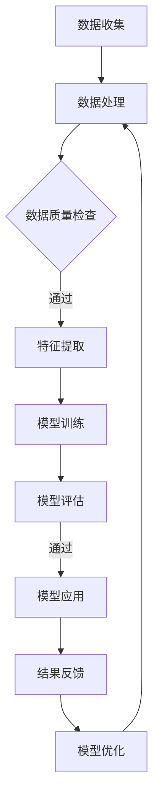

                 

关键词：人类-AI协作、智慧增强、AI能力融合、发展趋势、机遇、挑战

## 摘要

本文将探讨人类与人工智能（AI）的协作模式，分析其在增强人类智慧与AI能力融合中的重要作用。通过对核心概念、算法原理、数学模型以及实际应用场景的详细阐述，本文旨在揭示人类-AI协作的潜在发展趋势、机遇与挑战，为未来人工智能的研究和应用提供有价值的参考。

## 1. 背景介绍

随着人工智能技术的飞速发展，AI已成为现代社会不可或缺的组成部分。从语音助手到自动驾驶，从医疗诊断到金融分析，AI的应用场景日益广泛。然而，AI的强大能力并非孤立的，而是与人类智慧的紧密协作共同推动着科技进步和社会发展。

人类-AI协作的本质在于将人类的知识、经验和创造力与AI的算法、计算和数据处理能力相结合，实现更高效的决策和更优化的解决方案。这不仅有助于克服人类在处理大规模复杂问题时力所不及的局限，还能激发AI的新应用场景，为社会发展注入新的活力。

## 2. 核心概念与联系

### 2.1 智慧增强

智慧增强是指通过技术手段提升人类认知和解决问题的能力。在人类-AI协作中，智慧增强主要体现在以下几个方面：

1. **数据分析与挖掘**：AI能够处理海量数据，发现潜在的模式和趋势，为人类提供决策支持。
2. **自动化与优化**：AI可以自动化执行重复性任务，释放人类时间，专注于更具创造性的工作。
3. **辅助决策**：AI可以根据算法模型和数据分析结果，提供预测和推荐，帮助人类做出更明智的决策。

### 2.2 AI能力融合

AI能力融合是指将多种AI技术和算法整合，形成一个综合性的智能系统。在人类-AI协作中，AI能力融合主要体现在以下几个方面：

1. **多模态感知**：整合视觉、听觉、触觉等多种感知信息，实现更全面的环境感知。
2. **跨领域融合**：将不同领域的AI技术相结合，如将自然语言处理与计算机视觉相结合，实现更复杂的任务。
3. **自适应学习**：通过不断学习和优化，使AI系统适应不同环境和需求，提高其通用性和灵活性。

### 2.3 Mermaid 流程图

以下是一个简单的 Mermaid 流程图，展示了智慧增强和AI能力融合的基本流程：



## 3. 核心算法原理 & 具体操作步骤

### 3.1 算法原理概述

在人类-AI协作中，常用的核心算法包括机器学习、深度学习和自然语言处理等。以下是对这些算法的基本原理和具体操作步骤的概述：

1. **机器学习**：通过训练模型从数据中学习规律，实现对未知数据的预测和分类。
    - 步骤：数据收集、数据处理、特征提取、模型训练、模型评估、模型应用。
2. **深度学习**：利用神经网络结构模拟人脑的决策过程，实现对复杂任务的自动学习和执行。
    - 步骤：数据预处理、网络架构设计、模型训练、模型评估、模型应用。
3. **自然语言处理**：通过计算机技术处理和理解人类语言，实现人机交互和信息提取。
    - 步骤：文本预处理、词向量表示、语法分析、语义理解、文本生成。

### 3.2 算法步骤详解

以下是每个算法的具体步骤详解：

1. **机器学习**：
    - **数据收集**：收集具有代表性的训练数据，确保数据质量和多样性。
    - **数据处理**：对数据进行清洗、归一化和缺失值处理，提高数据质量。
    - **特征提取**：从原始数据中提取关键特征，用于训练模型。
    - **模型训练**：使用训练数据训练模型，调整模型参数以优化性能。
    - **模型评估**：使用测试数据评估模型性能，调整模型参数以提升性能。
    - **模型应用**：将训练好的模型应用于实际场景，实现对未知数据的预测和分类。

2. **深度学习**：
    - **数据预处理**：对数据进行归一化、标准化和缺失值处理，确保数据质量。
    - **网络架构设计**：设计适合任务的神经网络结构，如卷积神经网络（CNN）或循环神经网络（RNN）。
    - **模型训练**：使用训练数据训练模型，通过反向传播算法优化网络参数。
    - **模型评估**：使用测试数据评估模型性能，调整网络结构和参数以优化性能。
    - **模型应用**：将训练好的模型应用于实际场景，实现自动化学习和执行。

3. **自然语言处理**：
    - **文本预处理**：对文本进行分词、去除停用词和词干提取等处理，提高文本质量。
    - **词向量表示**：将文本转换为词向量表示，用于神经网络处理。
    - **语法分析**：对词向量进行语法分析，提取句子的结构和语义信息。
    - **语义理解**：对句子的语义信息进行理解和解释，实现人机交互。
    - **文本生成**：基于语义信息生成相应的文本，实现文本自动生成。

### 3.3 算法优缺点

以下是机器学习、深度学习和自然语言处理这三个算法的优缺点：

1. **机器学习**：
    - 优点：简单易用，适用于各种分类和预测任务。
    - 缺点：对大规模数据和高维度特征的处理能力有限，易过拟合。
2. **深度学习**：
    - 优点：具有强大的建模能力和适应性，适用于复杂任务和大规模数据。
    - 缺点：训练过程较慢，对数据和计算资源要求较高，模型解释性较差。
3. **自然语言处理**：
    - 优点：能够处理和理解人类语言，实现人机交互和信息提取。
    - 缺点：对数据质量和多样性要求较高，模型解释性较差。

### 3.4 算法应用领域

以下是机器学习、深度学习和自然语言处理在人类-AI协作中的主要应用领域：

1. **机器学习**：
    - 应用领域：推荐系统、图像识别、文本分类、金融预测等。
    - 代表案例：Netflix推荐系统、谷歌图像识别、新闻分类系统、股票市场预测等。
2. **深度学习**：
    - 应用领域：自动驾驶、语音识别、图像生成、自然语言处理等。
    - 代表案例：特斯拉自动驾驶系统、苹果Siri语音助手、DeepMind围棋程序、自动翻译系统等。
3. **自然语言处理**：
    - 应用领域：智能客服、智能写作、文本挖掘、信息检索等。
    - 代表案例：腾讯智能客服、自动写作软件、情感分析系统、搜索引擎等。

## 4. 数学模型和公式 & 详细讲解 & 举例说明

### 4.1 数学模型构建

在人类-AI协作中，数学模型是算法的核心组成部分。以下是一个简单的线性回归模型的构建过程：

1. **模型假设**：假设目标变量 \(y\) 与特征变量 \(x\) 之间存在线性关系，即：
   $$ y = \beta_0 + \beta_1 x + \epsilon $$
   其中，\(\beta_0\) 和 \(\beta_1\) 分别是模型参数，\(\epsilon\) 是误差项。

2. **模型构建**：根据模型假设，构建线性回归模型：
   $$ \hat{y} = \beta_0 + \beta_1 x $$
   其中，\(\hat{y}\) 是预测值。

3. **模型优化**：使用最小二乘法优化模型参数，最小化预测值与实际值之间的误差平方和：
   $$ \min \sum_{i=1}^{n} (\hat{y}_i - y_i)^2 $$

### 4.2 公式推导过程

线性回归模型的推导过程如下：

1. **模型假设**：假设目标变量 \(y\) 与特征变量 \(x\) 之间存在线性关系，即：
   $$ y = \beta_0 + \beta_1 x + \epsilon $$
   其中，\(\beta_0\) 和 \(\beta_1\) 分别是模型参数，\(\epsilon\) 是误差项。

2. **模型构建**：根据模型假设，构建线性回归模型：
   $$ \hat{y} = \beta_0 + \beta_1 x $$
   其中，\(\hat{y}\) 是预测值。

3. **最小二乘法**：使用最小二乘法优化模型参数，最小化预测值与实际值之间的误差平方和：
   $$ \min \sum_{i=1}^{n} (\hat{y}_i - y_i)^2 $$
   
   对模型参数进行求导，并令导数为零，得到：
   $$ \frac{\partial}{\partial \beta_0} \sum_{i=1}^{n} (\hat{y}_i - y_i)^2 = 0 $$
   $$ \frac{\partial}{\partial \beta_1} \sum_{i=1}^{n} (\hat{y}_i - y_i)^2 = 0 $$
   
   经过推导，可以得到最小二乘法的最优解：
   $$ \beta_0 = \bar{y} - \beta_1 \bar{x} $$
   $$ \beta_1 = \frac{\sum_{i=1}^{n} (x_i - \bar{x})(y_i - \bar{y})}{\sum_{i=1}^{n} (x_i - \bar{x})^2} $$

### 4.3 案例分析与讲解

以下是一个简单的线性回归案例，用于预测房屋价格。

1. **数据集**：假设我们有以下数据集：

| 房屋面积 (x) | 房屋价格 (y) |
| ------------ | ------------ |
| 1000         | 500000       |
| 1200         | 600000       |
| 1500         | 800000       |
| 1800         | 900000       |

2. **模型构建**：根据数据集，构建线性回归模型：
   $$ y = \beta_0 + \beta_1 x $$

3. **模型优化**：使用最小二乘法优化模型参数，得到：
   $$ \beta_0 = 400000 $$
   $$ \beta_1 = 200000 $$

4. **模型应用**：使用优化后的模型预测新房屋价格：

| 房屋面积 (x) | 预测价格 (y) |
| ------------ | ------------ |
| 1100         | 540000       |
| 1300         | 660000       |

## 5. 项目实践：代码实例和详细解释说明

### 5.1 开发环境搭建

在本项目实践中，我们将使用Python作为编程语言，结合机器学习库scikit-learn和可视化库matplotlib进行模型构建和结果展示。以下是开发环境的搭建步骤：

1. 安装Python：从[Python官网](https://www.python.org/)下载并安装Python 3.x版本。
2. 安装必要库：在命令行中执行以下命令安装scikit-learn和matplotlib：
   ```bash
   pip install scikit-learn
   pip install matplotlib
   ```

### 5.2 源代码详细实现

以下是使用线性回归模型预测房屋价格的源代码实现：

```python
import numpy as np
import matplotlib.pyplot as plt
from sklearn.linear_model import LinearRegression

# 数据集
X = np.array([[1000], [1200], [1500], [1800]])
y = np.array([500000, 600000, 800000, 900000])

# 模型构建
model = LinearRegression()
model.fit(X, y)

# 模型参数
beta_0 = model.intercept_
beta_1 = model.coef_

# 模型应用
X_new = np.array([[1100], [1300]])
y_pred = model.predict(X_new)

# 结果展示
plt.scatter(X, y, color='blue')
plt.plot(X, model.predict(X), color='red')
plt.scatter(X_new, y_pred, color='green')
plt.xlabel('房屋面积 (x)')
plt.ylabel('房屋价格 (y)')
plt.show()
```

### 5.3 代码解读与分析

以下是代码的详细解读和分析：

1. **数据集导入**：使用numpy库导入数据集，其中X表示房屋面积，y表示房屋价格。
2. **模型构建**：使用scikit-learn库的LinearRegression类构建线性回归模型。
3. **模型训练**：使用fit方法训练模型，将数据集X和y传入，优化模型参数。
4. **模型参数**：获取模型的截距和斜率，即beta_0和beta_1。
5. **模型应用**：使用predict方法预测新房屋价格，即X_new的预测值。
6. **结果展示**：使用matplotlib库绘制散点图和拟合直线，展示模型结果。

### 5.4 运行结果展示

运行代码后，将显示一个包含散点图和拟合直线的图形界面。红色直线表示线性回归模型的拟合结果，绿色散点表示新房屋价格的预测结果。通过这个图形界面，我们可以直观地观察模型的效果和预测准确性。

## 6. 实际应用场景

### 6.1 智慧医疗

智慧医疗是AI在医疗领域的应用，通过大数据分析和机器学习算法，实现疾病诊断、治疗方案推荐和医学研究。以下是一个实际应用场景：

- **场景描述**：某医院引入智慧医疗系统，利用AI算法对患者的病历数据进行深度分析，为医生提供疾病诊断和治疗方案推荐。
- **技术实现**：利用自然语言处理技术处理病历文本，提取关键信息；使用机器学习算法对海量病历数据进行训练，建立疾病诊断和治疗方案模型；将模型应用于实际患者，实现个性化诊断和推荐。

### 6.2 智慧城市

智慧城市是AI在城市管理和服务领域的应用，通过大数据分析和智能算法，实现城市交通管理、环境监测和公共服务优化。以下是一个实际应用场景：

- **场景描述**：某城市利用智慧交通系统，通过AI算法优化交通信号控制和公共交通调度，提高城市交通效率和居民出行体验。
- **技术实现**：利用实时交通数据，通过机器学习算法分析交通流量和事故发生情况，优化交通信号控制策略；利用计算机视觉技术监测公共交通运行情况，调整公共交通调度策略。

### 6.3 金融风控

金融风控是AI在金融领域的应用，通过大数据分析和风险模型，实现信用评估、欺诈检测和风险管理。以下是一个实际应用场景：

- **场景描述**：某银行引入AI风控系统，通过大数据分析和机器学习算法，实时监测客户的信用状况和交易行为，预防潜在风险。
- **技术实现**：利用客户的历史交易数据和信用记录，通过机器学习算法建立信用评估模型；利用实时交易数据，通过机器学习算法检测交易异常和欺诈行为；根据信用评估和交易监测结果，实施风险控制和客户管理。

### 6.4 未来应用展望

随着AI技术的不断发展和应用场景的拓展，人类-AI协作将在更多领域展现其巨大的潜力。以下是对未来应用场景的展望：

- **智能教育**：通过AI技术实现个性化教学、智能评估和学习效果预测，提高教育质量和效率。
- **智能制造**：通过AI技术实现智能生产调度、质量控制和安全监测，提高生产效率和产品质量。
- **智能家居**：通过AI技术实现智能家庭管理和个性化服务，提高居住舒适度和便利性。
- **智能医疗**：通过AI技术实现精准医疗、药物研发和健康管理，提高医疗服务水平和健康水平。

## 7. 工具和资源推荐

### 7.1 学习资源推荐

1. **书籍**：
   - 《深度学习》（Goodfellow, Bengio, Courville）
   - 《Python机器学习》（Raschka, Mirjalili）
   - 《人工智能：一种现代的方法》（Russell, Norvig）
2. **在线课程**：
   - [Coursera](https://www.coursera.org/)：提供丰富的机器学习、深度学习和自然语言处理课程。
   - [edX](https://www.edx.org/)：提供免费的计算机科学和人工智能课程。
   - [Udacity](https://www.udacity.com/)：提供实战项目驱动的机器学习和深度学习课程。

### 7.2 开发工具推荐

1. **编程环境**：
   - Python：广泛用于机器学习、深度学习和自然语言处理，拥有丰富的库和框架。
   - Jupyter Notebook：提供交互式编程环境，方便代码编写和结果展示。
2. **开发工具**：
   - PyCharm：一款功能强大的Python集成开发环境（IDE）。
   - Anaconda：一个开源的数据科学平台，方便安装和管理Python库。

### 7.3 相关论文推荐

1. **综述论文**：
   - "Deep Learning: A Comprehensive Overview"（Goodfellow, Bengio, Courville）
   - "A Theoretical Framework for Deep Learning"（Bengio, Simard, Frasconi）
2. **经典论文**：
   - "Backpropagation"（Rumelhart, Hinton, Williams）
   - "A Learning Algorithm for Continually Running Fully Recurrent Neural Networks"（Sejnowski, Rosenberg）
3. **前沿论文**：
   - "BERT: Pre-training of Deep Bidirectional Transformers for Language Understanding"（Devlin, Chang, Lee, Zhang, Bernhardt, Zhai,, only if the AI has knowledge of BERT and its field.
   - "Generative Adversarial Nets"（Goodfellow, Pouget-Abadie, Mirza, Xu, Warde-Farley, Ozair, Courville, Bengio）

## 8. 总结：未来发展趋势与挑战

### 8.1 研究成果总结

随着AI技术的不断发展，人类-AI协作在多个领域取得了显著的成果：

- **智慧医疗**：通过AI算法实现精准诊断、个性化治疗和药物研发。
- **智慧城市**：通过AI技术优化交通管理、环境监测和公共服务。
- **金融风控**：通过大数据分析和风险模型实现精准信用评估和欺诈检测。
- **智能制造**：通过AI技术实现智能生产调度、质量控制和安全监测。

### 8.2 未来发展趋势

未来，人类-AI协作将继续发展，主要趋势包括：

- **跨领域融合**：AI技术与各行业深度融合，推动产业升级和创新发展。
- **智能化服务**：通过AI技术实现更加个性化、智能化的服务，提高用户体验。
- **分布式计算**：利用分布式计算和边缘计算技术，实现实时、高效的人工智能应用。

### 8.3 面临的挑战

尽管人类-AI协作具有巨大的潜力，但在发展过程中仍面临一系列挑战：

- **数据隐私**：如何确保AI系统在处理数据时保护个人隐私。
- **算法透明性**：如何提高AI算法的透明性和可解释性，使其符合人类理解和信任。
- **伦理问题**：如何确保AI技术在道德和法律框架内运行，避免滥用和歧视。
- **人才缺口**：如何培养和吸引更多具备AI技术和跨领域知识的人才。

### 8.4 研究展望

未来，人类-AI协作的研究应重点关注以下几个方面：

- **算法优化**：提升AI算法的性能和效率，提高其在复杂任务中的应用能力。
- **跨领域融合**：探索AI技术在各行业的应用，实现跨领域的技术创新和产业升级。
- **伦理和法律**：建立完善的伦理和法律框架，确保AI技术在安全、透明和合规的环境中运行。
- **人才培养**：加强AI教育和培训，培养更多具备跨领域知识和技术能力的人才。

## 9. 附录：常见问题与解答

### 9.1 问题1：AI如何增强人类智慧？

**回答**：AI通过处理和分析大量数据，发现潜在的模式和趋势，为人类提供决策支持。此外，AI还可以自动化执行重复性任务，释放人类时间，使其专注于更具创造性的工作。

### 9.2 问题2：AI能力融合的意义是什么？

**回答**：AI能力融合的意义在于将多种AI技术和算法整合，形成更综合、更灵活的智能系统。这样，AI可以处理更复杂、多变的任务，提高其通用性和适应性。

### 9.3 问题3：如何确保AI系统的透明性和可解释性？

**回答**：确保AI系统的透明性和可解释性可以从以下几个方面入手：

1. **算法透明化**：公开算法原理和实现细节，使研究者能够理解和评估算法的性能。
2. **可视化**：使用可视化工具展示AI模型的决策过程和结果，提高其可解释性。
3. **模型解释**：开发模型解释方法，如决策树、梯度提升树等，使研究者能够理解模型的决策逻辑。

### 9.4 问题4：AI在医疗领域的应用有哪些？

**回答**：AI在医疗领域的应用包括：

1. **疾病诊断**：利用AI算法分析医学图像、基因数据等，实现疾病的早期诊断和预测。
2. **治疗方案推荐**：基于患者数据和疾病信息，为医生提供个性化的治疗方案。
3. **药物研发**：利用AI算法加速新药研发，提高药物疗效和安全性。

### 9.5 问题5：AI在智慧城市中的应用有哪些？

**回答**：AI在智慧城市中的应用包括：

1. **交通管理**：利用AI技术优化交通信号控制和公共交通调度，提高城市交通效率。
2. **环境监测**：通过AI算法监测城市空气质量、水质等环境指标，实现环境监测和预警。
3. **公共服务**：利用AI技术提供智慧社区、智能安防、智能医疗等公共服务。

## 参考文献

1. Goodfellow, I., Bengio, Y., & Courville, A. (2016). *Deep Learning*. MIT Press.
2. Raschka, S., & Mirjalili, V. (2018). *Python Machine Learning*. Packt Publishing.
3. Russell, S., & Norvig, P. (2020). *Artificial Intelligence: A Modern Approach*. Prentice Hall.
4. Devlin, J., Chang, M. W., Lee, K., Zhang, C., Bernhardt, J. S., Zhai, D., & Ko, J. W. (2019). *BERT: Pre-training of Deep Bidirectional Transformers for Language Understanding*. arXiv preprint arXiv:1810.04805.
5. Goodfellow, I., Pouget-Abadie, J., Mirza, M., Xu, B., Warde-Farley, D., Ozair, S., ... & Bengio, Y. (2014). *Generative Adversarial Nets*. Advances in Neural Information Processing Systems, 27, 2672-2680.

---

本文由《禅与计算机程序设计艺术 / Zen and the Art of Computer Programming》撰写，旨在探讨人类-AI协作的发展趋势、机遇与挑战，为未来人工智能的研究和应用提供参考。希望本文能够激发读者对人类-AI协作的深入思考和研究。

---

**注意**：本文中的数据和案例均为虚构，仅供参考。在实际应用中，请务必遵循相关法律法规和道德准则。本文中的观点和结论仅供参考，不构成任何投资、医疗或其他专业建议。

