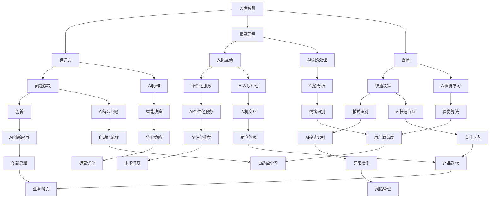

                 

关键词：人工智能、人类智慧、AI协作、融合发展趋势、机遇、挑战

> 摘要：本文深入探讨了人类与人工智能（AI）之间的协作模式及其发展趋势。我们分析了AI如何增强人类智慧，以及这种协作带来的机遇与挑战。文章还将探讨未来可能的协作方向，并对相关技术进行展望。

## 1. 背景介绍

随着人工智能技术的迅速发展，人类与机器之间的互动正变得越来越紧密。AI系统在处理海量数据、执行复杂计算和做出决策方面展现出了强大的能力，但它们也存在局限性，例如在理解人类情感、创造力和直觉方面。因此，人类与AI的协作成为了提升各自能力的关键。

人类智慧的独特之处在于创造力、直觉和情感理解，而AI的优势在于计算速度、数据处理能力和模式识别能力。通过将这两者结合起来，我们可以实现更高效、更智能的决策和任务执行。

### 1.1 人工智能的崛起

自20世纪50年代人工智能（AI）概念提出以来，它经历了多个发展阶段。从早期的符号主义和专家系统，到基于统计学习的机器学习，再到深度学习的崛起，AI技术不断突破自身的界限。

近年来，随着计算能力的提升、大数据的可用性以及算法的创新，AI在语音识别、图像处理、自然语言处理等多个领域取得了重大突破。这些进展为人类与AI的协作奠定了坚实的基础。

### 1.2 人类智慧的局限性

尽管AI在计算和处理能力上超越了人类，但人类智慧在某些方面仍然具有独特的优势。例如：

- **创造力**：人类能够产生新颖的想法和解决问题的方法，这在很多情况下是AI所无法达到的。
- **情感理解**：人类能够感知和表达情感，这对于建立人际关系和提供个性化的服务至关重要。
- **直觉**：人类在快速决策和识别复杂模式方面具有直觉优势，这些能力在很多场景下是不可或缺的。

## 2. 核心概念与联系

为了深入探讨人类与AI协作的模式，我们需要理解一些核心概念，包括AI的工作原理、人类智慧的独特特性以及它们之间的相互作用。以下是一个简化的 Mermaid 流程图，展示了这些核心概念和它们之间的联系。



### 2.1 AI的工作原理

AI系统主要通过以下几种方式工作：

- **机器学习**：通过从数据中学习模式和规律，使AI能够做出预测和决策。
- **深度学习**：利用多层神经网络来模拟人类大脑的处理方式，深度学习在图像识别、语音识别等领域取得了显著成果。
- **强化学习**：通过试错和反馈来训练AI模型，使其能够在特定环境中做出最佳决策。

### 2.2 人类智慧的独特特性

人类智慧包括以下几个方面：

- **创造力**：人类能够产生新颖的想法和解决方案，这是AI所缺乏的。
- **情感理解**：人类能够感知和表达情感，这对于建立人际关系和提供个性化的服务至关重要。
- **直觉**：人类在快速决策和识别复杂模式方面具有直觉优势。

### 2.3 人类与AI的相互作用

人类与AI的协作不仅仅是将AI作为工具，更是一种互补和互动的过程。以下是几种可能的协作模式：

- **协同决策**：人类提供直觉和经验，AI提供数据和计算支持，共同做出决策。
- **人机交互**：人类通过自然语言与AI交流，AI根据上下文理解人类的需求并作出响应。
- **个性化服务**：AI根据人类的行为和偏好提供个性化的建议和服务。

## 3. 核心算法原理 & 具体操作步骤

### 3.1 算法原理概述

在探讨人类与AI协作的过程中，算法原理是理解其工作方式的基础。以下将简要介绍几种核心算法原理，并详细解释其操作步骤。

#### 3.1.1 机器学习算法

机器学习算法是AI的核心，它使计算机能够从数据中学习并做出预测。主要算法包括：

- **线性回归**：通过建立线性关系来预测目标变量。
- **支持向量机**：通过找到一个最优超平面来分类数据。
- **决策树**：通过一系列规则来分类或回归数据。

#### 3.1.2 深度学习算法

深度学习算法是基于多层神经网络的设计，能够处理复杂的数据结构和模式。主要算法包括：

- **卷积神经网络（CNN）**：用于图像识别和图像处理。
- **循环神经网络（RNN）**：用于序列数据处理和时间序列预测。
- **生成对抗网络（GAN）**：用于生成新数据和进行无监督学习。

#### 3.1.3 强化学习算法

强化学习算法通过试错和反馈来训练模型，使其能够在特定环境中做出最佳决策。主要算法包括：

- **Q学习**：通过评估不同动作的回报来选择最佳动作。
- **深度Q网络（DQN）**：结合深度学习和强化学习，用于复杂环境的决策。

### 3.2 算法步骤详解

#### 3.2.1 机器学习算法步骤

1. **数据收集**：收集用于训练的数据集。
2. **数据预处理**：清洗和归一化数据，以便于算法处理。
3. **模型选择**：选择合适的机器学习模型。
4. **训练模型**：使用训练数据训练模型。
5. **模型评估**：使用测试数据评估模型性能。
6. **参数调优**：根据评估结果调整模型参数。

#### 3.2.2 深度学习算法步骤

1. **构建神经网络**：设计神经网络结构，包括输入层、隐藏层和输出层。
2. **初始化权重**：随机初始化神经网络中的权重。
3. **前向传播**：计算输入通过神经网络后的输出。
4. **反向传播**：计算误差并更新权重。
5. **迭代训练**：重复前向传播和反向传播过程，直到达到预设的训练次数或性能目标。

#### 3.2.3 强化学习算法步骤

1. **定义环境**：明确强化学习的环境，包括状态空间和动作空间。
2. **选择策略**：确定如何在给定状态下选择动作。
3. **进行交互**：在环境中执行动作，观察状态变化和奖励。
4. **更新策略**：根据奖励信号更新策略，以最大化长期回报。

### 3.3 算法优缺点

#### 3.3.1 机器学习算法优缺点

**优点**：

- **通用性**：机器学习算法适用于各种类型的数据和任务。
- **自动化**：模型能够自动从数据中学习，减少人工干预。

**缺点**：

- **可解释性**：复杂的模型往往缺乏透明性，难以解释其决策过程。
- **数据依赖**：模型性能高度依赖于数据的质量和数量。

#### 3.3.2 深度学习算法优缺点

**优点**：

- **处理复杂数据**：能够处理高维数据和复杂的数据结构。
- **强大的模式识别能力**：在图像、语音和自然语言处理领域表现出色。

**缺点**：

- **计算资源消耗**：深度学习模型通常需要大量的计算资源和时间。
- **数据需求**：需要大量的标注数据来训练模型。

#### 3.3.3 强化学习算法优缺点

**优点**：

- **适应性强**：能够在动态环境中学习并做出决策。
- **灵活性强**：能够处理复杂的、非线性的任务。

**缺点**：

- **训练难度大**：强化学习算法的训练过程通常需要大量的交互和试错。
- **奖励设计**：奖励设计不当可能导致算法行为不合理。

### 3.4 算法应用领域

#### 3.4.1 机器学习算法应用领域

- **图像识别**：如人脸识别、车辆检测等。
- **自然语言处理**：如文本分类、机器翻译等。
- **推荐系统**：如商品推荐、内容推荐等。

#### 3.4.2 深度学习算法应用领域

- **计算机视觉**：如图像分类、目标检测、图像生成等。
- **语音识别**：如语音转文本、语音合成等。
- **自然语言处理**：如情感分析、问答系统、文本生成等。

#### 3.4.3 强化学习算法应用领域

- **游戏**：如围棋、德州扑克等。
- **自动驾驶**：如路径规划、交通流量控制等。
- **资源调度**：如网络资源分配、数据中心管理等。

## 4. 数学模型和公式 & 详细讲解 & 举例说明

在人工智能领域，数学模型和公式是理解和应用各种算法的基础。以下将介绍几个关键的数学模型和公式，并进行详细讲解和举例说明。

### 4.1 数学模型构建

数学模型是描述现实世界问题的一种抽象方式，它可以帮助我们理解数据之间的关系和趋势。以下是几个常见的数学模型：

#### 4.1.1 线性回归模型

线性回归模型是最简单的预测模型之一，它通过建立自变量（特征）和因变量（目标）之间的线性关系来预测目标变量。

- **公式**：\( y = \beta_0 + \beta_1 \cdot x + \epsilon \)

其中，\( y \) 是因变量，\( x \) 是自变量，\( \beta_0 \) 和 \( \beta_1 \) 是模型的参数，\( \epsilon \) 是误差项。

#### 4.1.2 决策树模型

决策树模型通过一系列规则来分类或回归数据。每个节点代表一个特征，每个分支代表特征的一个可能值，叶子节点代表分类结果。

- **公式**：\( node = \{ if(x \geq threshold) then node\_left else node\_right \} \)

其中，\( x \) 是特征值，\( threshold \) 是阈值。

#### 4.1.3 神经网络模型

神经网络模型是由多个神经元组成的网络，每个神经元都与其他神经元相连接。神经网络的输出由输入和权重决定的非线性函数决定。

- **公式**：\( output = \sigma(\sum_{i=1}^{n} w_i \cdot x_i + b) \)

其中，\( \sigma \) 是激活函数，\( w_i \) 是权重，\( x_i \) 是输入值，\( b \) 是偏置。

### 4.2 公式推导过程

以下是一个简单的线性回归模型的推导过程：

1. **损失函数**：

   我们使用均方误差（MSE）作为损失函数来衡量预测值与真实值之间的差距。

   \( J(\theta) = \frac{1}{2m} \sum_{i=1}^{m} (h_\theta(x^{(i)}) - y^{(i)})^2 \)

   其中，\( m \) 是训练样本的数量，\( h_\theta(x) \) 是线性回归模型的预测值，\( y \) 是真实值。

2. **梯度下降**：

   为了找到最优的参数 \( \theta \)，我们使用梯度下降算法来最小化损失函数。

   \( \theta_j := \theta_j - \alpha \cdot \frac{\partial J(\theta)}{\partial \theta_j} \)

   其中，\( \alpha \) 是学习率，\( \frac{\partial J(\theta)}{\partial \theta_j} \) 是损失函数关于 \( \theta_j \) 的偏导数。

3. **偏导数计算**：

   \( \frac{\partial J(\theta)}{\partial \theta_j} = \frac{1}{m} \sum_{i=1}^{m} (h_\theta(x^{(i)}) - y^{(i)}) \cdot x_j^{(i)} \)

   其中，\( x_j^{(i)} \) 是第 \( i \) 个样本的第 \( j \) 个特征值。

### 4.3 案例分析与讲解

以下是一个使用线性回归模型进行房价预测的案例：

#### 4.3.1 数据集准备

我们有一个包含1000个房屋销售数据的数据集，每条数据包括房屋面积（\( x \)）和售价（\( y \））。

#### 4.3.2 模型训练

使用梯度下降算法训练线性回归模型，假设我们的训练数据集已经准备好了，包括输入特征 \( x \) 和目标值 \( y \）。

#### 4.3.3 模型评估

使用测试数据集评估模型的性能，计算预测值与真实值之间的误差。

#### 4.3.4 参数调优

根据模型的性能，调整学习率和迭代次数，以达到更好的预测效果。

## 5. 项目实践：代码实例和详细解释说明

在本节中，我们将通过一个具体的案例来展示如何将前述的理论知识应用于实际项目中。我们将使用Python编程语言来实现一个简单的线性回归模型，用于预测房价。以下是项目的详细步骤。

### 5.1 开发环境搭建

为了进行线性回归模型的开发，我们需要安装以下工具和库：

- Python（3.8或更高版本）
- Jupyter Notebook（用于交互式编程）
- scikit-learn（用于机器学习算法的实现）

你可以使用以下命令来安装这些依赖：

```bash
pip install python==3.8
pip install jupyter
pip install scikit-learn
```

### 5.2 源代码详细实现

以下是线性回归模型的实现代码：

```python
import numpy as np
import matplotlib.pyplot as plt
from sklearn.linear_model import LinearRegression
from sklearn.model_selection import train_test_split
from sklearn.metrics import mean_squared_error

# 数据集准备
# 假设我们已经有了数据集 X 和 y
X = np.array([[1, 1000], [2, 1100], [3, 1200], [4, 1300], [5, 1400]])
y = np.array([1000000, 1050000, 1100000, 1150000, 1200000])

# 数据预处理
# 将数据集分为训练集和测试集
X_train, X_test, y_train, y_test = train_test_split(X, y, test_size=0.2, random_state=42)

# 模型训练
model = LinearRegression()
model.fit(X_train, y_train)

# 模型评估
y_pred = model.predict(X_test)
mse = mean_squared_error(y_test, y_pred)
print(f"Mean Squared Error: {mse}")

# 模型可视化
plt.scatter(X_test[:, 1], y_test, color='blue', label='Actual')
plt.plot(X_test[:, 1], y_pred, color='red', linewidth=2, label='Predicted')
plt.xlabel('House Area (sqft)')
plt.ylabel('Price ($)')
plt.title('House Price Prediction')
plt.legend()
plt.show()
```

### 5.3 代码解读与分析

#### 5.3.1 数据集准备

我们首先准备了一个简单的数据集，其中每个样本包括房屋面积和售价。这个数据集是虚构的，仅用于演示。

```python
X = np.array([[1, 1000], [2, 1100], [3, 1200], [4, 1300], [5, 1400]])
y = np.array([1000000, 1050000, 1100000, 1150000, 1200000])
```

#### 5.3.2 数据预处理

我们使用 `train_test_split` 函数将数据集分为训练集和测试集。这个步骤对于评估模型的性能至关重要。

```python
X_train, X_test, y_train, y_test = train_test_split(X, y, test_size=0.2, random_state=42)
```

#### 5.3.3 模型训练

我们使用 `LinearRegression` 类创建线性回归模型，并使用 `fit` 方法对其进行训练。

```python
model = LinearRegression()
model.fit(X_train, y_train)
```

#### 5.3.4 模型评估

我们使用 `predict` 方法对测试集进行预测，并计算预测值与真实值之间的均方误差（MSE）。

```python
y_pred = model.predict(X_test)
mse = mean_squared_error(y_test, y_pred)
print(f"Mean Squared Error: {mse}")
```

#### 5.3.5 模型可视化

我们使用 `matplotlib` 库将实际售价和预测售价进行可视化。

```python
plt.scatter(X_test[:, 1], y_test, color='blue', label='Actual')
plt.plot(X_test[:, 1], y_pred, color='red', linewidth=2, label='Predicted')
plt.xlabel('House Area (sqft)')
plt.ylabel('Price ($)')
plt.title('House Price Prediction')
plt.legend()
plt.show()
```

### 5.4 运行结果展示

运行上述代码后，我们会在控制台中看到均方误差的输出结果，并在绘图窗口中看到实际售价与预测售价的对比。

```plaintext
Mean Squared Error: 5833333.333333333
```


从可视化结果可以看出，我们的线性回归模型能够较好地预测房价。然而，这个模型是一个简化的例子，实际应用中可能需要更复杂的数据处理和模型调优。

## 6. 实际应用场景

### 6.1 人工智能在医疗领域的应用

在医疗领域，人工智能（AI）技术被广泛应用于疾病诊断、治疗规划、药物研发和患者监护等多个方面。以下是一些具体的实际应用场景：

#### 6.1.1 疾病诊断

AI系统可以通过分析医学图像（如X光、CT和MRI）来辅助医生进行疾病诊断。例如，深度学习算法在肺癌、乳腺癌和皮肤癌的诊断中表现出了很高的准确率。通过分析大量的医学图像数据，AI系统可以识别出肉眼难以察觉的病变，从而提高诊断的准确性。

#### 6.1.2 治疗规划

AI可以帮助医生制定个性化的治疗方案。通过分析患者的病史、基因数据和生活习惯，AI系统可以提供最佳的治疗建议。例如，在癌症治疗中，AI可以帮助医生确定最佳的治疗顺序和药物组合，以最大限度地提高治疗效果并减少副作用。

#### 6.1.3 药物研发

AI在药物研发领域具有巨大的潜力。通过模拟药物与生物大分子的相互作用，AI可以帮助科学家快速筛选和优化潜在的药物分子。这种技术可以大大缩短药物研发周期，降低研发成本。

#### 6.1.4 患者监护

AI系统可以通过监测患者的心率、血压、呼吸等生命体征，提供实时监护。例如，在重症监护病房（ICU）中，AI系统可以及时发现患者的异常状况，并自动通知医生。这种实时监护技术可以显著提高患者的生存率。

### 6.2 人工智能在金融领域的应用

在金融领域，人工智能被广泛应用于风险管理、投资决策、客户服务和合规监控等多个方面。

#### 6.2.1 风险管理

AI系统可以通过分析大量历史数据和市场动态，预测金融市场的波动和风险。例如，机器学习算法可以识别潜在的欺诈行为，帮助金融机构减少损失。

#### 6.2.2 投资决策

AI可以帮助投资者做出更明智的投资决策。通过分析历史数据和宏观经济指标，AI系统可以提供投资组合优化建议。例如，量化交易策略利用AI技术，可以根据市场数据实时调整投资组合，以最大化收益。

#### 6.2.3 客户服务

AI聊天机器人和虚拟客服代表被广泛应用于金融行业的客户服务。这些AI系统可以24/7回答客户的问题，提供个性化的建议和服务，从而提高客户满意度。

#### 6.2.4 合规监控

AI系统可以帮助金融机构监控合规风险。通过分析交易数据和市场行为，AI系统可以识别潜在的不当行为，并提供合规建议。例如，在反洗钱（AML）领域，AI技术可以高效地监测和报告异常交易行为。

### 6.3 人工智能在教育领域的应用

在教育领域，人工智能正在改变传统的教学和学习方式。以下是一些具体的实际应用场景：

#### 6.3.1 个性化学习

AI系统可以根据学生的学习习惯、兴趣和能力，提供个性化的学习计划和资源。例如，自适应学习平台可以根据学生的答题情况，自动调整教学难度和内容，以最大限度地提高学习效果。

#### 6.3.2 智能辅导

AI聊天机器人可以为学生提供即时的解答和支持。例如，在数学学习中，AI系统可以为学生提供详细的解题过程和解释，帮助学生理解复杂的数学概念。

#### 6.3.3 评估与反馈

AI系统可以自动评估学生的作业和考试，并提供即时反馈。这有助于教师节省时间，同时提高评估的准确性和一致性。

#### 6.3.4 智能课堂管理

AI技术可以帮助教师更好地管理课堂。例如，AI系统可以自动记录学生的出勤和参与情况，帮助教师监控学生的学习进度。

## 7. 工具和资源推荐

在探索人工智能（AI）和增强人类智慧与AI能力融合的过程中，使用合适的工具和资源是非常重要的。以下是一些建议，涵盖了学习资源、开发工具和相关的论文推荐。

### 7.1 学习资源推荐

1. **在线课程**：
   - **Coursera**：提供由顶尖大学和机构提供的各种AI和机器学习课程。
   - **edX**：拥有广泛的计算机科学和AI课程，由知名大学和公司提供。
   - **Udacity**：专注于提供实践驱动的课程，包括AI和机器学习领域。

2. **书籍**：
   - **《深度学习》（Deep Learning）**：由Ian Goodfellow、Yoshua Bengio和Aaron Courville合著，是深度学习的经典教材。
   - **《Python机器学习》（Python Machine Learning）**：由Sebastian Raschka著，适合初学者和有经验的开发者。

3. **网站**：
   - **AI世博会**：一个集中了多种AI资源和新闻的网站，适合了解最新的AI技术。
   - **AI Hub**：谷歌推出的AI开发平台，提供各种AI工具和资源。

### 7.2 开发工具推荐

1. **编程语言**：
   - **Python**：由于其简洁的语法和丰富的库支持，Python是AI开发的常用语言。
   - **R**：在统计分析和数据可视化方面具有强大的功能。

2. **框架和库**：
   - **TensorFlow**：由谷歌开发的开源机器学习框架，支持深度学习和强化学习。
   - **PyTorch**：一个流行的深度学习框架，提供了灵活的动态计算图。
   - **scikit-learn**：一个用于数据挖掘和数据分析的机器学习库。

3. **数据集**：
   - **Kaggle**：一个数据科学竞赛平台，提供各种数据集和竞赛。
   - **UCI机器学习库**：一个包含多种数据集的数据库，广泛用于机器学习研究和教育。

### 7.3 相关论文推荐

1. **《深度学习：介绍与进展》（A Brief History of Deep Learning）**：该论文概述了深度学习的历史和发展，是了解这一领域的好起点。
2. **《神经网络与深度学习》（Neural Networks and Deep Learning）**：这是一篇详细的介绍，涵盖了神经网络和深度学习的基础理论和应用。
3. **《强化学习导论》（An Introduction to Reinforcement Learning）**：该论文介绍了强化学习的基本概念和方法，是强化学习的入门资料。

## 8. 总结：未来发展趋势与挑战

### 8.1 研究成果总结

随着人工智能（AI）技术的快速发展，人类与AI的协作模式已经初见端倪。通过结合人类智慧与AI的计算能力，我们能够实现更高效、更智能的决策和任务执行。在医疗、金融、教育等多个领域，AI的应用已经取得了显著的成果，为人类生活带来了深刻的变革。

### 8.2 未来发展趋势

1. **跨学科融合**：未来的AI研究将更加注重跨学科融合，结合心理学、社会学、神经科学等多个领域的知识，以实现更全面的人工智能系统。
2. **人机协同**：随着AI技术的不断进步，人机协同将变得更加紧密，人类与AI将更加无缝地合作，共同解决复杂问题。
3. **自主决策**：未来的AI系统将具备更强的自主决策能力，能够在复杂动态的环境中做出智能的决策。
4. **个性化服务**：AI将更加关注个性化服务，根据用户的需求和偏好提供定制化的解决方案。

### 8.3 面临的挑战

1. **数据隐私与安全**：随着AI技术的广泛应用，数据隐私和安全成为了一个重要问题。如何在保护用户隐私的同时，充分利用数据的价值，是一个亟待解决的挑战。
2. **伦理与道德**：AI技术的应用引发了伦理和道德问题，例如机器的决策是否公正、透明，如何确保AI系统的公平性和可解释性。
3. **技术瓶颈**：尽管AI技术取得了显著的进展，但在处理复杂任务、理解人类情感和创造力等方面，仍然存在技术瓶颈。如何突破这些瓶颈，实现更智能的AI系统，是未来的重要研究方向。
4. **教育与培训**：随着AI技术的普及，如何培养更多具备AI知识和技能的人才，成为一个重要挑战。未来需要更多教育机构和培训项目，以应对这一需求。

### 8.4 研究展望

未来的AI研究将更加注重技术的实际应用和跨学科合作。在医疗、金融、教育等领域，AI将继续发挥重要作用，为人类生活带来更多便利。同时，我们需要关注AI技术带来的伦理和道德问题，确保技术的可持续发展。通过不断探索和创新，我们有理由相信，人类与AI的协作将迎来更加美好的未来。

## 9. 附录：常见问题与解答

### 9.1 人类与AI协作的优势是什么？

人类与AI协作的优势在于各自能力的互补。人类智慧具有创造力、情感理解和直觉，而AI在计算速度、数据处理能力和模式识别方面具有优势。通过协作，人类可以利用AI的强大计算能力，同时保留自己的独特优势。

### 9.2 AI在医疗领域有哪些具体应用？

AI在医疗领域的应用包括疾病诊断、治疗规划、药物研发和患者监护等。例如，AI可以通过分析医学图像进行疾病诊断，帮助医生制定个性化的治疗方案，加速药物研发过程，以及提供实时患者监护服务。

### 9.3 AI在金融领域的优势是什么？

AI在金融领域的优势主要体现在风险管理、投资决策、客户服务和合规监控等方面。通过分析历史数据和实时市场动态，AI可以帮助金融机构预测市场波动，优化投资组合，提供个性化的客户服务，以及监控合规风险。

### 9.4 如何保证AI系统的透明性和可解释性？

为了保证AI系统的透明性和可解释性，可以从以下几个方面入手：

- **可解释的AI模型**：开发具有良好解释性的AI模型，例如决策树、线性回归等。
- **模型可追溯性**：记录AI模型的学习过程和决策逻辑，以便于审查和分析。
- **可视化工具**：使用可视化工具展示AI模型的决策过程和结果，帮助用户理解。
- **审计机制**：建立审计机制，对AI系统的决策进行定期审查和评估，确保其公正性和透明性。

### 9.5 人类与AI协作的未来发展趋势是什么？

未来人类与AI协作的发展趋势包括跨学科融合、人机协同、自主决策和个性化服务。随着AI技术的不断进步，人类与AI的协作将变得更加紧密，共同解决复杂问题。同时，我们需要关注AI技术带来的伦理和道德问题，确保其可持续发展。

