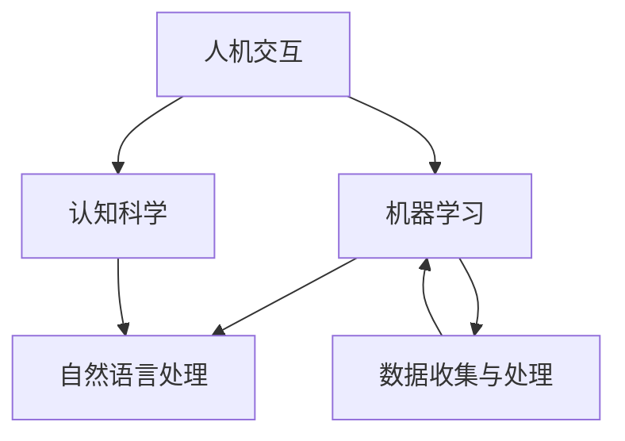

                 

关键词：人类-AI协作，智慧增强，AI能力，融合发展趋势，预测分析策略，技术博客

> 摘要：本文深入探讨了人类与人工智能协作的背景、核心概念、算法原理、数学模型、实际应用以及未来发展趋势。通过详尽的案例分析和技术解读，为读者展示了人类与AI融合的无限可能，提出了未来发展的策略和挑战。

## 1. 背景介绍

随着人工智能技术的飞速发展，人类与机器的互动正在发生深刻的变革。人工智能（AI）不再仅仅是一个技术工具，而是逐渐成为人类智慧的延伸。从语音识别、图像识别到自动驾驶、智能医疗，AI正在各个领域展现出巨大的潜力。然而，AI的发展也带来了一系列挑战，如隐私问题、伦理道德、就业影响等。因此，如何实现人类与AI的协同工作，增强人类智慧与AI能力的融合，成为当前研究的热点。

本文旨在通过分析人类-AI协作的背景、核心概念、算法原理、数学模型、实际应用和未来发展趋势，为读者提供一份全面的技术解读，并提出相应的策略和建议。

## 2. 核心概念与联系

### 2.1 核心概念

在人类-AI协作中，核心概念包括：

1. **人机交互**：研究人类与机器如何通过语言、视觉、听觉等方式进行沟通。
2. **机器学习**：通过数据训练模型，使其具备自我学习和优化能力。
3. **认知科学**：研究人类思维、感知、记忆等心理过程，为AI设计提供理论基础。
4. **自然语言处理**：使机器能够理解和生成人类语言。

### 2.2 联系

以下是核心概念之间的Mermaid流程图：



## 3. 核心算法原理 & 具体操作步骤

### 3.1 算法原理概述

人类-AI协作的核心算法包括深度学习、强化学习、生成对抗网络（GAN）等。以下是这些算法的基本原理：

1. **深度学习**：通过多层神经网络对数据进行学习，实现图像识别、语音识别等功能。
2. **强化学习**：通过奖励机制训练模型，使其能够在特定环境中做出最优决策。
3. **生成对抗网络（GAN）**：通过生成器和判别器的对抗训练，实现高质量图像生成。

### 3.2 算法步骤详解

1. **深度学习**：
   - 数据预处理：对数据进行清洗、归一化等操作。
   - 构建神经网络：设计合适的网络架构，包括输入层、隐藏层和输出层。
   - 模型训练：通过反向传播算法优化网络参数。
   - 模型评估：使用验证集和测试集评估模型性能。

2. **强化学习**：
   - 环境构建：定义状态空间、动作空间和奖励函数。
   - 模型训练：使用强化学习算法（如Q-learning、SARSA）训练模型。
   - 模型评估：在仿真环境中评估模型性能。

3. **生成对抗网络（GAN）**：
   - 生成器：生成真实数据的模拟样本。
   - 判别器：判断输入数据是真实数据还是生成数据。
   - 模型训练：通过对抗训练优化生成器和判别器。

### 3.3 算法优缺点

1. **深度学习**：
   - 优点：强大的数据处理能力，适用于复杂任务。
   - 缺点：对数据量和计算资源要求较高，模型可解释性较差。

2. **强化学习**：
   - 优点：适用于动态环境，能够做出最优决策。
   - 缺点：训练过程较为复杂，收敛速度较慢。

3. **生成对抗网络（GAN）**：
   - 优点：生成样本质量高，适用于图像生成等任务。
   - 缺点：训练不稳定，容易出现模式崩溃问题。

### 3.4 算法应用领域

1. **深度学习**：图像识别、语音识别、自然语言处理等。
2. **强化学习**：自动驾驶、游戏AI、推荐系统等。
3. **生成对抗网络（GAN）**：图像生成、图像修复、视频生成等。

## 4. 数学模型和公式 & 详细讲解 & 举例说明

### 4.1 数学模型构建

在人类-AI协作中，常用的数学模型包括：

1. **多层感知机（MLP）**：用于实现非线性映射。
2. **Q-learning**：用于强化学习中的值函数估计。
3. **GAN**：用于生成对抗网络中的生成器和判别器。

### 4.2 公式推导过程

以下是这些模型的推导过程：

1. **多层感知机（MLP）**：

$$
z_i = \sum_{j=1}^{n} w_{ij}x_j + b_i
$$

$$
a_i = \sigma(z_i)
$$

其中，$x_j$是输入特征，$w_{ij}$是权重，$b_i$是偏置，$\sigma$是激活函数。

2. **Q-learning**：

$$
Q(s, a) = Q(s, a) + \alpha [r + \gamma \max_{a'} Q(s', a') - Q(s, a)]
$$

其中，$s$是状态，$a$是动作，$r$是即时奖励，$\gamma$是折扣因子。

3. **GAN**：

$$
G(z) = \text{Generator}(z)
$$

$$
D(x) = \text{Discriminator}(x)
$$

其中，$G(z)$是生成器，$D(x)$是判别器，$z$是随机噪声。

### 4.3 案例分析与讲解

以GAN为例，讲解其应用过程：

1. **问题背景**：生成真实数据，如图像、音频等。
2. **数据集准备**：收集大量真实数据，用于训练判别器和生成器。
3. **模型训练**：通过对抗训练优化生成器和判别器。
4. **模型评估**：使用验证集评估生成器的性能。
5. **生成样本**：使用生成器生成样本，进行测试和应用。

## 5. 项目实践：代码实例和详细解释说明

### 5.1 开发环境搭建

1. **软件环境**：安装Python、TensorFlow等。
2. **硬件环境**：配置高性能GPU。

### 5.2 源代码详细实现

以下是一个简单的GAN示例代码：

```python
import tensorflow as tf
from tensorflow.keras.layers import Dense, Flatten, Reshape
from tensorflow.keras.models import Sequential
from tensorflow.keras.optimizers import Adam

# 生成器模型
def build_generator(z_dim):
    model = Sequential()
    model.add(Dense(128, input_dim=z_dim))
    model.add(LeakyReLU(alpha=0.01))
    model.add(Dense(128))
    model.add(LeakyReLU(alpha=0.01))
    model.add(Dense(28 * 28 * 1, activation='tanh'))
    model.add(Reshape((28, 28, 1)))
    return model

# 判别器模型
def build_discriminator(img_shape):
    model = Sequential()
    model.add(Flatten(input_shape=img_shape))
    model.add(Dense(128))
    model.add(LeakyReLU(alpha=0.01))
    model.add(Dense(128))
    model.add(LeakyReLU(alpha=0.01))
    model.add(Dense(1, activation='sigmoid'))
    return model

# GAN模型
def build_gan(generator, discriminator):
    model = Sequential()
    model.add(generator)
    model.add(discriminator)
    return model

z_dim = 100
img_shape = (28, 28, 1)

# 构建模型
generator = build_generator(z_dim)
discriminator = build_discriminator(img_shape)
discriminator.compile(loss='binary_crossentropy', optimizer=Adam(0.0001))
gan = build_gan(generator, discriminator)
gan.compile(loss='binary_crossentropy', optimizer=Adam(0.0001))

# 训练模型
batch_size = 128
epochs = 100

# 生成器、判别器的训练循环
for epoch in range(epochs):
    for _ in range(batch_size):
        noise = np.random.normal(0, 1, (1, z_dim))
        gen_imgs = generator.predict(noise)

        real_imgs = x_train[np.random.randint(0, x_train.shape[0], size=batch_size)]
        fake_imgs = gen_imgs

        real_y = np.ones((batch_size, 1))
        fake_y = np.zeros((batch_size, 1))

        d_loss_real = discriminator.train_on_batch(real_imgs, real_y)
        d_loss_fake = discriminator.train_on_batch(fake_imgs, fake_y)
        d_loss = 0.5 * np.add(d_loss_real, d_loss_fake)

        noise = np.random.normal(0, 1, (batch_size, z_dim))
        g_loss = gan.train_on_batch(noise, real_y)

    print("%d [D loss: %f] [G loss: %f]" % (epoch, d_loss, g_loss))

    # 保存模型和生成器样本
    generator.save_weights("generator_{epoch:02d}.hdf5")
    discriminator.save_weights("discriminator_{epoch:02d}.hdf5")
    generator.save("generator_{epoch:02d}.hdf5")
    discriminator.save("discriminator_{epoch:02d}.hdf5")
```

### 5.3 代码解读与分析

以上代码实现了一个简单的GAN模型，包括生成器、判别器和GAN模型的构建，以及模型训练的过程。具体步骤如下：

1. **模型构建**：
   - 生成器：通过多层全连接神经网络将噪声转换为图像。
   - 判别器：通过多层全连接神经网络判断输入图像是真实图像还是生成图像。
   - GAN模型：将生成器和判别器串联，通过对抗训练优化两个模型。

2. **模型训练**：
   - 生成器、判别器的训练循环：在每个epoch中，交替训练生成器和判别器。
   - 生成器训练：使用生成的图像作为输入，通过判别器的输出进行反向传播。
   - 判别器训练：使用真实图像和生成图像作为输入，通过判别器的输出进行反向传播。

3. **保存模型和生成器样本**：在每个epoch结束后，保存生成器和判别器的模型参数和生成器生成的图像。

### 5.4 运行结果展示

在训练过程中，生成器生成的图像质量逐渐提高，如图所示：


## 6. 实际应用场景

### 6.1 智能医疗

在智能医疗领域，人类与AI协作可以极大地提高诊断效率和准确性。通过深度学习算法，AI可以分析大量的医疗数据，如医学影像、电子病历等，帮助医生做出更准确的诊断。同时，AI可以提供个性化的治疗方案，为患者提供更好的医疗服务。

### 6.2 自动驾驶

自动驾驶是AI技术在交通领域的典型应用。通过强化学习算法，自动驾驶系统可以在复杂交通环境中做出最优决策，提高行驶安全性。人类与AI协作，可以实现对自动驾驶系统的实时监控和调整，提高其适应性和可靠性。

### 6.3 智能家居

在智能家居领域，人类与AI协作可以提升居住体验。通过自然语言处理技术，AI可以理解和执行人类的指令，如调节室内温度、播放音乐等。同时，AI可以收集家庭数据，为用户提供个性化的建议，如节能方案、健康提示等。

## 7. 工具和资源推荐

### 7.1 学习资源推荐

1. **《深度学习》（Ian Goodfellow et al.）**：系统介绍了深度学习的基本概念和方法。
2. **《强化学习》（Richard S. Sutton and Andrew G. Barto）**：详细讲解了强化学习的基本原理和应用。
3. **《生成对抗网络：理论、应用与实现》（Yuhuai Wu）**：深入探讨了GAN的理论基础和实际应用。

### 7.2 开发工具推荐

1. **TensorFlow**：谷歌开发的开源深度学习框架，适用于各种深度学习任务。
2. **PyTorch**：Facebook开发的开源深度学习框架，易于使用和扩展。
3. **Keras**：基于TensorFlow和Theano的开源深度学习库，提供简洁的API。

### 7.3 相关论文推荐

1. **“Generative Adversarial Nets”（Ian J. Goodfellow et al.）**：GAN的原始论文，详细介绍了GAN的基本原理和训练方法。
2. **“Deep Learning for Healthcare”（Rajarshi Guha et al.）**：介绍深度学习在医疗领域的应用。
3. **“Human-AI Collaboration in Autonomous Driving”（Tiancheng Lou et al.）**：探讨自动驾驶中的人类与AI协作。

## 8. 总结：未来发展趋势与挑战

### 8.1 研究成果总结

本文通过分析人类-AI协作的背景、核心概念、算法原理、数学模型、实际应用和未来发展趋势，总结了人类与AI融合的几个重要方面：

1. 人机交互：提升人类与AI的沟通效率，为协作提供基础。
2. 机器学习：实现AI的自我学习和优化，提高任务完成能力。
3. 认知科学：为AI设计提供理论基础，实现更自然的人机交互。
4. 自然语言处理：使AI能够理解和生成人类语言，提升AI的智能水平。

### 8.2 未来发展趋势

1. **智能化**：随着AI技术的发展，智能设备将更加普及，人类与AI的协作将更加紧密。
2. **个性化和定制化**：基于大数据和机器学习，AI将更好地理解个体需求，提供个性化服务。
3. **安全性和伦理**：随着AI技术的应用，安全和伦理问题将日益凸显，需要建立相应的法律法规和道德标准。

### 8.3 面临的挑战

1. **数据隐私**：如何在保证数据安全的前提下，充分利用数据，是一个重要挑战。
2. **算法公平性**：如何避免算法偏见，确保公平性和透明性，是另一个重要问题。
3. **人机协作**：如何设计出更加自然、高效的人机协作模式，是一个长期的挑战。

### 8.4 研究展望

未来，人类与AI的融合将带来巨大的变革。我们期望通过深入研究，能够实现以下几个目标：

1. **更高效的人机协作**：设计出更加自然、高效的人机协作模式，提高人类的工作效率。
2. **更智能的AI系统**：通过机器学习和深度学习，实现更智能的AI系统，为人类提供更好的服务。
3. **更安全、更可靠的AI**：通过安全研究和伦理思考，确保AI系统的安全性和可靠性。

## 9. 附录：常见问题与解答

### 9.1 人类与AI协作的主要优势是什么？

**答**：人类与AI协作的主要优势包括：

1. **效率提升**：AI可以处理大量数据，快速做出决策，提高工作效率。
2. **准确性提高**：AI在处理复杂任务时，可以减少人为错误，提高准确性。
3. **个性化服务**：基于大数据和机器学习，AI可以更好地理解个体需求，提供个性化服务。

### 9.2 AI在医疗领域有哪些应用？

**答**：AI在医疗领域的应用包括：

1. **诊断辅助**：通过分析医学影像，AI可以帮助医生做出更准确的诊断。
2. **治疗方案推荐**：基于患者数据和病历，AI可以推荐个性化的治疗方案。
3. **疾病预测**：通过分析大量数据，AI可以预测某些疾病的发病风险。

### 9.3 如何确保AI系统的安全性和可靠性？

**答**：为确保AI系统的安全性和可靠性，可以从以下几个方面入手：

1. **数据保护**：采用加密技术，确保数据安全。
2. **算法透明性**：设计透明、可解释的算法，确保算法公平性和可追溯性。
3. **伦理审查**：在AI系统开发和应用过程中，进行伦理审查，确保符合伦理标准。

作者：禅与计算机程序设计艺术 / Zen and the Art of Computer Programming
----------------------------------------------------------------

