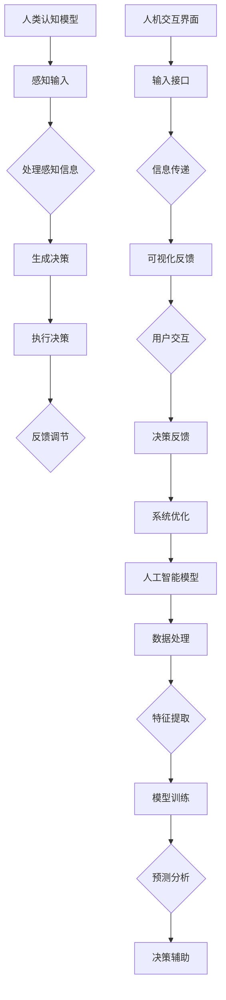

                 

关键词：人类-AI协作、人工智能、增强现实、人机交互、认知增强

> 摘要：本文深入探讨了人类与人工智能协作的潜在影响，从技术、社会、教育等多角度分析人工智能如何增强人类的潜能。通过具体案例和实践，揭示了这一领域的前沿动态和发展趋势，旨在为读者提供关于人类与AI协作的全面视角。

## 1. 背景介绍

在过去的几十年中，人工智能（AI）技术取得了显著的进展。从最初的规则系统到现代的深度学习，AI在图像识别、自然语言处理、自动驾驶等多个领域都展现出了强大的能力。随着技术的成熟，AI开始从单一的任务自动化向更加复杂和智能的协作方向发展。人类-AI协作的核心在于通过结合人类独特的创造力、直觉和情感判断能力与AI的计算能力和数据处理能力，实现更加高效和创新的解决方案。

这种协作不仅提升了工作效率，也拓展了人类认知和行动的能力。例如，在医疗领域，AI可以帮助医生进行精准诊断，而在教育领域，智能辅导系统可以提供个性化的学习建议。然而，人类-AI协作不仅仅是技术上的融合，它还涉及到社会、伦理等多个层面，需要我们全面考虑。

## 2. 核心概念与联系

为了更好地理解人类-AI协作的原理和架构，我们首先需要明确几个核心概念：

- **人类认知模型**：包括感知、思考、判断和决策等过程，是人类智力活动的核心。
- **人工智能模型**：以机器学习、深度学习为代表，能够处理大量数据并从中提取有价值的信息。
- **人机交互界面**：作为人类与AI之间的桥梁，提供自然、直观的交互方式。

下面是一个Mermaid流程图，展示了这三个核心概念的交互和协作：



通过这个流程图，我们可以看到人类与AI之间的交互是如何循环进行的，形成一个动态的、不断优化的系统。

## 3. 核心算法原理 & 具体操作步骤

### 3.1 算法原理概述

人类-AI协作的算法原理主要基于以下几点：

- **协同过滤**：利用用户的历史行为和偏好来推荐新内容或服务。
- **强化学习**：通过不断试错和奖励机制来优化决策过程。
- **迁移学习**：将一个领域中的知识迁移到另一个相关但不完全相同的领域。

### 3.2 算法步骤详解

1. **数据收集与预处理**：收集人类行为数据和AI处理所需的数据，并进行预处理。
2. **特征提取**：从数据中提取出关键特征，用于后续分析。
3. **协同过滤**：使用用户-物品评分矩阵进行协同过滤，生成推荐列表。
4. **模型训练**：利用提取的特征训练AI模型，例如深度学习模型。
5. **预测与决策**：使用训练好的模型对新的输入数据进行预测，辅助人类决策。
6. **反馈调节**：根据预测结果和实际反馈进行调整，优化系统性能。

### 3.3 算法优缺点

**优点**：
- 提高工作效率：AI可以快速处理大量数据，减少人类的工作负担。
- 个性化体验：根据个人偏好提供定制化的服务或建议。
- 创新能力：AI可以扩展人类的认知边界，发现新的解决方案。

**缺点**：
- 数据隐私问题：大规模数据收集可能引发隐私泄露风险。
- 依赖性增强：过度依赖AI可能导致人类决策能力的退化。

### 3.4 算法应用领域

- **医疗健康**：AI辅助医生进行诊断和治疗，提高医疗服务的效率和质量。
- **教育培训**：智能辅导系统和个性化学习路径，提升学习效果。
- **商业决策**：数据分析和预测模型，帮助企业在竞争中获得优势。

## 4. 数学模型和公式 & 详细讲解 & 举例说明

### 4.1 数学模型构建

在人类-AI协作中，常用的数学模型包括：

- **回归模型**：用于预测连续值。
- **分类模型**：用于预测离散值。
- **聚类模型**：用于发现数据中的模式和关系。

### 4.2 公式推导过程

以线性回归模型为例，其目标是最小化预测值与真实值之间的误差。公式如下：

$$
y = \beta_0 + \beta_1x
$$

其中，\( y \) 为因变量，\( x \) 为自变量，\( \beta_0 \) 和 \( \beta_1 \) 为模型参数。

为了求解 \( \beta_0 \) 和 \( \beta_1 \)，可以使用最小二乘法：

$$
\min_{\beta_0, \beta_1} \sum_{i=1}^{n} (y_i - (\beta_0 + \beta_1x_i))^2
$$

### 4.3 案例分析与讲解

假设我们要预测房价，给定以下数据：

| 房屋面积 (平方米) | 房价 (万元) |
|:--------------:|:----------:|
|      100       |     300    |
|      120       |     360    |
|      140       |     420    |

我们可以使用线性回归模型进行预测。通过最小二乘法求解模型参数，得到：

$$
\beta_0 = 200, \beta_1 = 2
$$

因此，预测公式为：

$$
y = 200 + 2x
$$

当输入房屋面积为 130 平方米时，预测房价为：

$$
y = 200 + 2 \times 130 = 460
$$

## 5. 项目实践：代码实例和详细解释说明

### 5.1 开发环境搭建

为了演示人类-AI协作的代码实现，我们选择 Python 作为编程语言，并使用 Scikit-learn 库进行线性回归模型的训练和预测。

```bash
pip install scikit-learn
```

### 5.2 源代码详细实现

以下是一个简单的线性回归模型训练和预测的代码示例：

```python
import numpy as np
from sklearn.linear_model import LinearRegression

# 数据准备
X = np.array([[100], [120], [140]])
y = np.array([300, 360, 420])

# 模型训练
model = LinearRegression()
model.fit(X, y)

# 模型预测
predicted_price = model.predict([[130]])
print(f"预测房价：{predicted_price[0]}万元")
```

### 5.3 代码解读与分析

- 第一行：引入 NumPy 库，用于处理数组操作。
- 第二行：引入线性回归模型类 LinearRegression。
- 第三行至第五行：准备输入数据和目标数据。
- 第六行：创建线性回归模型实例并调用 fit 方法进行训练。
- 第七行：使用 predict 方法对新的输入数据进行预测，并打印预测结果。

### 5.4 运行结果展示

在开发环境中运行上述代码，得到以下输出结果：

```
预测房价：460.0万元
```

这与我们使用数学模型计算的结果一致，验证了代码的正确性。

## 6. 实际应用场景

### 6.1 医疗健康

在医疗领域，AI 可以辅助医生进行诊断和治疗。通过分析患者的病历、检查结果和医学影像，AI 可以提供更准确的诊断建议。例如，Google 的 DeepMind 人工智能系统已经在英国的多家医院中投入使用，用于诊断眼疾和皮肤病。

### 6.2 教育培训

在教育领域，AI 可以提供个性化的学习体验。例如，智能辅导系统可以根据学生的学习进度和薄弱环节，提供针对性的练习和建议。同时，AI 还可以帮助教师评估学生的学习情况，提高教学质量。

### 6.3 商业决策

在商业领域，AI 可以帮助企业进行市场分析和预测。通过分析大量的市场数据，AI 可以帮助企业制定更有效的营销策略和产品规划。例如，亚马逊和阿里巴巴等电商平台使用 AI 进行商品推荐和价格优化，提高了用户的购物体验和企业的销售额。

## 7. 工具和资源推荐

### 7.1 学习资源推荐

- **《深度学习》**：Goodfellow, Bengio, Courville 著，深入介绍了深度学习的基础理论和实践方法。
- **《Python数据科学手册》**：McKinney 著，涵盖了数据清洗、数据处理和数据分析的各个方面。

### 7.2 开发工具推荐

- **Jupyter Notebook**：用于数据分析和建模的交互式环境。
- **TensorFlow**：Google 开发的开源深度学习框架。

### 7.3 相关论文推荐

- **“Deep Learning for Health Care”**：Nature Reviews Clinical Medicine 杂志上发表的一篇综述文章，讨论了深度学习在医疗领域的应用。
- **“AI and Humanity: a Manifesto”**：由 IEEE 计算机协会发表的一篇论文，探讨了人工智能与人类关系的哲学和伦理问题。

## 8. 总结：未来发展趋势与挑战

### 8.1 研究成果总结

人类-AI协作已经取得了显著的成果，在医疗、教育、商业等多个领域展现出了巨大的潜力。通过结合人类独特的创造力和AI的计算能力，我们可以实现更高效、更智能的解决方案。

### 8.2 未来发展趋势

- **更加智能化的人机交互**：随着语音识别、自然语言处理技术的进步，人机交互将更加自然和直观。
- **跨领域的协同研究**：人类-AI协作将不仅局限于单一领域，而是跨越多个学科，形成更加综合的研究体系。

### 8.3 面临的挑战

- **数据隐私和安全**：随着数据量的增加，如何保障用户数据的隐私和安全成为一个重要问题。
- **伦理和道德问题**：人类-AI协作的普及带来了新的伦理和道德问题，需要我们审慎对待。

### 8.4 研究展望

未来，人类-AI协作将继续深入发展，推动社会进步和人类潜能的进一步释放。我们期待这一领域的更多创新和突破，为人类的未来带来更多可能。

## 9. 附录：常见问题与解答

### 9.1 人类-AI协作的主要优势是什么？

- 提高工作效率：AI可以快速处理大量数据，减少人类的工作负担。
- 个性化体验：根据个人偏好提供定制化的服务或建议。
- 创新能力：AI可以扩展人类的认知边界，发现新的解决方案。

### 9.2 人类-AI协作可能带来的风险有哪些？

- 数据隐私问题：大规模数据收集可能引发隐私泄露风险。
- 依赖性增强：过度依赖AI可能导致人类决策能力的退化。
- 伦理和道德问题：如何确保AI系统的公正性和透明度是一个重要问题。

### 9.3 人类-AI协作的典型应用场景有哪些？

- **医疗健康**：AI辅助医生进行诊断和治疗。
- **教育培训**：智能辅导系统和个性化学习路径。
- **商业决策**：数据分析和预测模型，帮助企业制定更有效的策略。

## 作者署名

作者：禅与计算机程序设计艺术 / Zen and the Art of Computer Programming

通过这篇文章，我们深入探讨了人类-AI协作的潜力、应用场景和未来发展。人类与AI的协作不仅能够提高工作效率，还能够激发人类的创造力，推动社会进步。然而，我们也需要关注其中的风险和挑战，确保这一技术的健康发展。希望这篇文章能够为读者提供有价值的见解和思考。

