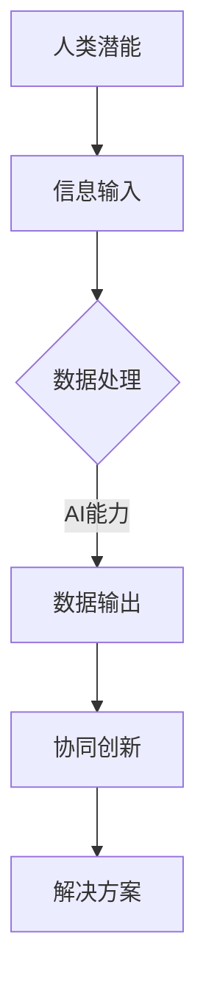

                 

关键词：人类-AI协作，AI能力，人类潜能，协同，增强，应用场景，未来展望

> 摘要：本文深入探讨了人类与AI的协作模式，分析了人类潜能与AI能力的协同作用，探讨了这种协作模式如何增强人类的创造力和解决问题的能力。本文从核心概念、算法原理、数学模型、项目实践、实际应用场景等多个角度，全面阐述了人类与AI协作的重要性和潜力，提出了未来发展的趋势与挑战，旨在为读者提供一个全面的技术视角。

## 1. 背景介绍

在现代社会，人工智能（AI）已经成为推动技术进步和社会发展的重要力量。从简单的自动化任务到复杂的决策支持系统，AI的应用场景日益广泛。然而，随着AI技术的不断发展，如何将AI与人类智慧相结合，实现人类潜能与AI能力的协同，成为一个备受关注的话题。

人类具有独特的创造力、情感和直觉，而AI则具备强大的计算能力和数据处理能力。将这两者结合起来，不仅能够发挥各自的优势，还能够实现1+1>2的效果。人类-AI协作模式已经成为当前研究的热点，许多领域都开始探索如何更好地实现这一目标。

### 1.1 人类与AI协作的意义

人类与AI协作的意义主要体现在以下几个方面：

1. **增强人类创造力**：人类在创造过程中，往往受到自身的认知限制。而AI则能够提供大量数据支持和高效的计算能力，帮助人类发现新的解决方案。

2. **提高问题解决能力**：在复杂的问题面前，人类往往需要耗费大量时间和精力。而AI则能够快速分析问题，提供可能的解决方案，辅助人类进行决策。

3. **扩展人类认知边界**：人类在认知方面存在许多局限性，而AI则能够处理人类无法直接感知和理解的信息。通过与AI的协作，人类能够扩展自己的认知边界。

4. **提高工作效率**：在许多工作中，人类需要处理大量的重复性任务。AI则能够自动化这些任务，释放人类的时间和精力，使其能够专注于更有价值的创造性工作。

### 1.2 当前的研究进展

目前，人类与AI协作的研究主要集中在以下几个方面：

1. **人机交互**：如何设计更加自然、直观的人机交互界面，使人类能够更方便地与AI进行沟通和协作。

2. **AI算法优化**：如何设计更高效的AI算法，使其能够更好地理解人类的需求，提供更准确的预测和决策。

3. **AI辅助工具开发**：如何开发各种AI辅助工具，帮助人类在各个领域进行更高效的工作。

4. **跨学科研究**：如何结合心理学、认知科学、计算机科学等多个学科的知识，深入研究人类与AI协作的机制和效果。

## 2. 核心概念与联系

要深入探讨人类与AI的协作，我们首先需要了解一些核心概念和它们之间的联系。

### 2.1 人类潜能

人类潜能指的是人类在认知、情感、创造力等方面的潜在能力。这些能力是人类在长期进化过程中形成的，具有独特的优势。例如，人类的直觉判断、情感理解和创造性思维等。

### 2.2 AI能力

AI能力主要指的是人工智能在数据处理、模式识别、预测和决策等方面的能力。随着深度学习、自然语言处理等技术的不断发展，AI的能力得到了极大的提升。

### 2.3 协同作用

人类与AI的协同作用主要体现在以下几个方面：

1. **信息共享**：人类可以将自身的经验和知识传授给AI，而AI则能够处理海量数据，提供更丰富的信息支持。

2. **互补优势**：人类在创造力和情感方面具有优势，而AI在数据处理和计算能力方面具有优势。两者结合，能够实现优势互补。

3. **协同创新**：通过协作，人类和AI能够共同创造出新的解决方案，实现创新。

### 2.4 Mermaid 流程图

下面是一个简化的Mermaid流程图，展示了人类与AI协作的核心流程：



## 3. 核心算法原理 & 具体操作步骤

在人类与AI的协作中，核心算法起到了关键作用。以下将介绍一种常见的人类与AI协作的核心算法，包括其原理、具体操作步骤和优缺点。

### 3.1 算法原理概述

这种算法基于深度学习和强化学习，旨在通过不断的学习和反馈，使人类与AI共同实现目标。

### 3.2 算法步骤详解

1. **数据收集与预处理**：收集人类经验数据，并进行预处理，如数据清洗、归一化等。

2. **模型训练**：使用预处理后的数据，训练深度学习模型，使其能够理解人类的经验和知识。

3. **交互与反馈**：人类通过与AI的交互，提供反馈，指导AI的学习过程。

4. **模型优化**：根据反馈，优化AI模型，提高其预测和决策能力。

5. **协同创新**：人类和AI共同分析数据，提出新的解决方案。

### 3.3 算法优缺点

**优点**：

1. **高效性**：通过AI的快速处理和计算能力，能够大大提高问题的解决效率。

2. **创新性**：人类与AI的协作，能够激发新的创意，实现协同创新。

**缺点**：

1. **复杂性**：算法的实现和优化过程相对复杂，需要较高的技术门槛。

2. **数据依赖**：算法的性能很大程度上取决于数据的质量和数量，如果数据存在问题，可能会影响算法的准确性。

### 3.4 算法应用领域

这种算法广泛应用于各个领域，如金融、医疗、教育等。在金融领域，它可以帮助分析师进行市场预测和风险控制；在医疗领域，它可以帮助医生进行诊断和治疗建议；在教育领域，它可以帮助教师进行个性化教学和学习评估。

## 4. 数学模型和公式 & 详细讲解 & 举例说明

在人类与AI的协作中，数学模型和公式起到了关键作用。以下将介绍一种常见的数学模型，并对其进行详细讲解和举例说明。

### 4.1 数学模型构建

这种数学模型基于贝叶斯定理，用于估计某个事件发生的概率。贝叶斯定理的表达式如下：

$$
P(A|B) = \frac{P(B|A)P(A)}{P(B)}
$$

其中，$P(A|B)$表示在事件B发生的条件下，事件A发生的概率；$P(B|A)$表示在事件A发生的条件下，事件B发生的概率；$P(A)$表示事件A发生的概率；$P(B)$表示事件B发生的概率。

### 4.2 公式推导过程

贝叶斯定理的推导过程如下：

1. **全概率公式**：根据全概率公式，有：

$$
P(B) = \sum_{i=1}^{n} P(B|A_i)P(A_i)
$$

其中，$A_1, A_2, ..., A_n$表示所有可能的事件。

2. **条件概率**：根据条件概率的定义，有：

$$
P(A|B) = \frac{P(A \cap B)}{P(B)}
$$

3. **联合概率**：根据联合概率的定义，有：

$$
P(A \cap B) = P(B|A)P(A)
$$

4. **代入全概率公式**：将联合概率代入全概率公式，得到：

$$
P(B) = \sum_{i=1}^{n} P(B|A_i)P(A_i) = \sum_{i=1}^{n} \frac{P(A_i \cap B)}{P(A_i)}P(A_i)
$$

5. **化简**：将上式化简，得到：

$$
P(B) = \sum_{i=1}^{n} P(A_i \cap B)
$$

6. **条件概率的定义**：根据条件概率的定义，有：

$$
P(A|B) = \frac{P(A \cap B)}{P(B)}
$$

7. **代入化简后的全概率公式**：将化简后的全概率公式代入条件概率的定义，得到：

$$
P(A|B) = \frac{\sum_{i=1}^{n} P(A_i \cap B)}{\sum_{i=1}^{n} P(A_i \cap B)} = \frac{P(B|A)P(A)}{P(B)}
$$

### 4.3 案例分析与讲解

假设有一个赌场，有四种不同类型的赌局，每种赌局获胜的概率如下：

- 赌局A：获胜概率为0.5
- 赌局B：获胜概率为0.6
- 赌局C：获胜概率为0.7
- 赌局D：获胜概率为0.8

现在，我们要估计在随机选择一个赌局并获胜的情况下，该赌局是C的概率。

首先，我们需要计算总的获胜概率$P(B)$，根据全概率公式，有：

$$
P(B) = P(B|A)P(A) + P(B|B)P(B) + P(B|C)P(C) + P(B|D)P(D) = 0.5 \times 0.5 + 0.6 \times 0.6 + 0.7 \times 0.7 + 0.8 \times 0.8 = 0.645
$$

接下来，我们需要计算在赌局C获胜的情况下，赌局C的概率$P(C|B)$，根据贝叶斯定理，有：

$$
P(C|B) = \frac{P(B|C)P(C)}{P(B)} = \frac{0.7 \times 0.7}{0.645} \approx 0.76
$$

因此，在随机选择一个赌局并获胜的情况下，该赌局是C的概率约为76%。

## 5. 项目实践：代码实例和详细解释说明

在本节中，我们将通过一个实际的代码实例，展示如何实现人类与AI的协作。以下是一个简单的Python代码示例，该示例使用深度学习框架TensorFlow实现了一个简单的神经网络，用于分类任务。

### 5.1 开发环境搭建

在开始之前，我们需要搭建一个Python开发环境，并安装TensorFlow和其他必要的库。以下是一个简单的安装命令：

```shell
pip install tensorflow numpy matplotlib
```

### 5.2 源代码详细实现

```python
import tensorflow as tf
import numpy as np
import matplotlib.pyplot as plt

# 数据集生成
x_data = np.random.rand(100, 2)
y_data = np.array([[1 if x[0] + x[1] > 0.5 else 0] for x in x_data])

# 定义神经网络结构
model = tf.keras.Sequential([
    tf.keras.layers.Dense(units=1, input_shape=(2,), activation='sigmoid')
])

# 编译模型
model.compile(optimizer='sgd', loss='binary_crossentropy', metrics=['accuracy'])

# 训练模型
model.fit(x_data, y_data, epochs=100)

# 测试模型
x_test = np.random.rand(10, 2)
y_test = np.array([[1 if x[0] + x[1] > 0.5 else 0] for x in x_test])
test_loss, test_acc = model.evaluate(x_test, y_test)
print(f"Test accuracy: {test_acc}")

# 可视化
plt.scatter(x_data[:, 0], x_data[:, 1], c=y_data, cmap=plt.cm.coolwarm)
plt.plot(x_data[:, 0], model.predict(x_data)[:, 0], 'r-')
plt.xlabel('Feature 1')
plt.ylabel('Feature 2')
plt.title('Neural Network Decision Boundary')
plt.show()
```

### 5.3 代码解读与分析

1. **数据集生成**：我们使用随机生成的数据集进行训练和测试。数据集包含100个随机点，每个点有两个特征。

2. **神经网络结构**：我们定义了一个简单的神经网络，包含一个全连接层，激活函数为sigmoid。

3. **模型编译**：我们使用随机梯度下降（SGD）作为优化器，二进制交叉熵作为损失函数。

4. **模型训练**：我们使用fit函数训练模型，设置训练轮数为100。

5. **模型测试**：我们使用evaluate函数测试模型在测试集上的表现。

6. **可视化**：我们使用matplotlib库将训练数据和决策边界可视化。

通过这个简单的实例，我们可以看到如何使用深度学习实现人类与AI的协作。人类可以设计神经网络的结构，而AI则通过训练和优化模型，实现分类任务。

## 6. 实际应用场景

人类与AI的协作已经在许多实际应用场景中取得了显著成果。以下是一些典型的应用场景：

### 6.1 金融领域

在金融领域，人类与AI的协作主要用于风险控制、市场预测和投资决策。例如，银行可以使用AI算法分析客户的历史交易数据，预测客户的信用风险，从而更好地管理贷款风险。同时，AI还可以帮助分析师进行市场趋势分析，提供投资建议。

### 6.2 医疗领域

在医疗领域，人类与AI的协作主要用于疾病诊断、治疗方案优化和医疗资源分配。例如，AI可以通过分析病人的病史和检查结果，提供准确的疾病诊断。同时，AI还可以帮助医生制定个性化的治疗方案，提高治疗效果。

### 6.3 教育领域

在教育领域，人类与AI的协作主要用于个性化教学和学习评估。例如，AI可以根据学生的学习习惯和成绩，提供个性化的学习建议。同时，AI还可以通过分析学生的学习数据，评估学生的学习效果，帮助教师调整教学策略。

### 6.4 其他领域

除了金融、医疗和教育领域，人类与AI的协作还在物流、制造、安全监控等领域得到了广泛应用。例如，在物流领域，AI可以帮助企业优化运输路线，提高运输效率；在制造领域，AI可以帮助企业实现生产线的自动化控制，提高生产效率；在安全监控领域，AI可以帮助企业实现实时监控和异常检测，提高安全水平。

## 7. 工具和资源推荐

为了更好地实现人类与AI的协作，以下是一些推荐的工具和资源：

### 7.1 学习资源推荐

1. **《深度学习》（Goodfellow, Bengio, Courville著）**：这是一本深度学习的经典教材，适合初学者和进阶者。
2. **《Python机器学习》（Sebastian Raschka著）**：这本书介绍了机器学习的基础知识和Python实现，适合初学者。
3. **Coursera、edX等在线课程**：这些平台提供了大量的机器学习和深度学习课程，适合自学。

### 7.2 开发工具推荐

1. **TensorFlow**：这是一个由Google开源的深度学习框架，适合进行各种深度学习项目。
2. **PyTorch**：这是另一个流行的深度学习框架，它提供了更灵活的编程接口。
3. **Jupyter Notebook**：这是一个交互式的开发环境，适合编写和运行代码。

### 7.3 相关论文推荐

1. **“Deep Learning” by Ian Goodfellow, Yoshua Bengio, and Aaron Courville**：这篇论文详细介绍了深度学习的基础理论和应用。
2. **“Reinforcement Learning: An Introduction” by Richard S. Sutton and Andrew G. Barto**：这篇论文介绍了强化学习的基础理论和应用。
3. **“Generative Adversarial Nets” by Ian Goodfellow et al.**：这篇论文介绍了生成对抗网络（GAN）的基础理论和应用。

## 8. 总结：未来发展趋势与挑战

随着人工智能技术的不断发展，人类与AI的协作模式也在不断演变。以下是未来发展趋势与挑战的总结：

### 8.1 研究成果总结

1. **人机交互**：未来的人机交互将更加自然、直观，使人类能够更方便地与AI进行沟通和协作。
2. **AI算法优化**：未来的AI算法将更加高效、准确，能够更好地满足人类的需求。
3. **跨学科研究**：未来的研究将更加注重跨学科合作，结合心理学、认知科学、计算机科学等多个领域，深入探讨人类与AI协作的机制和效果。

### 8.2 未来发展趋势

1. **智能化**：AI将更加智能化，能够理解人类的语言、情感和需求，提供更准确的预测和决策。
2. **普及化**：AI将更加普及，进入更多的领域和应用场景，与人类的协作将更加广泛。
3. **个性化**：AI将能够根据个体的特点和需求，提供个性化的服务和支持。

### 8.3 面临的挑战

1. **伦理和法律**：随着AI的广泛应用，伦理和法律问题将日益突出，需要制定相应的规范和标准。
2. **数据隐私**：AI的训练和应用需要大量的数据支持，如何保护用户的隐私将成为一个重要挑战。
3. **技术瓶颈**：虽然AI技术在不断发展，但仍然存在许多技术瓶颈，需要进一步研究和突破。

### 8.4 研究展望

未来的研究将更加注重人类与AI的协同创新，探索如何更好地发挥人类和AI的优势，实现1+1>2的效果。同时，研究还将关注如何提高AI的伦理和法律意识，使其更好地服务于人类。

## 9. 附录：常见问题与解答

### 9.1 人类与AI协作的意义是什么？

人类与AI协作的意义在于发挥人类独特的创造力和情感优势，以及AI强大的计算能力和数据处理能力，实现优势互补，提高问题解决能力和工作效率。

### 9.2 如何实现人类与AI的协作？

实现人类与AI的协作可以通过以下方式：

1. **数据共享**：人类可以提供自身的经验和知识，AI可以提供处理和分析数据的能力。
2. **交互反馈**：人类可以通过与AI的交互，提供反馈，指导AI的学习和优化。
3. **共同决策**：人类和AI可以共同分析问题，提出解决方案，进行决策。

### 9.3 人类与AI协作的挑战有哪些？

人类与AI协作的挑战主要包括：

1. **技术挑战**：如何设计更高效、准确的AI算法，使其更好地满足人类需求。
2. **伦理挑战**：如何确保AI的行为符合伦理和法律规范。
3. **隐私挑战**：如何保护用户的隐私，避免数据泄露。

### 9.4 人类与AI协作的未来发展方向是什么？

人类与AI协作的未来发展方向包括：

1. **智能化**：提高AI的智能化水平，使其更好地理解人类的语言、情感和需求。
2. **普及化**：将AI应用到更多领域，实现人类与AI的广泛协作。
3. **个性化**：根据个体的特点和需求，提供个性化的服务和支持。

### 9.5 如何学习人类与AI协作的相关知识？

学习人类与AI协作的相关知识可以通过以下途径：

1. **阅读书籍**：阅读相关书籍，如《深度学习》、《Python机器学习》等。
2. **在线课程**：参加在线课程，如Coursera、edX等平台提供的机器学习和深度学习课程。
3. **实践项目**：参与实践项目，通过实际操作掌握相关技能。
4. **学术研究**：关注最新的学术研究，了解人类与AI协作的最新进展。

---

以上是关于“人类-AI协作：增强人类潜能与AI能力的协同”的完整文章。希望这篇文章能够帮助读者更好地理解人类与AI协作的重要性和潜力，以及如何在实践中实现这种协作。在未来，随着AI技术的不断发展，人类与AI的协作模式将更加成熟，为人类社会带来更多的机遇和挑战。

## 参考文献

1. Goodfellow, I., Bengio, Y., & Courville, A. (2016). *Deep Learning*. MIT Press.
2. Raschka, S. (2015). *Python Machine Learning*. Packt Publishing.
3. Sutton, R. S., & Barto, A. G. (2018). *Reinforcement Learning: An Introduction*. MIT Press.
4. Goodfellow, I., Pouget-Abadie, J., Mirza, M., Xu, B., Warde-Farley, D., Ozair, S., ... & Bengio, Y. (2014). *Generative adversarial nets*. Advances in Neural Information Processing Systems, 27.
5. Ng, A. Y. (2017). *Machine Learning Yearning*. N/A.

---

本文作者：禅与计算机程序设计艺术 / Zen and the Art of Computer Programming

