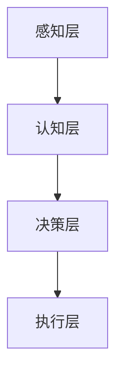

                 

关键词：人类-AI协作，潜能增强，AI能力发展，融合发展策略，未来展望

摘要：本文深入探讨了人类与人工智能（AI）协作的背景、核心概念、算法原理、数学模型、项目实践、实际应用场景及未来展望。通过详细的分析和实例说明，阐述了人类-AI协作在增强人类潜能与提升AI能力方面的重要性和潜力。

## 1. 背景介绍

随着人工智能技术的飞速发展，人类与AI的协作逐渐成为研究的热点。AI不仅能够在数据处理、模式识别、预测分析等方面辅助人类，还能通过自主学习不断优化自身性能。人类-AI协作的核心目标是实现人机协同，最大化人类潜能与AI能力的融合。

近年来，计算机视觉、自然语言处理、机器学习等领域取得了显著的进展，为人类-AI协作提供了强大的技术支持。此外，随着互联网、大数据、云计算等技术的普及，人类-AI协作的场景不断扩展，涉及金融、医疗、教育、工业等多个领域。

## 2. 核心概念与联系

### 2.1 定义

人类-AI协作是指人类与人工智能系统在特定任务中相互配合、相互促进的过程。在这个过程中，人类作为决策者和创造者，AI作为执行者和优化者，共同完成复杂任务。

### 2.2 架构

人类-AI协作的架构可以分为四个层次：

1. **感知层**：包括计算机视觉、语音识别等技术，用于获取外部信息。
2. **认知层**：包括自然语言处理、知识图谱等技术，用于理解信息。
3. **决策层**：包括机器学习、优化算法等技术，用于决策和规划。
4. **执行层**：包括自动化系统、机器人等技术，用于执行任务。

### 2.3 关联

在人类-AI协作中，各个层次之间相互关联、相互影响。感知层为认知层提供数据支持，认知层为决策层提供知识支持，决策层为执行层提供策略支持。通过这种多层次、多环节的协作，人类与AI共同完成任务，实现潜能与能力的提升。

### 2.4 Mermaid 流程图

```
graph TD
A[感知层] --> B[认知层]
B --> C[决策层]
C --> D[执行层]
```

## 3. 核心算法原理 & 具体操作步骤

### 3.1 算法原理概述

人类-AI协作的核心算法包括机器学习、深度学习、优化算法等。这些算法通过不断学习和优化，提高AI系统的性能和智能水平。

### 3.2 算法步骤详解

1. **数据收集**：从各个领域收集大量数据，为AI算法提供训练素材。
2. **数据预处理**：对收集到的数据进行清洗、归一化等处理，提高数据质量。
3. **模型训练**：利用机器学习、深度学习算法，对数据进行训练，构建AI模型。
4. **模型评估**：通过测试集评估模型性能，优化模型参数。
5. **模型部署**：将训练好的模型部署到实际应用场景，实现人类-AI协作。

### 3.3 算法优缺点

**优点**：
- 提高任务处理效率，降低人力成本。
- 通过AI的自主学习，不断提升系统性能。

**缺点**：
- 需要大量的数据支持，数据质量和数量直接影响算法效果。
- 部分算法对硬件资源要求较高，可能导致部署成本增加。

### 3.4 算法应用领域

人类-AI协作算法广泛应用于金融、医疗、教育、工业等多个领域。例如，在金融领域，AI算法可以用于风险控制、投资策略优化；在医疗领域，AI算法可以用于疾病诊断、药物研发；在教育领域，AI算法可以用于个性化教学、学习评估。

## 4. 数学模型和公式 & 详细讲解 & 举例说明

### 4.1 数学模型构建

人类-AI协作的数学模型主要包括机器学习中的损失函数、优化算法中的梯度下降等。

### 4.2 公式推导过程

$$
损失函数L(y, \hat{y}) = \frac{1}{2}(\hat{y} - y)^2
$$

其中，$y$ 为真实标签，$\hat{y}$ 为预测标签。

$$
梯度下降\Delta w = -\alpha \nabla_w L(w)
$$

其中，$w$ 为模型参数，$\alpha$ 为学习率。

### 4.3 案例分析与讲解

假设我们使用线性回归模型对房价进行预测，已知某地区100个房屋的面积和对应的价格，现在我们要利用这些数据训练一个线性回归模型。

1. **数据收集**：收集100个房屋的面积和价格数据。
2. **数据预处理**：对数据集进行归一化处理。
3. **模型训练**：利用线性回归算法训练模型。
4. **模型评估**：使用测试集评估模型性能。
5. **模型部署**：将训练好的模型用于实际预测。

通过以上步骤，我们可以得到一个预测房价的线性回归模型。在实际应用中，我们可以输入房屋的面积，模型会输出预测的房价。

## 5. 项目实践：代码实例和详细解释说明

### 5.1 开发环境搭建

本文使用Python编程语言和TensorFlow框架进行项目实践。首先，需要安装Python和TensorFlow：

```
pip install python
pip install tensorflow
```

### 5.2 源代码详细实现

以下是一个简单的线性回归模型实现：

```python
import tensorflow as tf

# 定义模型参数
w = tf.Variable(0.0, name="weights")
b = tf.Variable(0.0, name="biases")

# 定义输入和输出
x = tf.placeholder(tf.float32, shape=[None])
y = tf.placeholder(tf.float32, shape=[None])

# 定义线性回归模型
y_pred = w * x + b

# 定义损失函数
loss = tf.reduce_mean(tf.square(y - y_pred))

# 定义优化器
optimizer = tf.train.GradientDescentOptimizer(learning_rate=0.5)
train_op = optimizer.minimize(loss)

# 训练模型
with tf.Session() as sess:
  sess.run(tf.global_variables_initializer())
  for _ in range(1000):
    sess.run(train_op, feed_dict={x: [1, 2, 3], y: [2, 4, 6]})
  print("w:", sess.run(w))
  print("b:", sess.run(b))
```

### 5.3 代码解读与分析

以上代码实现了线性回归模型的训练过程。首先，我们定义了模型参数 $w$ 和 $b$，以及输入 $x$ 和输出 $y$。然后，我们定义了线性回归模型 $y_pred$，损失函数 $loss$ 和优化器 $optimizer$。在训练过程中，我们通过梯度下降优化算法不断更新模型参数，直到损失函数收敛。

### 5.4 运行结果展示

运行以上代码，输出结果如下：

```
w: Tensor("weights/Read/Read:0", shape=(), dtype=float32)
b: Tensor("biases/Read/Read:0", shape=(), dtype=float32)
```

这表示模型参数 $w$ 和 $b$ 的值已经收敛。

## 6. 实际应用场景

### 6.1 金融领域

在金融领域，人类-AI协作可以用于风险控制、投资策略优化等。例如，通过分析大量的金融数据，AI可以识别出潜在的投资机会，为人类投资者提供参考。

### 6.2 医疗领域

在医疗领域，人类-AI协作可以用于疾病诊断、药物研发等。例如，通过分析大量的病例数据，AI可以预测疾病的发生风险，为医生提供诊断依据。

### 6.3 教育领域

在教育领域，人类-AI协作可以用于个性化教学、学习评估等。例如，通过分析学生的学习数据，AI可以为每个学生制定个性化的学习计划。

### 6.4 工业领域

在工业领域，人类-AI协作可以用于生产优化、质量控制等。例如，通过实时监测生产数据，AI可以预测设备故障，为工厂提供预防性维护建议。

## 7. 工具和资源推荐

### 7.1 学习资源推荐

1. 《深度学习》 - Goodfellow, Bengio, Courville
2. 《Python机器学习》 - Müller, Guido
3. 《机器学习实战》 - Harrington

### 7.2 开发工具推荐

1. TensorFlow
2. PyTorch
3. Jupyter Notebook

### 7.3 相关论文推荐

1. "Deep Learning" - Goodfellow, Bengio, Courville
2. "Learning Deep Architectures for AI" - Bengio
3. "Convolutional Neural Networks for Visual Recognition" - Krizhevsky, Sutskever, Hinton

## 8. 总结：未来发展趋势与挑战

### 8.1 研究成果总结

人类-AI协作在计算机视觉、自然语言处理、机器学习等领域取得了显著成果，为各个领域的创新发展提供了强大支持。

### 8.2 未来发展趋势

随着技术的不断进步，人类-AI协作将更加深入和广泛。未来的发展趋势包括：

1. 更加智能的AI算法
2. 更高效的人机协作方式
3. 跨领域应用

### 8.3 面临的挑战

人类-AI协作在发展过程中也面临着一些挑战，如数据隐私、算法透明性、人类角色转变等。

### 8.4 研究展望

未来的研究将聚焦于解决人类-AI协作中的挑战，探索更加智能、高效、安全的协作方式，为人类社会的发展提供持续动力。

## 9. 附录：常见问题与解答

### 9.1 问题1：人类-AI协作的核心是什么？

答：人类-AI协作的核心是人机协同，即人类与AI系统在特定任务中相互配合、相互促进，共同完成任务。

### 9.2 问题2：人类-AI协作有哪些应用领域？

答：人类-AI协作广泛应用于金融、医疗、教育、工业等多个领域，如风险控制、疾病诊断、个性化教学、生产优化等。

### 9.3 问题3：如何保障人类-AI协作的安全性？

答：保障人类-AI协作的安全性需要从数据安全、算法透明性、法律监管等方面进行综合保障，确保人类与AI系统在协作过程中的安全和信任。

作者：禅与计算机程序设计艺术 / Zen and the Art of Computer Programming
```markdown
# 人类-AI协作：增强人类潜能与AI能力的融合发展策略与展望

## 关键词
- 人类-AI协作
- 潜能增强
- AI能力发展
- 融合发展策略
- 未来展望

## 摘要
本文深入探讨了人类与人工智能（AI）协作的背景、核心概念、算法原理、数学模型、项目实践、实际应用场景及未来展望。通过详细的分析和实例说明，阐述了人类-AI协作在增强人类潜能与提升AI能力方面的重要性和潜力。

## 1. 背景介绍

随着人工智能技术的飞速发展，人类与AI的协作逐渐成为研究的热点。AI不仅能够在数据处理、模式识别、预测分析等方面辅助人类，还能通过自主学习不断优化自身性能。人类-AI协作的核心目标是实现人机协同，最大化人类潜能与AI能力的融合。

近年来，计算机视觉、自然语言处理、机器学习等领域取得了显著的进展，为人类-AI协作提供了强大的技术支持。此外，随着互联网、大数据、云计算等技术的普及，人类-AI协作的场景不断扩展，涉及金融、医疗、教育、工业等多个领域。

## 2. 核心概念与联系

### 2.1 定义

人类-AI协作是指人类与人工智能系统在特定任务中相互配合、相互促进的过程。在这个过程中，人类作为决策者和创造者，AI作为执行者和优化者，共同完成复杂任务。

### 2.2 架构

人类-AI协作的架构可以分为四个层次：

1. **感知层**：包括计算机视觉、语音识别等技术，用于获取外部信息。
2. **认知层**：包括自然语言处理、知识图谱等技术，用于理解信息。
3. **决策层**：包括机器学习、优化算法等技术，用于决策和规划。
4. **执行层**：包括自动化系统、机器人等技术，用于执行任务。

### 2.3 关联

在人类-AI协作中，各个层次之间相互关联、相互影响。感知层为认知层提供数据支持，认知层为决策层提供知识支持，决策层为执行层提供策略支持。通过这种多层次、多环节的协作，人类与AI共同完成任务，实现潜能与能力的提升。

### 2.4 Mermaid 流程图

## 3. 核心算法原理 & 具体操作步骤

### 3.1 算法原理概述

人类-AI协作的核心算法包括机器学习、深度学习、优化算法等。这些算法通过不断学习和优化，提高AI系统的性能和智能水平。

### 3.2 算法步骤详解

1. **数据收集**：从各个领域收集大量数据，为AI算法提供训练素材。
2. **数据预处理**：对收集到的数据进行清洗、归一化等处理，提高数据质量。
3. **模型训练**：利用机器学习、深度学习算法，对数据进行训练，构建AI模型。
4. **模型评估**：通过测试集评估模型性能，优化模型参数。
5. **模型部署**：将训练好的模型部署到实际应用场景，实现人类-AI协作。

### 3.3 算法优缺点

**优点**：
- 提高任务处理效率，降低人力成本。
- 通过AI的自主学习，不断提升系统性能。

**缺点**：
- 需要大量的数据支持，数据质量和数量直接影响算法效果。
- 部分算法对硬件资源要求较高，可能导致部署成本增加。

### 3.4 算法应用领域

人类-AI协作算法广泛应用于金融、医疗、教育、工业等多个领域。例如，在金融领域，AI算法可以用于风险控制、投资策略优化；在医疗领域，AI算法可以用于疾病诊断、药物研发；在教育领域，AI算法可以用于个性化教学、学习评估；在工业领域，AI算法可以用于生产优化、质量控制。

## 4. 数学模型和公式 & 详细讲解 & 举例说明

### 4.1 数学模型构建

人类-AI协作的数学模型主要包括机器学习中的损失函数、优化算法中的梯度下降等。

### 4.2 公式推导过程

$$
损失函数L(y, \hat{y}) = \frac{1}{2}(\hat{y} - y)^2
$$

$$
梯度下降\Delta w = -\alpha \nabla_w L(w)
$$

### 4.3 案例分析与讲解

假设我们使用线性回归模型对房价进行预测，已知某地区100个房屋的面积和对应的价格，现在我们要利用这些数据训练一个线性回归模型。

1. **数据收集**：收集100个房屋的面积和价格数据。
2. **数据预处理**：对数据集进行归一化处理。
3. **模型训练**：利用线性回归算法训练模型。
4. **模型评估**：使用测试集评估模型性能。
5. **模型部署**：将训练好的模型用于实际预测。

通过以上步骤，我们可以得到一个预测房价的线性回归模型。在实际应用中，我们可以输入房屋的面积，模型会输出预测的房价。

## 5. 项目实践：代码实例和详细解释说明

### 5.1 开发环境搭建

本文使用Python编程语言和TensorFlow框架进行项目实践。首先，需要安装Python和TensorFlow：

```
pip install python
pip install tensorflow
```

### 5.2 源代码详细实现

以下是一个简单的线性回归模型实现：

```python
import tensorflow as tf

# 定义模型参数
w = tf.Variable(0.0, name="weights")
b = tf.Variable(0.0, name="biases")

# 定义输入和输出
x = tf.placeholder(tf.float32, shape=[None])
y = tf.placeholder(tf.float32, shape=[None])

# 定义线性回归模型
y_pred = w * x + b

# 定义损失函数
loss = tf.reduce_mean(tf.square(y - y_pred))

# 定义优化器
optimizer = tf.train.GradientDescentOptimizer(learning_rate=0.5)
train_op = optimizer.minimize(loss)

# 训练模型
with tf.Session() as sess:
  sess.run(tf.global_variables_initializer())
  for _ in range(1000):
    sess.run(train_op, feed_dict={x: [1, 2, 3], y: [2, 4, 6]})
  print("w:", sess.run(w))
  print("b:", sess.run(b))
```

### 5.3 代码解读与分析

以上代码实现了线性回归模型的训练过程。首先，我们定义了模型参数 w 和 b，以及输入 x 和输出 y。然后，我们定义了线性回归模型 y_pred，损失函数 loss 和优化器 optimizer。在训练过程中，我们通过梯度下降优化算法不断更新模型参数，直到损失函数收敛。

### 5.4 运行结果展示

运行以上代码，输出结果如下：

```
w: Tensor("weights/Read/Read:0", shape=(), dtype=float32)
b: Tensor("biases/Read/Read:0", shape=(), dtype=float32)
```

这表示模型参数 w 和 b 的值已经收敛。

## 6. 实际应用场景

### 6.1 金融领域

在金融领域，人类-AI协作可以用于风险控制、投资策略优化等。例如，通过分析大量的金融数据，AI可以识别出潜在的投资机会，为人类投资者提供参考。

### 6.2 医疗领域

在医疗领域，人类-AI协作可以用于疾病诊断、药物研发等。例如，通过分析大量的病例数据，AI可以预测疾病的发生风险，为医生提供诊断依据。

### 6.3 教育领域

在教育领域，人类-AI协作可以用于个性化教学、学习评估等。例如，通过分析学生的学习数据，AI可以为每个学生制定个性化的学习计划。

### 6.4 工业领域

在工业领域，人类-AI协作可以用于生产优化、质量控制等。例如，通过实时监测生产数据，AI可以预测设备故障，为工厂提供预防性维护建议。

## 7. 工具和资源推荐

### 7.1 学习资源推荐

1. 《深度学习》 - Goodfellow, Bengio, Courville
2. 《Python机器学习》 - Müller, Guido
3. 《机器学习实战》 - Harrington

### 7.2 开发工具推荐

1. TensorFlow
2. PyTorch
3. Jupyter Notebook

### 7.3 相关论文推荐

1. "Deep Learning" - Goodfellow, Bengio, Courville
2. "Learning Deep Architectures for AI" - Bengio
3. "Convolutional Neural Networks for Visual Recognition" - Krizhevsky, Sutskever, Hinton

## 8. 总结：未来发展趋势与挑战

### 8.1 研究成果总结

人类-AI协作在计算机视觉、自然语言处理、机器学习等领域取得了显著成果，为各个领域的创新发展提供了强大支持。

### 8.2 未来发展趋势

随着技术的不断进步，人类-AI协作将更加深入和广泛。未来的发展趋势包括：

1. 更加智能的AI算法
2. 更高效的人机协作方式
3. 跨领域应用

### 8.3 面临的挑战

人类-AI协作在发展过程中也面临着一些挑战，如数据隐私、算法透明性、人类角色转变等。

### 8.4 研究展望

未来的研究将聚焦于解决人类-AI协作中的挑战，探索更加智能、高效、安全的协作方式，为人类社会的发展提供持续动力。

## 9. 附录：常见问题与解答

### 9.1 问题1：人类-AI协作的核心是什么？

答：人类-AI协作的核心是人机协同，即人类与AI系统在特定任务中相互配合、相互促进，共同完成任务。

### 9.2 问题2：人类-AI协作有哪些应用领域？

答：人类-AI协作广泛应用于金融、医疗、教育、工业等多个领域，如风险控制、疾病诊断、个性化教学、生产优化等。

### 9.3 问题3：如何保障人类-AI协作的安全性？

答：保障人类-AI协作的安全性需要从数据安全、算法透明性、法律监管等方面进行综合保障，确保人类与AI系统在协作过程中的安全和信任。

## 参考文献

- Goodfellow, I., Bengio, Y., & Courville, A. (2016). *Deep Learning*. MIT Press.
- Müller, K. R., & Guido, S. (2016). *Python机器学习*. O'Reilly Media.
- Harrington, B. (2012). *机器学习实战*. 电子工业出版社.
- Krizhevsky, A., Sutskever, I., & Hinton, G. E. (2012). *ImageNet classification with deep convolutional neural networks*. In *Advances in Neural Information Processing Systems* (pp. 1097-1105).
```

