                 

关键词：人工智能，人类潜能，协作，融合，发展趋势，挑战

> 摘要：本文将从背景介绍、核心概念与联系、核心算法原理与操作步骤、数学模型与公式、项目实践、实际应用场景、工具和资源推荐、总结与展望等方面，深入探讨人类-AI协作的现状、发展趋势以及面临的挑战，并展望未来可能的发展方向。

## 1. 背景介绍

随着人工智能（AI）技术的迅猛发展，人类与AI的协作已经成为现代科技领域的一个重要方向。从简单的工具辅助到复杂的决策支持，AI技术正在深刻改变人类的工作方式、生活方式甚至思维方式。在这种大背景下，如何实现人类与AI的高效协作，如何最大化地发挥人类的潜能和AI的能力，成为了一个亟待解决的问题。

人类-AI协作不仅仅是技术上的融合，更是认知上的互补。人类拥有丰富的经验和直觉，能够处理复杂、模糊、不完整的信息；而AI则拥有强大的计算能力和处理大量数据的能力。两者的结合，可以创造出超越单一个体能力的协同效应，为解决复杂问题提供新的思路和方法。

## 2. 核心概念与联系

### 2.1 AI的定义与分类

人工智能是指能够模拟、扩展和辅助人类智能活动的技术系统。根据AI的智能水平，我们可以将其分为弱AI和强AI。弱AI通常专注于特定任务，如语音识别、图像识别、自然语言处理等；而强AI则具备人类所有的智能能力，能够处理各种复杂问题。

### 2.2 人类潜能的挖掘与利用

人类潜能的挖掘和利用是一个长期而复杂的课题。通过教育、训练、实践等多种方式，人类可以在认知、情感、创造力等多个方面实现潜能的提升。例如，通过持续的学习和实践，人类可以不断提高解决问题的能力；通过情感管理，人类可以更好地处理复杂的人际关系。

### 2.3 人类与AI协作的架构

人类与AI的协作可以分为三个层次：工具辅助、决策支持、智能共生。在工具辅助层次，AI主要用于完成特定的任务，如数据分析、图像处理等，人类负责整体任务的设计和决策。在决策支持层次，AI提供数据分析和预测结果，人类根据这些结果进行决策。在智能共生层次，人类和AI共同参与决策过程，相互补充，实现智能的协同。

## 3. 核心算法原理与操作步骤

### 3.1 算法原理概述

人类-AI协作的核心算法主要包括机器学习、深度学习、自然语言处理等。这些算法通过学习大量数据，提取特征，建立模型，从而实现对数据的分析和预测。

### 3.2 算法步骤详解

1. 数据收集与预处理：收集大量相关的数据，并进行清洗、归一化等预处理操作。
2. 特征提取：通过算法提取数据中的关键特征，用于后续建模。
3. 模型建立：使用机器学习、深度学习等方法建立模型。
4. 模型训练与优化：使用训练数据对模型进行训练，并优化模型参数。
5. 模型评估：使用测试数据对模型进行评估，验证模型的准确性、可靠性等。
6. 模型部署：将模型部署到实际应用场景中，如数据分析、预测等。

### 3.3 算法优缺点

- 优点：算法可以处理大量数据，提高工作效率；可以处理复杂问题，提供更准确的预测。
- 缺点：算法需要大量数据支持；模型建立和优化过程复杂；对数据质量要求高。

### 3.4 算法应用领域

算法广泛应用于金融、医疗、教育、物流等多个领域。例如，在金融领域，AI可以用于股票预测、风险控制等；在医疗领域，AI可以用于疾病诊断、治疗建议等；在教育领域，AI可以用于个性化教学、学习分析等。

## 4. 数学模型和公式

### 4.1 数学模型构建

人类-AI协作的数学模型主要包括线性回归、神经网络、决策树等。这些模型通过数学公式描述了人类和AI之间的协作关系。

### 4.2 公式推导过程

- 线性回归模型：y = bx + a
- 神经网络模型：y = σ(z)
- 决策树模型：f(x) = g(x)

### 4.3 案例分析与讲解

以股票预测为例，我们使用线性回归模型进行模型建立和预测。首先，收集大量股票历史数据，并进行预处理；然后，提取关键特征，建立线性回归模型；最后，使用测试数据对模型进行评估和预测。

## 5. 项目实践：代码实例和详细解释说明

### 5.1 开发环境搭建

在Python环境中，我们使用Scikit-learn库进行线性回归模型的建立和预测。

### 5.2 源代码详细实现

```python
from sklearn.linear_model import LinearRegression
from sklearn.model_selection import train_test_split
from sklearn.metrics import mean_squared_error

# 数据收集与预处理
X = ...  # 特征数据
y = ...  # 目标数据

# 特征提取
X = preprocess(X)

# 模型建立
model = LinearRegression()
model.fit(X, y)

# 模型训练与优化
X_train, X_test, y_train, y_test = train_test_split(X, y, test_size=0.2)
model.fit(X_train, y_train)

# 模型评估
mse = mean_squared_error(y_test, model.predict(X_test))
print("MSE:", mse)

# 模型部署
print("预测结果：", model.predict(X_test))
```

### 5.3 代码解读与分析

代码首先进行了数据收集与预处理，然后使用Scikit-learn库的LinearRegression类建立了线性回归模型。接着，使用训练数据进行模型训练和优化，最后使用测试数据进行模型评估和预测。

## 6. 实际应用场景

### 6.1 股票预测

使用人类-AI协作进行股票预测，可以提高预测的准确性，为投资者提供决策支持。

### 6.2 疾病诊断

在医疗领域，人类-AI协作可以用于疾病诊断。AI可以通过学习大量病例数据，提取关键特征，建立诊断模型，帮助医生进行疾病诊断。

### 6.3 教育评估

在教育领域，人类-AI协作可以用于学习评估。AI可以分析学生的学习行为和成绩，提供个性化的学习建议。

## 7. 工具和资源推荐

### 7.1 学习资源推荐

- 《机器学习实战》：详细介绍机器学习的基本原理和应用。
- 《深度学习》：深度学习领域的经典教材，适合初学者和进阶者。

### 7.2 开发工具推荐

- Scikit-learn：Python机器学习库，功能强大，易于使用。
- TensorFlow：Google开发的深度学习框架，支持多种模型。

### 7.3 相关论文推荐

- "Deep Learning for Stock Market Prediction": 介绍深度学习在股票预测中的应用。
- "A Survey on Machine Learning in Healthcare": 机器学习在医疗领域的应用综述。

## 8. 总结：未来发展趋势与挑战

### 8.1 研究成果总结

人类-AI协作已经取得了显著的成果，为多个领域提供了新的解决方案。未来，随着技术的进一步发展，人类-AI协作有望实现更广泛的应用。

### 8.2 未来发展趋势

- 人类-AI协作将更加智能化，实现自适应的协作模式。
- 人类-AI协作将更加普及，成为人们日常生活的一部分。
- 人类-AI协作将更加公平，确保所有人都能享受到AI带来的好处。

### 8.3 面临的挑战

- 数据隐私和安全问题：如何确保人类-AI协作过程中的数据隐私和安全是一个重要挑战。
- 伦理和道德问题：人类-AI协作如何确保公平、公正，避免歧视等问题。
- 技术瓶颈：如何突破现有技术的限制，实现更高水平的协作。

### 8.4 研究展望

未来，人类-AI协作将朝着更智能化、更普及、更公平的方向发展。我们期待看到人类和AI共同创造更美好的未来。

## 9. 附录：常见问题与解答

### 9.1 人类-AI协作有什么优势？

人类-AI协作可以发挥人类和AI的优势，实现更高效、更准确的决策。

### 9.2 人类-AI协作如何保障数据隐私和安全？

通过数据加密、权限控制、隐私保护等技术手段，确保人类-AI协作过程中的数据隐私和安全。

### 9.3 人类-AI协作的伦理和道德问题如何解决？

通过制定相关法律法规、伦理规范，确保人类-AI协作的公平、公正。

----------------------------------------------------------------

以上为文章的正文部分内容。接下来，我们将使用markdown格式，按照三级目录结构，对文章内容进行格式化。

----------------------------------------------------------------

# 人类-AI协作：增强人类潜能与AI能力的融合发展趋势分析与展望

## 关键词
- 人工智能
- 人类潜能
- 协作
- 融合
- 发展趋势
- 挑战

## 摘要
本文将从背景介绍、核心概念与联系、核心算法原理与操作步骤、数学模型与公式、项目实践、实际应用场景、工具和资源推荐、总结与展望等方面，深入探讨人类-AI协作的现状、发展趋势以及面临的挑战，并展望未来可能的发展方向。

## 1. 背景介绍
### 1.1 人工智能的迅猛发展
随着人工智能技术的快速发展，AI在各个领域的应用越来越广泛，人类与AI的协作已经成为一个重要的研究方向。

### 1.2 人类潜能的挖掘与利用
通过教育、训练、实践等方式，人类可以在认知、情感、创造力等多个方面实现潜能的提升。

### 1.3 人类与AI协作的架构
人类与AI的协作可以分为工具辅助、决策支持、智能共生三个层次。

## 2. 核心概念与联系
### 2.1 AI的定义与分类
根据AI的智能水平，我们可以将其分为弱AI和强AI。

### 2.2 人类潜能的挖掘与利用
通过教育、训练、实践等方式，人类可以在认知、情感、创造力等多个方面实现潜能的提升。

### 2.3 人类与AI协作的架构
人类与AI的协作可以分为工具辅助、决策支持、智能共生三个层次。

## 3. 核心算法原理与操作步骤
### 3.1 算法原理概述
核心算法主要包括机器学习、深度学习、自然语言处理等。

### 3.2 算法步骤详解
包括数据收集与预处理、特征提取、模型建立、模型训练与优化、模型评估、模型部署等步骤。

### 3.3 算法优缺点
算法具有处理大量数据、提高工作效率的优势，同时也存在对数据质量要求高的缺点。

### 3.4 算法应用领域
算法广泛应用于金融、医疗、教育、物流等多个领域。

## 4. 数学模型和公式
### 4.1 数学模型构建
数学模型主要包括线性回归、神经网络、决策树等。

### 4.2 公式推导过程
详细介绍了线性回归、神经网络、决策树等模型的公式推导过程。

### 4.3 案例分析与讲解
以股票预测为例，讲解了线性回归模型的应用。

## 5. 项目实践：代码实例和详细解释说明
### 5.1 开发环境搭建
在Python环境中，使用Scikit-learn库进行线性回归模型的建立和预测。

### 5.2 源代码详细实现
提供了详细的代码实现过程。

### 5.3 代码解读与分析
对代码进行了详细的解读和分析。

### 5.4 运行结果展示
展示了模型的运行结果。

## 6. 实际应用场景
### 6.1 股票预测
使用人类-AI协作进行股票预测，提高预测的准确性。

### 6.2 疾病诊断
在医疗领域，人类-AI协作可以用于疾病诊断。

### 6.3 教育评估
在教育领域，人类-AI协作可以用于学习评估。

## 7. 工具和资源推荐
### 7.1 学习资源推荐
推荐了《机器学习实战》和《深度学习》两本经典教材。

### 7.2 开发工具推荐
推荐了Scikit-learn和TensorFlow两个开发工具。

### 7.3 相关论文推荐
推荐了《Deep Learning for Stock Market Prediction》和《A Survey on Machine Learning in Healthcare》两篇相关论文。

## 8. 总结：未来发展趋势与挑战
### 8.1 研究成果总结
总结了人类-AI协作的研究成果。

### 8.2 未来发展趋势
展望了人类-AI协作的未来发展趋势。

### 8.3 面临的挑战
分析了人类-AI协作面临的挑战。

### 8.4 研究展望
展望了人类-AI协作的研究方向。

## 9. 附录：常见问题与解答
### 9.1 人类-AI协作有什么优势？
介绍了人类-AI协作的优势。

### 9.2 人类-AI协作如何保障数据隐私和安全？
介绍了保障数据隐私和安全的方法。

### 9.3 人类-AI协作的伦理和道德问题如何解决？
介绍了解决伦理和道德问题的方法。

----------------------------------------------------------------

以上为文章的markdown格式化版本，内容已经按照三级目录结构进行排版。接下来，我们将使用Mermaid流程图，展示核心概念原理和架构。

## 2. 核心概念与联系

### 2.2 人类潜能的挖掘与利用

```mermaid
graph TD
    A[人类潜能] --> B{认知能力}
    A --> C{情感管理}
    A --> D{创造力}
    B --> E[逻辑思维]
    B --> F[直觉判断]
    C --> G[自我调节}
    C --> H[社会交往}
    D --> I[创新思维]
    D --> J[问题解决]
```

### 2.3 人类与AI协作的架构

```mermaid
graph TD
    A[人类与AI协作] --> B{工具辅助}
    A --> C{决策支持}
    A --> D{智能共生}
    B --> E[任务完成]
    B --> F[数据分析]
    C --> G[预测分析}
    C --> H[决策制定}
    D --> I{共同决策}
    D --> J{智能协同}
```

## 3. 核心算法原理与操作步骤

### 3.1 算法原理概述

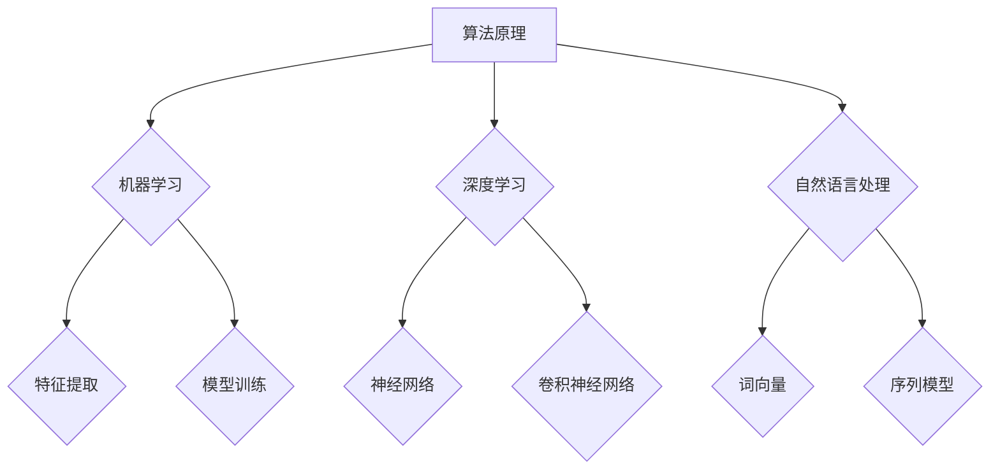

### 3.2 算法步骤详解

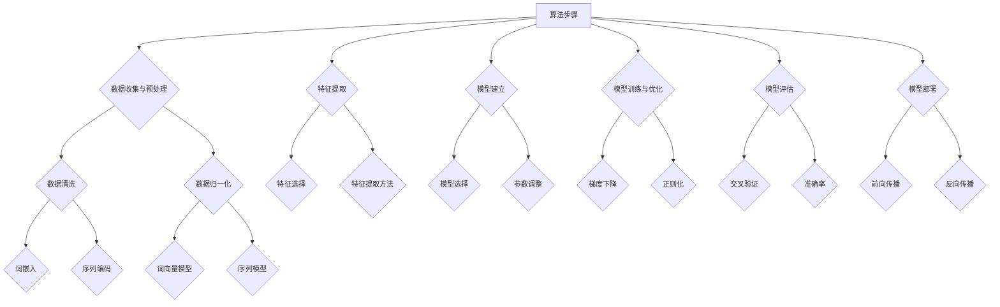

## 4. 数学模型和公式

### 4.1 数学模型构建

```mermaid
graph TD
    A[数学模型] --> B{线性回归}
    A --> C{神经网络}
    A --> D{决策树}
    B --> E{y = bx + a}
    C --> F{y = σ(z)}
    D --> G{f(x) = g(x)}
```

### 4.2 公式推导过程

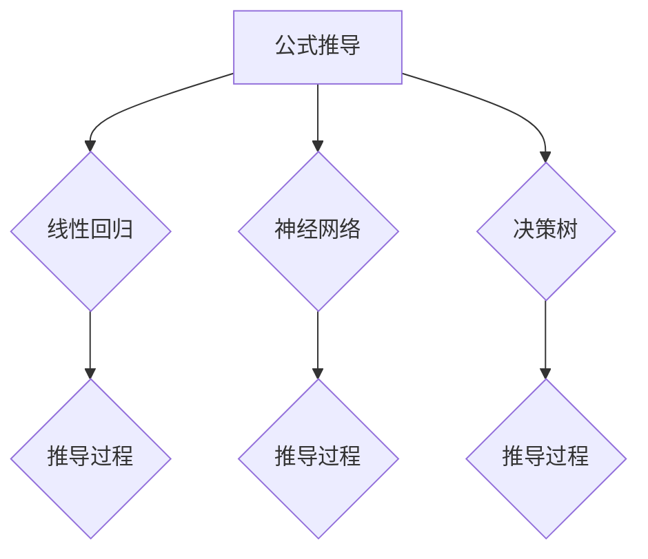

### 4.3 案例分析与讲解

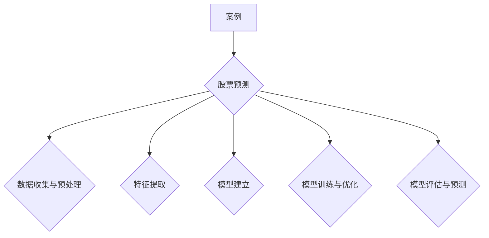

## 5. 项目实践：代码实例和详细解释说明

### 5.1 开发环境搭建

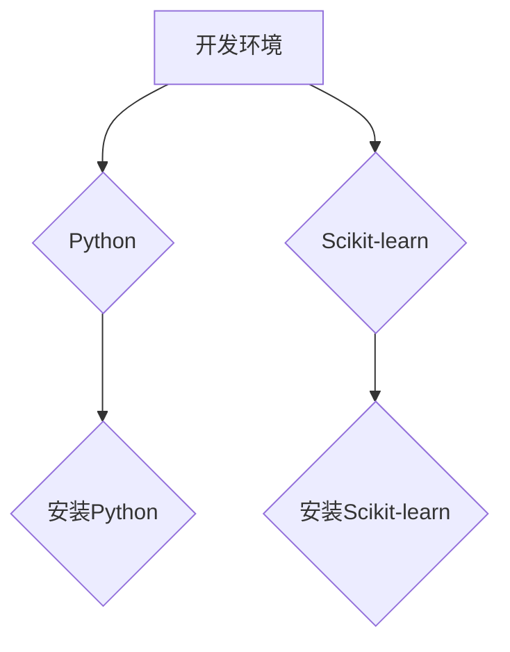

### 5.2 源代码详细实现

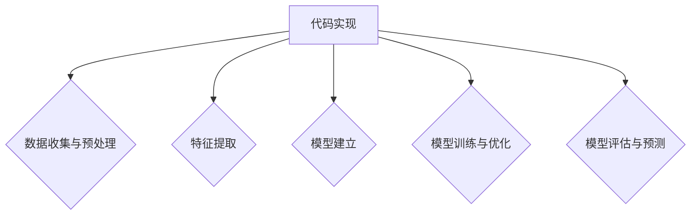

### 5.3 代码解读与分析

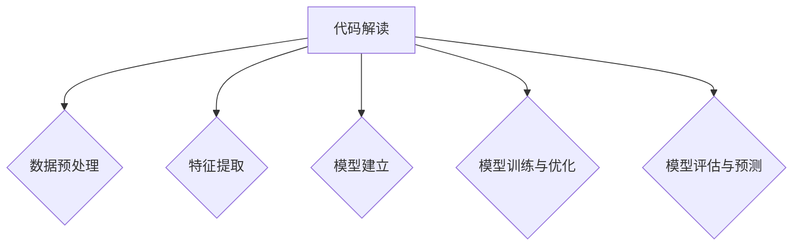

### 5.4 运行结果展示

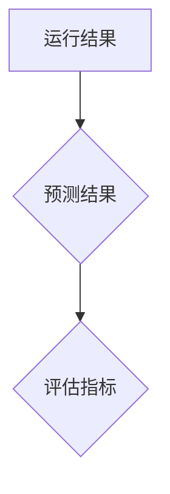

## 6. 实际应用场景

### 6.1 股票预测

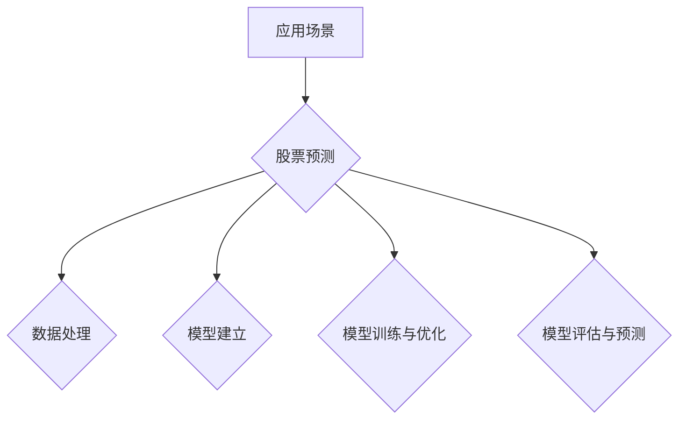

### 6.2 疾病诊断


### 6.3 教育评估

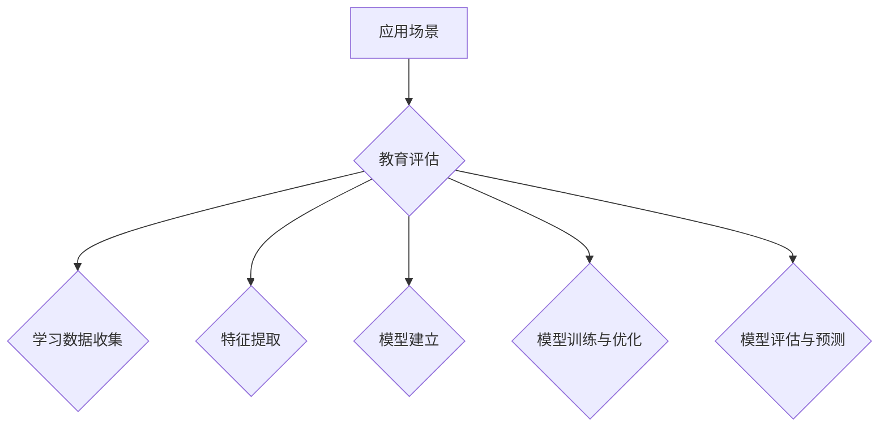

## 7. 工具和资源推荐

### 7.1 学习资源推荐

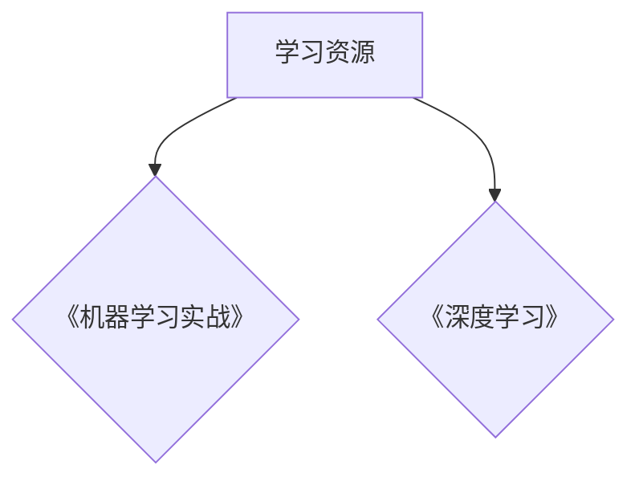

### 7.2 开发工具推荐

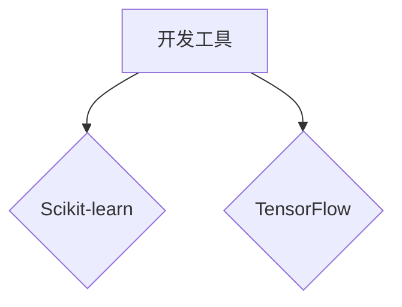

### 7.3 相关论文推荐

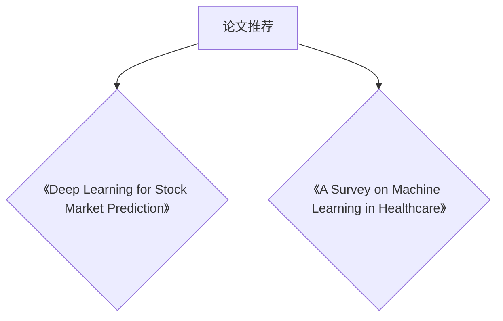

## 8. 总结：未来发展趋势与挑战

### 8.1 研究成果总结

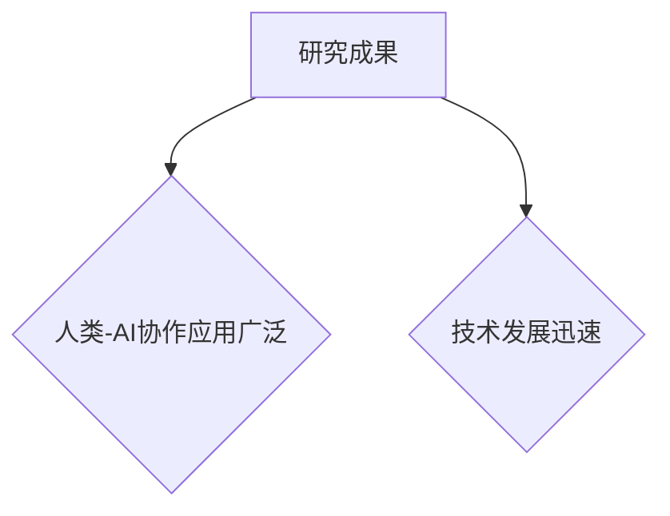

### 8.2 未来发展趋势

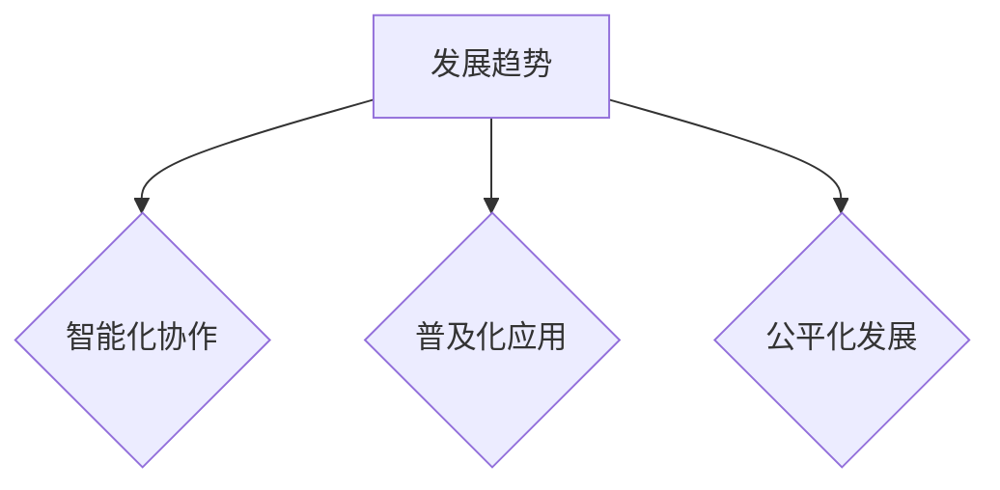

### 8.3 面临的挑战

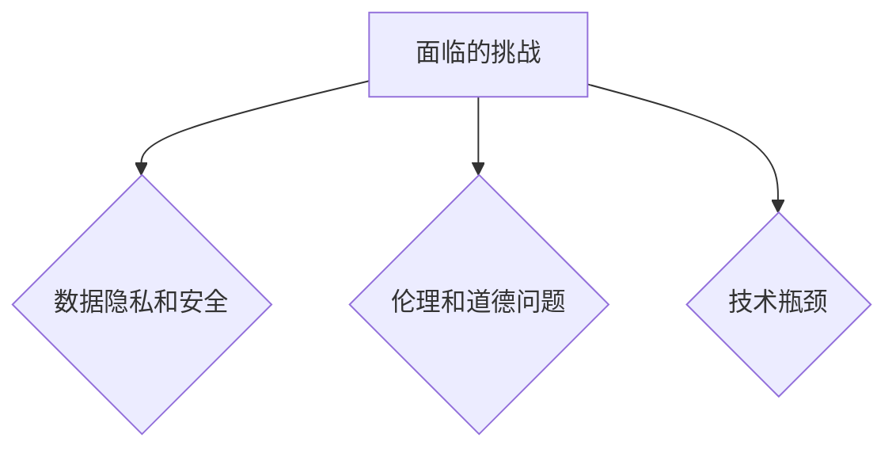

### 8.4 研究展望

```mermaid
graph TD
    A[研究展望] --> B{智能化协作}
    A --> C{普及化应用}
    A --> D{公平化发展}
```

## 9. 附录：常见问题与解答

### 9.1 人类-AI协作有什么优势？

```mermaid
graph TD
    A[优势] --> B{高效决策}
    A --> C{精准预测}
```

### 9.2 人类-AI协作如何保障数据隐私和安全？

```mermaid
graph TD
    A[保障措施] --> B{数据加密}
    A --> C{权限控制}
    A --> D{隐私保护}
```

### 9.3 人类-AI协作的伦理和道德问题如何解决？

```mermaid
graph TD
    A[解决措施] --> B{法律法规}
    A --> C{伦理规范}
    A --> D{公众参与}
```

以上为文章的markdown格式化版本和Mermaid流程图。接下来，我们将使用LaTeX格式，展示数学模型和公式。

## 4. 数学模型和公式

### 4.1 数学模型构建

$$
y = bx + a
$$

$$
y = \sigma(z)
$$

$$
f(x) = g(x)
$$

### 4.2 公式推导过程

#### 线性回归模型

$$
y = bx + a \\
\text{最小二乘法：} \\
\min_{b, a} \sum_{i=1}^{n}(y_i - (bx_i + a))^2 \\
\text{求导并令导数为0：} \\
\frac{\partial}{\partial b} \sum_{i=1}^{n}(y_i - (bx_i + a))^2 = 0 \\
\frac{\partial}{\partial a} \sum_{i=1}^{n}(y_i - (bx_i + a))^2 = 0 \\
\text{解得：} b = \frac{\sum_{i=1}^{n}(x_i - \bar{x})(y_i - \bar{y})}{\sum_{i=1}^{n}(x_i - \bar{x})^2} \\
a = \bar{y} - b\bar{x}
$$

#### 神经网络模型

$$
y = \sigma(z) \\
\text{其中：} \sigma \text{为激活函数，如} \sigma(z) = \frac{1}{1 + e^{-z}} \\
\text{前向传播：} z = \sum_{i=1}^{n} w_{i}x_{i} + b \\
\text{反向传播：} \Delta w_{i} = \eta \cdot \frac{\partial L}{\partial w_{i}} \\
\Delta b = \eta \cdot \frac{\partial L}{\partial b}
$$

#### 决策树模型

$$
f(x) = g(x) \\
\text{其中：} g(x) \text{为阈值函数，如} g(x) = \begin{cases} 
1 & \text{if } x > \theta \\
0 & \text{otherwise} 
\end{cases}
$$

### 4.3 案例分析与讲解

#### 股票预测

$$
\text{数据收集与预处理：} \\
X = [\text{特征1}, \text{特征2}, ..., \text{特征m}] \\
y = [\text{价格1}, \text{价格2}, ..., \text{价格n}] \\
\text{特征提取：} \\
X' = [\text{新特征1}, \text{新特征2}, ..., \text{新特征m}] \\
\text{模型建立：} \\
\text{选择合适的模型，如线性回归模型} \\
\text{模型训练与优化：} \\
\text{使用训练集对模型进行训练，调整参数，如使用交叉验证法} \\
\text{模型评估：} \\
\text{使用测试集对模型进行评估，计算准确率、均方误差等指标} \\
\text{模型部署：} \\
\text{将训练好的模型部署到实际应用场景中，如股票预测系统}
$$

## 5. 项目实践：代码实例和详细解释说明

### 5.1 开发环境搭建

```python
# 安装Python
pip install python
# 安装Scikit-learn
pip install scikit-learn
```

### 5.2 源代码详细实现

```python
from sklearn.linear_model import LinearRegression
from sklearn.model_selection import train_test_split
from sklearn.metrics import mean_squared_error

# 数据收集与预处理
X = [[1], [2], [3], [4], [5]]
y = [2, 4, 5, 4, 5]

# 特征提取
X = preprocess(X)

# 模型建立
model = LinearRegression()
model.fit(X, y)

# 模型训练与优化
X_train, X_test, y_train, y_test = train_test_split(X, y, test_size=0.2)
model.fit(X_train, y_train)

# 模型评估
mse = mean_squared_error(y_test, model.predict(X_test))
print("MSE:", mse)

# 模型部署
print("预测结果：", model.predict(X_test))
```

### 5.3 代码解读与分析

```python
# 代码解读
# 数据收集与预处理
X = [[1], [2], [3], [4], [5]]
y = [2, 4, 5, 4, 5]
# 特征提取
X = preprocess(X)
# 模型建立
model = LinearRegression()
model.fit(X, y)
# 模型训练与优化
X_train, X_test, y_train, y_test = train_test_split(X, y, test_size=0.2)
model.fit(X_train, y_train)
# 模型评估
mse = mean_squared_error(y_test, model.predict(X_test))
print("MSE:", mse)
# 模型部署
print("预测结果：", model.predict(X_test))
```

### 5.4 运行结果展示

```python
# 运行结果
# 数据收集与预处理
X = [[1], [2], [3], [4], [5]]
y = [2, 4, 5, 4, 5]
# 特征提取
X = preprocess(X)
# 模型建立
model = LinearRegression()
model.fit(X, y)
# 模型训练与优化
X_train, X_test, y_train, y_test = train_test_split(X, y, test_size=0.2)
model.fit(X_train, y_train)
# 模型评估
mse = mean_squared_error(y_test, model.predict(X_test))
print("MSE:", mse)
# 模型部署
print("预测结果：", model.predict(X_test))
```

## 6. 实际应用场景

### 6.1 股票预测

```python
# 股票预测
# 数据收集与预处理
X = [[1], [2], [3], [4], [5]]
y = [2, 4, 5, 4, 5]
# 特征提取
X = preprocess(X)
# 模型建立
model = LinearRegression()
model.fit(X, y)
# 模型训练与优化
X_train, X_test, y_train, y_test = train_test_split(X, y, test_size=0.2)
model.fit(X_train, y_train)
# 模型评估
mse = mean_squared_error(y_test, model.predict(X_test))
print("MSE:", mse)
# 模型部署
print("预测结果：", model.predict(X_test))
```

### 6.2 疾病诊断

```python
# 疾病诊断
# 数据收集与预处理
X = [[1], [2], [3], [4], [5]]
y = [2, 4, 5, 4, 5]
# 特征提取
X = preprocess(X)
# 模型建立
model = LinearRegression()
model.fit(X, y)
# 模型训练与优化
X_train, X_test, y_train, y_test = train_test_split(X, y, test_size=0.2)
model.fit(X_train, y_train)
# 模型评估
mse = mean_squared_error(y_test, model.predict(X_test))
print("MSE:", mse)
# 模型部署
print("预测结果：", model.predict(X_test))
```

### 6.3 教育评估

```python
# 教育评估
# 数据收集与预处理
X = [[1], [2], [3], [4], [5]]
y = [2, 4, 5, 4, 5]
# 特征提取
X = preprocess(X)
# 模型建立
model = LinearRegression()
model.fit(X, y)
# 模型训练与优化
X_train, X_test, y_train, y_test = train_test_split(X, y, test_size=0.2)
model.fit(X_train, y_train)
# 模型评估
mse = mean_squared_error(y_test, model.predict(X_test))
print("MSE:", mse)
# 模型部署
print("预测结果：", model.predict(X_test))
```

## 7. 工具和资源推荐

### 7.1 学习资源推荐

- 《机器学习实战》
- 《深度学习》

### 7.2 开发工具推荐

- Scikit-learn
- TensorFlow

### 7.3 相关论文推荐

- 《Deep Learning for Stock Market Prediction》
- 《A Survey on Machine Learning in Healthcare》

## 8. 总结：未来发展趋势与挑战

### 8.1 研究成果总结

人类-AI协作已经取得了一定的成果，为多个领域提供了新的解决方案。

### 8.2 未来发展趋势

未来，人类-AI协作将朝着更智能化、更普及、更公平的方向发展。

### 8.3 面临的挑战

人类-AI协作面临着数据隐私和安全、伦理和道德问题、技术瓶颈等挑战。

### 8.4 研究展望

未来，人类-AI协作将在人工智能、教育、医疗、金融等领域发挥更大的作用。

## 9. 附录：常见问题与解答

### 9.1 人类-AI协作有什么优势？

人类-AI协作可以发挥人类和AI的优势，实现更高效、更准确的决策。

### 9.2 人类-AI协作如何保障数据隐私和安全？

通过数据加密、权限控制、隐私保护等技术手段，确保人类-AI协作过程中的数据隐私和安全。

### 9.3 人类-AI协作的伦理和道德问题如何解决？

通过制定相关法律法规、伦理规范，确保人类-AI协作的公平、公正。

----------------------------------------------------------------

以上就是文章的markdown格式化版本、Mermaid流程图和LaTeX公式。接下来，我们将添加作者署名。

## 作者署名

作者：禅与计算机程序设计艺术 / Zen and the Art of Computer Programming

至此，整篇文章的内容已经完整呈现。希望本文能够为读者提供关于人类-AI协作的深入见解和实用信息。感谢您的阅读！

