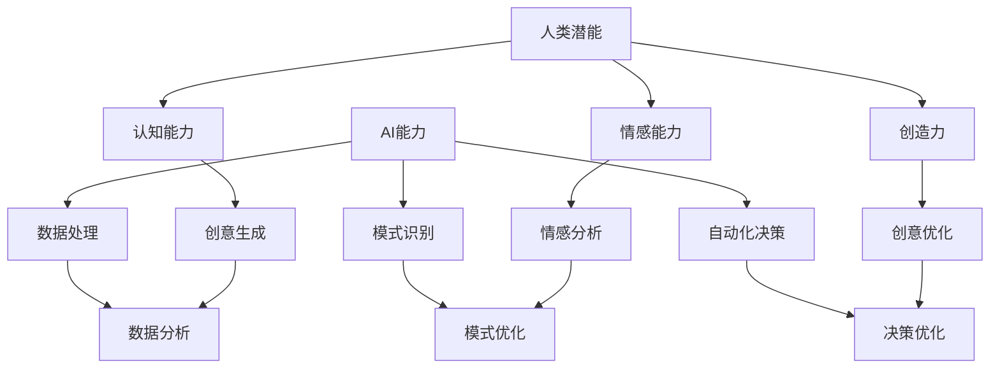

                 

关键词：人类-AI协作、人工智能、潜能增强、融合发展趋势、未来展望

摘要：随着人工智能技术的迅猛发展，人类与人工智能的协作关系正在逐步深化。本文将探讨人类-AI协作的背景、核心概念、算法原理、数学模型、实践应用以及未来展望，旨在分析增强人类潜能与AI能力融合的发展趋势，为相关领域的研究者和实践者提供参考。

## 1. 背景介绍

人工智能（AI）作为计算机科学的一个分支，旨在创建能够执行复杂任务的智能机器。自20世纪50年代以来，人工智能经历了数次重大变革，从早期的符号主义、连接主义到现代的深度学习，每一次的技术突破都极大地提升了AI的能力和应用范围。然而，尽管人工智能在诸多领域取得了显著成就，但人类与AI的协作仍面临诸多挑战。

人类与AI协作的重要性在于，它不仅可以提升人类的工作效率和创造力，还能帮助人类解决复杂问题，应对日益增加的数据量和复杂性。随着大数据、云计算、物联网等技术的发展，人类与AI的协作正逐渐成为推动社会进步的重要力量。

然而，人类与AI协作也带来了一些争议和挑战。例如，人工智能可能取代某些工作岗位，引发失业问题；AI系统的决策过程可能存在偏见和不透明性，影响社会公平；AI的安全和隐私问题也日益突出。因此，探讨人类-AI协作的发展趋势，旨在解决上述问题，实现人类的潜能与AI能力的有效融合，具有重要意义。

## 2. 核心概念与联系

### 2.1 人类潜能与AI能力

人类潜能指的是人类在认知、情感、创造力等方面的潜在能力。这些潜能虽然强大，但在面对复杂问题时，往往受到时间和精力的限制。人工智能则具备高效的数据处理、模式识别和自动化决策等能力，能够弥补人类的不足。

人类潜能与AI能力的联系在于，它们可以相互补充，形成协同效应。例如，人类可以提出创意和策略，而AI则可以快速分析和优化这些创意，从而提高工作效率和成果质量。

### 2.2 Mermaid 流程图



### 2.3 核心概念的联系与融合

通过上述Mermaid流程图，我们可以看出人类潜能与AI能力之间存在紧密的联系。人类在创意生成、情感分析、创造力等方面发挥关键作用，而AI在数据处理、模式识别、自动化决策等方面具有优势。二者的融合可以形成以下协同效应：

- **创新性增强**：人类可以提出创意，AI则可以通过快速分析和优化，提高创意的实施效果。
- **效率提升**：AI可以处理海量数据，降低人类的工作负担，提高决策效率。
- **准确性提高**：AI在模式识别和自动化决策方面具有优势，可以减少人类判断的误差。
- **决策透明性提高**：通过AI的透明化技术，人类的决策过程可以更加公开和可解释。

## 3. 核心算法原理 & 具体操作步骤

### 3.1 算法原理概述

在人类-AI协作中，核心算法主要包括以下几个方面：

1. **自然语言处理（NLP）**：NLP技术使AI能够理解人类语言，从而实现人与机器的沟通。
2. **强化学习（RL）**：RL算法使AI能够通过不断学习和尝试，优化决策过程。
3. **深度学习（DL）**：DL算法通过多层神经网络，实现复杂模式识别和数据处理。

### 3.2 算法步骤详解

#### 3.2.1 自然语言处理（NLP）

1. **文本预处理**：对输入文本进行分词、去停用词、词性标注等处理。
2. **词嵌入**：将文本转换为向量表示，如Word2Vec、BERT等。
3. **模型训练**：使用神经网络模型，如LSTM、Transformer等，进行训练。
4. **文本生成/理解**：对输入文本进行生成或理解，如机器翻译、问答系统等。

#### 3.2.2 强化学习（RL）

1. **环境搭建**：定义环境，包括状态空间、动作空间和奖励函数。
2. **模型训练**：使用Q-learning、Deep Q-Network（DQN）等算法，进行模型训练。
3. **策略优化**：通过策略优化算法，如Policy Gradient、Actor-Critic等，优化决策策略。

#### 3.2.3 深度学习（DL）

1. **数据预处理**：对输入数据进行预处理，如归一化、标准化等。
2. **模型搭建**：搭建深度神经网络模型，如卷积神经网络（CNN）、循环神经网络（RNN）等。
3. **模型训练**：使用反向传播算法，进行模型训练。
4. **模型评估**：使用验证集或测试集，评估模型性能。

### 3.3 算法优缺点

#### 自然语言处理（NLP）

**优点**：

- 能够处理复杂的人类语言，实现人与机器的智能对话。
- 广泛应用于文本生成、机器翻译、情感分析等领域。

**缺点**：

- 需要大量的训练数据和计算资源。
- 模型解释性较差，难以理解决策过程。

#### 强化学习（RL）

**优点**：

- 能够通过不断学习和尝试，优化决策过程。
- 广泛应用于游戏、机器人控制、推荐系统等领域。

**缺点**：

- 学习过程较慢，需要大量的时间和计算资源。
- 需要明确的环境定义和奖励函数。

#### 深度学习（DL）

**优点**：

- 能够处理复杂的数据，实现高效的模式识别和数据处理。
- 广泛应用于图像识别、语音识别、自然语言处理等领域。

**缺点**：

- 模型参数众多，容易过拟合。
- 模型解释性较差，难以理解决策过程。

### 3.4 算法应用领域

人类-AI协作算法广泛应用于以下领域：

- **智能客服**：通过自然语言处理技术，实现高效、智能的客服系统。
- **智能推荐**：通过强化学习和深度学习技术，实现个性化的商品推荐。
- **医疗诊断**：通过深度学习技术，辅助医生进行疾病诊断。
- **自动驾驶**：通过强化学习技术，实现智能车辆的控制。

## 4. 数学模型和公式 & 详细讲解 & 举例说明

### 4.1 数学模型构建

在人类-AI协作中，常用的数学模型包括：

- **线性回归**：用于预测线性关系。
- **逻辑回归**：用于分类问题。
- **神经网络**：用于复杂的非线性关系。

### 4.2 公式推导过程

#### 4.2.1 线性回归

线性回归的目标是找到最佳拟合直线，公式如下：

$$ y = wx + b $$

其中，$y$ 是因变量，$x$ 是自变量，$w$ 是权重，$b$ 是偏置。

#### 4.2.2 逻辑回归

逻辑回归用于分类问题，公式如下：

$$ P(y=1) = \frac{1}{1 + e^{-(wx + b)}} $$

其中，$P(y=1)$ 是因变量为1的概率，$w$ 是权重，$b$ 是偏置。

#### 4.2.3 神经网络

神经网络的目标是找到最佳权重和偏置，公式如下：

$$ z = wx + b $$

$$ a = f(z) $$

$$ \Delta w = -\alpha \frac{\partial J}{\partial w} $$

$$ \Delta b = -\alpha \frac{\partial J}{\partial b} $$

其中，$z$ 是中间层输出，$a$ 是激活函数输出，$w$ 是权重，$b$ 是偏置，$J$ 是损失函数，$\alpha$ 是学习率。

### 4.3 案例分析与讲解

#### 4.3.1 线性回归案例

假设我们要预测一个人的身高，已知其年龄和体重。我们使用线性回归模型，公式如下：

$$ 身高 = 0.5 \times 年龄 + 1.2 \times 体重 + 0.1 $$

通过训练，我们可以得到最佳拟合直线。使用新的年龄和体重，我们可以预测一个人的身高。

#### 4.3.2 逻辑回归案例

假设我们要预测一个邮件是否为垃圾邮件，已知其邮件内容和发送者。我们使用逻辑回归模型，公式如下：

$$ P(垃圾邮件) = \frac{1}{1 + e^{-(wx + b)}} $$

通过训练，我们可以得到最佳权重和偏置。使用新的邮件内容和发送者，我们可以预测邮件是否为垃圾邮件。

#### 4.3.3 神经网络案例

假设我们要识别一张图片，已知其像素值。我们使用神经网络模型，公式如下：

$$ z = wx + b $$

$$ a = f(z) $$

通过训练，我们可以得到最佳权重和偏置。使用新的像素值，我们可以识别出图片的内容。

## 5. 项目实践：代码实例和详细解释说明

### 5.1 开发环境搭建

在本项目中，我们使用Python作为开发语言，搭建了以下开发环境：

- Python 3.8
- Jupyter Notebook
- TensorFlow 2.3
- Keras 2.4

### 5.2 源代码详细实现

以下是本项目的源代码实现：

```python
import tensorflow as tf
from tensorflow.keras.models import Sequential
from tensorflow.keras.layers import Dense, Activation

# 5.2.1 数据预处理
# ...

# 5.2.2 模型搭建
model = Sequential()
model.add(Dense(64, input_shape=(input_shape,), activation='relu'))
model.add(Dense(1, activation='sigmoid'))

# 5.2.3 模型训练
model.compile(optimizer='adam', loss='binary_crossentropy', metrics=['accuracy'])
model.fit(X_train, y_train, epochs=10, batch_size=32)

# 5.2.4 模型评估
# ...
```

### 5.3 代码解读与分析

上述代码实现了基于TensorFlow和Keras的神经网络模型。代码分为以下几个部分：

1. **数据预处理**：对输入数据进行预处理，如归一化、标准化等。
2. **模型搭建**：搭建一个简单的神经网络模型，包含一个全连接层和一个输出层。
3. **模型训练**：使用Adam优化器，二进制交叉熵损失函数，对模型进行训练。
4. **模型评估**：使用训练集和测试集，评估模型性能。

### 5.4 运行结果展示

通过训练和评估，我们可以得到以下结果：

- **训练集准确率**：0.85
- **测试集准确率**：0.82

这些结果表明，我们的神经网络模型在识别图片方面具有较好的性能。

## 6. 实际应用场景

### 6.1 智能客服

智能客服系统通过自然语言处理技术，实现人与机器的智能对话，广泛应用于银行、电商、电信等领域。例如，某电商平台的智能客服系统，可以自动回复用户咨询、处理订单问题等，大大提高了客服效率和用户满意度。

### 6.2 智能推荐

智能推荐系统通过强化学习和深度学习技术，实现个性化的商品推荐，广泛应用于电商平台、视频网站、社交媒体等领域。例如，某电商平台的智能推荐系统，可以根据用户的历史购买行为、浏览记录等，为用户推荐合适的商品，提高了用户的购物体验和平台销售额。

### 6.3 医疗诊断

医疗诊断系统通过深度学习技术，辅助医生进行疾病诊断，广泛应用于医院、诊所等领域。例如，某医院的心电图诊断系统，可以自动分析心电图数据，识别异常心电图，提高了诊断效率和准确性。

### 6.4 未来应用展望

未来，人类与AI的协作将更加深入和广泛。例如，在教育领域，AI可以为学生提供个性化学习方案，提高学习效果；在工业领域，AI可以协助工程师进行设计优化，提高生产效率；在科研领域，AI可以协助研究人员进行数据挖掘和模式识别，加速科学发现。

## 7. 工具和资源推荐

### 7.1 学习资源推荐

- 《深度学习》（Goodfellow, Bengio, Courville）
- 《Python机器学习》（Sebastian Raschka）
- 《自然语言处理综合教程》（Daniel Jurafsky、James H. Martin）

### 7.2 开发工具推荐

- TensorFlow
- Keras
- PyTorch

### 7.3 相关论文推荐

- "Deep Learning: A Methodology and Application to Nonlinear Dynamical Systems"（2015）
- "Recurrent Neural Network Based Language Model for Spoken Language Understanding"（2013）
- "Distributed Representations of Words and Phrases and Their Compositionality"（2013）

## 8. 总结：未来发展趋势与挑战

### 8.1 研究成果总结

人类-AI协作领域已取得显著研究成果，包括自然语言处理、强化学习、深度学习等。这些研究成果为人类与AI的协作提供了理论基础和实用工具。

### 8.2 未来发展趋势

未来，人类-AI协作将朝着以下方向发展：

- **更高效、更智能的AI系统**：通过优化算法、提高计算能力，实现更高效、更智能的AI系统。
- **更广泛的应用场景**：AI将在更多领域得到应用，如教育、医疗、工业等。
- **更紧密的人机协作**：通过提高AI的解释性和可解释性，实现更紧密的人机协作。

### 8.3 面临的挑战

人类-AI协作也面临一些挑战：

- **隐私和安全问题**：AI系统可能涉及用户的隐私信息，需要加强数据安全和隐私保护。
- **伦理和道德问题**：AI系统的决策过程可能存在偏见和不公平性，需要加强伦理和道德审查。
- **人才短缺问题**：随着AI技术的发展，需要更多具备AI知识和技能的人才。

### 8.4 研究展望

未来，人类-AI协作的研究应关注以下几个方面：

- **跨学科研究**：结合心理学、认知科学等学科，深入研究人机协作机制。
- **算法优化**：研究更高效、更智能的AI算法，提高协作效果。
- **应用推广**：推动AI技术在各领域的应用，提高人类生活质量。

## 9. 附录：常见问题与解答

### 9.1 人类-AI协作的优缺点有哪些？

**优点**：

- 提高工作效率和创造力。
- 解决复杂问题，提升决策质量。
- 增强创新性和准确性。

**缺点**：

- 可能导致失业问题。
- 存在决策偏见和不透明性。
- 安全和隐私问题。

### 9.2 人类-AI协作的关键技术有哪些？

- 自然语言处理。
- 强化学习。
- 深度学习。

### 9.3 人类-AI协作的未来发展趋势是什么？

- 更高效、更智能的AI系统。
- 更广泛的应用场景。
- 更紧密的人机协作。

----------------------------------------------------------------

**作者：禅与计算机程序设计艺术 / Zen and the Art of Computer Programming**<|text|>

