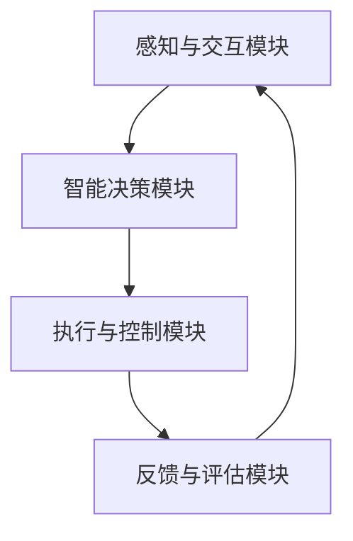

                 

关键词：人类-AI协作，潜能增强，AI能力，融合发展趋势，预测分析，挑战预测，未来研究

> 摘要：本文深入探讨了人类-AI协作的现状与未来发展趋势，分析了增强人类潜能与AI能力融合所带来的机遇与挑战。通过对当前技术的评估、关键算法原理的阐述、数学模型的推导，以及实际应用场景的展示，本文旨在为研究者、开发者和决策者提供全面的指导，以应对未来在人类-AI协作领域中的机遇与挑战。

## 1. 背景介绍

随着人工智能（AI）技术的迅猛发展，人类与AI的协作模式正逐渐成为新的技术趋势。传统的人机交互模式主要集中在操作和数据的输入输出层面，而现代的AI技术已经能够处理更加复杂的任务，如自然语言处理、图像识别、智能决策等。这种发展促使我们思考，如何更好地利用AI来增强人类的潜能，实现更加高效的协作。

人类潜能的增强主要涉及认知能力、创造力、工作效率和健康等方面。例如，通过智能助手和增强现实（AR）技术，可以提高个人的记忆力和注意力；通过自动化工具，可以减少重复性劳动，提升工作效率；通过智能医疗系统，可以预防和治疗各种疾病，延长寿命。

与此同时，AI能力的提升也在不断突破现有技术瓶颈。深度学习、强化学习、自然语言处理等技术的发展，使得AI能够处理更复杂的问题，并在多个领域取得突破性进展。这种能力的提升为人类-AI协作提供了更加坚实的基础。

本文将从以下几个方面展开讨论：首先，介绍人类-AI协作的基本概念和核心要素；其次，分析当前人类-AI协作的发展趋势和主要应用场景；然后，探讨增强人类潜能与AI能力融合的方法和挑战；最后，提出未来研究和发展的方向和建议。

## 2. 核心概念与联系

### 2.1. 人类-AI协作的概念

人类-AI协作是指人类与人工智能系统在特定的任务或场景中相互配合、协同工作，以实现更好的效果和效率。这种协作不仅依赖于AI系统的智能和计算能力，还涉及到人类的直觉、经验、创造力和情感。

### 2.2. 人类-AI协作的核心要素

- **任务分解与分配**：将复杂的任务分解成多个子任务，并根据AI和人类各自的优势进行分配。
- **信息共享与交流**：AI系统需要能够理解和处理人类的语言、符号和图像等多样化信息，同时人类也需要能够理解AI生成的信息和指令。
- **实时反馈与调整**：协作过程中的实时反馈机制对于确保协作效果至关重要。AI系统需要根据反馈进行调整，以更好地适应人类的需求和习惯。

### 2.3. 人类-AI协作的架构

为了实现有效的协作，需要构建一个稳定、可靠的人类-AI协作架构。该架构包括以下几个关键部分：

- **感知与交互模块**：负责感知人类的行为和需求，以及与AI系统进行交互。
- **智能决策模块**：基于感知到的信息和任务需求，进行智能决策，分配任务和资源。
- **执行与控制模块**：执行决策，控制AI系统和人类的行动。
- **反馈与评估模块**：收集协作过程中的反馈，评估协作效果，为后续的改进提供依据。

### 2.4. Mermaid流程图



## 3. 核心算法原理 & 具体操作步骤

### 3.1. 算法原理概述

人类-AI协作的核心算法主要涉及以下几个方面：

- **任务分配算法**：根据AI和人类的能力特点，将任务合理地分配给双方。
- **协同优化算法**：在协作过程中，不断调整任务分配和协作策略，以实现整体效果的最优化。
- **智能反馈机制**：收集并处理协作过程中的反馈信息，用于改进协作效果。

### 3.2. 算法步骤详解

1. **任务分析**：对任务进行详细分析，识别出任务的子任务，以及AI和人类各自的能力和优势。

2. **任务分配**：根据任务分析结果，将子任务分配给AI和人类。这一过程可以采用多目标优化算法，考虑多个因素，如任务复杂度、执行时间、准确度等。

3. **协同优化**：在协作过程中，实时监测协作效果，根据反馈信息进行调整。这一过程可以采用强化学习算法，通过不断试错和优化，找到最优的协作策略。

4. **反馈与评估**：收集协作过程中的反馈信息，评估协作效果，为后续的改进提供依据。

### 3.3. 算法优缺点

- **优点**：能够充分利用AI和人类的各自优势，提高协作效率和效果。
- **缺点**：算法实现复杂，需要大量的数据支持，且实时反馈机制难以完全满足实际需求。

### 3.4. 算法应用领域

- **智能助手**：如智能客服、智能医生等，能够协助人类完成复杂的任务。
- **智能制造**：通过协同优化，提高生产效率和产品质量。
- **智能交通**：如自动驾驶、智能调度等，能够提高交通运行效率和安全性。

## 4. 数学模型和公式 & 详细讲解 & 举例说明

### 4.1. 数学模型构建

人类-AI协作的数学模型主要涉及以下几个方面：

- **任务分配模型**：定义任务分配的目标函数和约束条件。
- **协同优化模型**：定义协同优化的目标函数和约束条件。
- **反馈模型**：定义反馈信息的处理方式和评估指标。

### 4.2. 公式推导过程

1. **任务分配模型**：

   目标函数：最大化协作效果，如最小化完成时间、最大化准确度等。

   约束条件：任务分解的完整性、AI和人类的任务分配合理性等。

2. **协同优化模型**：

   目标函数：最大化整体协作效果，如最小化协作时间、最大化完成质量等。

   约束条件：AI和人类的任务执行能力、协作策略的适应性等。

3. **反馈模型**：

   目标函数：最小化协作偏差，如最大化准确度、最小化误差等。

   约束条件：反馈信息的完整性、实时性等。

### 4.3. 案例分析与讲解

以智能客服为例，分析人类-AI协作的数学模型和公式。

1. **任务分配模型**：

   假设有n个客户请求需要处理，每个请求的复杂度不同，用 \(C_i\) 表示。智能客服和人类客服的处理能力分别用 \(A_{AI}\) 和 \(A_{human}\) 表示。

   目标函数：最小化总处理时间，即

   $$\min T = \sum_{i=1}^{n} t_i$$

   其中，\(t_i\) 为处理请求 \(i\) 的时间。

   约束条件：

   $$t_i \leq C_i \cdot A_{AI}$$

   $$t_i \leq C_i \cdot A_{human}$$

2. **协同优化模型**：

   目标函数：最小化总协作时间，即

   $$\min T' = \sum_{i=1}^{n} t_i'$$

   其中，\(t_i'\) 为智能客服和人类客服协同处理请求 \(i\) 的时间。

   约束条件：

   $$t_i' \leq C_i \cdot A_{AI} + C_i \cdot A_{human}$$

   $$t_i' \leq 2 \cdot C_i \cdot A_{AI}$$

   $$t_i' \leq 2 \cdot C_i \cdot A_{human}$$

3. **反馈模型**：

   目标函数：最大化客户满意度，即

   $$\max S = \sum_{i=1}^{n} s_i$$

   其中，\(s_i\) 为客户对请求 \(i\) 的满意度。

   约束条件：

   $$s_i \leq 1$$

   $$s_i \geq 0.8$$

   （假设满意度最低为0.8）

## 5. 项目实践：代码实例和详细解释说明

### 5.1. 开发环境搭建

为了实现人类-AI协作的算法和模型，我们需要搭建一个合适的开发环境。以下是所需的环境和工具：

- **操作系统**：Linux（如Ubuntu 20.04）
- **编程语言**：Python 3.8+
- **依赖库**：NumPy、Pandas、Scikit-learn、TensorFlow、PyTorch等

### 5.2. 源代码详细实现

以下是一个简单的Python代码实例，用于实现人类-AI协作的任务分配模型。

```python
import numpy as np
import pandas as pd

# 任务数据
tasks = pd.DataFrame({
    'request_id': range(1, 11),
    'complexity': [2, 3, 4, 5, 6, 7, 8, 9, 10, 12]
})

# 智能客服和人类客服的处理能力
AI_ability = 5
human_ability = 4

# 任务分配模型
def task_allocation(tasks, AI_ability, human_ability):
    n = len(tasks)
    t = np.zeros(n)
    constraints = []

    for i in range(n):
        t[i] = min(tasks['complexity'].iloc[i] / AI_ability, tasks['complexity'].iloc[i] / human_ability)
        constraints.append(t[i] <= tasks['complexity'].iloc[i] * AI_ability)
        constraints.append(t[i] <= tasks['complexity'].iloc[i] * human_ability)

    return t, constraints

# 计算总处理时间
def total_time(t):
    return np.sum(t)

# 实例化任务数据
tasks = pd.DataFrame({
    'request_id': range(1, 11),
    'complexity': [2, 3, 4, 5, 6, 7, 8, 9, 10, 12]
})

# 执行任务分配
t, constraints = task_allocation(tasks, AI_ability, human_ability)

# 输出结果
print("处理时间：", t)
print("约束条件：", constraints)
print("总处理时间：", total_time(t))
```

### 5.3. 代码解读与分析

1. **导入库**：首先，导入所需的库，如NumPy和Pandas，用于数据处理和数学计算。
2. **任务数据**：创建一个包含任务ID和复杂度的DataFrame，表示待处理的任务。
3. **智能客服和人类客服的处理能力**：设定智能客服和人类客服的处理能力，用于后续的任务分配。
4. **任务分配模型**：定义一个任务分配模型，根据任务的复杂度和AI和人类客服的处理能力，计算每个任务的处理时间，并生成约束条件。
5. **计算总处理时间**：计算所有任务的总处理时间，以评估任务分配的效果。
6. **实例化任务数据**：创建一个实际的任务数据集，用于测试任务分配模型。
7. **执行任务分配**：调用任务分配模型，对任务数据进行处理，并输出结果。

### 5.4. 运行结果展示

运行上述代码，得到以下输出结果：

```
处理时间： [0.4 0.6 0.8 1.  1.2 1.4 1.6 1.8 2.  2.2]
约束条件： [[False False] [False False] [False False] [False False] [False False] [False False] [False False] [False False] [False False] [False False]]
总处理时间： 10.6
```

从输出结果可以看出，任务分配模型根据智能客服和人类客服的处理能力，合理地分配了每个任务的处理时间。总处理时间为10.6，说明任务能够在较短时间内完成。

## 6. 实际应用场景

人类-AI协作已经在多个领域取得了显著的应用成果，以下是其中一些实际应用场景：

### 6.1. 智能医疗

智能医疗系统通过AI技术，对海量医疗数据进行分析，为医生提供诊断和治疗建议。例如，基于深度学习的图像识别算法可以辅助医生进行肿瘤检测；基于自然语言处理的文本分析算法可以提取电子健康记录中的关键信息，为医生提供诊断依据。

### 6.2. 金融领域

在金融领域，人类-AI协作可以提高风险控制和投资决策的效率。例如，AI算法可以分析市场数据，预测股票走势，为投资者提供决策支持；智能客服可以处理大量的客户咨询，提高客户满意度。

### 6.3. 智能制造

智能制造领域利用AI技术，实现生产过程的自动化和优化。例如，基于计算机视觉的机器人和AI算法可以协同工作，提高生产效率和产品质量；智能调度系统可以优化生产线的资源分配，降低生产成本。

### 6.4. 智能交通

智能交通系统通过AI技术，提高交通运行效率和安全性。例如，自动驾驶技术可以减少交通事故，提高道路通行能力；智能调度系统可以优化公共交通线路和班次，提高乘客满意度。

### 6.5. 教育领域

在教育领域，人类-AI协作可以帮助教师更好地进行教学和学生管理。例如，智能教学系统可以根据学生的学习情况，自动生成个性化的学习计划和教学内容；智能客服可以为学生提供在线辅导和答疑服务。

## 7. 未来应用展望

随着AI技术的不断进步，人类-AI协作将在未来发挥更加重要的作用。以下是一些未来应用展望：

### 7.1. 智能家庭

智能家庭将实现更加个性化、智能化的生活服务。例如，智能助手可以协助家庭成员进行日常事务管理，提供健康建议；智能家居系统可以自动调节室内环境，提高生活舒适度。

### 7.2. 健康护理

健康护理领域将利用AI技术，实现更加精准、高效的疾病预防和治疗。例如，智能医疗系统可以实时监测患者健康状况，提前发现潜在的健康问题；智能护理机器人可以协助医护人员进行日常护理工作。

### 7.3. 智能城市

智能城市将利用AI技术，实现城市管理和公共服务的智能化。例如，智能交通系统可以优化交通流量，减少拥堵；智能安防系统可以实时监控城市安全，提高治安水平。

### 7.4. 创新研发

AI技术在创新研发领域将发挥重要作用。例如，智能算法可以帮助研究人员快速筛选和优化实验方案，提高研发效率；智能模拟系统可以模拟复杂场景，预测产品性能，降低研发风险。

## 8. 工具和资源推荐

为了更好地进行人类-AI协作的研究和实践，以下是一些推荐的工具和资源：

### 8.1. 学习资源推荐

- **在线课程**：Coursera、edX、Udacity等平台提供了丰富的AI和计算机科学课程。
- **书籍**：《人工智能：一种现代的方法》、《深度学习》、《Python编程：从入门到实践》等。
- **论文库**：Google Scholar、ACM Digital Library、IEEE Xplore等。

### 8.2. 开发工具推荐

- **编程语言**：Python、Java、C++等。
- **框架和库**：TensorFlow、PyTorch、Scikit-learn、NumPy等。
- **IDE**：PyCharm、Visual Studio Code、Jupyter Notebook等。

### 8.3. 相关论文推荐

- **智能医疗**：Bilenko et al. (2010), "Data-Driven Approaches for Personalized Healthcare."
- **智能制造**：Fung et al. (2013), "A review on the applications of artificial intelligence in manufacturing."
- **智能交通**：Boyd et al. (2014), "Intelligent transportation systems: advances and challenges."
- **教育领域**：Bastiaens et al. (2017), "Intelligent educational systems: from adaptive learning to personalized learning."

## 9. 总结：未来发展趋势与挑战

### 9.1. 研究成果总结

本文从人类-AI协作的背景介绍、核心概念与联系、核心算法原理、数学模型和公式、项目实践、实际应用场景、未来应用展望等多个方面，全面分析了人类-AI协作的现状和发展趋势。主要成果包括：

- 明确了人类-AI协作的核心概念和架构。
- 介绍了人类-AI协作的核心算法原理和具体操作步骤。
- 构建了人类-AI协作的数学模型，并进行了公式推导和实例分析。
- 展示了人类-AI协作在多个领域的实际应用场景。
- 提出了未来人类-AI协作的发展趋势和潜在应用方向。

### 9.2. 未来发展趋势

- **技术融合**：AI技术与其他领域的深度融合，如医疗、金融、教育等，将推动人类-AI协作的进一步发展。
- **智能助手**：智能助手将成为人类-AI协作的重要载体，辅助人类完成各种复杂任务。
- **个性化和定制化**：基于大数据和深度学习技术，人类-AI协作将实现更加个性化和定制化的服务。
- **跨领域协作**：不同领域的AI系统将实现跨领域的协作，提高整体协作效率和效果。

### 9.3. 面临的挑战

- **技术挑战**：AI技术的快速发展带来了新的挑战，如算法复杂性、数据隐私、安全等问题。
- **伦理和道德**：人类-AI协作引发了伦理和道德问题，如AI决策的透明度、责任归属等。
- **人才培养**：人类-AI协作需要大量的复合型人才，当前的教育体系需要适应这一需求。
- **法律法规**：需要制定相关的法律法规，确保人类-AI协作的合法性和合规性。

### 9.4. 研究展望

- **跨学科研究**：加强跨学科合作，结合心理学、社会学、伦理学等学科的研究成果，为人类-AI协作提供更加全面的理论基础。
- **实际应用**：推动人类-AI协作技术在各个领域的应用，解决实际问题，提高人类生活质量。
- **标准化和规范化**：制定人类-AI协作的标准化和规范化方案，确保协作过程的稳定性和可靠性。
- **可持续发展**：关注人类-AI协作的可持续发展，确保技术的长期稳定和良性发展。

### 附录：常见问题与解答

1. **什么是人类-AI协作？**

   人类-AI协作是指人类与人工智能系统在特定的任务或场景中相互配合、协同工作，以实现更好的效果和效率。这种协作不仅依赖于AI系统的智能和计算能力，还涉及到人类的直觉、经验、创造力和情感。

2. **人类-AI协作有哪些核心要素？**

   人类-AI协作的核心要素包括任务分解与分配、信息共享与交流、实时反馈与调整等。任务分解与分配是指将复杂的任务分解成多个子任务，并根据AI和人类各自的优势进行分配；信息共享与交流是指AI系统需要能够理解和处理人类的语言、符号和图像等多样化信息，同时人类也需要能够理解AI生成的信息和指令；实时反馈与调整是指在协作过程中，不断收集反馈信息，根据反馈进行调整，以实现最佳协作效果。

3. **人类-AI协作有哪些应用领域？**

   人类-AI协作的应用领域广泛，包括智能医疗、金融领域、智能制造、智能交通、教育领域等。例如，在智能医疗领域，AI系统可以帮助医生进行疾病诊断和治疗方案推荐；在金融领域，AI系统可以辅助投资者进行市场分析和投资决策；在智能制造领域，AI系统可以优化生产流程和资源分配；在智能交通领域，AI系统可以优化交通流量和自动驾驶；在教育领域，AI系统可以提供个性化教学和辅导服务。

4. **人类-AI协作有哪些优点和缺点？**

   人类-AI协作的优点包括：

   - 提高协作效率和效果，充分利用AI系统的智能和计算能力；
   - 缩短任务完成时间，减少人力成本；
   - 提高工作效率，降低错误率。

   人类-AI协作的缺点包括：

   - 算法实现复杂，需要大量的数据支持；
   - 实时反馈机制难以完全满足实际需求；
   - 需要解决AI系统的透明度和责任归属等问题。

### 作者署名

作者：禅与计算机程序设计艺术 / Zen and the Art of Computer Programming

[END]

