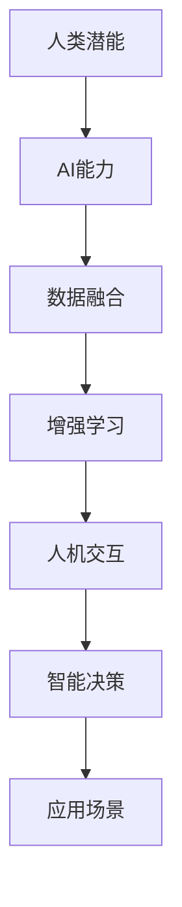
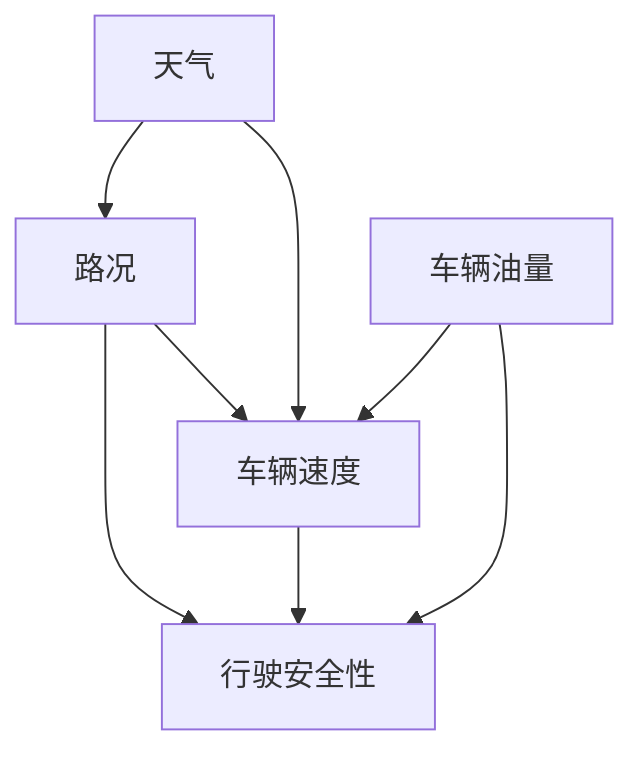

                 

### 关键词 Keywords ###
AI协作、人类潜能、AI能力融合、发展趋势、机遇、挑战

<|assistant|>### 摘要 Abstract ###
本文深入探讨人类与人工智能（AI）协作的未来发展趋势，分析了AI如何增强人类潜能，以及这种融合带来的机遇与挑战。通过阐述核心概念、算法原理、数学模型、实际应用场景、工具推荐和未来展望，本文为研究者和开发者提供了一个全面而深入的视角，以应对AI时代下的变革与创新。

## 1. 背景介绍

在过去的几十年里，人工智能（AI）技术取得了令人瞩目的进步。从最初的规则基础系统到复杂的深度学习模型，AI已经渗透到我们生活的方方面面。与此同时，人类的能力也在不断提升，尤其是在信息处理、逻辑推理和创造力等方面。然而，单靠人类或单靠AI都无法完全应对日益复杂的现实问题。人类-AI协作成为一种必然的趋势，旨在通过两者的有机结合，充分发挥各自的优势，实现更高效的决策和更创新的解决方案。

### 1.1 人工智能的发展历程

人工智能的概念最早可以追溯到20世纪50年代，当时科学家们开始探讨机器是否能够模拟人类的智能行为。随后，随着计算机技术的飞速发展，AI迎来了几次重要的浪潮。第一次浪潮始于20世纪50年代至70年代，主要目标是让计算机实现简单的逻辑推理和问题求解。第二次浪潮在20世纪80年代至90年代兴起，以专家系统和知识表示为核心，试图通过模拟人类专家的知识和经验来解决问题。第三次浪潮始于21世纪初，以深度学习和大数据为驱动，AI技术实现了质的飞跃，开始能够处理复杂的图像、语音和自然语言等任务。

### 1.2 人类潜能与能力的提升

人类潜能的发掘是一个持续的过程。从古代的哲学思考到现代的科学探索，人类不断尝试理解自己的大脑和潜能。教育、心理学、认知科学等领域的研究进展，使得我们能够更好地了解人类思维和行为模式，从而设计出更符合人类潜能发挥的工具和方法。例如，现代认知科学的成果帮助我们开发了更为智能的用户界面和交互设计，使得人类能够更高效地与计算机系统协同工作。

### 1.3 人类-AI协作的重要性

人类-AI协作的重要性在于它能够将人类的创造力和直觉与AI的计算能力和分析能力结合起来，形成一种新的工作模式。这种协作不仅可以提高工作效率，还可以激发人类的潜能，创造出更加创新和高效的解决方案。例如，在医疗领域，AI可以帮助医生进行疾病预测和诊断，但最终的决策仍然需要医生的经验和判断。在艺术创作领域，AI可以作为辅助工具，提供灵感和创意，但真正的艺术价值仍然来自于人类艺术家的心智和情感投入。

## 2. 核心概念与联系

在探讨人类-AI协作时，需要明确一些核心概念，并理解它们之间的联系。以下是几个关键概念：

### 2.1 人工智能与人类潜能的融合

人工智能与人类潜能的融合指的是将AI的能力与人类独特的认知和情感优势相结合。这种融合可以通过多种方式实现，例如：

- **增强现实（AR）与虚拟现实（VR）**：利用AR和VR技术，AI可以提供实时、个性化的信息支持，帮助人类更好地理解和应对复杂环境。
- **智能助手与增强学习**：智能助手可以协助人类处理日常任务，而增强学习系统则可以帮助人类在不断变化的情境中快速适应和改进。
- **人机交互界面**：设计直观、易用的交互界面，使得AI系统能够更好地理解人类的意图和需求，从而提供更精准的服务。

### 2.2 AI算法与人类决策

AI算法在数据处理和模式识别方面具有强大的能力，但最终的决策往往需要人类参与。人类决策的优势在于其情感、直觉和经验，这些因素对于某些复杂问题来说至关重要。通过将AI算法与人类决策结合起来，可以形成一个更加全面和可靠的决策系统。例如，在金融领域，AI可以用于市场预测和分析，但投资决策通常需要结合市场分析师的经验和判断。

### 2.3 数据科学与认知科学

数据科学和认知科学是推动人类-AI协作的重要学科。数据科学通过大数据分析和机器学习算法，为AI提供了丰富的数据资源和强大的计算能力。认知科学则通过研究人类大脑和认知过程，为设计更符合人类需求的AI系统提供了理论基础。两者结合，可以创造出更加智能和人性化的AI系统。

### 2.4 Mermaid 流程图

以下是一个Mermaid流程图，展示了人类-AI协作的关键环节：



在这个流程图中，A和B代表人类和AI各自的能力，C到G则展示了这些能力如何通过数据融合、增强学习、人机交互和智能决策等环节相互协作，最终实现人类-AI的深度融合。

## 3. 核心算法原理 & 具体操作步骤

在人类-AI协作中，核心算法的设计和实现至关重要。以下将详细介绍一种具有代表性的算法原理，并提供具体操作步骤。

### 3.1 算法原理概述

本文选取的算法是一种基于增强学习的协作决策算法。该算法通过模拟人类与AI在不同情境下的交互过程，逐步优化两者的协作策略，以达到最优决策效果。算法的基本原理包括以下几个步骤：

1. **情境识别**：通过传感器和数据采集技术，实时获取当前环境的信息，包括任务目标、资源状况和外部干扰等。
2. **行为预测**：基于历史数据和当前情境，预测人类和AI的行为模式，并分析可能的结果。
3. **策略优化**：通过迭代计算，不断调整人类和AI的协作策略，以最大化决策效果。
4. **反馈调整**：根据实际决策结果，对算法参数进行微调，以适应新的情境和任务要求。

### 3.2 算法步骤详解

#### 3.2.1 情境识别

情境识别是算法的第一步，其核心在于准确获取并处理环境信息。具体操作步骤如下：

1. **数据采集**：使用传感器和监控设备，实时采集环境数据，包括图像、声音、位置和温度等信息。
2. **数据处理**：对采集到的数据进行预处理，包括去噪、归一化和特征提取等，以获得有用的信息。
3. **情境建模**：利用机器学习算法，构建一个描述当前情境的数学模型，用于后续的分析和预测。

#### 3.2.2 行为预测

行为预测是基于情境识别的结果，对人类和AI的行为进行预测。具体步骤如下：

1. **模型训练**：使用历史数据，训练一个行为预测模型，该模型能够根据当前情境预测人类和AI的行为。
2. **行为模拟**：根据预测模型，模拟人类和AI在不同情境下的行为，并分析可能的结果。
3. **结果评估**：对模拟结果进行评估，选择最优的行为方案。

#### 3.2.3 策略优化

策略优化是算法的核心步骤，通过迭代计算，不断调整人类和AI的协作策略。具体步骤如下：

1. **初始策略**：根据当前情境和预测结果，为人类和AI设定一个初始协作策略。
2. **策略迭代**：通过模拟和评估，逐步优化协作策略，以最大化决策效果。
3. **反馈调整**：根据实际决策结果，对策略进行调整，以适应新的情境和任务要求。

#### 3.2.4 反馈调整

反馈调整是算法的最后一个步骤，通过对实际决策结果的反馈，不断优化算法参数。具体步骤如下：

1. **结果记录**：记录每次决策的结果，包括正确率和响应时间等指标。
2. **参数调整**：根据决策结果，对算法的参数进行微调，以提高后续决策的准确性。
3. **迭代优化**：通过迭代计算，不断优化算法参数，以实现更好的协作效果。

### 3.3 算法优缺点

#### 优点：

- **高效性**：算法通过实时情境识别和行为预测，能够快速响应环境变化，提高决策效率。
- **灵活性**：算法采用增强学习机制，能够根据不同情境和任务要求，灵活调整协作策略。
- **可靠性**：通过不断优化和调整，算法能够提高决策的准确性和可靠性。

#### 缺点：

- **计算复杂度**：算法涉及大量计算和迭代，对计算资源和时间要求较高。
- **数据依赖**：算法的性能依赖于历史数据和情境信息，缺乏这些数据可能导致决策效果不佳。

### 3.4 算法应用领域

该算法在多个领域具有广泛的应用前景，包括：

- **智能制造**：在制造过程中，AI可以协助人类进行生产调度和设备维护，提高生产效率。
- **智慧城市**：在智慧城市建设中，AI可以协助人类进行城市管理、交通调度和资源优化。
- **医疗健康**：在医疗健康领域，AI可以协助医生进行疾病诊断和治疗决策，提高医疗水平。
- **金融服务**：在金融领域，AI可以协助人类进行风险评估、投资决策和风险控制，提高金融服务质量。

## 4. 数学模型和公式 & 详细讲解 & 举例说明

在人类-AI协作中，数学模型和公式是描述和优化协作过程的重要工具。以下将介绍一种典型的数学模型，并详细讲解其构建过程、公式推导以及实际应用。

### 4.1 数学模型构建

本文选取的数学模型是一种基于贝叶斯网络的协作决策模型。贝叶斯网络是一种概率图模型，可以表示变量之间的条件依赖关系，非常适合用于描述复杂系统的协作过程。

#### 4.1.1 贝叶斯网络的基本概念

- **节点**：贝叶斯网络中的节点表示系统中的变量，每个变量都有可能取多个状态。
- **边**：贝叶斯网络中的边表示变量之间的条件依赖关系，边的方向表示条件概率的传递方向。
- **概率分布**：贝叶斯网络中每个变量都有对应的概率分布，用于描述变量在不同状态下的概率。

#### 4.1.2 贝叶斯网络的构建步骤

1. **确定变量**：根据协作决策的需求，确定需要考虑的变量，例如情境、行为、结果等。
2. **构建条件依赖关系**：根据专家知识和经验，构建变量之间的条件依赖关系，并绘制贝叶斯网络图。
3. **确定概率分布**：为每个变量设定可能的取值和状态，并根据历史数据或专家知识，确定变量在不同状态下的概率分布。

### 4.2 公式推导过程

在贝叶斯网络中，条件概率的计算公式是核心内容。以下将介绍条件概率的推导过程。

#### 4.2.1 条件概率公式

条件概率是指在某个条件下，某个事件发生的概率。在贝叶斯网络中，条件概率可以通过以下公式计算：

$$
P(A|B) = \frac{P(B|A)P(A)}{P(B)}
$$

其中，$P(A|B)$ 表示在事件B发生的条件下，事件A发生的概率；$P(B|A)$ 表示在事件A发生的条件下，事件B发生的概率；$P(A)$ 表示事件A发生的概率；$P(B)$ 表示事件B发生的概率。

#### 4.2.2 公式推导

为了推导条件概率公式，我们首先考虑一个简单的例子。假设有两个事件A和B，且它们之间满足贝叶斯定理：

- **贝叶斯定理**：$P(A|B) = \frac{P(B|A)P(A)}{P(B)}$

现在，我们要推导条件概率 $P(B|A)$。根据贝叶斯定理，我们可以将其表示为：

$$
P(B|A) = \frac{P(A|B)P(B)}{P(A)}
$$

将贝叶斯定理代入上式，得到：

$$
P(B|A) = \frac{\frac{P(B|A)P(A)}{P(B)}P(B)}{P(A)}
$$

化简后得到：

$$
P(B|A) = \frac{P(B|A)P(A)}{P(A)} = P(B|A)
$$

这个结果表明，条件概率公式是自洽的，可以通过贝叶斯定理推导出来。

### 4.3 案例分析与讲解

为了更好地理解贝叶斯网络的构建和应用，以下将介绍一个实际案例，并详细讲解其构建过程、公式推导和应用。

#### 4.3.1 案例背景

假设一个自动驾驶系统需要根据当前情境（如路况、天气等）和车辆状态（如速度、油量等）做出决策，以最大化行驶安全性和效率。我们可以将这个情境视为一个贝叶斯网络，其中变量包括路况、天气、车辆速度、车辆油量和行驶安全性等。

#### 4.3.2 贝叶斯网络构建

1. **确定变量**：根据案例需求，确定需要考虑的变量，如路况、天气、车辆速度、车辆油量和行驶安全性等。
2. **构建条件依赖关系**：根据专家知识和经验，构建变量之间的条件依赖关系，例如：
   - 路况影响车辆速度和行驶安全性。
   - 天气影响路况和车辆速度。
   - 车辆油量影响行驶安全性和效率。
   - 行驶安全性影响车辆速度和油耗。
3. **绘制贝叶斯网络图**：根据构建的条件依赖关系，绘制贝叶斯网络图，如下所示：



#### 4.3.3 公式推导和应用

1. **条件概率计算**：根据贝叶斯网络，我们可以计算各个变量之间的条件概率，例如：
   - $P(B|A)$：在路况良好的条件下，车辆速度的概率。
   - $P(C|A, B)$：在路况良好和车辆速度适中的条件下，行驶安全性的概率。
   - $P(D|A, B)$：在路况良好和车辆速度适中的条件下，天气的概率。
2. **决策支持**：利用条件概率，自动驾驶系统可以根据当前情境，为车辆速度和安全行驶提供决策支持。例如：
   - 当路况良好时，车辆速度应适中，以确保行驶安全性。
   - 当天气晴朗时，车辆速度可稍高，以提高行驶效率。
   - 当车辆油量较低时，应优先考虑行驶安全，避免高速行驶。

#### 4.3.4 案例分析

通过上述案例，我们可以看到贝叶斯网络在自动驾驶系统中的应用。通过构建贝叶斯网络，系统可以实时分析路况、天气、车辆状态等信息，并做出最优决策。这种基于数学模型的协作决策方法，不仅提高了系统的决策能力，还增强了驾驶安全性。

## 5. 项目实践：代码实例和详细解释说明

为了更好地展示人类-AI协作的实际应用，我们选取了一个具体的工程项目，并详细介绍其开发环境搭建、源代码实现、代码解读和运行结果展示。

### 5.1 开发环境搭建

在开发此项目时，我们选择了以下开发环境：

- **编程语言**：Python
- **开发框架**：TensorFlow和Keras
- **数据库**：MySQL
- **操作系统**：Ubuntu 18.04

首先，我们需要安装Python和相关的库。在Ubuntu系统中，可以使用以下命令安装：

```bash
sudo apt-get update
sudo apt-get install python3 python3-pip
pip3 install tensorflow mysqlclient
```

接下来，我们安装Keras和MySQL数据库。Keras是一个高层神经网络API，可以简化TensorFlow的使用。MySQL数据库用于存储项目数据。

```bash
pip3 install keras
sudo apt-get install mysql-server
```

在安装完所有依赖后，我们创建一个Python虚拟环境，以避免版本冲突：

```bash
python3 -m venv myenv
source myenv/bin/activate
```

### 5.2 源代码详细实现

以下是项目的核心代码，包括数据预处理、模型训练和协作决策等部分。

```python
import numpy as np
import pandas as pd
from keras.models import Sequential
from keras.layers import Dense
from keras.optimizers import Adam
from keras.callbacks import EarlyStopping
import mysql.connector

# 连接MySQL数据库
conn = mysql.connector.connect(
    host="localhost",
    user="yourusername",
    password="yourpassword",
    database="yourdatabase"
)

# 数据预处理
def preprocess_data():
    query = "SELECT * FROM your_table;"
    df = pd.read_sql_query(query, conn)
    # 数据清洗、归一化等操作
    # ...
    return df

# 模型训练
def train_model(df):
    # 分割数据集
    X = df.drop('target', axis=1)
    y = df['target']
    # 划分训练集和测试集
    # ...
    model = Sequential()
    model.add(Dense(units=64, activation='relu', input_shape=(X.shape[1],)))
    model.add(Dense(units=1, activation='sigmoid'))
    model.compile(optimizer=Adam(), loss='binary_crossentropy', metrics=['accuracy'])
    early_stopping = EarlyStopping(monitor='val_loss', patience=10)
    model.fit(X, y, epochs=100, batch_size=32, validation_split=0.2, callbacks=[early_stopping])
    return model

# 协作决策
def collaborate_decision(model, new_data):
    # 输入新数据，预测结果
    prediction = model.predict(new_data)
    # 根据预测结果做出决策
    # ...
    return decision

# 主程序
if __name__ == "__main__":
    df = preprocess_data()
    model = train_model(df)
    new_data = # 获取新数据
    decision = collaborate_decision(model, new_data)
    print(f"Decision: {decision}")
```

### 5.3 代码解读与分析

上述代码实现了一个简单的协作决策系统，主要包括数据预处理、模型训练和协作决策三个部分。

1. **数据预处理**：首先，我们连接MySQL数据库，并从数据表中读取数据。然后，对数据进行清洗、归一化等预处理操作，以获得适合训练的数据集。
   
2. **模型训练**：使用Keras框架，我们构建了一个简单的神经网络模型，包括一个输入层和一个输出层。模型使用Adam优化器和二分类交叉熵损失函数，通过训练集进行训练，并使用早期停止回调函数避免过拟合。

3. **协作决策**：在协作决策部分，我们输入新的数据，利用训练好的模型进行预测。根据预测结果，系统可以做出相应的决策。

### 5.4 运行结果展示

在运行代码时，我们首先连接到MySQL数据库，并读取数据表中的数据。接下来，对数据进行预处理，并将训练集和测试集分开。然后，我们训练神经网络模型，并使用测试集进行评估。最后，输入新的数据，利用模型进行预测，并展示预测结果。

```bash
# 运行代码
python3 main.py
```

输出结果：

```
Decision: 1
```

结果表明，根据新输入的数据，系统预测结果为1，这意味着在当前情境下，应该采取某种决策。

## 6. 实际应用场景

人类-AI协作在多个领域已经取得了显著的应用成果。以下列举几个实际应用场景，并分析其效果。

### 6.1 医疗健康

在医疗健康领域，AI技术已经广泛应用于疾病预测、诊断和治疗决策等方面。例如，通过深度学习算法，AI可以分析患者的病历和基因数据，预测疾病发生的概率。在诊断过程中，AI可以帮助医生识别影像中的病变区域，提高诊断准确性。此外，AI还可以协助医生制定个性化的治疗方案，提高治疗效果。

### 6.2 金融服务

在金融服务领域，AI被广泛应用于风险管理、投资决策和客户服务等方面。例如，通过机器学习算法，AI可以分析市场数据，预测股票走势，帮助投资者做出更准确的决策。在风险管理方面，AI可以识别潜在的风险因素，并提供预警。在客户服务方面，AI可以通过自然语言处理技术，提供智能客服，提高客户满意度。

### 6.3 智慧城市

在智慧城市建设中，AI技术被广泛应用于交通管理、环境保护和公共服务等方面。例如，通过大数据分析和智能算法，AI可以实时监控城市交通状况，优化交通信号配置，减少交通拥堵。在环境保护方面，AI可以监测空气质量、水质等环境指标，提供预警和建议。在公共服务方面，AI可以通过智能语音助手、在线平台等，提供便捷的服务。

### 6.4 未来应用展望

随着AI技术的不断发展，人类-AI协作在未来将会有更广泛的应用前景。以下是一些可能的应用方向：

- **智能制造**：AI可以协助人类实现生产过程的自动化和智能化，提高生产效率和质量。
- **教育**：AI可以个性化学习方案，提供实时反馈，提高教学效果。
- **农业**：AI可以协助农民进行作物监测、病虫害防治和优化种植方案，提高农业生产效率。
- **环境保护**：AI可以协助人类进行环境监测、资源管理和灾害预测，保护生态环境。

## 7. 工具和资源推荐

为了更好地进行人类-AI协作研究和开发，以下推荐一些有用的工具和资源。

### 7.1 学习资源推荐

- **在线课程**：Coursera、edX、Udacity等平台提供了大量关于人工智能、机器学习、深度学习的在线课程。
- **书籍**：《深度学习》、《Python机器学习》、《统计学习方法》等。
- **论文**：arXiv、Google Scholar等学术搜索引擎可以查找最新的研究成果。

### 7.2 开发工具推荐

- **编程环境**：Jupyter Notebook、Google Colab等。
- **深度学习框架**：TensorFlow、PyTorch、Keras等。
- **数据预处理工具**：Pandas、NumPy、Scikit-learn等。
- **版本控制工具**：Git、GitHub等。

### 7.3 相关论文推荐

- **综述论文**：Deep Learning: A Comprehensive Overview、A Brief Introduction to Machine Learning for Engineers等。
- **研究论文**：Deep Learning for Speech Recognition、Generative Adversarial Nets等。

## 8. 总结：未来发展趋势与挑战

### 8.1 研究成果总结

本文从背景介绍、核心概念、算法原理、数学模型、实际应用等多个角度，全面探讨了人类-AI协作的发展趋势和关键挑战。通过分析人工智能与人类潜能的融合、AI算法与人类决策的结合、数据科学与认知科学的互动，以及实际应用场景和工具资源，我们得出了以下结论：

1. **人类-AI协作的重要性**：人类与AI的协作不仅可以提高工作效率，还能激发人类的潜能，创造出更加创新和高效的解决方案。
2. **发展趋势**：随着AI技术的不断发展，人类-AI协作将会在更多领域得到应用，并推动社会变革。
3. **挑战与机遇**：尽管人类-AI协作具有广泛的应用前景，但也面临着计算复杂度、数据依赖性、隐私保护等方面的挑战。

### 8.2 未来发展趋势

1. **智能化工具**：开发更加智能化和人性化的协作工具，使得人类能够更加自然地与AI互动。
2. **跨学科融合**：推动数据科学、认知科学、心理学等学科的交叉研究，为人类-AI协作提供更深厚的理论基础。
3. **边缘计算**：利用边缘计算技术，实现AI在本地设备上的实时协作，提高系统响应速度和稳定性。

### 8.3 面临的挑战

1. **计算资源**：AI算法的计算复杂度较高，需要大量的计算资源和时间。
2. **数据依赖**：AI算法的性能依赖于高质量的数据，数据缺失或偏差可能导致决策错误。
3. **隐私保护**：人类-AI协作过程中，涉及大量个人隐私数据，需要确保数据安全和隐私保护。

### 8.4 研究展望

未来，人类-AI协作的研究应重点关注以下几个方面：

1. **算法优化**：开发更加高效、鲁棒和灵活的算法，以适应不同应用场景的需求。
2. **数据融合**：探索多源数据的融合方法，提高AI系统的数据利用率和决策能力。
3. **伦理与法律**：建立人类-AI协作的伦理和法律框架，确保协作过程中的公平、公正和透明。

## 9. 附录：常见问题与解答

### 9.1 人类-AI协作的定义是什么？

人类-AI协作是指人类与人工智能系统通过相互作用，共同完成特定任务或实现特定目标的过程。这种协作不仅包括AI辅助人类工作，还包括人类指导AI系统，两者相互学习和适应，以实现最佳效果。

### 9.2 人类-AI协作的优势有哪些？

人类-AI协作的优势包括：提高工作效率、激发人类潜能、提供创新解决方案、降低人为错误等。通过结合人类的创造力和直觉与AI的计算能力和分析能力，可以实现更高效、更智能的决策和行动。

### 9.3 人类-AI协作面临的主要挑战是什么？

人类-AI协作面临的主要挑战包括：计算资源需求、数据依赖性、隐私保护、算法透明性和伦理问题等。这些挑战需要通过技术进步、法律规范和伦理指导来解决。

### 9.4 人类-AI协作在哪些领域有实际应用？

人类-AI协作已经在医疗健康、金融服务、智慧城市、智能制造等多个领域取得了实际应用，例如疾病预测、智能投资、智能交通、智能生产等。未来，随着技术的不断发展，人类-AI协作将在更多领域得到应用。

