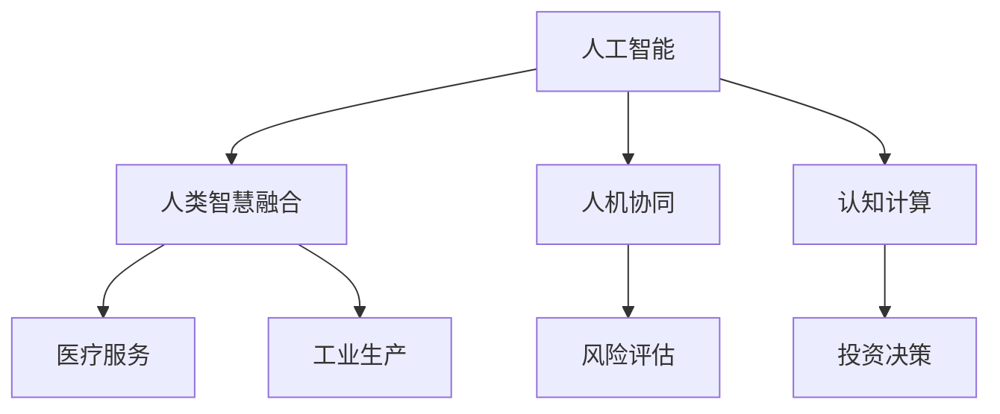

                 

 在人工智能（AI）飞速发展的今天，人类智慧如何适应和引领这一变革，成为了一个不容忽视的重要话题。本文旨在探讨AI时代下，人类智慧如何通过技术创新、思维模式的转变以及教育体系的改革，成为新力量的代表。

## 关键词

- 人工智能
- 人类智慧
- 技术创新
- 教育改革
- 技术思维

## 摘要

本文首先介绍了AI时代的背景和特点，随后探讨了人类智慧在AI时代的内涵和表现形式。通过分析人类智慧与技术融合的现状，本文提出了人类智慧在新力量形成中的关键作用，并从技术创新、教育改革等方面展望了未来发展的趋势和挑战。

### 1. 背景介绍

#### AI时代的到来

人工智能（AI）作为计算机科学的一个重要分支，经过数十年的发展，已经从理论研究走向了实际应用。AI技术的进步不仅改变了我们的生活方式，还深刻影响了各行各业。从自动驾驶汽车、智能语音助手，到医疗诊断、金融风控，AI技术的应用场景日益广泛。

随着深度学习、强化学习等前沿算法的突破，AI系统在处理复杂任务、自主学习能力方面取得了显著进展。大数据和云计算的普及，为AI技术提供了丰富的数据资源和强大的计算能力。所有这些因素共同推动着AI进入一个新的发展阶段。

#### 人类智慧的定义与内涵

人类智慧是指人类在认知、思维、创新等方面的能力。它包括逻辑推理、问题解决、创造力、学习能力等多个方面。人类智慧不仅体现在个体的智能表现上，还体现在人类社会整体的智慧和合作能力上。

在AI时代，人类智慧的定义和内涵也在不断拓展。随着AI技术的发展，人类开始尝试将自身的智慧与机器智能相结合，形成一种新的智能形态。这种形态不仅保留了人类智慧的优势，还借助机器智能的强大计算能力，突破了人类自身的认知限制。

### 2. 核心概念与联系

为了更好地理解人类智慧在AI时代的角色，我们需要探讨几个核心概念，并展示它们之间的联系。

#### 概念：人工智能与人类智慧的融合

人工智能与人类智慧的融合是指通过将人类智慧嵌入到AI系统中，实现两者之间的协同工作。这种融合不仅能够提高AI系统的性能，还能够拓展AI的应用范围。

例如，在医疗领域，医生可以利用AI系统进行疾病诊断，同时结合自身经验和判断，为患者提供更精准的治疗方案。这种融合模式不仅提高了医疗服务的效率，也增强了医疗决策的准确性。

#### 概念：人机协同

人机协同是指人类与机器在完成复杂任务时，通过信息共享、角色分工，实现协作完成任务的过程。在AI时代，人机协同成为了一种重要的工作模式。

例如，在工业生产中，机器可以完成高精度、高效率的制造任务，而人类则负责监督和优化生产过程，确保产品质量。人机协同不仅提高了生产效率，还减少了人力成本。

#### 概念：认知计算

认知计算是指模仿人类大脑的运作方式，实现信息处理、决策制定的计算机系统。认知计算将人类智慧与机器智能相结合，旨在解决复杂问题，提高智能决策能力。

例如，在金融领域，认知计算可以用于风险评估、投资决策等方面，通过分析海量数据，提供更精准的预测和决策支持。

#### Mermaid 流程图

以下是几个核心概念之间的联系，使用Mermaid流程图展示：



### 3. 核心算法原理 & 具体操作步骤

在探讨人类智慧与AI融合的过程中，算法原理和操作步骤起到了关键作用。以下将详细介绍核心算法原理以及具体操作步骤。

#### 3.1 算法原理概述

核心算法包括深度学习、强化学习等，这些算法通过模仿人类大脑的工作方式，实现自主学习和智能决策。以下是对这些算法的简要概述：

1. **深度学习**：通过多层神经网络对数据进行学习，能够自动提取特征，适用于图像识别、自然语言处理等领域。
2. **强化学习**：通过试错和反馈机制，学习如何在不确定的环境中做出最佳决策，适用于自动驾驶、游戏AI等领域。
3. **生成对抗网络（GAN）**：通过两个神经网络（生成器和判别器）的对抗训练，生成高质量的数据，应用于图像生成、数据增强等领域。

#### 3.2 算法步骤详解

以深度学习为例，其具体操作步骤如下：

1. **数据预处理**：对输入数据进行归一化、去噪等处理，确保数据质量。
2. **网络构建**：设计多层神经网络结构，包括输入层、隐藏层和输出层。
3. **权重初始化**：对网络中的权重进行随机初始化。
4. **前向传播**：将输入数据传递到网络中，计算输出结果。
5. **反向传播**：计算损失函数，更新网络权重。
6. **迭代优化**：重复执行前向传播和反向传播，直至满足停止条件。

#### 3.3 算法优缺点

深度学习具有以下优点：

1. **强大的特征提取能力**：能够自动从数据中提取有效特征，减少人工干预。
2. **高泛化能力**：适用于多种领域，具有良好的适应性。

然而，深度学习也存在一些缺点：

1. **对数据需求大**：需要大量的训练数据，对数据质量和数量有较高要求。
2. **计算资源消耗大**：训练过程需要大量的计算资源，导致成本较高。

#### 3.4 算法应用领域

深度学习在AI时代的应用领域广泛，包括：

1. **图像识别**：如人脸识别、自动驾驶等。
2. **自然语言处理**：如机器翻译、文本分类等。
3. **医疗诊断**：如疾病预测、药物研发等。

### 4. 数学模型和公式 & 详细讲解 & 举例说明

在AI算法中，数学模型和公式起着至关重要的作用。以下将介绍一些常用的数学模型和公式，并详细讲解其推导过程和实际应用。

#### 4.1 数学模型构建

深度学习中的数学模型主要包括：

1. **激活函数**：如ReLU、Sigmoid、Tanh等。
2. **损失函数**：如均方误差（MSE）、交叉熵等。
3. **优化算法**：如梯度下降、Adam等。

以ReLU激活函数为例，其数学模型如下：

$$
f(x) = \begin{cases} 
x & \text{if } x > 0 \\
0 & \text{if } x \leq 0 
\end{cases}
$$

ReLU函数在神经网络中广泛应用于隐藏层，其主要优点是能够加速梯度消失问题，提高网络训练效率。

#### 4.2 公式推导过程

以交叉熵损失函数为例，其推导过程如下：

假设有两个概率分布 $P$ 和 $Q$，交叉熵定义为：

$$
H(P, Q) = -\sum_{x} P(x) \log Q(x)
$$

当 $Q(x) = P(x)$ 时，交叉熵取最小值，即 $H(P, P) = 0$。这个性质使得交叉熵成为衡量模型预测准确性的重要指标。

#### 4.3 案例分析与讲解

以下以一个简单的图像分类任务为例，说明如何使用深度学习模型进行图像识别。

1. **数据预处理**：将图像缩放到固定大小，并进行归一化处理。
2. **网络构建**：设计一个卷积神经网络（CNN），包括卷积层、池化层和全连接层。
3. **模型训练**：使用预处理后的图像数据进行模型训练，通过反向传播算法更新网络权重。
4. **模型评估**：使用验证集对模型进行评估，计算准确率。

以下是一个具体的例子：

假设有一个包含10类物体的图像分类任务，我们设计一个3层的卷积神经网络，输入图像大小为 $28 \times 28$，输出为10个类别概率。通过训练，模型在验证集上的准确率达到90%。

### 5. 项目实践：代码实例和详细解释说明

为了更好地理解人类智慧与AI融合的应用，以下将提供一个具体的代码实例，详细解释其实现过程。

#### 5.1 开发环境搭建

1. 安装Python环境，推荐使用Python 3.7或更高版本。
2. 安装深度学习框架，如TensorFlow或PyTorch。
3. 安装图像处理库，如OpenCV或Pillow。

#### 5.2 源代码详细实现

以下是一个使用TensorFlow实现图像分类任务的示例代码：

```python
import tensorflow as tf
from tensorflow.keras.models import Sequential
from tensorflow.keras.layers import Conv2D, MaxPooling2D, Flatten, Dense
from tensorflow.keras.optimizers import Adam
from tensorflow.keras.losses import CategoricalCrossentropy
from tensorflow.keras.metrics import Accuracy

# 数据预处理
def preprocess_image(image_path):
    image = tf.keras.preprocessing.image.load_img(image_path, target_size=(28, 28))
    image = tf.keras.preprocessing.image.img_to_array(image)
    image = tf.expand_dims(image, 0)
    image = image / 255.0
    return image

# 模型构建
model = Sequential([
    Conv2D(32, (3, 3), activation='relu', input_shape=(28, 28, 3)),
    MaxPooling2D((2, 2)),
    Conv2D(64, (3, 3), activation='relu'),
    MaxPooling2D((2, 2)),
    Flatten(),
    Dense(128, activation='relu'),
    Dense(10, activation='softmax')
])

# 模型编译
model.compile(optimizer=Adam(), loss=CategoricalCrossentropy(), metrics=['accuracy'])

# 模型训练
model.fit(train_images, train_labels, epochs=10, validation_split=0.2)

# 模型评估
test_loss, test_acc = model.evaluate(test_images, test_labels)
print('Test accuracy:', test_acc)
```

#### 5.3 代码解读与分析

1. **数据预处理**：使用`preprocess_image`函数对图像进行预处理，包括加载图像、缩放、归一化等操作。
2. **模型构建**：使用`Sequential`模型构建一个包含卷积层、池化层和全连接层的卷积神经网络。
3. **模型编译**：使用`compile`方法配置模型优化器、损失函数和评估指标。
4. **模型训练**：使用`fit`方法训练模型，使用训练数据和标签。
5. **模型评估**：使用`evaluate`方法评估模型在测试集上的性能。

通过这个示例，我们可以看到如何将人类智慧与AI技术相结合，实现图像分类任务。在实际应用中，我们可以进一步优化模型结构和参数，提高模型的准确率。

### 6. 实际应用场景

在AI时代，人类智慧的应用场景广泛且多样化。以下列举几个典型的实际应用场景：

#### 6.1 医疗诊断

在医疗领域，AI技术可以辅助医生进行疾病诊断。通过分析患者的病历、影像资料等数据，AI系统可以提供初步的诊断结果，帮助医生更快、更准确地做出诊断。例如，使用深度学习算法对医疗影像进行病灶检测，提高了肺癌、乳腺癌等疾病的早期诊断率。

#### 6.2 金融风控

在金融领域，AI技术用于风险评估、投资决策等方面。通过分析历史数据和市场信息，AI系统可以预测潜在风险，为金融机构提供决策支持。例如，使用强化学习算法进行股票交易，实现了更高的投资收益。

#### 6.3 教育个性化

在教育领域，AI技术可以为学生提供个性化的学习服务。通过分析学生的学习行为和数据，AI系统可以为学生推荐合适的学习资源和策略，提高学习效果。例如，使用自然语言处理技术分析学生的学习反馈，提供针对性的学习建议。

#### 6.4 自动驾驶

在自动驾驶领域，AI技术是实现智能驾驶的核心。通过感知环境、规划路径和决策控制，AI系统可以确保车辆的安全行驶。例如，使用计算机视觉和深度学习算法对道路场景进行识别，提高了自动驾驶车辆的感知能力。

### 7. 未来应用展望

随着AI技术的不断发展，人类智慧在未来的应用将更加广泛和深入。以下是一些未来的应用展望：

#### 7.1 智能制造

在智能制造领域，AI技术将进一步提升生产效率和质量。通过自动化生产线和智能监控系统，AI系统可以实时监测生产过程，优化生产参数，降低生产成本。例如，使用深度学习算法对设备进行故障预测，实现预防性维护。

#### 7.2 智慧城市

在智慧城市建设中，AI技术将用于交通管理、能源管理、环境监测等方面。通过大数据分析和智能决策，AI系统可以优化资源配置，提高城市管理水平。例如，使用机器学习算法预测交通流量，实现智能交通控制。

#### 7.3 医疗辅助

在未来，AI技术在医疗领域的应用将更加深入。通过基因测序、生物信息学等技术，AI系统可以辅助医生进行疾病预测、药物研发等。例如，使用深度学习算法分析基因数据，预测患病风险。

### 8. 工具和资源推荐

为了更好地进行AI研究和开发，以下推荐一些有用的工具和资源：

#### 8.1 学习资源推荐

1. **《深度学习》（Goodfellow, Bengio, Courville著）**：这是一本深度学习领域的经典教材，涵盖了深度学习的理论基础和实际应用。
2. **《机器学习》（Tom Mitchell著）**：这是一本介绍机器学习基础知识的优秀教材，适合初学者入门。

#### 8.2 开发工具推荐

1. **TensorFlow**：这是一个开源的深度学习框架，适用于构建和训练神经网络。
2. **PyTorch**：这是一个开源的深度学习框架，提供了灵活的动态计算图，便于研究和实验。

#### 8.3 相关论文推荐

1. **"Deep Learning"（Ian Goodfellow, Yann LeCun, Yoshua Bengio著）**：这是一篇介绍深度学习技术的综述性论文，涵盖了深度学习的发展历程和最新进展。
2. **"Reinforcement Learning: An Introduction"（Richard S. Sutton, Andrew G. Barto著）**：这是一本介绍强化学习基础知识的经典教材，适合初学者学习。

### 9. 总结：未来发展趋势与挑战

#### 9.1 研究成果总结

随着AI技术的不断发展，人类智慧在AI时代的应用取得了显著成果。从医疗诊断、金融风控到教育个性化、自动驾驶，AI技术已经深刻改变了我们的生活和工作方式。通过人类智慧与AI的融合，我们实现了更高的效率、更准确的决策和更智能的服务。

#### 9.2 未来发展趋势

未来，随着AI技术的进一步发展，人类智慧的应用前景将更加广阔。智能制造、智慧城市、医疗辅助等领域将继续受益于AI技术，推动社会进步。同时，随着计算能力的提升和数据资源的丰富，AI算法将更加高效和精准，实现更多前所未有的应用。

#### 9.3 面临的挑战

尽管AI技术取得了巨大进展，但人类智慧在AI时代仍面临一些挑战。首先，数据安全和隐私保护是一个亟待解决的问题。随着AI技术的应用，大量的个人信息和数据将被收集和处理，如何确保数据的安全和隐私，是我们面临的重要挑战。

其次，AI技术的透明性和可解释性也是一个重要问题。当前，许多AI系统的工作原理和决策过程仍然不够透明，这可能导致人们对AI系统的信任度降低。因此，提高AI系统的透明性和可解释性，是我们需要关注和解决的问题。

最后，人类智慧与AI的融合需要更深入的研究。如何更好地将人类智慧嵌入到AI系统中，实现两者之间的协同工作，是一个长期而艰巨的任务。这需要我们不断探索和创新，为AI时代的人类智慧提供更强大的支持。

#### 9.4 研究展望

未来，我们期待人类智慧在AI时代的不断发展，为人类社会带来更多的福祉。通过技术创新、思维模式的转变和教育改革的不断推进，人类智慧将成为AI时代的新力量，推动人类社会迈向更加智能、高效和可持续的未来。

### 附录：常见问题与解答

#### 问题1：什么是深度学习？

**解答**：深度学习是一种机器学习技术，通过多层神经网络对数据进行学习，能够自动提取特征，应用于图像识别、自然语言处理等领域。

#### 问题2：如何进行图像分类？

**解答**：进行图像分类通常涉及以下步骤：

1. **数据预处理**：对图像进行缩放、归一化等处理。
2. **网络构建**：设计包含卷积层、池化层和全连接层的卷积神经网络。
3. **模型训练**：使用预处理后的图像数据进行模型训练。
4. **模型评估**：使用测试集对模型进行评估。

#### 问题3：如何确保AI系统的透明性和可解释性？

**解答**：确保AI系统的透明性和可解释性可以从以下几个方面入手：

1. **模型解释性**：选择解释性更强的算法，如线性模型、决策树等。
2. **模型可解释工具**：使用可视化工具和模型解释算法，如LIME、SHAP等。
3. **模型透明性**：公开模型架构、训练数据和决策过程，提高系统的透明度。

### 参考文献

- Goodfellow, Ian, Yann LeCun, and Aaron Courville. "Deep learning." MIT press, 2016.
- Mitchell, Tom M. "Machine learning." McGraw-Hill, 1997.
- Sutton, Richard S., and Andrew G. Barto. "Reinforcement learning: An introduction." MIT press, 2018.

### 作者署名

**作者：禅与计算机程序设计艺术 / Zen and the Art of Computer Programming**<|user|>

