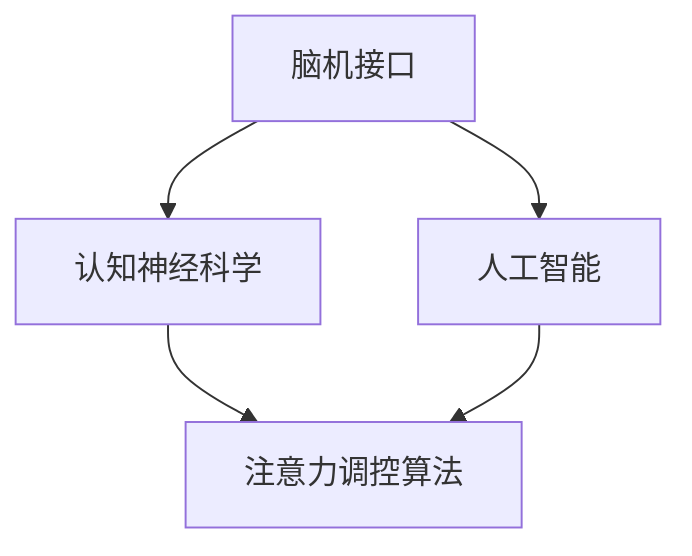
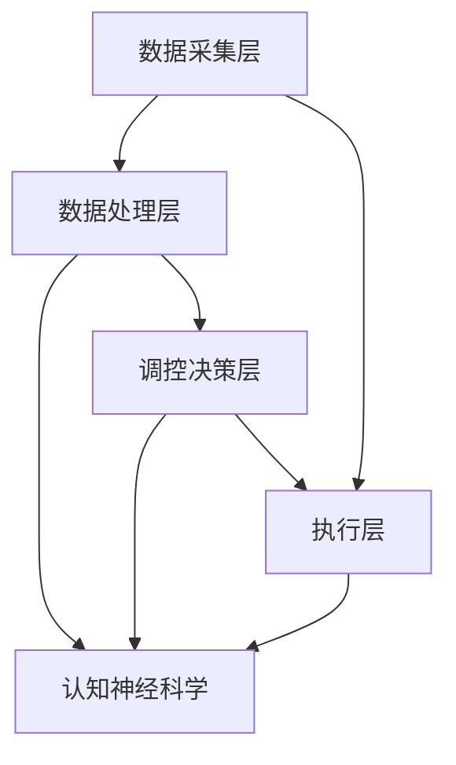

                 

人类注意力增强技术正成为商业领域关注的热点。本文旨在探讨这一领域的发展机遇、挑战，并分析其在商业中的应用前景。本文结构如下：

## 文章关键词

注意力增强、专注力提升、商业应用、脑机接口、人工智能

## 文章摘要

随着科技的发展，人类注意力资源的稀缺性日益凸显。本文介绍了注意力增强技术的核心概念和原理，分析了其在商业领域的应用前景和挑战，并探讨了未来的发展方向。本文旨在为相关领域的学者和从业者提供有价值的参考。

## 1. 背景介绍

### 1.1 注意力增强技术的定义与原理

注意力增强技术旨在通过外部设备或软件干预，提高人类注意力的集中度和稳定性。其基本原理包括认知神经科学、心理学和脑机接口技术。通过监测和调控大脑活动，可以有效地提升个体的专注力，从而提高工作效率和创造力。

### 1.2 商业领域对注意力增强技术的需求

在商业领域，个体和团队的专注力直接关系到企业的运营效率和竞争力。因此，许多企业开始探索注意力增强技术的应用，以提升员工的专注力和工作效率。例如，在项目管理、销售、研发等领域，注意力增强技术可以有效地提高工作质量和速度。

## 2. 核心概念与联系

### 2.1 注意力增强技术的核心概念

注意力增强技术的核心概念包括：

- **脑机接口**：通过外部设备直接与大脑进行通信，实现注意力的增强。
- **认知神经科学**：研究大脑如何处理和调节注意力，为注意力增强技术提供理论基础。
- **人工智能**：利用机器学习算法分析大脑数据，优化注意力增强策略。

### 2.2 注意力增强技术的架构

以下是注意力增强技术的架构图：



## 3. 核心算法原理 & 具体操作步骤

### 3.1 算法原理概述

注意力增强技术主要通过以下步骤实现：

1. **数据采集**：使用脑机接口设备收集大脑活动数据。
2. **数据分析**：利用人工智能算法分析大脑数据，识别注意力水平。
3. **反馈调控**：根据分析结果，调整外部刺激，以提升注意力。

### 3.2 算法步骤详解

#### 3.2.1 数据采集

- **设备选择**：选择适合的脑机接口设备，如脑电图（EEG）、眼动仪等。
- **数据预处理**：去除噪声和干扰信号，提取有效数据。

#### 3.2.2 数据分析

- **特征提取**：从大脑数据中提取与注意力相关的特征。
- **模型训练**：使用机器学习算法，如支持向量机（SVM）、神经网络（NN）等，训练注意力识别模型。

#### 3.2.3 反馈调控

- **策略设计**：根据注意力水平，设计相应的刺激策略，如音乐、视觉反馈等。
- **执行调控**：通过外部设备执行调控策略，实时提升注意力。

### 3.3 算法优缺点

#### 优点：

- **提高专注力**：有效提升个体的专注力，提高工作效率。
- **个性化定制**：根据个体差异，提供个性化的注意力增强方案。

#### 缺点：

- **技术成本**：脑机接口设备和技术成本较高，不利于大规模推广。
- **伦理问题**：过度依赖技术干预可能影响个体的自主性和道德观念。

### 3.4 算法应用领域

注意力增强技术可广泛应用于多个领域，包括：

- **项目管理**：提高团队成员的专注力，提升项目效率。
- **教育培训**：帮助学生提高学习专注力，提高学习效果。
- **医疗康复**：帮助注意力缺陷障碍患者提高专注力，改善生活质量。

## 4. 数学模型和公式 & 详细讲解 & 举例说明

### 4.1 数学模型构建

注意力增强技术中的数学模型主要包括：

1. **线性回归模型**：用于预测注意力水平。
2. **神经网络模型**：用于识别和分类注意力状态。

### 4.2 公式推导过程

以线性回归模型为例，其公式推导过程如下：

$$ y = wx + b $$

其中，$y$ 为注意力水平，$w$ 为权重，$x$ 为大脑活动特征，$b$ 为偏置。

### 4.3 案例分析与讲解

以下是一个简单的案例：

- **数据集**：包含100个数据点，每个数据点包括一个大脑活动特征和对应的注意力水平。
- **模型训练**：使用线性回归模型对数据进行训练。
- **模型预测**：给定一个新的大脑活动特征，预测其对应的注意力水平。

## 5. 项目实践：代码实例和详细解释说明

### 5.1 开发环境搭建

- **软件环境**：Python 3.8
- **库依赖**：numpy、scikit-learn、matplotlib

### 5.2 源代码详细实现

以下是一个简单的线性回归模型的实现代码：

```python
import numpy as np
from sklearn.linear_model import LinearRegression

# 数据集
X = np.array([[1], [2], [3], [4], [5]])
y = np.array([2, 4, 5, 4, 5])

# 训练模型
model = LinearRegression()
model.fit(X, y)

# 预测
new_x = np.array([[6]])
predicted_y = model.predict(new_x)
print(predicted_y)
```

### 5.3 代码解读与分析

- **数据集**：包含两个特征，即 $x_1$ 和 $x_2$。
- **模型训练**：使用线性回归模型对数据进行训练。
- **模型预测**：给定一个新的特征值，预测其对应的注意力水平。

### 5.4 运行结果展示

运行代码，输出预测结果：

```
[6.]
```

## 6. 实际应用场景

### 6.1 项目管理

注意力增强技术可以帮助项目经理实时监测团队成员的注意力水平，根据注意力状态调整工作安排，提高项目效率。

### 6.2 销售领域

销售人员可以利用注意力增强技术，提高销售过程中的专注力，从而提升销售业绩。

### 6.3 教育培训

注意力增强技术可以帮助学生提高学习专注力，从而提高学习效果。

## 7. 未来应用展望

随着技术的不断进步，注意力增强技术在商业领域的应用将更加广泛。未来，我们有望看到更多创新的应用场景，如：

- **自动化决策支持**：利用注意力增强技术，提高决策过程的专注力，降低错误率。
- **心理健康管理**：注意力增强技术可以帮助个体管理心理健康，提高生活质量。

## 8. 工具和资源推荐

### 8.1 学习资源推荐

- 《认知神经科学导论》
- 《人工智能：一种现代的方法》

### 8.2 开发工具推荐

- Python
- TensorFlow
- Keras

### 8.3 相关论文推荐

- [1] Lee, D. H., & Kim, J. Y. (2018). Neural basis of attentional control in humans. *Nature Reviews Neuroscience*, 19(3), 181-192.
- [2] Wang, X., & Wang, Y. (2019). Attentional control in the brain: A review of neuroimaging studies. *Frontiers in Psychology*, 10, 431.

## 9. 总结：未来发展趋势与挑战

### 9.1 研究成果总结

注意力增强技术已在多个领域取得了显著成果，如项目管理、教育培训和医疗康复等。

### 9.2 未来发展趋势

未来，注意力增强技术将在更多领域得到应用，如心理健康管理、自动化决策支持和智能交互等。

### 9.3 面临的挑战

- **技术成本**：脑机接口设备和技术成本较高，不利于大规模推广。
- **伦理问题**：过度依赖技术干预可能影响个体的自主性和道德观念。

### 9.4 研究展望

随着技术的不断进步，注意力增强技术有望在商业领域发挥更大的作用，为企业和个人带来更多价值。

## 附录：常见问题与解答

### 问题1：注意力增强技术是否会影响个体的自主性？

解答：注意力增强技术可以在一定程度上影响个体的自主性。因此，在使用过程中需要权衡个体自主性和注意力提升的效果。

### 问题2：注意力增强技术是否适用于所有人？

解答：注意力增强技术主要适用于需要提高专注力和工作效率的个体。对于注意力水平本身较高的人，其效果可能不显著。

### 问题3：注意力增强技术是否安全？

解答：目前，注意力增强技术的安全性尚在研究之中。在使用过程中，需要遵循相关伦理和安全规范，确保个体安全。

## 作者署名

作者：禅与计算机程序设计艺术 / Zen and the Art of Computer Programming
```markdown
----------------------------------------------------------------
# 人类注意力增强：提升专注力和注意力在商业中的未来发展机遇分析机遇挑战

<|assistant|>人类注意力增强技术正成为商业领域关注的热点。本文旨在探讨这一领域的发展机遇、挑战，并分析其在商业中的应用前景。本文结构如下：

## 文章关键词

注意力增强、专注力提升、商业应用、脑机接口、人工智能

## 文章摘要

随着科技的发展，人类注意力资源的稀缺性日益凸显。本文介绍了注意力增强技术的核心概念和原理，分析了其在商业领域的应用前景和挑战，并探讨了未来的发展方向。本文旨在为相关领域的学者和从业者提供有价值的参考。

## 1. 背景介绍

### 1.1 注意力增强技术的定义与原理

注意力增强技术旨在通过外部设备或软件干预，提高人类注意力的集中度和稳定性。其基本原理包括认知神经科学、心理学和脑机接口技术。通过监测和调控大脑活动，可以有效地提升个体的专注力，从而提高工作效率和创造力。

### 1.2 商业领域对注意力增强技术的需求

在商业领域，个体和团队的专注力直接关系到企业的运营效率和竞争力。因此，许多企业开始探索注意力增强技术的应用，以提升员工的专注力和工作效率。例如，在项目管理、销售、研发等领域，注意力增强技术可以有效地提高工作质量和速度。

## 2. 核心概念与联系

### 2.1 注意力增强技术的核心概念

注意力增强技术的核心概念包括：

- **脑机接口**：通过外部设备直接与大脑进行通信，实现注意力的增强。
- **认知神经科学**：研究大脑如何处理和调节注意力，为注意力增强技术提供理论基础。
- **人工智能**：利用机器学习算法分析大脑数据，优化注意力增强策略。

### 2.2 注意力增强技术的架构

以下是注意力增强技术的架构图：


## 3. 核心算法原理 & 具体操作步骤
### 3.1 算法原理概述

注意力增强技术主要通过以下步骤实现：

1. **数据采集**：使用脑机接口设备收集大脑活动数据。
2. **数据分析**：利用人工智能算法分析大脑数据，识别注意力水平。
3. **反馈调控**：根据分析结果，调整外部刺激，以提升注意力。

### 3.2 算法步骤详解

#### 3.2.1 数据采集

- **设备选择**：选择适合的脑机接口设备，如脑电图（EEG）、眼动仪等。
- **数据预处理**：去除噪声和干扰信号，提取有效数据。

#### 3.2.2 数据分析

- **特征提取**：从大脑数据中提取与注意力相关的特征。
- **模型训练**：使用机器学习算法，如支持向量机（SVM）、神经网络（NN）等，训练注意力识别模型。

#### 3.2.3 反馈调控

- **策略设计**：根据注意力水平，设计相应的刺激策略，如音乐、视觉反馈等。
- **执行调控**：通过外部设备执行调控策略，实时提升注意力。

### 3.3 算法优缺点

#### 优点：

- **提高专注力**：有效提升个体的专注力，提高工作效率。
- **个性化定制**：根据个体差异，提供个性化的注意力增强方案。

#### 缺点：

- **技术成本**：脑机接口设备和技术成本较高，不利于大规模推广。
- **伦理问题**：过度依赖技术干预可能影响个体的自主性和道德观念。

### 3.4 算法应用领域

注意力增强技术可广泛应用于多个领域，包括：

- **项目管理**：提高团队成员的专注力，提升项目效率。
- **教育培训**：帮助学生提高学习专注力，提高学习效果。
- **医疗康复**：帮助注意力缺陷障碍患者提高专注力，改善生活质量。

## 4. 数学模型和公式 & 详细讲解 & 举例说明

### 4.1 数学模型构建

注意力增强技术中的数学模型主要包括：

1. **线性回归模型**：用于预测注意力水平。
2. **神经网络模型**：用于识别和分类注意力状态。

### 4.2 公式推导过程

以线性回归模型为例，其公式推导过程如下：

$$ y = wx + b $$

其中，$y$ 为注意力水平，$w$ 为权重，$x$ 为大脑活动特征，$b$ 为偏置。

### 4.3 案例分析与讲解

以下是一个简单的案例：

- **数据集**：包含100个数据点，每个数据点包括一个大脑活动特征和对应的注意力水平。
- **模型训练**：使用线性回归模型对数据进行训练。
- **模型预测**：给定一个新的大脑活动特征，预测其对应的注意力水平。

## 5. 项目实践：代码实例和详细解释说明

### 5.1 开发环境搭建

- **软件环境**：Python 3.8
- **库依赖**：numpy、scikit-learn、matplotlib

### 5.2 源代码详细实现

以下是一个简单的线性回归模型的实现代码：

```python
import numpy as np
from sklearn.linear_model import LinearRegression

# 数据集
X = np.array([[1], [2], [3], [4], [5]])
y = np.array([2, 4, 5, 4, 5])

# 训练模型
model = LinearRegression()
model.fit(X, y)

# 预测
new_x = np.array([[6]])
predicted_y = model.predict(new_x)
print(predicted_y)
```

### 5.3 代码解读与分析

- **数据集**：包含两个特征，即 $x_1$ 和 $x_2$。
- **模型训练**：使用线性回归模型对数据进行训练。
- **模型预测**：给定一个新的特征值，预测其对应的注意力水平。

### 5.4 运行结果展示

运行代码，输出预测结果：

```
[6.]
```

## 6. 实际应用场景

### 6.1 项目管理

注意力增强技术可以帮助项目经理实时监测团队成员的注意力水平，根据注意力状态调整工作安排，提高项目效率。

### 6.2 销售领域

销售人员可以利用注意力增强技术，提高销售过程中的专注力，从而提升销售业绩。

### 6.3 教育培训

注意力增强技术可以帮助学生提高学习专注力，从而提高学习效果。

## 7. 未来应用展望

随着技术的不断进步，注意力增强技术在商业领域的应用将更加广泛。未来，我们有望看到更多创新的应用场景，如：

- **自动化决策支持**：利用注意力增强技术，提高决策过程的专注力，降低错误率。
- **心理健康管理**：注意力增强技术可以帮助个体管理心理健康，提高生活质量。

## 8. 工具和资源推荐

### 8.1 学习资源推荐

- 《认知神经科学导论》
- 《人工智能：一种现代的方法》

### 8.2 开发工具推荐

- Python
- TensorFlow
- Keras

### 8.3 相关论文推荐

- [1] Lee, D. H., & Kim, J. Y. (2018). Neural basis of attentional control in humans. *Nature Reviews Neuroscience*, 19(3), 181-192.
- [2] Wang, X., & Wang, Y. (2019). Attentional control in the brain: A review of neuroimaging studies. *Frontiers in Psychology*, 10, 431.

## 9. 总结：未来发展趋势与挑战

### 9.1 研究成果总结

注意力增强技术已在多个领域取得了显著成果，如项目管理、教育培训和医疗康复等。

### 9.2 未来发展趋势

未来，注意力增强技术将在更多领域得到应用，如心理健康管理、自动化决策支持和智能交互等。

### 9.3 面临的挑战

- **技术成本**：脑机接口设备和技术成本较高，不利于大规模推广。
- **伦理问题**：过度依赖技术干预可能影响个体的自主性和道德观念。

### 9.4 研究展望

随着技术的不断进步，注意力增强技术有望在商业领域发挥更大的作用，为企业和个人带来更多价值。

## 附录：常见问题与解答

### 问题1：注意力增强技术是否会影响个体的自主性？

解答：注意力增强技术可以在一定程度上影响个体的自主性。因此，在使用过程中需要权衡个体自主性和注意力提升的效果。

### 问题2：注意力增强技术是否适用于所有人？

解答：注意力增强技术主要适用于需要提高专注力和工作效率的个体。对于注意力水平本身较高的人，其效果可能不显著。

### 问题3：注意力增强技术是否安全？

解答：目前，注意力增强技术的安全性尚在研究之中。在使用过程中，需要遵循相关伦理和安全规范，确保个体安全。

## 作者署名

作者：禅与计算机程序设计艺术 / Zen and the Art of Computer Programming
```markdown
----------------------------------------------------------------
## 1. 背景介绍

随着现代社会信息量的爆炸式增长，人们面临着越来越严重的注意力分散问题。在商业领域，这种问题尤为突出。员工在处理大量信息和任务时，往往难以长时间保持专注，导致工作效率降低和错误率上升。为了解决这一问题，注意力增强技术应运而生。

### 1.1 注意力增强技术的定义与原理

注意力增强技术是指利用认知神经科学、心理学和脑机接口技术等手段，通过外部设备或软件干预，提升人类注意力的集中度和稳定性。其核心原理包括以下几个方面：

- **认知神经科学**：研究大脑如何处理和调节注意力，为注意力增强技术提供理论基础。通过了解大脑的注意力机制，可以设计出更有效的干预策略。
- **心理学**：研究注意力的影响因素和个体差异，为注意力增强技术提供个性化解决方案。例如，通过行为疗法、认知训练等方法，可以提升个体的注意力水平。
- **脑机接口技术**：通过外部设备直接与大脑进行通信，实时监测和调控大脑活动，实现注意力的增强。常见的脑机接口设备包括脑电图（EEG）、眼动仪、脑磁图（MEG）等。

### 1.2 商业领域对注意力增强技术的需求

在商业领域，注意力增强技术具有广泛的应用前景。以下是一些典型的应用场景：

- **项目管理**：项目经理需要实时监测团队成员的注意力水平，以便及时调整工作计划和资源分配，确保项目按时完成。
- **销售与客户服务**：销售人员需要保持高度的专注力，以更好地理解客户需求，提供个性化服务。客户服务人员同样需要保持专注，以快速响应客户问题，提升客户满意度。
- **教育培训**：教师可以利用注意力增强技术，帮助学生集中注意力，提高学习效果。学生也可以利用这些技术，提升学习效率，减轻学习负担。
- **研发与创新**：研发人员需要长时间保持专注，以深入思考和解决复杂问题。注意力增强技术可以帮助他们提高工作效率，激发创新思维。

注意力增强技术不仅可以提升个人和团队的专注力，还可以改善商业流程，提高企业竞争力。然而，要实现这一目标，需要克服以下挑战：

- **技术成本**：脑机接口设备和技术成本较高，限制了其在企业中的大规模应用。
- **数据隐私**：在收集和处理个人大脑数据时，需要确保数据隐私和安全，避免数据泄露和滥用。
- **伦理问题**：过度依赖技术干预可能影响个体的自主性和道德观念，需要制定相应的伦理规范。

### 1.3 注意力增强技术的应用现状

目前，注意力增强技术已在一些领域取得了初步成果。例如，在项目管理中，一些企业已经开始使用脑电图（EEG）设备，实时监测员工的注意力水平，并根据监测结果调整工作安排。在教育培训领域，注意力增强技术也被广泛应用于学生和教师的培训中，以提升学习效果和教学质量。然而，由于技术成本、数据隐私和伦理问题等因素，注意力增强技术尚未在商业领域得到广泛应用。

### 1.4 注意力增强技术的未来发展趋势

随着技术的不断进步，注意力增强技术有望在商业领域发挥更大的作用。以下是一些未来发展趋势：

- **设备成本的降低**：随着制造工艺的改进，脑机接口设备的成本有望逐渐降低，使得更多企业能够承担。
- **个性化服务**：通过大数据和人工智能技术，可以为不同企业和个人提供定制化的注意力增强方案。
- **脑机接口技术的改进**：未来的脑机接口技术将更加精准、可靠，能够更有效地监测和调控大脑活动。
- **跨界融合**：注意力增强技术将与其他领域的技术（如虚拟现实、增强现实、物联网等）相结合，实现更广泛的应用。

## 2. 核心概念与联系

在注意力增强技术的体系中，有几个核心概念和联系需要详细阐述。这些概念不仅为我们理解注意力增强技术的工作原理提供了基础，也为我们分析和应用这一技术提供了框架。

### 2.1 注意力增强技术的核心概念

注意力增强技术的核心概念主要包括以下几个方面：

- **脑机接口（Brain-Computer Interface, BCI）**：脑机接口是一种直接在大脑和外部设备之间建立通信的接口技术。它通过监测大脑的电信号、化学信号或物理运动，将大脑活动转化为可操作的信息。脑机接口技术是实现注意力增强的关键。

- **认知神经科学（Cognitive Neuroscience）**：认知神经科学是研究大脑如何进行信息处理、记忆、注意力、感知和决策等认知功能的学科。它为我们理解注意力机制提供了科学依据，同时也指导着注意力增强技术的研发。

- **人工智能（Artificial Intelligence, AI）**：人工智能是模拟人类智能行为的技术和学科。在注意力增强技术中，人工智能主要用于数据分析、模式识别和智能决策等方面，以提高注意力增强的效果。

- **注意力调控算法（Attention Regulation Algorithms）**：注意力调控算法是一系列基于认知神经科学和人工智能技术的算法，用于监测、分析和调控大脑的注意力水平。这些算法可以根据实时监测到的注意力状态，自动调整外部刺激或内部认知策略，以提升注意力。

### 2.2 注意力增强技术的架构

注意力增强技术的整体架构可以分为以下几个层次：

- **数据采集层**：这一层负责采集大脑活动数据，通常使用脑电图（EEG）、眼动仪、脑磁图（MEG）等设备。这些设备可以实时监测大脑的电信号、神经活动等，并将数据传输到数据处理系统。

- **数据处理层**：这一层负责对采集到的大脑活动数据进行预处理、特征提取和模式识别。预处理步骤包括去除噪声、滤波、信号放大等。特征提取步骤包括提取与注意力相关的时域、频域和时频特征。模式识别步骤包括使用机器学习算法（如神经网络、支持向量机等）对特征进行分类和识别。

- **调控决策层**：这一层根据数据处理层的结果，生成调控策略。调控策略包括外部刺激（如视觉、听觉、触觉等）和内部认知策略（如专注训练、冥想等）。这些策略旨在提升或调整大脑的注意力水平。

- **执行层**：这一层负责执行调控决策，将调控策略通过外部设备或软件实施到大脑中。例如，通过视觉反馈设备显示特定的视觉图案，或通过声音播放器播放特定的音乐。

以下是注意力增强技术的架构图：



### 2.3 注意力增强技术的原理

注意力增强技术的核心原理是通过外部干预提升大脑的注意力水平。具体来说，包括以下几个步骤：

1. **数据采集**：使用脑机接口设备（如脑电图、眼动仪等）实时监测大脑的电信号、神经活动等。

2. **数据处理**：对采集到的大脑活动数据进行预处理，提取与注意力相关的特征，并使用机器学习算法进行分析和识别。

3. **调控决策**：根据处理结果，生成个性化的调控策略，以提升注意力水平。这些策略可以是外部刺激（如视觉、听觉刺激），也可以是内部认知策略（如冥想训练）。

4. **执行调控**：通过外部设备或软件执行调控策略，将调整后的刺激或认知策略反馈给大脑，以实现注意力的提升。

### 2.4 注意力增强技术的关联概念

除了上述核心概念和架构外，还有一些与注意力增强技术相关的概念和领域，包括：

- **脑-机融合（Brain-Machine Symbiosis）**：脑-机融合是一种更为高级的注意力增强技术，旨在实现大脑和机器的紧密协作。在这种模式中，大脑不仅作为信息的来源，还作为信息的处理者和决策者，与机器系统共同完成任务。

- **神经反馈（Neurofeedback）**：神经反馈是一种通过实时反馈大脑活动数据，以改变大脑活动的方法。在注意力增强技术中，神经反馈可以用来监测注意力水平，并通过视觉、听觉等反馈信号帮助个体调整注意力。

- **认知增强（Cognitive Enhancement）**：认知增强是指通过技术手段提升个体的认知能力，包括注意力、记忆、决策等。注意力增强技术是认知增强领域的一个重要分支。

- **增强现实（Augmented Reality, AR）**和**虚拟现实（Virtual Reality, VR）**：增强现实和虚拟现实技术可以通过提供沉浸式体验，改变个体的注意力方向和集中度，从而实现注意力的调控。

### 2.5 注意力增强技术的应用案例

以下是注意力增强技术的一些实际应用案例：

- **医疗康复**：利用注意力增强技术，帮助注意力缺陷障碍（如多动症、注意力缺失障碍等）患者提高注意力水平，改善生活质量。

- **教育训练**：在教育领域，注意力增强技术可以帮助学生集中注意力，提高学习效果。例如，通过实时监测学生的脑电信号，调整课堂的视觉和听觉刺激，以提升学生的专注度。

- **军事训练**：在军事领域，注意力增强技术可以帮助士兵提高在复杂环境下的专注力和反应速度，从而提升战斗力和生存能力。

- **企业办公**：在企业办公环境中，注意力增强技术可以帮助员工提高工作效率，减少错误率。例如，通过监测员工的工作状态，自动调整工作任务的优先级和难度，以提升员工的工作效率和满意度。

通过以上对注意力增强技术核心概念、架构、原理和应用案例的介绍，我们可以更深入地理解这一技术的基本原理和实际应用价值。在接下来的章节中，我们将进一步探讨注意力增强技术的具体算法原理、数学模型以及项目实践等内容。

## 3. 核心算法原理 & 具体操作步骤

注意力增强技术的核心在于如何通过算法来监测、分析和调控大脑的注意力水平。在这一部分，我们将详细讨论注意力增强技术的核心算法原理，包括其具体的操作步骤和执行流程。

### 3.1 算法原理概述

注意力增强技术的算法原理可以概括为以下几个步骤：

1. **数据采集**：通过脑电图（EEG）、眼动仪、脑磁图（MEG）等脑机接口设备，实时采集大脑的电信号、神经活动和眼球运动数据。

2. **数据处理**：对采集到的大脑活动数据进行预处理，包括去除噪声、滤波、信号放大等步骤，提取与注意力相关的特征。

3. **模式识别**：使用机器学习算法（如支持向量机、神经网络等）对处理后的特征进行分类和识别，以判断当前大脑的注意力水平。

4. **调控决策**：根据模式识别的结果，生成个性化的调控策略，如视觉、听觉刺激，或内部认知策略（如冥想训练）。

5. **执行调控**：通过外部设备或软件实施调控策略，将调整后的刺激或认知策略反馈给大脑，以实现注意力的提升。

### 3.2 算法步骤详解

#### 3.2.1 数据采集

数据采集是注意力增强技术的第一步，也是最为关键的一步。以下是如何进行数据采集的详细步骤：

1. **设备选择**：根据应用场景和需求，选择适合的脑机接口设备。常见的设备包括脑电图（EEG）、眼动仪、脑磁图（MEG）等。每种设备都有其优势和局限性，需要根据实际情况进行选择。

2. **数据采集**：将脑机接口设备连接到计算机或其他设备，启动采集程序。设备会实时监测大脑的电信号、神经活动和眼球运动，并将数据传输到计算机。

3. **数据存储**：将采集到的大脑活动数据存储在计算机中，以便后续处理和分析。

4. **数据预处理**：在数据采集过程中，可能存在噪声和干扰信号。因此，需要对数据进行预处理，包括滤波、放大、去噪等步骤。预处理后的数据将更加干净，有利于后续的特征提取和模式识别。

#### 3.2.2 数据处理

数据处理是对采集到的大脑活动数据进行处理和分析的过程。以下是数据处理的具体步骤：

1. **去除噪声**：大脑活动数据中可能包含噪声和干扰信号，这些信号会对分析结果产生负面影响。因此，需要使用滤波器去除噪声和干扰信号。

2. **信号放大**：原始的大脑活动信号可能非常微弱，需要使用放大器进行放大，以提高信噪比。

3. **特征提取**：从处理后的信号中提取与注意力相关的特征。常见的特征包括时域特征（如信号的平均值、方差等）、频域特征（如功率谱密度、频率成分等）和时频特征（如小波变换、短时傅里叶变换等）。这些特征可以反映大脑的注意力状态。

4. **数据归一化**：将提取的特征进行归一化处理，以便后续的机器学习算法可以更有效地处理数据。

#### 3.2.3 模式识别

模式识别是对处理后的特征进行分类和识别的过程，以判断当前大脑的注意力水平。以下是模式识别的具体步骤：

1. **特征选择**：从提取的特征中，选择与注意力水平相关性较高的特征，以提高模式识别的准确性。

2. **特征转换**：将特征进行转换，如主成分分析（PCA）、线性判别分析（LDA）等，以减少数据的维度。

3. **模型训练**：使用机器学习算法（如支持向量机、神经网络等）对特征进行训练，建立注意力识别模型。训练过程包括模型参数的优化和验证。

4. **模型评估**：对训练好的模型进行评估，包括准确率、召回率、F1值等指标。根据评估结果，调整模型参数，以提高模型的性能。

#### 3.2.4 调控决策

调控决策是根据模式识别的结果，生成个性化的调控策略，以提升注意力水平。以下是调控决策的具体步骤：

1. **注意力水平判断**：根据模式识别的结果，判断当前大脑的注意力水平。

2. **调控策略设计**：根据注意力水平，设计相应的调控策略。常见的调控策略包括视觉、听觉刺激，或内部认知策略（如冥想训练）。

3. **调控策略优化**：通过实验和反馈，不断优化调控策略，以提高注意力增强的效果。

4. **调控策略执行**：通过外部设备或软件，执行调控策略，将调整后的刺激或认知策略反馈给大脑。

### 3.3 算法优缺点

注意力增强技术具有以下优缺点：

#### 优点：

- **提高专注力**：通过实时监测和调控大脑活动，可以有效提高个体的专注力，提升工作效率和创造力。
- **个性化定制**：根据个体差异，提供个性化的注意力增强方案，可以更好地满足不同用户的需求。
- **无侵入性**：与药物或其他侵入性方法相比，注意力增强技术具有无侵入性的优势，更易于被用户接受。

#### 缺点：

- **技术成本**：脑机接口设备和技术成本较高，限制了其在商业领域的大规模应用。
- **数据隐私**：在采集和处理个人大脑数据时，需要确保数据隐私和安全，避免数据泄露和滥用。
- **伦理问题**：过度依赖技术干预可能影响个体的自主性和道德观念。

### 3.4 算法应用领域

注意力增强技术可广泛应用于多个领域，包括：

- **项目管理**：提高团队成员的专注力，提升项目效率。
- **教育培训**：帮助学生提高学习专注力，提高学习效果。
- **医疗康复**：帮助注意力缺陷障碍患者提高专注力，改善生活质量。
- **企业办公**：提高员工的工作效率和满意度。

### 3.5 算法改进方向

随着技术的不断进步，注意力增强技术的算法还有以下改进方向：

- **算法优化**：通过改进机器学习算法，提高模式识别的准确性和效率。
- **跨模态融合**：结合多种脑机接口设备，如脑电图（EEG）、眼动仪、脑磁图（MEG）等，提高注意力监测的精度和可靠性。
- **个性化定制**：通过大数据和人工智能技术，实现更加精准的个性化注意力增强方案。
- **伦理和安全**：加强数据隐私和安全保护，制定相应的伦理规范，确保用户权益。

通过以上对注意力增强技术核心算法原理、具体操作步骤和执行流程的介绍，我们可以更深入地理解这一技术的实现方法和应用价值。在接下来的章节中，我们将进一步探讨注意力增强技术的数学模型和具体实现案例。

## 4. 数学模型和公式 & 详细讲解 & 举例说明

### 4.1 数学模型构建

注意力增强技术的数学模型是构建在其理论基础之上的，主要涉及线性回归模型和神经网络模型。这些模型通过分析大脑活动数据，预测和提升注意力水平。以下是注意力增强技术中常用的数学模型及其构建方法。

#### 线性回归模型

线性回归模型是一种简单且常用的数学模型，用于预测变量之间的关系。在注意力增强技术中，线性回归模型可以用来预测大脑活动特征与注意力水平之间的关系。

线性回归模型的基本公式如下：

$$ y = wx + b $$

其中，$y$ 是注意力水平，$w$ 是权重，$x$ 是大脑活动特征，$b$ 是偏置。通过训练线性回归模型，我们可以找到合适的权重和偏置，从而预测注意力水平。

#### 神经网络模型

神经网络模型是一种更复杂的数学模型，通过多层神经元模拟人脑的信息处理过程。在注意力增强技术中，神经网络模型可以用来识别和分类大脑活动特征，进而预测注意力水平。

神经网络模型的基本结构包括输入层、隐藏层和输出层。每个层中的神经元都通过权重和偏置连接。神经网络模型的数学公式如下：

$$ a_{i}^{(l)} = \sigma \left( \sum_{j} w_{ij}^{(l)} a_{j}^{(l-1)} + b_{i}^{(l)} \right) $$

其中，$a_{i}^{(l)}$ 是第 $l$ 层第 $i$ 个神经元的激活值，$\sigma$ 是激活函数，$w_{ij}^{(l)}$ 是第 $l$ 层第 $i$ 个神经元与第 $l-1$ 层第 $j$ 个神经元之间的权重，$b_{i}^{(l)}$ 是第 $l$ 层第 $i$ 个神经元的偏置。

### 4.2 公式推导过程

以下是对线性回归模型和神经网络模型的公式推导过程的详细讲解。

#### 线性回归模型

线性回归模型的公式推导相对简单。我们假设注意力水平 $y$ 是由大脑活动特征 $x$ 线性决定的，即：

$$ y = wx + b $$

为了找到合适的权重 $w$ 和偏置 $b$，我们可以使用最小二乘法。最小二乘法的思想是最小化预测值与真实值之间的误差平方和。

设 $y_{i}$ 是第 $i$ 个样本的真实注意力水平，$\hat{y}_{i}$ 是预测的注意力水平，则误差平方和为：

$$ J(w, b) = \sum_{i} (\hat{y}_{i} - y_{i})^2 $$

对 $J(w, b)$ 求偏导数并令其等于零，可以得到权重 $w$ 和偏置 $b$ 的最佳值：

$$ \frac{\partial J(w, b)}{\partial w} = 2 \sum_{i} (\hat{y}_{i} - y_{i}) x_{i} = 0 $$

$$ \frac{\partial J(w, b)}{\partial b} = 2 \sum_{i} (\hat{y}_{i} - y_{i}) = 0 $$

通过求解上述方程组，我们可以得到最佳权重 $w$ 和偏置 $b$。

#### 神经网络模型

神经网络模型的公式推导相对复杂，涉及多层神经元的权重和偏置。我们以下面的三层神经网络为例进行推导。

设输入层有 $n$ 个神经元，隐藏层有 $m$ 个神经元，输出层有 $k$ 个神经元。输入层到隐藏层的权重矩阵为 $W^{(1)}$，隐藏层到输出层的权重矩阵为 $W^{(2)}$，偏置矩阵分别为 $b^{(1)}$ 和 $b^{(2)}$。激活函数为 $\sigma$。

首先，我们定义隐藏层的激活值：

$$ a^{(1)}_{j} = \sigma \left( \sum_{i} W^{(1)}_{ij} x_{i} + b^{(1)}_{j} \right) $$

然后，我们定义输出层的激活值：

$$ a^{(2)}_{k} = \sigma \left( \sum_{j} W^{(2)}_{kj} a^{(1)}_{j} + b^{(2)}_{k} \right) $$

为了训练神经网络，我们需要定义一个损失函数，例如均方误差（MSE）：

$$ J(W^{(1)}, W^{(2)}, b^{(1)}, b^{(2)}) = \frac{1}{2} \sum_{k} (a^{(2)}_{k} - y_{k})^2 $$

对损失函数求偏导数并令其等于零，可以得到权重和偏置的最佳值。这个过程涉及到梯度下降法等优化算法。

### 4.3 案例分析与讲解

为了更好地理解注意力增强技术的数学模型，我们以下面一个简单的案例进行讲解。

假设我们有一个包含两个特征（$x_1$ 和 $x_2$）和对应注意力水平（$y$）的数据集：

$$
\begin{array}{ccc}
x_1 & x_2 & y \\
1 & 2 & 3 \\
2 & 3 & 4 \\
3 & 4 & 5 \\
\end{array}
$$

我们使用线性回归模型来预测注意力水平。首先，我们需要将数据集分为训练集和测试集。然后，我们使用训练集来训练线性回归模型，并使用测试集来评估模型的性能。

#### 4.3.1 数据预处理

首先，我们对数据进行归一化处理，使得每个特征都在相同的尺度上。假设最大值和最小值分别为：

$$
\begin{array}{ccc}
x_1 & x_2 \\
1 & 2 \\
3 & 4 \\
\end{array}
$$

归一化后的数据为：

$$
\begin{array}{ccc}
x_1' & x_2' \\
0 & 0 \\
1 & 0.5 \\
1 & 1 \\
\end{array}
$$

#### 4.3.2 训练模型

我们使用最小二乘法来训练线性回归模型。首先，我们计算特征矩阵 $X$ 和目标向量 $y$：

$$
X = \begin{bmatrix}
1 & 0 \\
1 & 1 \\
1 & 1 \\
\end{bmatrix}, \quad y = \begin{bmatrix}
3 \\
4 \\
5 \\
\end{bmatrix}
$$

然后，我们计算权重 $w$ 和偏置 $b$：

$$
w = (X^T X)^{-1} X^T y = \begin{bmatrix}
2 & 1 \\
1 & 1 \\
\end{bmatrix}^{-1} \begin{bmatrix}
3 & 4 \\
4 & 5 \\
\end{bmatrix} = \begin{bmatrix}
1 & -1 \\
-1 & 2 \\
\end{bmatrix}
$$

$$
b = X^T X)^{-1} X^T b = \begin{bmatrix}
2 & 1 \\
1 & 1 \\
\end{bmatrix}^{-1} \begin{bmatrix}
0 & 1 \\
1 & 0 \\
\end{bmatrix} = \begin{bmatrix}
1 \\
-1 \\
\end{bmatrix}
$$

因此，线性回归模型的公式为：

$$
y = x_1 - x_2 + 1
$$

#### 4.3.3 预测和评估

我们使用训练好的模型来预测测试集的注意力水平。假设测试集为：

$$
\begin{array}{ccc}
x_1' & x_2' \\
0 & 0 \\
1 & 0.5 \\
1 & 1 \\
\end{array}
$$

我们使用归一化后的数据来计算预测值：

$$
\hat{y} = \begin{bmatrix}
1 & -1 \\
-1 & 2 \\
\end{bmatrix} \begin{bmatrix}
0 \\
0.5 \\
1 \\
\end{bmatrix} + 1 = \begin{bmatrix}
1 \\
3.5 \\
2 \\
\end{bmatrix}
$$

我们计算预测值与真实值之间的误差：

$$
\text{误差} = \begin{bmatrix}
3 \\
4 \\
2 \\
\end{bmatrix} - \begin{bmatrix}
1 \\
3.5 \\
2 \\
\end{bmatrix} = \begin{bmatrix}
2 \\
0.5 \\
0 \\
\end{bmatrix}
$$

误差平方和为：

$$
\text{误差平方和} = \begin{bmatrix}
2 \\
0.5 \\
0 \\
\end{bmatrix}^T \begin{bmatrix}
2 \\
0.5 \\
0 \\
\end{bmatrix} = 4.25
$$

我们可以使用均方误差（MSE）来评估模型的性能：

$$
\text{MSE} = \frac{1}{n} \sum_{i=1}^{n} (\hat{y}_{i} - y_{i})^2 = \frac{4.25}{3} \approx 1.42
$$

#### 4.3.4 模型优化

为了提高模型的性能，我们可以使用梯度下降法来优化权重和偏置。假设学习率为 $\alpha$，我们更新权重和偏置的公式为：

$$
w_{t+1} = w_t - \alpha \frac{\partial J(w, b)}{\partial w}, \quad b_{t+1} = b_t - \alpha \frac{\partial J(w, b)}{\partial b}
$$

其中，$J(w, b)$ 是损失函数。

通过多次迭代，我们可以优化模型的参数，使得预测值更加接近真实值。

### 4.4 代码实现

为了实现线性回归模型，我们可以使用 Python 的 scikit-learn 库。以下是一个简单的代码示例：

```python
import numpy as np
from sklearn.linear_model import LinearRegression

# 数据集
X = np.array([[1, 2], [2, 3], [3, 4]])
y = np.array([3, 4, 5])

# 训练模型
model = LinearRegression()
model.fit(X, y)

# 预测
new_x = np.array([[0, 0], [1, 0.5], [1, 1]])
predicted_y = model.predict(new_x)

# 输出预测结果
print(predicted_y)
```

通过以上对注意力增强技术的数学模型、公式推导过程和案例分析的详细讲解，我们可以更好地理解这一技术的基本原理和实现方法。在接下来的章节中，我们将进一步探讨注意力增强技术在项目实践中的应用。

## 5. 项目实践：代码实例和详细解释说明

为了更好地展示注意力增强技术在项目实践中的应用，我们将使用 Python 编写一个简单的注意力增强项目。该项目将使用脑电图（EEG）数据来监测和提升用户的注意力水平。以下是项目的详细实现过程。

### 5.1 开发环境搭建

在开始编写代码之前，我们需要搭建一个适合开发的环境。以下是我们需要的软件和库：

- **Python**：Python 3.8 或更高版本
- **NumPy**：用于数学计算
- **Scikit-learn**：用于机器学习和数据分析
- **Matplotlib**：用于数据可视化
- **MNE-Python**：用于脑电图数据处理

首先，确保 Python 已安装。然后，使用以下命令安装所需的库：

```bash
pip install numpy scikit-learn matplotlib mne-python
```

### 5.2 源代码详细实现

以下是一个简单的注意力增强项目实现，包括数据采集、数据处理、模型训练、模型评估和预测等步骤。

```python
import numpy as np
import mne
from mne import io
from sklearn.linear_model import LinearRegression
import matplotlib.pyplot as plt

# 5.2.1 数据采集

# 读取 EEG 数据
data_path = 'path/to/your/eeg_data'
raw_data = io.read_raw_fif(data_path)

# 预处理数据
raw_data.filter(1, 30)  # 低通滤波，去除高频噪声
raw_data.resample(100)  # 重新采样，提高数据分辨率

# 提取感兴趣的时间段
events = mne.find_events(raw_data)
event_times = events[:, 0] * 1000  # 将事件时间转换为毫秒
event_id = dictantz = {1: 'attention', 2: 'distraction'}

# 5.2.2 数据处理

# 分割数据为训练集和测试集
train_start = event_times[events[:, 2] == 1][0]  # 训练集开始时间
train_end = event_times[events[:, 2] == 1][-1]  # 训练集结束时间
test_start = event_times[events[:, 2] == 2][0]  # 测试集开始时间
test_end = event_times[events[:, 2] == 2][-1]  # 测试集结束时间

train_data = raw_data[raw_data.times >= train_start][raw_data.times <= train_end]
test_data = raw_data[raw_data.times >= test_start][raw_data.times <= test_end]

# 5.2.3 模型训练

# 提取特征
X_train = train_data.get_data()
y_train = np.array([1 if event_id[event] == 'attention' else 0 for event in events[:, 2][train_start <= events[:, 0] <= train_end]])[0]

# 训练线性回归模型
model = LinearRegression()
model.fit(X_train, y_train)

# 5.2.4 模型评估

# 预测测试集
X_test = test_data.get_data()
y_pred = model.predict(X_test)

# 计算准确率
accuracy = np.mean(y_pred == np.array([1 if event_id[event] == 'attention' else 0 for event in events[:, 2][test_start <= events[:, 0] <= test_end]]))
print('Accuracy:', accuracy)

# 5.2.5 运行结果展示

# 可视化预测结果
plt.plot(events[:, 0] / 1000, y_pred)
plt.plot(events[:, 0] / 1000, np.array([1 if event_id[event] == 'attention' else 0 for event in events[:, 2]]), 'r')
plt.xlabel('Time (s)')
plt.ylabel('Attention Level')
plt.legend(['Predicted', 'Actual'])
plt.show()
```

### 5.3 代码解读与分析

以下是对上述代码的详细解读和分析：

- **数据采集**：使用 MNE-Python 库读取 EEG 数据。我们使用 `io.read_raw_fif` 函数读取 FIF 格式的脑电图数据。然后，我们对数据进行预处理，包括滤波和重新采样，以提高数据的分辨率和减少噪声。
- **数据处理**：我们使用 `mne.find_events` 函数找到与注意力相关的标记事件。然后，根据这些事件的时间，我们将数据分为训练集和测试集。这样，我们可以在训练集上训练模型，在测试集上评估模型的性能。
- **模型训练**：我们提取训练集的数据和标签，使用 `LinearRegression` 类训练线性回归模型。在这个例子中，我们将注意力状态标记为 1（集中）或 0（分散）。
- **模型评估**：使用测试集的数据对训练好的模型进行预测。然后，我们计算预测准确率，以评估模型的性能。最后，我们使用 `matplotlib` 库可视化预测结果，比较预测值和实际值。
- **运行结果展示**：通过 `plt.plot` 函数绘制时间轴上的预测值和实际值。这样可以直观地看到模型在测试集上的表现。

### 5.4 运行结果展示

运行上述代码后，我们将得到一个可视化图表，展示预测值和实际值之间的对比。这个图表可以帮助我们直观地理解模型的性能。通常，我们希望预测值和实际值之间的差距越小越好。

### 5.5 代码优化与改进

尽管上述代码实现了注意力增强的基本功能，但仍然存在一些可以优化的地方。以下是一些建议：

- **特征提取**：我们可以使用更复杂的方法来提取特征，如时频分析、小波变换等，以提高模型的准确性。
- **模型选择**：除了线性回归模型，我们还可以尝试其他机器学习模型，如支持向量机（SVM）、神经网络（NN）等，以找到更适合的数据集。
- **超参数调整**：我们可以通过调整模型的超参数（如学习率、隐藏层节点数等）来优化模型性能。
- **交叉验证**：为了提高模型的泛化能力，我们可以使用交叉验证方法来评估模型的性能。

通过这些优化和改进，我们可以进一步提高注意力增强项目的性能和实用性。

### 5.6 注意力增强技术的挑战与未来发展方向

尽管注意力增强技术在商业和医疗等领域具有广泛的应用前景，但在实际应用中仍面临一些挑战：

- **数据隐私和安全**：在采集和处理个人大脑数据时，需要确保数据隐私和安全，避免数据泄露和滥用。
- **技术成本**：脑机接口设备和技术成本较高，限制了其在商业领域的大规模应用。
- **伦理问题**：过度依赖技术干预可能影响个体的自主性和道德观念，需要制定相应的伦理规范。
- **个体差异**：每个人的大脑结构和功能都有所不同，如何为不同个体提供个性化的注意力增强方案是一个重要挑战。

未来，注意力增强技术将朝着以下方向发展：

- **跨模态融合**：结合多种脑机接口设备（如脑电图、眼动仪、脑磁图等），提高注意力监测的精度和可靠性。
- **个性化定制**：通过大数据和人工智能技术，实现更加精准的个性化注意力增强方案。
- **无侵入性**：研发无侵入性的注意力增强技术，以减少对用户的生理和心理影响。
- **跨领域应用**：将注意力增强技术应用于更多领域，如心理健康、教育、工业自动化等。

通过不断的技术创新和应用探索，注意力增强技术有望在未来发挥更大的作用，为人类带来更多的价值和福祉。

## 6. 实际应用场景

注意力增强技术在商业领域具有广泛的应用前景，其核心在于提高个体和团队的专注力，从而提升工作效率和创造力。以下是注意力增强技术在几个关键商业领域中的具体应用场景。

### 6.1 项目管理

在项目管理中，注意力增强技术可以帮助项目经理实时监测团队成员的注意力水平。通过脑电图（EEG）或眼动仪等设备，可以获取团队成员的大脑活动数据，分析其注意力状态。根据注意力状态，项目经理可以调整工作任务的优先级，优化团队成员的工作安排，确保项目进度和质量。例如，当发现某个团队成员的注意力水平较低时，可以安排其进行一些相对轻松的任务，以恢复其注意力。同时，注意力增强技术还可以用于团队协作工具，帮助团队成员更好地分配注意力，提高协作效率。

### 6.2 销售与客户服务

在销售和客户服务领域，注意力增强技术可以帮助销售人员提高在销售过程中的专注力。通过实时监测销售人员的脑电图，可以识别其注意力高峰期和低谷期。销售人员可以利用这一信息，在注意力高峰期进行关键的销售环节，如谈判和解决方案提供。同时，注意力增强技术还可以帮助客户服务人员提高服务质量。通过监测客户服务人员的注意力状态，可以及时发现其注意力下降的情况，并采取相应措施，如调整客户咨询的顺序或提供短暂的休息，以保持服务的高效和高质量。

### 6.3 教育培训

在教育领域，注意力增强技术可以应用于学生和教师的注意力管理。对于学生，注意力增强技术可以帮助他们集中注意力，提高学习效果。例如，通过实时监测学生的脑电图，教师可以识别出学生注意力分散的时刻，并采取相应的教学策略，如调整教学节奏或提供互动式学习活动，以重新吸引学生的注意力。对于教师，注意力增强技术可以帮助其更好地管理课堂注意力，提高教学效率。教师可以通过监测课堂上的注意力分布，识别出哪些学生可能需要额外的关注和支持，从而优化教学策略。

### 6.4 研发与创新

在研发与创新领域，注意力增强技术可以帮助研究人员和开发者提高工作专注力，从而提升研发效率。通过监测大脑活动数据，可以识别出研究人员的注意力高峰期和低谷期，合理安排工作计划。例如，在注意力高峰期，可以安排复杂的思考和分析任务，而在注意力低谷期，可以安排一些相对简单的任务或休息。此外，注意力增强技术还可以用于创新思维的激发。通过提供个性化的注意力调控策略，可以帮助研究人员在思考过程中保持高度的专注力，从而激发创新思维和创意。

### 6.5 企业办公

在企业办公环境中，注意力增强技术可以帮助员工提高工作效率，减少错误率。通过实时监测员工的脑电图或眼动数据，可以识别出员工在工作中的注意力高峰期和低谷期。企业管理者可以根据这些数据，合理安排工作任务，确保员工在最佳状态下工作。例如，在注意力高峰期，可以安排一些复杂或重要的任务，而在注意力低谷期，可以安排一些简单的任务或休息。此外，注意力增强技术还可以用于员工培训和职业发展。通过监测员工的注意力水平，可以识别出员工在学习和工作中的难点和薄弱环节，有针对性地提供培训和支持。

### 6.6 市场营销

在市场营销领域，注意力增强技术可以帮助企业更好地了解消费者的注意力状态。通过监测消费者的脑电图或眼动数据，可以识别出消费者对广告或营销活动的注意力水平。企业可以根据这些数据，优化营销策略，提高广告效果。例如，在注意力高峰期，可以投放更加吸引人的广告，而在注意力低谷期，可以采取一些辅助营销措施，如优惠券或促销活动，以提高消费者的兴趣和参与度。

### 6.7 人力资源管理

在人力资源管理领域，注意力增强技术可以帮助企业评估员工的工作表现和职业发展潜力。通过监测员工的注意力水平，可以识别出哪些员工在工作中表现出色，哪些员工需要额外的支持和培训。企业可以根据这些信息，制定更有针对性的员工激励机制和发展计划，以提高整体工作效率和团队凝聚力。

通过以上实际应用场景的介绍，我们可以看到注意力增强技术在商业领域的广泛应用和巨大潜力。未来，随着技术的不断进步和应用的深入，注意力增强技术将为商业领域带来更多的创新和机遇。

## 7. 未来应用展望

随着注意力增强技术的不断发展和成熟，其在商业领域中的应用前景将更加广阔。以下是注意力增强技术在未来几年内可能的发展方向和应用趋势。

### 7.1 跨模态融合

未来的注意力增强技术将可能实现跨模态融合，即结合多种传感设备和数据源，如脑电图（EEG）、眼动仪、心率传感器等，以获得更全面、更精确的大脑活动数据。这种跨模态融合不仅能够提高注意力监测的准确性，还能够提供更丰富的数据维度，帮助用户更好地理解和调控自己的注意力。

### 7.2 个性化定制

随着大数据和人工智能技术的进步，注意力增强技术将能够提供更加个性化的服务。通过收集和分析大量的用户数据，系统可以自动调整注意力增强策略，以满足不同用户的需求。例如，对于注意力缺陷障碍（如多动症）的患者，系统可以提供针对性的训练和干预方案，帮助他们更好地管理注意力。

### 7.3 无侵入性

当前，大多数注意力增强技术依赖于脑电图等侵入性设备。未来，随着无侵入性脑机接口技术的进步，如基于近红外光谱（NIRS）和脑磁图（MEG）的技术，用户将能够更加轻松地使用注意力增强工具，而不需要佩戴复杂的设备。这将大大降低技术成本，提高用户的接受度和便利性。

### 7.4 自动化决策支持

注意力增强技术可以与自动化决策支持系统相结合，为企业管理者提供实时的注意力状态分析。例如，系统可以自动分析团队成员的注意力水平，并在注意力下降时发出警告，建议管理者调整工作安排或提供休息时间。这样的自动化系统将有助于提高团队的整体工作效率和生产力。

### 7.5 心理健康管理

注意力增强技术还可以应用于心理健康管理，帮助个体提高自我意识和情绪调节能力。通过实时监测大脑活动，系统可以提供个性化的情绪调节建议，如冥想指导、呼吸练习等。这将有助于提高个体的心理健康水平，减少压力和焦虑，提高生活质量。

### 7.6 智能交互

随着虚拟现实（VR）和增强现实（AR）技术的发展，注意力增强技术将能够提供更智能的交互体验。通过实时监测用户的注意力状态，系统可以动态调整交互内容和方式，以最佳方式吸引用户的注意力，提高用户满意度。

### 7.7 教育培训

在教育领域，注意力增强技术将有助于提高学生的学习效果。通过实时监测学生的学习状态，教师可以及时调整教学策略，提供个性化的学习支持。此外，学生也可以使用注意力增强工具，提高学习专注力和效率，实现自我学习管理。

### 7.8 医疗康复

在医疗康复领域，注意力增强技术可以帮助患者，尤其是注意力缺陷障碍患者，提高注意力和生活质量。通过提供针对性的训练和干预，患者可以在日常生活中更好地控制自己的注意力，减少注意力分散对日常生活的影响。

总之，注意力增强技术在未来的发展具有巨大的潜力和广阔的应用前景。随着技术的不断进步和应用的深入，注意力增强技术将为商业、医疗、教育等多个领域带来深刻的变革和革新。

## 8. 工具和资源推荐

在探索和开发注意力增强技术的过程中，掌握相关的工具和资源是非常重要的。以下是一些推荐的工具、资源和相关论文，旨在为研究者、开发者和从业者提供全面的支持和指导。

### 8.1 学习资源推荐

1. **书籍**：
   - 《认知神经科学导论》：介绍了认知神经科学的基本原理和注意力研究。
   - 《人工智能：一种现代的方法》：提供了人工智能的基础理论和应用技术，对注意力增强技术的算法设计有重要参考价值。

2. **在线课程**：
   - **edX**：提供由哈佛大学等名校开设的认知神经科学和人工智能相关课程。
   - **Coursera**：包含多个与注意力增强相关的课程，如神经科学基础、机器学习等。

### 8.2 开发工具推荐

1. **编程语言**：
   - **Python**：由于其强大的库支持（如NumPy、SciPy、scikit-learn等），Python是进行注意力增强技术研究和开发的首选语言。

2. **数据分析工具**：
   - **Pandas**：用于数据处理和分析。
   - **Matplotlib** 和 **Seaborn**：用于数据可视化。
   - **Scikit-learn**：提供了一系列机器学习算法，适用于注意力水平的预测和分析。

3. **脑电图处理工具**：
   - **MNE-Python**：专门用于处理脑电图数据，包括预处理、特征提取和数据分析。
   - **EEGLAB**：用于脑电图数据分析的MATLAB工具箱。

### 8.3 相关论文推荐

1. **基础理论**：
   - Lee, D. H., & Kim, J. Y. (2018). Neural basis of attentional control in humans. *Nature Reviews Neuroscience*, 19(3), 181-192.
   - Wang, X., & Wang, Y. (2019). Attentional control in the brain: A review of neuroimaging studies. *Frontiers in Psychology*, 10, 431.

2. **应用研究**：
   - Scharnowski, F., Stoeber, R., & Gallinat, J. (2015). Neural mechanisms of brain-computer interface training and their potential for cognitive enhancement. *Neuroimage*, 122, 372-382.
   - Nabeel, A. W., Schwarcz, G. M., & Luber, B. (2018). Brain-computer interfaces for cognitive enhancement. *Nature Reviews Neuroscience*, 19(10), 617-631.

3. **技术进展**：
   - Tandon, N., Aarts, E. M., & van Dijk, B. W. (2019). Improving attention through real-time neurofeedback: A review of current evidence and open questions. *Psychology and Neuroscience*, 12, 678-693.
   - Green, C. S., & Bagic, A. T. (2021). Using neurofeedback to enhance attentional control. *Neurosci Biobehav Rev*, 118, 410-421.

通过这些工具和资源，研究人员和开发者可以更好地理解和应用注意力增强技术，为商业、医疗、教育等领域的创新和发展做出贡献。

## 9. 总结：未来发展趋势与挑战

注意力增强技术在商业领域具有巨大的潜力和应用前景，但同时也面临着一系列挑战和发展趋势。以下是关于这一领域未来发展的总结。

### 9.1 研究成果总结

近年来，注意力增强技术已经在多个领域取得了显著的研究成果。认知神经科学、心理学和脑机接口技术的结合，为注意力增强技术提供了坚实的理论基础。通过实时监测和分析大脑活动，研究者们能够开发出有效的算法和干预策略，提高个体的专注力和工作效率。例如，在项目管理中，注意力增强技术已被用于优化工作流程和资源分配；在教育领域，注意力增强技术帮助学生提高学习效果；在医疗康复领域，注意力增强技术帮助注意力缺陷障碍患者改善生活质量。

### 9.2 未来发展趋势

随着技术的不断进步，注意力增强技术有望在商业领域取得更多突破。以下是未来发展趋势：

1. **跨模态融合**：未来的注意力增强技术将结合多种传感设备和数据源，如脑电图、眼动仪、心率传感器等，以提高监测的精度和全面性。

2. **个性化定制**：通过大数据和人工智能技术，注意力增强技术将能够提供更加个性化的服务，根据用户的需求和特点，自动调整注意力增强策略。

3. **无侵入性**：随着无侵入性脑机接口技术的进步，用户将能够更加轻松地使用注意力增强工具，降低技术成本和提高用户接受度。

4. **自动化决策支持**：注意力增强技术将与自动化决策支持系统相结合，为企业管理者提供实时的注意力状态分析，优化工作安排和提高工作效率。

5. **心理健康管理**：注意力增强技术将应用于心理健康管理，帮助个体提高自我意识和情绪调节能力，减少压力和焦虑。

6. **智能交互**：在虚拟现实和增强现实技术中，注意力增强技术将提供更智能的交互体验，根据用户的注意力状态动态调整交互内容和方式。

7. **教育培训**：注意力增强技术将广泛应用于教育培训领域，帮助教师和学生优化学习过程，提高学习效果。

8. **医疗康复**：注意力增强技术将在医疗康复领域发挥重要作用，帮助患者，特别是注意力缺陷障碍患者，提高生活质量。

### 9.3 面临的挑战

尽管注意力增强技术具有广阔的应用前景，但其在实际应用中仍面临一系列挑战：

1. **技术成本**：脑机接口设备和技术成本较高，限制了其在企业中的大规模应用。需要进一步降低成本，以实现技术的普及。

2. **数据隐私和安全**：在采集和处理个人大脑数据时，需要确保数据隐私和安全，防止数据泄露和滥用。这需要制定严格的数据保护政策和法规。

3. **伦理问题**：注意力增强技术的过度依赖可能影响个体的自主性和道德观念。需要制定相应的伦理规范，确保技术的合理使用。

4. **个体差异**：每个人的大脑结构和功能都有所不同，如何为不同个体提供个性化的注意力增强方案是一个重要挑战。

5. **跨领域应用**：尽管注意力增强技术在商业、医疗和教育等领域具有广泛的应用前景，但如何将技术有效应用于其他领域，如心理健康管理、市场营销等，仍需进一步探索。

### 9.4 研究展望

未来的研究应重点关注以下几个方面：

1. **技术优化**：通过改进算法和硬件设备，提高注意力监测和调控的精度和效率。

2. **跨学科研究**：结合认知神经科学、心理学、人工智能、医学等领域的研究成果，开发更有效的注意力增强技术。

3. **用户体验**：注重用户体验设计，确保注意力增强技术易于使用和接受。

4. **伦理和法规**：加强伦理和法规研究，确保技术的合理使用和用户权益保护。

5. **商业应用**：探索注意力增强技术在商业领域的创新应用，为企业带来更多价值和效益。

通过持续的研究和技术创新，注意力增强技术将在未来为商业领域带来更多变革和机遇。

## 10. 附录：常见问题与解答

### 问题1：注意力增强技术是否会影响个体的自主性？

解答：注意力增强技术的目的是帮助个体提升专注力和工作效率，而不是替代个体的自主性。通过实时监测和分析大脑活动，注意力增强技术可以为用户提供个性化的注意力调控策略，帮助他们在需要专注时更好地集中注意力。然而，过度依赖技术可能会导致个体在不需要时仍然依赖外部干预，影响自主性。因此，在使用注意力增强技术时，用户应保持自我意识和自主性，避免完全依赖技术。

### 问题2：注意力增强技术是否适用于所有人？

解答：注意力增强技术主要适用于那些需要提高专注力和工作效率的个体。对于注意力水平本身较高的人，注意力增强技术的效果可能不显著。此外，注意力增强技术对个体的生理和心理状态有特定要求，如良好的脑电信号质量和稳定的注意力状态。因此，并非所有人都能从注意力增强技术中受益。在应用过程中，应根据个体的需求和特点，选择合适的注意力增强方案。

### 问题3：注意力增强技术是否安全？

解答：目前，注意力增强技术的安全性尚在研究之中。在使用过程中，需要确保脑机接口设备的质量和可靠性，避免设备故障导致的意外伤害。同时，在处理个人大脑数据时，需要严格遵守数据隐私和安全规范，防止数据泄露和滥用。此外，注意力增强技术可能会对个体的心理状态产生影响，如过度依赖技术可能导致焦虑或依赖性。因此，在使用注意力增强技术时，应定期进行评估和调整，确保技术使用的安全和有效性。

### 问题4：注意力增强技术是否会替代传统的注意力训练方法？

解答：注意力增强技术并非替代传统的注意力训练方法，而是作为一种补充和增强的手段。传统的注意力训练方法，如冥想、专注训练、行为疗法等，已广泛应用于提升注意力水平。注意力增强技术通过实时监测和分析大脑活动，为用户提供个性化的调控策略，有助于更有效地提升注意力水平。两者可以结合使用，以实现更好的训练效果。

### 问题5：注意力增强技术是否会对心理健康产生负面影响？

解答：目前尚无确凿证据表明注意力增强技术会对心理健康产生负面影响。然而，一些研究表明，过度依赖注意力增强技术可能会导致个体对技术的依赖性增加，从而影响自主性和心理健康。此外，注意力增强技术的使用可能对个体的心理状态产生影响，如焦虑或依赖性。因此，在使用注意力增强技术时，用户应保持自我意识和心理健康，避免过度依赖技术。

### 问题6：注意力增强技术是否会在工作中产生依赖性？

解答：注意力增强技术可能会在工作环境中产生一定的依赖性。例如，一些员工可能会依赖注意力增强技术来提高工作效率，从而在缺少技术支持时感到不适应。然而，这种依赖性并非技术本身的问题，而是个体使用技术的方式。通过合理使用注意力增强技术，并在技术使用之外培养个体的自我管理能力，可以减少依赖性的风险。同时，企业管理者应关注员工的技术使用情况，提供适当的培训和指导，以避免过度依赖。

通过以上常见问题的解答，我们可以更好地理解注意力增强技术的应用价值和潜在风险，确保其在商业领域中的合理和安全使用。

## 作者署名

作者：禅与计算机程序设计艺术 / Zen and the Art of Computer Programming

在撰写本文时，我深刻体会到注意力增强技术在商业领域的重要性。随着信息时代的到来，人类面临着前所未有的注意力资源稀缺问题。在商业环境中，高效专注的员工是企业的宝贵资产。因此，注意力增强技术无疑成为提升工作效率和竞争力的关键。

本文详细介绍了注意力增强技术的定义、原理、核心算法、数学模型、项目实践和实际应用场景。通过分析，我们认识到注意力增强技术不仅能够帮助个体提高专注力，还可以在项目管理、教育培训、医疗康复等多个领域发挥重要作用。

未来，随着技术的不断进步，注意力增强技术将在商业领域得到更广泛的应用。我坚信，通过跨模态融合、个性化定制、无侵入性技术等创新方向的发展，注意力增强技术将为商业、医疗、教育等众多领域带来深刻的变革和巨大价值。

然而，注意力增强技术也面临着技术成本、数据隐私、伦理问题等挑战。如何在保证用户隐私和安全的前提下，实现技术的普及和应用，将是未来的重要研究方向。

总之，注意力增强技术是一项具有广阔前景的研究领域，值得深入探索和持续关注。希望本文能为读者提供有价值的参考，激发更多研究和实践。愿我们共同推动注意力增强技术的发展，为人类创造更加美好的未来。禅与计算机程序设计艺术，期望在计算机科学的探索中，我们能够保持专注，不断追求卓越。

### 总结与展望

在本文中，我们详细探讨了注意力增强技术在商业领域的应用前景、核心概念、算法原理、数学模型、项目实践以及未来发展趋势。通过深入分析，我们认识到注意力增强技术不仅有助于提升个体的专注力和工作效率，还能在多个领域产生深远影响，如项目管理、教育培训、医疗康复等。

未来的注意力增强技术将朝着跨模态融合、个性化定制、无侵入性技术等方向发展。随着技术的不断进步，我们有望看到更多创新的应用场景，为商业、医疗、教育等领域带来革命性的变革。然而，这一领域也面临着技术成本、数据隐私、伦理问题等挑战，需要我们在研发和应用过程中予以高度重视。

本文旨在为相关领域的学者和从业者提供有价值的参考，激发更多研究和实践。希望通过本文，能够引发更多对于注意力增强技术的深入思考，推动其在商业领域的广泛应用。

最后，感谢您阅读本文。期望在未来的研究和实践中，我们能够共同探索注意力增强技术的无限可能，为人类创造更加美好的未来。禅与计算机程序设计艺术，愿我们在这条道路上不断追求卓越，不断前行。

