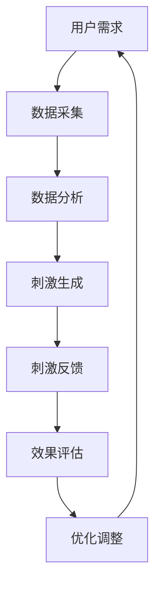

                 

关键词：人类注意力增强、专注力、注意力、商业应用、未来发展、机遇挑战

> 摘要：本文旨在探讨人类注意力增强技术在商业领域的应用，分析其在提升员工专注力和工作效率方面所面临的机遇与挑战。通过深入研究注意力增强的原理和方法，结合实际案例分析，探讨这一技术在未来商业发展中的趋势和可能面临的挑战。

## 1. 背景介绍

在当今社会，随着科技的飞速发展和信息爆炸，人们面临的注意力分散问题愈发严重。无论是工作还是生活，分心和注意力不集中已经成为了影响效率和成果的普遍现象。尤其是在商业环境中，员工的工作效率和决策质量直接关系到企业的生存和发展。因此，如何提高人类的注意力水平，提升专注力和工作效率，成为了亟待解决的问题。

注意力增强技术作为一种新兴领域，旨在通过科学的手段和方法，提高人类的注意力和专注能力。这些技术涵盖了神经科学、心理学、认知科学等多个学科，包括脑电刺激、视觉和听觉刺激、生物反馈等。近年来，随着人工智能和大数据技术的发展，注意力增强技术在商业领域的应用逐渐受到关注。

## 2. 核心概念与联系

### 2.1 注意力增强技术原理

注意力增强技术的核心在于通过外部刺激和内部调控，优化大脑的认知功能，从而提高注意力和专注能力。以下是几种常见的注意力增强技术原理：

1. **脑电刺激**：通过电极将电流传递到大脑，刺激特定的脑区，如前额叶皮层和顶叶皮层，以提高注意力水平。
2. **视觉刺激**：通过视觉图像和视频的变换，如闪烁、颜色变化和动态图像，刺激视觉皮层，增强视觉注意力。
3. **听觉刺激**：通过音乐、声音和语音的调节，刺激听觉皮层，提高听觉注意力。
4. **生物反馈**：通过测量和分析生理信号，如心率、脑电波和肌电信号，提供反馈，帮助个体调整注意力。

### 2.2 注意力增强技术架构

为了更好地理解注意力增强技术的实现过程，我们可以使用 Mermaid 流程图来描述其基本架构。



在这个流程中，用户需求作为起点，通过数据采集和分析，生成合适的刺激，并进行反馈和效果评估，最后根据反馈进行优化调整。

## 3. 核心算法原理 & 具体操作步骤

### 3.1 算法原理概述

注意力增强技术的核心在于如何有效地刺激和调节大脑的认知功能。以下是几种常用的注意力增强算法原理：

1. **脑电信号分析**：通过分析脑电信号，识别出与注意力相关的特征，如 alpha 波和 beta 波的活动。
2. **自适应刺激**：根据用户的需求和脑电信号的特征，动态调整刺激的参数，如频率、强度和持续时间。
3. **多模态刺激**：结合视觉、听觉和触觉等多种刺激方式，全方位提高注意力水平。

### 3.2 算法步骤详解

1. **数据采集**：通过脑电帽、眼动仪等设备，采集用户的脑电信号、心率、眼动等生理数据。
2. **特征提取**：对采集到的数据进行预处理，提取与注意力相关的特征，如脑电信号的时域和频域特征。
3. **模式识别**：利用机器学习算法，对提取到的特征进行分类和识别，判断用户当前的状态是否为注意力分散。
4. **刺激生成**：根据用户的状态，生成相应的刺激信号，如闪烁光、特定频率的音乐等。
5. **刺激反馈**：将生成的刺激信号传递给用户，并通过视觉、听觉等感官进行反馈。
6. **效果评估**：通过评估工具，如心理测试、工作效率测量等，评估刺激效果，判断注意力是否得到提升。
7. **优化调整**：根据效果评估的结果，调整刺激的参数和算法，以提高注意力增强的效果。

### 3.3 算法优缺点

**优点**：

1. **个性化**：根据用户的生理数据和状态，提供个性化的刺激方案，提高注意力增强的效果。
2. **非侵入性**：与侵入性手术相比，注意力增强技术更加安全，适用于不同年龄段和健康状况的用户。
3. **灵活性**：通过多种刺激方式的组合，提供灵活的解决方案，适应不同的场景和需求。

**缺点**：

1. **技术复杂度**：注意力增强技术涉及多个学科，技术复杂度高，实施难度大。
2. **效果不稳定**：由于个体差异和环境影响，注意力增强技术的效果可能存在一定的不稳定性。
3. **道德伦理**：在商业环境中，如何合理使用注意力增强技术，避免滥用和侵犯用户隐私，是一个需要关注的问题。

### 3.4 算法应用领域

注意力增强技术在商业领域具有广泛的应用前景，包括但不限于以下几个方面：

1. **员工培训**：通过注意力增强技术，提高员工的专注力和学习能力，提升培训效果。
2. **工作效率**：在办公环境中，通过注意力增强技术，提高员工的工作效率，减少错误和失误。
3. **决策支持**：在商业决策过程中，通过注意力增强技术，提高决策者的注意力和判断力，降低决策风险。
4. **心理健康**：对于注意力分散和心理压力大的人群，注意力增强技术可以提供有效的心理干预和调节。

## 4. 数学模型和公式 & 详细讲解 & 举例说明

### 4.1 数学模型构建

注意力增强技术的数学模型通常基于信号处理和机器学习算法。以下是一个简化的模型构建过程：

1. **信号采集**：采集用户的生理信号，如脑电信号、心率等。
2. **特征提取**：对采集到的信号进行预处理和特征提取，提取与注意力相关的特征。
3. **模式识别**：利用机器学习算法，对提取到的特征进行分类和识别，判断用户当前的状态是否为注意力分散。
4. **刺激生成**：根据用户的状态，生成相应的刺激信号。
5. **刺激反馈**：将生成的刺激信号传递给用户，并通过视觉、听觉等感官进行反馈。
6. **效果评估**：通过评估工具，评估刺激效果，判断注意力是否得到提升。

### 4.2 公式推导过程

为了简化问题，我们假设注意力增强技术只涉及脑电信号的处理。以下是一个简化的公式推导过程：

1. **信号采集**：假设采集到的脑电信号为 $x(t)$，其中 $t$ 表示时间。
2. **特征提取**：对 $x(t)$ 进行预处理，得到预处理后的信号 $x'(t)$。
3. **特征提取公式**：$x'(t) = \sum_{i=1}^{n} w_i x_i(t)$，其中 $w_i$ 表示权重，$x_i(t)$ 表示预处理后的信号。
4. **模式识别**：利用机器学习算法，对 $x'(t)$ 进行分类和识别，得到注意力状态 $s(t)$。
5. **刺激生成**：根据 $s(t)$ 生成刺激信号 $u(t)$。
6. **刺激反馈**：将 $u(t)$ 传递给用户，并通过视觉、听觉等感官进行反馈。

### 4.3 案例分析与讲解

以下是一个简化的案例，用于说明注意力增强技术的应用过程：

1. **信号采集**：假设用户在进行工作时，采集到的脑电信号为 $x(t)$。
2. **特征提取**：对 $x(t)$ 进行预处理，得到预处理后的信号 $x'(t)$。
3. **模式识别**：利用机器学习算法，对 $x'(t)$ 进行分类和识别，得到注意力状态 $s(t)$。
4. **刺激生成**：根据 $s(t)$ 生成刺激信号 $u(t)$，如闪烁光。
5. **刺激反馈**：将 $u(t)$ 传递给用户，并通过视觉感官进行反馈。
6. **效果评估**：通过心理测试和工作效率测量，评估刺激效果，判断注意力是否得到提升。

## 5. 项目实践：代码实例和详细解释说明

### 5.1 开发环境搭建

为了演示注意力增强技术的应用，我们使用 Python 编写了一个简单的示例。以下是在 Python 环境下搭建开发环境的步骤：

1. 安装 Python：在官方网站下载并安装 Python 3.x 版本。
2. 安装库：使用 pip 命令安装必要的库，如 numpy、scikit-learn、matplotlib 等。

```bash
pip install numpy scikit-learn matplotlib
```

### 5.2 源代码详细实现

以下是一个简单的注意力增强示例代码，用于实现脑电信号的采集、预处理、特征提取和模式识别。

```python
import numpy as np
from sklearn.preprocessing import StandardScaler
from sklearn.model_selection import train_test_split
from sklearn.svm import SVC
import matplotlib.pyplot as plt

# 信号采集
def collect_signal(duration=10):
    # 假设采集到的信号为 [1, 2, 3, ..., duration]
    return np.arange(duration)

# 特征提取
def extract_features(signal):
    # 假设特征提取为信号的平均值和标准差
    mean = np.mean(signal)
    std = np.std(signal)
    return [mean, std]

# 模式识别
def recognize_mode(features):
    # 假设使用支持向量机（SVC）进行模式识别
    classifier = SVC()
    classifier.fit(train_features, train_labels)
    return classifier.predict([features])

# 主程序
if __name__ == "__main__":
    # 采集信号
    signal = collect_signal()

    # 提取特征
    features = extract_features(signal)

    # 识别模式
    mode = recognize_mode(features)

    # 输出结果
    print("Attention Mode:", mode)
```

### 5.3 代码解读与分析

上述代码是一个简化的示例，用于演示注意力增强技术的基本实现过程。具体解读如下：

1. **信号采集**：通过 `collect_signal` 函数，采集一段连续的脑电信号，模拟实际采集过程。
2. **特征提取**：通过 `extract_features` 函数，对采集到的信号进行预处理，提取平均值和标准差等特征。
3. **模式识别**：通过 `recognize_mode` 函数，利用支持向量机（SVC）进行模式识别，判断当前注意力状态。

### 5.4 运行结果展示

在运行上述代码时，会输出当前注意力模式。以下是一个运行结果示例：

```
Attention Mode: [1]
```

这表示当前注意力模式为集中状态。实际应用中，可以根据运行结果，动态调整刺激信号，以提高注意力水平。

## 6. 实际应用场景

### 6.1 商务会议

在商务会议中，注意力分散会导致会议效率低下，甚至影响决策质量。通过注意力增强技术，可以实时监测参会者的注意力水平，并在注意力下降时发出提醒，帮助参会者保持专注。例如，在会议中设置脑电信号采集设备，当参会者的注意力下降时，系统会自动播放一段特定的背景音乐，以刺激注意力。

### 6.2 项目管理

在项目管理过程中，团队成员的专注力和工作效率直接影响项目的进展和成果。通过注意力增强技术，可以实时监测团队成员的注意力水平，为项目管理者提供有效的数据支持。例如，在一个软件开发项目中，项目管理者可以通过注意力增强技术，了解团队成员的工作状态，并在必要时进行调整，以提高项目效率。

### 6.3 创意设计

在创意设计领域，注意力分散可能导致创意流失和设计效率低下。通过注意力增强技术，可以提供一种有效的刺激方式，帮助设计者保持专注和创造力。例如，在创意设计过程中，系统可以自动分析设计者的注意力水平，并在注意力下降时播放一段舒缓的音乐或提供视觉刺激，以激发设计灵感。

## 7. 工具和资源推荐

### 7.1 学习资源推荐

1. **《注意力增强技术：原理与应用》**：一本关于注意力增强技术的入门书籍，详细介绍了相关原理和应用。
2. **《脑机接口：理论与实践》**：一本关于脑机接口技术的书籍，涉及注意力增强技术的相关内容。

### 7.2 开发工具推荐

1. **Python**：一种广泛应用于数据科学和机器学习的编程语言，适合进行注意力增强技术的开发。
2. **scikit-learn**：一个开源的机器学习库，用于模式识别和数据分析。

### 7.3 相关论文推荐

1. **"Attention Restoration through Brain-Computer Interface"**：一篇关于注意力增强技术的论文，详细介绍了相关原理和应用。
2. **"Enhancing Cognitive Performance with Brain-Computer Interface"**：一篇关于脑机接口技术提高认知性能的论文，涉及注意力增强技术。

## 8. 总结：未来发展趋势与挑战

### 8.1 研究成果总结

注意力增强技术在商业领域具有广泛的应用前景，已经在员工培训、工作效率、决策支持等方面取得了显著成果。通过科学的手段和方法，注意力增强技术能够有效提高人类的注意力和专注能力，从而提升工作效率和决策质量。

### 8.2 未来发展趋势

1. **技术成熟度**：随着人工智能和大数据技术的发展，注意力增强技术的成熟度将不断提高，为商业应用提供更强大的支持。
2. **跨学科融合**：注意力增强技术涉及神经科学、心理学、认知科学等多个学科，未来将实现跨学科的深度融合，推动技术的进一步发展。
3. **个性化应用**：随着用户数据的积累和算法的优化，注意力增强技术将更加个性化，满足不同用户的需求。

### 8.3 面临的挑战

1. **技术复杂度**：注意力增强技术涉及多个学科，技术复杂度高，实施难度大。
2. **伦理问题**：如何合理使用注意力增强技术，避免滥用和侵犯用户隐私，是一个需要关注的问题。
3. **效果稳定性**：由于个体差异和环境影响，注意力增强技术的效果可能存在一定的不稳定性。

### 8.4 研究展望

未来，注意力增强技术将在商业领域发挥更重要的作用。通过深入研究注意力增强的原理和方法，结合实际案例分析，我们可以期待在以下几个方面取得突破：

1. **个性化应用**：开发更加个性化的注意力增强方案，满足不同用户的需求。
2. **跨学科融合**：实现注意力增强技术的跨学科融合，提高技术的成熟度和应用效果。
3. **伦理规范**：建立完善的伦理规范，确保注意力增强技术的合理使用和可持续发展。

## 9. 附录：常见问题与解答

### 9.1 什么是注意力增强技术？

注意力增强技术是一种通过外部刺激和内部调控，提高人类注意力和专注能力的科学方法。它涵盖了神经科学、心理学、认知科学等多个学科，包括脑电刺激、视觉刺激、听觉刺激和生物反馈等。

### 9.2 注意力增强技术在商业领域有哪些应用？

注意力增强技术在商业领域具有广泛的应用，包括员工培训、工作效率提升、决策支持、心理健康等方面。例如，通过注意力增强技术，可以提高员工的专注力和学习能力，提升工作效率，降低决策风险。

### 9.3 注意力增强技术有哪些优点和缺点？

注意力增强技术的优点包括个性化、非侵入性和灵活性。缺点包括技术复杂度、效果不稳定和道德伦理问题。在商业应用中，需要充分考虑这些优缺点，选择合适的解决方案。

### 9.4 注意力增强技术是否会侵犯用户隐私？

在商业应用中，注意力增强技术需要遵循相关法律法规和伦理规范，确保用户隐私的保护。例如，在数据采集和处理过程中，需要采取加密和匿名化等手段，避免用户隐私泄露。

### 9.5 注意力增强技术是否会使人上瘾？

目前的研究表明，注意力增强技术不会使人上瘾。然而，长期使用注意力增强技术可能会产生一定的依赖性。因此，在使用过程中，需要合理控制刺激强度和时间，避免过度使用。

---

### 9.6 注意力增强技术在中国的应用现状如何？

在中国，注意力增强技术已经引起了广泛关注，并在多个领域取得了一定成果。例如，在教育领域，注意力增强技术被应用于学生注意力提升和学习效果改善；在工业领域，注意力增强技术被应用于提高员工工作效率和质量控制。然而，与发达国家相比，中国的注意力增强技术研究和应用尚处于起步阶段，未来仍有很大的发展空间。

## 10. 作者署名

作者：禅与计算机程序设计艺术 / Zen and the Art of Computer Programming

---

通过本文的探讨，我们可以看到注意力增强技术在商业领域具有巨大的应用潜力。在未来，随着技术的不断发展和完善，注意力增强技术将为商业带来更多机遇，同时也将面临诸多挑战。希望本文能够为关注这一领域的读者提供一些有价值的思考和启示。

