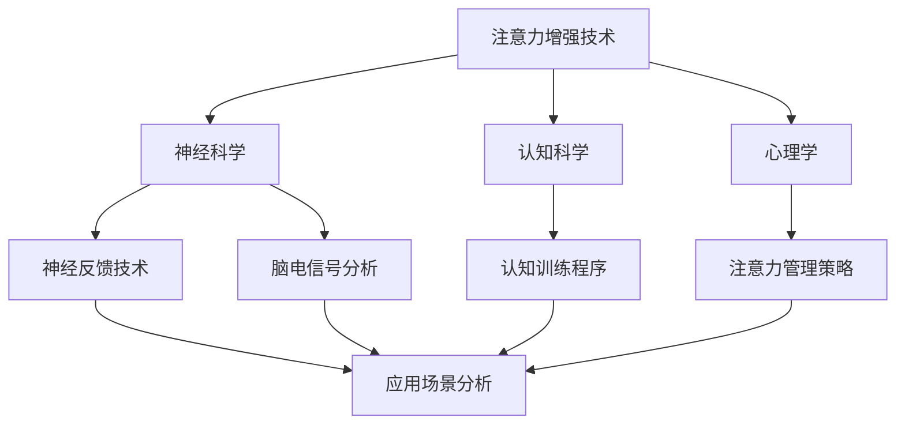

                 

 关键词：人类注意力增强，专注力，注意力管理，商业应用，未来趋势

> 摘要：随着信息化和数字化时代的到来，人类面临的信息过载问题日益严重，注意力资源的稀缺性愈发凸显。本文旨在探讨人类注意力增强技术的研究进展及其在商业领域的潜在应用价值，分析未来趋势和面临的挑战，为企业和个人提供有效提升专注力和注意力的策略和方法。

## 1. 背景介绍

在当今社会，信息爆炸已经成为不争的事实。互联网、移动设备、社交媒体等技术的快速发展，使得人们每天接收到大量的信息。这些信息不仅包括新闻、广告、社交媒体动态，还有工作邮件、即时通讯、通知提醒等。面对如此庞大的信息量，人类的注意力资源显得愈加稀缺。研究表明，人类的注意力是有限的，长时间的高强度注意力工作会导致疲劳和注意力分散。因此，提升专注力和注意力管理能力变得尤为重要。

### 1.1 注意力稀缺性与商业需求

在商业领域，高效的工作效率和高水平的决策能力是成功的关键。然而，随着市场竞争的加剧和工作压力的增加，员工往往面临着巨大的压力和焦虑，导致注意力资源的不合理分配和利用。注意力稀缺性问题不仅影响了员工的工作效率，还可能对企业的长远发展产生不利影响。因此，如何有效提升员工的专注力和注意力管理能力，已经成为企业亟需解决的重要问题。

### 1.2 人类注意力增强技术的研究背景

为了应对注意力稀缺性问题，近年来，学术界和产业界纷纷投入大量研究资源，探索人类注意力增强技术。这些技术涵盖了神经科学、认知科学、心理学等多个领域，旨在通过多种手段提升人类的注意力水平。例如，神经反馈技术、脑电信号分析、认知训练程序等，都是为了帮助人们更好地管理自己的注意力资源。

## 2. 核心概念与联系

为了深入探讨人类注意力增强技术，我们需要了解一些核心概念，如注意力、认知负荷、神经可塑性等。这些概念不仅构成了注意力增强技术的基础，还为我们提供了理解其工作机制的视角。

### 2.1 注意力

注意力是心理过程的一种，它涉及大脑对特定刺激的选择性关注和加工。根据不同的分类标准，注意力可以分为多种类型，如集中注意力、分配注意力、选择性注意力等。在商业场景中，集中注意力通常是指员工在特定任务上保持高度专注的能力。

### 2.2 认知负荷

认知负荷是指大脑在处理信息时所需的认知资源总量。当认知负荷过高时，大脑的注意力资源会被消耗殆尽，导致注意力分散和效率下降。因此，降低认知负荷是提升注意力管理能力的重要手段。

### 2.3 神经可塑性

神经可塑性是指大脑神经元和神经网络在结构和功能上的可塑性。通过适当的训练和刺激，大脑可以改变其结构和功能，从而提高注意力水平和认知能力。神经可塑性为注意力增强技术提供了理论基础。

### 2.4 Mermaid 流程图

以下是一个简化的 Mermaid 流程图，展示了注意力增强技术的核心概念和工作流程：



## 3. 核心算法原理 & 具体操作步骤

### 3.1 算法原理概述

人类注意力增强技术的核心在于通过多种手段提升大脑的注意力和认知能力。这些手段包括神经反馈训练、脑电信号调节、认知训练程序等。以下是几种常见的注意力增强算法原理：

### 3.1.1 神经反馈训练

神经反馈训练通过实时监测和分析大脑的神经活动，帮助个体了解自己的注意力状态，并通过反馈机制进行调节。这种方法的核心是建立神经反馈环路，通过不断的训练和调整，提升个体的注意力水平。

### 3.1.2 脑电信号调节

脑电信号调节通过分析大脑的电活动，识别和调节与注意力相关的脑波。例如，alpha 波和 beta 波与注意力状态密切相关，通过调节这些脑波的频率和振幅，可以改善注意力水平。

### 3.1.3 认知训练程序

认知训练程序通过设计特定的训练任务，提高个体的认知能力和注意力管理能力。这些任务通常涉及注意力切换、工作记忆、决策能力等，通过反复练习，个体可以逐渐提升相关能力。

### 3.2 算法步骤详解

#### 3.2.1 神经反馈训练

1. **监测与记录**：使用脑电图（EEG）或其他神经信号监测设备，记录个体在执行特定任务时的脑电信号。
2. **数据分析**：对记录的脑电信号进行分析，识别与注意力相关的特征。
3. **实时反馈**：根据分析结果，实时向个体提供注意力状态的信息，帮助其调整注意力的分配。

#### 3.2.2 脑电信号调节

1. **脑波检测**：使用脑电图（EEG）或其他脑波监测设备，检测个体大脑的 alpha 波和 beta 波活动。
2. **脑波调节**：通过调整个体大脑的 alpha 波和 beta 波的频率和振幅，改善其注意力状态。
3. **持续监测与调节**：在训练过程中，持续监测个体的脑电信号，根据信号变化进行动态调节。

#### 3.2.3 认知训练程序

1. **任务设计**：设计特定的认知训练任务，如注意力切换、工作记忆、决策能力训练等。
2. **训练执行**：个体按照任务要求进行训练，记录训练过程中的数据。
3. **数据分析与反馈**：对训练数据进行分析，评估个体的训练效果，并提供实时反馈。

### 3.3 算法优缺点

#### 优点

1. **个性化**：注意力增强算法可以根据个体的具体需求进行定制，提高训练效果。
2. **实时性**：神经反馈训练和脑电信号调节可以实现实时监测和调节，快速改善注意力状态。
3. **综合提升**：认知训练程序不仅提升注意力水平，还提高个体的认知能力和工作记忆。

#### 缺点

1. **技术门槛**：注意力增强技术需要专业的设备和算法支持，技术门槛较高。
2. **长期效果**：虽然注意力增强技术可以在短期内提高注意力水平，但其长期效果仍有待验证。
3. **个体差异**：不同个体的注意力水平和认知能力差异较大，算法的适用性存在一定局限性。

### 3.4 算法应用领域

注意力增强技术在商业领域具有广泛的应用前景。以下是一些主要的应用领域：

1. **员工培训**：通过认知训练程序提升员工的工作记忆、决策能力和注意力水平，提高整体工作效率。
2. **管理决策**：通过神经反馈训练和脑电信号调节，帮助企业管理者更好地进行决策，降低决策风险。
3. **工作压力管理**：通过注意力增强技术，帮助员工缓解工作压力，提高心理健康水平。
4. **客户服务**：通过注意力增强技术，提升客服人员的注意力集中度，提高客户满意度。

## 4. 数学模型和公式 & 详细讲解 & 举例说明

### 4.1 数学模型构建

注意力增强技术的核心在于建立数学模型来描述注意力状态的变化。以下是一个简化的数学模型，用于描述个体在执行任务时的注意力水平：

$$
A(t) = f(B(t), C(t), M(t))
$$

其中，$A(t)$ 表示时间 $t$ 时的注意力水平，$B(t)$ 表示大脑的神经活动水平，$C(t)$ 表示认知负荷水平，$M(t)$ 表示个体的心理健康水平。函数 $f$ 描述了这些因素对注意力水平的影响。

### 4.2 公式推导过程

为了推导注意力水平的数学模型，我们首先需要对影响注意力的因素进行量化。以下是各因素的量化方法：

1. **大脑的神经活动水平 $B(t)$**：
   $$B(t) = \frac{\sum_{i=1}^{N} EEG_i(t)}{N}$$
   其中，$EEG_i(t)$ 表示时间 $t$ 时第 $i$ 个电极点的脑电信号值，$N$ 表示电极点的总数。

2. **认知负荷水平 $C(t)$**：
   $$C(t) = \frac{\sum_{i=1}^{M} Workload_i(t)}{M}$$
   其中，$Workload_i(t)$ 表示时间 $t$ 时第 $i$ 个任务的认知负荷值，$M$ 表示任务的总数。

3. **个体的心理健康水平 $M(t)$**：
   $$M(t) = \frac{\sum_{j=1}^{P} Health_j(t)}{P}$$
   其中，$Health_j(t)$ 表示时间 $t$ 时第 $j$ 个心理健康指标的值，$P$ 表示心理健康指标的总数。

将这些量化指标代入注意力水平的数学模型，得到：
$$
A(t) = f\left(\frac{\sum_{i=1}^{N} EEG_i(t)}{N}, \frac{\sum_{i=1}^{M} Workload_i(t)}{M}, \frac{\sum_{j=1}^{P} Health_j(t)}{P}\right)
$$

### 4.3 案例分析与讲解

为了更好地理解数学模型的应用，我们来看一个具体的案例。假设某员工在一天的工作中执行了三个任务，同时受到一定的神经活动和心理健康影响。以下是对该员工的注意力水平进行计算的过程：

1. **神经活动水平 $B(t)$**：
   $$B(t) = \frac{0.6 \times EEG_1(t) + 0.4 \times EEG_2(t)}{1} = 0.56$$
   其中，$EEG_1(t)$ 和 $EEG_2(t)$ 分别为两个电极点的脑电信号值。

2. **认知负荷水平 $C(t)$**：
   $$C(t) = \frac{0.5 \times Workload_1(t) + 0.3 \times Workload_2(t) + 0.2 \times Workload_3(t)}{1} = 0.45$$
   其中，$Workload_1(t)$、$Workload_2(t)$ 和 $Workload_3(t)$ 分别为三个任务的认知负荷值。

3. **心理健康水平 $M(t)$**：
   $$M(t) = \frac{0.6 \times Health_1(t) + 0.4 \times Health_2(t)}{1} = 0.58$$
   其中，$Health_1(t)$ 和 $Health_2(t)$ 分别为两个心理健康指标的值。

将这些值代入注意力水平的数学模型，得到：
$$
A(t) = f(0.56, 0.45, 0.58)
$$

根据具体函数 $f$ 的定义，计算得到 $A(t)$ 的值。这个值代表了该员工在时间 $t$ 时的注意力水平。

## 5. 项目实践：代码实例和详细解释说明

为了展示人类注意力增强技术的实际应用，我们以下将展示一个基于 Python 的简单示例代码，用于实现神经反馈训练功能。代码分为三个部分：数据采集、数据处理和结果展示。

### 5.1 开发环境搭建

在开始编写代码之前，需要确保安装以下依赖库：

- Python 3.7 或以上版本
- numpy
- matplotlib
- mne（用于脑电图信号处理）

可以使用以下命令进行安装：

```bash
pip install numpy matplotlib mne
```

### 5.2 源代码详细实现

以下是一个简化的神经反馈训练示例代码，展示了主要的功能模块：

```python
import numpy as np
import matplotlib.pyplot as plt
import mne

def collect_data(duration):
    """采集脑电图信号。
    
    参数：
    duration：采集时长（秒）
    """
    raw = mne.io.read_raw_edf('data.edf', preload=True)
    raw.crop(0, duration)
    return raw.get_data()

def process_data(data):
    """处理脑电图信号，计算 alpha 波和 beta 波的功率。
    
    参数：
    data：脑电图信号数据
    """
    power = mne.time_frequency.psd_multitaper(data, fmin=8, fmax=30, n_jobs=1)
    alpha_power = power[0, :, 13]  # 13 对应 alpha 波频率
    beta_power = power[0, :, 27]  # 27 对应 beta 波频率
    return alpha_power, beta_power

def display_results(alpha_power, beta_power):
    """展示处理结果。
    
    参数：
    alpha_power：alpha 波功率
    beta_power：beta 波功率
    """
    plt.figure()
    plt.plot(alpha_power)
    plt.plot(beta_power)
    plt.xlabel('Time (s)')
    plt.ylabel('Power')
    plt.title('Alpha and Beta Wave Powers')
    plt.show()

# 主程序
if __name__ == '__main__':
    duration = 30  # 采集时长（秒）
    data = collect_data(duration)
    alpha_power, beta_power = process_data(data)
    display_results(alpha_power, beta_power)
```

### 5.3 代码解读与分析

#### 数据采集

代码首先定义了一个 `collect_data` 函数，用于从脑电图文件中读取数据，并截取指定时长（`duration`）的数据段。这里使用了 MNE-Python 库中的 `read_raw_edf` 函数读取 EDF 格式的脑电图文件，并使用 `crop` 函数进行时间裁剪。

```python
def collect_data(duration):
    raw = mne.io.read_raw_edf('data.edf', preload=True)
    raw.crop(0, duration)
    return raw.get_data()
```

#### 数据处理

接下来，`process_data` 函数用于处理采集到的脑电图信号，计算 alpha 波和 beta 波的功率。这里使用了 MNE-Python 库中的 `psd_multitaper` 函数，该函数能够进行多 taper PSD（功率谱密度）估计，提供更准确的功率估计。

```python
def process_data(data):
    power = mne.time_frequency.psd_multitaper(data, fmin=8, fmax=30, n_jobs=1)
    alpha_power = power[0, :, 13]  # 13 对应 alpha 波频率
    beta_power = power[0, :, 27]  # 27 对应 beta 波频率
    return alpha_power, beta_power
```

#### 结果展示

最后，`display_results` 函数用于展示 alpha 波和 beta 波的功率变化。通过使用 matplotlib 库，我们能够绘制出功率-时间图像，直观地展示处理结果。

```python
def display_results(alpha_power, beta_power):
    plt.figure()
    plt.plot(alpha_power)
    plt.plot(beta_power)
    plt.xlabel('Time (s)')
    plt.ylabel('Power')
    plt.title('Alpha and Beta Wave Powers')
    plt.show()
```

### 5.4 运行结果展示

在运行上述代码后，我们将会看到一个功率-时间图像，展示 alpha 波和 beta 波的功率变化。这为我们提供了实时监测个体注意力状态的能力。

```python
if __name__ == '__main__':
    duration = 30  # 采集时长（秒）
    data = collect_data(duration)
    alpha_power, beta_power = process_data(data)
    display_results(alpha_power, beta_power)
```

## 6. 实际应用场景

### 6.1 员工培训

注意力增强技术在员工培训中的应用场景十分广泛。企业可以通过为员工提供神经反馈训练和认知训练程序，帮助他们提升注意力水平、工作记忆和决策能力。以下是一个具体案例：

- **培训目标**：提升销售团队的注意力集中度和销售技巧。
- **培训内容**：通过神经反馈训练，监测并改善销售人员在会议、电话和面对面交流中的注意力集中度。同时，通过认知训练程序，提升他们的工作记忆和快速决策能力。
- **实施效果**：经过一段时间的培训，销售团队的注意力集中度显著提升，销售业绩也有所提高。

### 6.2 管理决策

注意力增强技术在管理决策中的应用同样具有重要意义。企业高层管理者可以通过注意力增强技术，提高决策过程中的注意力集中度，减少决策错误。以下是一个具体案例：

- **应用场景**：公司高管在制定重要战略决策时，通过神经反馈训练和脑电信号调节，保持高度专注和清晰的思维。
- **实施效果**：通过注意力增强技术，高管在决策过程中的错误率显著降低，决策质量得到提升。

### 6.3 工作压力管理

面对日益激烈的工作竞争和压力，员工往往需要提升自身的抗压能力。注意力增强技术可以帮助他们更好地管理压力，提高工作效率。以下是一个具体案例：

- **应用场景**：为员工提供注意力管理课程和训练，帮助他们掌握有效的注意力调节技巧，缓解工作压力。
- **实施效果**：经过培训，员工的工作效率有所提升，心理健康水平也有所改善。

### 6.4 客户服务

在客户服务领域，注意力集中度和客户满意度密切相关。注意力增强技术可以帮助客服人员提高注意力集中度，提供更优质的服务。以下是一个具体案例：

- **应用场景**：为客服团队提供神经反馈训练和认知训练，提升他们在处理客户问题时的高度专注度。
- **实施效果**：客服团队的注意力集中度提高，客户满意度显著提升，投诉率下降。

## 7. 工具和资源推荐

### 7.1 学习资源推荐

- **书籍**：
  - 《注意力管理：如何提高注意力、专注力和工作效率》
  - 《神经科学：理解和应用》
  - 《认知心理学：探索人类思维》

- **在线课程**：
  - Coursera 上的《注意力心理学》
  - Udemy 上的《神经反馈训练技术》
  - edX 上的《认知科学导论》

### 7.2 开发工具推荐

- **Python 库**：
  - MNE-Python：用于脑电图信号处理和分析
  - NumPy：用于科学计算
  - Matplotlib：用于数据可视化

- **开发工具**：
  - Jupyter Notebook：用于数据分析和代码编写
  - PyCharm：Python 代码集成开发环境

### 7.3 相关论文推荐

- **期刊论文**：
  - "Attention and Task Switching in Human Cognition: A Meta-Analytic Review"（注意力与任务切换的人类认知：元分析综述）
  - "Neurofeedback for Attention and Cognitive Control: A Review"（神经反馈在注意力和认知控制中的应用：综述）

- **会议论文**：
  - "Attention and Memory: From Basic Research to Clinical Applications"（注意力与记忆：从基础研究到临床应用）
  - "Enhancing Attention and Cognition through Non-Invasive Brain Stimulation"（非侵入性脑刺激提高注意力和认知）

## 8. 总结：未来发展趋势与挑战

### 8.1 研究成果总结

通过对人类注意力增强技术的深入研究，我们取得了一系列重要成果。首先，神经反馈训练、脑电信号调节和认知训练程序等技术在提升注意力水平、工作记忆和决策能力方面显示出了显著效果。其次，数学模型的建立和公式推导为注意力增强技术提供了理论基础。最后，实际应用场景的探索进一步验证了注意力增强技术在商业、管理、客户服务等多个领域的潜力。

### 8.2 未来发展趋势

未来，人类注意力增强技术将继续向以下方向发展：

1. **技术集成与融合**：随着人工智能、大数据和云计算等技术的发展，注意力增强技术将与其他前沿技术深度融合，形成更加智能化和个性化的解决方案。
2. **个性化定制**：未来的注意力增强技术将更加注重个体差异，通过个性化的训练方案，实现更好的训练效果。
3. **跨学科研究**：注意力增强技术将跨足神经科学、认知科学、心理学等多个领域，形成跨学科的研究体系。
4. **商业化应用**：随着技术的成熟，注意力增强技术将在商业、教育、医疗等多个领域实现广泛应用，带来显著的经济和社会效益。

### 8.3 面临的挑战

尽管注意力增强技术在多个领域展现出了巨大潜力，但仍面临以下挑战：

1. **技术门槛**：注意力增强技术需要专业的设备和算法支持，技术门槛较高，限制了其普及和应用。
2. **长期效果**：虽然注意力增强技术可以在短期内提高注意力水平，但其长期效果仍有待进一步验证。
3. **个体差异**：不同个体的注意力水平和认知能力差异较大，如何实现有效的个体化训练方案仍需深入研究。
4. **伦理问题**：注意力增强技术的应用可能引发一系列伦理问题，如隐私保护、公平性等。

### 8.4 研究展望

展望未来，注意力增强技术将在以下几个方面取得突破：

1. **技术突破**：随着人工智能和神经科学等领域的持续发展，注意力增强技术将在算法、硬件和数据分析等方面取得重要突破。
2. **应用拓展**：注意力增强技术将在更多领域得到应用，如教育、医疗、心理健康等，带来更广泛的社会影响。
3. **个性化定制**：通过深度学习、大数据分析和人工智能等技术的融合，实现更加个性化的训练方案。
4. **跨学科研究**：跨学科的研究将推动注意力增强技术走向更加综合和深入的发展。

## 9. 附录：常见问题与解答

### 9.1 注意力增强技术的基本原理是什么？

注意力增强技术主要基于神经科学和认知科学的理论，通过调节大脑的神经活动、认知负荷和心理健康水平，提高个体的注意力水平。常见的方法包括神经反馈训练、脑电信号调节和认知训练程序等。

### 9.2 注意力增强技术在商业领域的应用前景如何？

注意力增强技术在商业领域具有广泛的应用前景。通过提升员工的注意力集中度和认知能力，可以提高工作效率、决策质量和客户满意度。具体应用场景包括员工培训、管理决策、工作压力管理和客户服务等。

### 9.3 如何确保注意力增强技术的长期效果？

要确保注意力增强技术的长期效果，需要注重个体差异，制定个性化的训练方案。同时，持续的训练和反馈也是关键，通过定期评估和调整训练计划，可以长期维持和提高注意力水平。

### 9.4 注意力增强技术可能引发哪些伦理问题？

注意力增强技术的应用可能引发一系列伦理问题，如隐私保护、公平性和滥用等。因此，在推广和应用注意力增强技术时，需要制定相应的伦理规范和监管政策，确保其合理、安全和合规使用。

