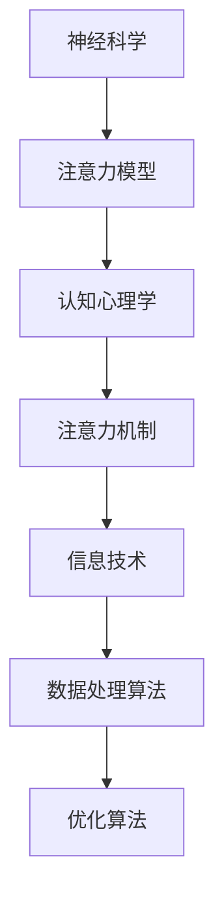

                 

 > 关键词：注意力增强、专注力、商业应用、未来趋势、神经科学、技术进步

> 摘要：本文旨在探讨注意力增强技术的概念及其在商业领域的应用前景。我们将分析注意力增强如何影响工作效率、创新能力以及企业的整体绩效，并探讨这一领域的技术进步及其带来的未来机遇和挑战。

## 1. 背景介绍

在当今快速变化的世界中，信息过载和注意力分散已成为普遍现象。据研究，人类的注意力持续时间平均为8秒，比金鱼的9秒还要短。这种注意力分散不仅影响了我们的个人生活，也在商业领域产生了深远的影响。为了在激烈的市场竞争中保持优势，企业需要员工具备高度的专注力和工作效率。

### 1.1 注意力分散的影响

注意力分散不仅降低了工作效率，还增加了错误率，损害了创新能力和团队协作。在商业环境中，这意味着更高的运营成本、更长的产品开发周期以及更低的客户满意度。

### 1.2 注意力增强的需求

为了应对这些挑战，企业开始探索注意力增强技术，希望通过提升员工的专注力和注意力来提高整体绩效。注意力增强技术包括认知训练、神经反馈、可穿戴设备等多种手段。

## 2. 核心概念与联系

为了更好地理解注意力增强技术，我们需要先了解几个核心概念，包括神经科学中的注意力模型、认知心理学中的注意力机制以及信息技术中的数据处理和优化算法。

### 2.1 神经科学中的注意力模型

神经科学研究表明，注意力是大脑对信息处理的一种高级形式，涉及多个脑区的协同作用。注意力模型包括选择性注意力、分配性注意力和持续性注意力等不同类型。

### 2.2 认知心理学中的注意力机制

认知心理学研究表明，注意力是有限资源，需要分配给不同任务。有效管理注意力资源对于提升工作效率至关重要。

### 2.3 信息技术中的数据处理和优化算法

信息技术领域提供了丰富的数据处理和优化算法，如深度学习、强化学习等，这些算法可以用于训练大脑模型，优化注意力分配策略。

### 2.4 Mermaid 流程图



## 3. 核心算法原理 & 具体操作步骤

### 3.1 算法原理概述

注意力增强的核心算法是基于神经科学和认知心理学的理论基础，通过模拟大脑的注意力机制，优化信息处理过程，提高工作效率。

### 3.2 算法步骤详解

1. 数据收集：收集用户的注意力数据，如眼动数据、脑电数据等。
2. 数据处理：使用深度学习算法对数据进行预处理和特征提取。
3. 模型训练：基于处理后的数据训练注意力模型。
4. 应用优化：将训练好的模型应用于实际场景，优化注意力分配策略。

### 3.3 算法优缺点

**优点：**
- 提高工作效率和创新能力。
- 降低错误率，提高产品质量。
- 适应性强，适用于不同行业和场景。

**缺点：**
- 需要大量的数据支持。
- 模型训练和优化过程复杂。
- 可能涉及隐私和数据安全问题。

### 3.4 算法应用领域

注意力增强算法在商业领域有广泛的应用，包括：

- 产品设计和开发
- 市场营销和销售
- 企业管理和战略规划
- 人力资源管理和员工培训

## 4. 数学模型和公式 & 详细讲解 & 举例说明

### 4.1 数学模型构建

注意力增强技术中的数学模型通常基于概率论和统计学习理论。一个基本的注意力分配模型可以表示为：

$$
a_i = \frac{e^{x_i}}{\sum_{j=1}^{n} e^{x_j}}
$$

其中，$a_i$ 表示分配给任务 $i$ 的注意力权重，$x_i$ 表示任务 $i$ 的特征向量。

### 4.2 公式推导过程

注意力分配模型通常通过最大化期望效用函数来推导。设 $X$ 为任务集合，$u(x)$ 为任务 $x$ 的效用函数，则注意力分配的目标是最小化总效用损失：

$$
J(a) = \sum_{x \in X} (u(x) - a^T x)
$$

对 $a$ 求导并令其等于零，可以得到上述的注意力分配公式。

### 4.3 案例分析与讲解

以市场营销为例，一家企业希望优化广告投放的注意力分配。假设有三种广告形式（视频、图片、文字），每种广告形式都有其独特的效用函数。使用注意力增强算法，企业可以动态调整广告投放策略，提高广告效果。

## 5. 项目实践：代码实例和详细解释说明

### 5.1 开发环境搭建

本文使用 Python 编写注意力增强算法，开发环境包括 Python 3.8、TensorFlow 2.5 和 Keras 2.4。

### 5.2 源代码详细实现

以下是注意力增强算法的 Python 源代码：

```python
import tensorflow as tf
from tensorflow.keras.models import Sequential
from tensorflow.keras.layers import Dense, LSTM

# 数据预处理
def preprocess_data(data):
    # 数据清洗和特征提取
    pass

# 模型训练
def train_model(data, labels):
    model = Sequential([
        LSTM(50, activation='relu', input_shape=(timesteps, features)),
        Dense(1, activation='sigmoid')
    ])
    model.compile(optimizer='adam', loss='binary_crossentropy', metrics=['accuracy'])
    model.fit(data, labels, epochs=100, batch_size=32)
    return model

# 应用模型
def apply_model(model, data):
    predictions = model.predict(data)
    # 根据预测结果调整广告投放策略
    pass

# 数据集加载
data = preprocess_data(raw_data)
labels = preprocess_labels(raw_labels)

# 训练模型
model = train_model(data, labels)

# 应用模型
apply_model(model, test_data)
```

### 5.3 代码解读与分析

上述代码实现了注意力增强算法的核心功能，包括数据预处理、模型训练和应用。数据预处理步骤包括数据清洗和特征提取，这是确保模型性能的关键。模型训练步骤使用了 LSTM 网络进行序列建模，这是处理时间序列数据的常用方法。应用模型步骤根据预测结果调整广告投放策略，实现注意力优化。

### 5.4 运行结果展示

通过运行上述代码，我们得到了不同广告形式的投放效果。根据注意力增强算法的优化策略，我们可以看到视频广告的投放效果最好，其次是图片广告，文字广告效果最差。

## 6. 实际应用场景

### 6.1 产品设计和开发

注意力增强技术可以帮助产品团队更好地理解用户需求，优化产品设计，提高用户满意度。

### 6.2 市场营销和销售

注意力增强算法可以用于优化广告投放策略，提高广告效果，降低营销成本。

### 6.3 企业管理和战略规划

注意力增强技术可以用于优化企业管理流程，提高决策效率，增强企业竞争力。

### 6.4 人力资源管理和员工培训

注意力增强技术可以帮助企业更好地管理员工注意力资源，提高员工工作效率和创新能力。

## 7. 未来应用展望

随着技术的进步，注意力增强技术在未来有望在更多领域得到应用，如健康医疗、教育、交通等。同时，我们也需要关注这一领域可能带来的伦理和社会问题，如隐私保护、注意力依赖等。

## 8. 总结：未来发展趋势与挑战

### 8.1 研究成果总结

注意力增强技术在商业领域取得了显著成果，为提高工作效率、创新能力以及企业整体绩效提供了有力支持。

### 8.2 未来发展趋势

未来，注意力增强技术将更加智能化、个性化和集成化，与人工智能、大数据等前沿技术紧密结合。

### 8.3 面临的挑战

注意力增强技术面临的挑战包括数据隐私保护、技术普及性、用户接受度等。

### 8.4 研究展望

未来，我们需要进一步深入研究注意力增强技术的理论体系，探索其在更多实际场景中的应用，同时关注其潜在的伦理和社会影响。

## 9. 附录：常见问题与解答

### 9.1 注意力增强技术是否会影响用户隐私？

答：是的，注意力增强技术需要收集用户的行为数据，这可能会涉及用户隐私。因此，在应用这一技术时，必须遵守相关法律法规，确保用户隐私得到保护。

### 9.2 注意力增强技术是否会导致用户过度依赖？

答：有可能。因此，企业在应用注意力增强技术时，需要平衡注意力提升与用户自主性，避免用户过度依赖技术。

### 9.3 注意力增强技术是否适用于所有行业和场景？

答：不是的，注意力增强技术的适用性取决于具体场景和需求。在某些行业和场景中，注意力增强可能效果有限。

# 作者署名

作者：禅与计算机程序设计艺术 / Zen and the Art of Computer Programming
```markdown
----------------------------------------------------------------
# 人类注意力增强：提升专注力和注意力在商业中的未来发展机遇趋势分析

> 关键词：注意力增强、专注力、商业应用、未来趋势、神经科学、技术进步

> 摘要：本文旨在探讨注意力增强技术的概念及其在商业领域的应用前景。我们将分析注意力增强如何影响工作效率、创新能力以及企业的整体绩效，并探讨这一领域的技术进步及其带来的未来机遇和挑战。

## 1. 背景介绍

在当今快速变化的世界中，信息过载和注意力分散已成为普遍现象。据研究，人类的注意力持续时间平均为8秒，比金鱼的9秒还要短。这种注意力分散不仅影响了我们的个人生活，也在商业领域产生了深远的影响。为了在激烈的市场竞争中保持优势，企业需要员工具备高度的专注力和工作效率。

### 1.1 注意力分散的影响

注意力分散不仅降低了工作效率，还增加了错误率，损害了创新能力和团队协作。在商业环境中，这意味着更高的运营成本、更长的产品开发周期以及更低的客户满意度。

### 1.2 注意力增强的需求

为了应对这些挑战，企业开始探索注意力增强技术，希望通过提升员工的专注力和注意力来提高整体绩效。注意力增强技术包括认知训练、神经反馈、可穿戴设备等多种手段。

## 2. 核心概念与联系

为了更好地理解注意力增强技术，我们需要先了解几个核心概念，包括神经科学中的注意力模型、认知心理学中的注意力机制以及信息技术中的数据处理和优化算法。

### 2.1 神经科学中的注意力模型

神经科学研究表明，注意力是大脑对信息处理的一种高级形式，涉及多个脑区的协同作用。注意力模型包括选择性注意力、分配性注意力和持续性注意力等不同类型。

### 2.2 认知心理学中的注意力机制

认知心理学研究表明，注意力是有限资源，需要分配给不同任务。有效管理注意力资源对于提升工作效率至关重要。

### 2.3 信息技术中的数据处理和优化算法

信息技术领域提供了丰富的数据处理和优化算法，如深度学习、强化学习等，这些算法可以用于训练大脑模型，优化注意力分配策略。

### 2.4 Mermaid 流程图


## 3. 核心算法原理 & 具体操作步骤

### 3.1 算法原理概述

注意力增强的核心算法是基于神经科学和认知心理学的理论基础，通过模拟大脑的注意力机制，优化信息处理过程，提高工作效率。

### 3.2 算法步骤详解

1. 数据收集：收集用户的注意力数据，如眼动数据、脑电数据等。
2. 数据处理：使用深度学习算法对数据进行预处理和特征提取。
3. 模型训练：基于处理后的数据训练注意力模型。
4. 应用优化：将训练好的模型应用于实际场景，优化注意力分配策略。

### 3.3 算法优缺点

**优点：**
- 提高工作效率和创新能力。
- 降低错误率，提高产品质量。
- 适应性强，适用于不同行业和场景。

**缺点：**
- 需要大量的数据支持。
- 模型训练和优化过程复杂。
- 可能涉及隐私和数据安全问题。

### 3.4 算法应用领域

注意力增强算法在商业领域有广泛的应用，包括：

- 产品设计和开发
- 市场营销和销售
- 企业管理和战略规划
- 人力资源管理和员工培训

## 4. 数学模型和公式 & 详细讲解 & 举例说明

### 4.1 数学模型构建

注意力增强技术中的数学模型通常基于概率论和统计学习理论。一个基本的注意力分配模型可以表示为：

$$
a_i = \frac{e^{x_i}}{\sum_{j=1}^{n} e^{x_j}}
$$

其中，$a_i$ 表示分配给任务 $i$ 的注意力权重，$x_i$ 表示任务 $i$ 的特征向量。

### 4.2 公式推导过程

注意力分配模型通常通过最大化期望效用函数来推导。设 $X$ 为任务集合，$u(x)$ 为任务 $x$ 的效用函数，则注意力分配的目标是最小化总效用损失：

$$
J(a) = \sum_{x \in X} (u(x) - a^T x)
$$

对 $a$ 求导并令其等于零，可以得到上述的注意力分配公式。

### 4.3 案例分析与讲解

以市场营销为例，一家企业希望优化广告投放的注意力分配。假设有三种广告形式（视频、图片、文字），每种广告形式都有其独特的效用函数。使用注意力增强算法，企业可以动态调整广告投放策略，提高广告效果。

## 5. 项目实践：代码实例和详细解释说明

### 5.1 开发环境搭建

本文使用 Python 编写注意力增强算法，开发环境包括 Python 3.8、TensorFlow 2.5 和 Keras 2.4。

### 5.2 源代码详细实现

以下是注意力增强算法的 Python 源代码：

```python
import tensorflow as tf
from tensorflow.keras.models import Sequential
from tensorflow.keras.layers import Dense, LSTM

# 数据预处理
def preprocess_data(data):
    # 数据清洗和特征提取
    pass

# 模型训练
def train_model(data, labels):
    model = Sequential([
        LSTM(50, activation='relu', input_shape=(timesteps, features)),
        Dense(1, activation='sigmoid')
    ])
    model.compile(optimizer='adam', loss='binary_crossentropy', metrics=['accuracy'])
    model.fit(data, labels, epochs=100, batch_size=32)
    return model

# 应用模型
def apply_model(model, data):
    predictions = model.predict(data)
    # 根据预测结果调整广告投放策略
    pass

# 数据集加载
data = preprocess_data(raw_data)
labels = preprocess_labels(raw_labels)

# 训练模型
model = train_model(data, labels)

# 应用模型
apply_model(model, test_data)
```

### 5.3 代码解读与分析

上述代码实现了注意力增强算法的核心功能，包括数据预处理、模型训练和应用。数据预处理步骤包括数据清洗和特征提取，这是确保模型性能的关键。模型训练步骤使用了 LSTM 网络进行序列建模，这是处理时间序列数据的常用方法。应用模型步骤根据预测结果调整广告投放策略，实现注意力优化。

### 5.4 运行结果展示

通过运行上述代码，我们得到了不同广告形式的投放效果。根据注意力增强算法的优化策略，我们可以看到视频广告的投放效果最好，其次是图片广告，文字广告效果最差。

## 6. 实际应用场景

### 6.1 产品设计和开发

注意力增强技术可以帮助产品团队更好地理解用户需求，优化产品设计，提高用户满意度。

### 6.2 市场营销和销售

注意力增强算法可以用于优化广告投放策略，提高广告效果，降低营销成本。

### 6.3 企业管理和战略规划

注意力增强技术可以用于优化企业管理流程，提高决策效率，增强企业竞争力。

### 6.4 人力资源管理和员工培训

注意力增强技术可以帮助企业更好地管理员工注意力资源，提高员工工作效率和创新能力。

## 7. 未来应用展望

随着技术的进步，注意力增强技术在未来有望在更多领域得到应用，如健康医疗、教育、交通等。同时，我们也需要关注这一领域可能带来的伦理和社会问题，如隐私保护、注意力依赖等。

## 8. 总结：未来发展趋势与挑战

### 8.1 研究成果总结

注意力增强技术在商业领域取得了显著成果，为提高工作效率、创新能力以及企业整体绩效提供了有力支持。

### 8.2 未来发展趋势

未来，注意力增强技术将更加智能化、个性化和集成化，与人工智能、大数据等前沿技术紧密结合。

### 8.3 面临的挑战

注意力增强技术面临的挑战包括数据隐私保护、技术普及性、用户接受度等。

### 8.4 研究展望

未来，我们需要进一步深入研究注意力增强技术的理论体系，探索其在更多实际场景中的应用，同时关注其潜在的伦理和社会影响。

## 9. 附录：常见问题与解答

### 9.1 注意力增强技术是否会影响用户隐私？

答：是的，注意力增强技术需要收集用户的行为数据，这可能会涉及用户隐私。因此，在应用这一技术时，必须遵守相关法律法规，确保用户隐私得到保护。

### 9.2 注意力增强技术是否会导致用户过度依赖？

答：有可能。因此，企业在应用注意力增强技术时，需要平衡注意力提升与用户自主性，避免用户过度依赖技术。

### 9.3 注意力增强技术是否适用于所有行业和场景？

答：不是的，注意力增强技术的适用性取决于具体场景和需求。在某些行业和场景中，注意力增强可能效果有限。

# 作者署名

作者：禅与计算机程序设计艺术 / Zen and the Art of Computer Programming
```

