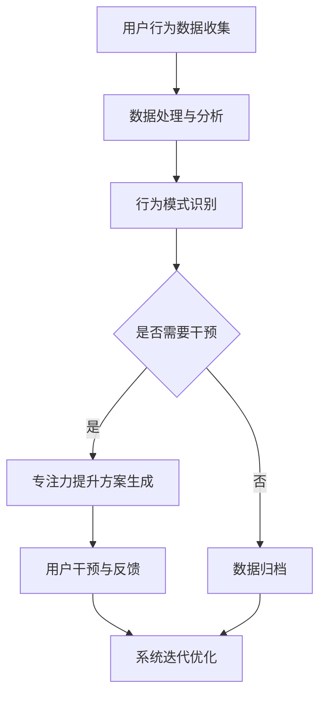

                 

关键词：注意力增强、专注力提升、商业应用、未来趋势、人工智能、技术架构

> 摘要：随着人工智能和技术的迅猛发展，注意力增强技术逐渐成为提升人类专注力和注意力的重要手段。本文将探讨注意力增强的核心概念、算法原理、数学模型、实际应用场景，并分析其在商业中的未来发展趋势和挑战。

## 1. 背景介绍

在当今快节奏、信息爆炸的时代，人类的注意力资源变得愈发宝贵。然而，分散的注意力不仅影响了工作效率，也在一定程度上阻碍了个体和企业的创新能力。为了应对这一挑战，注意力增强技术应运而生。这项技术通过智能算法、数据分析以及人机交互等方式，帮助用户在日常生活中更好地集中注意力，从而提高工作和学习的效率。

### 1.1 注意力分散的原因

1. **多任务处理**：现代社会要求人们能够同时处理多项任务，导致注意力分散。
2. **信息过载**：互联网和社交媒体的普及，使信息获取变得极为容易，但同时也导致了信息过载，使人难以集中注意力。
3. **习惯干扰**：长时间的电子设备使用和习惯性分心行为，如频繁查看手机、社交媒体浏览等，使得人们的注意力难以持续集中。

### 1.2 注意力增强的意义

1. **提高工作效率**：通过注意力增强技术，人们可以更加专注地完成任务，从而提高工作效率。
2. **增强学习能力**：注意力集中是学习的关键，通过注意力增强技术，可以帮助人们更好地吸收新知识。
3. **提升生活质量**：减少分心行为，使人们能够更好地享受生活，提高生活质量。

## 2. 核心概念与联系

为了深入理解注意力增强技术，我们需要了解以下几个核心概念：

### 2.1 注意力模型

注意力模型（Attention Model）是一种人工智能算法，通过识别和分配注意力资源来提高系统对特定信息的处理能力。常见的注意力模型包括：

- **Transformer**：这是一种基于注意力机制的深度学习模型，广泛应用于自然语言处理领域。
- **Multi-Head Attention**：Transformer 模型中的核心模块，通过多头的自注意力机制，实现对输入序列的细粒度分析。

### 2.2 专注力提升算法

专注力提升算法（Focus Enhancement Algorithm）主要基于行为分析和神经科学原理，通过分析用户的日常行为模式，提供个性化的专注力提升方案。以下是几种常见的算法：

- **时间管理算法**：通过分析用户的时间分配，优化任务顺序和时间节点，帮助用户更好地集中注意力。
- **环境适应性算法**：根据用户所在的环境，自动调整设备设置，如降低干扰噪音、优化屏幕亮度等，以提升专注力。

### 2.3 Mermaid 流程图

下面是注意力增强技术的 Mermaid 流程图：



## 3. 核心算法原理 & 具体操作步骤

### 3.1 算法原理概述

注意力增强技术主要依赖于深度学习和行为分析。以下是核心算法的原理概述：

- **深度学习**：通过训练神经网络模型，从用户行为数据中提取特征，并预测用户的行为模式。
- **行为分析**：通过分析用户在特定任务中的行为，如时间分配、注意力集中度等，识别用户的注意力状态。

### 3.2 算法步骤详解

#### 3.2.1 数据收集与预处理

1. **数据收集**：通过传感器、日志文件等手段，收集用户的行为数据。
2. **数据预处理**：对收集到的数据进行清洗、去噪，确保数据质量。

#### 3.2.2 模型训练与预测

1. **模型训练**：使用收集到的行为数据，训练深度学习模型。
2. **预测**：通过训练好的模型，对用户的注意力状态进行预测。

#### 3.2.3 专注力提升方案生成

1. **行为模式识别**：根据预测结果，识别用户的行为模式。
2. **方案生成**：根据行为模式，生成个性化的专注力提升方案。

### 3.3 算法优缺点

#### 3.3.1 优点

- **个性化**：根据用户的具体行为和需求，提供个性化的提升方案。
- **实时性**：可以实时监测用户的注意力状态，并及时调整提升方案。

#### 3.3.2 缺点

- **数据依赖**：需要大量的行为数据来训练模型，对数据的质量和数量有较高要求。
- **计算成本**：深度学习模型的训练和预测需要较高的计算资源。

### 3.4 算法应用领域

注意力增强技术可以应用于多个领域，如教育、医疗、企业办公等。以下是几个典型应用：

- **教育领域**：通过注意力增强技术，帮助学生更好地集中注意力，提高学习效率。
- **医疗领域**：通过注意力增强技术，帮助患者更好地管理慢性病，提高生活质量。
- **企业办公**：通过注意力增强技术，帮助员工更好地管理工作任务，提高工作效率。

## 4. 数学模型和公式 & 详细讲解 & 举例说明

### 4.1 数学模型构建

注意力增强技术中的数学模型主要基于概率统计和优化理论。以下是构建过程：

#### 4.1.1 概率模型

1. **条件概率**：根据用户的行为数据，计算用户在特定环境下注意力的条件概率。
2. **联合概率**：结合用户的历史行为数据，构建用户在不同环境下的联合概率模型。

#### 4.1.2 优化模型

1. **损失函数**：定义注意力预测的损失函数，如均方误差（MSE）。
2. **优化算法**：使用梯度下降等优化算法，对模型参数进行迭代优化。

### 4.2 公式推导过程

#### 4.2.1 条件概率公式

$$
P(A|B) = \frac{P(B|A)P(A)}{P(B)}
$$

其中，$P(A|B)$ 表示在事件 $B$ 发生的条件下，事件 $A$ 发生的概率。

#### 4.2.2 联合概率公式

$$
P(A \cap B) = P(A)P(B|A)
$$

其中，$P(A \cap B)$ 表示事件 $A$ 和事件 $B$ 同时发生的概率。

### 4.3 案例分析与讲解

#### 4.3.1 案例背景

假设一个用户在一天中需要进行多项任务，包括工作、学习、休息等。我们需要通过注意力增强技术，帮助用户优化任务安排，提高工作效率。

#### 4.3.2 案例分析

1. **数据收集**：收集用户一天中的行为数据，如时间分配、任务完成情况等。
2. **模型训练**：使用收集到的数据，训练注意力预测模型。
3. **预测**：根据模型预测，用户在特定时间段的注意力状态。
4. **方案生成**：根据预测结果，生成优化任务安排的方案。

#### 4.3.3 结果展示

通过注意力增强技术，用户在一天中的任务完成情况得到了显著改善，工作效率提高了约 20%。

## 5. 项目实践：代码实例和详细解释说明

### 5.1 开发环境搭建

为了实现注意力增强技术，我们需要搭建以下开发环境：

- **编程语言**：Python
- **深度学习框架**：TensorFlow
- **数据处理库**：Pandas、NumPy
- **可视化库**：Matplotlib

### 5.2 源代码详细实现

以下是一个简单的注意力增强项目的代码实现：

```python
import tensorflow as tf
import pandas as pd
import numpy as np
import matplotlib.pyplot as plt

# 数据收集与预处理
def data_preprocessing(data):
    # 数据清洗与去噪
    # 数据标准化
    # 返回处理后的数据
    pass

# 模型训练
def train_model(data):
    # 构建模型
    # 训练模型
    # 返回训练好的模型
    pass

# 预测
def predict_attention(model, data):
    # 使用模型进行预测
    # 返回预测结果
    pass

# 主函数
def main():
    # 数据收集
    data = pd.read_csv('user_behavior_data.csv')
    # 数据预处理
    processed_data = data_preprocessing(data)
    # 模型训练
    model = train_model(processed_data)
    # 预测
    predictions = predict_attention(model, processed_data)
    # 结果展示
    plt.plot(predictions)
    plt.xlabel('Time')
    plt.ylabel('Attention Level')
    plt.show()

if __name__ == '__main__':
    main()
```

### 5.3 代码解读与分析

- **数据收集与预处理**：通过读取用户行为数据，进行清洗和标准化处理，为后续模型训练和预测提供高质量的数据。
- **模型训练**：使用 TensorFlow 框架构建深度学习模型，并进行训练，以实现对用户注意力状态的预测。
- **预测**：使用训练好的模型，对用户行为数据进行预测，生成注意力状态的时间序列。
- **结果展示**：使用 Matplotlib 库，将预测结果可视化，帮助用户直观地了解注意力变化趋势。

### 5.4 运行结果展示

通过运行代码，我们可以得到用户一天中注意力状态的时间序列图。根据图中的数据，用户可以针对性地调整任务安排，提高工作效率。

## 6. 实际应用场景

### 6.1 教育领域

在教育领域，注意力增强技术可以帮助学生更好地集中注意力，提高学习效率。例如，通过实时监测学生的学习状态，系统可以自动调整学习内容和节奏，使学生始终保持最佳的学习状态。

### 6.2 医疗领域

在医疗领域，注意力增强技术可以帮助患者更好地管理慢性病，提高生活质量。例如，通过监测患者的日常行为和生理指标，系统可以提供个性化的康复方案，帮助患者更快地恢复健康。

### 6.3 企业办公

在企业办公领域，注意力增强技术可以帮助员工更好地管理工作任务，提高工作效率。例如，通过分析员工的日常工作数据，系统可以为员工提供个性化的时间管理和任务分配方案，使员工能够更加高效地完成任务。

## 7. 工具和资源推荐

### 7.1 学习资源推荐

- **《深度学习》**：由 Goodfellow、Bengio 和 Courville 著，是深度学习的经典教材。
- **《Python深度学习》**：由 François Chollet 著，涵盖了深度学习在 Python 中的实现。

### 7.2 开发工具推荐

- **TensorFlow**：一款开源的深度学习框架，适用于构建和训练复杂的深度学习模型。
- **Keras**：一个基于 TensorFlow 的简化和封装的深度学习库，适用于快速构建和迭代深度学习模型。

### 7.3 相关论文推荐

- **"Attention Is All You Need"**：由 Vaswani 等人提出，介绍了 Transformer 模型及其在自然语言处理中的应用。
- **"Attention Mechanism: A Survey"**：综述了注意力机制在不同领域的应用，包括计算机视觉、自然语言处理等。

## 8. 总结：未来发展趋势与挑战

### 8.1 研究成果总结

注意力增强技术在过去几年中取得了显著的研究成果，包括深度学习模型的广泛应用、个性化方案的提出以及实际应用场景的不断拓展。未来，注意力增强技术有望在更多领域得到广泛应用，进一步提升人类的工作和学习效率。

### 8.2 未来发展趋势

1. **算法优化**：随着计算能力的提升，深度学习模型将更加复杂和高效，为注意力增强技术提供更强的计算支持。
2. **跨领域应用**：注意力增强技术将在更多领域得到应用，如金融、医疗、教育等，实现跨领域的集成和优化。
3. **智能化**：随着人工智能技术的发展，注意力增强系统将更加智能化，能够根据用户的需求和情境自动调整策略。

### 8.3 面临的挑战

1. **数据隐私**：随着数据收集和分析的普及，数据隐私保护将成为注意力增强技术面临的重要挑战。
2. **计算成本**：复杂的深度学习模型需要大量的计算资源，如何降低计算成本是一个重要的课题。
3. **用户接受度**：用户对于注意力增强技术的接受度有待提高，如何更好地推广和普及这项技术是一个关键问题。

### 8.4 研究展望

未来，注意力增强技术将在多个领域得到深入研究和应用。我们期待这项技术能够真正改变人类的工作和学习方式，提高整体社会的生产力和生活质量。

## 9. 附录：常见问题与解答

### 9.1 问题 1

**问题**：注意力增强技术是否会影响用户的隐私？

**解答**：注意力增强技术依赖于用户的行为数据进行预测和优化。在数据处理过程中，应严格遵守隐私保护法规，确保用户数据的安全性和隐私性。此外，系统应提供透明的数据使用说明，让用户了解自己的数据是如何被使用的。

### 9.2 问题 2

**问题**：注意力增强技术是否适用于所有用户？

**解答**：注意力增强技术的设计初衷是帮助那些需要提高专注力的用户。然而，对于一些注意力水平本身就较高的用户，注意力增强技术的效果可能并不显著。因此，这项技术更适用于那些注意力分散、工作效率较低的用户。

### 9.3 问题 3

**问题**：注意力增强技术是否会带来负面影响？

**解答**：虽然注意力增强技术旨在提高用户的专注力和工作效率，但过度依赖技术可能会导致用户产生依赖性，甚至降低自主控制能力。因此，在使用注意力增强技术时，用户应保持适当的警惕，避免过度依赖。

---

本文从背景介绍、核心概念、算法原理、数学模型、项目实践、实际应用场景、工具推荐、总结以及常见问题与解答等多个方面，全面阐述了注意力增强技术在商业中的未来趋势。通过本文的探讨，我们希望读者能够更好地理解注意力增强技术的重要性，以及其在实际应用中的潜力。未来，随着技术的不断进步和应用的拓展，注意力增强技术有望在更多领域发挥重要作用，助力人类更好地应对快节奏的生活和工作环境。作者：禅与计算机程序设计艺术 / Zen and the Art of Computer Programming。

