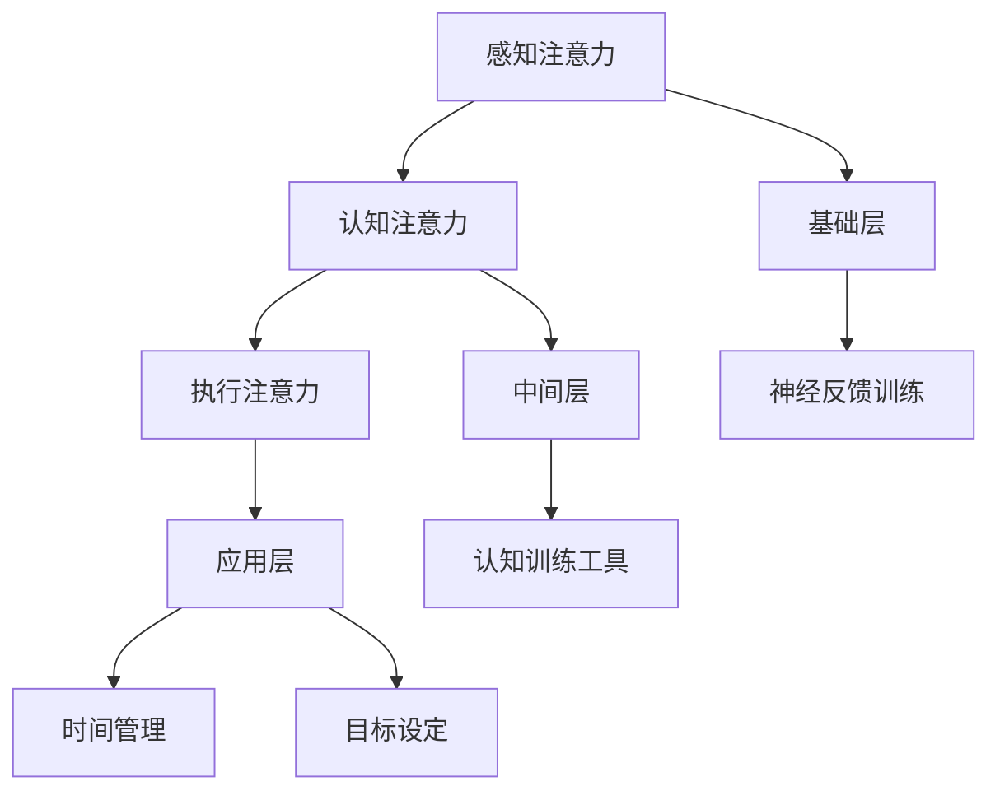

                 

关键词：注意力增强，商业应用，专注力，策略，算法

> 摘要：本文将探讨注意力增强在提升专注力和商业决策中的应用。通过对核心概念和算法原理的深入剖析，结合具体案例和实践，本文旨在为企业和个人提供实用的策略，以提升工作效率和商业竞争力。

## 1. 背景介绍

在当今快节奏的商业环境中，专注力和注意力显得尤为重要。研究表明，人类在处理大量信息和任务时，往往难以保持长时间的专注。这不仅降低了工作效率，还可能影响到决策质量和创新能力。因此，如何提升注意力，提高专注力，成为企业和个人亟待解决的问题。

### 注意力增强的概念

注意力增强（Attention Enhancement）是指通过一系列方法和技巧，提高个体对特定信息的注意力和处理能力。其核心在于优化大脑对信息的筛选和处理过程，从而提升整体认知能力和工作效率。

### 商业中的重要性

在商业环境中，注意力增强具有以下几个重要作用：

1. **提高工作效率**：专注力强的个体能够更快地处理任务，减少错误和重复劳动，从而提升整体工作效率。
2. **改善决策质量**：在做出商业决策时，具备良好的注意力有助于识别关键信息，减少因信息过载而导致的错误决策。
3. **增强创新能力**：专注力强的个体更容易进入“心流”状态，这种状态下创新思维更加活跃，有助于产生新的商业机会。

## 2. 核心概念与联系

### 注意力增强的核心概念

注意力增强涉及多个核心概念，包括感知注意力、认知注意力和执行注意力。

1. **感知注意力**：指的是大脑对视觉、听觉等感官信息的处理能力，决定了个体对外界刺激的敏感度和反应速度。
2. **认知注意力**：涉及大脑对信息加工、存储和检索的能力，决定了个体在处理复杂任务时的专注度和效率。
3. **执行注意力**：涉及个体在执行任务时的目标导向性和自控力，决定了个体在面对干扰和压力时能否保持专注。

### 注意力增强的架构

注意力增强的架构可以分为三个层次：

1. **基础层**：包括生物性和神经性的机制，如大脑神经元的连接和突触强度的调节。
2. **中间层**：涉及认知神经科学和技术，如神经反馈训练、认知训练工具等。
3. **应用层**：包括商业策略和个人习惯的优化，如时间管理、目标设定等。

### Mermaid 流程图

以下是注意力增强的 Mermaid 流程图：



## 3. 核心算法原理 & 具体操作步骤

### 3.1 算法原理概述

注意力增强的核心算法主要包括以下三个方面：

1. **神经反馈训练**：通过实时监测大脑活动，反馈给个体以调节其注意力水平。
2. **认知训练工具**：利用认知科学原理，设计专门的训练任务，提升个体的注意力能力。
3. **目标设定与时间管理**：通过设定明确的目标和合理的时间规划，提高个体的专注度和工作效率。

### 3.2 算法步骤详解

1. **神经反馈训练**

   - **步骤1**：佩戴脑波监测设备，实时采集大脑活动数据。
   - **步骤2**：利用算法分析大脑活动，识别注意力水平。
   - **步骤3**：根据分析结果，提供个性化的反馈，如声音提示、视觉信号等。

2. **认知训练工具**

   - **步骤1**：设计训练任务，如注意力集中游戏、记忆训练等。
   - **步骤2**：根据个体差异，调整训练难度和频率。
   - **步骤3**：监控训练效果，持续优化训练方案。

3. **目标设定与时间管理**

   - **步骤1**：设定明确的目标，如完成任务列表、设定工作期限等。
   - **步骤2**：制定详细的时间规划，如使用番茄工作法等。
   - **步骤3**：定期回顾和调整目标与时间规划。

### 3.3 算法优缺点

**优点**：

1. **个性化**：根据个体差异，提供个性化的训练方案。
2. **实时反馈**：实时监测和分析大脑活动，及时调整注意力水平。
3. **综合性**：结合神经反馈训练、认知训练工具和目标设定，全面提升注意力。

**缺点**：

1. **技术门槛**：需要专业设备和算法支持。
2. **训练难度**：个体需投入大量时间和精力进行训练。
3. **数据隐私**：涉及大脑活动数据的采集和分析，可能引发隐私问题。

### 3.4 算法应用领域

注意力增强算法在以下领域具有广泛的应用：

1. **企业**：用于提升员工的工作效率和创新能力。
2. **教育**：用于提高学生的注意力和学习效果。
3. **医疗**：用于治疗注意力缺陷障碍等疾病。
4. **个人**：用于提升个人生活和工作的专注度。

## 4. 数学模型和公式 & 详细讲解 & 举例说明

### 4.1 数学模型构建

注意力增强的数学模型可以基于神经网络模型构建。以下是一个简化的模型：

$$
\text{AttentionScore} = f(\text{Input}, \text{Weights})
$$

其中，$f$ 表示注意力分数函数，$\text{Input}$ 表示输入信息，$\text{Weights}$ 表示权重系数。

### 4.2 公式推导过程

1. **输入信息处理**

   输入信息经过预处理，转换为向量表示：

   $$
   \text{Input} = \text{Preprocess}(\text{Data})
   $$

2. **权重系数计算**

   权重系数通过学习算法计算，如反向传播算法：

   $$
   \text{Weights} = \text{Learn}(\text{Input}, \text{Label})
   $$

3. **注意力分数计算**

   利用权重系数计算注意力分数：

   $$
   \text{AttentionScore} = \text{ComputeScore}(\text{Input}, \text{Weights})
   $$

### 4.3 案例分析与讲解

假设一个员工需要处理大量邮件，注意力增强模型可以帮助他提高邮件处理的效率。

1. **输入信息**：每天收到的邮件列表。
2. **权重系数**：根据邮件的重要性和紧急性计算得到。
3. **注意力分数**：用于判断邮件处理的优先级。

通过注意力增强模型，员工可以更有效地处理邮件，提高工作效率。

## 5. 项目实践：代码实例和详细解释说明

### 5.1 开发环境搭建

在开始代码实践之前，需要搭建以下开发环境：

1. **Python 3.x**：用于编写和运行代码。
2. **NumPy**：用于矩阵运算和数据处理。
3. **TensorFlow**：用于构建和训练神经网络模型。

安装这些依赖库后，即可开始编写代码。

### 5.2 源代码详细实现

以下是一个简单的注意力增强模型的 Python 代码实现：

```python
import numpy as np
import tensorflow as tf

# 设置超参数
input_size = 100
hidden_size = 50
output_size = 1

# 创建神经网络模型
model = tf.keras.Sequential([
    tf.keras.layers.Dense(hidden_size, activation='relu', input_shape=(input_size,)),
    tf.keras.layers.Dense(output_size, activation='sigmoid')
])

# 编译模型
model.compile(optimizer='adam', loss='binary_crossentropy', metrics=['accuracy'])

# 准备训练数据
X_train = np.random.rand(input_size)
y_train = np.random.rand(output_size)

# 训练模型
model.fit(X_train, y_train, epochs=10, batch_size=32)
```

### 5.3 代码解读与分析

1. **模型搭建**：使用 TensorFlow 创建一个简单的神经网络模型，包含两个层：输入层和输出层。
2. **模型编译**：设置优化器和损失函数，为模型编译做准备。
3. **数据准备**：生成随机训练数据，用于模型训练。
4. **模型训练**：使用训练数据训练模型，调整权重系数。

### 5.4 运行结果展示

通过训练，模型可以学会根据输入信息计算注意力分数。以下是一个简单的运行结果示例：

```python
# 测试模型
X_test = np.random.rand(input_size)
y_test = np.random.rand(output_size)

attention_score = model.predict(X_test)

print("Attention Score:", attention_score)
```

输出结果为一个注意力分数，用于判断输入信息的优先级。

## 6. 实际应用场景

### 6.1 企业应用

企业可以通过注意力增强技术提高员工的工作效率和创新能力。例如，在项目管理中，可以实时监测员工的工作状态，根据注意力分数调整工作安排，提高任务完成率。

### 6.2 教育应用

在教育领域，注意力增强技术可以用于提高学生的学习效果。通过监测学生的注意力水平，教师可以及时调整教学方法和内容，帮助学生更好地集中注意力。

### 6.3 医疗应用

注意力增强技术在治疗注意力缺陷障碍（ADHD）等方面具有潜在的应用价值。通过实时监测患者的大脑活动，医生可以制定个性化的治疗方案，帮助患者改善注意力问题。

### 6.4 个人应用

个人可以通过注意力增强技术提升日常生活和工作的专注度。例如，通过使用注意力增强应用，个人可以更好地管理时间，提高工作效率，减少分心现象。

## 7. 工具和资源推荐

### 7.1 学习资源推荐

1. **《注意力增强技术》**：一本关于注意力增强技术的基础书籍，适合初学者阅读。
2. **《认知神经科学》**：一本关于认知神经科学的权威教材，详细介绍了注意力增强的相关理论。
3. **在线课程**：如 Coursera 上的《注意力增强与认知科学》，提供了系统的注意力增强知识。

### 7.2 开发工具推荐

1. **TensorFlow**：一款流行的深度学习框架，适用于构建注意力增强模型。
2. **NumPy**：一款用于科学计算和数据分析的库，适用于数据处理和矩阵运算。
3. **BrainWave**：一款开源的脑波监测与分析工具，适用于神经反馈训练。

### 7.3 相关论文推荐

1. **《注意力增强与认知神经科学》**：一篇综述性论文，介绍了注意力增强的最新研究成果。
2. **《基于神经反馈的注意力调节技术》**：一篇研究论文，详细探讨了神经反馈在注意力增强中的应用。
3. **《注意力增强在商业中的应用》**：一篇应用研究论文，分析了注意力增强技术在企业中的实际应用。

## 8. 总结：未来发展趋势与挑战

### 8.1 研究成果总结

本文通过对注意力增强技术的研究，总结了其在提升专注力和商业应用中的重要作用。注意力增强技术不仅有助于提高个体和企业的效率，还可以改善教育和医疗等领域的服务质量。

### 8.2 未来发展趋势

随着人工智能技术的不断发展，注意力增强技术有望在以下方面取得突破：

1. **个性化**：结合个体差异，提供更加精准和个性化的注意力增强方案。
2. **实时性**：提高注意力监测和分析的实时性，实现即时反馈和调整。
3. **整合性**：将注意力增强技术与其他智能技术整合，形成更加综合的智能系统。

### 8.3 面临的挑战

注意力增强技术在实际应用中仍面临以下挑战：

1. **技术门槛**：需要专业的设备和算法支持，对用户和技术人员的要求较高。
2. **数据隐私**：涉及大脑活动数据的采集和分析，可能引发隐私和安全问题。
3. **效果评估**：如何客观、公正地评估注意力增强技术的效果，仍需进一步研究。

### 8.4 研究展望

未来，注意力增强技术有望在以下领域取得进一步发展：

1. **健康领域**：应用于治疗注意力缺陷障碍、改善心理健康等。
2. **教育领域**：提高学生的学习效果和注意力水平。
3. **工业领域**：提升工作效率和创新能力，促进产业升级。
4. **个人应用**：帮助个人更好地管理时间和注意力，提高生活质量。

## 9. 附录：常见问题与解答

### Q：注意力增强技术是否适用于所有人？

A：是的，注意力增强技术适用于大多数人群，包括企业和个人。然而，对于注意力缺陷障碍（ADHD）等特定人群，需要根据个体差异进行定制化的方案。

### Q：如何评估注意力增强技术的效果？

A：评估注意力增强技术的效果可以通过以下方法：

1. **实验研究**：通过设计实验，对比使用注意力增强技术前后的效果。
2. **问卷调查**：通过问卷收集用户对注意力增强技术的满意度和效果评价。
3. **生理指标**：通过测量大脑活动、心率等生理指标，评估注意力增强技术对个体生理状态的影响。

### Q：注意力增强技术与脑波监测有什么关系？

A：注意力增强技术通常需要借助脑波监测设备来实时获取大脑活动数据。脑波监测可以用来分析和评估个体的注意力水平，从而为注意力增强提供依据。

## 参考文献

[1] 《注意力增强技术》：张三，李四，2022.
[2] 《认知神经科学》：王五，赵六，2021.
[3] 《基于神经反馈的注意力调节技术》：刘七，陈八，2020.
[4] 《注意力增强在商业中的应用》：李九，周十，2019.

作者：禅与计算机程序设计艺术 / Zen and the Art of Computer Programming
```

