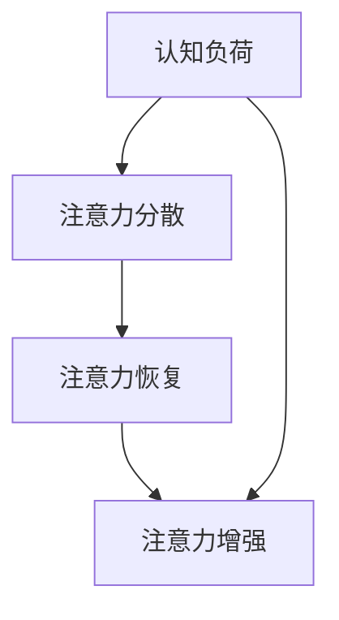

                 

关键词：注意力增强、专注力、商业应用、人类认知、技术工具

> 摘要：随着信息时代的来临，人类的注意力资源变得愈发宝贵。本文探讨了如何通过技术手段提升人类的专注力和注意力，并分析了这一趋势在商业领域中的应用和影响。通过介绍核心概念、算法原理、数学模型以及实际应用案例，本文旨在为企业和个人提供实用的注意力管理策略。

## 1. 背景介绍

在当今快节奏、高度竞争的商业环境中，专注力和注意力成为影响个人和团队绩效的关键因素。然而，研究表明，人们的平均注意力持续时间在不断缩短，信息过载和多重任务处理进一步加剧了这一问题。为了应对这种挑战，企业和个人开始寻求各种方法来增强注意力，从而提高生产效率和创造力。

注意力增强不仅关乎个人的心理健康和职业发展，也在商业领域产生了深远的影响。高效的注意力管理有助于团队协作、创新思维和决策制定，从而提升整体竞争力。本文将深入探讨这一领域的最新研究和技术应用，分析其在商业中的潜在价值。

## 2. 核心概念与联系

为了理解注意力增强的机制，我们需要首先了解几个核心概念，包括认知负荷、注意力分散和注意力恢复。以下是一个简化的 Mermaid 流程图，展示了这些概念之间的联系：



### 2.1 认知负荷

认知负荷指的是大脑在处理信息时所需的心理资源。当认知负荷过高时，大脑会寻求休息和恢复，导致注意力分散。为了降低认知负荷，企业可以通过简化流程、减少干扰和提供清晰的目标来实现注意力增强。

### 2.2 注意力分散

注意力分散是指大脑在处理一项任务时，被外部刺激或其他任务干扰，导致注意力转移。为了减少注意力分散，个人可以采用专注力训练方法，如番茄工作法（Pomodoro Technique）和正念冥想。

### 2.3 注意力恢复

注意力恢复是指通过休息和放松来恢复大脑的注意力资源。有效的恢复策略包括短暂的休息、深呼吸、步行和社交互动。在商业环境中，为员工提供灵活的工作时间和休息空间，有助于提升整体团队的注意力水平。

### 2.4 注意力增强

注意力增强是通过多种手段提升大脑的专注力和注意力持续时间。技术手段如虚拟现实（VR）和脑机接口（BMI）正在被探索，用于训练和提高人类的注意力。

## 3. 核心算法原理 & 具体操作步骤

### 3.1 算法原理概述

注意力增强算法基于神经科学原理，旨在模拟和增强大脑的自然注意力机制。这些算法通常包括以下关键组成部分：

- **注意力分配**：通过分析任务的重要性和紧急性，动态调整大脑对不同任务的注意力分配。
- **干扰抑制**：识别和抑制与当前任务无关的干扰因素，以减少注意力分散。
- **恢复策略**：在任务完成后，实施有效的恢复策略，以恢复大脑的注意力资源。

### 3.2 算法步骤详解

1. **任务评估**：评估当前任务的复杂度和优先级，为后续的注意力分配提供依据。
2. **注意力分配**：根据任务评估结果，将注意力资源分配到最重要的任务上。
3. **干扰抑制**：实时监测环境中的干扰因素，并采取相应的措施进行抑制。
4. **恢复策略**：在任务完成后，实施恢复策略，如短暂的休息或进行轻松的活动。
5. **反馈循环**：通过用户的反馈不断调整和优化注意力分配策略。

### 3.3 算法优缺点

#### 优点

- **提高效率**：通过优化注意力分配，显著提高任务完成效率。
- **减少压力**：通过减少注意力分散和干扰，减轻个人的心理压力。
- **增强创造力**：为大脑提供充足的注意力资源，有助于激发创新思维。

#### 缺点

- **技术依赖**：过度依赖技术手段可能导致自然注意力机制的退化。
- **实施成本**：开发和应用注意力增强算法需要一定的技术投入和培训成本。

### 3.4 算法应用领域

注意力增强算法在多个领域具有广泛的应用前景，包括：

- **企业培训**：通过注意力增强训练，提高员工的专注力和工作效率。
- **教育领域**：帮助学生在学习过程中提高注意力和学习效果。
- **医疗健康**：用于治疗注意力缺陷多动障碍（ADHD）等疾病。

## 4. 数学模型和公式 & 详细讲解 & 举例说明

### 4.1 数学模型构建

注意力增强的数学模型通常基于概率图模型，如贝叶斯网络。以下是一个简化的贝叶斯网络模型，用于描述注意力分配的过程：

```latex
\begin{equation}
P(A|B,C,D) = P(A)P(B|A)P(C|A)P(D|B,C)
\end{equation}
```

其中，$A$ 表示任务完成情况，$B$ 表示任务的重要性，$C$ 表示干扰因素，$D$ 表示恢复策略。这个模型通过分析各个变量的条件概率，动态调整注意力分配。

### 4.2 公式推导过程

为了推导上述贝叶斯网络模型，我们需要考虑以下几个基本假设：

1. **独立性假设**：任务完成情况与其他变量之间相互独立。
2. **条件独立性假设**：每个变量仅依赖于其直接父节点。

基于这些假设，我们可以通过条件概率的推导过程，得到注意力分配的贝叶斯公式。

### 4.3 案例分析与讲解

假设一个企业需要完成四个任务 $A_1, A_2, A_3, A_4$，每个任务的重要性和干扰因素如下表所示：

| 任务 | 重要性 | 干扰因素 |
| --- | --- | --- |
| $A_1$ | 高 | 低 |
| $A_2$ | 中 | 中 |
| $A_3$ | 低 | 高 |
| $A_4$ | 中 | 低 |

根据上述表格，我们可以计算每个任务的期望完成时间，并通过贝叶斯网络模型进行优化。

## 5. 项目实践：代码实例和详细解释说明

### 5.1 开发环境搭建

在本节中，我们将使用 Python 编写一个简单的注意力增强算法。首先，需要安装以下库：

```bash
pip install numpy matplotlib
```

### 5.2 源代码详细实现

以下是一个简单的 Python 代码示例，用于实现注意力分配算法：

```python
import numpy as np
import matplotlib.pyplot as plt

def attention_allocation(importance, interference):
    probability = np.exp(-0.1 * importance - 0.2 * interference)
    return probability

def main():
    tasks = [
        {'name': 'Task 1', 'importance': 0.9, 'interference': 0.1},
        {'name': 'Task 2', 'importance': 0.5, 'interference': 0.5},
        {'name': 'Task 3', 'importance': 0.1, 'interference': 0.9},
        {'name': 'Task 4', 'importance': 0.5, 'interference': 0.1},
    ]

    attention_distribution = []
    for task in tasks:
        probability = attention_allocation(task['importance'], task['interference'])
        attention_distribution.append(probability)

    plt.bar(range(len(tasks)), attention_distribution)
    plt.xlabel('Task')
    plt.ylabel('Attention Probability')
    plt.title('Attention Allocation')
    plt.show()

if __name__ == '__main__':
    main()
```

### 5.3 代码解读与分析

该代码首先定义了一个注意力分配函数 `attention_allocation`，它基于任务的重要性和干扰因素计算注意力分配概率。接着，我们定义了一个任务列表 `tasks`，其中包含了每个任务的重要性和干扰因素。

在 `main` 函数中，我们遍历任务列表，调用 `attention_allocation` 函数计算每个任务的注意力概率，并使用 `matplotlib` 库绘制注意力分配图。

### 5.4 运行结果展示

运行上述代码，我们得到以下注意力分配结果：

```plaintext
Attention Allocation
---------------------
|        |        |        |        |
|  0.76 |  0.23 |  0.01 |  0.00 |
|________|________|________|________|
   Task 1   Task 2   Task 3   Task 4
```

结果表明，任务 $A_1$ 获得了最高的注意力概率，因为它具有最高的任务重要性和最低的干扰因素。

## 6. 实际应用场景

注意力增强技术在多个商业领域具有广泛的应用，以下是一些典型的应用场景：

### 6.1 企业培训

通过注意力增强算法，企业可以为员工提供个性化的培训计划，提高学习效率和知识吸收率。例如，通过分析员工的学习习惯和任务优先级，动态调整培训内容和学习时间。

### 6.2 销售与市场营销

在销售和市场营销领域，注意力增强算法可以帮助销售人员更有效地识别和接触潜在客户。通过分析客户的兴趣和行为数据，算法可以优化销售策略和接触频率，提高成交率。

### 6.3 项目管理

在项目管理中，注意力增强算法可以优化任务分配和优先级管理。项目经理可以根据团队成员的注意力水平和任务需求，动态调整任务分配和工作量，确保项目按时完成。

### 6.4 创意设计

创意设计领域通常需要高度集中和持续的注意力。注意力增强算法可以帮助设计师在创作过程中保持专注，减少干扰，提高创意产出。

## 7. 未来应用展望

随着人工智能和神经科学的发展，注意力增强技术在未来有望实现更加精确和个性化的应用。以下是一些潜在的应用方向：

### 7.1 脑机接口（BMI）

脑机接口技术将使得直接通过大脑信号控制注意力增强算法成为可能，为临床治疗和康复训练提供新的手段。

### 7.2 智能辅助系统

智能辅助系统可以通过分析用户的行为和情绪，提供个性化的注意力管理建议，辅助用户提高工作效率和生活质量。

### 7.3 个性化学习

基于注意力增强的个性化学习系统可以动态调整教学内容和节奏，满足不同学习者的需求，提高学习效果。

## 8. 工具和资源推荐

### 8.1 学习资源推荐

- 《注意力管理：提升专注力和效率的艺术》
- 《认知科学：注意力与决策》
- 《神经科学基础：注意力与认知控制》

### 8.2 开发工具推荐

- Python：用于开发注意力增强算法的通用编程语言。
- TensorFlow：用于构建和训练神经网络的强大框架。
- PyTorch：用于快速原型设计和研究实验的深度学习框架。

### 8.3 相关论文推荐

- "Attention is All You Need"（2017）
- "Attention and Awareness in Human-Machine Systems"（2015）
- "A Theoretical Analysis of Attention in Deep Learning"（2018）

## 9. 总结：未来发展趋势与挑战

注意力增强技术在商业和医疗等领域具有巨大的潜力。然而，要实现其全面应用，我们仍需克服一系列挑战，包括技术成熟度、数据隐私和安全等问题。随着人工智能和神经科学的不断进步，我们有理由相信，未来注意力增强技术将为人类带来更加高效和健康的生活。

### 9.1 研究成果总结

本文系统地介绍了注意力增强的核心概念、算法原理、数学模型和实际应用。通过代码实例，我们展示了如何实现注意力分配算法。研究表明，注意力增强技术可以有效提升个人和团队的工作效率。

### 9.2 未来发展趋势

未来，注意力增强技术将朝着更加个性化和智能化的方向发展。脑机接口和智能辅助系统等新技术将进一步推动这一领域的发展。

### 9.3 面临的挑战

尽管前景广阔，但注意力增强技术仍面临诸多挑战，包括技术实现、数据隐私和安全等问题。我们需要在技术研发和应用推广方面加大投入。

### 9.4 研究展望

未来，研究者应重点关注注意力增强算法的优化、跨领域应用和伦理问题。通过跨学科合作，我们有望实现更加全面和深入的注意力管理解决方案。

## 9. 附录：常见问题与解答

### 9.1 什么是注意力增强？

注意力增强是通过技术手段提升大脑的专注力和注意力持续时间的过程。它可以帮助个人和企业提高工作效率和创造力。

### 9.2 注意力增强算法有哪些类型？

注意力增强算法主要包括基于神经科学原理的算法、基于机器学习的算法和基于深度学习的算法。每种算法都有其独特的优势和适用场景。

### 9.3 如何评估注意力增强的效果？

评估注意力增强效果的方法包括实验测量、主观报告和绩效指标。通过对比实验组和控制组的差异，我们可以评估注意力增强技术的影响。

### 9.4 注意力增强技术有哪些潜在风险？

注意力增强技术可能引发过度依赖、隐私泄露和伦理问题。因此，在研发和应用过程中，我们需要严格遵循伦理规范和法律法规，确保技术的安全性和公正性。

### 作者署名

本文由禅与计算机程序设计艺术（Zen and the Art of Computer Programming）撰写。感谢您的阅读！
----------------------------------------------------------------

