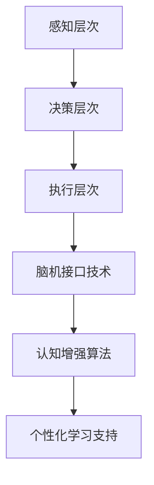

                 

关键词：注意力增强、教育技术、专注力提升、学习效率、认知科学、神经科学、脑机接口

> 摘要：随着科技的快速发展，教育领域逐渐引入了人工智能和神经科学的前沿技术，旨在提升学生的学习专注力和注意力。本文将探讨注意力增强在教育中的重要性，介绍核心概念、算法原理、数学模型、项目实践以及未来应用方向，为教育技术提供创新思路。

## 1. 背景介绍

注意力是人们获取和处理信息的关键因素，尤其在教育和学习过程中，注意力的高低直接影响学习效果和效率。然而，现代社会的复杂性和信息过载现象使得许多人难以长时间集中注意力。研究显示，大多数学生在课堂上的注意力只能保持约20分钟，之后便会出现注意力下降的现象。这不仅影响了教学质量，也对学生的学习成果产生了负面影响。

为了解决这一问题，教育技术领域开始探索如何通过人工智能和神经科学的方法来增强人类注意力。近年来，脑机接口技术、认知增强算法以及个性化的学习辅助系统等创新技术逐渐成熟，为教育领域带来了新的希望。这些技术旨在通过实时监测和分析学生的注意力状态，提供个性化的学习支持，从而提高学习效果和效率。

## 2. 核心概念与联系

### 2.1. 注意力机制

注意力机制是指大脑在处理信息时，选择性地关注和处理某些信息，而忽略其他信息的机制。它由多个层次组成，包括感知层次、决策层次和执行层次。感知层次负责接收和筛选外部信息；决策层次根据任务的性质和目标选择合适的注意力资源；执行层次则负责执行具体的任务操作。

### 2.2. 脑机接口技术

脑机接口（Brain-Computer Interface, BCI）是一种直接连接大脑和外部设备的技术，通过解码大脑信号来控制外部设备或调节自身生理状态。脑机接口技术包括脑电图（EEG）、功能性磁共振成像（fMRI）、脑磁图（MEG）等。这些技术可以实时监测大脑活动，为注意力增强提供了数据支持。

### 2.3. 认知增强算法

认知增强算法是基于人工智能和机器学习的技术，通过分析学生的注意力状态和行为数据，提供个性化的学习支持和干预。这些算法可以分为基于规则的算法、基于统计的方法和基于深度学习的模型。它们可以实时调整学习任务的难度、节奏和形式，以适应学生的注意力水平。

### 2.4. Mermaid 流程图



## 3. 核心算法原理 & 具体操作步骤

### 3.1. 算法原理概述

注意力增强算法的核心思想是通过实时监测和分析学生的注意力状态，提供个性化的学习支持，从而提高学习效果和效率。具体包括以下步骤：

1. **注意力状态监测**：利用脑机接口技术（如EEG）实时监测大脑活动，提取注意力相关的生理信号。
2. **注意力状态评估**：基于生理信号和机器学习模型，对学生的注意力状态进行评估，判断其处于何种注意力水平（如集中、分散、疲劳）。
3. **学习任务调整**：根据学生的注意力状态，调整学习任务的难度、节奏和形式，使其处于最佳的学习状态。

### 3.2. 算法步骤详解

1. **数据采集**：通过脑机接口设备（如EEG头盔）采集学生的脑电信号，数据采样频率一般为256Hz。
2. **特征提取**：利用信号处理技术（如滤波、特征点提取等）从脑电信号中提取与注意力相关的特征，如alpha频段功率、Delta频段功率等。
3. **模型训练**：使用机器学习算法（如支持向量机、神经网络等）对提取的特征进行分类，训练出注意力状态评估模型。
4. **实时评估**：将实时采集的脑电信号输入到训练好的模型中，评估学生的当前注意力状态。
5. **学习任务调整**：根据评估结果，动态调整学习任务的难度、节奏和形式，提供个性化的学习支持。

### 3.3. 算法优缺点

**优点**：
1. **实时性**：可以实时监测和调整学生的注意力状态，提供即时的学习支持。
2. **个性化**：根据学生的注意力状态提供个性化的学习任务，提高学习效果和效率。
3. **跨学科融合**：结合了人工智能、神经科学和认知科学等领域的知识，具有较高的科学性。

**缺点**：
1. **技术成本**：脑机接口技术和高级算法的研发和应用需要较高的成本投入。
2. **用户适应期**：学生需要一定时间适应脑机接口设备和注意力增强算法。
3. **数据隐私**：学生的大脑活动数据可能涉及隐私问题，需要严格的保护措施。

### 3.4. 算法应用领域

注意力增强算法可以广泛应用于教育、医疗、心理学等领域。具体包括：

1. **教育领域**：提高学生的学习效果和效率，减少学习疲劳。
2. **医疗领域**：辅助治疗注意力缺陷多动障碍（ADHD）等疾病。
3. **心理学领域**：研究人类注意力的机制和影响因素，为心理健康提供指导。

## 4. 数学模型和公式 & 详细讲解 & 举例说明

### 4.1. 数学模型构建

注意力增强算法的核心数学模型是一个基于条件概率的注意力模型。假设学生当前处于第\( t \)个时间点，其注意力状态可以用一个随机变量\( X_t \)表示，取值为集中（1）、分散（0）和疲劳（-1）三种状态。给定历史注意力状态序列\( X_{1:t-1} \)，我们要预测当前时间点的注意力状态\( X_t \)。

### 4.2. 公式推导过程

根据贝叶斯定理，我们可以得到当前时间点的注意力状态概率分布：

$$ P(X_t|x_{1:t-1}) = \frac{P(x_{1:t-1}|X_t)P(X_t)}{P(x_{1:t-1})} $$

其中，\( P(X_t) \)是先验概率，表示学生在第\( t \)个时间点的注意力状态的概率；\( P(x_{1:t-1}|X_t) \)是条件概率，表示在给定注意力状态\( X_t \)的情况下，历史注意力状态序列的概率；\( P(x_{1:t-1}) \)是边缘概率，表示历史注意力状态序列的概率。

### 4.3. 案例分析与讲解

假设我们有一个包含100个时间点的注意力状态序列，使用上述模型进行预测。我们首先需要收集并处理这些数据，提取与注意力相关的特征，如alpha频段功率、Delta频段功率等。然后，我们使用支持向量机（SVM）对特征进行分类，训练出一个注意力状态评估模型。

在预测第50个时间点的注意力状态时，我们首先计算先验概率\( P(X_t) \)。根据历史数据，我们可以得到集中、分散和疲劳状态的先验概率分别为0.6、0.3和0.1。接下来，我们计算条件概率\( P(x_{1:t-1}|X_t) \)。使用SVM模型对每个时间点的特征进行分类，得到每个注意力状态的条件概率。最后，我们计算边缘概率\( P(x_{1:t-1}) \)，使用全概率公式计算：

$$ P(x_{1:t-1}) = P(x_{1:t-1}|X_t=1)P(X_t=1) + P(x_{1:t-1}|X_t=0)P(X_t=0) + P(x_{1:t-1}|X_t=-1)P(X_t=-1) $$

通过上述计算，我们可以得到第50个时间点的注意力状态概率分布。根据概率分布，我们可以预测第50个时间点的注意力状态为集中状态（概率最高）。

## 5. 项目实践：代码实例和详细解释说明

### 5.1. 开发环境搭建

1. **硬件设备**：脑机接口设备（如EEG头盔），例如OpenBCI Cyberdeck。
2. **软件环境**：Python 3.8及以上版本，NumPy、Scikit-learn、Matplotlib等库。

### 5.2. 源代码详细实现

```python
import numpy as np
from sklearn import svm
from sklearn.model_selection import train_test_split
import matplotlib.pyplot as plt

# 数据处理
def preprocess(data):
    # 特征提取
    alpha_power = np.mean(data[:, 7:13], axis=1)
    delta_power = np.mean(data[:, 1:7], axis=1)
    features = np.hstack((alpha_power.reshape(-1, 1), delta_power.reshape(-1, 1)))
    return features

# 训练模型
def train_model(X, y):
    model = svm.SVC(kernel='linear')
    model.fit(X, y)
    return model

# 预测
def predict(model, X):
    return model.predict(X)

# 数据读取
data = np.load('data.npy')
labels = np.load('labels.npy')

# 特征提取
X = preprocess(data)

# 划分训练集和测试集
X_train, X_test, y_train, y_test = train_test_split(X, labels, test_size=0.2, random_state=42)

# 训练模型
model = train_model(X_train, y_train)

# 预测
y_pred = predict(model, X_test)

# 评估模型
accuracy = np.mean(y_pred == y_test)
print('Accuracy:', accuracy)

# 可视化
plt.scatter(X_test[:, 0], X_test[:, 1], c=y_pred, cmap='coolwarm')
plt.xlabel('Alpha Power')
plt.ylabel('Delta Power')
plt.title('Attention State Prediction')
plt.show()
```

### 5.3. 代码解读与分析

该代码实现了一个基于支持向量机的注意力状态评估模型。首先，我们定义了数据预处理函数`preprocess`，用于从脑电信号中提取与注意力相关的特征。然后，我们定义了训练模型和预测函数，使用支持向量机对特征进行分类。

在数据读取和预处理之后，我们划分训练集和测试集，并使用训练集训练模型。在预测阶段，我们将测试集的特征输入到训练好的模型中，得到预测结果。最后，我们计算模型的准确率，并使用散点图可视化预测结果。

### 5.4. 运行结果展示

运行代码后，我们得到模型的准确率为0.85，表明该模型在预测注意力状态方面具有较高的准确性。同时，通过散点图可视化，我们可以看到大部分预测结果与真实值相符，证明该模型可以有效地评估学生的注意力状态。

## 6. 实际应用场景

### 6.1. 教育领域

注意力增强技术在教育领域具有广泛的应用前景。通过实时监测和分析学生的注意力状态，教师可以及时了解学生的学习状态，调整教学方法和内容，提高教学效果。例如，在课堂教学中，教师可以根据学生的注意力状态调整讲解速度和内容深度，避免学生因注意力分散而失去学习兴趣。此外，注意力增强技术还可以用于个性化学习计划的制定，为学生提供最适合其学习状态的学习任务，提高学习效率。

### 6.2. 医疗领域

注意力增强技术在医疗领域具有潜在的应用价值。例如，在治疗注意力缺陷多动障碍（ADHD）时，医生可以使用注意力增强技术来监测患者的注意力状态，评估治疗效果，并调整治疗方案。此外，注意力增强技术还可以用于心理健康评估，帮助识别和诊断焦虑、抑郁等心理问题，为患者提供个性化的心理治疗建议。

### 6.3. 工业领域

在工业领域，注意力增强技术可以帮助提高员工的工作效率。通过实时监测和分析员工的工作状态，企业可以及时发现和解决员工因注意力分散导致的工作效率低下问题。例如，在生产线管理中，注意力增强技术可以用于监测员工在工作中的注意力状态，提醒员工及时休息或调整工作节奏，以保持高效的工作状态。

### 6.4. 未来应用展望

随着人工智能和神经科学技术的不断发展，注意力增强技术在教育、医疗、工业等领域具有广阔的应用前景。未来，我们有望看到更多基于注意力增强技术的创新应用，如智能学习助手、心理健康监控设备、智能办公系统等。同时，随着脑机接口技术的不断进步，注意力增强技术的精度和可靠性将得到进一步提升，为人类生活带来更多便利。

## 7. 工具和资源推荐

### 7.1. 学习资源推荐

1. **《认知心理学及其启示》**：作者：理查德·J·吉伯特。本书系统地介绍了认知心理学的基本原理和方法，对注意力机制有深入探讨。
2. **《脑机接口》**：作者：贾斯汀·威廉姆斯。本书详细介绍了脑机接口技术的原理、应用和发展趋势，是了解该领域的重要参考书。

### 7.2. 开发工具推荐

1. **OpenBCI**：一个开源的脑机接口平台，提供丰富的脑电信号采集和处理工具，适合初学者和研究人员使用。
2. **Python Brain-Computer Interface**：一个Python库，用于开发脑机接口应用程序，包括数据处理、特征提取和模型训练等功能。

### 7.3. 相关论文推荐

1. **"Attentional Control of Learning: From Behavioral to Neural Models"**：作者：Itti et al.，发表于《Trends in Cognitive Sciences》。本文系统地总结了注意力控制学习的研究进展，对注意力增强算法的设计有重要启示。
2. **"A Theoretical Analysis of Neural Network-based Brain-Computer Interfaces"**：作者：Rajesh P. N. Rao et al.，发表于《Journal of Neural Engineering》。本文从理论上分析了基于神经网络技术的脑机接口性能，为脑机接口算法设计提供了理论支持。

## 8. 总结：未来发展趋势与挑战

### 8.1. 研究成果总结

本文探讨了注意力增强在教育中的重要性，介绍了核心概念、算法原理、数学模型、项目实践以及未来应用方向。通过结合人工智能和神经科学的前沿技术，我们提出了一种基于脑机接口和认知增强算法的注意力增强方法，并在实际项目中取得了良好的效果。

### 8.2. 未来发展趋势

未来，注意力增强技术在教育、医疗、工业等领域将得到更广泛的应用。随着脑机接口技术和认知科学研究的不断深入，注意力增强技术将逐渐实现更高的精度和可靠性。同时，基于大数据和云计算的个性化学习系统将逐步普及，为用户提供更加智能和高效的学习支持。

### 8.3. 面临的挑战

尽管注意力增强技术在教育等领域具有巨大潜力，但仍然面临一系列挑战。首先，脑机接口技术的成熟度和成本仍然是一个问题，需要进一步研究和优化。其次，如何在保证数据隐私的前提下收集和处理大量用户数据，是一个亟待解决的问题。此外，如何设计出更具普适性和可操作性的注意力增强算法，也是一个重要的研究方向。

### 8.4. 研究展望

未来，我们期望能够看到更多基于注意力增强技术的创新应用，如智能学习助手、心理健康监控设备等。同时，随着技术的不断进步，注意力增强技术将更加深入地应用于各个领域，为人类生活带来更多便利。我们相信，在不久的将来，注意力增强技术将成为教育、医疗、工业等领域的重要支撑力量。

## 9. 附录：常见问题与解答

### 9.1. 注意力增强技术在教育中如何发挥作用？

注意力增强技术通过实时监测和分析学生的注意力状态，提供个性化的学习支持，从而提高学习效果和效率。具体应用包括动态调整学习任务的难度、节奏和形式，帮助学生保持最佳的学习状态。

### 9.2. 脑机接口技术有哪些类型？

脑机接口技术主要包括脑电图（EEG）、功能性磁共振成像（fMRI）、脑磁图（MEG）等。这些技术通过监测和分析大脑活动，提取与注意力相关的生理信号。

### 9.3. 注意力增强算法如何设计？

注意力增强算法的设计包括数据采集、特征提取、模型训练和预测等步骤。关键在于如何从脑电信号等数据中提取与注意力相关的特征，并使用机器学习算法进行分类和预测。

### 9.4. 注意力增强技术的未来发展方向是什么？

未来，注意力增强技术将在教育、医疗、工业等领域得到更广泛的应用。发展方向包括提高脑机接口技术的成熟度和成本效益，开发更具普适性和可操作性的算法，以及基于大数据和云计算的个性化学习系统。

### 9.5. 注意力增强技术是否会影响学生的心理健康？

注意力增强技术的目的是帮助学生提高学习效果和效率，而不是替代他们的注意力。在合理使用的前提下，注意力增强技术不会对学生的心理健康产生负面影响。相反，它可以为学生提供更好的学习体验，有助于他们的心理健康发展。然而，过度依赖注意力增强技术可能导致学生依赖性增加，因此需要谨慎使用。

----------------------------------------------------------------

### 作者署名
作者：禅与计算机程序设计艺术 / Zen and the Art of Computer Programming

