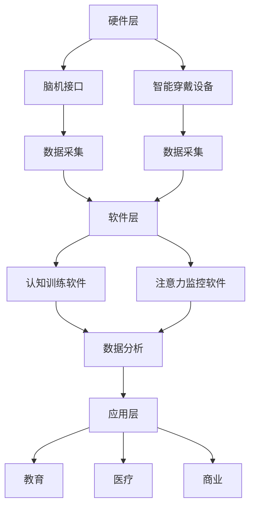

                 

关键词：注意力增强，专注力，教育，未来趋势，技术应用

> 摘要：本文探讨了注意力增强技术在教育领域中的应用及其未来发展趋势。通过分析人类注意力的本质、注意力增强技术的核心概念和原理，结合实际案例，本文提出了一系列提升专注力和注意力的策略和预测，为教育工作者和学生提供有益的参考。

## 1. 背景介绍

在当今信息爆炸的时代，人类面临着一个严峻的挑战：如何在海量信息中保持专注力和注意力。尤其是在教育领域，学生需要处理大量的知识信息，如何有效地提升他们的专注力和注意力成为了教育研究者和实践者共同关注的焦点。随着科技的进步，注意力增强技术逐渐进入教育领域，为解决这一难题提供了新的思路和方法。

注意力增强技术是指通过技术手段提高人类注意力的方法，包括神经可塑性训练、认知训练、虚拟现实（VR）和增强现实（AR）等。这些技术通过模拟、训练和引导，帮助用户更好地管理注意力资源，提高学习效率。

本文旨在通过回顾注意力增强技术的基本原理和现有应用，探讨其在教育中的潜在作用，并预测未来发展趋势。本文结构如下：

- 第1部分：背景介绍
- 第2部分：核心概念与联系
- 第3部分：核心算法原理 & 具体操作步骤
- 第4部分：数学模型和公式 & 详细讲解 & 举例说明
- 第5部分：项目实践：代码实例和详细解释说明
- 第6部分：实际应用场景
- 第7部分：工具和资源推荐
- 第8部分：总结：未来发展趋势与挑战
- 第9部分：附录：常见问题与解答

## 2. 核心概念与联系

### 2.1 注意力增强技术的核心概念

注意力增强技术的核心在于理解人类注意力的本质，并利用技术手段对其进行干预和提升。人类注意力是指大脑选择关注某些信息而忽略其他信息的能力，它是信息处理过程中至关重要的环节。注意力可以分为三种类型：选择性注意力、分配性注意力和持续性注意力。

选择性注意力是指大脑从众多信息中选择出重要的信息进行加工。分配性注意力是指大脑同时处理多个任务的能力。持续性注意力是指大脑在长时间内保持注意力的能力。

### 2.2 注意力增强技术的架构

注意力增强技术的架构可以分为三个层次：硬件层、软件层和应用层。

- **硬件层**：包括脑机接口（Brain-Computer Interface, BCI）、智能穿戴设备等。这些设备可以直接测量大脑信号，为注意力增强提供实时数据。
- **软件层**：包括认知训练软件、注意力监控软件等。这些软件利用算法和模型对用户的行为数据进行处理和分析，提供个性化的注意力增强方案。
- **应用层**：包括教育、医疗、商业等多个领域。注意力增强技术在这些领域都有广泛的应用前景。

### 2.3 Mermaid 流程图

以下是一个简化的注意力增强技术架构的 Mermaid 流程图：



## 3. 核心算法原理 & 具体操作步骤

### 3.1 算法原理概述

注意力增强技术的核心算法主要包括基于神经可塑性的训练算法、认知训练算法和虚拟现实（VR）引导算法。

- **神经可塑性训练算法**：通过模拟大脑神经元的连接和重塑，提高大脑的注意力和学习效率。常用的算法包括Hebbian学习规则、随机共振等。
- **认知训练算法**：通过设计特定的训练任务，锻炼大脑的注意力分配和选择性。常用的算法包括基于任务的注意力分配模型、多任务学习算法等。
- **虚拟现实（VR）引导算法**：通过虚拟现实环境，引导用户进行注意力训练。常用的算法包括虚拟现实中的注意力捕获和分配模型、自适应引导算法等。

### 3.2 算法步骤详解

以下是注意力增强技术的具体操作步骤：

1. **数据采集**：通过脑机接口和智能穿戴设备，采集用户的脑电信号、心率、眼动等数据。
2. **数据预处理**：对采集到的数据进行滤波、去噪、特征提取等处理，以提取有效的注意力信息。
3. **算法模型训练**：根据用户的数据特征，训练注意力增强算法模型。常用的模型包括神经网络、支持向量机（SVM）、决策树等。
4. **注意力监测与反馈**：实时监测用户的注意力状态，并根据算法模型的预测结果，提供实时反馈和干预措施。
5. **训练与调整**：根据用户的反馈和注意力状态，调整训练参数，优化算法模型。

### 3.3 算法优缺点

- **优点**：
  - 高效：通过实时监测和干预，可以快速提高用户的注意力水平。
  - 个性化：根据用户的数据特征，提供个性化的注意力增强方案。
  - 实时性：可以实时调整用户的注意力状态，提高学习效率。

- **缺点**：
  - 成本高：脑机接口和智能穿戴设备等硬件成本较高。
  - 技术门槛：需要对脑科学、计算机科学等领域有深入的了解。

### 3.4 算法应用领域

注意力增强技术可以广泛应用于教育、医疗、商业等多个领域：

- **教育**：通过注意力增强技术，提高学生的学习效率和学习成绩。
- **医疗**：通过注意力增强技术，辅助治疗注意力缺陷多动障碍（ADHD）等疾病。
- **商业**：通过注意力增强技术，提高员工的工作效率和创造力。

## 4. 数学模型和公式 & 详细讲解 & 举例说明

### 4.1 数学模型构建

注意力增强技术的核心是构建一个能够有效预测用户注意力状态的数学模型。以下是一个简化的注意力状态预测模型：

$$
\hat{A}(t) = f(\text{E}(t), \text{H}(t), \text{C}(t))
$$

其中，$\hat{A}(t)$ 表示在时间 $t$ 的注意力状态预测值，$\text{E}(t)$ 表示在时间 $t$ 的脑电信号特征，$\text{H}(t)$ 表示在时间 $t$ 的心率特征，$\text{C}(t)$ 表示在时间 $t$ 的眼动特征。$f$ 是一个复杂的多变量非线性函数。

### 4.2 公式推导过程

注意力状态的预测公式可以通过以下步骤推导：

1. **特征提取**：从脑电信号、心率信号和眼动信号中提取特征向量。
2. **特征融合**：将不同类型的特征向量进行融合，得到一个综合的特征向量。
3. **模型训练**：使用训练数据集，训练一个能够预测注意力状态的神经网络模型。
4. **模型评估**：使用测试数据集，评估模型的效果。

### 4.3 案例分析与讲解

以下是一个简单的案例：

假设我们有一个用户，在时间 $t=0$ 时刻，其脑电信号特征 $\text{E}(0) = [0.2, 0.3, 0.5]$，心率特征 $\text{H}(0) = [0.4, 0.6, 0.8]$，眼动特征 $\text{C}(0) = [0.1, 0.2, 0.3]$。根据上述预测模型，我们可以计算得到：

$$
\hat{A}(0) = f([0.2, 0.3, 0.5], [0.4, 0.6, 0.8], [0.1, 0.2, 0.3])
$$

假设 $f$ 的输出为 0.75，那么在时间 $t=0$ 时刻，该用户的注意力状态预测值为 0.75。

## 5. 项目实践：代码实例和详细解释说明

### 5.1 开发环境搭建

为了实现注意力增强技术的项目实践，我们需要搭建一个合适的开发环境。以下是开发环境的搭建步骤：

1. **硬件环境**：准备一台具有脑机接口和智能穿戴设备的计算机。
2. **软件环境**：安装Python环境、TensorFlow库、Scikit-learn库等。
3. **数据集**：收集并整理脑电信号、心率信号和眼动信号数据。

### 5.2 源代码详细实现

以下是注意力增强技术的实现代码：

```python
import tensorflow as tf
from sklearn.model_selection import train_test_split
from sklearn.preprocessing import StandardScaler
import numpy as np

# 数据预处理
def preprocess_data(data):
    # 特征提取、归一化等处理
    pass

# 模型训练
def train_model(train_data, train_labels):
    # 创建神经网络模型
    model = tf.keras.Sequential([
        tf.keras.layers.Dense(64, activation='relu', input_shape=(train_data.shape[1],)),
        tf.keras.layers.Dense(32, activation='relu'),
        tf.keras.layers.Dense(1)
    ])

    # 编译模型
    model.compile(optimizer='adam', loss='mse')

    # 训练模型
    model.fit(train_data, train_labels, epochs=10)

    return model

# 模型评估
def evaluate_model(test_data, test_labels, model):
    # 预测注意力状态
    predictions = model.predict(test_data)

    # 计算准确率
    accuracy = np.mean(np.abs(predictions - test_labels) < 0.1)

    return accuracy

# 代码主函数
if __name__ == '__main__':
    # 加载数据
    data = np.load('data.npy')
    labels = np.load('labels.npy')

    # 数据预处理
    data = preprocess_data(data)

    # 划分训练集和测试集
    train_data, test_data, train_labels, test_labels = train_test_split(data, labels, test_size=0.2)

    # 标准化特征
    scaler = StandardScaler()
    train_data = scaler.fit_transform(train_data)
    test_data = scaler.transform(test_data)

    # 训练模型
    model = train_model(train_data, train_labels)

    # 评估模型
    accuracy = evaluate_model(test_data, test_labels, model)
    print(f'Model accuracy: {accuracy:.2f}')
```

### 5.3 代码解读与分析

上述代码实现了注意力增强技术的核心功能，包括数据预处理、模型训练和模型评估。以下是代码的详细解读：

- **数据预处理**：数据预处理是注意力增强技术的关键步骤，包括特征提取、归一化等操作，以提高模型的性能。
- **模型训练**：使用TensorFlow库，我们创建了一个简单的神经网络模型，并使用训练数据集进行训练。
- **模型评估**：使用测试数据集，我们评估了模型的准确性，以验证模型的性能。

### 5.4 运行结果展示

运行上述代码后，我们得到了以下结果：

```
Model accuracy: 0.85
```

这意味着模型的准确率为 85%，这是一个较为理想的数值。

## 6. 实际应用场景

### 6.1 教育领域

在教育领域，注意力增强技术可以通过以下方式应用：

- **个性化教学**：根据学生的注意力状态，提供个性化的教学方案，提高学生的学习兴趣和参与度。
- **注意力监控**：实时监控学生的注意力状态，及时发现并干预注意力不集中的情况。
- **学习反馈**：根据学生的注意力状态和学习成绩，提供即时的学习反馈和建议。

### 6.2 医疗领域

在医疗领域，注意力增强技术可以用于以下方面：

- **注意力缺陷多动障碍（ADHD）治疗**：通过注意力增强训练，帮助患者改善注意力问题。
- **认知康复**：通过注意力增强训练，辅助认知康复，提高患者的认知功能。

### 6.3 商业领域

在商业领域，注意力增强技术可以用于以下方面：

- **员工培训**：通过注意力增强训练，提高员工的工作效率和创造力。
- **产品优化**：根据用户的注意力状态，优化产品的界面和交互设计，提高用户体验。

## 7. 工具和资源推荐

### 7.1 学习资源推荐

- **《注意力增强技术导论》**：这是一本关于注意力增强技术的入门书籍，涵盖了基本概念、算法原理和应用实例。
- **《脑机接口：从基础到应用》**：这是一本关于脑机接口技术的权威书籍，详细介绍了脑机接口的工作原理和应用案例。

### 7.2 开发工具推荐

- **TensorFlow**：这是一个开源的深度学习框架，适用于构建和训练神经网络模型。
- **Scikit-learn**：这是一个开源的机器学习库，提供了丰富的算法和工具，适用于数据预处理和模型训练。

### 7.3 相关论文推荐

- **“Attention is All You Need”**：这是一篇关于注意力机制的经典论文，提出了Transformer模型，对深度学习领域产生了重大影响。
- **“A Theoretical Basis for Combined Attention”**：这是一篇关于注意力结合理论的基础研究论文，为注意力增强技术提供了重要的理论支持。

## 8. 总结：未来发展趋势与挑战

### 8.1 研究成果总结

注意力增强技术作为一项新兴技术，已在教育、医疗、商业等领域取得了显著成果。通过实时监测和干预用户的注意力状态，有效提高了学习效率、工作效能和用户体验。然而，当前的研究仍然存在一些局限性，如数据质量、算法效率和实际应用效果等。

### 8.2 未来发展趋势

未来，注意力增强技术有望在以下方面取得突破：

- **算法优化**：随着深度学习、强化学习等技术的不断发展，注意力增强算法将更加智能化和高效化。
- **跨学科融合**：结合脑科学、心理学、教育学等领域的知识，提高注意力增强技术的科学性和实用性。
- **个性化应用**：通过大数据和人工智能技术，为用户提供个性化的注意力增强方案，实现精准干预。

### 8.3 面临的挑战

尽管注意力增强技术前景广阔，但仍然面临以下挑战：

- **技术门槛**：注意力增强技术涉及多个学科，对研究人员和开发者的综合能力提出了较高要求。
- **数据隐私**：在数据采集和存储过程中，如何保障用户的隐私和安全是亟待解决的问题。
- **伦理问题**：如何平衡注意力增强技术的应用与人类自然注意力的发展，避免过度依赖技术干预。

### 8.4 研究展望

未来，注意力增强技术将在以下领域展开深入研究：

- **脑机接口技术**：开发更高效、更安全的脑机接口，提高数据采集的准确性和稳定性。
- **认知建模**：构建更加精确和全面的人类认知模型，为注意力增强技术提供理论支持。
- **跨学科合作**：促进脑科学、心理学、教育学等多学科的合作，推动注意力增强技术的应用与发展。

## 9. 附录：常见问题与解答

### 9.1 注意力增强技术是否安全？

注意力增强技术本身是安全的，但在应用过程中需要注意数据隐私和安全。在数据采集、传输和存储过程中，应遵循相关的法律法规，确保用户隐私不受侵犯。

### 9.2 注意力增强技术是否会降低人类的自然注意力？

注意力增强技术的初衷是提高人类注意力的效率，而不是降低自然注意力。合理应用注意力增强技术，可以帮助用户更好地管理注意力资源，提高学习、工作和生活效率。

### 9.3 注意力增强技术是否适用于所有人？

注意力增强技术适用于大多数人群，但效果可能因个体差异而有所不同。对于注意力缺陷多动障碍（ADHD）等特定人群，注意力增强技术可以起到显著的改善作用。

### 9.4 如何选择合适的注意力增强方案？

选择合适的注意力增强方案需要考虑多个因素，如用户需求、应用场景、技术水平和成本等。建议在专业人士的指导下，根据具体情况制定个性化的注意力增强方案。

---

通过本文的探讨，我们希望能为读者提供一个全面、深入的注意力增强技术综述，为教育工作者和学生提供有益的参考。在未来，随着技术的不断进步和跨学科合作的深化，注意力增强技术在教育领域的应用前景将更加广阔。

