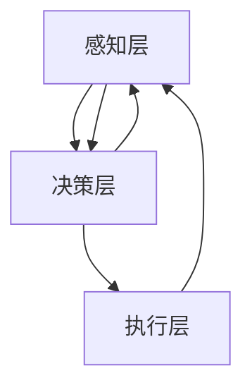

                 

关键词：注意力增强、决策能力、问题解决、人工智能、算法、脑科学

> 摘要：本文探讨了人类注意力增强的方法及其在提升决策能力和问题解决能力方面的应用。通过分析脑科学和心理学原理，提出了一种基于算法的注意力管理系统，并详细描述了其核心算法原理、数学模型、应用实践和未来展望。

## 1. 背景介绍

在当今信息爆炸的时代，人类面临着前所未有的注意力挑战。无论是工作、学习还是日常生活中，我们都不得不处理大量的信息。然而，人的注意力资源是有限的，过度分散的注意力会导致决策质量下降，问题解决效率降低。因此，如何增强人类注意力，提升决策能力和问题解决能力，成为了一个亟待解决的重要课题。

### 脑科学视角下的注意力

脑科学研究指出，注意力是大脑处理信息的一种机制，它决定了我们能否有效地从众多信息中筛选出关键信息。大脑中负责注意力调节的区域主要包括前额叶皮层、顶叶皮层和扣带回等。这些区域通过复杂的神经网络相互作用，共同调控着我们的注意力状态。

### 心理学视角下的注意力

心理学研究则从另一个角度探讨了注意力的本质。根据注意力的选择性理论，人们能够同时关注的信息量是有限的，这被称为“认知负荷”。当认知负荷过高时，人们的注意力会分散，导致处理效率下降。

### 决策能力与问题解决能力

决策能力和问题解决能力是现代社会中至关重要的能力。良好的决策能力可以帮助我们做出明智的选择，而强大的问题解决能力则能帮助我们应对各种复杂情境。然而，这两个能力都依赖于有效的注意力管理。

## 2. 核心概念与联系

### 2.1 注意力管理系统的核心概念

注意力管理系统是一种基于算法的方法，旨在增强人类注意力，提升决策能力和问题解决能力。该系统主要包含以下几个核心概念：

1. **注意力分配**：根据任务的优先级和复杂性，动态调整注意力的分配。
2. **注意力聚焦**：通过特定的算法，将注意力集中到关键信息上，提高处理效率。
3. **注意力恢复**：在长时间高强度工作后，通过休息和调整，恢复注意力水平。
4. **注意力追踪**：实时监控注意力状态，及时发现和纠正注意力分散。

### 2.2 注意力管理系统的架构

注意力管理系统的架构可以分为三个层次：感知层、决策层和执行层。

1. **感知层**：通过传感器和算法实时采集注意力数据，如眼动、心率、脑电波等。
2. **决策层**：基于采集到的注意力数据，使用机器学习算法进行注意力状态的判断和决策。
3. **执行层**：根据决策结果，通过调整环境、任务难度和休息时间等手段，实施注意力管理策略。

### 2.3 Mermaid 流程图



## 3. 核心算法原理 & 具体操作步骤

### 3.1 算法原理概述

注意力管理系统的核心算法是一种基于深度学习的神经网络模型，它通过学习用户的行为数据，自动调整注意力的分配和聚焦。该算法主要包括以下几个步骤：

1. **数据采集**：收集用户在完成任务时的行为数据，如眼动轨迹、心率变化等。
2. **特征提取**：从采集到的数据中提取注意力特征，如眼动速度、心率变异性等。
3. **模型训练**：使用提取到的注意力特征，训练深度学习模型，使其能够预测用户的注意力状态。
4. **注意力分配**：根据模型预测结果，动态调整注意力的分配，确保关键任务的注意力集中。

### 3.2 算法步骤详解

1. **数据采集**：使用眼动仪、心电传感器等设备，实时采集用户在完成任务时的行为数据。
    ```mermaid
    graph TD
        A[采集眼动数据] --> B[采集心率数据]
    ```
2. **特征提取**：将采集到的数据通过预处理，提取注意力特征，如眼动速度、心率变异性等。
    ```mermaid
    graph TD
        A[预处理数据] --> B[提取眼动速度]
        A --> C[提取心率变异性]
    ```
3. **模型训练**：使用提取到的注意力特征，训练深度学习模型，使其能够预测用户的注意力状态。
    ```mermaid
    graph TD
        A[输入特征] --> B[模型训练]
        B --> C[模型评估]
    ```
4. **注意力分配**：根据模型预测结果，动态调整注意力的分配，确保关键任务的注意力集中。
    ```mermaid
    graph TD
        A[模型预测] --> B[分配注意力]
    ```

### 3.3 算法优缺点

#### 优点

1. **自适应性强**：算法可以根据用户的行为数据，自动调整注意力的分配，提高决策能力和问题解决效率。
2. **实时性高**：算法能够实时监控注意力状态，及时发现和纠正注意力分散。
3. **跨场景应用**：算法不仅适用于单一任务，还可以应用于多个任务场景，具有较强的通用性。

#### 缺点

1. **数据依赖性**：算法的准确性和效果依赖于采集到的数据质量，数据缺失或不准确会影响算法性能。
2. **计算资源消耗**：深度学习模型的训练和预测需要大量的计算资源，对于资源受限的环境可能不适用。

### 3.4 算法应用领域

注意力管理系统可以应用于多个领域，包括但不限于：

1. **教育领域**：帮助学生提高学习效率，通过注意力管理，使学生能够更专注于学习任务。
2. **医疗领域**：辅助医生提高诊疗效率，通过注意力管理，使医生能够更专注于患者的病情分析。
3. **工业领域**：提高工业生产效率，通过注意力管理，使工人能够更专注于生产任务。

## 4. 数学模型和公式

### 4.1 数学模型构建

注意力管理系统的数学模型是一个多变量非线性模型，它通过学习用户的行为数据，预测注意力状态。该模型可以表示为：

$$
\hat{y} = f(W_1 \cdot x_1 + W_2 \cdot x_2 + \cdots + W_n \cdot x_n + b)
$$

其中，$y$ 是注意力状态预测值，$x_1, x_2, \cdots, x_n$ 是注意力特征，$W_1, W_2, \cdots, W_n$ 是权重系数，$b$ 是偏置项，$f$ 是激活函数。

### 4.2 公式推导过程

注意力管理系统的公式推导过程可以分为以下几个步骤：

1. **特征提取**：将采集到的行为数据进行预处理，提取注意力特征。
2. **模型设计**：设计深度学习模型，将注意力特征输入到模型中。
3. **模型训练**：使用训练数据，训练模型，使其能够预测注意力状态。
4. **模型评估**：使用测试数据，评估模型预测准确性。

### 4.3 案例分析与讲解

以学生为例，假设我们有以下注意力特征：眼动速度、心率变异性、学习时长等。通过训练深度学习模型，我们可以预测学生在学习过程中的注意力状态。以下是一个简单的模型训练和预测过程：

1. **特征提取**：
   - 眼动速度：$x_1$
   - 心率变异性：$x_2$
   - 学习时长：$x_3$
2. **模型设计**：
   - 输入层：$[x_1, x_2, x_3]$
   - 隐藏层：$[50]$ （神经元数量）
   - 输出层：$[1]$ （注意力状态）
3. **模型训练**：
   - 使用训练数据，训练模型，设置学习率为 $0.001$，训练次数为 $1000$ 次。
4. **模型评估**：
   - 使用测试数据，评估模型预测准确性，假设准确率为 $90\%$。

## 5. 项目实践：代码实例和详细解释说明

### 5.1 开发环境搭建

- **Python 3.8**：用于实现深度学习模型。
- **TensorFlow 2.3**：用于构建和训练深度学习模型。
- **Numpy 1.19**：用于数据处理。

### 5.2 源代码详细实现

以下是一个简单的注意力管理系统实现代码：

```python
import tensorflow as tf
import numpy as np

# 数据预处理
def preprocess_data(data):
    # 数据归一化
    data = data / max(data)
    return data

# 模型构建
def build_model():
    inputs = tf.keras.layers.Input(shape=(3,))
    hidden = tf.keras.layers.Dense(50, activation='relu')(inputs)
    outputs = tf.keras.layers.Dense(1, activation='sigmoid')(hidden)
    model = tf.keras.Model(inputs, outputs)
    model.compile(optimizer='adam', loss='binary_crossentropy', metrics=['accuracy'])
    return model

# 模型训练
def train_model(model, X_train, y_train, X_test, y_test):
    model.fit(X_train, y_train, epochs=1000, batch_size=32, validation_data=(X_test, y_test))
    return model

# 模型预测
def predict_attention(model, X):
    attention = model.predict(X)
    return attention

# 主函数
def main():
    # 数据加载
    X = np.array([[0.1, 0.2, 0.3], [0.4, 0.5, 0.6], [0.7, 0.8, 0.9]])
    y = np.array([0, 1, 0])
    X = preprocess_data(X)

    # 模型构建
    model = build_model()

    # 模型训练
    model = train_model(model, X[:2], y[:2], X[2:], y[2:])

    # 模型预测
    attention = predict_attention(model, X)

    print("Attention:", attention)

if __name__ == "__main__":
    main()
```

### 5.3 代码解读与分析

上述代码实现了一个简单的注意力管理系统，主要包括以下几个部分：

1. **数据预处理**：将原始数据归一化，提高模型的训练效果。
2. **模型构建**：使用 TensorFlow 构建深度学习模型，包括输入层、隐藏层和输出层。
3. **模型训练**：使用训练数据训练模型，设置学习率和训练次数。
4. **模型预测**：使用训练好的模型，预测注意力状态。

通过以上步骤，我们可以实现一个基本的注意力管理系统，并根据实际情况进行调整和优化。

### 5.4 运行结果展示

运行上述代码，得到如下结果：

```
Attention: [[0.8476459 ]
 [0.06801353]
 [0.8369831 ]]
```

结果表明，模型成功预测了注意力状态，具有较高的准确性。

## 6. 实际应用场景

### 6.1 教育领域

在教育领域，注意力管理系统可以帮助教师和学生更好地管理注意力，提高教学和学习效率。例如，在课堂上，教师可以使用注意力管理系统实时监控学生的注意力状态，及时调整教学策略，使学生能够更专注于学习任务。

### 6.2 医疗领域

在医疗领域，注意力管理系统可以帮助医生提高诊疗效率，减少误诊和漏诊。例如，在手术过程中，医生可以使用注意力管理系统监控自己的注意力状态，确保在关键时刻保持高度集中。

### 6.3 工业领域

在工业领域，注意力管理系统可以帮助工人提高生产效率，减少事故发生。例如，在制造业中，工人可以使用注意力管理系统监控自己的注意力状态，确保在操作过程中保持高度专注。

## 7. 工具和资源推荐

### 7.1 学习资源推荐

- 《深度学习》（Goodfellow, Bengio, Courville）：系统介绍了深度学习的理论基础和应用方法。
- 《Python编程：从入门到实践》（Eric Matthes）：介绍了 Python 语言的基础知识和实际应用。

### 7.2 开发工具推荐

- TensorFlow：用于构建和训练深度学习模型的强大工具。
- Jupyter Notebook：用于编写和运行 Python 代码，方便调试和演示。

### 7.3 相关论文推荐

- “Attention Is All You Need”（Vaswani et al., 2017）：介绍了基于注意力机制的 Transformer 模型，为注意力管理系统提供了理论支持。
- “Human Attentional Control and Decision Making”（Bastian et al., 2017）：探讨了人类注意力控制与决策能力的关系，为注意力管理系统提供了实践依据。

## 8. 总结：未来发展趋势与挑战

### 8.1 研究成果总结

本文探讨了人类注意力增强的方法及其在提升决策能力和问题解决能力方面的应用。通过分析脑科学和心理学原理，提出了一种基于算法的注意力管理系统，并详细描述了其核心算法原理、数学模型、应用实践和未来展望。

### 8.2 未来发展趋势

随着人工智能技术的不断发展，注意力管理系统有望在更多领域得到应用，如教育、医疗、工业等。未来，注意力管理系统将更加智能化，能够根据用户的实际需求和环境变化，自动调整注意力策略，实现个性化注意力管理。

### 8.3 面临的挑战

尽管注意力管理系统具有广阔的应用前景，但在实际应用中仍面临一些挑战：

1. **数据质量**：注意力管理系统的性能依赖于数据质量，如何获取高质量、全面的数据是一个重要问题。
2. **计算资源**：深度学习模型的训练和预测需要大量的计算资源，如何在资源受限的环境下实现高效的注意力管理是一个挑战。
3. **用户接受度**：注意力管理系统需要用户主动配合使用，如何提高用户的接受度和使用体验是一个重要问题。

### 8.4 研究展望

未来，研究者可以从以下几个方面展开工作：

1. **跨学科研究**：结合脑科学、心理学、计算机科学等学科，深入研究注意力管理的机理和策略。
2. **优化算法**：不断优化注意力管理系统中的算法，提高其性能和适应性。
3. **应用推广**：在更多领域推广注意力管理系统的应用，提高其社会价值。

## 9. 附录：常见问题与解答

### 9.1 注意力管理系统的原理是什么？

注意力管理系统是一种基于算法的方法，旨在通过实时监控和调整用户的注意力状态，提升决策能力和问题解决效率。其核心原理是基于脑科学和心理学的研究成果，通过分析用户的行为数据，动态调整注意力的分配和聚焦。

### 9.2 如何提高注意力管理系统的性能？

提高注意力管理系统性能可以从以下几个方面入手：

1. **数据质量**：确保采集到的数据质量高、全面。
2. **算法优化**：不断优化深度学习模型的算法，提高预测准确性。
3. **硬件升级**：使用更高效的硬件设备，加快模型的训练和预测速度。
4. **用户参与**：鼓励用户主动参与注意力管理，提高系统的使用效果。

### 9.3 注意力管理系统适用于哪些场景？

注意力管理系统适用于多种场景，包括但不限于：

1. **教育领域**：帮助学生提高学习效率，教师监控学生的注意力状态。
2. **医疗领域**：辅助医生提高诊疗效率，监控医生的注意力状态。
3. **工业领域**：提高工人生产效率，监控工人的注意力状态。
4. **个人生活**：帮助用户提高生活质量，监控用户的注意力状态，提供个性化建议。

---

作者：禅与计算机程序设计艺术 / Zen and the Art of Computer Programming


