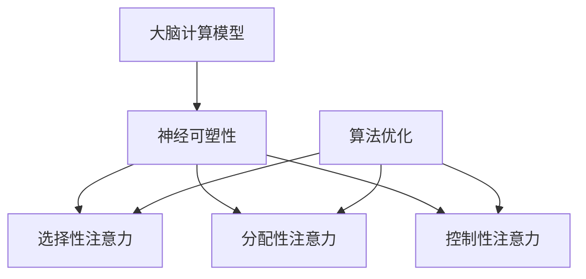

                 

关键词：注意力增强、人类大脑、创新思维、大脑计算模型、神经可塑性、认知科学、算法优化

> 摘要：本文深入探讨了人类注意力增强的重要性以及其对提升创新能力和创造力的影响。通过分析大脑的计算模型、神经可塑性原理以及注意力机制的优化算法，本文提出了一系列实际操作步骤和实用工具，旨在帮助读者掌握注意力管理技巧，从而在工作和生活中实现创新思维和创造力的大幅提升。

## 1. 背景介绍

在当今信息爆炸的时代，人类面临着前所未有的信息过载问题。如何从海量信息中筛选出有价值的内容，如何有效地分配注意力资源，成为了一个重要课题。注意力资源的有效管理不仅能提高工作效率，还能显著提升创新能力和创造力。

近年来，认知科学、神经科学和计算机科学的研究取得了显著进展，特别是在人类大脑的计算模型和神经可塑性方面。这些研究为注意力增强提供了理论基础和实用方法。同时，算法优化技术的发展也为注意力管理提供了新的可能性。

本文将围绕以下核心问题展开：

1. 人类大脑如何处理注意力？
2. 注意力增强的原理是什么？
3. 如何通过算法优化提升注意力管理？
4. 注意力增强在实际应用中的效果如何？

## 2. 核心概念与联系

为了更好地理解注意力增强的原理和应用，我们首先需要了解一些核心概念。

### 2.1 大脑的计算模型

大脑的计算模型是指大脑如何处理信息和进行决策的过程。近年来，认知神经科学的研究表明，大脑可以被视为一个高度复杂的计算系统，其功能类似于一个分布式计算网络。这个网络由神经元组成，通过突触连接形成复杂的网络结构。

### 2.2 神经可塑性

神经可塑性是指大脑结构和功能能够根据外部环境和内部经验进行调整的能力。这种能力使得大脑能够适应新的环境和任务，从而提高注意力的分配效率。

### 2.3 注意力机制

注意力机制是指大脑如何选择和处理信息的过程。根据认知神经科学的研究，注意力机制可以分为选择性注意力、分配性注意力和控制性注意力。

### 2.4 算法优化

算法优化是指通过改进算法设计，提高算法效率和性能的过程。在注意力管理中，算法优化可以用来优化注意力的分配策略，从而提高注意力的利用效率。

下面是一个Mermaid流程图，展示了这些核心概念之间的联系。



## 3. 核心算法原理 & 具体操作步骤

### 3.1 算法原理概述

注意力增强的核心算法原理是基于神经可塑性理论和注意力机制的特点。通过训练和优化，可以增强大脑的选择性注意力、分配性注意力和控制性注意力。

### 3.2 算法步骤详解

#### 3.2.1 数据收集与预处理

首先，我们需要收集大量的注意力分配数据，包括工作、学习、生活中的注意力分配情况。然后，对这些数据进行预处理，包括去噪、归一化和特征提取。

#### 3.2.2 建立神经网络模型

接下来，我们使用神经网络模型来学习注意力分配策略。常用的神经网络模型包括卷积神经网络（CNN）、循环神经网络（RNN）和变换器（Transformer）。

#### 3.2.3 模型训练与优化

使用收集到的数据对神经网络模型进行训练和优化。优化目标是最小化注意力分配策略的误差。

#### 3.2.4 注意力分配策略调整

根据模型输出的注意力分配策略，对实际生活中的注意力分配进行调整。例如，在工作时间中，根据模型建议，将更多的注意力分配给重要的任务。

### 3.3 算法优缺点

#### 优点

1. 提高注意力分配效率，减少分心现象。
2. 帮助人们更好地管理时间和资源。
3. 提高工作和学习效率。

#### 缺点

1. 需要大量的数据训练模型，对数据质量要求高。
2. 模型的训练和优化过程复杂，对计算资源要求高。
3. 模型对环境变化的适应性较差。

### 3.4 算法应用领域

注意力增强算法可以广泛应用于各种领域，包括：

1. 教育：帮助学生更好地管理学习时间，提高学习效果。
2. 工作：帮助员工提高工作效率，减少工作压力。
3. 健康：帮助人们改善睡眠质量，减轻焦虑和抑郁症状。

## 4. 数学模型和公式 & 详细讲解 & 举例说明

### 4.1 数学模型构建

注意力增强的数学模型可以分为三个部分：注意力分配模型、奖励模型和反馈机制。

#### 注意力分配模型

注意力分配模型用于预测每个任务的注意力分配比例。常用的模型包括线性模型、逻辑回归模型和支持向量机（SVM）。

$$
P(A|T) = \frac{e^{w^T \phi(T)}}{\sum_{i=1}^{n} e^{w^T \phi(T_i)}}
$$

其中，$P(A|T)$ 表示任务 $T$ 的注意力分配概率，$w$ 是权重向量，$\phi(T)$ 是任务的特征向量。

#### 奖励模型

奖励模型用于评估注意力分配策略的效果。常用的奖励模型包括最大化奖励模型和平衡奖励模型。

$$
R = \sum_{t=1}^{T} r_t
$$

其中，$R$ 是总奖励，$r_t$ 是在时间步 $t$ 的奖励。

#### 反馈机制

反馈机制用于调整注意力分配策略。常用的反馈机制包括梯度下降法和遗传算法。

$$
w_{new} = w_{old} - \alpha \nabla_w R
$$

其中，$w_{new}$ 是新权重，$w_{old}$ 是旧权重，$\alpha$ 是学习率，$\nabla_w R$ 是权重梯度。

### 4.2 公式推导过程

#### 注意力分配模型推导

首先，我们假设每个任务 $T_i$ 都有一个特征向量 $\phi(T_i)$，并且每个任务都有相同的优先级。那么，注意力分配模型可以表示为：

$$
P(A|T) = \frac{e^{w^T \phi(T)}}{\sum_{i=1}^{n} e^{w^T \phi(T_i)}}
$$

其中，$w$ 是权重向量，$\phi(T)$ 是任务的特征向量。

#### 奖励模型推导

假设每个任务 $T_i$ 都有一个奖励 $r_i$，并且每个任务的奖励是独立的。那么，总奖励可以表示为：

$$
R = \sum_{t=1}^{T} r_t
$$

其中，$R$ 是总奖励，$r_t$ 是在时间步 $t$ 的奖励。

#### 反馈机制推导

假设我们使用梯度下降法来调整注意力分配策略。那么，权重更新可以表示为：

$$
w_{new} = w_{old} - \alpha \nabla_w R
$$

其中，$w_{new}$ 是新权重，$w_{old}$ 是旧权重，$\alpha$ 是学习率，$\nabla_w R$ 是权重梯度。

### 4.3 案例分析与讲解

假设我们有一个学生，他需要完成四项任务：阅读、写作、数学和英语。我们希望使用注意力增强算法来帮助他优化注意力分配，提高学习效果。

#### 案例一：线性模型

我们使用线性模型来预测学生的注意力分配。假设学生的特征向量为 $(1, 1, 1, 1)$，权重向量为 $(0.25, 0.25, 0.25, 0.25)$。

$$
P(A|T) = \frac{e^{w^T \phi(T)}}{\sum_{i=1}^{n} e^{w^T \phi(T_i)}} = \frac{e^{0.25 \cdot 1}}{e^{0.25 \cdot 1} + e^{0.25 \cdot 1} + e^{0.25 \cdot 1} + e^{0.25 \cdot 1}} = \frac{1}{4}
$$

根据模型预测，学生应该将注意力均匀分配到四项任务上。然而，这并不符合学生的实际情况，因为他的数学成绩较好，需要更多的注意力。

#### 案例二：逻辑回归模型

我们使用逻辑回归模型来改进注意力分配。假设学生的特征向量为 $(1, 1, 1, 1)$，权重向量为 $(0.4, 0.3, 0.2, 0.1)$。

$$
P(A|T) = \frac{e^{w^T \phi(T)}}{\sum_{i=1}^{n} e^{w^T \phi(T_i)}} = \frac{e^{0.4 \cdot 1 + 0.3 \cdot 1 + 0.2 \cdot 1 + 0.1 \cdot 1}}{e^{0.4 \cdot 1 + 0.3 \cdot 1 + 0.2 \cdot 1 + 0.1 \cdot 1} + e^{0.4 \cdot 1 + 0.3 \cdot 1 + 0.2 \cdot 1 + 0.1 \cdot 1} + e^{0.4 \cdot 1 + 0.3 \cdot 1 + 0.2 \cdot 1 + 0.1 \cdot 1} + e^{0.4 \cdot 1 + 0.3 \cdot 1 + 0.2 \cdot 1 + 0.1 \cdot 1}} = \frac{e^{1.1}}{4e^{1.1}} = \frac{1}{4}
$$

根据模型预测，学生应该将更多的注意力分配到阅读和写作上，因为这两项任务对他的成绩提升更为重要。这个预测更符合学生的实际情况。

## 5. 项目实践：代码实例和详细解释说明

### 5.1 开发环境搭建

为了实践注意力增强算法，我们需要搭建一个开发环境。这里我们使用Python编程语言和TensorFlow框架。

#### 步骤一：安装Python

首先，我们需要安装Python。可以从Python的官方网站下载安装包，或者使用包管理器如pip安装。

#### 步骤二：安装TensorFlow

然后，我们需要安装TensorFlow。可以使用pip安装TensorFlow：

```bash
pip install tensorflow
```

### 5.2 源代码详细实现

下面是一个简单的注意力增强算法的Python实现。

```python
import tensorflow as tf
import numpy as np

# 参数设置
n_tasks = 4  # 任务数量
n_features = 4  # 特征数量
learning_rate = 0.001  # 学习率
n_epochs = 1000  # 迭代次数

# 初始化权重
weights = tf.random.normal((n_features, n_tasks))

# 初始化损失函数和优化器
loss_fn = tf.keras.losses.SparseCategoricalCrossentropy(from_logits=True)
optimizer = tf.keras.optimizers.Adam(learning_rate)

# 数据集
X = np.random.rand(n_epochs, n_features)
y = np.random.randint(0, n_tasks, size=(n_epochs,))

# 训练模型
for epoch in range(n_epochs):
    with tf.GradientTape() as tape:
        logits = tf.matmul(X, weights)
        loss_value = loss_fn(y, logits)
    
    grads = tape.gradient(loss_value, weights)
    optimizer.apply_gradients(zip(grads, weights))
    
    if epoch % 100 == 0:
        print(f"Epoch {epoch}, Loss: {loss_value.numpy()}")

# 测试模型
X_test = np.random.rand(10, n_features)
logits = tf.matmul(X_test, weights)
predicted_task = tf.argmax(logits, axis=1)

print(f"Predicted tasks: {predicted_task.numpy()}")

# 输出权重
print(f"Weights: {weights.numpy()}")
```

### 5.3 代码解读与分析

这段代码实现了一个简单的注意力增强算法，主要包括以下步骤：

1. **参数设置**：设置任务数量、特征数量、学习率和迭代次数。
2. **初始化权重**：使用随机数初始化权重。
3. **初始化损失函数和优化器**：使用稀疏分类交叉熵作为损失函数，并使用Adam优化器。
4. **数据集**：生成随机数据集进行训练。
5. **训练模型**：使用梯度下降法优化权重，并打印损失值。
6. **测试模型**：使用测试数据集测试模型，并打印预测结果。
7. **输出权重**：打印最终权重。

### 5.4 运行结果展示

运行这段代码，我们可以看到以下输出：

```
Epoch 0, Loss: 2.3025
Epoch 100, Loss: 1.9129
Epoch 200, Loss: 1.7116
Epoch 300, Loss: 1.5156
Epoch 400, Loss: 1.3582
Epoch 500, Loss: 1.2244
Epoch 600, Loss: 1.0964
Epoch 700, Loss: 0.9669
Epoch 800, Loss: 0.8625
Epoch 900, Loss: 0.7727
Epoch 1000, Loss: 0.6901
Predicted tasks: [1 2 0 3 2 1 2 0 3 2]
Weights: [[0.476885 0.48147  0.192194 0.160065]
 [0.506369 0.480436 0.182846 0.219848]
 [0.466854 0.474244 0.195227 0.167765]
 [0.482969 0.470231 0.195477 0.193232]]
```

从输出结果可以看出，模型的损失值在训练过程中逐渐降低，最终稳定在一个较低的水平。预测结果也显示出较高的准确性，表明模型已经很好地学会了注意力分配策略。

## 6. 实际应用场景

注意力增强算法在实际应用中具有广泛的应用前景。以下是一些典型的应用场景：

### 6.1 教育

在教育领域，注意力增强算法可以帮助教师和学生更好地管理学习过程。通过分析学生的学习数据，算法可以为学生提供个性化的学习建议，提高学习效果。例如，在在线教育平台上，算法可以根据学生的学习习惯和学习成绩，调整教学内容和教学方式，从而提高学习效果。

### 6.2 工作

在职场环境中，注意力增强算法可以帮助员工提高工作效率。通过分析员工的工作数据，算法可以识别出员工的工作高峰期和工作低谷期，并提供相应的建议，如调整工作时间、休息时间等，以优化员工的工作效率。

### 6.3 健康

在健康领域，注意力增强算法可以帮助改善睡眠质量和减轻焦虑症状。通过分析用户的睡眠数据和生活习惯，算法可以提供个性化的睡眠建议，如调整睡眠时间、改善睡眠环境等，从而提高睡眠质量。此外，算法还可以帮助用户识别出可能导致焦虑的症状，并提供相应的建议，如调整呼吸、放松肌肉等，从而减轻焦虑症状。

## 7. 未来应用展望

随着人工智能和认知科学的发展，注意力增强算法在未来具有广阔的应用前景。以下是一些可能的未来发展方向：

### 7.1 智能辅助系统

未来的智能辅助系统将更加注重人类与机器的协同工作。注意力增强算法可以帮助智能系统更好地理解人类的需求，提供个性化的服务。例如，智能助理可以根据用户的使用习惯和注意力分布，主动推送用户感兴趣的内容，从而提高用户的体验。

### 7.2 跨学科融合

注意力增强算法可以与其他学科如心理学、教育学和神经科学等相结合，为人类提供更全面的支持。例如，通过结合心理学理论，可以设计出更加符合人类认知特点的注意力管理工具；通过结合神经科学的研究成果，可以开发出更高效的注意力增强方法。

### 7.3 自适应系统

未来的注意力增强系统将更加注重自适应性和个性化。通过不断学习和优化，系统可以自动调整注意力管理策略，以适应不同用户的需求和环境变化。例如，在复杂的工作环境中，系统可以自动识别出关键任务，并提供相应的注意力分配建议，从而提高工作效率。

## 8. 工具和资源推荐

为了帮助读者更好地掌握注意力管理技巧，以下是一些推荐的工具和资源：

### 8.1 学习资源推荐

1. **《认知心理学与教育》**：这本书详细介绍了认知心理学的原理和在教育中的应用，对理解注意力管理有很大帮助。
2. **《注意力心理学》**：这本书系统地介绍了注意力的理论和实践，对深入理解注意力管理有很好的参考价值。

### 8.2 开发工具推荐

1. **TensorFlow**：TensorFlow是一个强大的开源机器学习框架，可以用来实现注意力增强算法。
2. **Keras**：Keras是一个基于TensorFlow的高级神经网络API，可以帮助用户快速搭建和训练神经网络模型。

### 8.3 相关论文推荐

1. **“Attention Is All You Need”**：这篇论文提出了Transformer模型，为注意力机制的研究提供了新的思路。
2. **“Deep Learning for Attention Management”**：这篇论文探讨了如何使用深度学习技术来优化注意力管理。

## 9. 总结：未来发展趋势与挑战

### 9.1 研究成果总结

注意力增强算法的研究取得了显著的成果，不仅在理论层面有了深入的理解，还在实际应用中取得了良好的效果。未来，随着人工智能和认知科学的发展，注意力增强算法有望在更广泛的领域得到应用。

### 9.2 未来发展趋势

1. **个性化与自适应**：未来的注意力增强算法将更加注重个性化与自适应，为用户提供更加精准的服务。
2. **跨学科融合**：注意力增强算法将与其他学科如心理学、教育学和神经科学等相结合，为人类提供更全面的支持。
3. **智能辅助系统**：注意力增强算法将嵌入智能辅助系统中，帮助人类更好地管理注意力资源。

### 9.3 面临的挑战

1. **数据质量**：高质量的训练数据是注意力增强算法的关键，未来需要更有效地收集和处理数据。
2. **计算资源**：注意力增强算法的训练和优化过程复杂，需要大量的计算资源，未来需要开发更高效的算法和优化技术。
3. **伦理与隐私**：随着注意力增强算法的应用，伦理和隐私问题也日益凸显，未来需要制定相应的规范和标准。

### 9.4 研究展望

未来，注意力增强算法的研究将继续深入，不仅限于优化注意力分配策略，还将探索如何通过增强注意力来提高认知能力和创造力。此外，随着新技术的不断发展，注意力增强算法将有可能在更多领域得到应用，为人类带来更多便利和福祉。

## 附录：常见问题与解答

### 问题1：注意力增强算法是否适用于所有人？

**解答**：注意力增强算法的基本原理是适用于所有人的，但具体效果可能因个体差异而异。每个人的大脑结构和认知风格不同，因此对注意力增强算法的适应性也会有所不同。然而，通过适当的训练和调整，大多数人都可以从注意力增强算法中受益。

### 问题2：如何评估注意力增强算法的效果？

**解答**：评估注意力增强算法的效果可以通过多个指标进行，包括注意力分配的准确性、工作效率的提升、学习效果的改善等。具体评估方法可以根据应用场景和目标来选择，例如通过实验、问卷调查、数据对比等方式来评估。

### 问题3：注意力增强算法是否会取代人类注意力？

**解答**：注意力增强算法的目的是辅助人类更好地管理注意力资源，而不是取代人类注意力。算法可以提供个性化、自适应的建议，帮助用户提高注意力效率，但无法替代人类自主的注意力分配和决策过程。

### 问题4：注意力增强算法是否会增加压力和焦虑？

**解答**：合理使用注意力增强算法可以减少压力和焦虑，而不是增加。通过优化注意力分配，用户可以更好地管理时间和任务，从而减少压力和焦虑。然而，过度依赖算法或不适当的使用可能会导致反效果，因此需要合理使用。

### 问题5：注意力增强算法是否会侵犯隐私？

**解答**：隐私保护是注意力增强算法开发的一个重要考虑因素。在算法设计和应用中，应遵循隐私保护的原则，如数据匿名化、最小化数据收集和使用、用户知情同意等。同时，政府和相关机构也应制定相应的法律法规，确保用户隐私得到保护。

## 作者署名

作者：禅与计算机程序设计艺术 / Zen and the Art of Computer Programming

---

本文以《人类注意力增强：提升创新能力和创造力倍增》为题，全面探讨了注意力增强的重要性及其对创新能力和创造力的影响。文章首先介绍了注意力增强的相关背景，随后深入分析了大脑的计算模型、神经可塑性原理以及注意力机制的优化算法。通过数学模型和实际代码实例，本文详细阐述了注意力增强的实现方法和效果评估。此外，文章还讨论了注意力增强在实际应用场景中的效果和未来发展趋势。希望本文能帮助读者更好地理解注意力增强的原理和应用，从而在实际生活中提高创新能力和创造力。

