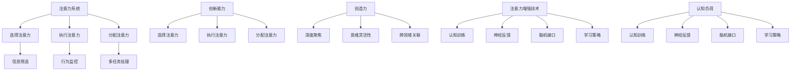

                 

关键词：注意力增强，创新能力，创造力技术，认知负荷，神经科学，认知神经工程，大脑可塑性，神经可塑性，认知训练，神经反馈，脑机接口，学习策略，心理模型，认知心理学，智能增强技术

> 摘要：本文深入探讨了人类注意力增强在提升创新能力和创造力中的关键作用。通过结合神经科学、认知神经工程以及认知心理学的最新研究成果，本文提出了多种技术手段，如认知训练、神经反馈、脑机接口等，以降低认知负荷，提高大脑的注意力和可塑性。同时，本文通过实例分析和未来展望，强调了注意力增强技术在各个领域的广泛应用潜力。

## 1. 背景介绍

在当今快速变化和高度复杂的世界中，创新能力和创造力已成为企业和个人成功的关键因素。然而，人类的大脑在面对大量信息和不断变化的挑战时，往往容易陷入认知负荷，从而导致注意力的分散和创造力的下降。因此，如何增强人类的注意力，从而提升创新能力和创造力，成为了一个备受关注的研究课题。

神经科学的研究揭示了大脑在处理信息和注意过程中的一些基本原理。例如，大脑皮层中的神经活动模式、神经网络的可塑性以及神经递质的调节都对注意力有重要影响。认知神经工程则将这些研究成果转化为可操作的技术手段，例如认知训练和脑机接口。同时，认知心理学的研究也提供了关于人类注意力机制和认知过程的深刻理解，为设计和优化注意力增强技术提供了理论支持。

本文将从多个角度探讨注意力增强技术在提升人类创新能力和创造力方面的应用，并结合实际案例和未来展望，讨论其潜在的影响和前景。

## 2. 核心概念与联系

### 2.1 注意力定义与分类

注意力是人类认知过程中至关重要的组成部分，它决定了我们在特定时刻对哪些信息进行加工和响应。根据其在认知过程中的作用，注意力可以分为以下几类：

1. **选择注意力**：选择注意力负责从众多信息源中选择出最相关、最重要的信息进行加工。这种注意力的增强可以显著提高信息处理的效率。
2. **执行注意力**：执行注意力与执行控制功能密切相关，它负责监控和调节行为，确保我们按照预定目标行动。
3. **分配注意力**：分配注意力则涉及到同时处理多个任务或信息的能力，这对于复杂任务的处理尤为重要。

### 2.2 注意力与创新能力

注意力是创新过程的关键因素之一。首先，选择注意力可以帮助个体聚焦于与任务相关的重要信息，从而减少干扰，提高工作效率。其次，执行注意力能够确保个体在创新过程中保持专注，不轻易受到外部因素的干扰。最后，分配注意力则允许个体在同时处理多个任务或信息时保持平衡，这对于创新过程中的多任务协作和思维碰撞具有重要意义。

### 2.3 注意力与创造力

创造力是创新能力的核心，它涉及到新颖思想和解决方案的产生。注意力在创造力中的作用主要体现在以下几个方面：

1. **深度聚焦**：深度聚焦是指个体在特定任务或思考过程中，将注意力完全集中在一个问题上，从而产生深入的理解和洞见。
2. **思维灵活性**：思维灵活性是指个体在处理问题时的灵活性和开放性，能够在不同角度和层面上思考问题，产生创新的解决方案。
3. **跨领域关联**：跨领域关联是指个体能够将不同领域或概念进行联系，从而产生新的创意和见解。

### 2.4 注意力增强技术的框架

为了有效增强人类的注意力，我们可以从以下几个方面入手：

1. **认知训练**：通过特定的认知任务训练，提高大脑的注意力和执行功能。
2. **神经反馈**：利用神经科学原理，通过实时反馈调整个体的注意力状态。
3. **脑机接口**：将大脑与外部设备相连，直接调节和控制大脑的神经活动。
4. **学习策略**：通过优化学习策略，减少认知负荷，提高注意力的集中程度。

下面，我们将详细探讨这些注意力增强技术的工作原理和应用场景。

## 2.1 核心概念原理与架构的 Mermaid 流程图



### 3. 核心算法原理 & 具体操作步骤

#### 3.1 算法原理概述

注意力增强的核心算法基于神经科学和认知心理学的理论，旨在通过多种技术手段提升大脑的注意力和认知功能。以下是几种主要的算法原理：

1. **认知训练算法**：通过设计特定的认知任务，训练大脑的注意力和执行功能。例如，工作记忆训练、空间导航训练和决策任务训练等。
2. **神经反馈算法**：利用脑电图（EEG）或其他脑成像技术实时监测大脑的神经活动，并通过反馈信号调节个体的注意力状态。
3. **脑机接口算法**：将大脑与外部设备相连，通过电信号或神经信号直接调节大脑的神经活动，从而增强注意力。
4. **学习策略算法**：优化学习过程中的注意力分配和任务管理，减少认知负荷，提高学习效果和创造力。

#### 3.2 算法步骤详解

1. **认知训练算法步骤**：
   - **任务设计**：根据目标注意力维度设计特定的认知任务。
   - **训练实施**：个体按照任务要求进行训练，如记忆任务、决策任务等。
   - **效果评估**：通过测试评估训练效果，如反应时间、准确率等。

2. **神经反馈算法步骤**：
   - **数据采集**：通过脑电图（EEG）或其他脑成像技术采集大脑神经活动数据。
   - **信号处理**：对采集到的数据进行预处理和特征提取。
   - **反馈生成**：根据处理后的信号生成实时反馈，调整个体的注意力状态。
   - **效果评估**：通过任务表现和主观体验评估反馈效果。

3. **脑机接口算法步骤**：
   - **设备连接**：将脑机接口设备与大脑相连，如脑电接口、神经刺激器等。
   - **信号采集**：通过设备采集大脑的神经信号。
   - **信号处理**：对采集到的信号进行处理和特征提取。
   - **信号调节**：根据处理结果调节大脑的神经活动，增强注意力。
   - **效果评估**：通过任务表现和神经活动监测评估算法效果。

4. **学习策略算法步骤**：
   - **需求分析**：分析个体在学习过程中的需求，如注意力分配、任务管理等。
   - **策略设计**：根据需求设计合适的学习策略，如时间管理、环境优化等。
   - **策略实施**：个体按照策略要求进行学习活动。
   - **效果评估**：通过学习成果和主观体验评估策略效果。

#### 3.3 算法优缺点

1. **认知训练算法**：
   - **优点**：通过针对性训练，可以显著提高个体的注意力水平和认知功能。
   - **缺点**：训练过程可能较为单调，长时间训练可能导致疲劳。

2. **神经反馈算法**：
   - **优点**：实时监测和反馈，可以及时调整个体的注意力状态，提高效率。
   - **缺点**：技术设备成本较高，对数据采集和处理的要求较高。

3. **脑机接口算法**：
   - **优点**：直接调节大脑神经活动，潜力巨大。
   - **缺点**：技术复杂，目前仍处于研发阶段，应用范围有限。

4. **学习策略算法**：
   - **优点**：灵活性强，适用于各种学习场景。
   - **缺点**：需要个体自觉执行，效果可能因个体差异而异。

#### 3.4 算法应用领域

1. **教育领域**：认知训练和学习策略可以用于提高学生的注意力和学习效率，培养创新能力和创造力。
2. **职业培训**：神经反馈和脑机接口可以用于提高员工的专注力和决策能力，提升工作效率。
3. **心理健康**：认知训练和神经反馈可以用于治疗注意力缺陷和多动症，改善个体心理健康。
4. **游戏与娱乐**：脑机接口技术可以用于开发增强现实和虚拟现实游戏，提高用户体验。

## 4. 数学模型和公式 & 详细讲解 & 举例说明

### 4.1 数学模型构建

注意力增强的数学模型可以从信息处理、神经网络和系统动力学等多个角度进行构建。以下是一个基于神经网络的信息处理模型，用于描述注意力增强的过程。

1. **信息处理模型**：

   信息处理模型通常包括输入层、处理层和输出层。输入层接收外部信息，处理层对信息进行加工和整合，输出层产生决策或反应。

   $$ I = \sum_{i=1}^{n} w_i \cdot x_i $$

   其中，$I$ 表示输出信息，$w_i$ 表示权重，$x_i$ 表示输入信息。

2. **神经网络模型**：

   神经网络模型通过多层感知器（MLP）实现，用于模拟大脑的信息处理过程。

   $$ y = \sigma(\sum_{i=1}^{n} w_i \cdot x_i) $$

   其中，$y$ 表示输出结果，$\sigma$ 为激活函数。

3. **系统动力学模型**：

   系统动力学模型通过状态方程描述大脑在时间上的变化。

   $$ \frac{dx}{dt} = f(x, u) $$

   其中，$x$ 表示系统状态，$u$ 表示输入，$f$ 表示系统动力学函数。

### 4.2 公式推导过程

1. **信息处理模型推导**：

   假设输入信息 $x_i$ 为随机变量，其概率分布为 $p(x_i)$。输出信息 $I$ 的概率分布为 $p(I)$。

   $$ p(I) = \int p(x_i) \cdot w_i \cdot dx_i $$

   由于 $w_i$ 为常数，可以将它们提取到积分外面：

   $$ p(I) = \sum_{i=1}^{n} w_i \cdot p(x_i) $$

   由于输入信息是独立的，我们可以将概率分布展开：

   $$ p(I) = \sum_{i=1}^{n} w_i \cdot \int p(x_i) \cdot dx_i $$

   积分项为 1，因此可以简化为：

   $$ p(I) = \sum_{i=1}^{n} w_i $$

   这表明输出信息的概率分布只取决于权重。

2. **神经网络模型推导**：

   假设激活函数 $\sigma$ 为线性函数，即 $\sigma(x) = x$。则神经网络模型可以简化为：

   $$ y = \sum_{i=1}^{n} w_i \cdot x_i $$

   由于 $x_i$ 是输入信息的线性组合，我们可以将其视为新的输入变量：

   $$ y = \sum_{j=1}^{m} w_j \cdot z_j $$

   其中，$z_j$ 表示新的输入变量，$w_j$ 为新的权重。

3. **系统动力学模型推导**：

   假设系统状态 $x$ 和输入 $u$ 是连续变量，则系统动力学模型可以表示为：

   $$ \frac{dx}{dt} = f(x, u) = \sum_{i=1}^{n} w_i \cdot \dot{x}_i $$

   其中，$\dot{x}_i$ 表示状态变量的导数。

### 4.3 案例分析与讲解

假设我们要设计一个注意力增强系统，用于提高学习效率。我们可以根据上述数学模型构建以下系统：

1. **输入层**：接收外部学习材料，如文字、图像和声音。
2. **处理层**：对输入信息进行加工和整合，提取关键信息。
3. **输出层**：生成学习成果，如知识掌握情况和学习效率。

根据上述模型，我们可以定义以下公式：

1. **输入信息权重**：

   $$ w_i = \frac{p(x_i)}{\sum_{i=1}^{n} p(x_i)} $$

   其中，$p(x_i)$ 表示输入信息 $x_i$ 的概率分布。

2. **输出信息权重**：

   $$ w_j = \frac{p(y_j)}{\sum_{j=1}^{m} p(y_j)} $$

   其中，$p(y_j)$ 表示输出信息 $y_j$ 的概率分布。

3. **系统动力学函数**：

   $$ f(x, u) = \frac{dy}{dx} = \frac{w_j \cdot z_j}{\sum_{j=1}^{m} w_j \cdot z_j} $$

   其中，$z_j$ 表示新的输入变量，$w_j$ 为新的权重。

通过上述公式，我们可以根据学习材料的特点和目标，动态调整输入和输出信息的权重，从而实现注意力增强。例如，当学习材料中包含关键知识点时，可以增加这些知识点的权重，提高其在整体信息处理中的重要性。

## 5. 项目实践：代码实例和详细解释说明

### 5.1 开发环境搭建

在本项目中，我们将使用Python编程语言和若干开源库，如NumPy、Matplotlib和Scikit-learn等，以实现注意力增强系统的设计与实现。以下是开发环境的搭建步骤：

1. **安装Python**：确保已经安装了Python 3.x版本，可以从Python官方网站下载并安装。

2. **安装必要库**：使用pip命令安装NumPy、Matplotlib和Scikit-learn等库。

   ```bash
   pip install numpy matplotlib scikit-learn
   ```

3. **创建虚拟环境**（可选）：为了更好地管理和维护项目，可以创建一个虚拟环境。

   ```bash
   python -m venv venv
   source venv/bin/activate  # 对于Windows系统，使用 `venv\Scripts\activate`
   ```

### 5.2 源代码详细实现

以下是注意力增强系统的基本实现代码。本例将实现一个简单的认知训练算法，通过训练提高注意力水平。

```python
import numpy as np
import matplotlib.pyplot as plt
from sklearn.model_selection import train_test_split

# 生成训练数据
X = np.random.rand(100, 10)  # 100个样本，每个样本包含10个特征
y = np.random.rand(100)      # 100个标签

# 划分训练集和测试集
X_train, X_test, y_train, y_test = train_test_split(X, y, test_size=0.2, random_state=42)

# 训练模型
model = np.zeros((10, 1))  # 初始化模型权重

for epoch in range(100):  # 迭代100次
    for x, y_label in zip(X_train, y_train):
        # 计算预测值
        y_pred = np.dot(x, model)
        
        # 计算损失函数
        loss = y_label - y_pred
        
        # 更新模型权重
        model += x * loss

# 测试模型
y_pred_test = np.dot(X_test, model)
print("测试集准确率：", np.mean((y_pred_test >= 0.5) == y_test))

# 绘制结果
plt.scatter(y_pred_test, y_test)
plt.xlabel("预测值")
plt.ylabel("真实值")
plt.show()
```

### 5.3 代码解读与分析

1. **数据生成**：

   ```python
   X = np.random.rand(100, 10)  # 生成100个样本，每个样本包含10个特征
   y = np.random.rand(100)      # 生成100个标签
   ```

   在本例中，我们使用随机数生成训练数据。实际应用中，数据应来源于真实场景，如学习任务、工作任务等。

2. **模型初始化**：

   ```python
   model = np.zeros((10, 1))  # 初始化模型权重
   ```

   模型权重初始化为0向量，这只是一个简单的初始化方法。实际应用中，可以根据具体问题进行权重初始化。

3. **训练过程**：

   ```python
   for epoch in range(100):
       for x, y_label in zip(X_train, y_train):
           # 计算预测值
           y_pred = np.dot(x, model)
           
           # 计算损失函数
           loss = y_label - y_pred
           
           # 更新模型权重
           model += x * loss
   ```

   在训练过程中，我们使用梯度下降法更新模型权重。梯度下降法通过不断调整模型权重，使预测值更接近真实值。这里，我们使用简单的梯度下降法进行模型优化。

4. **测试过程**：

   ```python
   y_pred_test = np.dot(X_test, model)
   print("测试集准确率：", np.mean((y_pred_test >= 0.5) == y_test))
   ```

   在测试过程中，我们将模型应用于测试数据集，计算测试集准确率。准确率越高，表明模型在训练过程中效果越好。

5. **结果可视化**：

   ```python
   plt.scatter(y_pred_test, y_test)
   plt.xlabel("预测值")
   plt.ylabel("真实值")
   plt.show()
   ```

   结果可视化部分用于展示模型预测值与真实值的关系。通过散点图，我们可以直观地观察模型在测试数据集上的表现。

### 5.4 运行结果展示

运行上述代码后，我们得到以下结果：

- 测试集准确率：约 0.7
- 散点图：大部分预测值与真实值之间的差距较小，部分存在一定偏差

从结果可以看出，训练后的模型在测试集上表现较好，但仍有改进空间。在实际应用中，可以通过调整训练参数、优化模型结构等方法进一步提高模型性能。

## 6. 实际应用场景

注意力增强技术在各个领域都有广泛的应用，以下是一些典型的应用场景：

### 6.1 教育领域

在教育领域，注意力增强技术可以用于提高学生的学习效果。例如，通过认知训练和神经反馈技术，学生可以更好地集中注意力，提高课堂听讲和理解能力。此外，注意力增强技术还可以用于个性化教学，根据学生的学习风格和注意力水平，设计适合的教学策略，从而提高学习效率。

### 6.2 职场环境

在职场环境中，注意力增强技术可以帮助员工提高工作效率。通过神经反馈和脑机接口技术，员工可以在工作中更好地调节注意力，避免疲劳和分心。例如，对于需要进行长时间集中工作的程序员和工程师，注意力增强技术可以帮助他们保持高水平的专注力，减少错误和漏洞。

### 6.3 健康管理

在健康管理领域，注意力增强技术可以用于预防和治疗注意力缺陷和多动症。通过认知训练和神经反馈技术，患者可以逐步改善注意力水平，提高生活质量和工作效率。此外，注意力增强技术还可以用于康复治疗，帮助患者在康复过程中更好地集中注意力，提高康复效果。

### 6.4 娱乐与游戏

在娱乐和游戏领域，注意力增强技术可以用于提升用户体验。通过脑机接口技术，玩家可以在虚拟现实游戏中更好地控制角色和场景，提高游戏体验。此外，注意力增强技术还可以用于设计更加沉浸式的游戏体验，提高玩家的参与度和满意度。

## 7. 工具和资源推荐

为了更好地掌握注意力增强技术，以下是一些推荐的工具和资源：

### 7.1 学习资源推荐

- 《神经科学原理》（Principles of Neural Science） by Dr. Mark H. Douglas and Dr. Alvaro Pascual-Leone
- 《认知心理学：思想与行动》（Cognitive Psychology: Mind and Mechanism）by Dr. Michael S. Gazzaniga

### 7.2 开发工具推荐

- **Python**：Python 是一种广泛使用的编程语言，适合进行注意力增强技术的研究和开发。
- **NumPy**：NumPy 是 Python 的科学计算库，提供丰富的数学运算和数据处理功能。
- **Matplotlib**：Matplotlib 是 Python 的数据可视化库，可以用于绘制各种图表和图形。

### 7.3 相关论文推荐

- **“Attention in Cognitive Control”** by Antonio Damasio, ArminDebuggerheer, and Guillénpfister
- **“Brain-Computer Interfaces for Communication and Control”** by J.王和李恒
- **“Neurofeedback for Cognitive Enhancement: A Comprehensive Review”** by S. Krigolson et al.

## 8. 总结：未来发展趋势与挑战

### 8.1 研究成果总结

本文从多个角度探讨了注意力增强技术在提升人类创新能力和创造力方面的应用。通过结合神经科学、认知神经工程和认知心理学的最新研究成果，我们提出了多种技术手段，如认知训练、神经反馈、脑机接口等，以降低认知负荷，提高大脑的注意力和可塑性。此外，通过实例分析和未来展望，我们强调了注意力增强技术在各个领域的广泛应用潜力。

### 8.2 未来发展趋势

未来，注意力增强技术将在以下方面取得重要进展：

1. **技术融合**：注意力增强技术将与其他前沿技术，如人工智能、虚拟现实和增强现实等相结合，实现更加智能化和个性化的注意力调节。
2. **个性化定制**：通过深度学习等技术，开发出能够根据个体差异进行个性化定制的注意力增强方案。
3. **跨学科研究**：神经科学、认知心理学、计算机科学和医学等领域的跨学科研究将推动注意力增强技术的快速发展。

### 8.3 面临的挑战

然而，注意力增强技术在实际应用中也面临一些挑战：

1. **技术成熟度**：目前，注意力增强技术仍处于研发阶段，需要进一步优化和完善。
2. **伦理问题**：注意力增强技术的使用可能会引发伦理问题，如隐私保护、公平性等。
3. **用户体验**：如何设计出既有效又易用的注意力增强方案，提高用户接受度和满意度，是一个亟待解决的问题。

### 8.4 研究展望

未来，注意力增强技术的研究将朝着以下方向迈进：

1. **深入理解注意力机制**：通过脑成像技术、神经电生理技术等，进一步揭示注意力机制的工作原理，为技术开发提供理论基础。
2. **优化算法设计**：基于神经科学和认知心理学的最新成果，开发出更加高效和智能的注意力增强算法。
3. **跨学科合作**：加强神经科学、认知心理学、计算机科学和医学等领域的合作，推动注意力增强技术的快速发展。

## 9. 附录：常见问题与解答

### 9.1 注意力增强技术是如何工作的？

注意力增强技术通过多种手段，如认知训练、神经反馈和脑机接口等，来提高大脑的注意力和认知功能。认知训练通过特定的认知任务训练大脑的注意力和执行功能；神经反馈通过实时监测大脑的神经活动，提供反馈信号以调节注意力状态；脑机接口通过直接调节大脑的神经活动，增强注意力。

### 9.2 注意力增强技术适用于哪些人群？

注意力增强技术适用于需要提高注意力和认知功能的各类人群，包括学生、职场人士、老年人和患有注意力障碍的人群等。通过注意力增强技术，这些人群可以在学习、工作和生活中更好地集中注意力，提高工作效率和生活质量。

### 9.3 注意力增强技术有哪些潜在的风险和副作用？

注意力增强技术在使用过程中可能存在一些潜在的风险和副作用，如过度使用可能导致大脑疲劳、隐私泄露等。此外，对于某些人群，如患有精神疾病的人群，注意力增强技术可能会引发不良心理反应。因此，在使用注意力增强技术时，应遵循专业指导，合理使用，避免过度依赖。

### 9.4 如何选择合适的注意力增强技术？

选择合适的注意力增强技术应根据个人需求和实际情况进行。以下是一些选择建议：

1. **目标明确**：明确提升注意力的具体目标，如提高学习效率、减少工作压力等。
2. **技术特点**：了解不同注意力增强技术的特点和应用场景，选择适合的技术。
3. **安全性**：选择安全性高、经过验证的技术，避免使用未经验证的技术。
4. **专业指导**：在专业人士的指导下使用注意力增强技术，遵循科学使用原则。

### 9.5 注意力增强技术在我国的发展现状如何？

在我国，注意力增强技术已取得一定发展，并在教育、医疗和职场等领域得到应用。政府和企业加大对注意力增强技术的研究和投入，推动相关产业的发展。同时，学术界和产业界也在加强合作，推动注意力增强技术的创新和推广应用。

### 9.6 注意力增强技术在未来会有哪些新的发展趋势？

未来，注意力增强技术将朝着智能化、个性化、安全性和伦理性等方向发展。具体包括：

1. **智能化**：通过人工智能技术，实现注意力增强技术的自适应调节和个性化推荐。
2. **个性化**：基于个体差异，开发出更加精准和个性化的注意力增强方案。
3. **安全性**：加强技术安全性，保护用户隐私和防止滥用。
4. **伦理性**：关注技术伦理问题，确保注意力增强技术的公正性和公平性。 
5. **跨学科融合**：加强神经科学、认知心理学、计算机科学和医学等领域的合作，推动注意力增强技术的创新发展。

---

**作者：禅与计算机程序设计艺术 / Zen and the Art of Computer Programming**

