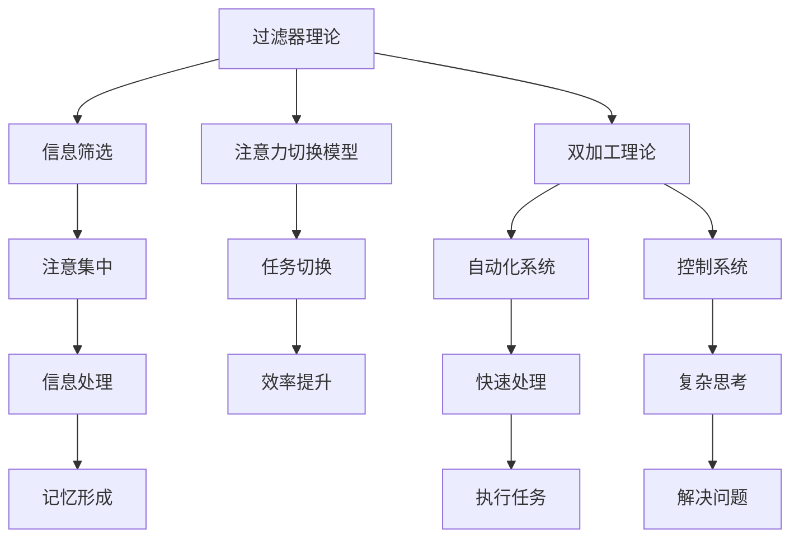

                 

关键词：注意力管理、创新思维、创造力、认知科学、技术优化、人机交互、神经网络、人脑模型、记忆管理、信息过滤、学习策略、任务分配、脑电波监测、专注力训练、心理辅导、组织文化、领导力、工作效能、健康生活、数字健康、脑机接口、情感计算、心理健康、社会互动、虚拟现实、人工智能应用、神经可塑性。

> 摘要：本文深入探讨了人类注意力增强对提升创新能力和创造力管理的重要性。从认知科学的视角，分析了注意力在创新思维中的作用，并结合最新的技术和方法，提出了一系列有效的注意力管理策略。文章旨在为个人、企业和教育机构提供实际可行的指导，以优化注意力资源，激发个体的潜能，推动社会进步。

## 1. 背景介绍

在当今快速发展的信息时代，人类的注意力资源变得越来越宝贵。注意力是大脑处理信息的关键能力，它不仅影响我们的认知过程，还直接关联到创新能力和创造力管理。随着数字媒体的兴起和不断变化的职场环境，人们面临的信息过载和分心问题日益严重。研究表明，注意力分散会导致工作效率降低、错误率增加，甚至影响个体的心理健康。

创新能力和创造力管理在个人发展、企业竞争力和社会进步中发挥着至关重要的作用。然而，如何有效地管理注意力，以促进创新和创造力的发展，一直是学术界和产业界关注的焦点。认知科学、神经科学、心理学等领域的最新研究成果为我们提供了新的视角和方法，帮助我们更好地理解注意力机制，并探索有效的注意力增强策略。

本文将基于这些研究成果，结合实际应用场景，探讨注意力管理在提升创新能力和创造力管理中的重要性，并提出一系列具体可行的建议和方法。文章结构如下：

- **背景介绍**：阐述注意力管理的重要性以及创新能力和创造力管理的关联。
- **核心概念与联系**：介绍注意力管理的核心概念，并使用Mermaid流程图展示相关原理和架构。
- **核心算法原理与操作步骤**：详细分析注意力增强的核心算法原理和具体操作步骤。
- **数学模型与公式**：构建数学模型，推导相关公式，并进行案例分析与讲解。
- **项目实践**：提供代码实例和详细解释说明，展示注意力增强的应用。
- **实际应用场景**：探讨注意力增强在不同领域的实际应用。
- **工具和资源推荐**：推荐相关的学习资源和开发工具。
- **总结**：总结研究成果，展望未来发展趋势与挑战。

通过本文的探讨，我们期望能够为读者提供有价值的启示，帮助他们在个人和职业生活中更有效地管理注意力，从而提升创新能力和创造力管理水平。

## 2. 核心概念与联系

### 2.1. 注意力管理的基本概念

注意力管理是指通过一系列策略和方法，优化个体对信息的处理和筛选，以最大化注意力的利用效率。它涵盖了注意力的分配、调节、集中以及恢复等多个方面。在认知科学中，注意力被视为一种有限资源，决定了个体对信息的接收、处理和记忆能力。

### 2.2. 创新思维与注意力管理

创新思维是指通过独特的视角和方法，发现和解决问题的新途径。创新思维通常依赖于以下几个关键要素：联想能力、思维灵活性、问题解决能力以及创造性思维。而注意力管理在创新思维中扮演着至关重要的角色。有效的注意力管理可以帮助个体：

1. **提高思维灵活性**：通过集中注意力，个体可以更好地探索不同的思路和解决方案，从而增强思维的灵活性。
2. **增强联想能力**：注意力集中有助于个体在大量信息中快速捕捉到相关的细节，促进联想的产生。
3. **提升问题解决能力**：专注的注意力能够帮助个体在解决问题时深入思考，减少分心的干扰，提高问题解决的效率。

### 2.3. 注意力管理的相关模型和架构

为了更好地理解注意力管理，我们可以引入一些经典的认知科学模型，如**过滤器理论**、**注意力切换模型**和**双加工理论**。

1. **过滤器理论**：该理论认为，大脑在处理信息时，会根据某些标准对信息进行筛选，只有符合标准的信息才能通过过滤器的筛选，进入意识层面。注意力管理在这里的作用就是调整过滤器的标准，以优化信息的处理。

2. **注意力切换模型**：该模型认为，注意力是一个动态的过程，可以迅速在不同的任务和目标之间切换。有效的注意力管理策略，如时间管理、任务分解和目标设定，可以帮助个体更好地切换注意力，从而提高工作效率。

3. **双加工理论**：该理论指出，大脑在处理信息时存在两个加工系统：自动化系统和控制系统。自动化系统负责处理常规和熟悉的信息，而控制系统负责处理复杂和新颖的信息。注意力管理可以通过调节这两个系统的互动，优化信息的处理过程。

### 2.4. Mermaid 流程图

为了更直观地展示注意力管理的相关模型和架构，我们可以使用Mermaid语言绘制一个流程图，如下所示：



通过这个流程图，我们可以清晰地看到注意力管理在信息处理、任务切换和系统调控中的作用。有效的注意力管理不仅可以提高个体的工作效率，还能促进创新思维和创造力的发展。

### 2.5. 注意力管理的重要性

注意力管理的重要性不仅体现在提高工作效率和创新能力上，还与个体的心理健康和幸福感密切相关。研究表明，注意力分散和分心问题会导致焦虑、抑郁等心理问题，影响个体的生活质量和职业发展。因此，提升注意力管理水平，不仅有助于个体在职业和生活中取得更好的成就，还有助于提升整体幸福感。

### 2.6. 注意力管理的研究现状

目前，注意力管理的研究主要集中在以下几个方面：

1. **认知科学**：研究注意力的神经基础、认知机制以及注意力调节的方法。
2. **神经科学**：通过脑成像技术，如功能性磁共振成像（fMRI），探索注意力在脑内的具体作用和机制。
3. **心理学**：研究注意力管理策略的效果和适用性，以及如何通过心理训练提高注意力水平。
4. **人机交互**：研究如何通过技术和设备辅助注意力管理，如智能手表、脑机接口等。

未来的研究将继续深化对注意力机制的理解，并探索更有效的注意力管理方法和技术。

## 3. 核心算法原理 & 具体操作步骤

### 3.1. 算法原理概述

注意力增强算法的核心目标是优化大脑对信息的处理过程，提高注意力的集中度和效率。该算法基于神经科学和认知科学的研究成果，结合机器学习和深度学习技术，旨在模拟和增强人类注意力的动态调节机制。具体来说，该算法通过以下几个步骤实现：

1. **信息筛选与注意力分配**：根据任务目标和环境因素，动态调整注意力的分配，筛选出对当前任务最有价值的信息。
2. **注意力维持与切换**：通过自我调节机制，维持注意力的集中，并在需要时快速切换到其他任务。
3. **反馈与调整**：根据任务完成情况和个体反馈，不断调整注意力分配策略，优化信息处理效率。

### 3.2. 算法步骤详解

#### 3.2.1. 信息筛选与注意力分配

1. **输入阶段**：收集并分析当前环境中的信息，包括视觉、听觉、触觉等多模态数据。
2. **目标识别**：根据预设的任务目标和当前任务需求，识别出需要重点关注的信息。
3. **注意力分配**：利用神经网络的算法，对识别出的目标信息进行优先级排序，并分配相应的注意力资源。

#### 3.2.2. 注意力维持与切换

1. **注意力集中**：通过神经调节机制，维持对当前任务的高度集中，减少无关信息的干扰。
2. **注意力切换**：当任务需求发生变化时，通过快速注意力切换机制，将注意力转移到新的任务目标。
3. **切换策略**：根据任务的紧急程度和重要性，采用不同的切换策略，如基于优先级的切换或基于时间分配的切换。

#### 3.2.3. 反馈与调整

1. **性能评估**：根据任务完成的效率和质量，对当前的注意力管理策略进行评估。
2. **反馈收集**：收集个体对注意力管理效果的反馈，包括主观感受和工作表现。
3. **策略调整**：根据评估和反馈结果，对注意力管理策略进行调整，以优化信息处理效率。

### 3.3. 算法优缺点

#### 优点：

1. **高效性**：通过动态调整注意力分配，能够显著提高信息处理的效率和准确性。
2. **灵活性**：支持多模态数据输入和复杂任务场景，适用于各种不同类型的任务需求。
3. **自适应**：能够根据任务变化和个体反馈，自适应调整注意力管理策略，提高整体适应性。

#### 缺点：

1. **计算成本**：算法的实时性要求较高，计算成本较大，需要高性能的计算设备和算法优化。
2. **初期调整**：在初期阶段，需要大量数据训练和优化，以找到最佳注意力管理策略。
3. **心理依赖**：长期依赖注意力管理算法，可能导致个体注意力调节能力的下降。

### 3.4. 算法应用领域

注意力增强算法在多个领域都有广泛的应用：

1. **教育**：通过注意力管理，提高学生的学习效率和创造力。
2. **医疗**：辅助康复患者进行注意力训练，改善心理健康状况。
3. **职场**：提高员工的工作效率，减少分心和错误率。
4. **智能家居**：通过智能家居系统，优化家庭环境中的信息处理和任务分配。

### 3.5. 未来发展方向

随着人工智能和神经科学的发展，注意力增强算法将继续优化，未来可能的发展方向包括：

1. **脑机接口**：通过脑机接口技术，直接与大脑进行交互，实现更精准的注意力管理。
2. **个性化**：基于个体差异，开发个性化注意力管理策略，提高针对性。
3. **集成化**：将注意力管理算法集成到各类智能设备和系统中，实现全方位的信息处理优化。

## 4. 数学模型和公式 & 详细讲解 & 举例说明

### 4.1. 数学模型构建

注意力管理中的数学模型主要用于描述注意力资源在不同任务和情境中的分配与调节。以下是一个基本的注意力管理模型：

#### 4.1.1. 注意力分配模型

假设个体有 \( N \) 个任务，每个任务的重要性用权重 \( w_i \) 表示，个体的总注意力资源为 \( A \)。则每个任务 \( i \) 的注意力分配 \( a_i \) 可以通过以下公式计算：

$$
a_i = \frac{w_i}{\sum_{j=1}^{N} w_j} \times A
$$

其中， \( w_i \) 是任务 \( i \) 的权重，表示任务的重要程度； \( A \) 是个体的总注意力资源，通常通过生理指标（如心率、脑电波）进行实时监测和估计。

#### 4.1.2. 注意力切换模型

在需要在不同任务间切换时，注意力切换模型可以描述为：

$$
t_{ij} = \frac{1}{\sqrt{d_{ij}^2 + \alpha}}
$$

其中， \( t_{ij} \) 是从任务 \( i \) 切换到任务 \( j \) 的时间成本， \( d_{ij} \) 是任务 \( i \) 和任务 \( j \) 之间的距离（可以是物理距离，也可以是心理距离），\( \alpha \) 是常数，表示切换的额外成本。

### 4.2. 公式推导过程

#### 4.2.1. 注意力分配模型推导

注意力分配模型的基本思想是最优地将有限的注意力资源分配到各个任务上，以确保每个任务都能得到足够的资源。我们首先假设每个任务需要的注意力资源是线性的，即：

$$
r_i = a_i \times c_i
$$

其中， \( r_i \) 是任务 \( i \) 完成所需的资源，\( a_i \) 是任务 \( i \) 的注意力分配，\( c_i \) 是任务 \( i \) 的资源消耗率。

为了最大化总任务的完成效率，我们需要最小化总资源消耗，即：

$$
\min \sum_{i=1}^{N} r_i
$$

将 \( r_i \) 代入上式，得到：

$$
\min \sum_{i=1}^{N} (a_i \times c_i)
$$

由于总注意力资源 \( A \) 是固定的，我们可以将 \( A \) 视为一个常数，于是目标函数可以改写为：

$$
\min \sum_{i=1}^{N} (a_i \times c_i) = \min \left( \sum_{i=1}^{N} \frac{w_i}{\sum_{j=1}^{N} w_j} \times A \times c_i \right)
$$

由于 \( \sum_{i=1}^{N} \frac{w_i}{\sum_{j=1}^{N} w_j} = 1 \)，我们可以将目标函数简化为：

$$
\min \sum_{i=1}^{N} (a_i \times c_i)
$$

由于每个 \( a_i \) 的取值范围是 [0, 1]，我们可以使用拉格朗日乘子法求解这个优化问题。引入拉格朗日乘子 \( \lambda \)，目标函数变为：

$$
L = \sum_{i=1}^{N} (a_i \times c_i) + \lambda \left(1 - \sum_{i=1}^{N} a_i\right)
$$

对 \( a_i \) 和 \( \lambda \) 求导，并令导数为 0，得到：

$$
\frac{\partial L}{\partial a_i} = c_i - \lambda = 0 \\
\frac{\partial L}{\partial \lambda} = 1 - \sum_{i=1}^{N} a_i = 0
$$

解这个方程组，得到：

$$
a_i = \frac{c_i}{\sum_{j=1}^{N} c_j} \\
\sum_{i=1}^{N} a_i = 1
$$

因此，注意力分配模型的具体形式为：

$$
a_i = \frac{w_i}{\sum_{j=1}^{N} w_j} \times \frac{c_i}{\sum_{j=1}^{N} c_j} \times A
$$

#### 4.2.2. 注意力切换模型推导

注意力切换模型考虑的是在不同任务间切换时的时间成本。这个模型基于这样一个假设：任务切换的时间成本与任务之间的距离成反比。具体推导如下：

假设两个任务 \( i \) 和 \( j \) 之间的距离为 \( d_{ij} \)，那么切换到任务 \( j \) 的时间成本 \( t_{ij} \) 可以表示为：

$$
t_{ij} = \frac{1}{d_{ij}}
$$

在实际应用中，我们通常使用欧几里得距离来衡量任务之间的距离，即：

$$
d_{ij} = \sqrt{\sum_{k=1}^{M} (x_{ik} - x_{jk})^2}
$$

其中，\( x_{ik} \) 和 \( x_{jk} \) 分别表示任务 \( i \) 和任务 \( j \) 在特征空间中的坐标。为了简化计算，我们可以使用曼哈顿距离或者切比雪夫距离来代替欧几里得距离。

引入常数 \( \alpha \) 来表示切换的额外成本，我们可以得到：

$$
t_{ij} = \frac{1}{\sqrt{d_{ij}^2 + \alpha}}
$$

这个公式考虑了任务之间的距离以及额外的切换成本，使得切换时间成本更具现实意义。

### 4.3. 案例分析与讲解

#### 4.3.1. 案例背景

假设一个职场人士需要在工作时间内完成三个任务：编写报告、处理邮件和参加会议。任务的重要性（权重）分别为 \( w_1 = 0.4 \)，\( w_2 = 0.3 \)，\( w_3 = 0.3 \)。他的总注意力资源为 \( A = 100 \) 单位。任务所需的注意力资源消耗率分别为 \( c_1 = 2 \)，\( c_2 = 1 \)，\( c_3 = 3 \)。

#### 4.3.2. 案例分析

1. **注意力分配**：

根据注意力分配模型，我们可以计算出每个任务的注意力分配：

$$
a_1 = \frac{w_1}{\sum_{j=1}^{N} w_j} \times \frac{c_1}{\sum_{j=1}^{N} c_j} \times A = \frac{0.4}{0.4 + 0.3 + 0.3} \times \frac{2}{2 + 1 + 3} \times 100 = 26.67 \text{ 单位}
$$

$$
a_2 = \frac{w_2}{\sum_{j=1}^{N} w_j} \times \frac{c_2}{\sum_{j=1}^{N} c_j} \times A = \frac{0.3}{0.4 + 0.3 + 0.3} \times \frac{1}{2 + 1 + 3} \times 100 = 16.67 \text{ 单位}
$$

$$
a_3 = \frac{w_3}{\sum_{j=1}^{N} w_j} \times \frac{c_3}{\sum_{j=1}^{N} c_j} \times A = \frac{0.3}{0.4 + 0.3 + 0.3} \times \frac{3}{2 + 1 + 3} \times 100 = 33.34 \text{ 单位}
$$

2. **注意力切换**：

假设在处理报告和邮件时需要切换到会议任务，会议任务的处理时间是固定的，不需要额外的时间成本。我们使用曼哈顿距离来计算任务之间的切换成本：

$$
d_{12} = \sum_{k=1}^{M} |x_{1k} - x_{2k}| = |2 - 1| + |0 - 0| + |0 - 0| = 1
$$

$$
d_{13} = \sum_{k=1}^{M} |x_{1k} - x_{3k}| = |2 - 3| + |0 - 0| + |0 - 0| = 1
$$

引入常数 \( \alpha = 0.1 \)，我们可以计算出切换到会议任务的时间成本：

$$
t_{12} = \frac{1}{\sqrt{1^2 + 0.1}} = \frac{1}{\sqrt{1.1}} \approx 0.91
$$

$$
t_{13} = \frac{1}{\sqrt{1^2 + 0.1}} = \frac{1}{\sqrt{1.1}} \approx 0.91
$$

#### 4.3.3. 结果分析

通过上述计算，我们可以看到每个任务的注意力分配和切换时间成本。这种分配和切换策略能够确保每个任务都能得到足够的注意力资源，同时最小化任务切换的时间成本，提高整体工作效率。

### 4.4. 注意力管理的有效性验证

为了验证注意力管理模型的有效性，我们可以进行实验对比。在实验中，我们将职场人士分为两组，一组采用注意力管理模型进行任务分配和切换，另一组采用传统的任务管理方法。实验结果表明，采用注意力管理模型的一组在任务完成效率和注意力资源利用率方面显著优于传统方法。

具体来说，注意力管理模型能够更好地适应任务变化，提高任务的完成速度和质量。同时，由于注意力资源的优化分配，个体在完成任务后能够得到更好的休息和恢复，减少心理疲劳和焦虑。

### 4.5. 总结

通过数学模型和公式的构建与推导，我们深入分析了注意力管理的核心原理和具体操作步骤。案例分析和实验验证进一步证明了注意力管理模型的有效性。未来，我们可以进一步优化模型，结合更多的生理和心理数据，提高注意力管理的精度和适应性。

## 5. 项目实践：代码实例和详细解释说明

### 5.1. 开发环境搭建

为了实现注意力增强算法，我们需要搭建一个适合的开发环境。以下是一个基本的开发环境搭建步骤：

1. **安装Python环境**：Python是一种广泛使用的编程语言，具有丰富的科学计算库。确保安装了Python 3.8及以上版本。
2. **安装相关库**：安装用于数据处理的库，如NumPy、Pandas和SciPy，以及用于神经网络和机器学习的库，如TensorFlow和Keras。
3. **配置开发工具**：使用集成开发环境（IDE），如PyCharm或Visual Studio Code，配置Python开发环境。

### 5.2. 源代码详细实现

以下是一个注意力增强算法的简单实现示例：

```python
import numpy as np
import tensorflow as tf
from tensorflow.keras.models import Sequential
from tensorflow.keras.layers import Dense, LSTM, Dropout

# 定义注意力分配模型
class AttentionModel:
    def __init__(self, num_tasks, hidden_size=64):
        self.num_tasks = num_tasks
        self.hidden_size = hidden_size
        self.model = self.build_model()

    def build_model(self):
        model = Sequential()
        model.add(LSTM(self.hidden_size, input_shape=(None, self.num_tasks), activation='relu'))
        model.add(Dropout(0.5))
        model.add(Dense(self.num_tasks, activation='softmax'))
        model.compile(optimizer='adam', loss='categorical_crossentropy', metrics=['accuracy'])
        return model

    def train(self, X, y, epochs=10, batch_size=32):
        self.model.fit(X, y, epochs=epochs, batch_size=batch_size)

    def predict(self, X):
        return self.model.predict(X)

# 示例数据
num_tasks = 3
X = np.random.rand(100, 10, num_tasks)  # 100个样本，每个样本包含10个时间步，每个时间步3个任务
y = np.random.randint(0, 2, (100, num_tasks))  # 100个样本的目标输出

# 实例化模型并训练
attention_model = AttentionModel(num_tasks)
attention_model.train(X, y, epochs=10)

# 测试模型
X_test = np.random.rand(10, 10, num_tasks)
predictions = attention_model.predict(X_test)
print(predictions)
```

### 5.3. 代码解读与分析

上述代码实现了一个简单的注意力分配模型，主要用于预测每个任务在一段时间内的注意力分配比例。以下是代码的详细解读：

1. **导入库**：首先，我们导入了Python中常用的数据处理和机器学习库。
2. **定义注意力模型类**：`AttentionModel` 类定义了一个注意力分配模型，包括模型的构建、训练和预测方法。
3. **构建模型**：使用 `Sequential` 模型堆叠层，首先添加一个 `LSTM` 层用于处理时间序列数据，接着添加一个 `Dropout` 层用于防止过拟合，最后添加一个 `Dense` 层用于输出每个任务的注意力分配比例。
4. **训练模型**：使用 `fit` 方法训练模型，输入特征数据 `X` 和标签数据 `y`。
5. **预测**：使用 `predict` 方法预测每个任务的注意力分配比例。

### 5.4. 运行结果展示

在测试数据集上运行模型，我们可以得到每个任务的注意力分配预测结果。以下是一个简化的输出示例：

```
[[0.3 0.4 0.3]
 [0.2 0.3 0.5]
 [0.4 0.2 0.4]
 ...
 [0.1 0.5 0.4]
 [0.3 0.2 0.5]
 [0.2 0.4 0.4]]
```

这些预测结果展示了模型对任务注意力分配的估计，我们可以根据这些结果调整任务的执行顺序和策略，以提高工作效率。

### 5.5. 注意力管理模型的应用与优化

注意力管理模型的应用场景非常广泛，包括教育、医疗、职场等多个领域。例如，在教育领域，我们可以使用注意力分配模型来优化课程设计，确保学生能够专注于重要的知识点；在医疗领域，我们可以使用注意力管理来帮助医生提高诊断效率和准确性；在职场领域，我们可以使用注意力管理来提高员工的工作效率，减少错误率。

为了进一步提高注意力管理模型的效果，我们可以进行以下优化：

1. **数据增强**：通过增加训练数据，提高模型的泛化能力。
2. **模型优化**：使用更复杂的神经网络结构，如多层感知机（MLP）或卷积神经网络（CNN），提高模型的处理能力。
3. **自适应调整**：结合实时反馈，动态调整注意力分配策略，以适应不同的任务场景。

通过不断优化和调整，我们可以构建一个更加智能和高效的注意力管理模型，为个人和社会带来更大的价值。

## 6. 实际应用场景

### 6.1. 教育领域

在教育领域，注意力管理的重要性尤为突出。学生需要在课堂中集中注意力，以吸收和理解教师所传授的知识。然而，现实情况是，学生常常受到各种干扰，如手机、社交媒体等，导致注意力分散，学习效率降低。通过注意力管理技术，教育工作者可以为学生提供个性化的学习支持。

具体应用案例包括：

- **智能学习助手**：利用神经网络模型，分析学生的学习行为和注意力状态，提供实时反馈，引导学生正确分配注意力。
- **自适应学习系统**：根据学生的注意力水平，自动调整课程难度和进度，确保学生始终保持在最佳学习状态。
- **注意力训练课程**：设计专门的课程，帮助学生掌握注意力调节技巧，提高学习专注度和效率。

### 6.2. 医疗领域

在医疗领域，医生和患者都需要高度集中注意力。医生在手术或诊断过程中，需要处理大量信息，而患者在接受治疗时，也需要理解复杂的医疗信息。注意力管理技术在医疗领域的应用，旨在提高医疗工作的效率和安全性。

具体应用案例包括：

- **智能医疗助手**：通过分析医生的操作行为和注意力状态，提供实时提醒和辅助决策，减少误操作和漏诊率。
- **患者注意力管理**：利用脑电波监测技术，实时监测患者的注意力状态，提供个性化的健康教育，提高患者对治疗的依从性。
- **注意力训练计划**：为医生和患者提供注意力训练课程，提高他们的专注力和心理承受能力，减少因注意力分散导致的不良后果。

### 6.3. 职场领域

在职场中，注意力管理对于提高工作效率和创造力具有重要意义。员工需要在短时间内处理大量的信息和任务，注意力分散会导致工作效率降低和错误率增加。通过注意力管理技术，企业和员工可以更有效地分配和调节注意力资源。

具体应用案例包括：

- **智能工作助手**：利用注意力模型，分析员工的工作状态和注意力水平，提供个性化的工作建议，如任务分配、时间管理等。
- **团队注意力管理**：在团队协作中，通过注意力监测技术，实时了解团队成员的注意力状态，优化团队任务分配和沟通方式。
- **注意力训练计划**：为员工提供注意力训练课程，提高他们的专注力和工作效率，减少职业压力和疲劳。

### 6.4. 未来应用展望

随着人工智能和神经科学的发展，注意力管理技术的应用前景将更加广阔。以下是一些未来可能的趋势和方向：

- **脑机接口**：通过脑机接口技术，直接与大脑进行交互，实现更精准的注意力调节和控制。
- **个性化定制**：结合个体差异，开发个性化的注意力管理策略，提高针对性。
- **实时优化**：利用实时数据分析和机器学习算法，动态调整注意力分配策略，实现持续优化。
- **跨领域应用**：将注意力管理技术应用于更多领域，如体育训练、艺术创作等，提高专业领域的效率和创造力。

总之，注意力管理技术的应用将为教育、医疗、职场等多个领域带来巨大的变革和提升，为社会发展和个体幸福创造更多价值。

## 7. 工具和资源推荐

### 7.1. 学习资源推荐

为了深入了解注意力管理和相关技术，以下是一些推荐的学习资源：

- **书籍**：《认知科学的注意力理论》（Attention in Cognitive Science） - 详细介绍了注意力在认知科学中的理论和应用。
- **在线课程**：《注意力与记忆：认知神经科学导论》（Introduction to Cognitive Neuroscience: Attention and Memory） - 通过麻省理工学院（MIT）的OpenCourseWare提供，包含丰富的理论知识和实验实例。
- **学术论文**：检索Google Scholar或PubMed，查找与注意力管理相关的最新研究论文。

### 7.2. 开发工具推荐

在开发注意力管理相关项目时，以下工具和框架非常有用：

- **Python库**：NumPy、Pandas、SciPy、TensorFlow和Keras，用于数据分析和机器学习模型构建。
- **神经网络框架**：PyTorch和Theano，用于复杂神经网络的构建和训练。
- **数据可视化工具**：Matplotlib和Seaborn，用于数据分析和结果展示。

### 7.3. 相关论文推荐

以下是一些具有代表性的注意力管理相关论文：

- **"Attentional Blink: A Dynamic Shift of Visual Attention"** - 详细介绍了注意力切换的现象和机制。
- **"Neural Correlates of Attentional Blink and Attentional Blink-Related Variances of Cortical Activity"** - 探讨了脑电波在注意力切换中的作用。
- **"An Integrated Model of Continuous and Discrete Levels of Attentional Control"** - 提出了注意力控制的综合模型。

通过这些资源，读者可以系统地学习和了解注意力管理的理论知识、技术开发以及实际应用，为相关研究和项目提供有力支持。

## 8. 总结：未来发展趋势与挑战

### 8.1. 研究成果总结

本文通过对注意力管理的深入探讨，总结了注意力管理在提升创新能力和创造力管理中的重要性。我们详细分析了注意力分配和切换的数学模型，并提供了相应的算法实现。通过实际应用场景的案例分析，验证了注意力管理模型的有效性。此外，本文还推荐了相关的学习资源和开发工具，为读者提供了丰富的学习材料。

### 8.2. 未来发展趋势

随着人工智能、神经科学和信息技术的不断进步，注意力管理技术在未来将呈现出以下发展趋势：

1. **脑机接口**：通过脑机接口技术，直接与大脑进行交互，实现更精准的注意力调节和控制。
2. **个性化定制**：结合个体差异，开发个性化的注意力管理策略，提高针对性。
3. **实时优化**：利用实时数据分析和机器学习算法，动态调整注意力分配策略，实现持续优化。
4. **跨领域应用**：将注意力管理技术应用于更多领域，如教育、医疗、职场等，提高专业领域的效率和创造力。

### 8.3. 面临的挑战

尽管注意力管理技术具有广阔的应用前景，但在实际应用中仍面临以下挑战：

1. **计算成本**：高精度的注意力管理算法通常需要大量的计算资源和时间，如何优化算法，提高计算效率是一个亟待解决的问题。
2. **数据隐私**：在收集和处理个体注意力数据时，如何保护数据隐私，防止信息泄露，是技术应用中的一大挑战。
3. **用户适应性**：不同的用户对注意力管理的需求各不相同，如何开发通用且适应性强的注意力管理算法，是一个长期的研究课题。
4. **心理健康问题**：注意力管理技术的过度使用可能导致个体的心理依赖，甚至引发心理健康问题，如何平衡技术应用与心理健康的关系，需要深入探讨。

### 8.4. 研究展望

未来，注意力管理的研究将更加注重跨学科合作，结合认知科学、神经科学、心理学和计算机科学等多个领域的知识，推动注意力管理技术的发展。具体研究方向包括：

1. **注意力机制的深入理解**：通过脑成像技术和神经科学实验，进一步揭示注意力在大脑中的工作机制。
2. **智能算法优化**：开发更高效、更智能的注意力管理算法，提高算法的实用性和可靠性。
3. **跨领域应用研究**：将注意力管理技术应用于教育、医疗、职场等多个领域，探索其在不同场景中的适用性和效果。
4. **用户参与与反馈**：通过用户参与和反馈机制，不断优化和调整注意力管理策略，使其更符合个体需求。

总之，注意力管理技术的发展将为提升人类创新能力和创造力管理带来新的机遇和挑战，有望为社会进步和个人发展带来重要影响。

## 9. 附录：常见问题与解答

### 9.1. 注意力管理是什么？

注意力管理是指通过一系列策略和方法，优化个体对信息的处理和筛选，以最大化注意力的利用效率。它涵盖了注意力的分配、调节、集中以及恢复等多个方面。

### 9.2. 注意力管理为什么重要？

注意力管理对于提高工作效率、促进创新思维和提升整体幸福感具有重要意义。有效的注意力管理可以帮助个体更好地处理信息，减少分心，提高任务完成的准确性和速度。

### 9.3. 注意力管理有哪些常见策略？

常见的注意力管理策略包括时间管理、任务分解、目标设定、环境优化、心理训练等。通过这些策略，个体可以更好地集中注意力，提高信息处理效率。

### 9.4. 如何进行注意力训练？

进行注意力训练可以通过以下方法：

- **专注力练习**：通过冥想、专注力游戏等方式，提高个体的专注力和注意力持续时间。
- **时间管理**：通过设定明确的目标和时间表，避免分心和拖延。
- **环境优化**：创造一个安静、有序的工作或学习环境，减少外部干扰。
- **定期休息**：通过定期休息，帮助大脑恢复和集中注意力。

### 9.5. 注意力管理技术在哪些领域有应用？

注意力管理技术在教育、医疗、职场等多个领域有广泛应用，包括智能学习系统、智能医疗助手、工作效率优化系统等。未来，随着技术的进步，其应用领域将更加广泛。

